= IELTS part 03
:toc: left
:toclevels: 3
:sectnums:
:stylesheet: ../../myAdocCss.css

'''

== part 3

==== flock, herd

[.small]
[options="autowidth" cols="1a,1a"]
|===
|Header 1 |Header 2

|Flock (一群)
|Flock 这个词##**几乎专门用于由牧羊人(shepherd) 管理和照看的动物。最典型的就是羊(sheep) 和山羊(goats)。此外，它也用于会飞的鸟类(birds)，以及基督教语境中的“会众”（由牧师照看）。**## +

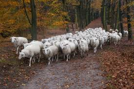
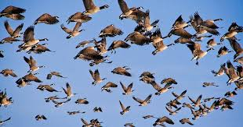

管理的动物 +
•   羊 (Sheep) - 最常见 +
•   山羊 (Goats) +
•   鸟 (Birds) - 如一群鹅(a flock of geese)、一群燕子(a flock of swallows) +
•   用于人：A flock of tourists (一群游客) - 带有比喻意味，暗示像羊群一样被引导。 +

管理者 +
•   Shepherd (牧羊人) +

例句 +

- The shepherd took his _flock of sheep_ to graze on the hillside.
(牧羊人带着他的一群羊到山坡上吃草。) +
- _A flock of geese_ flew (v.) overhead in a V-formation.
(一群鹅以V字形从头顶飞过。) +
- The priest *tends (v.)照料，照顾 to* _his flock (of parishioners 教区居民)_ every Sunday.
(每个星期日，牧师都会照料他的羊群（指教区居民）。) +

|Herd (一群)
|Herd **用于一群大型的、通常需要被驱赶或管理的食草动物。这些动物通常比羊更大、更强壮。**管理它们的人被称为牧人(herder) 或牛仔(cowboy)。 +

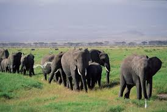
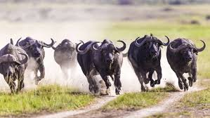

管理的动物 +
•   牛 (Cows / Cattle) - 最典型 +
•   大象 (Elephants) +
•   鹿 (Deer) +
•   马 (Horses) +
•   猪 (Pigs) +
•   鲸 (Whales) - 虽然生活在海里，但一群鲸鱼也常用 a pod of whales，有时也用 herd。 +
•   用于人：A herd of tourists (一群游客) - 比 flock 更暗示“盲从、缺乏个性”。 +

管理者 +
•   Herder (牧人) +
•   Cowboy (牛仔) +

例句 +
The cowboy rode (v.) alongside 在……旁边 _the herd of cattle_.
(牛仔骑在马背上，跟着那群牛。) +
We saw _a large herd of elephants_ at the waterhole.
(我们在水坑边看到一大群大象。) +
During the sale, shoppers *moved through the store* like _a herd of cattle_.
(大促销期间，购物者像一群牛一样在商店里移动。) -> 比喻，带贬义。 +
|===

核心区别一句话概括： +
•   Flock：**主要指一群羊或鸟，**有时也用于山羊，管理它们的人叫做 shepherd (牧羊人)。 +
•   Herd：**主要指一群大型食草动物（如牛、鹿、大象、马），**管理它们的人叫做 herder (牧人) 或 cowboy (牛仔)。 +

'''

==== throng, crowd

[.small]
[options="autowidth" cols="1a,1a"]
|===
|Header 1 |Header 2

|Crowd (人群)
|Crowd 是表示“一群人”最常用、最基础的词。*它泛指任何数量聚集在一起的人，#本身不带有特定的情感色彩或动态描述。它可以是大而安静的，也可以是喧闹的。#* +

特点 +
•   通用中性：适用于任何场合，从安静的观众到暴乱的 mob（暴民）。 +
•   强调状态：#*更侧重于“聚集”这一状态，而非动作。*# +
•   使用频率高：在日常对话和写作中极其常见。 +
•   可作动词：意为“拥挤；挤满”。 +

常见搭配与场景 +
•   A large crowd (一大群人) +
•   _A crowd of people_ (一群人) +
•   To crowd (v.) into a room (挤进一个房间) +
•   *To follow the crowd* (随大流) +

例句 +
_A crowd_ gathered (v.) to watch the street performance.
(一群人聚在一起观看街头表演。) -> 中性描述。 +
The crowd at the library was quiet and focused.
(图书馆里的人群安静而专注。) -> 人群可以是安静的。 +
We crowded (v.) around the screen to see the news.
(我们挤在屏幕周围看新闻。) -> 作动词使用。 +

|Throng (一大群；蜂拥)
|*Throng 是一个更具文学性、描绘性和动态感的词*。它特指一群密集的、**#经常处于运动中的、通常带有某种目的或急切情绪的人。#**它传递出一种“拥挤不堪”、“摩肩接踵”和“涌动”的生动画面。 +

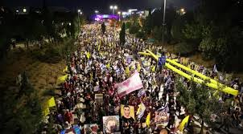

特点 +
•   文学性强：常用于小说、诗歌或新闻报导中，以增强画面感和感染力。 +
•   动态与密集：几乎总是暗示人群是密集的、移动的、充满活力的。 +
•   *情感色彩：常带有急切、兴奋、繁忙或压迫感的意味。* +
•   可作动词：意为“蜂拥；挤满”，*#比 crowd 更具动感。#* +

常见搭配与场景 +
•   The bustling (a.)熙熙攘攘的，忙乱的 throng (n.) (熙熙攘攘的人群) +
•   A throng of shoppers/fans/supporters (一大群购物者/粉丝/支持者) +
•   To throng (v.)蜂拥，群集 the streets (涌上街道) +

例句 +

- _A throng of eager shoppers_ thronged (v.) the stores on Black Friday.
(黑色星期五，一大群急切的购物者涌入了各家商店。) -> 名词和动词形式，均强调动态和密集。 +
- He disappeared into _the throng of commuters_ 通勤者；每日往返上班者 at the train station.
(他消失在火车站拥挤的通勤人流中。) -> 强调人群的密集和涌动。 +
- The gates opened /and _the throng_ (n.) surged (v.)蜂拥而至,奔腾,澎湃,汹涌 forward.
(大门打开，人群向前涌去。) -> 生动地描述了人群的移动。 +
|===

核心区别一句话概括： +
•   **Crowd：是一个通用、中性的词，**指任何数量聚集在一起的人，#*强调“数量多”和“聚集”的状态。*# +
•   **Throng：是一个更具文学色彩和动态感的词，**特指一群密集的、常常是移动中的、充满活力或急切的人，#*强调“拥挤”和“涌动”的态势。*# +

'''

==== beast, brute

[.small]
[options="autowidth" cols="1a,1a"]
|===
|Header 1 |Header 2

|Beast (野兽；畜生)
|Beast 的核心含义是动物，尤其是与人类相对立的大型或危险的野生动物（如熊、狼、狮子）。*用于人时，##它强调此人退化为动物状态，受本能和兽性驱动，##行为野蛮、残忍或非人。* +

侧重点 +
•   *兽性与本能：突出其动物般的原始本性。* +
•   野性力量：常带有一种原始、未驯化的力量感。 +
•   可指怪物：在神话或文学中，可指虚构的“怪兽”或“神兽”。 +

常见搭配与场景 +
•   Wild beast (野兽) +
•   Beast of burden (驮畜，如牛、马) +
•   You beast! (你这畜生！) - 骂人话，指责对方行为野蛮如禽兽。 +

例句 +
The lion is called _the king of beasts_.
(狮子被称为万兽之王。) -> 指动物。 +
After weeks in the wilderness, he looked like a wild beast.
(在荒野中待了几周后，他看起来像一头野兽。) -> 指人退化到动物状态。 +
The story is about a beast /that was turned into a handsome prince.
(这个故事讲的是一头被变成英俊王子的野兽。) -> 指虚构的怪兽。 +

|Brute (野兽；残忍的人)
|Brute 的核心含义是强调体力和暴力，**完全缺乏智慧、理性或情感。**它描述的是一种纯粹的、无情的、残忍的力量。*用于人时，指那些只靠蛮力、恃强凌弱、没有同情心和思考能力的人。* +

侧重点 +
•   暴力与残忍：*突出其##行为##的残酷性和攻击性。* +
•   **缺乏理性：**强调其完全受原始冲动驱使，毫无理智可言。 +
•   **纯粹的力量：**常指无意识的、机械的暴力。 +

.常见搭配与场景
•   Brute  (a.) force (蛮力) - 非常常见的搭配 +
•   _Brute (a.) strength_ (暴力) +
•   You mindless (a.) brute (n.)! (你这没脑子的野蛮人！) - 骂人话，指责对方残忍且无脑。 +

例句 +
They used _brute (a.) force_ to break down the door.
(他们用蛮力破门而入。) -> 指纯粹的物理力量。 +
He was a brute /who bullied everyone smaller than him.
(他是个暴徒，欺负所有比他弱小的人。) -> 指残忍的人。 +
The murder was an act of _sheer brute violence_.
(这起谋杀是纯粹的野蛮暴力行为。) -> 强调残忍性。 +
|===

核心区别一句话概括： +
•   Beast：强调兽性、野性，*指动物或像动物一样野蛮的人，#侧重于本性#。* +
•   Brute：强调暴力、残忍和缺乏理性，*指粗暴的人或其行为，#侧重于行为方式#。* +

'''

==== originate, derive, stem

[.small]
[options="autowidth" cols="1a,1a"]
|===
|Header 1 |Header 2

|Originate (起源于；创始)
|*##Originate 强调事物的"绝对起点"或"创始者"。它回答的是“某事物是从哪里、什么时候、由谁开始的？”这个问题。##它关注的是时间、地点或人物的根源。* +

侧重点 +
•   时间、地点或人物的起源：明确的起始点。 +
•   *创新与创造：常常意味着开创或发明。* +
•   中性或褒义：常用于描述思想、潮流、产品等的发端。 +

常用搭配 +
•   Originate in/from (起源于...) +
•   Originate with/from sb (由某人创立/发起) +

例句 +
*The idea originated from* a meeting between the two CEOs.
(这个想法起源于两位首席执行官的一次会面。) -> 强调想法的起点。 +
This style of painting originated in Florence /during the 15th century.
(这种绘画风格起源于15世纪的佛罗伦萨。) -> 强调时间和地点。 +
The company originated the use of this technology in consumer products.
(这家公司首创了将这项技术用于消费品。) -> 强调创始者。 +

|Derive (来源于；衍生)
|**Derive 强调从某个源头获取、形成或推论出某物。**它回答的是“这个东西是从哪里来的？是如何得到的？”这个问题。*它关注的是转化的过程，即一物基于另一物而形成。* +

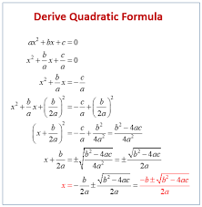

侧重点 +
•   获取与转化：从源头中提取、获得或形成新东西。 +
•   *#逻辑关系：常用于词源学、数学、化学和哲学，表示推导关系。#* +
•   愉悦或满足：Derive pleasure/satisfaction from... (从...中获得快乐/满足) 是固定搭配。 +

常用搭配 +
•   Derive from (来源于) +
•   Be derived from (由...衍生而来) +
•   Derive pleasure/satisfaction/benefit from (从...中获得快乐/满足/好处) +

例句 +
The word "biology" *is derived from* the Greek words "bios" and "logos".
(“biology”一词源于希腊词“bios”和“logos”。) -> 词源学的经典用法。 +
The chemical *is derived from* crude oil.
(这种化学品是从原油中提炼出来的。) -> 强调从原料中获取。 +
She *derives great joy from* helping others.
(她从帮助他人中获得巨大的快乐。) -> 固定搭配，表示获取抽象事物。 +

|Stem (源自于；由...造成)
|**#Stem 强调直接的因果关系，尤其是指问题、困难或负面情况产生的原因。它回答的是“这件事是由什么直接引起的？”这个问题。#**它像植物一样，表示一件事是另一件事的“茎干”（直接来源）。 +

侧重点
•   *直接起因：一件事直接导致另一件事，尤其是问题。* +
•   *常用负面：多用于描述问题、分歧、困难等的根源。* +
•   阻止：作动词时，stem 还有“阻止、遏制”的意思（如 stem the flow 遏制流动）。 +

常用搭配  +
•   Stem from (由...引起) +
•   Stem (v.) the tide/flow (阻止潮流/流动) +

例句 +
*Many of their problems stem (v.) from* a lack of communication.
(他们的许多问题源于缺乏沟通。) -> 典型用法，指出问题的直接原因。 +
*The disagreement stems (v.) from* a fundamental difference in opinion.
(分歧源于意见上的根本差异。) -> 直接因果关系。 +
The government *is trying to stem* (v.) the rise in violent crime.
(政府正试图遏制暴力犯罪的上升。) -> 作动词，表示“阻止”。 +
|===

核心区别一句话概括： +
•   Originate：强调根源、起点和创始，*指某事物最初开始或产生的地方、时间或人。* +
•   Derive：强调来源、获取和转化，*指从某处获得或形成（如名称、灵感、物质），尤指通过推理或分析。* +
•   Stem：*##强调直接起因和后果，##指某事直接由另一事引起（常指问题或负面事物）。* +

'''

==== descendant, offspring

[.small]
[options="autowidth" cols="1a,1a"]
|===
|Header 1 |Header 2

|Offspring (子女；孩子)
|Offspring 是一个生物学上中立的术语，指一个人的孩子或一个动物的幼崽。#*它强调的是一代（父母）与下一代（孩子）之间的直接繁殖关系。它通常不泛指孙辈或更远的后代。*# +

特点 +
•   *直接后代：通常只指子女，而不是孙辈或更远的后代。* +
•   生物学关系：强调血缘和繁殖的直接结果。 +
•   单复数同形：一个后代是 an offspring，多个后代也是 offspring (很少用 offsprings)。 +
•   用于人和动物：既可指人的孩子，也可指动物的幼崽。 +
•   正式或科学用语：*在日常口语中不如 children 或 kids 常用，更常用于正式、科学或幽默的语境。* +

例句 +
The couple have three offspring: two sons and a daughter.
(这对夫妇有三个孩子：两个儿子和一个女儿。) -> 指直接的子女。 +
Lions will fiercely *protect* (v.) their offspring *from* predators.
(狮子会拼命保护它们的幼崽免受捕食者伤害。) -> 指动物的后代。 +
As the offspring of two musicians, she was exposed to music /from birth.
(作为两位音乐家的孩子，她从出生就接触音乐。) -> 强调直接的血缘关系。 +

|Descendant (后代；子孙)
|*Descendant 指家族系谱中所有后来 generations 的人。一个人可以是父母、祖父母、曾祖父母等任何前辈的 descendant。它关注的是在家族历史长河中的位置。* +

特点 +
•   *所有后代：可以指子女、孙辈、曾孙辈等，覆盖所有后代。* +
•   系谱与历史：强调血脉的延续和传承，常用于历史、家谱或遗传语境。 +
•   可数名词：复数形式是 descendants。 +
•   常用于人：虽然也可用于动物，但最常用于人类家族。 +
•   与 Ancestor (祖先) 相对：你是你祖先的 descendant。 +

例句 +

- She is _a direct descendant_ of the famous writer Charles Dickens.
(她是著名作家查尔斯·狄更斯的__直系后裔__。) -> 指跨越很多代的后代。 +
- `主` Many people living in the Americas `系` are descendants of European immigrants.
(许多生活在美洲的人是欧洲移民的后代。) -> 指一个群体在历史中的传承。 +
- This royal family has countless descendants all over the world.
(这个王室家族在全世界有数不清的子孙。) -> 泛指所有后代。 +
|===

核心区别一句话概括： +
•   *Offspring：指##直系后代##，即子女，强调与父母一代的直接生物学关系。* +
•   **Descendant：指后代，可以是子孙、曾孙等任何后代，**强调在家族系谱中的位置。 +

'''

==== feed, breed

​​Feed​​ 的核心意思是 ​​“喂养；提供食物；输入”​​。它关注的是维持生命或运作的“过程”。 +
​​Breed​​ 的核心意思是 ​​“繁殖；培育；品种”​​。它关注的是产生后代的“结果”或特定的“类型”。

一个简单的记忆口诀：​​
​​先有 Feed（喂饱），才有 Breed（生宝）。

[.small]
[options="autowidth" cols="1a,1a"]
|===
|Header 1 |Header 2

|Feed (喂养；饲喂)
|“Feed” 主要作动词使用，表示给某人或某物提供食物。 +

•   及物动词 (vt.)：后接宾语，表示“喂...” +
    ◦   例句：She feeds her dog twice a day. (她每天喂狗两次。) +
    ◦   例句：It's my turn to feed the baby. (轮到我喂宝宝了。) +

•   不及物动词 (vi.)：动物“吃食；以...为食”，常与 on 连用。 +
    ◦   例句：Cows *feed on grass*. (牛以草为食。) +

•   引申义：提供养料、信息、资源等，使其增长或维持。 +
    ◦   例句：You need to feed the plants once a week. (你需要每周给植物施一次肥。) +
    ◦   例句：He fed the data into the computer. (他把数据输入了电脑。) +
    ◦   例句：Her anger fed on his silence. (他的沉默加剧了她的怒火。) +
•   名词 (n.)：饲料；动物的食料；一餐。 +
    ◦   例句：a bag of bird feed (一袋鸟食) +
简单记：Feed = 给吃的 +

|Breed (繁殖；品种)
|“Breed” 既可以作动词也可以作名词，含义都与“繁殖”和“种类”相关。 +

•   动词 (v.)： +
    1.  *（动物）交配繁殖，产仔*
        ▪   例句：Rabbits breed (v.) frequently. (兔子繁殖得很频繁。) +
    2.  饲养（动物），培育（植物）
        ▪   例句：He breeds tropical fish as a hobby. (他的爱好是饲养热带鱼。) +
    3.  #*引起，酿成（通常指不好的事情）*# -> 这是非常重要的引申义！ +
        ▪   例句：Poverty often *breeds (v.) crime.* (贫困常常**滋生犯罪**。) +
        ▪   例句：#*Familiarity breeds (v.) contempt (轻视，蔑视；忽视，不顾). ([谚语] 熟而生鄙。/ 距离产生美。*#) +

•   名词 (n.)：（动植物的）品种；类型 +
    ◦   例句：What breed (n.) is your dog? It's a Labrador. (你的狗是什么品种？是拉布拉多。) +
    ◦   例句：He is a new breed of politician. (他是新一代的政治家。) +

简单记：Breed = 生宝宝/是什么种 +

|===

'''

==== interbreed, hybridise

核心区别总结 +
•   Interbreed 的核心意思是 “杂交”，指不同亚群、品种或类型之间的交配繁殖。*它是一个描述事件或行为的##中性术语##，重点关注交配双方的关系。* +
•   Hybridise 的核心意思是 “杂交”，但更强调杂交后产生后代（杂交种）这一结果和过程。*它是一个##更具技术性的术语##，重点关注##遗传物质的结合##与结果。* +

简单来说： +
•   *Interbreed 重在描述 “谁和谁交配”。* +
•   *Hybridise 重在描述 “交配后产生了什么”。* +

[.small]
[options="autowidth" cols="1a,1a"]
|===
|Header 1 |Header 2

|Interbreed (杂交繁殖)
|#->  inter- (在...之间) + breed (繁殖)#

“Interbreed” 强调两个在某种意义上“不同”的个体或群体之间, 进行交配的行为或能力。 +
•   词源和焦点：*前缀 “inter-” 表示“在…之间”。因此，“interbreed” 的核心是 发生在不同群体“之间”的繁殖行为。* +

•   适用范围： +

1. 生物学/生态学：指不同亚种、种族、品种或种群之间的交配。 +
        ▪   例句：Lions and tigers can interbreed (v.) in captivity (n.)囚禁；被关, producing (v.) ligers 狮虎 or tigons 虎狮. (狮子和老虎在圈养环境下可以杂交，生出狮虎兽或虎狮兽。) +
        ▪   例句：The two subspecies  [生物] 亚种 have been separated (v.) for *so* long /*that* they no longer interbreed (v.). (这两个亚种已经分离了太久，它们不再杂交繁殖了。) +

2. *社会学（引申义）：指不同社会、种族或文化群体之间的通婚。* +
        ▪   例句：As societies become more open, different ethnic groups *interbreed (v.) more frequently*. (随着社会变得更加开放，不同的种族群体更频繁地通婚。) +

•   #*关键点：“Interbreed” 本身并不定义后代是否可育或健康，它只描述交配行为。*# +

|Hybridise (杂交)
|“Hybridise” 是一个**更侧重于结果和过程的术语，**指通过杂交产生兼具双亲特征的后代（即杂交种 Hybrid）。 +

词源和焦点：##**词根 “hybrid” 即“杂种”。**##因此，“hybridise” 的核心是 创造出一个“杂交种”的过程和结果。 +

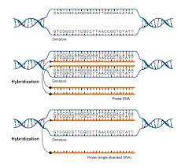

适用范围： +

1. 遗传学/育种学：这是一个非常技术性的术语，常用于描述有意为之的科学或农业实践，*旨在结合优良性状。* +
        ▪   例句：Scientists hybridised (v.) two varieties of wheat /to create a new strain /that is both high-yielding and disease-resistant. (科学家将两种小麦杂交，培育出一种既高产又抗病的新品种。) +
        ▪   例句：In the laboratory, we can hybridise (v.) _the DNA strands_ (DNA链) from different sources. (在实验室里，我们可以将不同来源的DNA链进行杂交。) -> 这里指分子水平的结合。 +
2. 园艺/农业：培育杂交植物。 +
        ▪   例句：This orchid is a hybridised cultivar (n.)培育品种，栽培变种 /that does not exist (v.) in the wild. (这种兰花是一种杂交培育品种，在野外并不存在。) +

关键点：*“Hybridise” ##强烈暗示了一种结合与创造的过程，##其目的或结果是产生具有混合特征的新实体。* +
|===

'''

==== plume, feather

核心区别总结 +
•   **Feather (羽毛): 指的是单一的、完整的羽毛，是鸟类身体上的基本组成部分。**它是一个基础、通用的术语。 + +
•   Plume (羽饰): 通常指的是一根（尤其是大型、华丽的那根）或一簇羽毛，**强调其装饰性、华丽的外观和用途。**它是一个更具体、更富文学性的术语。 +

简单来说：所有的 plumes 都可以被称为 feathers，但并非所有的 feathers 都适合被称为 plumes。#*Plume 是 feather 中那些特别漂亮、用于展示的“精英”。 +*#

[.small]
[options="autowidth" cols="1a,1a"]
|===
|Header 1 |Header 2

|Feather (羽毛)
|Feather 是一个基础的科学和通用术语，指鸟类身体上生长的结构。 +

特征: +
•   词性: 主要作名词，也可作动词（意为“长出羽毛”或“用羽毛装饰”）。 +
•   范围: 指任何鸟身上的任何一根羽毛，无论大小、形状、功能或美观程度。 +
•   功能: 强调其功能性，如用于飞行（飞羽）、保温（绒羽）等。 +
•   语境: 常用于生物学、日常对话和一般性描述中。 +

例句: +
•   The bird preened (v.) its feathers. (那只鸟用嘴整理它的羽毛。) +
•   A primary feather fell from the eagle's wing. (一根初级飞羽从鹰的翅膀上脱落。) +
•   The pillow is stuffed with goose feathers. (这个枕头里填充的是鹅毛。) +

|Plume (羽饰)
|*Plume 强调羽毛的##装饰性##和##视觉效果##，通常与华丽、优雅和装饰有关。*

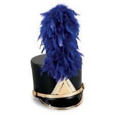

特征:
•   词性: 名词。 +
•   范围: 特指那些大型、蓬松、色彩鲜艳或形态优美的羽毛（如鸵鸟毛、孔雀羽毛、鹭羽等）。 +
•   功能: 强调其装饰性，用于求偶展示、头盔装饰、帽子饰物、服装点缀或仪式中。 +
•   语境: 常用于时尚、历史、文学和修辞中，比 feather 更富诗意和画面感。 +

例句: +
•   The knight's helmet *was adorned with* _a bright red plume_. (骑士的头盔上装饰着一根鲜红的羽饰。) +
•   A peacock displayed (v.) _its magnificent tail plumes_. (一只孔雀开屏，展示了它华丽的尾羽。) +
•   She wrote with _a quill 大翎毛；羽茎 pen_ /made from _a large goose plume_. (她用一根由大鹅羽毛制成的羽毛笔写字。) -- 这里即使强调书写工具，也因其较大且美观而可用 plume。 +
|===

'''

==== ox, bull

核心区别一句话概括： +
•   **Bull (公牛)：指##未阉割##的成年雄性牛，主要功能是配种繁殖，**以其力量和攻击性著称。 +
•   **Ox (阉牛；牛)：指##阉割后##的成年雄性牛，**经过训练后用于拉犁、拉车等劳役，以其耐力和温顺著称。 +

[.small]
[options="autowidth" cols="1a,1a"]
|===
|Header 1 |Header 2

|Bull (公牛)
|Bull 指的是完整的、##**有生殖能力**##的成年雄性牛。##**它的主要价值在于其繁殖能力，用于与母牛交配以生产后代。**##由于其睾丸激素水平高，公牛通常更具攻击性、难以预测和危险。 +

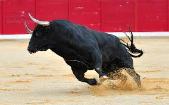

特点 +
•   性别与状态：成年、未阉割的雄性。 +
•   主要用途：配种繁殖。 +
•   性情：强壮、好斗、具有攻击性。 +
•   文化象征：常作为力量、财富和凶猛（如“像公牛一样强壮”）的象征。*西班牙的斗牛活动用的就是 bulls。* +
•   术语：是牛品种名称的标准部分，如“Angus bull”（安格斯公牛）。 +

例句 +
The farmer *keeps a bull* for breeding (v.) with his cows.
(农夫养了一头公牛用来和他的母牛配种。) +
Be very careful around that bull; it's known to be aggressive.
(靠近那头公牛要非常小心，它可是出了名的有攻击性。) +
The Bull is a symbol of _the Chicago Bulls_ basketball team.
(公牛是芝加哥公牛队的象征。) +

| Ox (阉牛；牛)
|Ox (复数：oxen) 指的是##**被阉割后**##的成年雄性牛。*阉割使其性情变得温顺、耐心、易于训练。它的主要价值在于其体力，被训练用来完成拉犁、拉车、碾谷等重体力农活。* +

特点 +
•   性别与状态：成年、已阉割的雄性。 +
•   *主要用途：干农活、负重（役用）。* +
•   **性情：温顺、耐心、**强壮、有耐力。 +
•   历史与文化：是传统农业中不可或缺的劳动力，常与艰苦、缓慢而稳定的工作联系在一起。这个词带有一种古朴、历史感的意味。 +
•   术语：*是一个工作分类，而不是一个品种。任何品种的阉割公牛都可以成为一头 ox。* +

例句 +
In the past,__ a team of oxen__ was used *to pull (v.) the plow* through the fields.
(在过去，人们用一队牛来拉犁耕地。) +
The ox is _a beast of burden_ 负重，负荷, known for its great strength and patience.
(阉牛是一种驮畜，以其巨大的力量和耐心而闻名。) +
The farmer trained the young ox /to respond to voice commands.
(农夫训练那头年轻的牛听从声音指令。) +
|===

'''

==== falcon, hawk, eagle

核心区别一句话概括： +
•   **Eagle (雕)：最大、最强壮的猛禽，**以其巨大的体型、力量和钩状巨喙著称，*是力量和权威的象征。* +
•   Hawk (鹰)：**中型猛禽，**通常指在森林或开阔地带主动追逐猎物的鹰，是敏捷的猎手。 +
•   **Falcon (隼)：以极快的俯冲速度闻名，**翅膀尖长，常在开阔地捕猎，是空中的“战斗机”。 +

[.small]
[options="autowidth" cols="1a,1a"]
|===
|Header 1 |Header 2

|Eagle (雕)
|##**Eagle 是这三种中体型最大、最强壮的猛禽。它们是力量和威严的象征，常见于国徽、旗帜（如美国国鸟白头海雕）。**##它们拥有巨大的钩状喙和强壮的爪子，可以捕食较大的猎物。 +

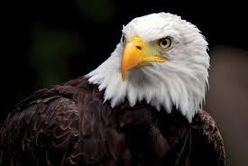

特征 +
•   体型：最大。 +
•   翅膀：宽大，适合翱翔。 +
•   头部：通常较大，喙巨大且呈钩状。 +
•   捕猎方式：利用力量和突袭捕捉较大的猎物（如鱼、哺乳动物、其他鸟类）。 +
•   栖息地：常 near 水域（海雕）或山地。 +

例子 +
•   Bald Eagle (白头海雕) +
•   Golden Eagle (金雕) +
•   Harpy Eagle (角雕) +

例句 +
The eagle soared (v.) high above the mountains, searching (v.) for prey.
(那只雕在高山上空翱翔，寻找猎物。) +
The eagle's powerful talons 爪 can easily catch (v.) a fish from the water.
(雕强有力的爪子可以轻松地从水中抓起鱼。) +

|Hawk (鹰)
|**Hawk 是一个比较泛的术语，通常指##中型##的鹰科猛禽。#它们比雕小，但比隼大且壮实。#**它们是敏捷的猎手，常在林地或开阔地带主动追逐和捕捉猎物。 +

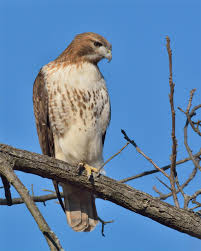

特征 +
•   体型：中等。 +
•   翅膀：相对较宽，较短，适合在树林中灵活穿梭。 +
•   捕猎方式：常利用突袭或短距离追逐在陆地上捕捉小型动物（如啮齿动物、小鸟、昆虫）。 +
•   栖息地：森林、田野、郊区。 +

例子 +
•   Red-tailed Hawk (红尾鵟) +
•   Cooper's Hawk (库氏鹰) +
•   Goshawk (苍鹰) +

例句 +

- A hawk was circling (v.) above the field, looking for mice.
(一只鹰在田野上空盘旋，寻找老鼠。) +
- The hawk *swooped  (v.)俯冲；突然袭击；（尤指鸟）猛扑；（非正式）猛地抓起 down* from its perch （鸟的）栖木，栖枝；高处，高位 and grabbed (v.) a squirrel.
(那只鹰从栖木上猛扑下来，抓住了一只松鼠。) +

|Falcon (隼)
|**Falcon 以其惊人的俯冲速度（时速可达300公里以上）而闻名，是空中的“速度之王”。**它们拥有标志性的尖长翅膀和流线型身体，非常适合高速飞行。 +

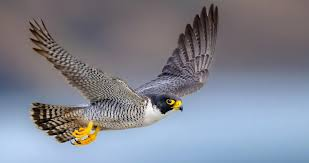
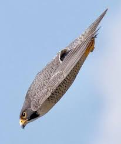

特征 +
•   *体型：通常较瘦长，是三者中相对较小的。* +
•   翅膀：长而尖，像镰刀。 +
•   捕猎方式：常在开阔空域飞行，发现猎物后收拢翅膀进行高速俯冲，用爪子击晕或杀死猎物（主要是其他鸟类）。 +
•   特殊特征：上喙有一个明显的齿状突起（称为“隼牙”）。 +
•   与人类的关系：是猎鹰术 (falconry) 中最常用的鸟类。 +

例子 +
•   Peregrine Falcon (游隼) - 世界上飞得最快的鸟 +
•   Kestrel (红隼) +
•   Gyrfalcon (矛隼) +

例句 +

- The falcon dove (v.) at incredible speed /to strike a duck in mid-air.
(那只隼以惊人的速度俯冲，击中了空中一只鸭子。) +
- In falconry (n.)放鹰捕猎；训鹰术, a falcon is trained /to return to its handler's 处理者；管理者；拳击教练；（犬马等的）训练者 glove.
(在猎鹰术中，隼被训练返回驯鹰人的手套上。) +
|===

一个简单的记忆方法 +
•   Eagle (雕)：想到 “大” (Big) 和 “猛” (Powerful)，像空中霸主。 +
•   Hawk (鹰)：想到 “中” (Medium) 和 “追” (Chase)，像森林猎手。 +
•   Falcon (隼)：想到 “快” (Fast) 和 “尖” (Pointy)，像空中战斗机。 +

'''

==== mouse, rat

在中文里可能都被称为“老鼠”，但在英语中，它们是两种不同的动物，区别很大。这些区别包括生物学分类、体型、外貌、习性以及文化含义。 +

核心区别一句话概括： +
•  ** Mouse (小鼠)：通常指##小型、可爱、尾巴细长##有毛的鼠类，在文化中可能形象偏中性甚至可爱（如米老鼠）。** +
•   *Rat (大鼠)：指##中大型、##强壮、##尾巴粗长##无毛的鼠类，在文化中##几乎总是与肮脏、疾病和破坏等负面意象相关联。##* +

[.small]
[options="autowidth" cols="1a,1a"]
|===
|Header 1 |Header 2

|Mouse (小鼠；家鼠)
|Mice (复数) **通常体型较小，外表看起来相对“可爱”一些。**它们通常生活在离人类居所很近的地方（如墙内、橱柜后），但更倾向于躲藏，不那么引人注目。 +

特征 +
•   体型：较小，通常约5-10厘米长（身体），加上一条长尾巴。 +
•   头部：头部相对身体较大，鼻子更尖，耳朵更大更圆。 +
•   尾巴：尾巴细长，但覆盖有短毛，看起来没那么突兀。 +
•   习性：食量小，更胆小谨慎。被认为是“窥探者”和“偷吃者”，而非明目张胆的破坏者。 +

文化意象 +
•   *偏中性或可爱：最著名的形象是迪士尼的米老鼠 (Mickey Mouse)。也可以是实验室里的小白鼠 (lab mouse) 或宠物鼠 (pet mouse)。* +

例句 +
We set traps /to catch the mice /that were getting into the pantry  餐具室；食品室；食品储藏室.
(我们放了陷阱来抓跑进食品室的小鼠。) +
The cartoon character Mickey Mouse /is loved by children worldwide.
(卡通角色米老鼠深受全世界儿童的喜爱。) +

|Rat (大鼠；耗子)
|Rats (复数) *体型更大，更强壮，给人的感觉更“凶猛”。它们与人类的冲突更直接，因其破坏力和传播疾病的能力而臭名昭著。* +

特征 +
•   体型：更大、更重，身体可达25厘米以上，加上一条更长的尾巴。 +
•   头部：头部更粗壮，鼻子更钝，耳朵较小。 +
•   尾巴：尾巴更粗、更长，几乎完全无毛，看起来像鳞片覆盖的，视觉上更令人不适。 +
•   习性：食量大，更具攻击性，适应力极强。是明目张胆的破坏者。 +

文化意象 +
•   *极其负面：是瘟疫、肮脏、背叛与贫穷的象征。英语中说某人“a rat”意味着他是卑鄙小人、叛徒。但也象征着顽强的生存能力（如“下水道里的耗子”）。* +

例句 +
- The docks *were infested (v.)害虫、野兽大批出没于；遍布于 with* huge rats.
(码头上到处都是巨大的耗子。) +
- He's such a rat! He told the teacher everything.
(他真是个叛徒！他什么都告诉老师了。) -> 骂人话，意指卑鄙小人。 +
- The city has a rat problem /in its subway system.
(该城市的地铁系统存在鼠患。) +
|===

'''

== other

[.small]
[options="autowidth" cols="1a,1a"]
|===
|Header 1 |Header 2

|paw
|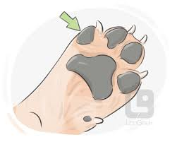

|seal
|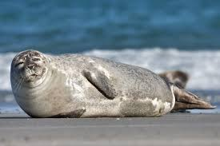

|tortoise
|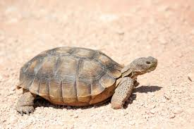

|whale
|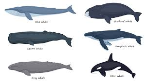

|cub
|1.
[ C]a young bear , lion , fox , etc.（熊、狮、狐狸等的）幼兽，崽 +
•a lioness /guarding (v.) her cubs 守护幼崽的母狮 +

2.the Cubs ( BrE ) ( US also the ˈCub Scouts ) [ pl.]a branch of _the Scout Association_ 童子军协会 /for boys between the ages of eight and ten or eleven 幼童军（八至十或十一岁的男孩组成的童子军的一部分） +
•*to join (v.) the Cubs* 参加幼童军 +

3.Cub ( also ˈCub Scout ) [ C]a member of the Cubs 幼童军成员 +

-> 词源不详。可能来自cub-,躺下，词源同incubation,孵卵，孵化。

image:img/Cub.jpg[,15%]
image:img/Cub 2.jpg[,15%]

|calf
|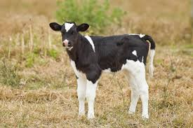

|pup
|1.= puppy
小狗，幼犬；（海豹等的）幼崽

2.a young animal of various species (= types) 幼小动物 +
•a seal pup一只小海豹

*SELL SB/BUY A PUP* : +
( old-fashioned) ( BrE informal ) to sell sb or be sold sth that has no value or is worth much less than the price paid 卖给…（或买到）伪劣货

|sparrow
|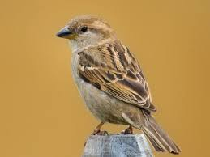

|
|
|===

