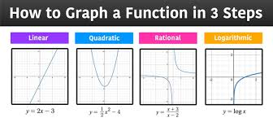
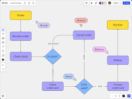
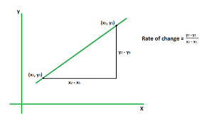
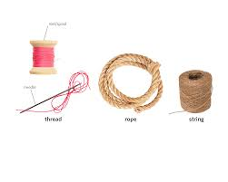
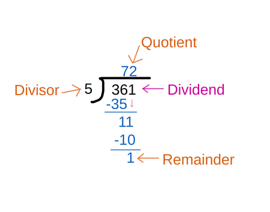
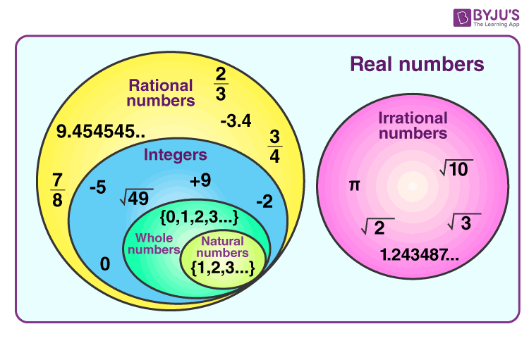
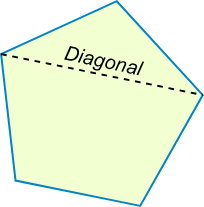
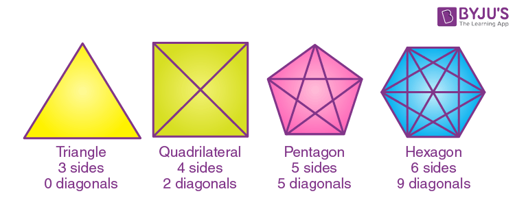

= IELTS part 05
:toc: left
:toclevels: 3
:sectnums:
:stylesheet: ../../myAdocCss.css

'''

== part 5

==== intelligent, clever, smart

[.small]
[options="autowidth" cols="1a,1a"]
|===
|Header 1 |Header 2

|Intelligent
|**Intelligent** (聪明的，有才智的) ##是一个最正式、最广泛的词，##通常指一个人或事物具有**学习、理解、推理、解决问题和适应新环境**的综合能力。#它更侧重于**理论知识、深度思维**和**逻辑分析**能力。#

**综合能力：** 强调全面的心智能力和认知水平。

**侧重点：** 深度、逻辑、学习和适应能力。

**用法示例：** +
* An **intelligent** person can analyze (v.) complex data /and draw logical conclusions. (一个有才智的人, 可以分析复杂数据, 并得出合乎逻辑的结论。) +
* We are trying to build an **intelligent** AI system /that can learn from its mistakes. (我们正在努力构建一个能从错误中学习的智能人工智能系统。)

|Clever
|**Clever** (聪明的，机智的) #通常指一个人或事物在特定情境下，能够**快速、巧妙地找到解决问题的方法**。它更侧重于**机智、独创性**和**灵活性**，有时可能带有“耍小聪明”的贬义色彩。#

**技巧性/机智：** 强调在特定问题上的##灵敏反应和巧妙手法。##

**侧重点：** 快速、巧妙、新颖的方法。

**用法示例：** +
* He came up with a **clever** solution /to bypass (v.) the security system. (他想出了一个巧妙的办法, 来绕过安全系统。) +
* It was a **clever** move /to use that old trick. (利用那个老把戏是个聪明的举动。)

|Smart
|**Smart** (聪明的，伶俐的) 是一##个最常用、最口语化的词，##可以用来形容一个人或事物**在学习上、社交上或日常生活中表现出的聪明才智**。#它的含义介于 *intelligent* 和 *clever* 之间，既可以指知识渊博，也可以指反应敏捷。#

**通用性：** 适用于各种日常和非正式语境。

**侧重点：** 学习能力、反应速度和实际应用。

**用法示例：** +
* She is a very **smart** student /who always gets good grades. (她是一个很聪明的学生，总是得高分。) +
* It was a **smart** decision /to invest (v.) in that company. (投资那家公司是个明智的决定。)
|===

总结

[cols="1,1,1,1",options="header"]
|===
| 词语 | 含义和侧重点 | 用法语境 | 核心概念
| Intelligent | 综合才智、深度思维 | 正式、学术 | 深度、逻辑、适应
| Clever | 机智、巧妙、灵活性 | 日常、非正式 | 技巧、灵敏、新颖
| Smart | 学习能力、反应迅速 | 口语、通用 | 广泛、实用
|===

简单来说，你可以用一个比喻来区分这三个词： +
* 一个 **intelligent** 的人是**一个优秀的科学家**，他能理解复杂的理论，并解决宏大的难题。 +
* 一个 **clever** 的人是**一个高明的魔术师**，他能用出人意料的巧妙方法来解决眼前的困境。 +
* 一个 **smart** 的人是**一个好学生或成功的商人**，他能快速学习新知识，并做出明智的决定。

'''

==== genius, elite

[.small]
[options="autowidth" cols="1a,1a"]
|===
|Header 1 |Header 2

|Genius
|**Genius** (天才) 这个词指的是一种**非凡的、与生俱来的智力或创造力**，远超常人。这个词##强调的是**个人天赋和内在能力**，通常与**创新、突破性思想, 或极高的智商**相关。##一个 **genius** #往往能在某个领域产生根本性的变革。#

**个人特质：** 强调个人的天赋、智力水平。

**侧重点：** 非凡的、超越常人的智力或创造力。

**用法示例：** +
* Albert Einstein is considered a scientific **genius**. (阿尔伯特·爱因斯坦被认为是一位科学天才。) +
* She has a **genius** /for composing (v.) music /that touches (v.) people's hearts. (她在创作能打动人心的音乐方面, 很有天赋。)

|Elite
|**Elite** (精英) 这个词##指的是一个**群体**，他们因其**高超的技能、社会地位、财富或权力**而在特定领域或社会中处于顶尖位置。这个词强调的是**社会地位和群体身份**，##通常是通过努力、教育或出身而获得的。#一个 **elite** 成员是某个领域中的佼佼者。#

**群体身份：** 强调属于某个顶尖的社会或专业群体。

**侧重点：** 杰出的表现、地位、技能或特权。

**用法示例：** +
* The university only accepts (v.) students from an **elite** group of high schools. (这所大学只接受来自少数精英高中的学生。) +
* They are part of the financial **elite** /who control (v.) the country's economy. (他们是控制国家经济的金融精英的一部分。)
|===

总结

[cols="1,1,1,1",options="header"]
|===
| 词语 | 含义和侧重点 | 指代对象 | 核心概念
| Genius | 非凡的个人天赋 | 个人 | 天赋与创造力
| Elite | 顶尖的群体成员 | 群体 | 地位与成就
|===

简单来说，这两个词的区别在于： +
* **Genius** 描述的是一个人的**内在特质**，即他有多么聪明或有创造力。 +
* **Elite** 描述的是一个人在社会或某个领域中的**外在地位**，即他有多么成功或有特权。 +
* 一个 **genius** 可能会成为 **elite**，但并非所有 **elite** 都是 **genius**。

'''

==== excellent, outstanding

[.small]
[options="autowidth" cols="1a,1a"]
|===
|Header 1 |Header 2

|Excellent
|**Excellent** (杰出的，优秀的) 是一个广泛使用的形容词，用来表示**非常高水平的、质量上乘的**。它通常用来评价某人或某物的表现、品质或能力，表示其达到了或超过了**预期标准**。这个词是一个通用的、积极的赞扬，#强调的是**质量和卓越**。#

**通用性：** 适用于各种领域，包括工作、学习、产品等。

**程度：** 强调**高水平**，通常表示“非常好”或“一流”。

**用法示例：** +
* Her performance in the final exam `系` was **excellent**. (她在期末考试中的表现非常出色。) +
* The restaurant **received excellent reviews** from customers. (这家餐厅收到了顾客的极好评价。) +
* You did **an excellent job** on this project. (你在这个项目上做得非常出色。)

|Outstanding
|##**Outstanding** (杰出的，突出的) 这个词比 *excellent* 更进一步，##它强调某人或某物的表现或成就**非常突出，显著地优于**同类事物。这个词的字面意思是“站在外面”，暗示其表现**引人注目，脱颖而出**。它通常用于表示一种罕见的、值得特别关注的杰出。

**独特性：** 强调**超越同类**的卓越表现。

**程度：** 表示**非常突出，非同寻常**。

**用法示例：** +
* The team's research was so **outstanding** that it won a national award. (这支团队的研究非常出色，以至于赢得了国家奖项。) +
* She is an **outstanding** musician who has won many international competitions. (她是一位杰出的音乐家，赢得了许多国际比赛。) +
* His contribution to the company was truly **outstanding**. (他对公司的贡献确实是杰出的。)
|===

总结

[cols="1,1,1,1",options="header"]
|===
| 词语 | 含义和侧重点 | 程度 | 核心概念
| Excellent | 达到或超过高标准 | 高水平 | 卓越的质量
| Outstanding | 显著优于同类事物 | 极其突出 | 脱颖而出
|===

简单来说，你可以用一个评分系统来理解这两个词： +
* 如果满分是100分，##**excellent** 可能是95分，##表示“非常出色”。 +
* ##**Outstanding** 可能是100分，甚至是105分，##表示“**太**出色了，完全超越了预期”。

'''

==== prestige, reputation

[.small]
[options="autowidth" cols="1a,1a"]
|===
|Header 1 |Header 2

|Prestige
|**Prestige** (声望，威望) 指的是一种基于**成就、成功、地位和卓越**而赢得的**受人尊敬和钦佩**的感觉。这个词##强调的是**社会地位、影响力和崇高感**，##通常与长时间积累的杰出成就相关。它是一种积极的、受人仰慕的社会认可。

**主观感受：** 强调**仰慕、尊敬**的情感。

**来源：** 来源于卓越的成就、高贵的地位或强大的影响力。

**用法示例：** +
* The university has great **prestige** in the academic world. (这所大学在学术界享有盛誉。) +
* His family name carries a lot of **prestige**. (他的姓氏带有很高的威望。) +
* Winning (v.) the Nobel Prize is the ultimate (a.)最终的，最后的；最根本的，最基础的；极限的，终极的 mark of **prestige** for a scientist. (获得诺贝尔奖是科学家声望的终极标志。)

|Reputation
|##**Reputation** (名声，声誉) 指的是**公众对某人、某物或某机构的普遍看法或评价。这个词是中性的，可以指好的名声，也可以指坏的名声。**##它强调的是**公众的认知和评价**，通常是基于其过去的行为、品质或表现。

**公众认知：** 强调**大众的普遍看法**。

**来源：** 来源于过去的行动、行为或表现，可以是好是坏。

**用法示例：** +
* The company has a **reputation** for making high-quality products. (这家公司以生产高质量产品而闻名。) +
* His **reputation** was ruined /after the scandal. (丑闻发生后，他的名声被毁了。) +
* `主` Building a good **reputation** `谓` takes years, but `主` losing it `谓` can take seconds. (建立好名声需要数年，但失去它可能只需几秒。)
|===

总结

[cols="1,1,1,1",options="header"]
|===
| 词语 | 含义和侧重点 | 性质 | 核心概念
| Prestige | 基于成就的尊敬和崇拜 | #积极、崇高# | 威望与地位
| Reputation | 公众的普遍看法或评价 | #中性（可好可坏）# | 名声与认知
|===

简单来说，这两个词的区别在于： +
* **Prestige** 是一个**积极的、精英化的词**，它指的是因卓越而获得的尊敬和威望。 +
* **Reputation** 是一个**中性的、大众化的词**，它指的是公众对你的普遍看法，可以是好也可以是坏。
* 一个享有 **prestige** 的人或机构，一定有很好的 **reputation**，但一个有好的 **reputation** 的人或机构，不一定有 **prestige**。

'''

==== esteem, respect

[.small]
[options="autowidth" cols="1a,1a"]
|===
|Header 1 |Header 2

|Esteem
|**Esteem** (敬重，尊重) 指的是对某人或某物的**高度尊重、钦佩和赞赏**，#这种感觉通常是基于其**内在的价值、品质或美德**。它是一种**深层次的情感**，类似于“钦佩”或“推崇”，并且常常与自我价值感 (self-esteem) 相关联。#

**主观情感：** 强调内心的情感和判断。

**来源：** #基于内在的价值、人格、道德品质或卓越的成就。#

-> 来自拉丁语aestimare, 估计，评估，判定价值，来自aes, 铜，词源同ore, -tim, 砍，切，词源同anatomy. 原指铸造铜币，估计并判定币值，该词义见estimate.同时，引申义尊重，尊敬，即值得一看的，值得考虑的。

**用法示例：** +
* She is held (v.) **in high esteem** by her colleagues /for her integrity and kindness. (她因其正直和善良, 而受到同事们的高度敬重。) +
* The teacher **has a great deal of esteem** (n.) for his students' creativity. (这位老师非常敬重学生的创造力。) +
* A person's self-**esteem** is how they value themselves. (一个人的自尊是他们如何评价自己。)

|Respect
|**Respect** (尊重) 是一个更广泛、更基础的词，指的是对某人或某物的**承认、认可和重视**。##这种尊重可以基于其**地位、成就、权利、品质**##或仅仅是因为他们是人。它既可以是一种**情感**，也可以是一种**行为**，强调的是**承认和不侵犯**。

**态度与行为：** 强调对他人地位、权利的承认，以及相应的行为表现。

**来源：** #可以基于地位、成就、或普遍的人权。#

->  #re- (再次) + spect- (看)#

**用法示例：** +
* We should **respect** the opinions of others, even if we disagree. (我们应该尊重他人的意见，即使我们不同意。) +
* She has earned the **respect** of her peers through hard work. (她通过努力工作赢得了同龄人的尊重。) +
* The students show great **respect** for their elderly teacher. (学生们对他们的年长老师表现出极大的尊重。)
|===

总结

[cols="1,1,1,1",options="header"]
|===
| 词语 | 含义和侧重点 | 深度 | 核心概念
| Esteem | 基于内在价值的深层敬重 | 深层次情感 | 钦佩与推崇
| Respect | 对他人地位、权利的承认和重视 | 基础性态度或行为 | 认可与不侵犯
|===

简单来说，你可以用一个层次关系来理解这两个词： +
* **Respect** 是一个**更基础、更普遍**的词，是对他人的基本认可。 +
* **Esteem** 是 **Respect** 的一个**更高层次、更深层次**的形式，它包含了钦佩和赞赏的情感。 +
* #你可以 **respect** 一个你不同意的人的权利和观点，但你只有在你**钦佩**他的品质时才会对他产生 **esteem**。#

'''

==== headmaster, principal, dean

[.small]
[options="autowidth" cols="1a,1a"]
|===
|Header 1 |Header 2

|Headmaster / Headmistress
|**Headmaster** (男校长) 或 **Headmistress** (女校长) 是一个传统且正式的词汇，##主要用于**英国**及一些英联邦国家的**私立中小学**。这个词强调的是对学校**全面性的领导**，包括学术、行政和纪律方面，##具有很强的权威性和传统感。

**地理/文化：** 主要用于英国及英联邦国家的私立学校。

**侧重点：** 传统、权威、对学校的全面领导。

**用法示例：** +
* The **headmaster** of Eton College is a very respected figure. (伊顿公学的校长是一位备受尊敬的人物。) +
* The **headmistress** gave a speech to all the students at the morning assembly. (女校长在早会时向所有学生发表了讲话。)

|Principal
|##**Principal** (校长) 是一个在美国、加拿大##以及许多其他国家最常用的词汇，##用来指**中小学的最高行政负责人**。这个词更侧重于**行政管理**和日常运作，##是学校的最高决策者和管理者。

**地理/文化：** 主要用于美国、加拿大等国家的公立和私立中小学。

**侧重点：** 行政管理、日常运作和最高决策权。

**用法示例：** +
* The **principal** announced that /the school would be closed due to snow. (校长宣布学校因下雪而停课。) +
* She went to the **principal's** office /to discuss her son's behavior. (她去了校长办公室讨论她儿子的行为。)

|Dean
|#**Dean** (院长，系主任) 是一个主要用于**大学或学院**的词汇。它指的是一个**特定学院、学部或专业的负责人**，例如“文学院院长”或“医学院院长”。虽然地位很高，但其权限范围通常**局限于其所负责的学院或学部**，而不是整个大学。#

**地理/文化：** 主要用于高等教育机构，如大学和学院。

**侧重点：** 负责特定学院、系或学部的学术和行政工作。

**用法示例：** +
* He is the **dean** of the Faculty of Science. (他是理学院院长。) +
* The students met with the **dean** of student affairs to discuss campus policies. (学生们会见了负责学生事务的院长，讨论了校园政策。)

-> dean源自拉丁语decanus。从古罗马时代起decanus 一直被作为一个职位名称来用，所管人员一般为10人，在军队里是“十个士兵之首”，在教会中则是“十个教士之首”，这恐怕是因为该词从意为“十”的拉丁词decem派生的缘故。法语吸收了decanus，作deien，用以指“教长”。1 4世纪英语又通过法语把它借用了过来，初作deen，也指“教长”。今天，不论dean指“学院院长”“系主任”，还是指“教务长”“教长”，已决非“十人之首”了。
|===

总结

[cols="1,1,1,1",options="header"]
|===
| 词语 | 含义和侧重点 | 适用机构 | 核心概念
| Headmaster | 传统、全面领导者 | 英联邦私立中小学 | 权威与传统
| Principal | 最高行政负责人 | 美加等国中小学 | 行政与管理
| Dean | 特定学院/系负责人 | 大学或学院 | 学术与专业
|===

简单来说，你可以根据教育机构的类型和地理位置来区分这三个词： +
* 在英国私立学校，最高领导者是 **headmaster**。 +
* 在美国公立学校，最高领导者是 **principal**。 +
* 在任何国家的大学里，一个特定学院或系的负责人是 **dean**。

'''

==== register, enrol

[.small]
[options="autowidth" cols="1a,1a"]
|===
|Header 1 |Header 2

|Register
|**Register** (注册，登记) 是一个广泛使用的词汇，指的是在**正式的名单或记录中登记自己的信息**。#这个行为通常是为了获得许可、参加活动或使用服务。它强调的是**记录个人信息**的过程，通常是第一步。#

**正式记录：** #强调在官方或正式的数据库中记录个人信息。#

**目的：** 为了获得某种许可、参加活动或使用服务。

**用法示例：** +
* You need to **register** online to attend the conference. (你需要在线注册才能参加会议。) +
* The new law requires all citizens to **register** to vote. (新法律要求所有公民登记投票。) +
* Before you can use the software, you must **register** an account. (在使用该软件之前，你必须注册一个账户。)

|Enroll
|**Enroll** (入学，加入) 通常指**正式加入一个团体、课程或组织**。#这个词强调的是**成为其中一员**，通常在教育、军事或会员制组织中使用。它暗示了比 *register* 更深层次的承诺或参与。#

**加入身份：** 强调成为一个正式成员。

**目的：** 加入某个课程、项目、军队或组织。

**用法示例：** +
* She decided to **enroll** in a business management course. (她决定参加一门工商管理课程。) +
* Thousands of new recruits **enrolled in the army** this year. (今年有数千名新兵入伍。) +
* You must **enroll in the health insurance plan** /to receive benefits. (你必须加入健康保险计划, 才能获得福利。)
|===

总结

[cols="1,1,1,1",options="header"]
|===
| 词语 | 含义和侧重点 | 行为 | 核心概念
| Register | 在名单上记录信息 | 登记，记录 | 获得许可
| Enroll | 正式加入一个团体 | 加入，成为成员 | 参与其中
|===

简单来说，这两个词的区别在于**行为的深度和目的**： +
* ##**Register** 更多是**一个记录行为**，##比如你填写一张表格，是为了让别人知道你的信息。 +
* ##**Enroll** 则是一个**加入行为**，##比如你参加一门课程，意味着你将成为这个课程的学生。 +
* 通常，#**enroll** 会包含 **register** 的步骤，但 **register** 不一定意味着 **enroll**。例如，你可能需要**register** (登记) 你的信息，才能 **enroll** (加入) 一个大学。#

'''

==== dining hall, canteen

[.small]
[options="autowidth" cols="1a,1a"]
|===
|Header 1 |Header 2

|Dining Hall
|**Dining hall** (食堂，饭厅) #通常指在学校、大学或大型机构（如公司、军营）中#**为大量人群提供正式或半正式用餐**的场所。##这个词暗示了一种**宽敞、正式或有特定用餐制度**的氛围，##尤其是在大学里，常常指代为住校生提供三餐的场所。

**语境：** 主要用于学校、大学、军事基地或大型机构。

#**氛围：** 强调**正式或有组织**的用餐环境，规模较大。#

image:img/dining hall.jpg[,15%]

**用法示例：** +
* Students gather (v.) in the **dining hall** for their meals /three times a day. (学生们一天三次在食堂集合用餐。) +
* The university's new **dining hall** offers (v.) a variety of cuisines. (这所大学的新食堂提供多种美食。) +
* We had a formal dinner /in the magnificent **dining hall** of the palace. (我们在宏伟的宫殿宴会厅里, 享用了一顿正式晚餐。)

|Canteen
|**Canteen** (食堂，小卖部) 通常指在工厂、办公室、学校或军队中，为员工、学生或士兵提供##**非正式、快速用餐**的场所。这个词暗示了一种**更随意、更简朴**的氛围，通常提供简单的餐点或零食，更像是一个**内部的小卖部或快餐区**。##

**语境：** 主要用于工厂、办公室、学校、军队或医院。

**氛围：** 强调**非正式、简朴**的用餐环境，规模通常较小。

**用法示例：** +
* We grab a quick lunch /at the company **canteen**. (我们在公司食堂快速解决午餐。) +
* The **canteen** on the military base `谓` serves (v.) simple meals to the soldiers. (军事基地的小卖部为士兵提供简单的餐点。) +
* I'm going to the school **canteen** /to buy a bottle of water. (我准备去学校小卖部买一瓶水。)
|===

总结

[cols="1,1,1,1",options="header"]
|===
| 词语 | 含义和侧重点 | 用途和规模 | 核心概念
| Dining Hall | 为大量人群提供正式用餐的场所 | 规模较大，正式 | 制度性、正式性
| Canteen | 提供非正式、快速餐点的场所 | 规模较小，非正式 | 随意性、便利性
|===

简单来说，你可以用一个氛围和规模来区分这两个词： +
* **Dining hall** 通常更**正式、更宽敞**，像大学里的主食堂，或者大型宴会厅。 +
* **Canteen** 通常更**随意、更小**，像工厂或办公室里的快餐区或小卖部。 +
* #在一所大型大学里，你可能会在 **dining hall** 用正餐，而在一个较小的 **canteen** 买零食或快餐。#

'''

==== sum, total

[.small]
[options="autowidth" cols="1a,1a"]
|===
|Header 1 |Header 2

|Sum
|**Sum** (总和) 主要##指**数字或量相加的结果**。##这个词在数学、金融和统计学中非常常见，##强调的是**加法运算**。##它通常是某个计算过程的最终结果。

**数学概念：** 强调加法运算的结果。

**侧重点：** 强调数量的累加。

**用法示例：** +
* **The sum of 5 and 3** is 8. (5和3的总和是8。) +
* We need to calculate **the sum of all the expenses** for the trip. (我们需要计算这次旅行所有开支的总和。) +
* The spreadsheet automatically calculates (v.) *the sum of the column*. (这个电子表格会自动计算这一列的总和。)

|Total
|**Total** (总计，总额) 是一个更广泛的词，可以指**任何事物最终的数量、金额或结果**。#它既可以是加法的结果，也可以是其他计算的最终结果，或者只是表示一个整体的数量。这个词在日常生活中比 *sum* 更常用。#

**通用概念：** 强调最终的整体数量或结果。

**侧重点：** 强调整体、全部。

**用法示例：** +
* **The total cost** of the meal was $50. (这顿饭的总费用是50美元。) +
* We have *a total of 20 students* in the class. (我们班总共有20个学生。) +
* *The total score* for the game was 150 points. (比赛的总分是150分。)
|===

总结

[cols="1,1,1,1",options="header"]
|===
| 词语 | 含义和侧重点 | 用途 | 核心概念
| Sum | 加法运算的结果 | 主要用于数学、金融 | 累加
| Total | 最终的整体数量或结果 | 广泛、通用 | 整体
|===

简单来说，这两个词的关系是： +
* **Sum** 是通过**加法**得出的 **Total**。 +
* #**Total** 可以是 **Sum**，但也可以指代其他方式得到的最终数量。# +
* 例如，你可以说“the **sum** of these numbers” (这些数字的总和)，但你也可以说“the **total** number of people” (总人数)，这里就不是一个简单的加法运算。

'''

==== chart, graph, diagram

[.small]
[options="autowidth" cols="1a,1a"]
|===
|Header 1 |Header 2

|Chart
|**Chart** (图表) 是一个最**通用**的词，用于##表示以图形方式呈现**信息、数据或关系**。这个词通常用于商业、金融和日常语境中，它包括多种类型，如饼图 (pie chart)、柱状图 (bar chart) 和流程图 (flow chart)。它强调的是**信息的组织和呈现**。##

**通用性：** #广泛应用于各种领域，尤其是商业和数据分析。#

**侧重点：** 组织和呈现数据。

**用法示例：** +
* The marketing team created a **chart** /to show the sales growth over the past year. (营销团队制作了一个图表, 来展示过去一年的销售增长。) +
* A **pie chart** can effectively show (v.) the distribution of different categories. (饼图可以有效地显示不同类别的分布。) +
* Look at **the organization chart** /to see who is *in charge of* each department. (查看组织图表，了解谁负责哪个部门。)

|Graph
|**Graph** (图，曲线图) 是一个更**具体**的词，##通常指**用坐标轴来表示数据点之间关系**的图。##它强调的是**数学和科学**上的数据可视化，通常##*用于显示变量之间的函数关系或趋势。*##最常见的例子是线图 (line graph) 和散点图 (scatter graph)。

**科学性：** 主要用于数学、统计学和科学领域。

#**侧重点： 变量之间的关系和趋势。**#

**用法示例：** +
* The scientist **plotted a graph** /to show the relationship between temperature and pressure. (科学家绘制了一张图，显示温度和压力之间的关系。) +
* The **stock market graph** showed a sharp decline in prices. (股市图显示了价格的急剧下跌。) +
* We used **a bar graph** to compare (v.) the results. (我们用柱状图来比较结果。)

|Diagram
|**Diagram** (图解，示意图) 是一个主要用于表示**结构、组成或过程**的词。#它不一定涉及数字或数据，而是用符号、线条和形状来**解释事物的工作原理、结构或关系**。它通常用于技术、工程、教育或生物学等领域。#

**结构/过程：** #强调对事物结构或过程的解释。#

**侧重点：** #解释性的、非数据性的可视化。#

**用法示例：** +
* The teacher drew **a diagram of the human heart** /to explain blood circulation. (老师画了一张人体心脏图解来解释血液循环。) +
* The architect showed us a **diagram** of the building's layout. (建筑师给我们看了一张建筑布局图。) +
* We need to follow **the wiring diagram** /to assemble the device correctly. (我们需要按照接线图来正确组装设备。)
|===

总结

[cols="1,1,1,1",options="header"]
|===
| 词语 | 含义和侧重点 | 用途 | 核心概念
| Chart | 通用数据呈现 | 商业、日常 | 信息的组织和展示
| Graph | 科学数据可视化 | 数学、科学 | 变量间的关系
| Diagram | 结构或过程图解 | 技术、教育 | 解释事物的工作原理
|===

简单来说，你可以用一个层次关系来理解这三个词： +
* **Chart** 是一个最广泛的类别，包含 **graph** 在内。 +
* **Graph** 是一个**专门用于表示数据关系**的图表类型。 +
* **Diagram** 则是一个**完全不同的类别**，它不一定与数据相关，而是用来**解释事物如何运作或如何构成**。
* 一个饼图是 **chart**，但不是 **graph** 或 **diagram**。一个线图是 **graph**，也是 **chart**。一个心脏解剖图是 **diagram**。

'''

==== rate, ratio

[.small]
[options="autowidth" cols="1a,1a"]
|===
|Header 1 |Header 2

|Rate
|**Rate** (比率，速率) ##通常指**一个量相对于另一个量，通常是时间，变化的速度**。##它强调的是**变化、频率或每单位时间的量**。这个词在科学、经济和日常生活中非常常见，例如速度、心率、利率等。

#**动态性：** 强调变化的速度或频率。#

**侧重点：** 单位时间、单位价格或单位其他量, 所对应的数量。

**用法示例：** +
* The car was traveling at a **rate** of 60 miles per hour. (这辆车以每小时60英里的速度行驶。) +
* The **interest rate** on the loan is 5%. (这笔贷款的利率是5%。) +
* The **birth rate** has been declining in recent years. (近几年出生率一直在下降。)

|Ratio
|##**Ratio** (比率，比例) 通常指**两个或多个数量之间的关系**，##通过除法表示。##它强调的是**静态的、相对的数量关系**，而不是变化的速度。##这个词在数学、化学和烹饪等领域很常见。

**静态性：** #强调数量之间的比例关系。#

**侧重点：** #两个或多个量之间的比较。#

image:img/Ratio.jpg[,30%]

**用法示例：** +
* *The ratio of men to women* in the company is 2:1. (公司里男性的女性的比例是2:1。) +
* The recipe calls for a **ratio** of _two parts sugar *to* one part flour_. (这个食谱要求糖和面粉的比例是2比1。) +
* **The debt-to-equity ratio** is _a key indicator_ of a company's financial health. (负债权益比, 是衡量公司财务健康状况的关键指标。)
|===

总结

[cols="1,1,1,1",options="header"]
|===
| 词语 | 含义和侧重点 | 性质 | 核心概念
| Rate | 变化的速度或频率 | 动态 | 每单位量
| Ratio | 两个或多个数量的静态关系 | 静态 | 相对比例
|===

简单来说，这两个词的区别在于**是否涉及“变化”**： +
* **Rate** 通常与**时间**或**变化**有关。 +
* **Ratio** 通常与**比较**和**比例**有关。
* 我们可以说“the **rate** of speed” (速度)，因为速度是随时间变化的；但我们会说“the **ratio** of speed to distance” (速度与距离的比例)，因为它是一个静态的比较关系。

'''

==== term, semester

[.small]
[options="autowidth" cols="1a,1a"]
|===
|Header 1 |Header 2

|Term
|**Term** (学期) 是一个通用且广泛的词，#指的是**学校或大学的教学时期**。这个词可以指代一年中任何一段教学时间，长度不一，既可以用于**学期制 (semester system)**，也可以用于**学年制 (trimester system)** 或其他制度。它的核心概念是“一段固定的时间”。#

**通用性：** 可以用于各种教育系统。

**侧重点：** 强调**一段教学时间**，长度不固定，可以是三个月，也可以是四个月。

**用法示例：** +
* The new school **term** begins in September. (新学期从九月开始。) +
* Students have a long break between **terms**. (学生们在学期之间有很长的假期。) +
* She is taking five classes this **term**. (她这个学期要上五门课。)

|Semester
|##**Semester** (学期) 是一个更具体的词，特指将**一个学年分为两个部分**的教育系统。这个词源于拉丁语，意为“六个月”，##虽然实际长度通常是四到五个月，但其概念是**将一年分成两个相等的教学单元**。它通常与美国的教育系统相关联。

**具体性：** 特指一年两学期制。

**侧重点：** #强调**将一年分成两个相等单元**的特定制度。#

**用法示例：** +
* The university operates on a two-**semester** system. (这所大学实行两学期制。) +
* The fall **semester** starts in August and the spring **semester** starts in January. (秋季学期从八月开始，春季学期从一月开始。)
|===

总结

[cols="1,1,1,1",options="header"]
|===
| 词语 | 含义和侧重点 | 适用性 | 核心概念
| Term | 一段教学时间 | 通用，可用于各种学制 | 时间段
| Semester | 一年两学期制中的一个学期 | 特定，用于两学期制 | 教学单元
|===

简单来说，这两个词的关系是： +
* **Semester** 是 **Term** 的一个**具体类型**。 +
* #所有的 **semesters** (学期) 都是 **terms** (学期)，但并不是所有的 **terms** (学期) 都是 **semesters** (学期)。例如，一个实行三学期制（trimester）的学校，它的每一个教学期都可以被称为 **term**，但不能被称为 **semester**。#

'''

==== basic, fundamental, elementary

[.small]
[options="autowidth" cols="1a,1a"]
|===
|Header 1 |Header 2

|Basic
|**Basic** (基本的，基础的) 是一个最**通用**的词，指某事物是**最简单、最必要或最不可或缺**的部分。#它强调的是**起点**，即“入门级”或“最初的”内容，通常与日常、非技术性的语境相关。#

**通用性：** 适用于各种日常和技术语境。

**侧重点：** 强调简单、必要、入门级。

**用法示例：** +
* You need to learn the **basic** rules of grammar before writing a book. (在写书之前，你需要学习最基本的语法规则。) +
* The computer provides only **basic** functions, such as word processing. (这台电脑只提供基本功能，例如文字处理。) +
* We need to meet the **basic** needs of the people, such as food and shelter. (我们需要满足人们的基本需求，例如食物和住所。)

|Fundamental
|##**Fundamental** (基本的，根本的) 指的是某事物的**核心、根本或最重要的原则**。它强调的是**深度**和**重要性**，即事物赖以存在的根基。##这个词比 *basic* 更正式，常用于科学、哲学或复杂理论的语境中。

**理论性/深度：** #强调核心原则或根基。#

**侧重点：** #强调重要性、不可动摇的根基。#

**用法示例：** +
* The **fundamental** laws of physics are crucial for all scientific research. (物理学的基本定律对所有科学研究都至关重要。) +
* We need to address the **fundamental** issue of poverty in the country. (我们需要解决该国贫困的根本问题。) +
* A good understanding of **fundamental** principles is essential for becoming an expert. (对基本原理的良好理解对于成为专家至关重要。)

|Elementary
|##**Elementary** (初级的，基本的) 指的是**教育或学习过程的最初阶段**。这个词通常与**教育**相关，##特指为初学者设计的、相对简单的课程或知识。#它强调的是**学习的顺序**，即“第一步”或“入门”。#

**教育性：** 主要用于教育和学习语境。

**侧重点：** 强调学习的最初阶段。

**用法示例：** +
* The course covers the **elementary** principles of programming. (这门课程涵盖了编程的基本原理。) +
* **Elementary** school is where children learn to read and write. (小学是孩子们学习读写的地方。) +
* This is an **elementary** textbook for beginners. (这是一本为初学者准备的初级教科书。)
|===

总结

[cols="1,1,1,1",options="header"]
|===
| 词语 | 含义和侧重点 | 用法语境 | 核心概念
| Basic | 最简单、最必要 | 通用，日常 | 入门级
| Fundamental | 最核心、最根本的原则 | 理论、学术 | 根基
| Elementary | 学习或教育的初级阶段 | 教育 | 初步学习
|===

简单来说，这三个词的区别在于其**语境和侧重点**： +
* **Basic** 是一个**通用词**，指最简单的部分。 +
* **Fundamental** 指的是事物的**核心或本质**，更具深度。 +
* **Elementary** 几乎只用于**教育**语境，指学习的初级阶段。

'''

==== thesis, paper, dissertation

[.small]
[options="autowidth" cols="1a,1a"]
|===
|Header 1 |Header 2

|Dissertation
|##**Dissertation** (博士论文) 是一个正式且专业的词汇，主要在**美国**及一些国家指**为获得博士学位而撰写的长篇学术论文**。它强调的是**原创性研究**，##通常是对某个领域做出实质性贡献的成果。#在英联邦国家，这个词有时也指本科或硕士阶段的长篇论文。#

**目的：** 主要指博士学位论文。

**侧重点：** 强调**原创性研究**和对领域的**实质性贡献**。

**用法示例：** +
* He spent five years working on his doctoral **dissertation**. (他花了五年时间研究他的博士论文。) +
* The **dissertation** topic must be approved by a faculty committee. (博士论文选题必须得到一个教职员工委员会的批准。)

|Thesis
|**Thesis** (论文) 是一个广泛使用的词汇，##通常指**为获得学位而撰写的学术研究长篇论文**。在英联邦国家，*thesis* 主要指为**博士学位**撰写的论文。在美国，*thesis* 通常指为**硕士学位**撰写的论文。##它的核心目的是**证明学生掌握了所学知识并能进行独立研究**。

**目的：** 获得学位的学术论文。

**侧重点：** 强调学生对某一课题的独立研究和论证。

**用法示例：** +
* She is writing her **master's thesis** on the history of modern art. (她正在写她的硕士论文，研究现代艺术史。) +
* The PhD student must defend their **thesis** in front of a committee. (博士生必须在委员会面前答辩他们的论文。)

|Paper
|**Paper** (论文) 是一个最**通用**的词，#指的是**任何形式的学术写作**。它通常是**短篇**的，可以是课堂作业、会议报告、期刊文章等。它不一定要求原创性研究，可以是对现有文献的综述或对某个主题的分析。#

**通用性：** 适用于各种学术写作。

**侧重点：** 强调**短篇**、**特定主题**的写作。

**用法示例：** +
* I have to write a 10-page **paper** for my history class. (我必须为我的历史课写一篇10页的论文。) +
* Scientists publish their research findings **in academic papers**. (科学家们在学术论文中发表他们的研究成果。)

|===

总结

[cols="1,1,1,1",options="header"]
|===
| 词语 | 含义和侧重点 | 学位级别 | 核心概念
| Paper | 任何学术写作 | 通用，无特定级别 | 写作
| Thesis | 为获得学位而写的论文 | 硕士（美）、博士（英） | 独立研究
| Dissertation | 主要指博士论文 | 博士（美） | 原创性研究
|===

简单来说，这三个词的区别主要在于**长度、正式程度和适用的学位级别**： +
* **Paper** 是一个**最通用的词**，指的是任何学术写作。 +
* **Thesis** 和 **Dissertation** 都是指**为学位而写**的长篇论文，但其具体指代的学位级别因国家而异。在美国，*dissertation* 指博士论文，*thesis* 指硕士论文；而在英国，*thesis* 指博士论文。
* 我们可以把它们理解为：**paper** 是一个**短篇报告**，而 **thesis** 和 **dissertation** 则是**长篇巨著**。

'''

== other

[.small]
[options="autowidth" cols="1a,1a"]
|===
|Header 1 |Header 2

|reel
|

|dividend
|

|rational
|

在数学中，有理数（rational number）的定义是：##*可以表示为两个整数比的数；*##此处的整数比写为"分数"形式 stem:[a/b, b \ne 0]。例如：0.375 可以表示为 stem:[ 3/8], 因此 0.375 是有理数，当然 stem:[ 3/8] 本身也是有理数。

**无理数（irrational number）是指有理数以外的实数，**当中的“理”字来自于拉丁语的rationalis，意思是“理解”，实际是拉丁文对于logos“说明”的翻译，#*是指无法用两整数之比来说明的"无理数"。*#

非有理数之实数, ##**不能写作两整数之比。若将它写成小数形式，小数点后有无限多位，并且不会循环，即"无限不循环小数"（任何"有限或无限循环小数"可表示成两整数的比）。**##常见无理数有大部分的平方根、π和e（后两者同时为超越数）等。无理数另一特征是无限的连分数表达式。

|diagonal
|

|
|image:img/.jpg[,15%]

|
|image:img/.jpg[,15%]

|
|image:img/.jpg[,15%]

|
|image:img/.jpg[,15%]

|
|image:img/.jpg[,15%]

|
|image:img/.jpg[,15%]

|
|image:img/.jpg[,15%]

|
|image:img/.jpg[,15%]
|===

