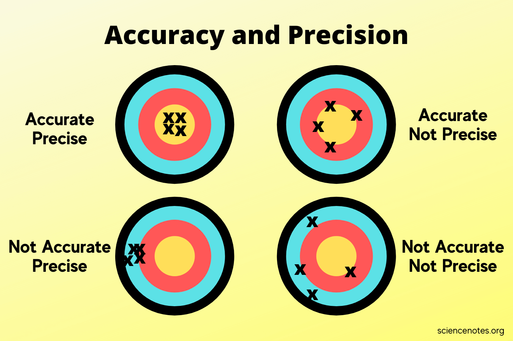
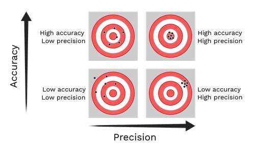
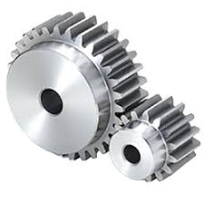
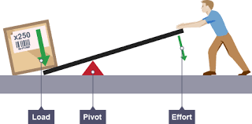
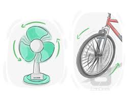
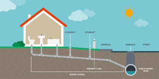
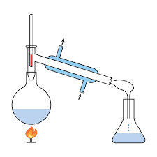

= part 06
:toc: left
:toclevels: 3
:sectnums:
:stylesheet: ../../myAdocCss.css

'''

== part 06

==== devise, invent

[.small]
[options="autowidth" cols="1a,1a"]
|===
|Header 1 |Header 2

|Devise
|Devise (设计，想出) 指**通过思考、计划或巧妙的想象，来创造出一种方法、计划或系统**。这个词##强调的是**创造性的思维过程**和**方案的巧妙性**，多用于抽象的事物，如计划、策略、借口或方法。##

性质： 强调**巧妙地构思或设计**一个**计划或方法**。

侧重点： 侧重于**智力活动**和**方案的独创性**。

用法示例： +
- The team had *to devise a new strategy* to reduce costs. (团队必须设计出一个新的策略来降低成本。) +
- She devised a clever method* for organizing (v.) her _huge collection of books_. (她想出了一个巧妙的方法, 来整理她的大量藏书。) +
- *Can you devise a schedule* that works (v.) for everyone? (你能否想出一个对每个人都适用的时间表？)

|Invent
|#Invent (发明，创造) 指**创造出以前不存在的具体物品、机器或技术**。这个词强调的是**物理性的、可触摸的物品或全新的技术**的出现，它通常涉及科学或工程学的突破。#

性质： 强调**创造出全新的、有形的物品或技术**。

侧重点： 侧重于**新产品的物理实现**和**技术创新**。

用法示例： +
-  Thomas Edison *is credited  (v.)相信；归功于；把......记入贷方；认为......有（良好的品质或特点）；认为......属（某种类或性质） with* inventing (v.) the practical electric light bulb. (托马斯·爱迪生被认为是发明了实用的电灯泡。) +
-  Necessity is the mother of invention. (需求是发明之母。) +
-  Scientists are working *to invent (v.) a vaccine* for the new virus. (科学家们正在努力发明一种针对新病毒的疫苗。)
|===

总结
[options="autowidth" cols="1a,1a,1a,1a"]
|===
| 词语 | 含义和侧重点 | 产物类型 | 核心概念
| Devise | 巧妙地构思出方法、计划或系统 | 抽象的方案、方法 | 智力构思
| Invent | 创造出全新的、有形的物品或技术 | 具体的物品、技术 | 物理创造
|===

简单来说，这两个词的区别在于**产物的形态**： +
* Devise 是指**设计一个方法** (something abstract, like a plan or strategy)。 +
* Invent 是指**发明一个东西** (something physical, like a machine)。 +
* 一个工程师可能会 **invent** (发明) 一种新的机器人，然后 **devise** (设计) 一套系统来控制它。

'''

==== disclose, reveal, uncover, expose

[.small]
[options="autowidth" cols="1a,1a"]
|===
|Header 1 |Header 2

|Disclose
|Disclose (披露，公开) 是一个**正式、法律或商业**上的词，#指的是**正式或有义务地向外界提供秘密的、私人的或此前保密的信息**。它强调的是**信息的正式发布行为**，通常是为了遵守规定或进行商业透明化。#

性质： 强调**正式、有义务或必须公开**的行为。

侧重点： 侧重于**信息、数据或秘密**的**公开过程**。

用法示例： +
 Companies must *disclose their financial earnings* to the public. (公司必须向公众披露其财务收入。) +
 The contract requires /both parties *not to disclose (v.) confidential information*. (合同要求双方不得披露机密信息。)

|Reveal
|Reveal (揭示，透露) 是一个**通用**的词，#指**让原本隐藏或不为人知的事物显现出来**。它既可以指抽象的信息，也可以指具体的物体。这个词强调的是**发现行为所带来的惊喜或戏剧性效果**，可以是无意的，也可以是刻意的。#

性质： 强调**使隐藏的事物显现**。

侧重点： 侧重于**信息或真相的展露**，#常带有惊喜或戏剧性。#

用法示例： +
 The investigation *revealed a discrepancy* (n.)差异，不符 in the accounts. (调查揭示了账目中的一个出入。) +
 The magician *revealed his secret* after the performance. (魔术师在表演结束后透露了他的秘密。)

|Uncover
|##Uncover (发现，揭露) 通常指**通过物理或调查活动，将隐藏或掩盖的事物找出来**。它暗示着**主动的、系统的搜索或调查**，常用于发现证据、事实或文物。##这个词既可用于抽象的真相，也可用于有形的物体。

性质： #强调**主动的调查或发掘**，以**移除遮盖**。#

侧重点： 侧重于**发现过程**和**证据的发掘**。

用法示例： +
 Journalists worked for months /*to uncover the details* of the corruption scandal. (记者们工作了数月, 才揭露出腐败丑闻的细节。) +
 Archeologists hope *to uncover ancient artifacts* 史前古器物；人工产品 at the site. (考古学家们希望在该遗址发掘出古代文物。)

|Expose
|#Expose (揭露，曝光) 指**揭开某事物的丑陋、不正当或危险的本质，使其暴露在公众视野中**。它通常带有**负面、谴责性**的色彩，强调将**不道德、非法行为或危险**暴露给外界，使其受到批评或惩罚。#

性质： 强调**暴露负面或危险事物**，常带谴责性。

侧重点： 侧重于**使坏事公之于众**，以带来后果。

用法示例： +
-  The _whistle 哨子；口哨声 blower_ (鼓风机，吹风机；吹制工) 揭发者 exposed the company's illegal dumping (n.)（危险物质的）倾倒，倾泻；倾销 of toxic waste. (告密者揭露了该公司非法倾倒有毒废物。) +
-  The article was meant /to expose the hypocrisy (n.)虚伪，伪善  of the political system. (这篇文章旨在曝光政治体制的虚伪。)
|===

总结
[options="autowidth" cols="1a,1a,1a,1a"]
|===
| 词语 | 含义和侧重点 | 性质和语境 | 核心概念
| Disclose | 正式或有义务地公开秘密信息 | 正式、法律、商业 | 信息的正式发布
| Reveal | 让隐藏的事物显现出来 | 通用、戏剧性 | 显现/透露
| Uncover | 通过主动调查或发掘发现隐藏的事实/物体 | 调查、发掘 | 找出隐藏的证据
| Expose | 揭露丑陋、不正当或危险的本质 | 负面、谴责性 | 曝光不良行为
|===

简单来说，这四个词的区别在于**信息的性质和目的**： +
* **Disclose** 是**正式地、必须地提供信息**（中性）。 +
* **Uncover** 是**通过努力找到隐藏的事实**（#强调过程#）。 +
* **Reveal** 是**展示隐藏的真相或事物**（#通用，略带惊喜#）。 +
* **Expose** 是**揭露不好的、应该被谴责的秘密**（#负面#）。 +

'''

==== calculate, compute, estimate, assess, evaluate

[.small]
[options="autowidth" cols="1a,1a"]
|===
|Header 1 |Header 2

|Calculate
|#Calculate (计算) 指**通过数学方法或逻辑步骤，精确地确定一个数值或数量**。这个词强调的是**精确性、确定性**，通常涉及具体的数学运算，如加、减、乘、除，以得出唯一正确的答案。#

性质： 强调**精确的数学或逻辑运算**。

侧重点： 侧重于**数字的确定和精度**。

用法示例： +
 We need *to calculate the total cost*, including tax and shipping. (我们需要计算总成本，包括税费和运费。) +
 The formula is used *to calculate the area of the circle.* (该公式用于计算圆的面积。)

|Compute
##|Compute (计算) 与 Calculate 非常接近，##但在现代语境中，#它更倾向于指**通过机器或电子设备 (如电脑) 进行大规模、复杂的计算**。它强调的是**系统化、自动化的信息处理**。#

性质： 强调**系统化、机器驱动的计算**或信息处理。

侧重点： 侧重于**数据处理和技术手段**。

用法示例： +
 The supercomputer *can compute (v.) complex algorithms* in seconds. (这台超级计算机可以在几秒内计算出复杂的算法。) +
 *The system computes (v.) the average score* for all students. (该系统计算所有学生的平均分数。)

|Estimate
|##Estimate (估计，估算) 指**在信息不完全或时间有限的情况下，通过判断或近似计算, 来确定一个近似的数值或数量**。它强调的是**近似值**，而不是精确值，##并承认存在不确定性。

性质： 强调**近似或猜测性的数值判断**。

侧重点： 侧重于**近似值和合理性**。

用法示例： +
 The contractor *gave us an estimate (n.)估计，估价；估价单 of $5000* for the repair work. (承包商给了我们一个5000美元的维修工作估价。) +
 It's difficult *to estimate the time* required to complete the research. (很难估计完成这项研究所需的时间。)

|Assess
|##Assess (评估，评定) 指**对事物的价值、质量、重要性或风险, 进行判断和考量**。这个词**通常不涉及精确的数学计算，##而是通过系统的分析和判断, 来确定其状态或程度**。它是一个更广泛的判断过程。

性质： 强调**系统性的判断和考量**。

侧重点： 侧重于**确定状态、价值或程度**。

-> assess：##词根“cess-”（走、移动，引申为“评估”），##词缀“as-”（加强语气）；词源相同单词：assessment（评估）、access（进入）

用法示例： +
 The committee was formed (v.) *to assess (v.) the environmental impact* of the new factory. (委员会的成立, 是为了评估新工厂对环境的影响。) +
 Before treatment, *the doctor will assess (v.) the patient's condition.* (治疗前，医生会评估病人的状况。)

|Evaluate
|Evaluate (评价，估值) 指**对事物的价值、质量或有效性, 进行深入、详细的审查，通常通过与既定标准或目标进行比较**。#它比 Assess 更深入，强调**对优缺点的详细判断**，常用于人员表现、项目成果或理论体系。#

性质： 强调**详细审查、对比标准后的价值判断**。

侧重点： 侧重于**质量、效用或绩效的判定**。

用法示例： +
 The manager *will evaluate the performance of all employees* /at the end of the year. (经理将在年底评估所有员工的表现。) +
 *We need to evaluate the effectiveness* of the new teaching method. (我们需要评估新教学方法的有效性。)
|===

总结
[options="autowidth" cols="1a,1a,1a,1a"]
|===
| 词语 | 含义和侧重点 | 性质 | 核心概念
| Calculate | 通过数学步骤得出精确数值 | 精确的数学运算 | 确定数值
| Compute | 通过机器或系统进行复杂、大规模计算 | 系统化、自动化 | 信息处理
| Estimate | 在信息不完全时得出近似数值 | 近似判断 | 估算
| Assess | 通过系统分析判断事物的状态、价值或风险 | 广泛的系统判断 | 查明状态
| Evaluate | 通过对比标准详细审查事物的质量或效用 | 深入的价值判断 | 判定优劣
|===

简单来说，你可以用**精度和目的**来区分它们： +
* Calculate 和 Compute 是**精确的数学行为**。 +
* Estimate 是**不精确的数值猜测**。 +
* Assess 和 Evaluate 是**##定性##的判断行为**。 +
* #你可以 **calculate** (计算) 维修工的工时，**estimate** (估计) 总费用，然后 **evaluate** (评价) 他们的服务质量。# +

'''

==== accurate, precise

[.small]
[options="autowidth" cols="1a,1a"]
|===
|Header 1 |Header 2

|Accurate
|Accurate (准确的) 指**接近或符合公认的真实值或标准**。#它强调的是**正确性**，即结果、测量或信息与**真实目标**之间的**接近程度**。*一个测量可能很精确，但不一定准确（如果校准错误）。*#

性质： 强调**符合真实值或标准**。

侧重点： 侧重于**正确性**和**与目标的接近程度**。

用法示例： +
 The thermometer *gave an accurate reading* of the room temperature. (这个温度计给出了房间温度的准确读数。) +
 The witness *gave an accurate description* of the suspect. (目击者对嫌疑人提供了准确的描述。)

|Precise
|##Precise (精确的) 指**细节的精细程度**，##或**重复测量结果的一致性**。它强调的是**精确度、细节和可重复性**，即测量值之间相互接近的程度。#*一个测量可能很准确，但不一定精确（如果多次测量结果分散）。*#

性质： 强调**细节的精细**或**重复测量的一致性**。

侧重点： 侧重于**可重复性**和**细节的精细程度**。

用法示例： +
 Scientists *use (v.) precise instruments* to measure (v.) chemical quantities. (科学家使用精确的仪器来测量化学量。) +
 The builder *gave a precise measurement* down to the millimeter. (建筑商给出了精确到毫米的测量值。)
|===

总结
[options="autowidth" cols="1a,1a,1a,1a"]
|===
| 词语 | 含义和侧重点 | 焦点 | 核心概念
| Accurate | 符合真实值或标准 | 正确性 | 接近目标
| Precise | 细节的精细程度或重复性 | 可重复性 | 细节精细/彼此接近
|===

简单来说，这两个词的区别在于**目标**： +
* #**Accurate** 是指**击中靶心**（#接近真实值#）。# +
* #**Precise** 是指**每次都击中同一地点**，无论这个地点是否是靶心（#重复性高#）。# +
* 在射击中，最理想的结果是既 **accurate** (击中靶心)，又 **precise** (射击点都集中在一起)。 +

'''

==== error, mistake

[.small]
[options="autowidth" cols="1a,1a"]
|===
|Header 1 |Header 2

|Error
|##Error (错误) 是一个**通用、正式且技术性**的词，指的是**与标准、规则、真相或期望结果之间的偏差**。##它常用于**科学、技术、统计学或编程**等需要精确性的领域，指系统、机器或过程中的**技术性缺陷或偏差**，#有时不涉及人的主观判断。#

性质： 强调**与客观标准、规则或期望结果之间的偏差**。

侧重点： 侧重于**技术性、系统性或客观性**的失准。

用法示例： +
 _A tiny mathematical error_ in the calculation `谓` led to a massive failure. (计算中的一个微小的数学错误, 导致了一次巨大的失败。) +
 The software displayed _an error message_ /and shut down unexpectedly. (该软件显示了一个错误信息，并意外关闭。) +
 In statistics, _the margin 页边空白；差额，幅度 of error_ indicates (v.) the expected range of uncertainty. (在统计学中，误差幅度, 表示预期的不确定性范围。)

|Mistake
|Mistake (错误) 是一个**通用、日常且主观性**的词，指的是**由于判断失误、疏忽或缺乏知识而导致的行动或想法上的错误**。#它强调的是**人的主观判断或行为上的失误**，通常可以通过学习或更仔细的思考来避免。#

性质： 强调**由于人的判断、疏忽或无知所致的失误**。

侧重点： 侧重于**人的主观行为和判断**上的瑕疵。

用法示例： +
 *I made a big mistake* by trusting him with my money. (我犯了一个大错，不该相信他来保管我的钱。) +
 *It was a mistake to think* /the project would be easy. (认为这个项目会很容易是一个错误。) +
 We all *learn (v.) from our mistakes.* (我们都会从错误中学习。)
|===

总结
[options="autowidth" cols="1a,1a,1a,1a"]
|===
| 词语 | 含义和侧重点 | 性质 | 核心概念
| Error | 与客观标准、真相的偏差 | 客观、技术、系统性 | 技术性缺陷/偏差
| Mistake | 人的主观判断或行动上的失误 | 主观、日常、行为性 | 判断失误/疏忽
|===

简单来说，这两个词的区别在于**主客观**： +
* #**Mistake** 通常是**人犯下的** (行为或判断上的失误)。# +
* #**Error** 可以是**人犯下的**，也可以是**系统、机器或科学理论的缺陷**（客观的技术性偏差）。# +
* 你在试卷上写错了答案，这是个 **mistake**。但你的计算器给出了错误的数值，这是个 **error**。 +

'''

== other

[.small]
[options="autowidth" cols="1a,1a"]
|===
|Header 1 |Header 2

|gear
|

|pivot
|

1.the central point, pin or column 中心的点、针或柱 /on which sth turns (v.) or balances (v.).  支点；枢轴；中心点 +
2.the central or most important person or thing 最重要的人（或事物）；中心；核心

|drainage
|

|ventilation
|

|distil
|

作为动词（Distill 或Distil） +
字面意思：*##指通过蒸馏过程, 提取液体中的某个成分，##例如从水中提取纯净水，或从发酵液中提取酒精。* +

引申义： +
提炼/浓缩：:将复杂的想法、信息或思想简化为最核心、最精要的部分。 +
吸取精华：:从整体中提取出最有价值的部分，例如“从历史中吸取经验教训”。 +
净化：:指通过某个过程, 使某事物变得纯净或更纯粹。 +

1.
*~ sth (from sth)* : to make a liquid pure by heating it /until it becomes a gas, then cooling it /and collecting the drops of liquid that form 蒸馏；用蒸馏法提取 +
•to distil (v.) fresh water from sea water 用蒸馏法从海水中提取淡水
•distilled water 蒸馏水

2.to make sth /such as a strong alcoholic drink /in this way 用蒸馏法制造（酒等）
•The factory distils (v.) and bottles (v.)装瓶 whisky. 这家工厂用蒸馏法, 酿造瓶装威士忌酒。

3.*~ sth (from/into sth)* : ( formal ) to get the essential meaning or ideas from thoughts, information, experiences, etc. 吸取…的精华；提炼；浓缩
•The notes I made on my travels `谓` were distilled (v.) into a book. 我的旅行笔记精选. 汇编成了一本书。

|===

'''