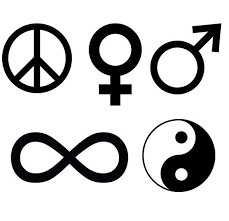
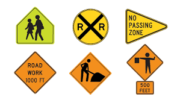
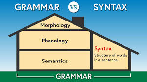
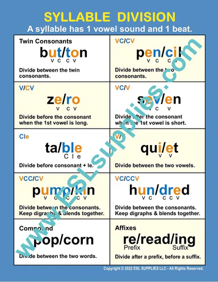
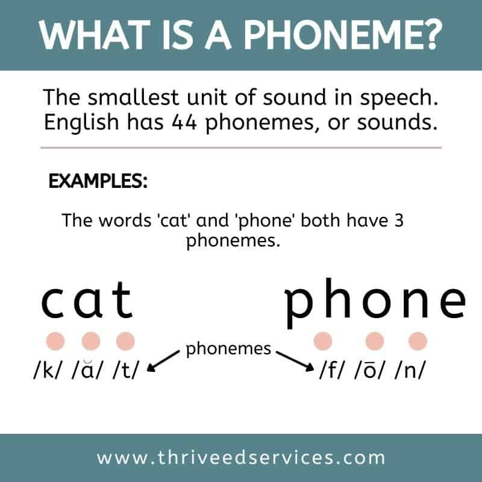
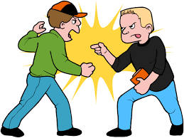
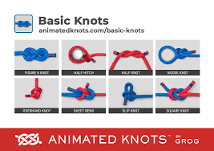

= part 08
:toc: left
:toclevels: 3
:sectnums:
:stylesheet: ../../myAdocCss.css

'''

== part 08

==== symbol, sign

[.small]
[options="autowidth" cols="1a,1a"]
|===
|Header 1 |Header 2

|Symbol
|Symbol (符号，象征) 指**代表抽象概念、想法或深层意义的物体、图像或文字**。##Symbol 和其所代表的事物之间的关系通常是**任意的、传统的或文化约定的**，需要**学习和理解**才能建立联系。##它强调**深层、复杂的意义和文化背景**。

性质： **代表抽象概念或复杂意义的 约定性标记**。

侧重点： 强调**抽象意义、深层内涵和文化传统**。

用法示例： +
 The dove is a common symbol of peace. (鸽子是和平的常见象征。) +
 The company chose the lion as a symbol of strength and courage. (该公司选择狮子作为力量和勇气的象征。) +
 The mathematical symbol latexmath:[ \pi] `谓` represents the ratio of a circle's circumference to its diameter. (数学符号 $\pi$ 代表圆的周长与直径之比。)

|Sign
|Sign (迹象，标记，信号) 是一个**通用**的词，指**直接、清楚地表明某种事实、存在或命令的标记或迹象**。#Sign 和其所指事物之间的关系通常是**直接的、因果的或指示性的**，不需要复杂的解释。它强调**直接的指示、警告或证据**。#

性质： **直接指示事实、存在或命令的标记或迹象**。

侧重点： 强调**直接、即时的信息、警告或证据**。

用法示例： +
 The dark clouds are a sign of rain. (乌云是下雨的迹象。) +
 The road sign `谓` indicated a sharp curve ahead. (路标指示前方有一个急转弯。) +
 He nodded (v.) his head /as a sign of approval. (他点头表示同意。)
|===

总结
[.small]
[options="autowidth" cols="1a,1a,1a,1a"]
|===
| 词语 | 含义和侧重点 | 关系类型 | 核心概念
| Symbol | 代表抽象概念或深层意义的标记 | 抽象、约定、文化关联 | 象征、深层意义
| Sign | 直接指示事实、存在或命令的标记 | 直接、因果、指示性 | 迹象、信号、警告
|===

简单来说，这两个词的区别在于**解读的难度和意义的深度**： +
* **Sign** 是**直接的证据或指令**，如“感冒的 **sign** (迹象) 是咳嗽”。 +
* **Symbol** 是**抽象的代表**，需要**思考**，如“心形是爱的 **symbol** (象征)”。 +
* 所有的 **Symbols** 都是 **Signs** (它们都是标记)，但并非所有的 **Signs** 都是 **Symbols** (路标不是象征)。 +

'''

==== syntax, grammar

[.small]
[options="autowidth" cols="1a,1a"]
|===
|Header 1 |Header 2

|Syntax
|Syntax (句法，语法结构) 指**在特定语言中，单词如何组合成短语、子句和句子的规则**。它关注的是**句子结构、单词的排列顺序和它们之间的关系**，即“形式”和“组合规则”。在计算机科学中，它也指编程语言中代码的合法结构。

焦点： **句子结构和单词的排列组合规则**。

侧重点： 强调**句子的形式结构**是否正确。

用法示例： +
 In English, the basic syntax is Subject-Verb-Object (SVO). (在英语中，基本的句法是主语-谓语-宾语 (SVO)。) +
 The compiler checks the program for syntax errors before execution. (编译器在执行前检查程序是否有句法错误。)

|Grammar
|##Grammar (语法) 是一个**更广义**的术语，##指**一套用于产生合格语言表达的全部规则**。#它不仅包括 **syntax** (句法)，还包括 **morphology** (词法/词形变化，如动词变位、名词复数) 和**语义学** (如何正确使用词汇来表达意义)。它关注的是**语言的整体结构和使用规范**。#

焦点： **语言的全部规则，包括词法、句法和语义**。

侧重点： 强调**语言的整体规范性**和**词形、结构、意义的正确使用**。

用法示例： +
 A dictionary and a grammar book `系` are essential for language learning. (字典和语法书对语言学习至关重要。) +
 She speaks French fluently, but she still makes some mistakes in grammar. (她法语说得很流利，但语法上仍然会犯一些错误。)
|===

总结
[options="autowidth" cols="1a,1a,1a,1a"]
|===
| 词语 | 含义和侧重点 | 范围 | 核心概念
| Syntax | 单词如何组成句子的结构规则 | 狭窄，关注形式结构 | 句子结构规则
| Grammar | 产生合格语言表达的全部规则 (包括句法、词法等) | 广泛，关注整体规范 | 语言的整体规范
|===

简单来说，你可以把它们想象成一个**包含关系**： +
* **Grammar** (语法) 是**整个规则系统**。 +
* ##**Syntax** (句法) 是 **Grammar** 的**一个核心组成部分**，##专门处理**单词在句子中的排列和组织**。 +

你可以说 "The sentence has a grammar error /because _the word order (syntax)_ is wrong." (这个句子有一个语法错误，因为词序 (句法) 是错的。)

'''

==== oral, verbal

[.small]
[options="autowidth" cols="1a,1a"]
|===
|Header 1 |Header 2

|Oral
|Oral (口头的，口腔的) 指**通过嘴巴说出** (spoken) 的，或**与嘴巴/口腔相关**的事物。当用于指代交流时，#它特指**只使用声音**，与书面 (written) 形式相区分。当用于医学或解剖学时，它特指**口腔**本身。#

性质： 强调**通过嘴巴进行**或**与口腔相关**。

侧重点： #侧重于**声音** (作为交流方式) 和**生理结构** (口腔)。#

用法示例： +
 The student had to take an oral examination, not a written test. (这名学生必须参加口头考试，而不是笔试。) +
 The medicine is for _oral administration_ only. (这种药仅供口服。) +
 Oral hygiene is important for preventing tooth decay. (口腔卫生对预防蛀牙很重要。)

|Verbal
|##Verbal (语言的，口头的) 是一个**更广义**的词，指**使用语言 (words)** 进行交流，无论是**口头 (spoken)** 还是**书面 (written)** 形式。##然而，#*在日常使用中，"verbal" 经常被用来指代口头交流，这与 "oral" 的意思重叠。但在技术和语言学语境中，它强调**文字或词语**的使用。*#

性质： 强调**使用语言** (无论是口头还是书面)。

侧重点： 侧重于**语言本身** (词语) 的使用。

用法示例： +
 The contract was based on _a verbal agreement_, but we still need a written document. (这份合同是基于口头协议的，但我们仍需要一份书面文件。) +
 Non-verbal communication includes body language and facial expressions. (非语言交流, 包括肢体语言和面部表情。) +
 His _verbal skills_ were excellent, allowing him to argue persuasively. (他的语言表达能力很强，使他能够有说服力地进行辩论。)
|===

总结
[options="autowidth" cols="1a,1a,1a,1a"]
|===
| 词语 | 含义和侧重点 | 范围和焦点 | 核心概念
| Oral | 通过嘴巴发出声音或与口腔相关 | 狭窄，侧重于声音和生理结构 | 声音的/口腔的
| Verbal | 使用语言交流 (包括口头和书面) | 广泛，侧重于语言本身 (词语) | 语言的/词语的
|===

简单来说，这两个词的区别在于**焦点**： +
* #**Oral** 强调**发声器官 (嘴巴)** 和**声音**。#
* #**Verbal** 强调**语言本身 (词语)**。#

在指代**口头交流**时，它们的意思常常**重叠**，但在正式或技术语境中，#**Verbal** 范围更广 (可包含 written)，而 **Oral** 更聚焦于**发声**。#

'''

==== syllable, phoneme

[.small]
[options="autowidth" cols="1a,1a"]
|===
|Header 1 |Header 2

|Syllable
|Syllable (音节) 指**一次发音中发出的、##由一个或多个音素组成##的语音单位**。##它通常包含一个**元音** (或元音化的辅音) 作为中心，前后可以有辅音。##音节是**发音和韵律**的基本单位，是语言中**最自然的发音组织方式**。

焦点： **发音的自然单位**。

侧重点： 强调**发音的流畅性和韵律**，是比音素大的语音块。

用法示例： +
 The word "banana" has three syllables: ba-na-na. (单词 "banana" 有三个音节：ba-na-na。) +
 English rhythm is often determined by the stressed syllables in a sentence. (英语的节奏通常由句子中的重读音节决定。)

|Phoneme
|Phoneme (音素) 指**在特定语言中，#能够区分词义的最小语音单位#**。它本身没有意义，但如果替换掉一个音素，就会改变整个词的意思。它是**抽象的、区别意义**的单位，##比音节更小，##是语音学的基本概念。

焦点： **区分意义的最小语音单位**。

侧重点： 强调**抽象的、区别意义的能力**，是语言的最小声音单元。

用法示例： +
 The difference between the words "pin" and "bin" is the initial phoneme, /p/ versus /b/. (单词 "pin" 和 "bin" 的区别在于它们的起始音素，/p/ 和 /b/。) +
 English has about 44 phonemes, though the number varies by dialect. (英语大约有44个音素，尽管数量因方言而异。)

|===

总结
[options="autowidth" cols="1a,1a,1a,1a"]
|===
| 词语 | 含义和侧重点 | 语音单位 | 核心概念
| Syllable | 一次发音发出的语音单位 | 发音的自然单位 | 节奏和发音流畅性
| Phoneme | 能够区分词义的最小语音单位 | 区分意义的最小单位 | 意义区别和抽象性
|===

简单来说，这两个词是**大小和功能**上的区别： +
* **Phoneme** (音素) 是**最小的意义区分者**（就像字母是最小的书写单位）。
* **Syllable** (音节) 是**自然的语音块**，由一个或多个音素构成（是**发音的节奏单位**）。
* 就像字母 (Phoneme) 组成词语，**音素 (Phoneme) 组成音节 (Syllable)**。

单词 "cat" 由三个 **phonemes** (/k/, /æ/, /t/) 组成，但它只有一个 **syllable**。

'''

==== complicated, complex

[.small]
[options="autowidth" cols="1a,1a"]
|===
|Header 1 |Header 2

|Complicated
|Complicated (复杂的，繁琐的) 指**事物由许多部分或步骤组成，使其难以理解、解决或操作**。##它强调的是**结构上的繁多和操作上的不便**，但如果将这些部分分解开来，**每个部分本身都是可以理解的**。##通过详细的说明或步骤，问题可以被解决。

焦点： **结构繁多和操作繁琐**。

侧重点： 强调**难以处理或理解**，但##本质上**可分解、可预测**。##

用法示例： +
 The instructions for _assembling the bookshelf_ were too complicated. (组装书架的说明太复杂/繁琐了。) +
 The current _tax system_ is _unnecessarily complicated_ /and needs simplification. (目前的税收系统过于繁琐，需要简化。)

|Complex
|Complex (复杂的，错综的) 指**事物由许多相互关联和依赖的部分组成，这些部分之间的互动是非线性、难以预测的**。它强调的是**部分之间的互动和##非线性关系##，这##意味着即使了解了每个部分，也无法准确预测整体的行为。##**它常用于指代系统或概念。

焦点： **部分间的相互关联和不可预测性**。

侧重点： 强调**难以预测和控制**，本质上**难以完全掌握**。

用法示例： +
 The human brain is _an incredibly complex system_. (人类大脑是一个极其复杂的系统。) +
 Climate change is _a complex issue_ involving economic, social, and environmental factors. (气候变化是一个涉及经济、社会和环境因素的错综复杂的问题。)
|===

总结
[options="autowidth" cols="1a,1a,1a,1a"]
|===
| 词语 | 含义和侧重点 | 挑战来源 | 核心概念
| Complicated | 结构繁多，步骤繁琐，难于操作 | 部分多，结构长 | 繁琐，可分解，可预测
| Complex | 部分相互关联，互动非线性，难于预测 | 相互依赖，动态互动 | 错综，难掌握，不可预测
|===

简单来说，这两个词的区别在于**可预测性**： +
* ##**Complicated** (繁琐) 的问题**可以被解决**，##只是需要**更多时间、步骤和耐心** (#如一个有1000个零件的**手表**#)。 +
* ##**Complex** (错综) 的问题**难以完全解决或预测**，##因为其组成部分在不断地动态互动 (#如一个**生态系统**#)。 +

#一个复杂的机械锁是 **complicated**，但它的行为是**可预测**的。一个社会经济系统是 **complex**，它的行为是**不可预测**的。#

'''

==== debate, contention

[.small]
[options="autowidth" cols="1a,1a"]
|===
|Header 1 |Header 2

|Debate
|Debate (辩论) ##指**围绕某一特定议题，双方或多方有组织、有规则地进行论证和反驳的活动**。它强调的是**正式的、结构化的讨论过程**，目的是说服听众或裁判支持自己的立场。##虽然涉及分歧，但其本质是**智力上的交流**。

性质： 强调**有组织的、正式的讨论过程**。

侧重点： 侧重于**逻辑论证、规则和说服听众**。

用法示例： +
 The candidates *participated in* a televised debate /on economic policy. (候选人参加了一场关于经济政策的电视辩论。) +
 The members of the committee spent hours debating the proposal. (委员会成员花费了数小时辩论这项提议。)

|Contention
|Contention (争论，论点，竞争) ##指**激烈的分歧、不和或争吵的状态**，##也指**在争论中提出的具体观点或论点**。这个词##强调的是**冲突或竞争**，以及**分歧的严重性**。它是一个**状态**或**观点**，而不一定是有组织的**活动**。##

性质： 强调**分歧、不和或竞争的状态**，或**争论中的观点**。

侧重点： 侧重于**冲突的严重性**和**争论的焦点**。

用法示例： +
 The issue of funding has been _a source of contention_ between the departments. (资金问题一直是部门间争论的焦点。) +
 It is my contention /that the current system is flawed. (我的论点是，目前的系统是有缺陷的。) +
|===

总结
[options="autowidth" cols="1a,1a,1a,1a"]
|===
| 词语 | 含义和侧重点 | 焦点 | 核心概念
| Debate | 有组织的、正式的论证活动 | 过程、结构、说服 | 结构化讨论
| Contention | 激烈的分歧状态或争论中的论点 | 状态、观点、冲突 | 冲突/论点
|===

简单来说，这两个词的区别在于**是过程还是状态/观点**： +
* **Debate** 是**进行论证的正式行动或活动**（一种**过程**）。 +
* **Contention** 是**严重分歧的状态**，或指**争论中的具体论点**（一种**状态**或**观点**）。 +

双方的 **contention** (争论/论点) 导致了一场激烈的 **debate** (辩论)。

'''

== other

[.small]
[options="autowidth" cols="1a,1a"]
|===
|Header 1 |Header 2

|knot
|

|logogram
|

( also logo·graph  /ˈlɒɡəɡrɑːf/
 ) ( technical 术语) a symbol that represents a word or phrase, for example those used in ancient writing systems 词符；语符；速记符

|===

'''