= part 09
:toc: left
:toclevels: 3
:sectnums:
:stylesheet: ../../myAdocCss.css

'''

== part 09

==== press, journalist

[.small]
[options="autowidth" cols="1a,1a"]
|===
|Header 1 |Header 2

|Press
|##Press (新闻界，媒体) 是一个**集体名词**，指**从事新闻报道和信息传播的整个行业或所有机构**。##这个词源于早期的印刷媒体，现在已延伸到包括报纸、杂志、电视、电台和数字媒体等所有形式。它强调的是**行业、机构**和**媒体的社会功能**。

性质： **整个新闻行业或报道机构的集合**。

侧重点： 强调**机构、权力**和**集体身份**。

用法示例： +
 _The freedom of the press_ is a cornerstone of democracy. (新闻自由是民主的基石。) +
 _A press conference_ was held to announce (v.) the new policy. (召开了新闻发布会以宣布新政策。)

|Journalist
|##Journalist (记者，新闻工作者) 是一个**个体名词**，##指**为新闻机构工作，负责收集、撰写、编辑或呈现新闻和信息的人**。它强调的是**从事报道工作的人员**的**具体职业身份**。

性质： **从事新闻报道工作的个人**。

侧重点： 强调**个人职业**和**具体行为**（报道、撰写）。

用法示例： +
 The journalist spent weeks investigating the story /before publishing (v.) the article. (这名记者在发表文章前, 花费了数周调查这个故事。) +
 She decided to become a journalist /to expose corruption. (她决定成为一名记者来揭露腐败。)
|===

总结

[.small]
[options="autowidth" cols="1a,1a,1a,1a"]
|===
| 词语 | 含义和侧重点 | 范畴 | 核心概念
| Press | 整个新闻行业或所有报道机构 | 集体，行业 | 媒体机构/行业权力
| Journalist | 从事新闻报道和信息传播的个人 | 个体，职业 | 具体的新闻从业者
|===

简单来说，这两个词的区别在于**个体与集体**： +
* **Press** 是指**所有新闻机构及其代表的行业**。 +
* **Journalist** 是指**在这些机构中工作的某一个人**。 +
* **Journalists** (记者们) 组成了 **The Press** (新闻界)。 +

'''

==== journalist, correspondent,editor

[.small]
[options="autowidth" cols="1a,1a"]
|===
|Header 1 |Header 2

|Journalist
|Journalist (记者，新闻工作者) #是**最广泛的职业统称**#，指**为新闻机构工作，负责收集、撰写、编辑或呈现新闻和信息的人**。它强调**新闻报道和信息传播**的这一**职业身份**。#任何从事新闻采编工作的人，无论是记者、编辑、评论员或通讯员，理论上都可以被称为 **Journalist**。#

性质： **新闻信息传播行业的职业统称**。

侧重点： 强调**收集和呈现新闻**的广义职业。

用法示例： +
 The journalist spent weeks investigating the story /before publishing the article. (这名记者在发表文章前花费了数周调查这个故事。) +
 Good journalists uphold high ethical standards. (优秀的新闻工作者维护高标准的职业道德。)

|Correspondent
|#Correspondent (通讯员，特派记者) 是 **Journalist** 的**一个具体分类**，指**被新闻机构派驻到特定地点**（如外国首都、战区或某个专业领域）**长期或专门报道该地或该领域新闻的记者**。他们是“发回报道”的人。#

性质： **派驻在特定地点或领域进行专业报道的记者**。

侧重点： #强调**固定的驻地**和**专业化的报道领域**（如 Foreign Correspondent, War Correspondent）。#

用法示例： +
 Our Asia correspondent *reported (v.) live* from the scene of the earthquake. (我们的亚洲通讯员从地震现场发回了实时报道。) +
 As _a White House correspondent_, his focus is solely on presidential politics. (作为白宫特派记者，他的重点只在总统政治上。)

|Editor
|Editor (编辑) 指**负责审查、修改、组织和最终定稿新闻材料的人**。#他们的职责是**确保内容的准确性、清晰性、风格和篇幅符合出版要求**，并决定哪些新闻可以发表。他们是**内容的守门人**，通常不亲自进行新闻报道（除非是编辑本人撰写的评论）。#

性质： **负责内容质量、组织和最终定稿的职员**。

侧重点： 强调**修改、组织、把关**和**决策内容**（如 Chief Editor, Managing Editor）。

用法示例： +
 The editor told the writer to shorten (v.) the article by 500 words. (编辑告诉作者将文章缩短500字。) +
 The photo editor selects (v.) which images will appear in the newspaper. (图片编辑选择哪些照片将出现在报纸上。)
|===

总结
[options="autowidth" cols="1a,1a,1a,1a"]
|===
| 词语 | 含义和侧重点 | 核心职责 | 关注点
| Journalist | 新闻行业的广义职业统称 | 收集、撰写、传播信息 | 整个新闻过程
| Correspondent | 派驻在特定地区或领域的记者 | 在特定地点进行深度、专业化报道 | 地点和专业领域
| Editor | 负责审查、修改、组织和最终定稿的人 | 内容把关、质量控制、出版决策 | 内容质量和结构
|===

简单来说，你可以用新闻的**流转过程**来理解它们： +
* **Journalist** (记者) 是**职业统称**。 +
* **Correspondent** (通讯员) 是**在远方提供材料**的 **Journalist**。 +
* **Editor** (编辑) 是**对这些材料进行加工和批准**的人。 +

**Correspondent** 发回报道 → **Editor** 审核修改 →  报道发表。所有这些人都属于 **Journalists**。 +

'''

==== handout, leaflet

[.small]
[options="autowidth" cols="1a,1a"]
|===
|Header 1 |Header 2

|Handout
|##Handout (讲义，分发材料) 指**在会议、演讲、课堂或公共活动中分发给听众或参与者的印刷材料**。##它的核心含义是**“分发”** (hand out) 的行为，#通常是为了**提供支持信息、总结重点或作为学习辅助材料**。它**不一定**具有宣传或广告的目的。#

性质： **为提供支持信息、总结或学习辅助而分发的材料**。

侧重点： 强调**作为信息支持**的功能和**分发的动作**。

用法示例： +
 The professor gave us a handout /summarizing (v.) the key points of today's lecture. (教授给了我们一份总结今天讲座要点的讲义。) +
 Please pick up the handout with the emergency contact information /at the door. (请在门口领取包含紧急联系信息的资料。)

|Leaflet
|##Leaflet (传单，小册子) 指**一页或几页纸的印刷品，通常经过折叠**，用于**宣传、广告或提供简短、集中的信息**。它的核心目的是**宣传一个产品、服务或理念**，具有**商业或政治目的**。##它强调**轻便、折叠**的外观和**宣传**的功能。

性质： **用于宣传、广告或信息推广的小册子或传单**。

侧重点： 强调**宣传、推广**的目的和**可折叠**的外观。

image:img/Leaflet.jpg[,15%]

用法示例： +
 They handed out leaflets on the street /to advertise (v.) the new restaurant. (他们在街上散发传单, 来宣传这家新餐馆。) +
 The museum provides a free leaflet /detailing (v.)详细说明，详述 the history of the building. (博物馆提供了一份免费的小册子，详细介绍了这座建筑的历史。)
|===

总结
[options="autowidth" cols="1a,1a,1a,1a"]
|===
| 词语 | 含义和侧重点 | 主要目的 | 形式
| Handout | 在活动中分发的支持性信息材料 | 信息支持，学习辅助 | 不一定折叠，通常是A4纸或总结
| Leaflet | 用于宣传、推广的小册子或传单 | 宣传，推广，简短介绍 | 通常经过折叠 (如三折页)
|===

简单来说，这两个词的区别在于**目的**： +
* **Handout** 的目的是**辅助学习或提供支持性信息**（中性）。
* **Leaflet** 的目的是**进行宣传或推广**（宣传性）。
* **Leaflet** 是一种特殊的 **Handout**，因为它被 **hand out** (分发) 了，但不是所有的 **Handouts** 都是 **Leaflets** (比如一份课堂笔记)。

'''

==== anticipate, expect

[.small]
[options="autowidth" cols="1a,1a"]
|===
|Header 1 |Header 2

|Anticipate
|Anticipate (预期，预见，先发制人) 指**基于现有知识或推理，预先考虑到某事将要发生，并采取行动或准备**。它强调的是**主动的准备或反应**，以及**预见能力**。#它通常用于指**积极的、主动的准备行为**。#

性质： **基于预见而采取的主动准备或反应**。

侧重点： 强调**预先行动**和**预见能力**。

-> 前缀 ##“anti-”（先，前，##此处变体为 “anti-” 表 “预先”），词根 ##“cip-”（拿，取，##源自拉丁语 “capere”），后缀 “-ate”（动词后缀），即预先拿取，指预期、预料

用法示例： +
 The company anticipated the rise in demand /and increased (v.) production. (公司预见到需求的增长, 并增加了产量。) +
 A good chess player must learn to anticipate (v.) the opponent's moves. (一个好的国际象棋玩家, 必须学会预判对手的行动。)

|Expect
|Expect (预料，期望) 是一个**通用**的词，指**相信某事将要发生**，通常基于**正常的概率、义务或先前的经验**。#它强调的是**主观的信念或被动的等待**，但**不一定伴随着任何实际的行动或准备。**#

性质： **相信某事将要发生的信念, 或被动的预料**。

侧重点： 强调**预料**和**结果的期望**。

-> 前缀 ##“ex-”（向外，出），词根 “pect-”（看，##源自拉丁语 “specere”，过去分词词干 “spect-” 的变体），即向外看、期待，指期望

用法示例： +
 We expect the package to arrive /sometime next week. (我们预计包裹会在下周的某个时间到达。) +
 She expects her children to behave (v.) well in public. (她期望她的孩子们在公共场合表现良好。)
|===

总结
[options="autowidth" cols="1a,1a,1a,1a"]
|===
| 词语 | 含义和侧重点 | 行动性 | 核心概念
| Anticipate | 预见某事并采取主动行动 | 主动，有准备 | 预见并行动
| Expect | 相信某事会发生 | 被动，信念 | 预料结果
|===

简单来说，这两个词的区别在于**是否涉及行动**： +
* **Expect** 是指**头脑里预料**某事将发生 (##被动##的信念)。 +
* **Anticipate** 是指**预料到某事，并为此做出了准备或采取了行动** (##主动##的反应)。 +

我 **expect** (预料) 客人会迟到，但我 **anticipate** (预料/预先准备) 他们会很饿，所以我先准备好了食物。

'''

==== pastime, entertain, recreation

[.small]
[options="autowidth" cols="1a,1a"]
|===
|Header 1 |Header 2

|Pastime
|Pastime (消遣，爱好) 是一个**名词**，指**为了打发时间或放松而经常从事的、令人愉快的活动**。这个词强调的是**活动本身的轻松愉快性**，核心目的在于**填补闲暇时间**，#常用于指**个人爱好**。#

性质： **打发时间、提供轻松乐趣的活动**。

侧重点： 强调**个人爱好**和**消磨时间**的功能。

用法示例： +
 Reading mystery novels is her favorite pastime. (阅读神秘小说是她最喜欢的消遣方式。) +
 Chess is a popular indoor pastime for many elderly people. (国际象棋是许多老年人喜欢的室内消遣。)

|Entertain
|Entertain (娱乐，款待) 是一个**动词**，指**以有趣、愉悦的方式吸引某人**，从而提供**消遣或享受**。##它强调的是**提供乐趣的行为**，通常涉及**表演、款待或吸引注意力**。##它可以是主动的 (entertaining guests) 或被动的 (being entertained by a movie)。

性质： **以有趣或愉悦的方式, 吸引或款待的行为**。

侧重点： 强调**提供乐趣**和**吸引注意力**。

用法示例： +
 The clown was hired *to entertain (v.) the children* at the birthday party. (雇佣了小丑在生日派对上给孩子们带来娱乐。) +
 She was entertained by _the witty dialogue_ of the play. (她被这出戏机智的对话逗乐了。)

|Recreation
|Recreation (娱乐，消遣，休养) 是一个**名词**，指**在工作或责任之外进行的活动，#目的是恢复体力和精神、恢复活力#**。它强调的是**重新创造/恢复 (re-create)** 的作用，#通常与**户外、体育或有益身心的活动**相关，更正式。#

性质： **用于恢复活力和休养身心的活动**。

侧重点： 强调**恢复精力、有益身心**的目的。

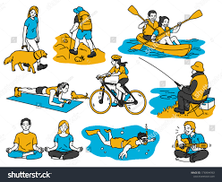

用法示例： +
 The community center offers (v.)  _various recreation activities_ for families. (社区中心为家庭提供各种娱乐/休养活动。) +
 Hiking and camping are forms of outdoor recreation. (徒步旅行和露营是户外休养的方式。)
|===

总结
[options="autowidth" cols="1a,1a,1a,1a"]
|===
| 词语 | 词性 | 含义和侧重点 | 核心概念
| Pastime | 名词 | 填充闲暇时间、提供轻松乐趣的个人爱好 | 轻松消遣
| Entertain | 动词 | 以愉悦的方式吸引某人、提供享受的行为 | 提供乐趣/款待
| Recreation | 名词 | 恢复体力和精神、恢复活力的活动 | 恢复身心活力
|===

简单来说，这三个词的区别在于**词性和目的**： +
* **Pastime** 是**轻松愉快的个人爱好**（目的：消磨时间）。 +
* **Entertain** 是**使某人感到快乐或被吸引的动作**（动词：提供乐趣）。 +
* **Recreation** 是**有目的的活动**，为了**恢复身心活力**（目的：休养生息）。 +

**Pastime** 和 **Recreation** 都是可以 **Entertain** (使人快乐) 的活动。 +

'''

==== imitate, mimic

[.small]
[options="autowidth" cols="1a,1a"]
|===
|Header 1 |Header 2

|Imitate
|Imitate (模仿) 是一个**通用**的词，指**复制或效仿某人的行为、言语、风格或产品**。##这个词可以用于**学习、尊敬**或**娱乐**等多种目的。##它强调的是**进行复制或遵循模型**的行为，侧重于**广义上的相似和效仿**。

性质： **复制或效仿某物或某人的行为、风格**。

侧重点： 强调**广义上的相似**，#目的可以是学习、尊敬或复制产品。#

-> 前缀 “im-”（此处为 #“in-” 的变体，表 “进入…… 状态”，加强语气）#，词根 “itat-”（模仿，源自拉丁语 “imitari”），后缀 “-e”（动词后缀），指模仿

用法示例： +
 Children learn to speak by imitating the sounds they hear. (儿童通过模仿听到的声音来学习说话。) +
 The artist tried to imitate the style of Van Gogh. (这位艺术家试图模仿梵高的风格。) +

|Mimic
|Mimic (模仿，滑稽地模仿) 是一个**更具体**的词，指**精确地、通常带有幽默或讽刺意味地复制某人的言语、手势或举止**。#它强调**准确性**，特别是**针对个人的特点**，通常用于**表演或娱乐**。它还常指动物或植物的**拟态**行为。#

性质： **精确地、常带幽默或讽刺意味地复制**。

侧重点： 强调**精确的复制**，针对**特定个人的特点**，#常用于**表演或娱乐**。#

用法示例： +
 The comedian was famous for his ability to mimic (v.) political figures. (这位喜剧演员以其模仿政治人物的能力而闻名。) +
 The parrot can perfectly mimic (v.) human speech. (这只鹦鹉可以完美地模仿人类的语言。) +
|===

总结
[options="autowidth" cols="1a,1a,1a,1a"]
|===
| 词语 | 含义和侧重点 | 目的/方式 | 核心概念
| Imitate | 广义上的复制或效仿行为、风格 | 学习、尊敬、复制产品 | 广义的相似和遵循模型
| Mimic | 精确地复制特定个人的举止或声音 | 表演、娱乐、滑稽、讽刺 | 精准的复制和特征重现
|===

简单来说，这两个词的区别在于**精确性和目的**： +
* **Imitate** 是**广义的模仿**，可以是**学习**。 +
* **Mimic** 是**精准的模仿**，通常**带有表演或滑稽的成分**。 +

一个学生会 **imitate** (模仿) 老师的教学方法 (学习)，但一个喜剧演员会 **mimic** (滑稽模仿) 老师的独特口音和手势 (娱乐)。 +

'''

==== select, opt

[.small]
[options="autowidth" cols="1a,1a"]
|===
|Header 1 |Header 2

|Select
|Select (选择，挑选) 是一个**通用**的词，指**从多个选项中做出选择**，通常基于**偏好、判断或仔细的考量**。这个词强调的是**挑选和区分**的行为，#意味着选择者需要**权衡利弊**或**运用标准**。#

性质： **从多个选项中做出有根据的选择**。

侧重点： 强调**挑选过程**、**考量标准**和**对选项的区分**。

用法示例： +
 The committee selected the best candidate for the job /after several interviews. (委员会经过数次面试，挑选了最合适的候选人。) +
 Please select your preferred language from the menu. (请从菜单中选择您偏好的语言。)

|Opt
|Opt (选择，决定) ##是一个**更正式**的词，##通常用作**不及物动词** (常接 to 或 for)，指**做出一个决定或表达一种偏好**，特别是在有**明确对立或替代选项**的情况下。#它强调的是**做出决定的意愿和自由裁量权**，通常用于**表达意向或正式表态**。#

性质： **在明确的替代选项中, 做出决定或表达偏好**。

侧重点： #强调**做出决定的意愿**和**正式的表态**（常用于政策、保险、教育等语境）。#

用法示例： +
 Employees can opt (v.) to receive their salary *via* direct deposit or paper check. (员工可以选择通过直接存款或纸质支票领取薪水。) +
 After careful consideration, she opted not to go to graduate school this year. (经过仔细考虑，她决定今年不读研究生。)
|===

总结
[options="autowidth" cols="1a,1a,1a,1a"]
|===
| 词语 | 词性 | 含义和侧重点 | 核心概念
| Select | 及物动词 | 从多个选项中挑选出最好的或最合适的 | 挑选、考量标准
| Opt | 不及物动词 | 在明确选项中做出决定或表达意愿 | 做出决定、意愿
|===

简单来说，这两个词的区别在于**用法和侧重**： +
* **Select** (挑选) 强调**从多个对象中挑出某一个或几个** (及物动词)。 +
* **Opt** (决定) 强调**做出一个决定或表达一种意愿** (不及物动词，常接介词 for 或 to)。 +

你可以 **select** (挑选) 一件衬衫，但你 **opt** (选择/决定) **for** 衬衫,而不是毛衣。 +

'''

==== depict, describe

[.small]
[options="autowidth" cols="1a,1a"]
|===
|Header 1 |Header 2

|Depict
|Depict (描绘，描画) ##指**通过艺术形式**（如绘画、雕塑、电影）**或语言，##以生动、视觉化的方式来表现某人或某事**。它强调的是**生动的、具象的再现**，让接收者可以在脑海中形成一个画面。它通常用于**艺术、文学**或**象征性**的语境。

性质： 强调**视觉化、具象化的再现**。

侧重点： 侧重于**生动的描画**，使事物**栩栩如生**。

用法示例： +
 The painting `谓` depicts (v.) a scene from Greek mythology. (这幅画描绘了希腊神话中的一个场景。) +
 The movie attempts to depict (v.) the harsh realities of war. (这部电影试图描绘战争的残酷现实。)

|Describe
|Describe (描述) 是一个**通用**的词，##指**用文字或口头语言详细地说明##事物、事件、人物或过程的特征、性质或细节**。它强调的是**用语言进行解释和说明**，#目的是让接收者**理解**。它通常用于**报告、说明或日常交流**。#

性质： 强调**用语言详细说明特征和细节**。

侧重点： 侧重于**解释、说明**和**信息传递**。

用法示例： +
 The witness *described* the suspect's appearance *to* the police. (证人向警察描述了嫌疑人的外貌。) +
 Can you describe the steps of the experiment in detail? (你能详细描述一下这个实验的步骤吗？)
|===

总结
[options="autowidth" cols="1a,1a,1a,1a"]
|===
| 词语 | 含义和侧重点 | 方式 | 核心概念
| Depict | 通过具象化、生动的方式来表现 | 艺术、文学、视觉化 | 生动、具象的再现
| Describe | 用语言详细说明特征、性质或细节 | 语言、文字、口头说明 | 解释、信息传递
|===

简单来说，这两个词的区别在于**表达方式**： +
* **Describe** (描述) 是用**语言**，目的是让听者**理解**。 +
* **Depict** (描绘) 是用**具象化的方式** (通常是视觉艺术或生动的语言)，目的是让观者**看到**或**感受**。 +

你可以 **describe** (描述) 一个人如何做某事 (解释步骤)，但一幅画 **depicts** (描绘) 这个人做某事的样子 (视觉呈现)。 +

'''

==== melody, tune

[.small]
[options="autowidth" cols="1a,1a"]
|===
|Header 1 |Header 2

|Melody
|Melody (旋律) #是一个**更正式、更专业的音乐术语**#，指**按照特定节奏、以令人愉悦的方式组合在一起的一系列音高**。它强调**音高、节奏和乐句**的精心组织，是音乐的**主题或主线**。Melody 通常意味着**设计精良、具有艺术价值**的乐段。

性质： 强调**音高和节奏的结构化、艺术性组合**。

侧重点： 侧重于**音乐的结构、主线**和**艺术性**。

用法示例： +
 The opera is famous for its haunting and complex melody. (这部歌剧以其萦绕心头且复杂的旋律而闻名。) +
 The composer developed the central melody /throughout the entire symphony. (作曲家在整个交响乐中发展了中心旋律。)

|Tune
|Tune (曲调，调子) ##是一个**更通用、更口语化**的词，##指**一段易于识别、易于记住的、简单的音高和节奏序列**。##它强调**易于识别和记忆**的特点，不一定像 Melody 那样强调复杂的结构或艺术性。##它也可以指**乐器的音准** (in tune/out of tune) 或**广播频率** (tune in)。

性质： 强调**易于识别、简单悦耳的音高序列**。

侧重点： 侧重于**易记性、口语化**和**整体的乐感**。

用法示例： +
 The children were humming a cheerful tune /as they played. (孩子们边玩边哼着一支欢快的曲调。) +
 Can you play that old tune on the piano? It's so catchy (a.)（曲调或口号）悦耳易记的；易使人上当的. (你能用钢琴弹那首老曲子吗？它太朗朗上口了。) +
|===

总结
[options="autowidth" cols="1a,1a,1a,1a"]
|===
| 词语 | 含义和侧重点 | 用法语境 | 核心概念
| Melody | 结构化的、具有艺术性的音高和节奏组合 | 正式、音乐理论 | 音乐的主题和结构
| Tune | 简单的、易于哼唱和记忆的音高序列 | 日常、口语化 | 易记的曲调或乐感
|===

简单来说，你可以把它们想象成一个**专业程度和复杂度的区别**： +
* **Tune** (曲调) 是**简单的、好记的乐句**，是**朗朗上口的声音**。 +
* **Melody** (旋律) 是**精心设计的、有结构的乐句**，是**音乐作品的主题**。 +
* 所有的 **Melodies** 都是 **Tunes** (都是曲调)，但只有那些**具有复杂结构和艺术意义**的 **Tunes** 才能被称为 **Melodies**。 +

'''

==== energetic, vigorous

[.small]
[options="autowidth" cols="1a,1a"]
|===
|Header 1 |Header 2

|Energetic
|Energetic (精力充沛的，有活力的) 是一个**通用**的词，指**充满能量和热情**，通常指**精神上或情绪上**的活跃状态。它强调的是**内在的活力、#热情和积极的态度#**，#常用来形容人、演讲或表现。#

性质： **充满活力、热情和积极性**。

侧重点： 强调**内在能量**、**精神状态**和**热情**。

用法示例： +
 The young teacher was very energetic /and kept the students engaged. (这位年轻的老师精力非常充沛，让学生们保持专注。) +
 She gave an energetic performance /that captivated (v.)迷住；迷惑 the audience. (她进行了一场充满活力的表演，迷住了观众。)

|Vigorous
|Vigorous (有力的，强健的，精力旺盛的) 是一个**更强调身体力量、强度或决心**的词。#它指**强大的体力和精力**，以及**强有力的行动或坚决的努力**。它常用于形容**体育活动、身体动作或决心**。#

性质： **强大的体力、力量或坚决的强度**。

侧重点： 强调**体力和力量**，以及**行动的强度和坚决性**。

用法示例： +
 He performs vigorous exercise every morning /to stay healthy. (他每天早上进行剧烈的运动以保持健康。) +
 The policy was met with vigorous opposition from the public. (这项政策遭到了公众的强烈反对。) +
|===

总结
[options="autowidth" cols="1a,1a,1a,1a"]
|===
| 词语 | 含义和侧重点 | 焦点 | 核心概念
| Energetic | 充满活力、热情和积极性 | 内在的活力、精神状态 | 精力充沛、有热情
| Vigorous | 强大的体力、力量或坚决的强度 | 身体的力量、行动的强度 | 强健有力、坚决
|===

简单来说，这两个词的区别在于**力量的来源和表现**： +
* **Energetic** 强调**内在的活力和热情**，可以指**精神上**的兴奋。 +
* **Vigorous** 强调**身体上的力量和行动的强度**，是**强健有力**的表现。 +
* 一个 **energetic** (精力充沛的) 人**热情地**工作；一个 **vigorous** (有力的) 运动**需要强大的体力**。 +

'''

==== bat, racket

[.small]
[options="autowidth" cols="1a,1a"]
|===
|Header 1 |Header 2

|Bat
|Bat (球棒) 指**用于击打球类运动中##较硬或较大的球的坚硬、实心的长柄工具**。##它的击球部分通常是**实心的**，呈**圆柱形或扁平的桨形**，##没有网状结构。##它常##用于棒球 (baseball)、板球 (cricket) 和垒球 (softball)。##

性质： **用于击打硬球或大球的实心长柄工具**。

侧重点： 强调**实心**的击打表面，通常用于**棒类运动**。

用法示例： +
 The batter gripped his wooden bat tightly /before stepping up to the plate. (击球手在上场前紧紧握住了他的木制球棒。) +
 A baseball bat must be made of wood or an approved metal alloy. (棒球棒必须由木材或经批准的金属合金制成。)

|Racket
|Racket (球拍) 指**用于击打小型或轻型球类运动中**（如网球、羽毛球、壁球）**球或羽毛球的工具**。它的击球部分有一个**开放的框架**，#上面**拉有网状的弦线**。它的设计是为了提供**弹性和控制**。#

性质： **用于击打轻型球或羽毛球的带网状弦线的工具**。

侧重点： 强调**网状弦线**的击打表面，通常用于**网类运动**。

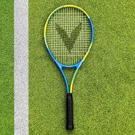

用法示例： +
 The tennis player smashed the ball /with her powerful racket. (这位网球运动员用她有力的球拍猛击球。) +
 You need a lightweight racket for badminton. (打羽毛球需要一个轻型的球拍。)
|===

总结
[options="autowidth" cols="1a,1a,1a,1a"]
|===
| 词语 | 含义和侧重点 | 击球表面 | 常见运动
| Bat | 用于击打硬球或大球的实心长柄工具 | 坚硬、实心、圆柱形或桨形 | 棒球、板球、垒球
| Racket | 用于击打轻型球或羽毛球的带弦线工具 | 开放框架、网状弦线 | 网球、羽毛球、壁球
|===

简单来说，这两个词的区别在于**击球面的结构**： +
* **Bat** (球棒) 是**实心的**，用于击打**硬物**。
* **Racket** (球拍) 是**带网弦的**，用于击打**轻物**。
* 虽然乒乓球拍在英文中叫 $ping-pong \space paddle$ 或 $table \space tennis \space bat$，但遵循通用的物理和结构区别，**Racket** 通常指**带网弦**的球拍。

'''

==== flip, pitch, throw, toss

[.small]
[options="autowidth" cols="1a,1a"]
|===
|Header 1 |Header 2

|Throw
|Throw (扔，投掷) 是**最通用**的词，指**用手臂的力量将物体掷向空中或某个方向**。它强调**使用力量**和**物体被释放**，#可以指任何投掷行为，无论是用力大还是小，有目的还是无目的。#

性质： **用手臂的力量将物体掷出**。

侧重点： 强调**力量**和**物体被释放**。

用法示例： +
 She threw the ball over the fence. (她把球扔过了篱笆。) +
 Don't throw trash on the ground. (不要把垃圾扔到地上。) +

|Flip
|#Flip (快速翻转，轻弹) 指**以快速、轻巧的动作, 使物体快速翻转或颠倒**。它强调**旋转或颠倒**，而不是距离或力量。它常用于**抛硬币** (flip a coin) 或**翻转物体**。#

性质： **以快速、轻巧的动作使物体翻转或颠倒**。

侧重点： 强调**旋转**和**颠倒**。

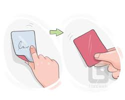
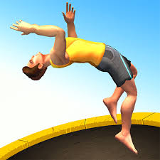

用法示例： +
 He flipped the pancake in the air /with a spatula. (他用锅铲把煎饼抛向空中并翻转过来。) +
 Just *flip the switch* to turn on the light. (只需拨动开关打开灯。)

|Toss
|#Toss (抛，轻轻扔) 指**轻轻地、随意地或以短距离将物体抛向空中或目标**。它强调**动作的轻盈和随意性**，或**短距离的抛掷**。常用于抛硬币 (coin toss) 或随意丢弃物品。#

性质： **轻轻地、随意地或短距离地抛掷**。

侧重点： 强调**轻巧和随意性**。

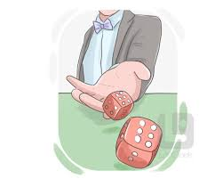

用法示例： +
 He tossed his keys onto the table. (他把钥匙轻轻地扔到桌子上。) +
 Let's toss a coin /to decide who goes first. (我们抛硬币来决定谁先开始。)

|Pitch
|#Pitch (投球，投掷) 是一个**专业**的词，指**在棒球或板球等运动中，按照严格的规则和技术将球投向击球手**。它强调**精确性、速度**和**特定的运动技术**。在日常语境中，也可指**推销或提案** (sales pitch)。#

性质： **在特定运动中，以精确技术和规则进行的投掷**。

侧重点： 强调**技术、速度**和**精确瞄准**。

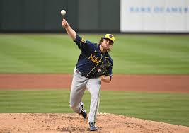
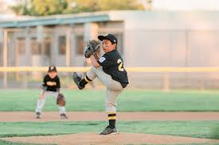

用法示例： +
 The pitcher pitched a curveball to strike out the final batter. (投手投出一个曲线球，三振了最后一名击球手。) +
 He spent the whole meeting /pitching his idea to the board. (他花了整个会议向董事会推销他的想法。)

|===

总结
[options="autowidth" cols="1a,1a,1a,1a"]
|===
| 词语 | 含义和侧重点 | 力量/距离 | 核心动作
| Throw | 通用投掷动作，将物体掷出 | 通用 (可大可小) | 释放和力量
| Flip | 快速、轻巧地使物体翻转 | 轻巧，短距离，原地 | 旋转和颠倒
| Toss | 轻轻地、随意地抛掷 | 轻巧，短距离 | 随意性
| Pitch | 有技术、有目的、遵循规则的投掷 | 精确、速度 | 精确投射
|===

简单来说，这四个词的区别在于**力量、目的和动作**： +
* **Throw** (扔) 是**通用**动作，强调**力量**。 +
* **Flip** (翻) 是**旋转**动作，强调**物体状态的改变**。 +
* **Toss** (抛) 是**轻巧**动作，强调**随意**。 +
* **Pitch** (投) 是**专业**动作，强调**技术和瞄准**。 +

'''

==== slide, slip, glide

[.small]
[options="autowidth" cols="1a,1a"]
|===
|Header 1 |Header 2

|Slip
|Slip (滑倒，失足) 指**在湿滑或不平的表面上失去摩擦力或立足点，##导致意外的、不自觉的滑动**。这个词强调的是**失去控制、意外**和**危险**。##它通常指**人或物意外地失去了附着力**。

性质： **意外地失去摩擦力或立足点，导致不受控的滑动**。

侧重点： 强调**意外**、**失去控制**和**危险**。

用法示例： +
 Be careful not to slip (v.) on the wet floor. (小心不要在湿地板上滑倒。) +
 The wet rope slipped (v.) through his hands. (湿滑的绳子从他的手中滑脱了。)

|Slide
|Slide (滑动) 指**平稳地、受控地在一个表面上移动**。##这个词强调的是**移动的平稳性**，动作通常是**有意图、有目的**的，##但可能缺乏摩擦力。#它常用于指**沿着轨道、斜坡**或**光滑表面**的移动。#

性质： **平稳地、受控地在一个表面上移动**。

侧重点： 强调**移动的平稳性和受控性**，通常是**有意的动作**。

用法示例： +
 The children loved *to slide (v.) down* the snowy hill /on their sleds. (孩子们喜欢坐着雪橇滑下雪坡。) +
 She opened the door /by sliding the glass panel （门等的）镶板，嵌板 to one side. (她通过将玻璃板滑向一侧打开了门。)

|Glide
|Glide (滑行，悄然移动) #指**非常平稳、轻盈、毫不费力地移动**，通常是在**空中**或**非常光滑的表面**上。它强调**优雅、毫不费力和持续的平稳性**，仿佛没有任何摩擦或重力。#

性质： **轻盈、平稳、毫不费力地持续移动**。

侧重点： 强调**优雅**、**轻松**和**持续的平稳**。

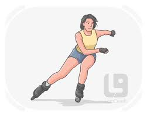

用法示例： +
 The swan glided gracefully across the surface of the lake. (天鹅优雅地滑过湖面。) +
 The airplane glided in /for a smooth landing /after its engine failed. (飞机引擎失灵后，平稳地滑行着陆。)
|===

总结
[options="autowidth" cols="1a,1a,1a,1a"]
|===
| 词语 | 含义和侧重点 | 控制力/意图 | 核心概念
| Slip | 意外地失去摩擦力而滑动 | 不受控，意外 | 失去立足点/失控
| Slide | 平稳地、受控地在表面上移动 | 受控，有目的 | 平稳滑动
| Glide | 极其平稳、轻盈、毫不费力地持续移动 | 受控，优雅 | 轻松优雅的滑行
|===

简单来说，这三个词的区别在于**控制力**： +
* **Slip** (滑倒/滑脱) 是**无意识、失控**的意外滑动。 +
* **Slide** (滑动) 是**有意识、可控**的平稳移动。 +
* **Glide** (滑行) 是**有意识、极其平稳、毫不费力**的优雅移动。 +

'''

==== jump, leap, spring, hop

[.small]
[options="autowidth" cols="1a,1a"]
|===
|Header 1 |Header 2

|Jump
|Jump (跳跃) 是**最通用**的词，指**用腿的力量, 使身体或物体从地面或其他表面快速上升，并离开表面一段距离**。#它可以指**双脚或单脚起跳**，强调**突然的向上或向前运动**，目的可以是到达更高的地方、越过障碍物或表达情绪。#

性质： **用腿的力量, 使身体快速升空和移动**。

侧重点： 强调**通用的跳跃动作**和**突然的升降/移动**。

用法示例： +
 The athlete had to jump over a high hurdle. (运动员必须跳过一个高高的障碍。) +
 She *jumped up and down* with excitement /when she heard the news. (听到消息后，她兴奋地跳上跳下。)

|Leap
|#Leap (跳跃，跨越) 指**有力地、大步地、通常是优雅地向前或向上跳跃**。它强调**距离、高度或优雅**，常常带有**明确的目的性**，如跨越一个空间、逃离危险或比喻意义上的“飞跃”。#

性质： **有力、大步、通常优雅的跳跃**。

侧重点： 强调**距离、高度**和**目的性**。

用法示例： +
 The gazelle *leaped across the stream* /to escape the predator. (瞪羚跳过溪流, 以逃避捕食者。) +
 The company *made a huge leap forward* in technology. (这家公司在技术上取得了巨大的飞跃。)

|Spring
|#Spring (弹跳，跃起) 指**快速、突然地、像弹簧一样地从静止或低姿势跃起**。它强调**快速的反弹、爆发力**和**动作的突然性**。常用于形容动物或人**突然起跳**的动作。#

性质： **快速、突然地、像弹簧一样地跃起或弹跳**。

侧重点： 强调**爆发力**、**突然性**和**反弹的动作**。

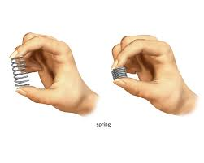

用法示例： +
 The cat suddenly sprang (v.) onto the counter top. (那只猫突然跃上了台面。) +
 The door sprang (v.) open /when the wind hit it. (风一吹，门就猛地弹开了。)

|Hop
|##Hop (单脚跳，蹦跳) 指**用一只脚或双脚, 同时以短距离和低高度进行轻快的、重复的跳跃**。它强调**单脚**起跳和落地，或**双脚一起**的**轻快、短促**动作。##常用于描述儿童游戏或鸟类的移动。

性质： **单脚或双脚同时进行的短促、轻快的跳跃**。

侧重点： 强调**单脚**或**短促、轻快**的动作。

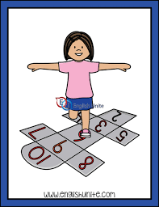

用法示例： +
 The little girl was hopping on one foot /during the game. (那个小女孩在玩游戏时单脚蹦跳。) +
 A small bird hopped along the branch. (一只小鸟沿着树枝蹦蹦跳跳。)
|===

总结
[options="autowidth" cols="1a,1a,1a,1a"]
|===
| 词语 | 含义和侧重点 | 动作特征 | 核心概念
| Jump | 通用跳跃动作 | 突然的向上或向前移动 | 广义的跳跃
| Leap | 有力、大步、优雅的跳跃 | 强调距离、高度、目的性 | 大步跨越/飞跃
| Spring | 快速、突然、爆发性的弹跳 | 强调爆发力、反弹 | 突然跃起
| Hop | 单脚或双脚一起的短促、轻快跳跃 | 强调单脚或轻快短距 | 蹦跳/单脚跳
|===

简单来说，这四个词的区别在于**力量、距离和用脚方式**： +
* **Jump** (跳) 是**通用**动作。 +
* **Leap** (跨/跳) 是**远距离、高高度**的跳。 +
* **Spring** (跃) 是**突然的、像弹簧一样的**跳。 +
* **Hop** (蹦/跳) 是**单脚或短距离、轻快**的跳。 +

'''

==== excursion, hike

[.small]
[options="autowidth" cols="1a,1a"]
|===
|Header 1 |Header 2

|Excursion
|Excursion (远足，短途旅行) 是一个**通用**的词，##指**短距离的、通常是出于娱乐或教育目的的旅行**。它强调的是**离开出发地、进行参观或访问**的行为，**不一定涉及徒步。它可以乘坐任何交通工具，**##是**短途旅游**的统称。

性质： **出于娱乐或教育目的的 短途旅行或观光**。

侧重点： #强调**旅行的短距离、目的** (观光/学习) 和**返回出发地**。#

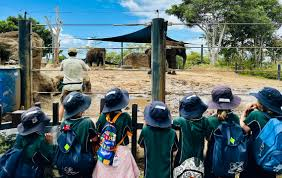

用法示例： +
 The class took an excursion to the local history museum. (班级去当地的历史博物馆进行了短途旅行。) +
 A boat excursion around the island is highly recommended. (强烈推荐环岛乘船游览。)

|Hike
|#Hike (徒步旅行，远足) 指**在乡村、山区或自然环境中，通常是为**了**娱乐或锻炼而进行的长时间步行**。它强调**步行**这一动作本身，以及**在自然环境中**的活动形式。**Hike** 是 **Excursion** 的**一种形式**。#

性质： **在自然环境中进行的 长时间步行或徒步旅行**。

侧重点： 强调**步行的体力活动**和**自然环境**。

用法示例： +
 We plan to hike (v.) to the top of the mountain /early tomorrow morning. (我们计划明天一大早徒步登上山顶。) +
 The forest trail is perfect for _a weekend hike_. (这条森林小径非常适合周末徒步旅行。)
|===

总结
[options="autowidth" cols="1a,1a,1a,1a"]
|===
| 词语 | 含义和侧重点 | 交通方式 | 核心概念
| Excursion | 出于娱乐或教育目的的短途旅行 | 任意 (汽车、船、步行等) | 短途旅行/观光
| Hike | 在自然环境中进行的长时间步行 | 步行/徒步 | 徒步活动/体力锻炼
|===

简单来说，这两个词的区别在于**活动形式**： +
* **Excursion** (短途旅行) 是一个**目的性**概念，指**离开出发点的短途行程**，不限制交通工具。 +
* **Hike** (徒步) 是一个**活动形式**概念，特指**在野外走路**。 +

一次 **Hike** (徒步) 可以是一次 **Excursion** (短途旅行)，但一次乘火车去海边的 **Excursion** (短途旅行) 就不是 **Hike** (徒步)。 +

'''

==== pull, drag

[.small]
[options="autowidth" cols="1a,1a"]
|===
|Header 1 |Header 2

|Pull
|Pull (拉) 是**最通用**的词，指**对物体施加力量，使其向施力者方向移动**。#这个动作的核心是**缩短物体和施力者之间的距离**。被拉的物体**可以**离开地面、在地面上滚动、滑动或移动。#

性质： **对物体施加力量，使其向施力者靠近**。

侧重点： 强调**方向** (靠近施力者) 和**施力的动作**。

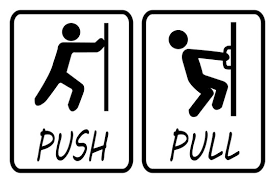
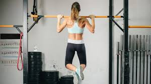

用法示例： +
 Pull the door open. (把门拉开。) +
 The little boy *pulled his mother's hand*. (小男孩拉着他妈妈的手。) +

|Drag
|#Drag (拖，拉拽) 指**用力量将沉重或笨重的物体, 在地面或另一个表面上费力地拖着移动**。这个词强调**移动的困难**、**持续的摩擦力**和**缓慢的移动速度**。被拖的物体通常**紧贴地面**。#

性质： **费力地、贴着表面将物体拖着移动**。

侧重点： 强调**难度**、**摩擦力**和**物体的沉重**。

用法示例： +
 They had to drag the heavy sofa across the room. (他们不得不费力地把沉重的沙发拖过房间。) +
 *The meeting was dragging on* /and seemed endless. (会议拖得太久，似乎没完没了。)
|===

总结
[options="autowidth" cols="1a,1a,1a,1a"]
|===
| 词语 | 含义和侧重点 | 移动方式 | 核心概念
| Pull | 向施力者方向移动的通用动作 | 可以离开表面，强调方向 | 缩短距离
| Drag | 贴着表面费力地拖着移动 | 紧贴表面，强调摩擦力和难度 | 费力拖拽
|===

简单来说，这两个词的区别在于**摩擦力和难度**： +
* **Pull** (拉) 是**通用**动作，不强调难度。 +
* **Drag** (拖) 是**费力**地 **Pull** (拉)，强调**摩擦力大**和**物体沉重**。 +

你可以 **pull** (拉) 你的手，但你必须 **drag** (拖) 一个沉重的麻袋。 +

'''

== other

[.small]
[options="autowidth" cols="1a,1a"]
|===
|Header 1 |Header 2

|jazz
|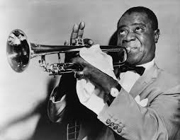
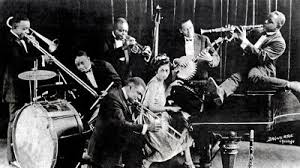

"Jazz"（爵士乐）是一种起源于19世纪末20世纪初美国新奥尔良**非裔社区**的音乐流派，其根基来自蓝调、拉格泰姆以及欧洲军乐，*并融合了非洲黑人与欧洲白人文化。爵士乐以即兴演奏、摇摆节奏, 和复杂的和弦为特征.*

|rock
|

|hip-hop
|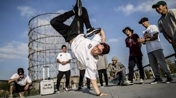

嘻哈是一种文化运动和音乐流派，起源于 20 世纪 70 年代初纽约市布朗克斯区的**非裔美国人和拉丁裔社区 。** 其核心组成部分或支柱是 *#DJ（唱盘主义）、MC（说唱）、霹雳舞（B-boying/B-girling）和涂鸦艺术。#* 虽然##**说唱音乐是嘻哈音乐的核心部分，**##但这种文化涵盖了更广泛的表达方式和活动，从时尚和语言到创业。

The Four Pillars of Hip-Hop
嘻哈的四大支柱

- DJing/Turntablism: Manipulating pre-recorded music with turntables [声]转盘（turntable 的复数）；[电子]唱盘 to create rhythmic backdrops  背景布幕;（事态或活动的）背景, beats, and _instrumental tracks_ 器乐曲(没有歌词，只有乐器演奏的音乐曲目).  +
DJ /唱盘主义 ： 使用转盘操纵预先录制的音乐, 来创建有节奏的背景、节拍和乐器曲目。

- MCing/Rapping: The vocal component of hip-hop, where `主` rhythmic (a.)有节奏的，有韵律的 and rhyming (a.)押韵的 spoken-word poetry `谓` is recited over instrumental beats.  +
MC /说唱 ： 嘻哈音乐的声乐部分，在乐器的节拍下朗诵有节奏、押韵的口语诗歌。

- Breakdancing  霹雳舞 (B-boying/B-girling): A style of street dance characterized by energetic and acrobatic (a.)杂技的；特技的 movements.  +
霹雳舞 （B-boying/B-girling） ： 一种以充满活力和杂技动作为特征的街舞风格。

- Graffiti (n.v.)（公共场所墙上等处的）涂鸦，胡写乱画 Art (Graffiti/Writing): *Using* walls and other public surfaces *as* canvases 帆布 /for artistic expression.  +
涂鸦艺术 （涂鸦/写作） ： 使用墙壁和其他公共表面作为艺术表达的画布。

|flute
|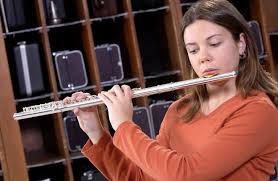
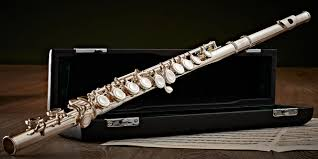

|billiards
|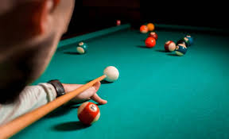

|hockey
|image:img/hockey.jpg[,15%]

|cricket
|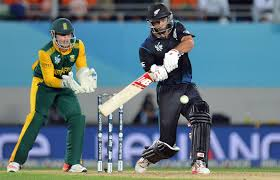

|picnic
|

|cruise
|

|stride
|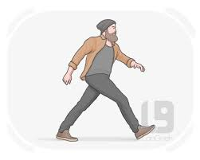

|===

