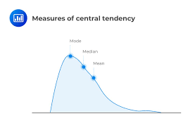

= part 11
:toc: left
:toclevels: 3
:sectnums:
:stylesheet: ../../myAdocCss.css

'''

== part 11

==== fashion, style, trend, tendency, current, popularity, vogue

[.small]
[options="autowidth" cols="1a,1a"]
|===
|Header 1 |Header 2

|Style
|#Style (风格，款式) 指**一个人或事物独特的、个性的表达方式**，尤其体现在服装、艺术、写作或生活方式上。它强调**独特性、内在的品味**和**持久的个性特征**。**Style** 可以是永恒的，不一定受流行影响。#

性质： **独特、个性化的表达方式或品味**。

侧重点： 强调**个性**、**内在品味**和**长期的、不变的特征**。

用法示例： +
 He has _a unique personal style_ that is all his own. (他拥有自己独特的个人风格。) +
 That classic suit will never **go out of style**. (那套经典西装永远不会过时。)

|Tendency
|#Tendency (倾向，趋势) 指**某人或某物固有的、自然的或习惯性的行为或发展方向**。它强调**内在的倾向性**和**概率性**，比 **Trend** 更侧重于**非时尚领域的、普遍的、潜在的倾向或习性**。#

性质： #**内在的、习惯性的或潜在的行为/发展倾向**。#

侧重点： 强调**内在性、习性**和**概率**。

用法示例： +
 He has a **tendency** to interrupt (v.) people /when they are talking. (他有在别人说话时插嘴的习惯。) +
 There is _a growing tendency_ toward online education. (在线教育的趋势正在增长。)

|Trend
|Trend (趋势，倾向) 指**在一段时间内，某个领域 (如时尚、经济、技术) 普遍发生的、具有方向性的变化或发展**。#它强调**变化的方向**和**逐渐的演变**，是**Fashion** 形成前的**发展方向**。#

性质： **具有方向性的、逐渐演变的变化或发展**。

侧重点： 强调**变化的方向**和**演变过程**。

用法示例： +
 _The latest trend_ in _home decorating_ 家居装饰 is minimalist design. (家居装饰的最新趋势是极简主义设计。) +
 Market analysts track (v.) **trends** in consumer spending. (市场分析师追踪消费者支出的趋势。)

|Fashion
|Fashion (时尚，时装) 是一个**广泛且正式的名词**，指**在特定时间或地点流行的、被接受的穿着或行为方式**。#它通常由**时尚界** (如设计师、媒体) 推广，是**集体现象**。它强调**服装、配饰和外部流行的变化**。#

性质： **在特定时期内流行的、被广泛接受的集体行为或穿着方式**。

侧重点： 强调**外部流行**、**集体接受度**和**服装/外观行业**。

用法示例： +
 Paris and Milan are centers of **fashion** and design. (巴黎和米兰是时尚和设计的中心。) +
 She always keeps up with the latest **fashions**. (她总是紧跟最新的时尚潮流。)

|Popularity
|Popularity (流行度，普及度) 指**某人或某事被许多人喜欢或支持的程度**。#它是一个**衡量标准**，强调**被大众接受和喜爱的程度**，是 **Fashion** 和 **Trend** 的**结果**。#

性质： **被大众喜欢和接受的程度**。

侧重点： 强调**被接受的广度**和**喜爱度**。

用法示例： +
 The singer's **popularity** soared /after his viral video. (这位歌手在视频走红后人气飙升。) +
 The low cost contributed to the popularity of the product. (低成本促成了该产品的普及。)

|Vogue
|##Vogue (时尚，流行) 是一个**正式且优雅的名词**，特指**在某个特定时期内非常流行或时髦的状态或风格**。它与 **Fashion** 和 **Popularity** 相似，但更带有**高雅、精致**的意味，##常用于指**高级或短暂的流行**。

性质： **某个时期内优雅、时髦的流行状态或风格**。

侧重点： 强调**流行状态**，常带有**精致或高雅**的意味。

用法示例： +
 That type of hat is currently _in vogue_. (那种帽子目前正流行。) +
 The old architectural style has come back into **vogue**. (那种旧的建筑风格又重新流行起来了。)

|Current
|Current (当前的，流行的) 是一个**形容词**，指**正在发生或流行的**。作为名词，它指**水流、气流或电流**。在时尚和流行语境中，它强调**时间性**，即**当下流行的状态**。

性质： **形容词**，表示**此时此刻正在流行的状态**。

侧重点： 强调**时间点** (当下)。

用法示例： +
 What is the **current** interest rate? (当前的利率是多少？) +
 Her clothing choices reflect the **current** mood in fashion. (她的服装选择反映了当前的时尚氛围。)

|===

总结
[cols="1,1,1,1",options="header"]
|===
| 词语 | 含义和侧重点 | 性质/时长 | 核心概念
| Style | 独特、个性的表达方式/品味 | 内在品味，可永恒 | 独特个性
| Tendency | 某人或某事内在的习性/倾向 | 内在倾向，概率性 | 潜在习性/自然趋向
| Fashion | 集体接受的穿着/行为方式 | 外部流行，集体现象 | 流行款式/时装界
| Trend | 某个领域发展的方向/变化 | 变化方向，逐渐演变 | 发展方向/大势
| Popularity | 被大众喜欢和接受的程度 | 衡量结果 (程度) | 广受欢迎程度
| Vogue | 某个时期内优雅、时髦的流行状态 | 高雅，短暂或经典流行 | 优雅的流行状态
| Current | 当下正在流行的状态 (形容词) | 时间性 (当下) | 现时的/目前的
|===

简单来说，你可以用**范围和侧重点**来区分它们： +

* **Style** (风格) 是**个人**的**内在**品味。 +
* **Tendency** (倾向) 是**内在**的**习性**。 +

* **Trend** (趋势) 是**变化**的**方向**。 +
* **Fashion** (时尚) 是**集体**的**外部**流行。 +
* **Vogue** (流行) 强调**高雅**的流行**状态**。 +
* **Popularity** (流行度) 强调**接受的**程度。 +
* **Current** (当前的) 强调**当下**。 +

例如：一个设计师的 **style** (风格) 影响了 **fashion** (时尚) 界的 **trend** (趋势)，使某种款式处于 **vogue** (流行) 中，从而提升了它的 **popularity** (流行度)，这是目前的 (**current**) 状况。 +

'''

== other