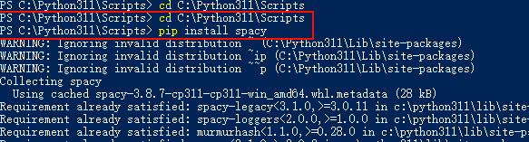
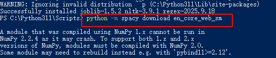
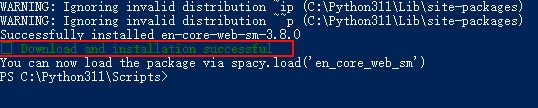
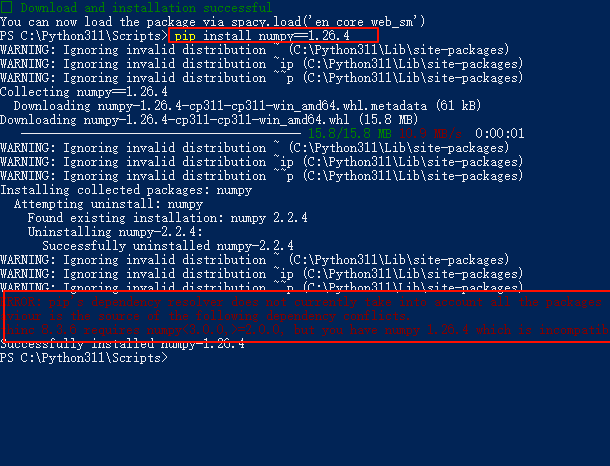

= 使用到的python 库=
:toc: left
:toclevels: 3
:sectnums:
:stylesheet: ../../../myAdocCss.css

'''

== 词频统计 库 : spaCy (推荐) 和 NLTK

[.small]
[options="autowidth" cols="1a,1a"]
|===
|Header 1 |Header 2

|第1步, 要用 PowerShell(管理员) 来安装
|否则会报错:

....
ARNING: Failed to write executable - trying to use .deleteme logic

ERROR: Could not install packages due to an OSError: [WinError 2] 系统找不到指定的文件。: 'C:\\Python311\\Scripts\\markdown-it.exe' -> 'C:\\Python311\\Scripts\\markdown-it.exe.deleteme'
....

您遇到的这个错误是 Windows 系统上 Python/pip 安装包时非常常见的问题，通常与文件权限、杀毒软件或文件路径冲突有关。

#解决方法是: 要用 PowerShell(管理员) 来安装.#

|第2步:
|先 cd 到 C:\Python311\Scripts 目录下, 然后输入安装命令:

#pip install spacy#

python -m spacy download en_core_web_sm

pip install nltk

|注意, 在安装python -m spacy download en_core_web_sm, 可能会有警告提示:
|提示:

我们看下面两个细节:

的操作已经成功了！🎉

虽然您看到了一长串的警告和追溯信息 (Traceback)，但请看最后几行输出：

....
Successfully installed en-core-web-sm-3.8.0
✔ Download and installation successful
You can now load the package via spacy.load('en_core_web_sm')
....

这明确表示 en_core_web_sm 语言模型已经成功下载并安装。您可以继续在 Python 代码中使用 spacy.load('en_core_web_sm')。

错误/警告分析
您看到的大部分输出其实是警告 (Warnings)，而不是阻止程序执行的致命错误 (Errors)。

1.NumPy 兼容性警告 (主要信息)

....
A module that was compiled using NumPy 1.x cannot be run in
NumPy 2.2.4 as it may crash. To support both 1.x and 2.x
versions of NumPy, modules must be compiled with NumPy 2.0.
...
If you are a user of the module, the easiest solution will be to
downgrade to 'numpy<2' or try to upgrade the affected module.
....

- 原因: 您的 Python 环境中安装了 NumPy 2.x 版本，而 spaCy 或其依赖库（如 thinc、torch）的某些组件是在较早的 NumPy 1.x 版本下编译的。

- 影响: *这是一个兼容性警告。它告诉您，未来在运行 spaCy 时，如果涉及到这些依赖库，可能会因为 NumPy 版本不兼容而崩溃。*

- 解决方案 (如果未来遇到运行问题):

- 最简单: 降级 NumPy 到 1.x 版本：pip install numpy<2

- 最好: 期待 spaCy/PyTorch 等依赖库发布兼容 NumPy 2.x 的新版本。

2.PyTorch 警告 (次要信息)

....
UserWarning: Failed to initialize NumPy: _ARRAY_API not found
....

原因: 这是 PyTorch 在尝试与 NumPy 2.x 集成时发出的另一个相关警告，表明初始化过程不完全顺利。

3.忽略无效分发警告

....
WARNING: Ignoring invalid distribution ~ (C:\Python311\Lib\site-packages)
WARNING: Ignoring invalid distribution ~ip (C:\Python311\Lib\site-packages)
WARNING: Ignoring invalid distribution ~~p (C:\Python311\Lib\site-packages)
....

- 原因: 您的 site-packages 文件夹中可能存在一些不完整的、损坏的或命名异常的旧包安装残留。

- 影响: 它们通常不会影响新包的安装，但可能导致 pip 运行时效率略低。

- 处理: 如果您看到太多此类警告，可能需要手动检查并清理 C:\Python311\Lib\site-packages 目录下以 ~ 开头的不规则文件夹。

*总之，您可以忽略这些警告，并继续进行您的词频统计工作。如果未来在实际使用 spaCy 时遇到涉及 NumPy 的崩溃，再考虑降级 NumPy。*

|也可以先升级 pip
|旧版本的 pip 可能存在一些兼容性或文件操作的 bug。也可以尝试先更新 pip 和 setuptools：

python -m pip install --upgrade pip setuptools

|===

'''

== 注意: 我在使用 spaCy 库时, 公司电脑上报错

原因是, 我公司电脑的NumPy版本抬高了.

NumPy 版本冲突
您的环境中安装了 NumPy 2.2.4 版本，但 spaCy 及其核心依赖（如 thinc，它间接使用了 torch）尚未完全兼容 NumPy 2.x 版本。

解决方法是:（降级 NumPy）

请在您的 PowerShell 或命令提示符中运行以下命令来强制安装一个与 spaCy 兼容的 NumPy 1.x 版本。

输入: +
#pip install numpy==1.26.4#

降级成功后，请再次运行您的 word_analysis.py 脚本。这次，程序应该能够顺利导入 spacy 并开始执行文章处理和单词对比的任务。

上图中, 红色的其实不是错误, 而是提示.

实际上，您已经成功地解决了最核心的问题！

请看您的输出的最后两行：

....
thinc 8.3.6 requires numpy<3.0.0,>=2.0.0, but you have numpy 1.26.4 which is incompatible.
Successfully installed numpy-1.26.4
Successfully installed numpy-1.26.4: 这确认了 NumPy 已经成功地从 2.2.4 降级到了 1.26.4。

ERROR: pip's dependency resolver... thinc 8.3.6 requires numpy<3.0.0,>=2.0.0, but you have numpy 1.26.4 which is incompatible.
....

: *这是一个关于 依赖兼容性的警告（pip 把它标记为 ERROR 是因为它的解析器认为这不是最优解，但并不总是阻止安装）。*

为什么会出现这个“错误”？
这个“错误”是因为 thinc (spaCy 的核心依赖之一) 的最新版本（8.3.6）已经更新了它的依赖要求，现在要求 NumPy 2.x。

我们之前是为了解决 spaCy (或其间接依赖 PyTorch) 导入时遇到的运行时崩溃问题，才要求您降级 NumPy 到 1.x。这个降级操作成功地解决了运行时崩溃，但同时触犯了 thinc 的最新依赖规则。

结论和下一步 +
您可以忽略这个依赖冲突警告，因为 NumPy 1.26.4 才是我们运行 spaCy 3.x 版本的代码所需要的稳定环境。 尽管 thinc 希望看到 NumPy 2.x，但目前已知在 NumPy 2.x 环境下，整个 spaCy 的导入和运行会失败。

您的环境现在已经准备好运行程序了。

请立即尝试运行您右侧编辑器的 Python 文件：

python "C:\phpStorm_proj\02_myself_ID_EGO\03_English\word_雅思词汇真经\让ai编写文章来记忆每章单词\++py对文章提取词频,并筛选出未使用单词.py" +
如果 NumPy 降级操作有效，这次您将不会看到 NumPy 相关的追溯错误，程序会开始处理您的文章文件。

