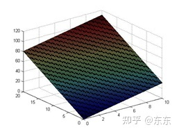
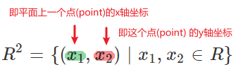
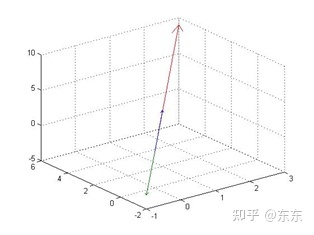
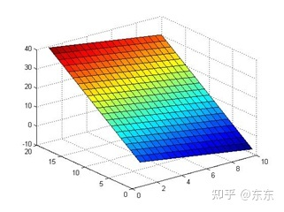
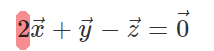
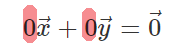
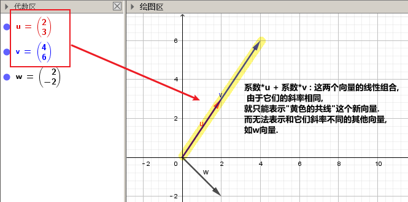
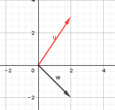
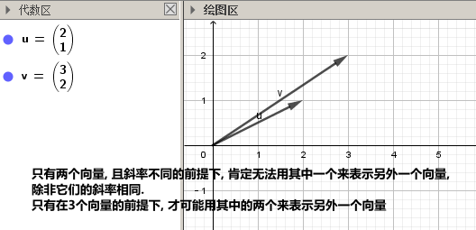
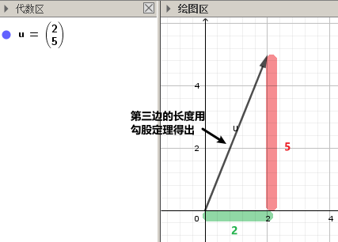

=  向量 vector (线性代数 - 可汗学院)
:toc:
:toclevels: 3
:sectnums:

---

== 向量的概念 & 向量的空间

[options="autowidth" cols="1a,1a"]
|===
|Header 1 |Header 2

|向量
|在向量的几何概念中，坐标轴其实已经不再重要。向量的几何概念中只包含起点，方向，长度三个要素，只要原点确定，这三个要素就可以完全确定，与坐标轴的方向无关。

|向量空间
|#"向量空间"就是去掉了坐标轴的向量集合。# 而"坐标轴"实际上是特殊的"向量基"。

首先，向量空间是一个集合，里面包含了若干向量，这些向量可以相加，也可以进行数乘。 +
即 : "向量空间"是带有"加法"和"数乘"的向量集合V.

|向量基
|在n维空间中，#以坐标轴为"向量基"#，可以将n维空间中所有向量都表示出来。比如 n=3 时，直观上就可以想象，使用3三个坐标就可以表示出所有3维空间中的向量。

|向量空间中的"子集" -- 子空间
|但是，很多时候, 问题中所涉及到的向量并不需要n维空间中所有向量。因此，可以定义一个向量空间的"子集"。

例如:下面是一个n=3 (三维)的向量空间中的子空间（一个 2维平面）示意图：

|===

---

stem:[R^2] ::
- 代表二维平面中,所有的"点"组成的集合.
- 这里R上的指数, 就是指"维度"的意思. 这里指数是2, 就是指是"二维"空间(是个平面).
- 二维平面上的点, 只有两个轴表示(x,y), 或也可以写成(stem:[x_1, x_2]),
- 所以, stem:[R^2 = \{ (x_1,x_2) | x_1,x_2 \in R \}] +
或也可表示为 : stem:[R^2 = \{ (x_1,x_2) | x_i \in R , \quad 1 <= i <= 2 \}]

---

stem:[R^3] ::
- 代表三维空间中的点.

stem:[R^1] ::
- 就代表一维, 即一条线段上的点.

stem:[R^n] ::
即: stem:[R^n = \{ (x_1,x_2, ... x_n) | x_i \in R , \quad 1 <= i <= n \}] +
stem:[R^n] 是所有这些"有序n元祖"的集合.

什么是向量?, stem:[R^n] 上的向量, 就是这些n元祖(tuple)中的一个特定值(一个特定的tuple).  +
比如, 一个二维的向量, 就可以用stem:[(x_1,x_2)] 来表示.

即:
\begin{align*}
向量 vector =\begin{bmatrix}  v_1 \\ v_2 \\ ... \\ v_n  \end{bmatrix}, \quad v_i \in R
\end{align*}
其中的每个stem:[v_i], 就称作"分量" (component)

---

== 1单位移动量的表示法

\begin{align}
\hat{i} = \begin{bmatrix} 1 \\ 0 \\ \end{bmatrix}, \quad <- x轴上正向移动一单位 \\
\hat{j} = \begin{bmatrix} 0 \\ 1 \\ \end{bmatrix}, \quad <- y轴上正向移动一单位 \\
\end{align}

---

== 向量的加法: n个向量的和, 就是先把每个向量, 从头到尾连起来; 然后从原点坐标, 与最后一个向量的终点坐标, 画一条直线. 这条直线就代表着n个向量的和.

如, stem:[\vec{v}  +  \vec{u}] , 它们的和, 就是: +
1.把 stem:[\vec{v} ] 作为第一步, 第一步的起点, 放在原点(0,0)处. +
2. 把stem:[\vec{u} ] 作为第二步, 把第二步的起点, 放在第一步的 stem:[\vec{v} ] 的终点处. **即"后面的头"连接"前面的尾", 头尾相连.** +
3. **把从原点(0,0), 和最后一步的"尾"处坐标, 画一条直线. 这条直线(本例中就是红色的直线sum), 就是这n个向量的"求和"的值.**

image:img_线性代数_可汗学院/002.png[]

又例: +
stem:[\vec{sum} = \vec{u}  + \vec{v}  + \vec{a}  + \vec{c} ]

可以看到, 这些向量的和, 就是按顺序"头尾相连"后, 从原点出发, 到最后一步的终点坐标, 直接画出的一条直线(图上的红色线条).

image:img_线性代数_可汗学院/003.png[]

---

== 向量的乘法: 向量前的乘数(系数n), 代表着将向量的长度, 延伸n倍

image:img_线性代数_可汗学院/001.png[]

如上图, 可以看出:
\begin{align}
\overrightarrow{v} =
\begin{bmatrix}
2 \\
1 \\
\end{bmatrix} ,  \quad
2*\overrightarrow{v} =
\begin{bmatrix}
4 \\
2 \\
\end{bmatrix}
\end{align}

- 2 * stem:[vec{v}], 这前面的系数2, 意思就是将向量stem:[vec{v}], 在原方向上, 延伸(拉长)2倍.

- 中括号里, #上面的数值2, 代表x轴上的移动量; 下面的数值1, 代表y轴上的移动量.# 即:
\begin{align}
\vec{vec} = \begin{bmatrix}
\Delta x \\
\Delta y \\
\end{bmatrix}
<- 正好跟"斜率"倒一倒.
\end{align}
+
所以整个中括号里的数值, 就确定了这条直线的"斜率". 本例为 : 斜率 slope (或用k表示斜率) = 1/2

stem:[ k = \frac{\Delta y}{\Delta x} ]

那么, 如果把系数2, 改成任意实数R, 我们就能得到一条两端能无限延伸的直线了. 即, 斜率k = 2 的直线, 可以用下面的式子来表示:

\begin{align}
\boxed{
 S = {C * \vec{v} \quad | C \in R}
}
\end{align}

即:

- C是属于实数R 中的任意值,
- stem:[ C * \vec{v}] ,   就代表一条长度为C倍的stem:[ \vec{v}]直线,
- 无数条任意倍数(属于实数集R)长度的 stem:[\vec{v}], 组成的集合 S, 就能用来代表这条直线的公式写法.

---

== 与 某向量 stem:[vec{x} ] 平行的另一条直线, 公式的写法

假设我们把这条向量的起始点, 定在原点(0,0)上, 那与它平行的另一条直线, 用什么公式, 能表达后者呢?

如下图: 经过stem:[vec{u} ]的终点, 与向量 stem:[vec{v} ] 平行的直线g, 它的公式怎么写?

image:img_线性代数_可汗学院/004.png[]

#事实上, 这条红线g 上的点的坐标, 其实就是由 "任意倍数的 stem:[vec{v} ]" , 在加上stem:[vec{u} ], 它们的和, 终点的处的坐标, 构成的.#

image:img_线性代数_可汗学院/005.png[]

image:img_线性代数_可汗学院/006.png[]

image:img_线性代数_可汗学院/007.png[]

所以, #红色的直线 g, 公式就可以写成#:

\begin{align}
\boxed{
红色的直线 g = \{ 黄色的向量\vec{u} + 系数c * 黑色的向量\vec{v} \quad | 系数c \in R \}
}
\end{align}

....
coefficient : /koʊɪˈfɪʃnt/  ( mathematics 数 ) a number which is placed before another quantity and which multiplies it, for example 3 in the quantity 3x 系数
....

#即, 黄色向量 stem:[vec{u}], 加上任意伸缩长度的黑色向量 stem:[vec{v}], 得到的"和"(即绿色向量)的终点处的坐标, 所有这些坐标的集合, 就构成了 红色的直线g.#

image:img_线性代数_可汗学院/008.png[]

这种用"向量"来表示的直线的公式, 比传统的直线公式 y=mx + b , 好处是什么呢?  +
-> 传统的直线公式, 只能用来表示二维平面坐标中的直线.  +
-> 而用"向量"来表示的直线的公式, 却能够用来表示任意维度空间(三维,4维, 100维度...)中的直线公式!

---

== 过两个向量的终点坐标处, 所组成的一条直线, 公式怎么写?

如下图, 已知有两个向量 stem:[vec{a}] 和 stem:[vec{b}], 过它们终点(A和D)处的红色直线g, 它的公式, 怎么写?

image:img_线性代数_可汗学院/009.png[]

#我们就来思考一下, 因为向量能够"平移",  向量间能够做"加减乘除", 任意缩放长度的向量, 其终点的集合, 就能构造出一条直线.  +
那么, 我们的思路就是: 如何利用现有已知的向量, 来做加减乘除, 并乘上系数, 就能写出这条红色直线的公式? +
**即: 我们要让n个向量的和的终点, 正好处在这条红色的直线上!**#

这个其实就是"尺规作图"的方式, 用现有的几何形, 来得到新的几何形路径.

image:img_线性代数_可汗学院/010.png[]

回到本题中. 经过几次尝试, 发现 :  +
1.把现有的两个向量 stem:[vec{a}] 和 stem:[vec{b}], 先 stem:[vec{b} - vec{a}], 得到绿色的向量.  +
2.然后, 把绿色向量 + stem:[vec{a}] 本身(即黄色向量), 得到的"和"的终点坐标处, 就指向了红色直线. 注意此时还只是一个D点. +
3. 接着, 我们只要用系数(倍数)来伸缩绿色向量, 就能将D点延伸, 得到完整的红色直线!

image:img_线性代数_可汗学院/011.png[]

所以, 完整的红色直线公式, 就是:
\begin{align}
\boxed{
红色的直线 g = \{ 黄色的向量\vec{a} + 系数c * 绿色的向量(\vec{b}-\vec{a}) \quad | 系数c \in R \}
}
\end{align}

---

此外, 你还发现, 红色直线还可以这样得到:

image:img_线性代数_可汗学院/012.png[]

即: 完整的红色直线公式, 还能是:
\begin{align}
\boxed{
红色的直线 g = \{ 黄色的向量\vec{b} + 系数c * 绿色的向量(\vec{b}-\vec{a}) \quad | 系数c \in R \}
}
\end{align}

现在, 我们就能把 stem:[vec{a}] 和 stem:[vec{b}] 的具体值, 代入进红色直线的公式中, 来得到红色直线的具体解析式.

\begin{align}
& \vec{a} = \begin{bmatrix} 2 \\ 1 \\  \end{bmatrix}, \quad
\vec{b} = \begin{bmatrix} 0 \\ 3 \\  \end{bmatrix} \\
\\
& 红色的直线 g = \{ 黄色的向量\vec{b} + 系数c * 绿色的向量(\vec{b}-\vec{a}) \quad | 系数c \in R \} \\
& = \{ \begin{bmatrix}  0 \\ 3 \\  \end{bmatrix}
+ c *
\begin{bmatrix} -2 \\ 2 \\ \end{bmatrix}
\quad | c \in R
\}
\end{align}

中括号里, 上面的为x值, 下面的为y值, 所以, 就能分解成:

image:img_线性代数_可汗学院/013.png[]

x = 0 -2c +
y = 3 + 2c

即, 这条红色直线上的点的x,y坐标, 能用下面公式的来表示: +
x = -2c +
y = 2c + 3

---

== 在n维空间中, 每个维度上有一个点, 那么过这n个点的直线方程, 公式怎么写?

同样, 利用通用直线公式:

\begin{align}
\boxed{
直线 L = \{\vec{a} + 系数c * (\vec{a}-\vec{b}) \quad | 系数c \in R \}
}
\end{align}

例如, 当我们知道具体的:
\begin{align}
\vec{a} = \begin{bmatrix} -1\\ 2\\ 7\\  \end{bmatrix} , \quad
\vec{b} = \begin{bmatrix} 0\\ 3\\ 4\\  \end{bmatrix}
\end{align}

则, 代入进"通用直线公式":
\begin{align}
& 直线 L = \{ \vec{a} + 系数c * (\vec{a}-\vec{b}) \quad | 系数c \in R \} \\
& = \begin{bmatrix} -1\\ 2\\ 7\\  \end{bmatrix}
+ c *  \begin{bmatrix} -1\\ -1\\ 3\\  \end{bmatrix}
\end{align}

image:img_线性代数_可汗学院/014.png[]

再分解出来, 所以: +
x = -1 - c +
y = 2 - c +
z =7 + 3c

---

== 线性组合 linear combination, 就是 n个的"系数倍的向量", 它们的和.

如: 我们有n个向量, 分别是:
stem:[ v_1, v_2, ..., v_n], 这n个向量, 可以在同一个二维空间中, 也可以处在n维空间中.

那么, 它们的"线性组合 linear combination", 就是:
\begin{align}
 = c_1*v_1 + c_2*v_2 + ... + c_n*v_n, 其中, c_1到c_n这些系数, 都 \in R
\end{align}

所有可能的"线性组合"的集合, 也就是 span (张成). 即:

stem:[ span(v_1, v_2, ... v_n) =\{ c_1*v_1 + c_2*v_2 + ... + c_n*v_n | \quad c_i \in R \}]

事实上, 一个二维平面(stem:[R^2]) 中的任何向量, 都可以由 stem:[\vec{a}] 和 stem:[vec{b}] 的"线性组合 linear combination"表示. 即:
\begin{align}
span(\vec{a}, \vec{b}) = R^2
\end{align}

我们来举个例子:

我们只要知道具体的两个向量a和b 的值, 就能用他们得到二维平面上的任何一个点. 假设该点 用向量 point
\begin{align}
\vec{point} = \begin{bmatrix} x_1 \\ x_2 \\ \end{bmatrix}
\end{align}
来表示. 因为向量中,中括号里的两个值, 就是代表终点处的 x和y轴坐标值. 可以表示一个点的坐标.

现在, 已知 :
\begin{align}
\vec{a} = \begin{bmatrix} 1 \\ 2 \\ \end{bmatrix}, \quad
\vec{b} = \begin{bmatrix} 0 \\ 3 \\ \end{bmatrix}
\end{align}

则, 就一定有:
\begin{align}
c_1 * \vec{a} + c_2 * \vec{b} = \vec{point}
\end{align}

即, 一定有系数c1 和 c2 存在, 能让向量a,和b, 自由伸缩, 并进行加减运算, 其最终的和(或差), 就是向量point. 向量point的终点, 能覆盖到二维平面上的任何一个点.

下面, 把向量a和b的具体值, 代入上式, 来得到系数c1 和 c2:

\begin{align}
& c_1 * \begin{bmatrix} 1 \\ 2 \\ \end{bmatrix}
+ c_2 * \begin{bmatrix} 0 \\ 3 \\ \end{bmatrix}
= \begin{bmatrix} x_1 \\ x_2 \\ \end{bmatrix}
\\ \\
& \begin{cases}   c_1 = x_1   \\  2 *c_1 + 3 *c_2 = x_2 \end{cases} \\
& 经过运算... \\
& 系数值的获取公式 = \begin{cases}   c_1 = x_1   \\  c_2 = 1/3 * (x_2 - 2 *x_1) \end{cases}
\end{align}

现在, 我们就得到了这两个系数(c1和c2)的公式.

这样, 在二维平面上随便给你一个点的坐标 (即 向量point的终点坐标), 你就能反推出 c1 和 c2 的具体值了. 即把 point终点坐标的具体指, 代入上面的"系数获取公式"即可.

比如, 若给出 stem:[\vec{p}] 的终点坐标, 在 (2,2) 处, 即 x1=2, x2=2. 那么
\begin{align}
c_1 * \vec{a} + c_2 * \vec{b} = \vec{point}
\end{align}
中, 系数 c1 和 c2 的具体值是多少呢? +
代入"系数获取公式"中即可算出:

\begin{align}
& \begin{cases}   c_1 = x_1   \\  c_2 = 1/3 * (x_2 - 2 *x_1) \end{cases}  \\
& \begin{cases}   c_1 = 2  \\  c_2 = 1/3 * (2 - 2 *2) \end{cases}  \\
& \begin{cases}   c_1 = 2  \\  c_2 = -2/3  \end{cases}  \\
\end{align}

---

https://www.bilibili.com/video/BV1Wt411z7Gi?p=8

== 张成 span

子空间的定义, 是包含了若干向量的集合。#由几个初始的向量生成它们对应的子空间，对于这个子空间，有个学术性的名称，叫做这几个向量的"张成 (Span)"。#

例如, 在三维(stem:[R^3])的向量空间中, 有一个向量:
\begin{align*}
V_1 = \begin{bmatrix}  1 \\  2 \\ 3 \\  \end{bmatrix}
\end{align*}

那么，对这一个向量进行"加法"和"数乘"运算, 得到其余两个向量

\begin{align*}
& V_2 = 3*V_1 \\
& V_3 = V_1 - (2*V_1)
\end{align*}

将这3个向量画出来： +

可以看出, 这三个向量在一条直线上。因此这条直线就叫做向量 stem:[v_1]的"张成" span。即, 这条直线是通过对向量做各种"数乘"和"加法"得到的。

同样, 斜率不同的两条直线(两个向量v1,v2),可以"线性组合"出二维平面上的所有的点, 就可以记为:
\begin{align*}
span(v_1,v_2) = R^2
\end{align*}

即: v1, v2的 张成空间, 是 stem:[ R^2].

---

== 线性相关 & 线性无关

比如: 有三个向量:
\begin{align*}
x = \begin{bmatrix}  1 \\ 0 \\ 0  \end{bmatrix},  \quad
y = \begin{bmatrix}  0 \\ 1 \\ 0  \end{bmatrix},  \quad
z = \begin{bmatrix}  0 \\ 0 \\ 1  \end{bmatrix}
\end{align*}

张成的空间是整个stem:[R^3] 。那么，是不是其他所有任意的3个向量, 都能够张成stem:[R^3] 呢？

比如这三个向量:

\begin{align*}
x = \begin{bmatrix}  1 \\ 2 \\ 3  \end{bmatrix},  \quad
y = \begin{bmatrix}  1 \\ 1 \\ 1  \end{bmatrix},  \quad
z = \begin{bmatrix}  3 \\ 5 \\ 7  \end{bmatrix}
\end{align*}

无论采用怎样的组合（向量相加，数乘），这三个向量的张成, 始终是一个平面:

为什么呢？因为

\begin{align*}
& \vec{z} = 2\vec{x} + \vec{y} \\
& 即: \begin{bmatrix}  3 \\ 5 \\ 7  \end{bmatrix} =
2 * \begin{bmatrix}  1 \\ 2 \\ 3  \end{bmatrix}
+ \begin{bmatrix}  1 \\ 1 \\ 2  \end{bmatrix}
\end{align*}

#即, stem:[\vec{z}] 可以用 stem:[\vec{x}] 和 stem:[\vec{y}] 通过"加法"和"数乘"（使用这两种运算的式子称为"线性组合"）得到#, 即, stem:[\vec{z}] 是 stem:[\vec{x}] 和 stem:[\vec{y}]  的线性组合。#因此, 在这三个向量中,  stem:[\vec{z}]  是多余的，因为对于张成这个平面而言，使用两个向量和使用三个向量的效果完全一样。我们称这样的三个向量是"**线性相关**"的.#

#反之，如果只剩下stem:[\vec{x}] 和 stem:[\vec{y}] 两个向量，它们之间互相不能用对方的"线性组合"表示，则我们就称这两个向量是"**线性无关**"的。#

再回顾一下上面的式子,

[options="autowidth" cols="1a,1a"]
|===
|Header 1 |对比它们两者的相应的系数，可以发现:

|\begin{align*}
\vec{z} = 2\vec{x} + \vec{y}
\end{align*}

重新整理一下可以得到：

\begin{align*}
 2\vec{x} + \vec{y} - \vec{z}  = \vec{0}
\end{align*}
|<- #"线性相关"的两个向量, 要想组合起来为 stem:[\vec{0}] (即0 向量)，可以有不为0的系数。#

|而线性无关的两个向量:

\begin{align*}
 0\vec{x} + 0\vec{y}   = \vec{0}
\end{align*}
|<- #而"线性无关"的两个向量, 要想组合起来为 stem:[\vec{0}]，只有所有的系数都为 0 才行.#

|===

这就可以引出"线性相关"概念的数学定义了：

线性无关::
#对于向量空间 V 中的一组向量 (stem:[v_1, v_2 ,..., v_m]) ，如果 stem:[c_1 v_1 + c_2 v_2 + ... + c_m v_m = \vec{0}] 这个等式能成立的前提是: 它们的"系数"必须满足 stem:[c_1 = c_2 = ... = c_m = 0]时才行 ， 那么我们就称 (stem:[v_1, v_2 ,..., v_m]) 这些向量是"线性无关"的。#  +
+
#"线性无关"也就意味着: 这些向量里面, 没有"多余"的向量.#

线性相关::
#反过来, 如果 stem:[c_1 v_1 + c_2 v_2  + ... + c_m v_m = \vec{0}] 这个等式能成立的前提, 不需要满足所有的系数stem:[c_i]都等于0, 即可以有系数不为零, 该等式也成立. 则这些向量(stem:[v_1, v_2 ,..., v_m]) 就是"线性相关"的。# +
+
#"线性相关"也就意味着: 这些向量里面, 有"多余"的向量存在.  因为这个"多余的向量", 可以用其他的向量来"线性组合"出来.#

可以简单直白地理解为: 如果一个向量组 (stem:[v_1, v_2 ,..., v_m]) 线性相关，则其中必有"多余的向量".  +
所谓"多余的向量"，就是能表示为向量组中其他向量的"线性组合"的那个向量. +
如果将这些"多余的向量"都从向量组中去掉，那么剩下的向量, 就"线性无关"了。

[options="autowidth" cols="1a,1a"]
|===
|Header 1 |Header 2

|stem:[0*v_1 + 0*v_2  + ... + 0* v_m = \vec{0}]
|<- 系数全为0, 则这些向量 (stem:[v_1, v_2 ,..., v_m]) "线性无关" +
无线性关系, 就是没浪费(没有"多余向量"存在).

|stem:[c_1 v_1 + c_2 v_2  + ... + c_m v_m = \vec{0}]
|<- 系数stem:[c_i]只要有一个不是0的, 则这些向量 (stem:[v_1, v_2 ,..., v_m]) "线性相关" +
有线性关系, 就是有浪费(有"多余向量"存在).
|===

---

又如: 现在, 我们有两个向量
\begin{align*}
\begin{bmatrix}  2 \\ 3 \\  \end{bmatrix} ,
\begin{bmatrix}  4 \\ 6 \\  \end{bmatrix} \\
\end{align*}

问, 这两个向量"张成 (span)"的空间是什么? #它们的 span, 就是能用这两者的"线性组合(linear combinations)"表示的所有向量的"集合".#

linear combination, 就是让这些向量互相做"加","减","倍数化"的操作. 本例即:

\begin{align*}
c_1 \begin{bmatrix}  2 \\ 3 \\  \end{bmatrix}  + c_2  \begin{bmatrix}  4 \\ 6 \\  \end{bmatrix}
\end{align*}

它可以进一步简化为:

\begin{align*}
& c_1 \begin{bmatrix}  2 \\ 3 \\  \end{bmatrix}  + 2c_2 \begin{bmatrix}  2 \\ 3 \\  \end{bmatrix} \\
& = (c_1 + 2c_2)  \begin{bmatrix}  2 \\ 3 \\  \end{bmatrix}
\end{align*}

stem:[c_1 + 2c_2] 就等于某个系数, 所以本例中的两个向量的 linear combination, 就是 列向量 stem:[\[2,3\]] 的任意倍数. 即一条两段无限延伸的直线.

换言之, #由于这两个向量(直线段)的斜率相同, 所以它们要么重叠在一起, 要么平行, 它们的linear combination, 是无法表示其他方向(其他斜率)上的向量的.# 所以, 它们无法表示出stem:[R^2](即二维平面)中的所有向量. 所以说,它们张成 (span) 的空间, 就只是这条直线.

#线性相关 linearly dependent : 就是意味着, 集合中的一个向量, 可以由集合中的其他向量的组合, 表示而成.#

比如, 二维平面 stem:[R^2]中的所有向量, 都可以由斜率不相等的两个向量, 组合而成. 如下图.

同样, 在三维空间stem:[R^3]中, 只要第3个向量不与其他两个向量"共面", 它们就能组合成 stem:[R^3]中 的任何向量. 即, 这三个向量(线性组合)构成的集合, 就是"线性相关 linear combination"的.

---

==== 来判断, 一个向量集合, 里面的元素, 是线性相关, 还是线性无关的?

例如: 问, 下面的向量集, 是线性相关, 还是线性无关的?
\begin{align*}
\{
\begin{bmatrix}  2 \\  1 \\  \end{bmatrix}, \quad
\begin{bmatrix}  3 \\  2 \\  \end{bmatrix}
\}
\end{align*}

它可以写成:
\begin{align*}
c_1 \begin{bmatrix}  2 \\  1 \\  \end{bmatrix}
+ c_2 \begin{bmatrix}  3 \\  2 \\  \end{bmatrix}
= 0 \begin{bmatrix}  0 \\  0\\  \end{bmatrix}
\end{align*}

根据定义, 如果系数stem:[c_i]都为0, 则这些stem:[v_i] 向量是"线性无关"的. +
只要其中有一个系数不为0, 这些向量就是"线性相关"的.

那么,我们就来具体算一算, 系数stem:[c_1 和 c_2]的值:

\begin{align*}
& \begin{cases}   2 c_1 + 3 c_2 = 0  \\  c_1 + 2 c_2 = 0 \end{cases} \\
& \begin{cases}   c_1 = 0  \\  c_2 = 0 \end{cases} \\
\end{align*}

既然所有的系数都是0, 那么这些向量就是"线性无关"的.

---

---

== 两个向量相乘 -> 向量的点积 (dot product) stem:[a \cdot  b] (即用"点号"来表示"乘法符号×")

两个向量相乘, 运算法则是什么?

\begin{align*}
& \vec{a} \cdot \vec{b} \\
& =  \begin{bmatrix}  a_1 \\  a_2 \\ ... \\ a_n  \end{bmatrix}
\cdot
 \begin{bmatrix}  b_1 \\  b_2 \\ ... \\ b_n  \end{bmatrix} \\
& \boxed{
= a_1 b_1 + a_2 b_2 +  ... + a_n b_n
}
\end{align*}

即, #先横向把对应的每个"分量"相乘, 再全部加起来, 所得到的一个"标量".#

例如:
\begin{align*}
& \begin{bmatrix}  1 \\  2 \\ 3  \end{bmatrix}
\cdot
\begin{bmatrix}  -2 \\  0 \\ 5  \end{bmatrix} \\
& = (1 \cdot -2)  + (2 \cdot 0) + (3 \cdot 5) = 13
\end{align*}

---

== 一个向量的长度,计算公式

一个向量的长度,  用双竖线表示, 即 stem:[||\vec{x} ||]

\begin{align*}
\boxed{
\Vert \vec{a} \Vert = \sqrt{a_1^2 + a_2^2 + ... + a_n^2}
}
\end{align*}

即: #一个向量的长度, 等于它"每个分量的平方和"的开方.#

例如:

\begin{align*}
& \vec{b} = \begin{bmatrix}  2 \\ 5  \end{bmatrix}, \\
& 则 : \Vert \vec{b} \Vert = \sqrt{2^2 + 5^2}
\end{align*}

其实, 这就是从"勾股定理"得到的:

现在, 我们把向量的"点积", 与"长度"联系起来:

如果把一个向量, 乘以它自己呢?

\begin{align*}
& \vec{a} \cdot \vec{a}
= \begin{bmatrix}  a_1 \\ a_2 \\ ... \\ a_n  \end{bmatrix}
\cdot
\begin{bmatrix}  a_1 \\ a_2 \\ ... \\ a_n  \end{bmatrix}
 =  a_1^2 + a_2^2 + ... + a_n^2 \\
& 所以, \vec{a}  = \sqrt{a_1^2 + a_2^2 + ... + a_n^2}
\end{align*}

所以, 我们就证明了:

\begin{align*}
\Vert \vec{a} \Vert = \sqrt{\vec{a} \cdot \vec{a}}
\end{align*}

一个向量的长度, 就是它自身点积("平方"概念)后的开方.

---

== 向量点积的性质

=== stem:[\vec{a} \cdot \vec{b} =\vec{b} \cdot \vec{a} ]

=== stem:[(\vec{a} + \vec{b}) \cdot \vec{x} =\vec{a} \cdot \vec{x}  + \vec{b} \cdot \vec{x}]

===  stem:[(c \vec{a}) \cdot \vec{b} =\vec{c} \cdot (\vec{a}  \cdot \vec{b}) ]

=== Cauchy-Schwarz 不等式

该不等式定理是:

如果有 stem:[\vec{x}, \vec{y} \in R^n] +
则有: +
\begin{align*}
|\vec{x} \cdot \vec{y}| \le \Vert \vec{x} \Vert \cdot  \Vert \vec{y} \Vert
\end{align*}

即: "这两个向量的点积"的绝对值, 它"小于等于"二者长度的乘积.

那么什么时候仅仅是"等号"成立(而"小于号"不成立)呢? #当且仅当 一个向量是另一个向量的倍数时 (即它们的斜率相同, 是"共线"的), 则仅该等号成立, 而没有小于号.#

即:
\begin{align*}
|\vec{x} \cdot \vec{y}| = \Vert \vec{x} \Vert \cdot  \Vert \vec{y} \Vert
\quad \Leftrightarrow \vec{x} = c \vec{y}
\end{align*}

---

---

https://www.bilibili.com/video/BV1Mx411Q74T?p=24

https://www.bilibili.com/video/BV1Wt411z7Gi?p=8
