= 线性代数 - 可汗学院
:toc:
:toclevels: 3
:sectnums:

---

== 1单位移动量的表示法

\begin{align}
\hat{i} = \begin{bmatrix} 1 \\ 0 \\ \end{bmatrix}, \quad <- x轴上正向移动一单位 \\
\hat{j} = \begin{bmatrix} 0 \\ 1 \\ \end{bmatrix}, \quad <- y轴上正向移动一单位 \\
\end{align}

---

== n个向量的和, 就是先把每个向量, 从头到尾连起来; 然后从原点坐标, 与最后一个向量的终点坐标, 画一条直线. 这条直线就代表着n个向量的和.

如, stem:[\vec{v}  +  \vec{u}] , 它们的和, 就是: +
1.把 stem:[\vec{v} ] 作为第一步, 第一步的起点, 放在原点(0,0)处. +
2. 把stem:[\vec{u} ] 作为第二步, 把第二步的起点, 放在第一步的 stem:[\vec{v} ] 的终点处. **即"后面的头"连接"前面的尾", 头尾相连.** +
3. **把从原点(0,0), 和最后一步的"尾"处坐标, 画一条直线. 这条直线(本例中就是红色的直线sum), 就是这n个向量的"求和"的值.**

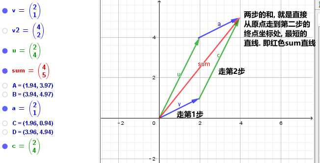

又例: +
stem:[\vec{sum} = \vec{u}  + \vec{v}  + \vec{a}  + \vec{c} ]

可以看到, 这些向量的和, 就是按顺序"头尾相连"后, 从原点出发, 到最后一步的终点坐标, 直接画出的一条直线(图上的红色线条).

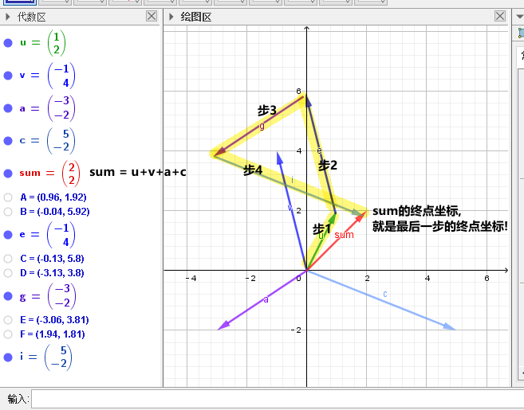

---

== 向量前的乘数(系数n), 代表着将向量的长度, 延伸n倍

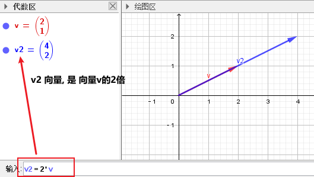

如上图, 可以看出:
\begin{align}
\overrightarrow{v} =
\begin{bmatrix}
2 \\
1 \\
\end{bmatrix} ,  \quad
2*\overrightarrow{v} =
\begin{bmatrix}
4 \\
2 \\
\end{bmatrix}
\end{align}

- 2 * stem:[vec{v}], 这前面的系数2, 意思就是将向量stem:[vec{v}], 在原方向上, 延伸(拉长)2倍.

- 中括号里, #上面的数值2, 代表x轴上的移动量; 下面的数值1, 代表y轴上的移动量.# 即:
\begin{align}
\vec{vec} = \begin{bmatrix}
\Delta x \\
\Delta y \\
\end{bmatrix}
<- 正好跟"斜率"倒一倒.
\end{align}
+
所以整个中括号里的数值, 就确定了这条直线的"斜率". 本例为 : 斜率 slope (或用k表示斜率) = 1/2

stem:[ k = \frac{\Delta y}{\Delta x} ]

那么, 如果把系数2, 改成任意实数R, 我们就能得到一条两端能无限延伸的直线了. 即, 斜率k = 2 的直线, 可以用下面的式子来表示:

\begin{align}
\boxed{
 S = {C * \vec{v} \quad | C \in R}
}
\end{align}

即:

- C是属于实数R 中的任意值,
- stem:[ C * \vec{v}] ,   就代表一条长度为C倍的stem:[ \vec{v}]直线,
- 无数条任意倍数(属于实数集R)长度的 stem:[\vec{v}], 组成的集合 S, 就能用来代表这条直线的公式写法.

---

== 与 某向量 stem:[vec{x} ] 平行的另一条直线, 公式的写法

假设我们把这条向量的起始点, 定在原点(0,0)上, 那与它平行的另一条直线, 用什么公式, 能表达后者呢?

如下图: 经过stem:[vec{u} ]的终点, 与向量 stem:[vec{v} ] 平行的直线g, 它的公式怎么写?

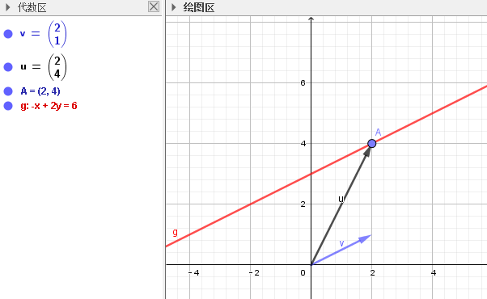

#事实上, 这条红线g 上的点的坐标, 其实就是由 "任意倍数的 stem:[vec{v} ]" , 在加上stem:[vec{u} ], 它们的和, 终点的处的坐标, 构成的.#

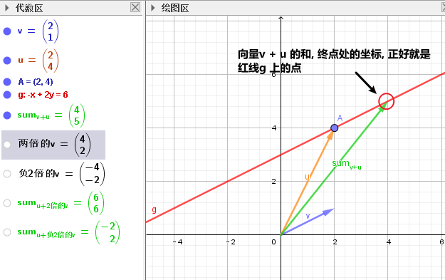

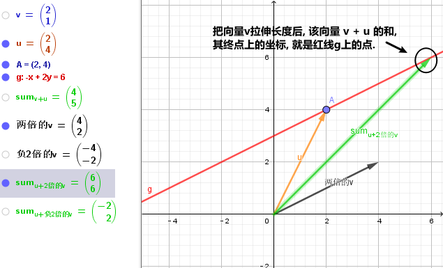

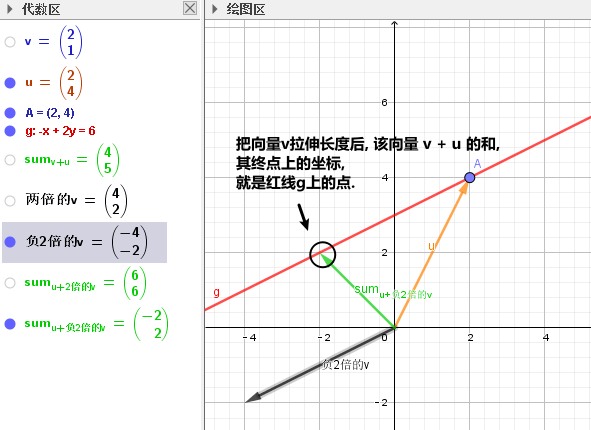

所以, #红色的直线 g, 公式就可以写成#:

\begin{align}
\boxed{
红色的直线 g = \{ 黄色的向量\vec{u} + 系数c * 黑色的向量\vec{v} \quad | 系数c \in R \}
}
\end{align}

....
coefficient : /koʊɪˈfɪʃnt/  ( mathematics 数 ) a number which is placed before another quantity and which multiplies it, for example 3 in the quantity 3x 系数
....

#即, 黄色向量 stem:[vec{u}], 加上任意伸缩长度的黑色向量 stem:[vec{v}], 得到的"和"(即绿色向量)的终点处的坐标, 所有这些坐标的集合, 就构成了 红色的直线g.#

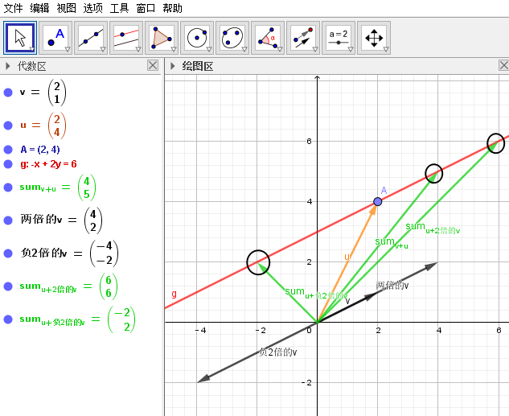

这种用"向量"来表示的直线的公式, 比传统的直线公式 y=mx + b , 好处是什么呢?  +
-> 传统的直线公式, 只能用来表示二维平面坐标中的直线.  +
-> 而用"向量"来表示的直线的公式, 却能够用来表示任意维度空间(三维,4维, 100维度...)中的直线公式!

---

== 过两个向量的终点坐标处, 所组成的一条直线, 公式怎么写?

如下图, 已知有两个向量 stem:[vec{a}] 和 stem:[vec{b}], 过它们终点(A和D)处的红色直线g, 它的公式, 怎么写?

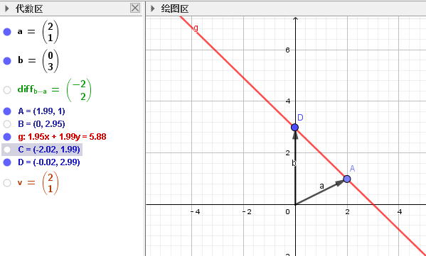

#我们就来思考一下, 因为向量能够"平移",  向量间能够做"加减乘除", 任意缩放长度的向量, 其终点的集合, 就能构造出一条直线.  +
那么, 我们的思路就是: 如何利用现有已知的向量, 来做加减乘除, 并乘上系数, 就能写出这条红色直线的公式? +
**即: 我们要让n个向量的和的终点, 正好处在这条红色的直线上!**#

这个其实就是"尺规作图"的方式, 用现有的几何形, 来得到新的几何形路径.

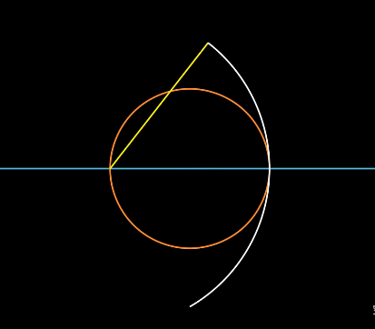

回到本题中. 经过几次尝试, 发现 :  +
1.把现有的两个向量 stem:[vec{a}] 和 stem:[vec{b}], 先 stem:[vec{b} - vec{a}], 得到绿色的向量.  +
2.然后, 把绿色向量 + stem:[vec{a}] 本身(即黄色向量), 得到的"和"的终点坐标处, 就指向了红色直线. 注意此时还只是一个D点. +
3. 接着, 我们只要用系数(倍数)来伸缩绿色向量, 就能将D点延伸, 得到完整的红色直线!

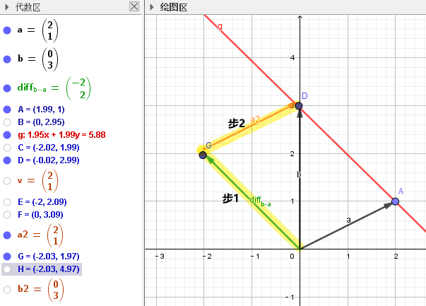

所以, 完整的红色直线公式, 就是:
\begin{align}
\boxed{
红色的直线 g = \{ 黄色的向量\vec{a} + 系数c * 绿色的向量(\vec{b}-\vec{a}) \quad | 系数c \in R \}
}
\end{align}

---

此外, 你还发现, 红色直线还可以这样得到:

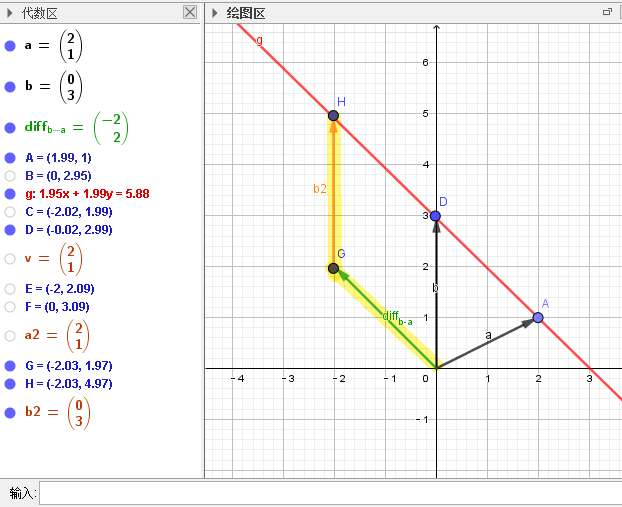

即: 完整的红色直线公式, 还能是:
\begin{align}
\boxed{
红色的直线 g = \{ 黄色的向量\vec{b} + 系数c * 绿色的向量(\vec{b}-\vec{a}) \quad | 系数c \in R \}
}
\end{align}

现在, 我们就能把 stem:[vec{a}] 和 stem:[vec{b}] 的具体值, 代入进红色直线的公式中, 来得到红色直线的具体解析式.

\begin{align}
& \vec{a} = \begin{bmatrix} 2 \\ 1 \\  \end{bmatrix}, \quad
\vec{b} = \begin{bmatrix} 0 \\ 3 \\  \end{bmatrix} \\
\\
& 红色的直线 g = \{ 黄色的向量\vec{b} + 系数c * 绿色的向量(\vec{b}-\vec{a}) \quad | 系数c \in R \} \\
& = \{ \begin{bmatrix}  0 \\ 3 \\  \end{bmatrix}
+ c *
\begin{bmatrix} -2 \\ 2 \\ \end{bmatrix}
\quad | c \in R
\}
\end{align}

中括号里, 上面的为x值, 下面的为y值, 所以, 就能分解成:

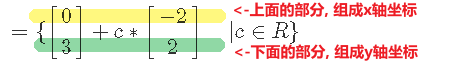

x = 0 -2c +
y = 3 + 2c

即, 这条红色直线上的点的x,y坐标, 能用下面公式的来表示: +
x = -2c +
y = 2c + 3

---

== 在n维空间中, 每个维度上有一个点, 那么过这n个点的直线方程, 公式怎么写?

同样, 利用通用直线公式:

\begin{align}
\boxed{
直线 L = \{\vec{a} + 系数c * (\vec{a}-\vec{b}) \quad | 系数c \in R \}
}
\end{align}

例如, 当我们知道具体的:
\begin{align}
\vec{a} = \begin{bmatrix} -1\\ 2\\ 7\\  \end{bmatrix} , \quad
\vec{b} = \begin{bmatrix} 0\\ 3\\ 4\\  \end{bmatrix}
\end{align}

则, 代入进"通用直线公式":
\begin{align}
& 直线 L = \{ \vec{a} + 系数c * (\vec{a}-\vec{b}) \quad | 系数c \in R \} \\
& = \begin{bmatrix} -1\\ 2\\ 7\\  \end{bmatrix}
+ c *  \begin{bmatrix} -1\\ -1\\ 3\\  \end{bmatrix}
\end{align}

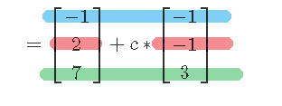

再分解出来, 所以: +
x = -1 - c +
y = 2 - c +
z =7 + 3c

---

== 线性组合 linear combination, 就是 n个的"系数倍的向量", 它们的和.

如: 我们有n个向量, 分别是:
stem:[ v_1, v_2, ..., v_n], 这n个向量, 可以在同一个二维空间中, 也可以处在n维空间中.

那么, 它们的"线性组合 linear combination", 就是:
\begin{align}
 = c_1*v_1 + c_2*v_2 + ... + c_n*v_n, 其中, c_1到c_n这些系数, 都 \in R
\end{align}

线性组合, 也就是 span (张成). 即:

stem:[ span(v_1, v_2, ... v_n) =\{ c_1*v_1 + c_2*v_2 + ... + c_n*v_n | \quad c_i \in R \}]

事实上, 一个二维平面(stem:[R^2]) 中的任何向量, 都可以由 stem:[\vec{a}] 和 stem:[vec{b}] 的"线性组合 linear combination"表示. 即:
\begin{align}
span(\vec{a}, \vec{b}) = R^2
\end{align}

我们来举个例子:

我们只要知道具体的两个向量a和b 的值, 就能用他们得到二维平面上的任何一个点. 假设该点 用向量 point
\begin{align}
\vec{point} = \begin{bmatrix} x_1 \\ x_2 \\ \end{bmatrix}
\end{align}
来表示. 因为向量中,中括号里的两个值, 就是代表终点处的 x和y轴坐标值. 可以表示一个点的坐标.

现在, 已知 :
\begin{align}
\vec{a} = \begin{bmatrix} 1 \\ 2 \\ \end{bmatrix}, \quad
\vec{b} = \begin{bmatrix} 0 \\ 3 \\ \end{bmatrix}
\end{align}

则, 就一定有:
\begin{align}
c_1 * \vec{a} + c_2 * \vec{b} = \vec{point}
\end{align}

即, 一定有系数c1 和 c2 存在, 能让向量a,和b, 自由伸缩, 并进行加减运算, 其最终的和(或差), 就是向量point. 向量point的终点, 能覆盖到二维平面上的任何一个点.

下面, 把向量a和b的具体值, 代入上式, 来得到系数c1 和 c2:

\begin{align}
& c_1 * \begin{bmatrix} 1 \\ 2 \\ \end{bmatrix}
+ c_2 * \begin{bmatrix} 0 \\ 3 \\ \end{bmatrix}
= \begin{bmatrix} x_1 \\ x_2 \\ \end{bmatrix}
\\ \\
& \begin{cases}   c_1 = x_1   \\  2 *c_1 + 3 *c_2 = x_2 \end{cases} \\
& 经过运算... \\
& 系数值的获取公式 = \begin{cases}   c_1 = x_1   \\  c_2 = 1/3 * (x_2 - 2 *x_1) \end{cases}
\end{align}

现在, 我们就得到了这两个系数(c1和c2)的公式.

这样, 在二维平面上随便给你一个点的坐标 (即 向量point的终点坐标), 你就能反推出 c1 和 c2 的具体值了. 即把 point终点坐标的具体指, 代入上面的"系数获取公式"即可.

比如, 若给出 stem:[\vec{p}] 的终点坐标, 在 (2,2) 处, 即 x1=2, x2=2. 那么
\begin{align}
c_1 * \vec{a} + c_2 * \vec{b} = \vec{point}
\end{align}
中, 系数 c1 和 c2 的具体值是多少呢? +
代入"系数获取公式"中即可算出:

\begin{align}
& \begin{cases}   c_1 = x_1   \\  c_2 = 1/3 * (x_2 - 2 *x_1) \end{cases}  \\
& \begin{cases}   c_1 = 2  \\  c_2 = 1/3 * (2 - 2 *2) \end{cases}  \\
& \begin{cases}   c_1 = 2  \\  c_2 = -2/3  \end{cases}  \\
\end{align}

---

常用latex公式:
....
向量(xl) \vec{x}
向量正方向(xlz) \overrightarrow{AB}
向量反方向(xlf) \overleftarrow{AB}
中括号(zkh) \begin{bmatrix}  a & b \\  c & d \\  \end{bmatrix}
方程大括号(fc) \begin{cases}   x+y  \\  a+b \end{cases}
空格 \quad
....

在GeoGebra中输入数学元素:
....
向量方向线条 : x = Vector((0,0),(2,4))

....

---

https://www.bilibili.com/video/BV1Wt411z7Gi?p=8

15.36

