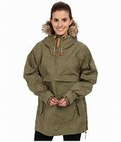
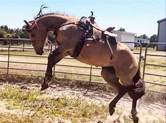
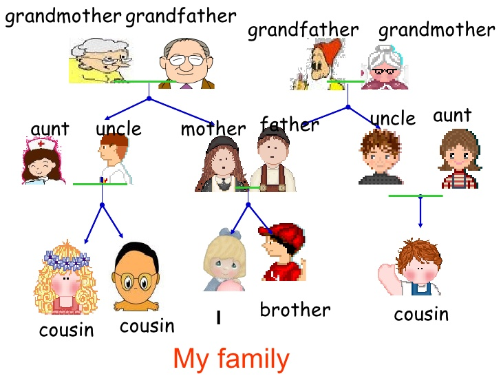

= Lesson 19
:toc:

---

== Section 1

Dialogue 1:  +

—Good morning. Can I see Mr. Johnson, please?  +
—Have you an appointment?  +
—Yes, at half past ten.  +
—What's your name, please?  +
—McDonald, Jane McDonald.  +
—Ah, yes. Mr. Johnson's expecting you. This way, please. Mr. Johnson's room is on the
next floor.

---

Dialogue 2:  +

—What does your friend do for a living?  +
—He's one of those people who give legal advice.  +
—Oh, I see. He is a solicitor, you mean.  +
—Yes. That's the word I was looking for. My vocabulary is still very small, I'm afraid.  +
—Never mind. You explained what you meant.

- solicitor :( BrE ) a lawyer who prepares legal documents, for example for the sale of land or buildings, advises people on legal matters, and can speak for them in some courts of law 事务律师，诉状律师（代拟法律文书、提供法律咨询等的一般辩护律师） +
/ ( NAmE ) the most senior legal officer of a city, town or government department （城镇或政府部门负责法律事务的）法务官 +
/( NAmE ) a person whose job is to visit or telephone people and try to sell them sth 推销员

---

Dialogue 3:  +

—What shall we do this weekend?  +
—Let's go for a walk.  +
—Where shall we go, then?  +
—Let's go to the new forest. We haven't been there for a long time.  +
—That's a good idea. I'll call for you in a car at about half past ten. Is that alright?  +
—That'll be splendid. See you tomorrow, then. Goodbye.

-  go for a walk 去随便走走, 漫步遛弯
- splendid :( old-fashioned ) excellent; very good 极佳的；非常好的 +
-> What a splendid idea! 这主意妙极了！

---

Dialogue 4:  +

—You have some brown, suede shoes in the window at four pounds. Would you show me
a pair in size six, please?  +
—Oh, what a pity. We have no size six left in that style. But we have a pair in slightly
different style.  +
—Can I try them on?  +
—Yes, of course.  +
—I like these very much. How much are they?  +
—They are exactly the same price. Four pounds.  +
—Good. I'll have them, then.

- what a pity 真遗憾, 太可惜了 / 表达怜悯、同情，带有一丝遗憾和可惜

---

Dialogue 5:  +

—Excuse me, but I really must go now.  +
—Oh, must you? It's still quite early.  +
—I'm terribly sorry, but I have to be at home by midnight. My wife will be very worried.  +
—I quite understand. What time does your train go?  +
—At 11:15. Dear me, it's gone 11:00. I'll have to ask you to drive me to the station.  +
—That's alright. But you must come again soon.  +
—That's most kind of you.

- Dear me 天哪; 唉呀
- dear :used in expressions that show that you are surprised, upset, annoyed or worried （惊奇、不安、烦恼、担忧等时说）啊，哎呀，糟糕，天哪 +
-> Oh dear ! What a shame. 天哪，太可惜啦！
- That's most kind of you. 你真是太好了

---

Dialogue 6:  +

—You are up early this morning.  +
—Yes. I've been out and bought a paper.  +
—Good. Then you can tell me what the weather's like.  +
—It's freezing(a.).  +
—Oh, dear, not again.  +
—Don't worry. It's not nearly as cold as yesterday.  +
—Thank goodness for that.

- freezing (a.) extremely cold 极冷的 +
-> I'm freezing! 我要冻僵了！

---

Dialogue 7:  +

—Excuse me, can you tell me where the "James Bond" film is showing?  +
—Yes, at the Palace Cinema.  +
—Do you happen to know when it starts?  +
—I don't know when it starts, but I can tell you how to find out. It's here in the local paper.  +
—Can you show me which page it is on?  +
—Here it is. But I don't know which performance you want to see.

- show (v.)展览；陈列；上映；演出

---

Dialogue 8:  +

—Why aren't you eating your breakfast?  +
—I don't feel very well.  +
—Oh, dear, what's the matter?  +
—I feel feverish(a.). I'm shivering.  +
—Go and lie down. I'll send for the doctor.  +
—Look, I hate causing any bother. I prefer working it off.  +
—Certainly not. You must go to bed and keep warm.

- feverish (a.)发烧的；发烧引起的
- shiver (v.) ~ (with sth) 颤抖，哆嗦（因寒冷、恐惧、激动等）
- send for sb 派人去叫; 请 (某人) 来（帮忙等） +
-> I've sent for the doctor.  我已经让人去请医生了。

-  work sth off :to earn money in order to be able to pay a debt 工作以偿债 / to get rid of sth, especially a strong feeling, by using physical effort （通过消耗体力）宣泄感情 +
-> They had a large bank loan to work off. 他们有一大笔银行贷款需要偿还。 +
-> She worked off her anger by going for a walk. 她散散步气就消了。

---

Dialogue 9:  +

—Excuse me, can you tell me the way to the swimming pool, please?  +
—I can't, I'm afraid. I'm a stranger here, you see. But why not ask that man over there?
He'll be able to tell you, I'm sure.  +
—Which one do you mean?  +
—Look, the one over there, on the other side of the road.  +
—Ah, yes. I can see him now. Thank you so much.

---

== Section 2

==== A. News.

Announcer l: This is Radio 2 and you are listening to the 6 o'clock news. Here are the
main points:  +
Texas is having its worst storms for fifty years. Many people are homeless ...
and damage to property(n.) is estimated at over two million dollars.  +
Today’s Irish budget has introduced the highest increase in taxes since 1979.  +
The film Living at Home, has received the Best Film of the Year Award. This is the first British film to win the top award for four years.  +
The rise in the cost of living has been the lowest for six months.

Announcer 2: More news later. And now for the latest sound from The Freakouts.

- an·noun·cer  （广播、电视的）广播员，播音员，节目主持人 / （车站、机场等的）广播员，播音员
- property 所有物；财产；财物 /不动产；房地产
- introduce ~ sth (into/to sth) : to make sth available for use, discussion, etc. for the first time 推行；实施；采用 +
-> The new law was introduced in 1991. 这项新法律是于1991年开始实施的。

- liv·ing : (n.)
1.money to buy the things that you need in life 生计；谋生；收入::
-> What do you do for a living ? 你靠什么谋生？ +
->to make a good/decent/meagre living 过优裕的╱体面的╱贫困的生活
2.生活方式::
-> plain living 简朴的生活

- 电影《Living at Home》获得了年度最佳电影奖。这是四年来第一部获得最高奖项的英国电影。

- freak (v.) ~ (sb) (out) : ( informal ) if sb freaks or if sth freaks them, they react very strongly to sth that makes them suddenly feel shocked, surprised, frightened, etc. （使）强烈反应，震惊，畏惧 +
->Snakes really freak me out. 我一看见蛇便浑身发麻。

---

==== B. At the Airport:

Mike: (confused) Look, Jenny. I don't understand what's going on. You said your sister
was arriving at 7:30. It's 8:30 now.  +
Jenny: I'm sorry, Mike. I don't understand either. Here's Helena's telegram. Have a look at it.  +
Mike: Arriving Heathrow Tuesday 19:30. Can't wait to see you. (sarcastic) Can't wait to
see you. Hmmm. I can't wait to see her. Jenny, where's she coming from? What airline is
she traveling on? What's the flight number?  +
Jenny: I don't know, do I? This telegram is the only information I have.  +
Mike: Never mind, Jenny. Let's have a coffee. We can sit down and think about the best
thing to do.

- sar·cas·tic (a.)刺的；嘲讽的；挖苦的

---

==== C. Past Experiences.

—Have you ever been chased by a dog, Keith?  +
—No, I haven't, but I have been chased by a bull.  +
—Really?  +
—Yes, it was a couple of weekends ago —I was ... er ... I was going for a walk out in the
country following this footpath and it went through a field, and I was so busy looking out for the footpath that I didn't notice that the field was full of young bullocks. And the trouble was I was wearing this bright red anorak, and suddenly the bulls started bucking(v.) and jumping up and down and started chasing me.  +
—What did you do?  +
—Well, I was pretty scared —I just ran for the nearest fence and jumped over it.  +

- chase (v.)追赶；追逐；追捕
- bull  公牛
- footpath （尤指乡间的）人行小道
- field :an area of land in the country used for growing crops or keeping animals in, usually surrounded by a fence, etc. 田；地；牧场
- bul·lock  (n.)阉小公牛
- ano·rak : ( especially BrE ) a short coat with a hood that is worn as protection against rain, wind and cold 带帽防寒短上衣 /怪僻的搜集者（花大量时间了解或收集别人大多认为无聊的东西） +

- buck :  (v.)( of a horse 马 ) to jump with the two back feet or all four feet off the ground 尥起后蹄跳跃；弓背四蹄跳起 /  to resist or oppose sth 抵制；反抗 +
-> He admired her willingness to buck the system (= oppose authority or rules) . 他赞赏她反抗现存体制的主动性。 +

- jump up and down 非常激动; 欣喜若狂; 暴跳如雷;

—Actually I do know somebody who once got bitten by a dog while he was jogging(v.).  +
—Was he? How did that happen?  +
—Well, he was running past a farm when suddenly this sheepdog came out and started
barking at him, so he tried to kick it out of the way but then suddenly the dog jumped up
and bit him in the leg. I think he had to go to the doctor to make sure it wasn't infected.

- jog (v.) =  go jogging   慢跑，慢步长跑（尤指锻炼）  +
/ to hit sth lightly and by accident （偶然地）轻击，轻撞，轻碰 +
-> Someone jogged her elbow, making her spill her coffee. 有人不小心轻轻碰了一下她的胳膊肘儿，把咖啡弄洒了。
- sheepdog 牧羊犬
- in·fect (v.)传染；使感染

---

==== D. Monologue l.

My grandfather was called Charles, and my grandmother was called Ann. They lived in Manchester. My grandmother died last year, aged ninety-eight. +
They had three children, named David, John and Alice. They are, of course, my father, my uncle, and aunt. +
My father is called David, and he is the eldest of the three. My mother is called Mary. My father was an engineer. He’s retired now. +
My father’s brother, my uncle, as I said, is called John. He’s married to Heidi. They have two children. The oldest is called Simon, and the younger one is called Sally. +
My uncle John is in the army, serving in Germany. Simon is married to a girl called Diana. They have two children, Richard and Fiona. +
My auntie, Alice, married a man called Henry Jones. They moved to Australia when I was very young. I don’t remember them very well.  +
My husband’s name is Andy. We have two children, Ida aged two and Tom who is six months old. We’re working in China now, and may visit Aunt Alice next year.

- uncle : the brother of your mother or father; the husband of your aunt 舅父；叔父；伯父；姑父；姨父 +
/used by children, with a first name, to address a man who is a close friend of their parents （儿童用语，称呼父母的同辈朋友）叔叔，伯伯 +
=>  *uncle 它既指父亲的兄弟，同时也指母亲的兄弟*，此外，它还可在一般社交场合表示一般意义的“叔叔”或者“伯伯”。 +
*aunt   /ɑːnt/ 既指父亲的姐妹，也指母亲的姐妹*，此外，它还可在一般社交场合表示一般意义的“阿姨”;

- auntie : ( aunty ) ( informal ) aunt 姑母；姨母；伯母；舅母；阿姨；婶婶 +
=> *aunt指与父母亲同辈的女性亲属*，即父母亲的姐妹“姑母，姨母”或父母亲兄弟的妻子“伯母，婶母，舅母”。与其对应的阳性名词是uncle。 +
-> aunt 是比较正式的用法，写作和表示郑重时使用。 +
-> aunty 是比较口语化的用法，关系非常好时使用。 +
-> auntie 是非常亲昵的用法，多用于撒娇时用。 +

- cousin  /ˈkʌzn/ : ( also ˌfirst ˈcousin ) a child of your aunt or uncle 同辈表亲（或堂亲）；堂兄（或弟、姊、妹）；表兄（或弟、姊、妹） / 远房亲戚；远亲

---

==== E. Monologue 2.

I was born in Scotland. In Glasgow *to be exact*. In the early 1950s and I suppose like everybody else, I went to school. Primary school, then secondary school. The only difference really is that I always went to the same school from when I was aged five, right through until I was aged eighteen. So there wasn’t really much to relate(v.) about that part of my life. I suppose it was much the same as everybody else’s.

- Glasgow 城市名
-  to be exact 准确地说, 确切地说
-  Primary school 小学 /pri·mary  初等教育的；小学教育的
- secondary school :a school for young people between the ages of 11 and 16 or 18 中等学校；中学

- right : all the way; completely 一直；径直；完全地 +
-> I'm right out of ideas. 我完全没了主意。 +
-> She kept right on swimming until she reached the other side. 她一直游到对岸。

- through : until, and including 直至，一直到（所指时间包括在内） +
-> We'll be in New York Tuesday through Friday. 我们从星期二到星期五将一直待在纽约。

- relate (v.)~ sth (to sb) ( formal )叙述；讲述；讲（故事） +
-> He related the facts of the case to journalists. 他给记者们讲述了这件事的实际情况。

I lived in my hometown, Paisley, all that time. But then aged eighteen, like most British people of my sort of class *and so on*, I left my hometown and moved away to university. A lot of British people don’t go to their local university —they go to another one which is further away. Possibly because they’d rather not stay at home with their parents. So I left my hometown of Paisley and I went to St. Andrews on the east coast of Scotland. There I studied English and then Modern History, and so for four years I studied those subjects and was very happy.

-  and so on 等等；诸如此类
- St. Andrews 英国港市

Later I left St. Andrews with a degree in Modern History, and not really knowing what I wanted to do. I wasn’t sure whether I’d go on to do some research or whether I’d like to be a teacher. So I took a year off to think about it.  +
And then one year later I decided I wanted to be a teacher and I went to Teacher Training College.  +
And this time yet again it was in another part of the country. In Newcastle in the northeast of England, so there I trained to be a teacher and I qualified as a teacher of History and English. And after that year I began work —real work for the first time in my 1ife. I suppose this would be around 1977.

- degree （大学）学位
- take sth off 休假；休息 /取消；停演 / 脱下（衣服）；摘掉 +
-> I've decided to take a few days off next week. 我已决定下星期休息几天。

So then I went to work in a comprehensive school in southeast England outside London in a place called Basildon. And there I taught History, but I found out I really disliked both the place, Basildon, and the school. It was a terrible school.  +
So I thought I don’t want to be stuck here the rest of my life. I want to try something different. So I did something completely different.

-  comprehensive school  :N a secondary school for children of all abilities from the same district (有普通中学和职业学校课程的)综合学校 +
=> 英国的私立学校, 可分为以下4类: +
-> grammar school 文法学校 : 以社会科学课程为主。像法学，政治学都是强势科目. +
-> comprehensive school 综合学校. 私立学校在英国不称“私立学校”而称“独立学校”(independent school)。 +
-> public school 公学. 已演变成精英教育的贵族学校. +
-> 国际学校: 为非欧盟国家学生服务的学校.

I went to er ...  would you believe, the Sudan. And I ended up in Omdurman which is near the capital city of Khartoum in Sudan. And I taught English, I taught English to foreigners —to, in fact, teachers of English in a Teacher Training College. That went on for a couple of years.  +
And then I returned to Britain where I did my Master’s degree in Applied Linguistics. This time, again, in another part of the country. In Wales, in North Wales, at a place called Bangor. +
After graduating, and getting my master’s, I went and I taught at Lancaster University. I taught Algerian students who were going to come to British universities to study.

-  would you believe 你会相信吗
- Sudan 非洲国家名
- Khartoum  /kɑːˈtuːm/ 苏丹首府
- master  （尤指私立学校的）男教师 /硕士学位（大学里的中级学位；在苏格兰指初级学位）
-  Applied Linguistics : [ U ] the scientific study of language as it relates to practical problems, in areas such as teaching and dealing with speech problems 应用语言学 +
=> 有狭义与广义之分。 +
狭义的应用语言学，指对本族语、第二语言及外国语教学所作的研究，相当于语言教学法研究，而不是类似应用物理、应用数学那样的应用科学。 +
广义的应用语言学，指各种与语言有关的实际问题所作的研究。 +
 applied linguistics 的研究内容包括: 语言教学, 翻译,  机器翻译, 情报检索等.

- Algerian 阿尔及利亚的, 阿尔及利亚人

Then I went, for quite a long time, to Yugoslavia, to Lubijiana to be exact. And I taught ESP. ESP means English for Special Purposes —in particular I taught Scientific English in a Chemistry Department connected to UNESCO, U-N-E-S-C-O.  +
And so I worked there for five years and then I moved, but still in the same city. I moved to another job, in medical English, in a hospital —which was also connected with UNESCO.  +
After a total of seven years in Yugoslavia, and I left and I ended up here where I am now in China, teaching at Yiwai.

- Yugoslavia  /,ju:ɡəu'slɑ:viə/  南斯拉夫
-  Scientific English 科技英语
- UNESCO （United Nations Educational, Scientific, and Cultural Organization） 联合国教科文组织
- medical English 医学英语

---

== Section 3

==== Dictation.

Doctor Sowanso is the Secretary General of the United Nations. He’s one of the busiest men in the world. He’s just arrived at New Delhi Airport now. The Indian Prime Minister is meeting him. Later they’ll talk about Asian problems.

- sec·re·tary : a person who works in an office, working for another person, dealing with letters and telephone calls, typing, keeping records, arranging meetings with people, etc. 秘书
- Secretary General : the person who is in charge of the department that deals with the running of a large international or political organization （大型国际组织、政治组织的）秘书长，总干事，总书记

Yesterday he was in Moscow. He visited the Kremlin and had lunch with Soviet(a.) leaders. During lunch they discussed international politics. +
Tomorrow he’ll fly to Nairobi. He’ll meet the President of Kenya and other African leaders. He’ll be there for twelve hours. +
The day after tomorrow he’ll be in London. He’ll meet the British Prime Minister and they’ll talk about European economic problems. +
Next week he’ll be back at the United Nations in New York.  +
Next Monday he’ll speak to the General Assembly about his world tour. Then he’ll need a short holiday.

- Soviet (a.)苏联的
- Nairobi 肯尼亚首都城市名
-  General Assembly : N the deliberative assembly of the United Nations 联合国大会 ( abbr: GA)
- as·sem·bly : ( As·sem·bly ) [ C ] a group of people who have been elected to meet together regularly and make decisions or laws for a particular region or country 立法机构；会议；议会 /集会；（统称）集会者
- tour 旅行；旅游 /巡回比赛（或演出等）；巡视 / 游览；参观；观光

---
