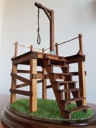
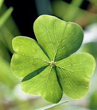

= Lesson 25
:toc:

---

== Section 1

==== A. Numbers.

1. At the third stroke, the time sponsored by Accurist will be twelve one and fifty seconds. +
2. The code for Didcot has been changed. Please dial 05938 and then the number. +
3. In the train crash in India, three hundred and twenty-five people are feared dead. +
4. The 3.45 at Ascot was won by Golden Dove, ridden by Willie Carson. +
5. Well, um, for a trip like that, we are speaking in the region of, er, two thousand eight hundred pounds a head. +

====
- sponsor (v.) 赞助（活动、节目等） / to arrange for sth official to take place  主办；举办；促成 /倡议，提交（法案等） +
-> The US is sponsoring negotiations between the two sides. 美国正在安排双方的谈判
- twelve one and fifty seconds. 12小时1分50秒

- Please dial 05938 and then the number.  请先拨05938，然后再拨(分机)号码。

- fear (v.)担心；担忧 +
-> Hundreds of people are feared dead. 人们担心已经死了好几百人。

- Ascot  阿斯科特赛马场
- dove 鸽子（白鸽常作为和平的象征）
- region  （通常界限不明的）地区，区域，地方
- in the region of 在附近, 在…左右, 接近
- a/per head 每人
====

6. Er, Celtic three, Manchester City nil, Queen's Park Rangers two, Motherwell United
one. +
7. In New York, the Dow Jones Index *fell* by point four *to* a low of *two oh six four point eight*. While in London, the FT Index rose eight points to *one seven nine four point three*. +
8. That'll be sixty-eight p, please. +
9. The, er, latest figures show an increased profit of seventy-eight thousand, nine hundred and fifty-six pounds. +
10. And how can we continue like this with unemployment running at three million, two
hundred and fifty thousand. It really is unaccept ... +

====
- Celtic (a.) 凯尔特人的；凯尔特语的
- nil （数码）零；（体育比赛中的）0分 /nothing 无；零 +
-> The doctors rated her chances as nil (= there were no chances) . 医生认为她没有希望了。
- ran·ger : （接受突袭敌战区训练的）突击队员，特别行动队队员 /（英国14至19岁的）女童子军 / 园林管理员；护林人
-  呃，凯尔特人3分，曼城0分，女王公园护林者队2分，马瑟韦尔联队1分。

- the Dow Jones Index *fell* by point four *to* a low of *two oh six four point eight*.  在纽约，道琼斯指数下跌了4个点，跌至2064.08点的最低点。在伦敦，英国“金融时报”指数上涨8个点，至1794.03点。

- That'll be sixty-eight p, please. 一共68便士。
- p : penny pence 便士 +
-> a 30p stamp 一枚30便士的邮票

- The, er, latest figures show an increased profit of seventy-eight thousand, nine hundred and fifty-six pounds. 呃，最新的数据显示利润增加了7.8万，956英镑.

- three million, two hundred and fifty thousand. : 在失业率高达 3,250,000 的情况下，我们怎么能继续这样下去呢？这真的是不可接受的…。
====

11. Yes, we can give you a special rate of, er, five point six eight per cent. +
12. We'll have to adjust all our figures by *an eighth*. +
13. Well, that's your choice. Eleven pounds forty-five for this one, fourteen pounds, or
fifteen pounds ninety-nine. +
14. So, it's two thousand three hundred and ninety-eight plus two thousand four hundred
and eighty-nine plus two thousand four hundred and sixty three. I'll just total that up for you.

====
- We’ll have to adjust all our figures by *an eighth*. 我们必须把所有的数字调整到八分之一。
- total up 合计,加总

====

---

==== B. Dialogues.

Dialogue 1: +
Woman: So, you'll take the cream at three pounds five, the pills are four pounds thirty and then, um, this if fifty-five p. That's seven pounds ninety-five. +
Man: Sorry. I think perhaps it's seven pounds ninety.

====
- cream 奶油，乳脂；霜，膏
- 1英镑 = 100便士
- cream 3.05 + pills 4.30  + 0.55 = 7.9
====

---

Dialogue 2: +
Woman: Is ten pounds all right? +
Man: Yeah, that's fine. It comes to six pounds thirty-five. Your change. +
Woman: Thanks. +
Man: Can I help you, sir? +
Woman: Oh, just a minute, I think you've given ... +
Man: Oh, I am sorry. Of course. Here you are.

====
- Your change 这是找你的钱, 这是找您的零钱
====

---

== Section 2

==== A. Memories.

Well, we met at a party in London. You see, I’d just moved to London because of my job and I didn’t really know anybody, and one of the people at work had invited me to this party and so there I was.

But it was one of those boring parties, you know everybody was just sitting in small groups talking to people they knew already, and I was feeling really bored with the whole thing.

And then I noticed this rather attractive girl sitting at the edge of one of the groups, and she was looking bored too, just about as bored as I was. And so we started, um, we started looking at each other, and then I went across and we started talking. And as it turned out she’d only just arrived in London herself so we had quite a bit in common —and well that’s how it all started really.

====
- really （表明事实或真相）事实上，真正地，真实地 +
-> Tell me what really happened. 告诉我究竟发生了什么事。
====

---

==== B. Married Life.

—What's the matter with you, then? You look miserable. +
—It's us. +
—What do you mean "us"? +
—Well, we used to talk to each other before we were married. Remember? +
—What do you mean? We're talking now, aren't we? +
—Oh, yes, but we used to do so much together. +
—We still go to the cinema together, don't we? +
—Yes, but we used to go out for walks together. Remember? +
—Oh, I can remember. It's getting wet in the rain. +
—And we used to do silly things, like running bare foot through the park. +
—Yes. I remember. I used(v.) to catch terrible colds. Honestly, you are being totally
ridiculous. +
—But we never used to argue. You used to think I was wonderful. Once ... (sound of the
door opening) Where are you going? +
—Back to live with my parents. That's something else we used to do before we were
married. Remember?

====
- ridiculous : very silly or unreasonable 愚蠢的；荒谬的；荒唐的
- But we never used to argue. 但我们以前从不争吵。
====

---

==== C. Superstitions.

Not long ago I was invited out to dinner by a girl called Sally. I had only met Sally twice, and she was very, very beautiful. I was flattered. "She likes me," I thought. But I *was in for* a disappointment.

"I’m so sorry we asked you *at such short notice*," she said when I arrived, "but we suddenly realised there were going to be thirteen people at the table, so we just had to find somebody else."

A superstition. Thirteen. The unlucky number.

====
- super·sti·tion  迷信；迷信观念（或思想）
- flattered (a.)感到荣幸的
- flatter (v.)奉承；讨好；向…谄媚
- BE/FEEL FLATTERED : to be pleased because sb has made you feel important or special 被奉承得高兴；感到荣幸

- *be in for it* : ( BrE also  *be for it* ) ( informal ) to be going to get into trouble or be punished 会惹出麻烦；要受惩罚 +
-> We'd better hurry or we'll *be in for it*. 我们最好赶快，不然要受罚的。

- *at short notice | at a moment's notice* = *on short notice* : not long in advance; without warning or time for preparation 随时；一经通知立即；没有准备时间 +
-> This was the best room we could get *at such short notice*. 这是我们临时能弄到的最好的房间了。  +
-> You must be ready to leave *at a moment's notice*. 你必须随时准备出发。
====

Recently I *came upon* a little group of worried people, gathered round a man lying on the pavement beside a busy London road.

They were waiting for an ambulance, because the man had been knocked down by a passing taxi. Apparently he had stepped off the pavement and into the street, to avoid walking under a ladder.

They say this superstition goes back to the days when the gallows were built on a platform. To get up on to the platform you had to climb a ladder. To pass under the shadow of that ladder was very unlucky …

====
- come upon :  V to meet or encounter unexpectedly 偶遇; 邂逅
- gallow v. （非正式）恐吓；使害怕
- gal·lows  绞刑架；绞台 +

- platform : ( BrE ) the open part at the back of a double-decker bus where you get on or off （双层汽车的）上下车出入口，入口平台

- 他们说这种迷信, 要追溯到绞刑架建在平台上的时代。要到平台上去，你得爬梯子。从那梯子的阴影下走过, 是非常不吉利的…
====

Other superstitions are not so easily explained. To see a black cat in England is lucky. But if you see a black cat in India, it is considered very unlucky.

There too, if you are about to set out on a long journey, and someone sneezes(v.), you shouldn’t go.

Break a mirror —you will have seven years' bad luck. Find a four-leafed clover, you will have good luck. Just crazy superstitions, of course.

I have an African friend. One day he said to me: "If ever an African says to you that he is not superstitious, that man is a liar." Perhaps that is true of all of us.

====
- set out 启程; 出发
- sneeze (v.)打喷嚏
- clover : a small wild plant that usually has three leaves on each stem and purple, pink or white flowers that are shaped like balls 三叶草；车轴草
- four-leafed clover 四叶草 +
 a four-leaf clover (= one with four leaves instead of three, thought to bring good luck) 四叶车轴草（一般为三叶，故被认为可带来好运） +

====

---

==== D. Ghost.

This is Lethbridge’s description of a ghost near Hole House. One of the first incidents happened near to our home in Devon. One Sunday morning my wife and I were standing on the hill and looking at Hole Mill, which belongs to Mrs. N. I sat down and admired the view. After a time I heard a motorbicycle start up and I saw the paperman riding off and, as I watched, I saw Mrs. N come out from behind the Mill. She was dressed in a bright blue sweater and had on dark blue tartan trousers and a scarf over her head. She looked up, saw me and waved. I waved back. At this moment a second figure appeared behind Mrs. N and perhaps a meter from her. She stood looking up at me. Mrs. N went back behind the Mill and the other woman followed. I did not know her. She looked about sixty-five to seventy years old, was taller than Mrs. N and rather thin. Her face appeared to be tanned and she had a pointed chin. She was dressed in a dark tweed coat and skirt and had something which looked like a light grey cardigan beneath her coat. Her skirt was long. She had a flat-crowned and wide-brimmed round hat on her head. The hat was black and had white flowers around it. She was, in fact, dressed as my aunts used to dress before the First World War. She didn’t look like the sort of person who was likely to be staying at Hole Mill today. Later we were leaning over a gate, admiring some calves, when we saw Mrs. N alone. 'Oh,' said my wife, disappointed. 'We were expecting to see two of you.' 'How is that?' asked Mrs. N. 'I have only seen you and the paperman all morning.'

---

==== E. A Strange Story.

A journalist has a strange story to tell.
I've never been a superstitious person ... never believed in ghosts or things like that.
But, two years ago, something happened which changed my attitude. I still can't explain
it ... somehow I don't think I ever will be able to.
I was living in Frankfurt ... in Germany ... where I was a financial journalist. A very
good friend ... one of my closest friends... we'd been at university together ... was coming
over from England by car to see me. He was supposed to get there around six in the
evening ... Saturday evening.
I was at home in my flat all that afternoon. At about three in the afternoon, the phone
rang. But ... but when I answered it, there was nobody there ... on the other end, I mean.
Nobody. The phone rang again just a few minutes later. Again, nobody was there ... I
couldn't understand it. Just a few minutes later, there was a knock at the door. I was in the
kitchen, making some coffee. I remember I was just pouring the boiling water through the
filter when I heard the knock. I opened the door and there was my friend ... Roger, that
was his name. Roger. He looked a bit ... strange ... pale ... and I said something like
'Roger, how did you get here so early?' He didn't answer ... he just smiled slightly ... he
was a bit like that. He didn't say very much ... I mean, even when I'd known him before, he
often came into my flat without saying very much. And ... well ... anyway, I said 'Come in'
and went back to the kitchen to finish pouring the coffee. I spoke to him from the kitchen,
but he didn't answer ... didn't say a word ... and I thought that was a bit ... strange ... even
for Roger. So I looked round the door, into the next room, where I thought he was sitting ...
and ... and he wasn't there. The door was still open. I thought for a moment that he'd gone
down to the car to get his luggage ... and then I began to wonder where his girlfriend was.
She was coming with him, you see, from England.
Well, then the phone rang again. This time there was somebody there. It was Roger's
girlfriend, and she sounded ... hysterical ... At first I couldn't understand her. She was still
in Belgium, several hundred kilometers away ... and she told me that she was in a
hospital ... she and Roger had been involved in a car crash, and ... and Roger had just
died ... on the operating table ... just a few minutes before.

---

== Section 3

==== Dictation.

It was early afternoon, and the beach was almost empty. It was getting hot now. Most
of the tourists were still finishing their lunch back at the hotel, or taking their afternoon
siesta in the air-conditioned comfort of their rooms. One or two Englishmen were still lying
stretched out on the sand, determined to go home with a good suntan, and a few local
children were splashing around in the clear shallow water. There was a large yacht
moving slowly across the bay. The girl was on board. She was standing at the back of the
boat, getting ready to dive. Jason put on his sunglasses and casually wandered down
towards the sandy beach.

---
