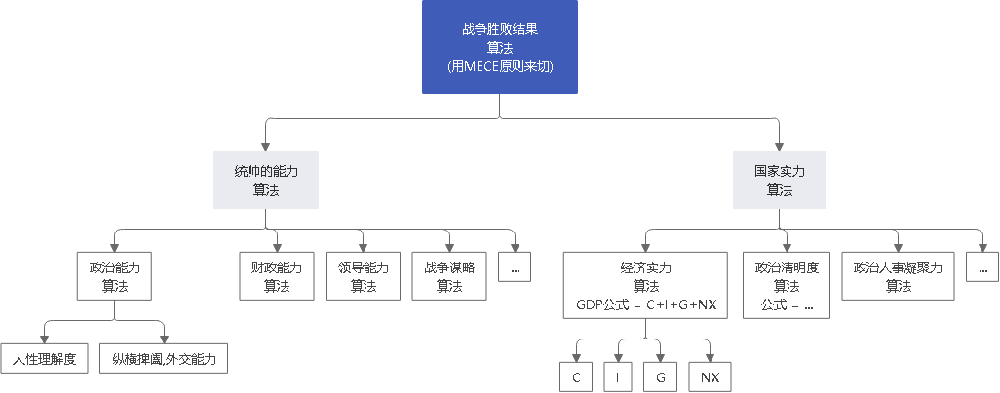
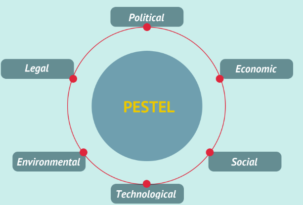
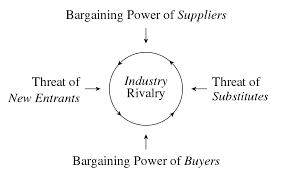
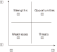
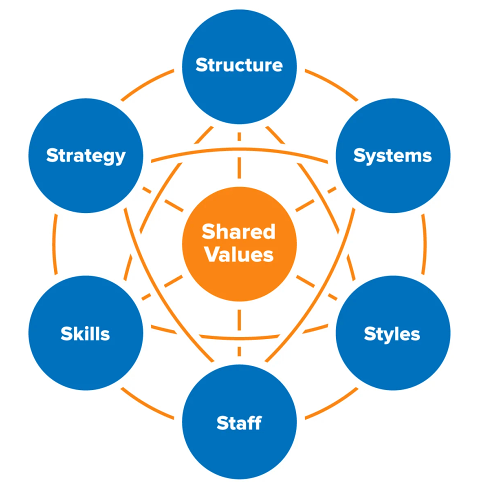
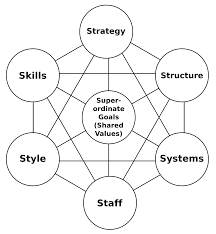

-
- 战略
	- 战略, 是为"长期维持"可持续竞争优势, 而设定的重要方针和计划，而不是"短期制胜"的商战技巧。中国古代的 如草船借箭、空城计、田忌赛马等, 都只是“术”(雕虫小技), 而非"战略".
		- > 田忌赛马: 田忌赢在“术”，但从战略角度讲，他已经输得一塌糊涂。对方每一匹马, 都比田忌相同档次的马匹, 精良且跑得快。也就是说，田忌的对手, 其实拥有无可非议的可持续竞争优势。田忌的举措只能在"信息不对称"背景下才能得胜，一旦游戏规则改变，田忌必输无疑。
	- 在个人(及组织)发展的初始期和关键拐点，往往“选择比努力更重要”。(男怕如错行. 越是吃人深坑的入口处，越是铺满了最迷惑人的鲜花, 来引诱你陷进去)
	-
- 谋事者
  collapsed:: true
	- 人可分为两种: 谋事者(思考, 解决问题的人, 参谋, 秘书班子), 和某物者(工具人, 看戏者, 吃瓜群众).
	- **谋事者从来不会以"自己并非那个专业出身的人士",而关闭自己大脑的主动分析判断能力, 来抑制自己观点的发表, 盲从"专家".** 中国古语"知之为知之, 不知为不知" , 从来不是谋事者的价值观. **谋事者绝不会"被动式的学习", 和"不加验证, 不加批判"的接收他人的说法.** (具有独立思考能力, 和批判性思维)
	- 掌握"结构化战略思维"的谋事者, 不会以“不懂”为拒绝思考的借口，他总是试图分解问题，运用放之四海而皆准的方法 (太阳底下没有新鲜事), 来逐渐深化“切”好问题.
	- **谋事者在内心中, 首先就是把自己定位成“解决问题的人”**，而不是"在一旁的看戏者, 吃瓜群众". 谋事者的性格中, 本身就对问题保持着亢奋的“进攻”状态。(**你自己就是爱思考者，要建立自己的价值观方法论大树框架"的人.** 曹操: 若天下没有孤，不知有几人称帝几人称王.)
	-
- "解决问题"的思考方式, 方法论
	- 解决问题，要有体系化的方法(方法论). 谋事者通晓不同思维方式, 及其局限性。
	- 思维方式, 可大体分为两类：
		- 1.自上而下的"结构化战略思维"
		  collapsed:: true
			- 不会因缺乏相关的专业知识和经验而纠结，往往直接从问题本身（“上”）着手:  用“切”的方法, 来分解问题. 并用严谨的逻辑, 全面地提出假设，而后或通过对数据的采集与分析, 来证实假设，或证伪, 推翻已有假设, 并建立新的假设（“下”），如此循环, 而深入地验证假设。不断探究深“挖”问题核心，以获取问题的最终解决方案。
			- 对于"跨界的战略类问题"，"结构化战略思维"更容易成为思考方式的首选。**使用这种思维方式时, 谋事者的自信, 并非来自于专业知识和经验，而源于掌握了"超越具体技能"的解决问题的能力(方法论)。**
			- 不同的行业，对相同或类似的战略问题的解法, 具有普适性 (即具有共通的"底层逻辑". 太阳底下没有新鲜事)。
			-
		- 2.自下而上的"专业思维"
		  collapsed:: true
			- 专业思维 : 即把所有底层（“下”）细节知识点都掌握了后, 再提炼出整体（“上”）的理解. 在学校里的学习方式, 基本都是这种的.
			- 其优点是: 从经验中提炼出的“最佳解决方案”, 避免了“重新发明轮子”的浪费。
			- 其缺点是:
				- 学习周期长。这种"厚积薄发"的获得"洞察"的方式, 可形容为“把海水煮热而取一瓢水”.
				- 各专业领域越来越复杂和细分, 个体已经很难同时成为多领域的专家。
				- 过往成功了的专业领域的经验, 可能会被不自觉地滥用。“手里有锤子，什么看着都像钉子”.
		- 这两种思维(结构化战略思维, 和专业思维), 彼此互为补充(互相取长补短)。实践中, 我们会反复应用不同的思维方式, 来彼此验证。
			-
- 切 : MECE 原则 (Mutually Exclusive ， Collectively Exhaustive)
  collapsed:: true
	- “切”是结构化拆分的通俗叫法，是结构化战略思维的基本功。
	- 结构化拆分, 就是在"自上而下"分析问题时，把问题逐层分解成更细节的部分，每次拆分, 都遵循MECE原则。最终得到一个树状的逻辑结构。
	- MECE原则, 即:
		- 1.子分类相互独立, 无重叠；
		  2.子分类加起来, 穷尽全部可能。
	- 如果缺乏结构化拆分能力，人们在思考时, 就往往会陷入"在各种毫无联系的单点思绪之间跳跃"的困境中, 浪费时间.
	- 你的"价值观方法论架构"大树,也可以用mese方法来布局整理.
-
- 切出来的每一块, 必须满足“具体可衡量”的客观标准。
  collapsed:: true
	- 否则, 对切出来的每个子类的价值判断, 就会陷入"模棱两可"的窘境。如果双方对“好与坏”“对与错”“公正和不公正”的切分维度, 没有一致的具体可衡量的评判标准，必然会陷入分裂的"价值判断"争论中。
	- > 比如: 不要只简单的"定性"切成"好""坏"两块, 你要"明确量化", 什么是"好"? 什么是"坏"? 要把具体的评判标准, 清晰地列出来.
	- > 比如: 如果"公益捐赠"是个好的行为，那么它的评判标准是什么?
	  -> 是金额吗? 还是频率吗?  那么什么金额或频率才算达标？能"量化"的衡量标准是什么?
	  -> 是否跟个人财富总额成比例？如果是，比例应该是多少？ 能"量化"的衡量标准是什么?
	  -> 除了捐赠, 其他类似的行为也算吗?  能"量化"的衡量标准是什么?
	  每个上层问题, 都会引出下一层更深的细节问题，都需要你去思考清楚。
	- > ▶ 你在编程三国游戏时, 每一个算法公式, 都有其更底层的n个算法公式来做支撑, 你要思考清楚其"结构树"上每一层的数学意味.
	  
	-
-
- 并且, 切出来的每一块, 彼此权重大小怎样? (28法则) .  各个因素彼此的重要性, 分别占多少比例？
  collapsed:: true
	- 维度清单, 和评判标准, 齐备之后，第三步是给每个维度赋予一定的权重值。比如"员工考核"问题的结构树, 假设最终的核心维度有ABCD四项，每项的最高分都是100分。A项占整体决策权重的50%，B项占30%，C项和D项各占10%，总和应该永远是100%。在计算时，每一项的实际得分, 乘以各自权重值，就可以计算出每个人(员工), 按照标准评判流程而得出的可比较的分数.
-
- 切, 至少有四种切法:
	- 1.数学公式法 (财务学, 经济学, 金融学, 自然科学中, 有大量的人类发现的"能分解世事"的数学公式)
	  collapsed:: true
		- > 利润=收入-成本
		  继续往下分解公式:
		  收入公式 = ...
		  成本公式 = ...
		-
	- 2.子目录列举法 (即你自己用mece切分, 想出来的清单或公式)
	  collapsed:: true
		- **利用这种mece法，很快就可以看清每个职业，部门，职能架构的权力大小, 和阶层分层**（肥差，肥缺，油水多的职业岗位，更靠近权力核心的内阁秘书岗位，而非边缘化的岗位).
		- **并且还能看清: "紧急"和"重要"两个维度划分下, 工作内容能带给你的ROI！职业即阶层**: 
		  -> 紧急但不重要的事(即边缘化的岗位，设计师工作)，委托給别人去做。
		  -> 紧急而重要的岗位(即策划，参谋谋事者岗位）, 高 ROI 的工作，自己做.
	- 3.流程法 (时间维度)
	  collapsed:: true
		- 即流程步骤, 整个链条, 或"生命周期"上的每一阶段. 对其做分解.
		- 对人,也可以用个"人年龄发展阶段"曲线,和 mece原则, 来拆分,来做你个人的开源节流战略.
	- 4.逻辑框架法
	  collapsed:: true
		- 即按逻辑叙述中常见的粗线条判断框架，如: 内部vs外部、主观vs客观、优点vs缺点等, 对问题进行初步切分。
-
- 切, 可以从不同的维度(视角)来切.
  collapsed:: true
	- 如何判断项目优先级？就要从切出的变量里面来看了. “切”项目的维度有很多：比如, 项目规模（收入/投入, ROI）、项目战略重要性 .... 在众多维度中，要找出两个跟"项目优先级"最相关的维度或属性，其组合(二轴模型)就可以定义"项目优先级"。
	- “切”要遵循“3-3原则”，即面对任何问题，都要纵向深入“挖”到至少第三层的细节。完成一次完整分解之后，跳出已有的逻辑框架, 再从全新的维度再做两次或以上的全过程. 总共建造3个或以上不同
	  的逻辑树，每个逻辑树都有至少三层细节。
-
- 单一维度思考:
  collapsed:: true
	- 所有简单的线图、饼图、柱状图和流程图, 都是"单一维度思考"的图谱呈现。
-
- 多维度思考:
  collapsed:: true
	- 两个维度, 就切分出4象限, 每个象限, 有各自的"可实施策略". (BCG波士顿矩阵亦然)
	  collapsed:: true
		- > 如:
		  {:height 500, :width 500}
	- 3个维度: 比如第三个变量是净利润, 可以用圆圈面积来表示它.
	  collapsed:: true
		- > {:height 500, :width 500}
		- 多维图谱分析, 也能用在个人生活中, 比如择偶判断. “切”男性 : 价值观, 事业能力, 情感能力(情商), 财富(财商), 智商, 工作职业, 年龄, 籍贯, 等等. 可以从中跳出2-3个变量, 来做成二轴图. 看潜在对象在四象限图上的分布位置, 就能一目了然好坏.
		- 当然, **还要深入思考这两个变量间有什么关系存在？是因果关系，还是相关关系，还是完全没有关系? 没有关系的话，这个二轴图就完全没价值了.**
		- 多维图谱, 有助于生成通俗易懂的分类, 和对待每种分类的战略或对策。
	- 找到相关维度:
		- 数据挖掘工具，如python, SPSS、SAS 等, 可以做"数据回归"等分析, 帮我们寻找相关的维度。你要学习统计学和数据分析.
		-
	-
-
- 切, 能产生洞见.
  collapsed:: true
	- **随着问题的逐步分解和分析的深入，越来越多的业务细节会浮出水面。**
	- 你要想出, 通过何种方法，来验证这个观点? 为什么你的目标客户只能是年轻女性呢？这是由什么造成的？是你产品的"设计现状"决定的么？改一改能吸引到其他用户么？ 这是一个鸡生蛋还是蛋生鸡的问题。
	- **只有你自己想出方法论，你就能独立想出"任何世上还不存在的, 解决某个问题的方法论"，就好像印度数学家独立证明出"西方数学家证明过的数学原理"一样，你就会对自己的思考分析，建模能力很自信，你就是一个真正的理论思想家，能创建出自己的理论体系, 和方法论架构.**
	- 你头脑中浮现出的灵感, 真知, 就如同夜空中的星星，你不抓住它，它就会消失.
-
- 切后,  挑选出不同数量的变量，就可以产生不同的模型. (最简单的就是 2个变量的"二轴模型"了)
  collapsed:: true
	- 如客户管理系统CRM（Client Relationship Management）, 产品信息管理系统PIM（Product Information Management），其顶层设计, 从商业视角理解, 无非是在行业最佳解决方案的基础上，对关键核心名词, 维度切分化, 数字化.
	-
	-
	-
-
- "结构化战略思维"的四个原则:
	- 这4个原则, 它贯穿"新麦肯锡五步法"的全过程.
	- 原则1：用数字来说话 fact based
	  collapsed:: true
		- **不是所有有价值的事物, 都可以被计算; 也不是所有可计算的事物, 都值得去计算。**——爱因斯坦
		- 数字至关重要。但数据本身并不能表达任何含义，只有数据与逻辑结合在一起时，我们才可能从中获得发现。
		- 数字常见的陷阱:
			- 要假设: 没有经过验证的数字都是骗人的. 数字虽然是客观的，但数字的产生、筛选和解读, 都能被人干预甚至污染。
				- 误导手段 : 选择性提供数字，只选择对自己有利的数据点，误导人们推出与客观事实相反的结论。
				  collapsed:: true
					- > 如, 在波动曲线中，如果有意只选择有利的数据点，就可以造出能符合任意"斜率"的上升趋势图.
					  
				- 偷换概念:
				  collapsed:: true
					- > 某教育机构, 广告声称“全国用户超过4亿”，而“用户”的概念是包括“注册用户”“试听用户”“付费用户”和“活跃付费用户”等。广告里的“用户”其实是指历史上累计的所有"注册用户", 而非听众一般理解上的“活跃付费用户”.
					- > 某路演企业宣称 : “本公司营业收入连续三年增长20%以上，是健康且稳步增长的高科技企业。”
					  **这句话前半句是数字, 后半句是观点结论. 即使数字是真的, 但这个数字并不一定能推导出“健康且稳步增长”的结论。因为收入只代表当前的单一一个变量, 还有其它很多关键性变量要审查. 即要全面分析该企业的基本面情况(犹如你是医生, 对病人做全面体检)(财务上的, 竞争战略上的, 未来威胁上的. 利用 swot, 波特五力模型, 波士顿框架等等). 战术上成功, 战略上失败的例子比比皆是.**
					-
					-
					-
			- 用常识进行"快速推理, 计算"能力 (Back-of-the-envelop-calculation): 直译“信封背面的计算”，也就是粗略的估计。这类问题并不在于答案是什么, 而是重在训练你的推理逻辑 (自洽).
			  collapsed:: true
				- 如, 如何推算波音737飞机里面能装多少个高尔夫球？如何计算波音737飞机的重量？如何测算新苹果手机本月的销量？
				-
				-
				-
			- 关注"少数特例"(极端值)
				- 从另一个角度看，卓越的人, 也是普通大众中的一种少数特例。
			- 过去的数据无法预测未来。
			-
	- 原则2: 洞见优于表象 insight driven
		- 可以通过以下几个简单步骤, 来练习寻找洞见：
		  collapsed:: true
			- （1）寻找数字中的规律和趋势（Pattern）
			- （2）寻找极端的数字(极端的数据点包括: 最大值、最小值和数字0), 及其背后的涵义, 导致这些极端值的原因是什么?
			- （3）对比参照数据(同比, 环比, 与竞争对手互比), 并分析差异, 为何两者会有差异?
			- （4）寻求其他相关信息. 因为财务报表中的数据有限, 还需要其他市调, 访谈等来收集必需的数据.
			- （5）推演并提炼洞见。-> 新麦肯锡五步法, 就是在解决这个问题.
			-
		- 阐述你的观点时, 也要"洞见先行" -- 30秒电梯法则 : 先阐述自己的核心观点，也就是洞见，然后再辅以论据, 或分论点。(金字塔原理)
		  collapsed:: true
			- 
		-
	- 原则3: MECE原则  MECE principle
		- 在攻读MBA学位的时候，战略主修课教授, 会体系化地传授众多经典管理学理论。如波特五力模型等等. 但在麦肯锡从事战略咨询工作，**每个人都要根据实际情况，利用维度切分, 和MECE原则, 创造出多个用于解决实际问题的全新理论框架，并以此为整个项目的逻辑主线。**学习、创造并超越经典模型框架, 已经成了麦肯锡人的家常便饭。
		- 每个经典的理论模型, 都是用来解决非常具体的商业问题的。
		- 对谋事者而言，经典管理学理论, 同样遵守着维度切分和MECE原则。掌握了结构化战略思维的基石，就可以复盘这些理论的生成过程，并创作出更符合时代要求的新框架。
			- -> 用来评判"企业外部的宏观经济大环境"的理论框架 -> PEST模型 (哈佛经济学教授 Francis J.Aguilar, 1967年提出)
			  collapsed:: true
				- 比如, 你自己的公司, 要拓展海外业务, 首要问题就是: 如何评判一个国家或地区的宏观经济, 是否适合投资？
					- (1)通过头脑风暴, 把你能想到的所有相关要素, 都写下来.
					- (2)然后归类, 成政治的, 经济的, 文化的, 科技的, 教育的...
					- (3)这些结构层级(符合MECE原则), 就能构成你模型的架构树.
				- PEST模型同样如此.
					- 
					-
					-
			- -> 企业的外部实体, 对企业的影响力( 每个企业, 都跟外部各种势力进行着博弈).  该"挤压力"模型,  换言之也是"入行吸引力(男怕入错行!)模型" 之一就是 -> 波特五力模型
			  collapsed:: true
				- 
				- 你可以分别权衡, 你和这5个对象, 彼此之间力量孰大孰小, 就能得出"你所处境况"的初步判断.
				- 但是, 五力模型并不完美, 用MECE原则来审视它, 会发现:
					- 1. 它遗漏了与企业具有互补作用的"协作者"(同盟军, 异业联盟),比如, 豆浆和油条就是能"互补共荣"的.
					- 2. 还遗漏了另一个对企业有重要影响力的对象 -- 行业工会（Labor Union）.
					- 3. 还有一些特殊行业，比如皮加工业, 和矿产开发, 会受到外部公益组织, 如动物保护协会, 和环境非政府组织（NGO）的干涉。
				- 通过锲而不舍地“刨根问底”，你就能对波特五力模型的内容、功用, 和局限性, 都产生更深刻的认识。
			- -> 企业内部管理的 SWOT 分析模型
			  collapsed:: true
				- （Strengths优势、Weaknesses劣势、Opportunities机会, Threats威胁）
				- SWOT模型, 只是用了最简单的单一维度逻辑法切分。只用了一个变量: “内部vs外部”, 然后把它拉伸成带有"有利vs不利"这个价值度量.
					- {:height 300, :width 300}
					- 从设计上看，SWOT分析是粗线条地初步梳理思路的工具，而不应该成为呈现思考结果和洞见的方法。企业管理外部和内部, 都应该有更细节、更深入的切分方法，如波特五力模型, 就在外部分析上, 比SWOT分析中的“机会”和“威胁”更有深度。
					- 从内部分析角度看，SWOT好坏两极的逻辑也过于粗糙，跟麦肯锡7S模型, 和比较通用的企业战略画布等模型, 在细节层次上有很大差距。
					- 所以，在企业报告中若只呈现SWOT分析, 是整体分析颗粒度不细, 和思维深度不够的表现。
				-
			- -> 麦肯锡7S模型 <- 主要用来诠释公司各内部模块是如何相互作用的。
				- {:height 153, :width 223}
				- 
					- Shared values 共同价值观：公司的核心使命, 和文化。
					- Strategy战略：公司要建立相对竞争对手的 可持续的竞争优势的计划。
					- Style风格：公司决策和管理风格。
					- Structure结构：公司的组织架构，如汇报的链条。
					- Systems系统：员工完成任务所用的系统和流程。
					- Skills能力：组织综合能力。
					- Staff员工：组织成员。
					- 麦肯锡7S模型, 把"共同价值观"放在所有要素的中间，凸显"价值观"是各个部分的核心黏合剂，所有要素都围绕着价值观。
					- 实操中，会把元素两两配对进行分析，把图谱转化成"比较矩阵"(即二轴模型)。
				- 作为训练有素的结构化思维“切”的专家，先习惯性地看一下7S模型中, 这7个要素是否符合MECE原则? 你会发现, 虽然它冠以“麦肯锡”的前缀，但这7个要素却不止一处违反了MECE原则！
					-
					-
			-
		- 的确，如果还没有方法论，就建立你自己的方法论。二轴模型中的各种变量组合模型，都是你能自己创造出来的.
		- 去看管理学的书,找出里面的所有模型,用MECE法则, 来分析拆解,重新组装到你自己的"理论架构树"上.
		- 不要重复造轮子, 把前人总结出来的模型，或者你自己讨论分析出来的模型，要把它们记录下来，方便以后重复复用，而不需要每次都重新造轮子.
		-
		-
	- 原则4: 以假设为前提 hypothesis driven
	-
	-
	-
-
-
-
-
-
- other
	- 危险是真实存在的，而恐惧却是一种选择。
	- 舒适区:
		- 习惯刷短视频, 而不去学习真正有价值的东西, 也是一种舒适区.
		- 对公司也是一样的, 公司自己不思进取, 也会处在舒适区的业务中.
	-
-
- 81
-
-
-
-
-
-
-
-
-
-
-
-