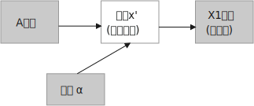
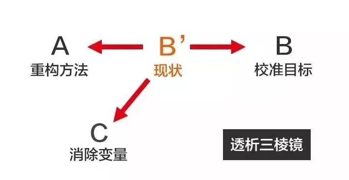
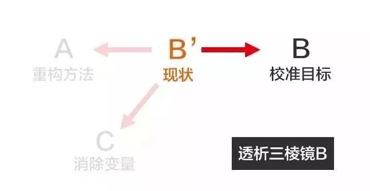
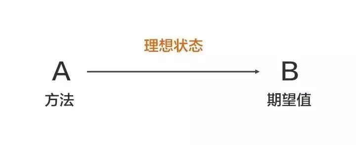
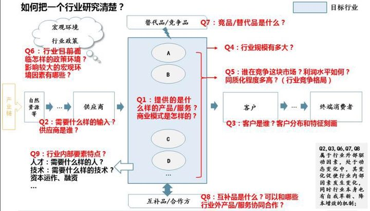
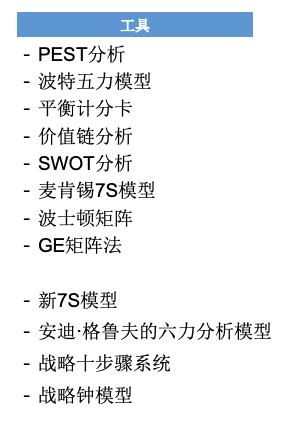

title:: dir 21. 思考,判断,行动,策略; 效率阅读,快速读书

- {{renderer :tocgen }}
- ---
- ## 效率快速阅读法
	- 带着你的问题, 去阅读, 专门查找特定内容, 而非从头看到尾
	  background-color:: #264c9b
	  collapsed:: true
		- ==首先, 要明确, 你的目的是"查书"! 而非"看书". 即, 你首先是有一个自己的问题(即：问题意识), 或目标, 再去查书中的人家回答, 或提供的方法论.==
		- 没有问题，就是最大的问题. 因为没有问题，就意味着你不知道目标在哪里. 也不知道你的船真正应该往哪个方向去.
		- 在学校时, 你就要有明确的这点认识. 否则, 你就会发现, 你在学校里学的很多东西, 在你进了社会后没什么大用. 都不解决你真正想要解决的哪些问题. 换言之, ==你浪费了大量学习时间, 花在了对你毫无价值的东西上.==
		- 没有 「问题」 的学习，是最最差劲的学习方式. 因为你对此的心态, 只是在浏览娱乐, 而不是在组装成自己的"系统化的方法论架构".
		-
	- 对任何"事物"的判断, 都要问4个问题:   #important
	  background-color:: #264c9b
	  collapsed:: true
		- 1. 它存在的意义和价值是什么? 即, 它是为了解决什么问题, 而存在? 为什么它必须要存在? 其他事物能替代它吗 ?
		- 2. 它宣称能针对解决的问题, 这些问题重要吗? 价值度如何?
		- 3. 它是如何做到的? 方法是什么? 背后的原理是什么? 底层逻辑是什么? 心理学依据是什么? 每个方法的ROI如何? 成功率如何? 优点和缺点分别是什么? 使用场景的前提要求是什么?
		- 4. 对同一个问题, 经常不同高人间的观点, 也会彼此不同 (这在政治学领域很常见). 那么你就要特别注意他们彼此间的批判, 观点逻辑如何. 对对方理论的漏洞, 挖掘深度如何? 犀利度如何, 一针见血吗? 令你拍案叫绝吗? 并以此来补足你的思考漏洞, 和理论框架.
		- 然后, **把你这4个问题类别, 建立起一个问题框架树 (清单填空题),  然后将书中的找到的答案, 一一填充进你的这个"框架树"填空题中. 这本书对"你自己的问题"的价值, 就榨干了.**
		- _问题框架树_1647567909766_0.svg)
	-
	- 查书, 学习, 所选的书, 必须要是经典的, 大师的教材.  否则, 你去“快速榨干”一本平庸的书，就算能榨干，能获得多少？来源已经很平庸了，你能得到的结果只能是等而下之.
	  background-color:: #264c9b
	-
	- 一本书中, 对你有价值的, 只有三种成分:
	  background-color:: #264c9b
	  collapsed:: true
		- 1. 开拓你的眼界的新知.
		- 2. 对你"日常问题", 有实用价值的"解决方法".
		- 3. 素材价值: 哪些素材你可以直接拿来用, 能支持你自己价值观观点的。
		-
-
-
-
- ## 思考与判断 -> 实践是检验"真理"(思想想法)真伪的唯一标准
	- 分析问题的方法论: 问题，它是由"不当的目标"、"错误的方法"、"意外的变量", 这三个因素共同影响产生  #important
	  background-color:: #793e3e
	  collapsed:: true
		- 1.问题: "最近公司业绩一直在下滑，你下一步打算怎么办？"
		  collapsed:: true
			- 分析: **这个问题，其实很模糊.  首先, 你要给出定义: 怎么算下滑？目标业绩是多少？现在业绩是多少？下滑的比例是多少？过去几个月具体是什么情况？**
			- 是原来做100万，现在变成30万？
			  还是原来做100万，现在下降到80万？
			  这两个问题，显然是不同的问题。一个是要解决70万差额的断崖式下跌，一个是要解决20万差额的业绩波动，解决方案当然截然不同。
			- 如果是第一个问题, 就需要做更底层的改动了, 比如营销战略调整, 甚至整个团队换血.
			  如果是第二个问题, 可能只需局部改动.
			- **所以, 要解决一个问题，你得先弄明白这个问题的"本质"和"程度"到底是什么。别急于给药方. 病都没查清楚呢, 就开药.  不是所有的疼, 都是感冒, 或都是癌症. 即使有癌症, 也分早期和晚期等不同程度的病程的.**
		- 2.那么，我们应如何精准的描述一个"问题"呢？
		  background-color:: #264c9b
		  collapsed:: true
			- 第一步：明确期望值(即"目标终点位置")（B）
			  background-color:: #497d46
				- 你的目标是什么？
				- 这个目标是可衡量的吗？可量化的吗?
				- 正常情况应该是什么状态的？
			- 第二步：精准定位现状(即"目前所处的位置")（B’）
			  background-color:: #497d46
				- **描述的时候，应区分"事实"与"观点".**
					- "今天好冷啊！" 是事实，还是观点？-- 这句话是观点. "现在气温=0℃"，这个才是事实.  至于0度的时候，你觉得冷，还是不冷，每个人的感受是不同的。
					- **所以, 类似“你的业绩那么差，打算怎么办”这样模糊的问题(观点类问题)，你认为的差，和他认为的差，也许并不一样。** 在他的眼里20%的下跌，也许算正常波动，而你已忧心忡忡。所以就会导致，你想让他给出方案，而听到的却是感觉他在不断寻找借口。**因为你和他, 对同一个问题的性质判断, 没有共识.** 你们在讨论的，其实并不是该如何提升业绩的方法，而是首先会变成: 到底什么才算“差”？(先达成"共识"这个第一步, 才能去走第二步)
					- 所以, 事实就是"用数据说话".
			- ==期望 - 现状 = 落差（B’→B）==
			- 第三步：用（B'→ B）这个落差，精准描述问题
			  background-color:: #497d46
				- 即, 你应这样来问下属: "你之前三个月的业绩, 分别是100万，110万，105万，而这个月变成了80万，我们来讨论一下，下个月如何能做到120万？"
				- 提出一个精准的问题，是找到正确答案的第一步. 如果你问错了问题, 回答也会很不聚焦.
		- 3.如何寻找答案和解决方法
		  background-color:: #264c9b
		  collapsed:: true
			- 不要只看到"表面问题"(头疼医头，脚疼医脚), 要层层回溯"背后更深的, 底层本质原因"
			  background-color:: #497d46
				- 理想的状态是：做了（A方法）-> 就能完成（x目标）。
				- 但过程中, 市场现状是: 出现了新的变量状况(比如, 竞争对手降价), 影响了我们目标的实现.
				- 
			- 事实上, 导致现状x' 出现的原因, 有三点:
			  background-color:: #497d46
				- 1. 实现的方法手段, 本身错误
				  2. 目标期望值, 设置不当
				  3. 过程中出现的各种新的变量
				- 
			- 
			- 所以，要解决这个问题，不能盯着（B'→ B）看，而是要透过（B’）去看ABC，我称之为透析三棱镜。
			-
			-
		- 透视三棱镜
		  background-color:: #533e7d
		  collapsed:: true
			- 问题，它是由"不当的目标"、"错误的方法"、"意外的变量", 这三个因素共同影响产生：
			- 4.校准目标 (B) -> SMART原则
			  background-color:: #264c9b
				- {:height 152, :width 222}
				- 设立目标，一定要遵循SMART原则:
				  background-color:: #497d46
				  collapsed:: true
					- S：Specific，明确的，具体的, 而非定义含混的
					- M：Measurable，可衡量的.  可量化的.
						- 比如, 目标是"让客户满意". 那么怎么样才算满意呢？你需要加上一组数据维度，比如说用户好评分，在9.5分以上，这样就能衡量是否达成了。
					- A：Achievable，（自力）可达到的
						- 要强调的一点是，目标的达成，一定是靠自己的力量可以控制的过程，而不能把目标达成与否寄托在他人或者你不可控的事情上。
						- 比如，如果你目标定为"下半年能够升职"，或者是"他能更喜欢我", 这些你不能控制，因为决定权在对方. 但你能改成"连续两个月达到团队业绩第一名"、"提升自己对他的吸引力"。
					- R：Rewarding，完成后有满足感的
						- 太近、太容易的目标，即便完成，你也不会有愉悦感和满足感，那么这就不是一个好目标，会让你在过程中失去对它的渴求，也就没有了动力。
					- T：Time-bound，有时间限制的
						- 一定得有时间限制，不然任何目标都没有意义。没有时间限制，这个目标就会成为一句口号，起不到任何作用。
						- 不同的时间限制，会导致你思考的方式、制定的计划完全不同。
				- 注意区分"目标"和"手段"
				  background-color:: #497d46
					- 
					- 我们是使用方法A,来达成目标B，而不要把A本身当成目标!
						- 比如, 你不能老是停留在"方法论"的学习上, 要下泳池直接游泳! 要实践它们, 检验它们的对错真理性!
						- 又如, 你读书的目的是什么? 不是为了读书而读书. 别忘了你是为了解决你遇到的问题的! -- 读书是手段，而不是你的目的本身。
						- 又如: "在一个项目的重大节点的时候，有一个非常重要的人，突然宣布要辞职，他一走必然会造成项目不能预期完成，你该怎么处理？" 显然, 你要解决的真正问题, 并不是如何挽留他的问题(你也未必留得住), 而是如何保障项目的进度问题. 所以你的解决方案, 也全部都应是围绕后者来进行的.
						- **谈判中, 双方会在价格上陷入僵局. 其实, 价格只是表面"手段", 背后的"目的"是要达到彼此更高利润。所以, 你谈判的焦点，就应该放在如何在双赢的前提下, 令对方也能提高利润上，而不要局限于眼前这个产品的价格上。**
						- ==目标不对，什么都不对！==
						-
						-
					-
			- 5.重构方法(A)
			  background-color:: #264c9b
			  collapsed:: true
				- {:height 149, :width 229}
				- ==重复原有的方法，只能得到同样的结果.== #important 想要有不同的结果，就需要用不同的方法。
				-
				-
				-
			- 6.抵消变量 (C)的影响 -> 象、数、理
			  background-color:: #264c9b
			  collapsed:: true
				- {:height 127, :width 209}
				- 这个（C）可能是内部变量，也可能是外部变量.
				- 我们该如何找到这个（C）呢？首先，**你要建立一个寻找问题的基本思考框架**，叫做：象、数、理。意思是：任何一个现象背后一定有数据，任何数据的变动，背后一定有道理原因。
				- 换言之, ==**当你发现某个现象后，你要赶紧去找相关的数据，然后用数据来说明问题，这可以让你对事情从感性认知变成理性分析 (用数据说话, 用数据来衡量问题的严重程度. 正如医生用化验数据来衡量你的疾病程度)。**== #important
				- 表象 <- 背后数据
				  background-color:: #497d46
				  collapsed:: true
					- 面对一个客观问题，要避免使用“我感觉”这样的表述方式，比如：我感觉最近用户的投诉多了。这样的反馈没有任何意义，这只是你的"观点"，不是"事实". 你要用数据来说明 -- 比如：
						- > 上个月我们的销量是1000单，共接到2个投诉电话，投诉率为2‰；
						  这个月我们卖了3000单，却接到了20次投诉电话，投诉率为6.7‰，比上个月足足提高了3倍多，这个问题需要引起我们的重视。
					- 这个数据够不够呢？不够，你要继续挖掘更细的数据，比如：这20个投诉电话，分别投诉了哪些内容？
					- 然后你发现，其中有19个投诉了产品质量问题，有1个投诉了物流问题。
					- 你还可以继续追问下去，比如具体是哪些部位的质量问题？占比各是多少？这些产品分别是什么时间生产的？等等。
					- 总之，**把现象背后的数据分解的越细，看到的问题就会越精准。**
					- 有了明确的数据，我们才能寻找导致数据变化背后的道理是什么。
				- 怎么找到"数据"背后的"原因"道理？ -- 用5Why提问法 (即因果链回溯法)
				  background-color:: #497d46
				  collapsed:: true
					- 进行多次回溯, 连续追问n个为什么，来寻找这个数据异动背后的原因。
						- > 如: 为什么这个月的次品率, 是上个月的三倍？
						  <- 为什么这个月的次品率是上个月的三倍？因为最近销量突然变大，这个月开始日夜两班倒，晚上的次品率比较高 
						  <- 为什么晚上的次品率比较高？因为晚上品控把关不严 
						  <- 为什么晚上会品控把关不严？ 因为工人们晚上都在偷偷看手机 
						  <- 为什么半夜加班会偷偷看手机？因为最近正好是世界杯...
						-
				-
	-
	- 行业分析
	  background-color:: #793e3e
	  collapsed:: true
		- 知乎: 如何在一周内快速摸清一个行业？ https://www.zhihu.com/question/21324385
		-
		- 概览:
		  background-color:: #264c9b
		  collapsed:: true
			- 
			- 行业研究的目标, 是对一个行业形成一个全面但浅薄的认知，而无法对一个行业形成真正深刻的见解. 要想达成后者，需要在一个行业中常年浸润并持续思考.
			- 做行业研究, 需要:
				- 1.结构化思维的能力, 如《金字塔原理》
				- 2.模型理解, 和应用的能力。行研相关的理论和模型很多，但其实都有一些陈旧. 事实上，在MBB(指三家咨询巨头公司：麦肯锡（McKinsey）、贝恩咨询公司（Bain）和波士顿咨询集团（BCG）)的辉煌期过去后，行业研究和咨询行业都陷入了长久的停滞期，至今为止还在吃那个时期的知识成果.
					- 
				-
		-
		- 对行业进行画像分析, 要了解的经纬线包括:
		  background-color:: #264c9b
		  collapsed:: true
			- 这个行业的产能如何？其在整体经济结构中的地位。
			- 这个行业的盈利模式是什么？
			- 这个行业的法律监管如何？
			- 这个行业的完整产业链, 即: 上游供应链，下游消费者是谁？
			- 这个行业的诸侯格局是怎样的, 第一, 第二, 第三梯队各自有哪些玩家？头部几大竞争者, 各自的优劣势, 近几年来此消彼长的关系是什么?
			- 这个行业在本国, 与国外同行业竞争者的差异有哪些?
			- 分析行业的目前的趋势
			- 分析整个行业的生命周期（关键词：发展&波动）
		- 具体到某一个公司
		  background-color:: #264c9b
		  collapsed:: true
			- 公司现在的战略是什么，未来方向和预期是什么。
			- 这个公司这几年来都有什么动作，给它造成了什么影响，市场地位发生了什么变化.
			- 把行业和公司的利润率拆解一下. 司的典型商品或服务的成本构成和利润空间，看看公司成本变化受什么影响，未来收入增长方向对利润率的影响。
			- 了解竞争对手与他的差别，因为几家公司的产品差异和战略差异，而造成的市场细分、聚合、或此消彼长的动态机制.
			- **这里做的工作，实际上是把一个较大的商业实体（公司，或者主要产品线）的典型行为摸清了；从投资的角度上说，把公司层面上的收入和利润变化搞清楚，就可以做一个粗浅的对收入和利润的预测模型了，进而可以形成一个粗浅的估值。**
			- 要继续做2件事：1. 纵深挖掘，把从公司进一步挖掘到更细的经营实体和产品单位；2. 长期跟踪，从动态中提炼细节。
			- 回到经商的本质 -- 赚钱, 你只需要弄清楚4个问题:
			  background-color:: #497d46
			  collapsed:: true
				- 问题1：你的产品是什么？
				  问题2：你卖给谁？
				  问题3：每个产品的价格是多少？
				  问题4：你的成本是什么？-- 租金、员工费用、原材料成本等等
				- 那么针对这4个问题，又衍生为以下4个问题:
				- 问题1：我是否要新增产品或者减少产品？
				  问题2：我如何扩展我的消费群体和对象 ？
				  问题3：我是否要调整定价？
				  问题4：我怎么节省我的成本？
				- **在解决这4个问题之前, 你一定需要知道我收入与成本的构成是什么，才能针对性地去提升. 即分析要 go to detail. 因此关于收入你需要将你的产品拆分详细，拆得不能再拆了 (往往从三张财务报表, 招股说明书上体现出来)，然后再看每一个产品的运营效率究竟如何.**
				-
				-
			- 分析你的竞争对手, 是怎么做的, 在做什么
			  background-color:: #497d46
			  collapsed:: true
				- 对标什么呢？依旧是前面分析的4个问题.
					- 问题1：竞争对手的产品是什么？产品线是比我多，还是产品更精简？
					  问题2：竞争对手的用户是谁？有没有挖掘出我之前没想到过的用户群体？
					  问题3：竞争对手的定价策略是什么？是不是走高端线，或者都是低端线？
					  问题4：竞争对手的成本是什么情况？成本多少，又是如何削减成本的？
				- 现在, 你对整个行业开始有了相对清楚的认知，你知道玩的最好的玩家, 好在哪里，也知道玩的最差的玩家, 差在哪里
				-
			- 看穿你这个行业的商业模式本质
			  background-color:: #497d46
			  collapsed:: true
				- 问题1：这行的关键成功因素是什么？
				  问题2：这行自身劣势, 最大的风险是什么？
				- 问题3：这行的市场规模有多大？还能再大吗？这关系到增量
				  问题4：这行的壁垒高度, 护城河是什么？新玩家进来会轻松分我的蛋糕吗？这关系到存量
				- 问题1：这个行业究竟是靠什么来驱动发展的？（这涉及到行业未来的发展趋势）
				  问题2：是否会受到经济周期或政策的影响？（这涉及到发展时会被经济和政策影响的程度）
				  问题3：目前处于生命周期的哪个阶段（了解目前所处的发展阶段）
			- 看到动态的时间范畴上, 行业的生命周期 (犹如k线图一样)
			  background-color:: #497d46
			  collapsed:: true
				- 问题1：这个行业目前和过去3-5年比，发展到怎么样了？时代变了吗?
				  问题2：行业是增长了还是下滑了？
				  问题3：导致这一现象的原因是什么？宏观经济影响是什么?
				-
				-
		-
		-
	-
	- [[麦肯锡7步程序法]]
	-
	-
	- 咨询行业衰落的原因是什么？
	  background-color:: #497d46
	  collapsed:: true
		- 纸上谈兵
		  background-color:: #49767b
			- 在咨询公司, 长远来看，如果仅仅是做案头研究、专家访谈、数据收集、想故事线、画ppt等等工作，还是局限在“纸上谈兵“的范畴，尽管接触的行业多，没有参与项目的落地和执行，是远远不够的。大部分进入咨询行业的人还是会把它当作“进入甲方/PE/VC的跳板”，而非最终目的地。
			- 如果咨询公司“高大上”的框架、方法论, 不接地气, 慢慢的，咨询公司的用途从导师、医生, 变成了附加值很少的“上行沟通”，即收集、整合信息，向客户总部管理层汇报。多少甲方企业早已看透咨询公司不落地的本质，继而在有限的项目经费里, **(甲方)不断要求呈现更多的事实、资料，即fact；而不希望听取建议本身，因为他们知道，建议本身是不能够被落地的，反倒是更多的资讯信息可供甲方自己去消化和分析。所以现在就变成: 大佬有方向了，咨询公司去做论证，帮助大佬向更上层要资源.**
			- 从前是咨询公司教甲方做生意，现在反过来了，作为甲方，反而要给咨询公司上课，让顾问们了解最新的行业动态、产品创新、数字化转型、市场营销与推广模式。
			- 近年来，咨询公司已经在顺应时代潮流，学习数字化转型方法论、收购第三方agency公司来执行项目落地……它们也在变革.
			- (**上面这些问题, 不就是和新里程自己遇到的完全一样么? 时代变化, 甲方已经完全超越乙方的认知, 互联网时代的卖房模式, 和策略手段, 乙方能比甲方实际在操作的, 认识更深吗? 所以, 乙方已经无法为甲方带来更多价值了, 所以也就被甲方抛弃.**)
		- 面试时, 没有精确方法能筛选出候选人能力
		  background-color:: #49767b
			- 咨询公司单一的招聘模式 - case interview - 已经延续了几十年，如今也面临过时了。案例面试的用处实质是考察申请者解决问题的能力，对面试官的要求非常高。然而，**因为面试没有对错答案，面试官的内部反馈往往趋于generic（一般性），即泛泛地从创造力、数学能力方面进行评价，却没有一个系统性的反馈方法论，所以下结论、作出判断非常主观。**
			- 譬如，如果申请者深度讨论了某公司的商业模型，面试官A可以录用他，因为他“主观能动性、分析能力强“，面试官B也可以拒绝他，因为他“过于理论化、只会纸上谈兵”。
			- 芝加哥大学的研究也发现，**案例面试能力和真实的工作能力其实并没有正相关性**——会应付面试，却没有真材实料的大有人在。
			- 谷歌全球人力资源高级副总裁Laszlo称：我从不喜欢案例面试这种形式。**它并不能预测面试者的确切工作能力，只能让面试官感觉自己聪明。**
			- Havard Business Review对案例面试的评论，以及建议采取的考核方法： https://hbr.org/2020/01/what-top-consulting-firms-gets-wrong-about-hiring
		- 甲方自建内部策略分析团队
		  background-color:: #497d46
			- 互联网的出现导致了信息流动大大加快，甲方有自己的行业专家、数据、策略团队，可以实时监测生意的进展、关注长期发展策略，并及时落实执行.
			-
		-
		-
	-
	-
	-
	- [[dir_人的想法, 是需要受刺激, 而启发出来的.]]
	- [[dir_概念是个框, 所以没有绝对的定义, 只有不同人赋予它的不同定义]] #important
	- [[dir_知识付费中诈骗的一种方式, 就是把很普通的"概念"包装成一种"定理"]]
	- 知识学而不用, 你就没用实践来检验它的真伪与否.
	  background-color:: #793e3e
	  collapsed:: true
		- 不用的知识即使知道，也和不知道一样。因为不使用, 就没有对你的生活起到任何改变.
		- 而且, ==不用的知识, 你没有通过实践来检验它的正确程度, 及起作用的条件范围，那么你对这个知识的 (1)可置信, 和 (2)熟练掌握程度==, 就只会处在肤浅的刚接触阶段。 #important
		- 力无所用, 与无力同，勇无所施, 与不勇同，计不能行, 与无计同。---- 努力没有用到实处就跟没有努力一样，有勇却没有施展就跟没有勇一样，有计却没有施行就跟没有计一样。
		-
		- 古人云
		  background-color:: #264c9b
		  collapsed:: true
			- 书生轻议冢中人， 冢中笑尔书生气！
			- 呵冻提篙手未苏，满船凉月雪模糊。画家不识渔家苦，好作寒江钓雪图。
	- 缺少反馈是妨碍你进步的最大问题之一.
	  background-color:: #793e3e
	  collapsed:: true
		- 还有要不断跟社会沟通，你才能够了解周围的环境，从而知道你目前的位置在哪里。缺少反馈是妨碍你进步的最大问题之一.
		- 在学校，学生每学期收到一张成绩单。而在现实生活中，大多数成年人都不会收到定期的人生成绩单。
		  collapsed:: true
			-
	- 越有清晰明确的反馈的, 发展的越快.
	  background-color:: #793e3e
	  collapsed:: true
		- 为什么"工科"学生的质量, 会比"文科类"学生的质量好? 因为"文科教育"(社会科学)出来的工作,  反馈不清晰. 而"工科"(自然科学)紧密服务于制造业, 踩坑的教训都很硬, 发展迭代就越快. (实践是检验"真理"(知识, 所学)真伪的唯一标准)
		- collapsed:: true
		  > -> 发展的最好的，也是国际化程度最高的, 是工学和医学、农学之类.
		  -> 比较中间的是社会科学和理学.
		  -> 接下来是史学.
		  -> 最差的，江湖混混最多的，是文学和哲学。
	- 自己认为很重要(表现在头脑里), 和清晰认识到很重要(表现在行动上)，往往不是一回事。
	- "因然" 与 "实然"的区分,  "猜想"和"实际"的区别
	  background-color:: #793e3e
	  collapsed:: true
		- “人性如何", 和“上帝的存在”一样，是个信仰(价值观)的问题，完全不是个真理的问题。
		- 有些专家认为, 花呗在不逾期的情况下，对用户不会受任何影响。然而, 花呗用户未来能否顺利拿到贷款，特别是金额较大房贷，不取决于专家的猜想. 银行自己的“态度”才是关键!
	- "有用"比"绝对为真"更重要!
	  background-color:: #793e3e
	  collapsed:: true
		- 科学界一般公认，没有任何一种理论百分之百绝对正确。判断它真正价值的, 是它的实用性 (比如量子力学理论)。即 : 对“某知识”的价值评判, 不在于其在哲学上是否绝对为真实，而在于它是否能让人得到力量。
		-
	- [[dir_天下大势,归根到底其实就取决于_关键人的关键认知_]]
	- 要自主判断
	  background-color:: #793e3e
	  collapsed:: true
		- 不要用实习生的认知, 来取代你的认知
		  background-color:: #264c9b
		  collapsed:: true
			- 要对市场和产品的深入了解. 你真的要亲自去和市场上吃过猪肉的人多聊天, 看看别人在干什么，这很重要。切忌以听报告的方式建立认知。有些领导，派两个实习生做个调查报告，看一眼，得出一个结论。非常要命。==这本质上是用实习生的认知取代了团队认知。==
			-
	- 改变思维方式，从另外一个更能改变自己的角度, 来思考问题
	  background-color:: #793e3e
	  collapsed:: true
		- 我意识到如果我不停地说“我付不起”，就是在加强我成为一个穷人的感性认识；而说“我怎样才能付得起”是在加强我成为一个富人的感性认识。分析这两句话，你会看到“我怎样才能付得起”开启了你实现目标的思维，而“我付不起”则关闭了实现你的愿望的任何可能之路。
		- 富爸爸让我们戴上他的“眼镜”，借助《大富翁》游戏，从他的角度看到了另外一个完全不同的世界。不断地鼓励我改变思维方式，从另外一个角度思考问题。每次我透过“眼镜”，总觉得一边的世界比另一边看上去蠢笨。
		- 我建议父母们应开始鼓励孩子寻找一条使他们在30岁时就能退休的路，==是否真能在30岁退休并不很重要，但它能使孩子从不同的角度思考问题。==
		- 思考「如何使工作对我有意义」，比死磕「我的工作有什么意义」更有意义。
		-
		-
	-
- ---
- ## 行动策略, 人生选择
	-
	- 胜兵先胜, 而后求战; 败兵先战, 而后求胜
	  background-color:: #793e3e
		- 相关古人云
		  background-color:: #264c9b
		  collapsed:: true
			- 胜兵先胜, 而后求战; 败兵先战, 而后求胜.
			  有不输的把握和胜利的把握, 才开战。 #saying
			- > 百战百胜，非善之善者也；/不战而屈人之兵，善之善者也。
			  故上兵伐谋（潜移默化改变势力），其次伐交（胡萝卜大棒威慑），其次伐兵，其下攻城。
			  只有在攻城之前，先让敌人的军事能力（包括指挥能力和作战能力）严重短缺，根本无力抵抗，才算是高明中最高明的。 #saying
			- > 计利以听，乃为之势，以佐其外。
			  好的计策被采纳执行，还要营造有利的态势，以辅助对外的行动。（要有先行铺垫，再实现你的核心目的. 造"天时"以助力于行动）  #saying
			- > 责难对方的言辞，是反对对方的论调，持这种论调时，目的往往是要诱出对方心中的机密。
			  难言者，却论也；却论者，钓几也。
			  责难对方的言辞，是反对对方的论调，持这种论调时，目的往往是要诱出对方心中的机密。  #saying
			- > 故去之者，从之；从之者，乘之。
			  想要除掉的人，就要放纵他，任其胡为，待其留下把柄时, 就乘机一举除掉他。 #saying
			- > 善战者，致人而不致于人。/能使敌人自至者，利之也；/能使敌人不得至者，害之也.
			  善于指挥作战的人，总是能调动敌人而不被敌人所调动。 能使敌人自动进入我方预定区域，是以小利引诱的结果；
			  能使敌人不能到达其预定地域的，是因为给敌人制造困难，设法使它别有顾忌而阻止了它的行动。 #saying
			- > 善动敌者，形之，敌必从之；/予之，敌必取之。/以利动之，以卒待之。/故善战者，求之于势.
			  善于调动敌军的人将帅，故意向敌军展示一种或真或假的军情，敌军必然据此作出相应的错误举动；
			  给予敌人一点实际利益作为诱饵，敌军必然趋利而来，从而听我调动。
			  所以， 善于用兵作战的人，总是从自己创造的有利作战态势中, 去追求胜利. #saying
			- > 利而诱之，怒而挠之，卑而骄之，逸而劳之，亲而离之。
			  敌人贪心就用小利来引诱他上当；
			  敌人容易冲动发怒，就设法挑逗他，使其失去理智；
			  对于小心谨慎的敌人，要千方百计骄纵他，使其丧失警惕；
			  敌人安逸就设法骚扰他，搞得他疲劳不堪；
			  内部团结的敌人，要设法离间他，让他分裂。 #saying
			-
		- 机制 : 要想人与人之间做事能顺利的话, 必须先建立"处理问题"的机制(如同"合同"的逻辑一样)
		  background-color:: #264c9b
		  collapsed:: true
			- 夫妻之间应该建立一种就矛盾冲突进行讨论的机制（平等地位、就事论事, 相同权利）。如果没有机制,  很快地，争吵的焦点就不是本来要讨论的事情，而是“对方的态度如何不对”这种"机制"上的问题了.
			-
			-
	-