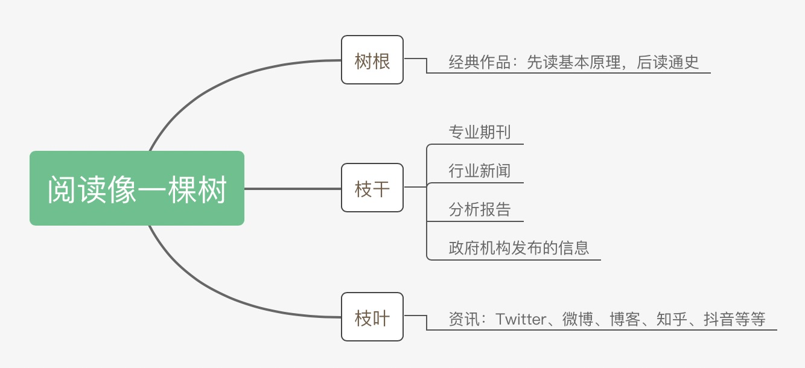
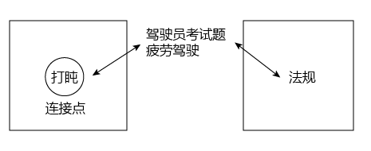

title:: dir 27. 写作, 艺术

-
- {{renderer :tocgen }}
- ---
- 写作
	- 书出语多虚，虚中带有无。却向书前会，放却意中珠.
	  书前:指字外或言外。 看书之人, 不可执着于书中字面意思，而应会得其“言外之意”。 #saying
	- 说诗者，不以文害辞，不以辞害志。以意逆志，是为得之。
	  逆：揣测。 解说诗的人，不要拘于文字而误解词句，也不要拘于词句而误解诗人的本意。要通过自己读作品的感受去推测诗人的本意，这样才能真正读懂诗。 #saying
-
	- 专业思考深度, 和阅读量, 即"输入"高度,  是保证能"输出"的前提. 
	  background-color:: #787f97
		- > 比如, 某高考作文题: "齐桓公、管仲和鲍叔三人你对哪个感触最深？" 我的思路如下：齐桓公任命管仲，起初是遭到了拒绝，齐桓公把他追了回来，这才有了后来的拜相。诸葛亮也是刘备三顾茅庐而来。在我看来，管仲这个人物实际上就是两千多年来中国知识分子理想中想要成为的一个缩影。我会从这一点出发, 来谈中国的“贤臣”梦。这个平台, 明显比单纯就管仲这个人"就事论事", 立意要高得多。
		- 在现今这个内容丰富甚至冗余的时代，**写作的主题越来越同质化，如果没有一个独到的主题，这篇文章很难脱颖而出。所谓独到，就是指作者看到了一些读者没有注意到的东西. 必须要强调你作者自己的思考，利用你的独特观察, 去解释读者没有注意到的东西。**
		- 史蒂芬·平克，在《写作风格的意识》书中说：“**好的写作是作者看到了一些东西，而读者还没注意到。读者的视线经过作者引导, 便能看得见了。**写作的目的是呈现，动机是呈现不偏不倚的真相。当语言与真相连成一线，写作就成功了；而成功的证据，在于简单和准确。"
		-
		- **所以, 学识储备, 和阅读量, 一定是"能写作输出"的首要前提。**
		-
	- 如何更有效率的选书,  来建立你的学识储备?
	  background-color:: #787f97
		- 
		- 树根(即专业理论):  要熟读经典作品 -> 先读基本原理，再读通史
		  background-color:: #264c9b
		  collapsed:: true
			- **经典作品, 就好比树根，它已经帮你筛选好了最佳的养分。你从它身上得到的投资回报率ROI, 是最高的. 因为它可以帮助你迅速找到一条基准线，了解这个领域最基本的观点和概念是什么，然后你就能利用这些观点和方法论, 去解读各种社会现象。**
			- 有人说经典读起来费劲，但如果考虑到最终收益的话，其实这是效率最高的方法。
			- 阅读经典的顺序又是怎样的呢？-> 先读基本原理，再读通史。
			  background-color:: #787f97
				- 政治学, 你就先读迈克尔罗斯金撰写的《政治科学》，这是一本被很多国家的高等院校广泛采用的政治学教科书. 
				  在此基础上，你可以接触该领域的通史类著作，比如政治思想史。
				  有了这两步的沉淀，就能初步应对我们日常写作了。
				-
		- 树干(即理论动态, 数据, 画像): 要读与"你所写内容", 主题相关的内容 -- 专业期刊、行业新闻、分析报告、政府机构发布的信息等.
		  background-color:: #264c9b
		  collapsed:: true
			- 比如, 你想写一篇有关洪水治理的文章，那么你就得块速了解中国治理洪水的历史、手段，利弊, 以及治理过程中的争议。
			-
		- 枝叶(即零散的故事): 主要由资讯,新闻组成。
		  background-color:: #264c9b
		  collapsed:: true
			- 我主要关注时局、法治领域的题材，除了把涉及政治、法律的经典作品几乎全读了之外，还花了很多时间在对"枝干"和"枝叶"的了解上.
			-
	-
	- 建立起只属于你自己的"价值观体系, 方法论架构树"的方法 :
	  background-color:: #787f97
		- 不要对所有的材料, 都是一种阅读模式、一个速度! 阅读要区分成"深度阅读"和"浏览"两种模式。
		  background-color:: #264c9b
			- 深度阅读
			  background-color:: #787f97
			  collapsed:: true
				- 对于经典(树根)，一定要深度阅读。
			- 浏览 -> 5W1H  法
			  background-color:: #787f97
			  collapsed:: true
				- 剩下的大部分阅读材料，其实是浏览。
				- 我拿到一本书，**首先就是看目录**，因为它是整本书的文本架构。进入到正文后，**我们可以根据 5W1H 原则，快速找到一本书的主题和线索，把那些无关的内容跳过去。**
				- 比如一本专著里，作者为了阐述某个观点，他会用很多例子帮助你去理解，但如果你通过其中一个例子就明白了作者的意思，那剩下的例子就没必要再看了。
				- 当你看得越多，眼光也会越敏锐，**你可以快速地发现一篇文章里，哪些是套路，哪些是干货。**
			-
		- 提取出观点, 一定要翻译成自己的话语, 说出来
		  background-color:: #264c9b
			- **首先, 你要明确自己的目的性, 要先提出属于你自己的问题: 作者想解决什么问题? 提到了哪些重要的事实，观点中, 比较重要的部分是什么等等**，写在纸上，等阅读完后自问自答。
		- 融合进你自己的"方法论架构树"中
		  background-color:: #264c9b
			- **新的知识, 理论, 一定和你 1. 已有的"方法论架构树",  2. 你曾经的体验和感悟, 及 3.正在发生的事, 有联系, 即它们的底层逻辑有相同之处. 因为太阳底下没有新鲜事.**
		- 目的(观点), 和手段(表现手法), 两者都要熟练.
		  background-color:: #264c9b
			- 表现手法, 就是如何吸引读者的写作技巧, 心理学技巧. 影响力, 这些心理理论的实际应用.
			- 比如, "对比"就是常见的修辞手法. 它在角色创造中, 也很常用, "性格截然相反的双男主"的设定, 正反角的设定.  对于同一个人物, 也要去寻找他身上一切矛盾或者冲突的心理。
		- 随时记录下你的感悟(价值观上的)和感受(情感上的)
		  background-color:: #264c9b
			- **对于激起你的某种感受 (这其实就是你发现了一种"能调动起读者心理"的表现手法), 把这些感触(和手段方法)记录下来。**当下一次遇到类似的场景时，它就像肌肉记忆一样，条件反射般地出现在你的脑海里了。
			-
	- 好文章, 技巧上的几个关注点:
	  background-color:: #787f97
		- 先确保用词准确(而非词不达意)，再去考率词藻问题
		  background-color:: #264c9b
		  collapsed:: true
			- > 由于腰椎不大好，65 岁的李青很少再出去走动，一天的大多数时刻，他都在床上度过，岁月的皱纹早已**刻满**了他的脸庞。这天一大早，他被屋外嘈杂的声音吵醒，直觉告诉他，外面出事了。出事的地方是成都某处家属院，这还是上世纪建造的，石头已经有些发黑，墙壁上长满了青苔。
			  -> 这段话的问题有: 
			  1. 有很多消息冗余，比如“很少出去走动”和“在床上度过”，表达的是同样的意思.
			  2. “岁月的皱纹”，这样的表达并不恰当. “刻满”这个词语不如“爬满”来得精确.
			  3. “石头有些发黑”指代不清. 哪里的石头?
			-
		- 切忌内容空洞、用词浮夸
		  background-color:: #264c9b
		  collapsed:: true
			- > **寓言**凝聚人类的智慧，闪烁着道义的光华，有聚瑰宝撒珠玑之美，能给人以顿悟般的针砭与启迪。
			  -> 如果我把这句话里的主语换一个，比如勇敢，**勇敢**凝聚人类的智慧，闪烁着道义的光华……
			  发现了吗？完全可以套用。**主要原因就在于这段文字用词模糊、言不及义。**
		-
		- "讲故事"和"传达资讯"的区别
		  background-color:: #264c9b
		  collapsed:: true
			- > 从北京出发，越过山海关，一条东临辽东湾，西依松岭山，长约 180 多公里的辽西走廊，如刀刻般陷入东北腹地。辽宁就坐落在这咽喉之处。60 多年前，为了争夺东北的工业基地，中国共产党数十万军队从这里秘密出关。如今硝烟散尽，年轻劳动力入关成了这里的常态。数据显示，2015 年开始，辽宁也和黑龙江、吉林一样，人口开始净流出。
			- 这段话想表达的主题, 是 “这几年辽宁的经济形势不好，大量年轻劳动力外流”。**但如果只是这样一句话，干巴巴地直接表达主题，那就不叫文章了，那叫资讯。**
			- 通过与历史对比,  人员流动的一进一出，目的是为了制造戏剧性的对比效果。
			-
		- 错误 1：滥用形容词和连词
		  background-color:: #264c9b
		  collapsed:: true
			- adj.
				- 不仅指作者使用的形容词不准确，还指堆砌形容词的现象。
				- adj.用得不准确，就会让你觉得矫揉造作。
				- **不滥用，不是不用，而是要把形容词用精当. 我的基本原则是，想不出来精准的形容词，就不要用。**
			- conj.
				- **连词用得过多，会影响句子的节奏和美感。**
				- > "清风徐来，水波不兴"，这句话就暗含了因果关系. 就没必要写成"因为清风徐来，所以水波不兴".
				- 所以, 除非逻辑表达容易混淆，否则，慎用连词。
		- 误区 2：中文西化
		  background-color:: #264c9b
		  collapsed:: true
			- 中文的习惯表达，是“动词 + 名词”，但受到英语影响，我们把名词倒置。例如，“选购书籍”会写成“书籍的选购”。
			- 这种表达，进而会影响到长句。比如，**中文表达，习惯用人来做主语，但同样受到西方影响，很多人喜欢用抽象名词来做主语。**举个例子，他因为收入减少，不得不改变了生活方式。如果用西化的表达方式，这句话就变成了：收入的减少让他不得不改变了生活方式。这当然算不得错，**但是这会影响中文表达的美感.**
			-
			- 余光中：怎样改进英式中文？——论中文的常态与变态
			  collapsed:: true
				- 中文西化, 造成了中文"**化简为繁、以拙代巧**"的趋势.
				  background-color:: #787f97
					- |简 / 巧|繁 / 拙|
					  |--|--|
					  |因此|基于这个原因|
					  |问题很多|有很多问题存在|
					  |一言难尽|不是一句话就能够说得清楚的|
					  |总而言之|总的来说|
					- 大凡有志于中文创作的人，都不会认为善用四字成语就是创作的能事。写文章而处处仰赖成语，等于只会用古人的脑来想，只会用古人的嘴来说，绝非能人之士。
				-
				- 比起中文来，英文不但富于抽象名词，也喜欢用抽象名词。
				  background-color:: #787f97
					-
					- |西化的说法|正宗中文的说法|
					  |--|--|
					  |英文不但富于抽象名词，也喜欢用抽象名词做主语。|中文的说法是以具体名词，尤其是人，做主语.|
					  |**他的收入的减少**, 改变了他的生活方式|**他因为收入减少**, 而改变生活方式|
				- 中文常用一件事情 (一个短句) 做主词，英文则常用一个名词 (或名词词组)。
				  background-color:: #787f97
					- |西化说法|中文说法|
					  |--|--|
					  |横贯公路的**再度坍方**，是今日的头条新闻|**横贯公路再度坍方**，是今日的头条新闻|
					  |书籍的**选购**，只好委托你了|**选购书籍**，只好委托你了|
				- 英文好用抽象名词，其结果是软化了(v.)动词，即, 把刚多有力的动词, 换成了词组. 例如 press 变成了 apply pressure，动作便一分为二，一半驯化为静止的抽象名词 pressure，一半淡化为广泛而笼统的动词 apply。
					- apply pressure: press
					  give authorization: permit
					  send a communication: write
					  take appropriate action: act
					- 有些学者, 把这类广泛的动词叫做「弱动词」(weak verb)。
					- **中文也呈现出这种病态，喜欢把简单明了的动词分解成「万能动词+抽象名词」的片词。目前最流行的万能动词，是「作出」和「进行」，恶势力之大，几乎要吃掉一半的正规动词。**
					- |弱动词|更有力度的动词|
					  |--|--|
					  |本校的校友, 对社会**作出了(v.)重大的贡献(n.)**。| 本校的校友对社会**贡献(v.)很大。**|
					  | 昨晚的听众, 对访问教授作出了十分热烈的反应。| 昨晚的听众对访问教授, 反应(v.)十分热烈。|
					  |我们对国际贸易的问题, 已经**进行了(v.)详细的研究(n.)**。|我们对国际贸易的问题已经**详加研究(v.)**。|
					  |心理学家, 在老鼠的身上进行试验。|心理学家用老鼠来做试验。(或：心理学家用老鼠试验。)|
					- **现代英文喜欢化简为繁、化动为静、化具体为抽象、化直接为迂回，到了「名词成灾」(noun-plague) 的地步。**
					- **爱用一些「学术化」的抽象名词，好显得客观而精确。有人称之为「伪术语」(pseudo-jargon)。(这在互联网公司中非常普遍: 迭代, 闭环, 等等)**
						- 明明是 first step，却要说成 initial phase,
						  明明是letter，却要说成 communication
						- 中文也是如此。本来可以说「名气」，却凭空造出一个「知名度」来，不说「很有名」，却要迂回作态，貌若高雅，说成「具有很高的知名度」
						- 另一个伪术语是「可读性」。明明可以说「这本传记很动人」，「这本传记引人入胜」，「这本传记很好看」，却要说成「这本传记的可读性颇高」。
						- 同理，「更具前瞻性」难道真比「更有远见」要高雅吗？
						- 此外，「某某主义」之类抽象名词也使用过度.
						- 中国大陆文章很爱说「富于爱国主义的精神」，其实颇有语病。爱国只是单纯的情感，何必学术化为主义？如果爱国也成主义，我们不是也可以说「亲日主义」、「仇美主义」、「怀乡主义」？其次，主义也就是一种精神，不必重复，所以只要说「富于爱国精神」就够了。
						- 红楼梦是中国文学的名著之一。
						  李广乃汉朝名将之一。
						  两句之中。**「之一」都是蛇足。世间万事万物都有其同俦同类，每次提到其一，都要照顾到其它，也未免太周到了。**中国文学名著当然不止一部，汉朝名将当然也不会祇有一人，不加上这死心眼的「之一」，绝对没有人会误会你孤陋寡闻，或者挂一漏万。
						- 「之一」之病到了香港，更变本加厉，成为「其中之一」。
						- 与其说「作为竹林七贤之一的刘伶以嗜酒闻名」，何不平平实实地说「刘伶是竹林七贤之一，以嗜酒闻名」？其实前一句也尽有办法不说「之一」。中文本来可以说「刘伶乃竹林七贤之同侪」；「刘伶列于竹林七贤」.
				-
			-
			- 滥用被字句
				- 比如: 他被升为省长，他不被准许上课.  改成：他升为省长，他未获准上课。
			- 喜欢用弱动词 -- 弱动词（万能动词），如“造成”、”进行“这样的动词.
				- > 飞机失事，**造成**一百多人死亡. <- 这里使用"造成"这个动词, 体现不出动作的美感或生动性。还不如直接写，飞机失事，死了一百多人。
				- > 陈景润对数学问题**进行**了详细的研究. <- 不如直接写: 陈景润对数学问题详加研究.
			- 喜欢用从句
				- 特别是在修饰一个名词的时候，用一个很长的句式来表达。
				- > 被困在家的日子里，我想起了**去年樱花盛开、游客满园的那天**。 <- 啰嗦
				  半天，读者才知道"樱花盛开、游客满园这样的从句"是来描述"那天"的情景，为什么不简练一点，直接写：被困在家的日子里，我想起去年**那天樱花盛开、游客满园**……
		- 误区 3：随意堆砌段落
		  background-color:: #264c9b
		  collapsed:: true
			- 段与段之间, 本身缺乏逻辑顺序的联系时, 需要从 A 内容跳到 B 内容, 如何安排它们? 在两段内容中, 找可以联系起来的节点与节点.
			- 
			- > A 段落：一路上，我给自己定了一些规矩，并尽量遵守。日落后安营扎寨，天一亮就动身出发。中午时分，我通常把车停在路边打个盹。我从不在夜间开车。
			  在中国的公路上，疲劳这个问题甚至出现在驾驶员考试题里。<- 找到一个连接点, 能将a段中的某节点, 链接到b段中的某节点上. 
			  B 段落：手册规定，卡车驾驶员身高至少达到 155 厘米，小轿车驾驶员的身高至少到150 厘米。在中国要取得驾照，每只手上至少有三个手指功能正常，大拇指是必不可少的。
			  
			  那这两个段落作者是怎么联系起来的呢？
			  接着 A 段落的最后一句，我从不在夜间开车。作者继续写道：在中国的公路上，疲劳这个
			  问题甚至出现在驾驶员考试题里。
			  133 题：如果行车达 4 个小时，驾驶员必须停车，并强制休息至少：A.10 分钟；B.20 分
			  钟；C.15 分钟。
			  正确答案是 B。如果你只休息一刻钟，那么缺少五分钟也是违规的，至少规则手册里是这
			  么描述的。
			  接着，作者马上接上了 B 段落第一句，手册规定，卡车驾驶员身高至少达到 155 厘米。
			-
-
	- 如何确定写作主题。你这篇文章想要表达什么，就是抛开观点、故事元素这些枝干之后，用一句话去概括你想表达的主题。
		- **怎么从一个现象或者人物, 拎出来一个好主题, 或者找到一个好的角度呢？-- 你想表达的主题，一定要和某个更大的东西联系起来。这个更大的东西可能是一种情感，比如爱、孤独；也可能是一种观念，比如自由、平等；还可能是一种反思，比如对公共安全的拷问等等。你把思想输出成文章, 要具有价值意义, 其实就是在探讨这个人生共性的更大的东西。-- 如同电影编剧一样, 创作的故事, 要反映人性和困境, 具有现实性意义. **
		- 如何找到这个更大的东西呢？有两种常用的方法。
		- 1.打开宽度：跨领域思考, 发散思维 <- 适用于开放性话题
		  collapsed:: true
			- 谈谈“散装卫生巾”这个话题.
				- 这是一个女性议题。既然是女性议题，那么它的对立面就是男性，那么男性如何看待这个议题，自然而然就形成了一个视角。不过, 这个视角一般人都容易想到.
				- 我们换个角度, 按照政治经济文化这个常见分类来思考:
					- **政治角度。**可以从"政策"的角度去想. 很多地方政府都出台了一些政策，比如 2019 年山东省就出台了《山东省女职工劳动保护办法》，里面提到要为经期女工给予保护。一个政策体现的是官方的态度，所以**我们完全可以来谈谈各地政策，围绕经期女性都提供哪些政策支持，相同在什么地方，不同点在哪。由此，我们可以确定一个主题：地方政策当中经期女工的权利保护。**
					- 经济角度。经济学上重点考虑哪些因素呢? 价格、税收、贫困、经济福利等.
					- 我们先来思考, 为什么会有“散装卫生巾”出现? 对其原因一步步溯源: 是为了降低购买成本吗?  -> 为什么太贵? -> 原因之一: 税收高. 在中国, 卫生巾的征用税率是 13%，这是增值税里最高的一档。 -> 为什么税收高? -> 无法降低的原因是什么?  这些溯源链条上的一个个问题, 其实就构成了一个明确的主题 : 女性摆脱“月经贫困”的阻力在哪？
					- 文化角度。同样先思考, 文化研究中, 有哪些常见的关注点. 
					  其中就包括"女性主义". 如果从这个点切入的话, 我们就可以从"父权制社会"的角度, 来讨论男权社会下的女性议题困境。
					- 还可以从文化禁忌的角度, 来讨论 "月经禁忌".
					- 我常用的方法: 一个热点事件, 在翻看他人的评论之前, 先思考一下, 你自己能想到几个角度? 然后再去看评论, 不同的人的观点，看看哪些自己想到了，哪些没想到。这个方法对"扩充你视角", 帮助非常大.
					-
					-
					-
					-
					-
					-
		- 2.挖掘深度：由表及里 <- 适用于对某一个现象的分析
			- 某高速出口, 老是发生车祸事故. 我们来分析它的原因 : 除了常见原因外. 有一个奇怪的现象 : 既然司机知道车辆失控了，为什么很少有车辆主动开进避险车道，避免事故的发生呢？不断去追溯因果链.
			-
	- 如何为主题搭建一个好的结构
		- 1. 如何为你的文章找到主心骨？
			- 主心骨, 就是用"一句话"来确定文章的主线. 主线不是一个词语，而是一个连贯的句子，这个句子一定能够清晰地概括整篇文章.
			- "主线"(故事剧情)和"主题"(得出的道理), 不是同一个概念。两者相当于"讲事实, 摆道理"的关系.
			  -> 主题(是道理): 一定是和一个更大的东西(对人类有意义的心理需求, 价值观)联系起来的，比如爱、孤独，再比如自由、平等；
			  -> 主线 (是故事): 是概括整篇文章内容的。
			- 《阿甘正传》, 主题是"坚强"，即便你坠入深渊，也要抗击。主线是什么？用一句话概括整部电影的内容就是，“傻子”阿甘，本着说到做到的信念，跨过重重障碍，闯出了一片天空。
			-
		- 2. 怎么在主心骨的基础上长出骨架？
			-
		- 3. 怎么展开骨架？
			-
	-
- ---
- 艺术
	- 官方宣扬的"现实题材"概念，是宣传正能量. 但创作者的"现实题材"理念，是提出现实中的问题。==你要提出问题来引起大家思考、讨论, 改变和进步.==
	- [[dir_电影方法论]]
	-
	-
-