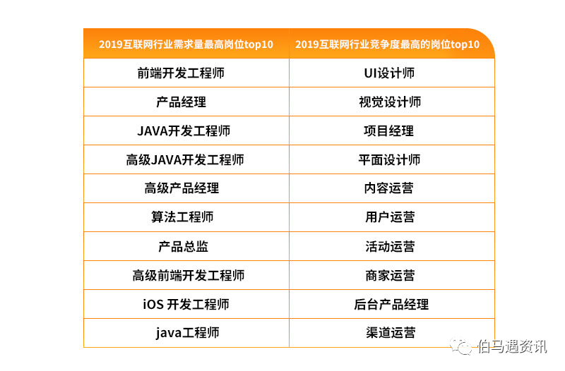

title:: 没有门槛. 没有门槛的事, 恰恰是门槛最大的事. 因为没有门槛就没有护城河

- 有门槛很重要!! **技术不一定形成门槛，但没有技术一定没有门槛。**
- **没有门槛的事, 恰恰是门槛最大的事. 因为没有门槛就没有护城河, 这个领域直接就会变成一片红海.** 直接被淹没, 杀出难度指数级上升变得无与伦比.
	-
	- 2019年互联网行业, 竞争度最高的前10岗位，大多是入行门槛较低的"设计师类", 和各种"运营类"岗位。
	  运营岗不仅就业竞争度高，离职率也高，"运营岗"被普遍认为是门槛较低的的岗位.
	- {:height 293, :width 433}
-