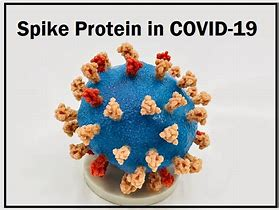
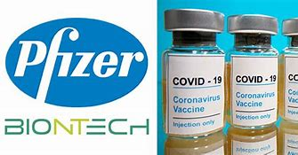
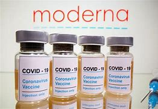

title:: 001 Scientists Raise(v.) Questions about Future Vaccine Strategy

- PURE TEXT
  collapsed:: true
	- #+BEGIN_QUOTE
	  COVID-19 vaccines are saving lives but they cannot stop new versions of coronavirus from appearing. This has led scientists to ask the following questions: Are more shots needed? Should changes be made to existing shots? Or should new vaccines be developed?
	  
	  
	  Dr. Daniel Kuritzkes is infectious disease chief at Brigham & Women’s Hospital. He told The Associated Press, “We need collectively to be rethinking what is the goal of vaccination.”
	  
	  Kuritzkes said, “It’s unrealistic ... to believe that any kind of vaccination is going to protect people from infection, from mild symptomatic disease, forever.” If the goal is preventing serious illness, he added, “we may not need to be doing as much fine-tuning of the vaccines every time a new variant comes.”
	  
	  As the virus changes or mutates, there is no way to know how bad the next variant will be. Already a sub-strain of Omicron with its mutations is spreading.
	  
	  Jennifer Nuzzo of the Johns Hopkins Center for Health Security suggested the immediate solution is getting today’s shots into more arms. This step, she said, will “reduce the opportunities for the virus to mutate…”
	  
	  ---
	  The immune system
	  
	  The job of blocking infection falls to antibodies, which form after either vaccination or getting COVID-19. The antibodies are ready to fight back the next time a person is exposed.
	  
	  But there is a problem: Mutations change the appearance of the spike protein that covers the coronavirus. That is why Omicron was able to break through that first defense. Also, the immune system is not designed to always be on high alert, so the antibodies that fight off infection decrease over time.
	  
	  Thankfully, a part of the immune system called T cells helps prevent an infection from turning into severe illness. The protection T cells offer lasts longer because T cells recognize other parts of the virus that do not mutate as easily.
	  
	  ---
	  Issues with boosters
	  
	  In some countries, people are getting a third shot, and in some cases, a fourth shot, to fight against decreased immunity and new variants. These shots are sometimes called boosters.
	  
	  The booster further strengthened protection against serious illness. But research has shown that protection against symptomatic disease from Omicron is only about 70 percent – not as high as 94 percent against earlier variants.
	  
	  Dr. Paul Offit is a vaccine expert at the Children’s Hospital of Philadelphia. He said that endless boosting just to keep antibody levels high is “not a public health strategy that works.”
	  
	  ---
	  Developing new vaccines
	  
	  Pfizer-BioNTech and Moderna have two of the most effective vaccines against the coronavirus. The drug companies say they are now testing Omicron-specific boosters in some American adults.
	  
	  However, it is not clear if health officials would drop vaccines proven to save lives for new ones in hopes of reducing breakthrough infections. Drug-makers can combine two different kinds of shots, but they would have to prove that the mixture works against the virus.
	  
	  In the United States, the National Institutes of Health is spending about $43 million to develop so-called “pan-coronavirus” vaccines. The hope is to have one vaccine that can protect against more than one kind of coronavirus. Pan means all.
	  
	  One idea is to have the shot send spike proteins from four to eight different versions of the virus rather than one as in today’s vaccines. But NIH infectious diseases chief Dr. Anthony Fauci said it will take some time to develop such a vaccine.
	  
	  Another idea is to create COVID-19 vaccines that can be squirted into the nose. The nasal vaccine can form antibodies ready to fight the virus right where it enters the body. This kind of vaccine is harder to develop than injected vaccines but several companies, including India’s Bharat Biotech, have started research.
	  
	  ---
	  Protection varies around the world
	  
	  The difficulty with any possible change to the vaccination strategy is that only 10 percent of people in some countries have received at least one shot of vaccines.
	  
	  Additionally, some approved vaccines do not provide as much protection against Omicron as those from Pfizer and Moderna. For example, Yale University researchers found no Omicron-targeted antibodies in the blood of people given two shots of China’s Sinovac.
	  
	  It means that any change in vaccination strategy must be dealt with locally.
	  
	  I’m John Russell.
	  
	  And I'm Ashley Thompson.
	  #+END_QUOTE
- ---
-
- COVID-19 vaccines are saving lives /but they cannot stop new versions of coronavirus from appearing. This has led scientists to ask the following questions: Are more shots needed? Should changes be made /to existing(n.) shots? Or should new vaccines be developed?
	- def
		- > ▶ vaccine 疫苗；菌苗
		- > ▶ shot 注射
		- Should changes be made to existing shots? 是否需要对现有的疫苗注射, 进行改进?
- Dr. Daniel Kuritzkes is **infectious(a.) disease** chief /at Brigham & Women’s Hospital. He told The Associated Press, “**We need collectively to be rethinking** what is the goal of vaccination.”
	- def
		- id:: 621c236d-e307-4fd3-823e-60f2e0469dd9
		  > ▶ infectious (a.) an infectious disease can be passed easily from one person to another, especially through the air they breathe 传染性的，感染的（尤指通过呼吸）
		- > ▶ chief  （公司或机构的）首领，头目，最高领导人
		- > ▶ **need to be doing** : 是 need  to do sth 的进行时态, 即一直延续着这种"需要做的行动"
		- > ▶ collectively  adv. 集体地，共同地
- Kuritzkes said, “**It’s unrealistic(a.) ... to believe that** /any kind of vaccination is going to ==protect== people ==from== infection, ==from== **mild symptomatic(a.) disease**, forever.” If the goal is preventing **serious illness**, he added, “we may not **need to be doing** as much fine-tuning(n.) of the vaccines /every time a new variant comes.”
	- def
		- > ▶ unrealistic (a.)not showing or accepting things as they are 不切实际的；不实事求是的
		  -> unrealistic expectations 不切实际的期望
		- id:: 621c290e-3e42-4bb2-b33d-c55a543981e0
		  > ▶ symptomatic  /ˌsɪmptəˈmætɪk/ (a.)~ (of sth) being a sign of an illness or a problem 作为症状的；（有）症状的；作为征候的
		  ->a symptomatic infection 有症状感染
		- > ▶ fine-tune : V-T If you fine-tune(v.) something, you make very small and precise changes to it in order to make it as successful or effective as it possibly can be. 微调
		- > ▶ tune (v.)   /tjuːn/（为乐器）调音，校音 / 调整，调节（发动机）/**~ sth (to sth)** : to prepare or adjust sth so that it is suitable for a particular situation 调整；使协调；使适合
		  ->His speech **was tuned(v.) to** what the audience wanted to hear. 他在演讲中专讲听众爱听的话。
		- 这种认识是不显示的, 即认为疫苗能永远保护人们不受感染. 如果目标是预防严重疾病，“我们可能不需要在每次出现病毒新变种时, 都对疫苗做那么多的微调更新。”
- As 随着  the virus changes or mutates(v.), **there is no way to know** /how bad the next variant(n.) will be. Already **a sub-strain(n.) of Omicron** with its mutations is spreading.
	- def
		- > ▶ mutate  /ˈmjuːteɪt/ (v.)to develop or make sth develop a new form or structure, because of a genetic change （使）变异，突变 / to change into a new form 转变；转换
		  -> mutated genes 发生变异的基因
		- id:: 621c2c52-6719-4f22-8c50-aec038a3a528
		  > ▶ variant /ˈveriəntˌˈværiənt/ (n.)**~ (of/on sth)** a thing that is a slightly different form or type of sth else 变种；变体；变形
		  ->  This game is **a variant of** baseball. 这种运动是由棒球演变而来的。
		- > ▶ sub-strain 亚株
		- id:: 621c2cc7-0a90-45dd-8da1-2a5ac3f477b8
		  > ▶ strain (n.)[ Cusually sing. ] [ C ] a particular type of plant or animal, or of a disease caused by bacteria, etc. （动、植物的）系，品系，品种；（疾病的）类型 
		  / a particular tendency in the character of a person or group, or a quality in their manner 个性特点；性格倾向；禀性 
		  / pressure on sb/sth because they have too much to do or manage, or sth very difficult to deal with; the problems, worry or anxiety that this produces 压力；重负；重压之下出现的问题（或担忧等）
		  -> This is only **one of the many strains** of the disease. 这种病有许多类型，这只是其中之一。
		  -> Their marriage is **under great strain** at the moment. 眼下他们的婚姻关系非常紧张。
		- Omicron的一个亚株及其变种, 已经在扩散。
- Jennifer Nuzzo of **the Johns Hopkins Cente**r for **Health Security(n.)** /suggested /**the immediate(a.) solution** is getting today’s shots(n.) into more arms. This step, she said, will “reduce the opportunities /for the virus to mutate(v.)…”
	- def
		- > ▶ security   /sɪˈkjʊrəti/ (n.)[ U ] the activities involved in protecting a country, building or person against attack, danger, etc. 保护措施；安全工作 /保卫部门；保安部门
		  /protection against sth bad that might happen in the future 担保；保证
		  =>  se-分离 + -cur-关心 + -ity名词词尾
		  -> **the security forces/services** (= the police, army, etc.) 安全部队╱机构
		  -> **financial security** 财务担保
		- > ▶ immediate  (a.)立即的；立刻的 /existing now and needing urgent attention 目前的；当前的；迫切的
		  => im-,不，非，-med,中间，词源同middle,medial.即没有中间环节的，立即的，马上的。
		  -> The hospital says **she's out of immediate danger** . 医院说她眼下已没有危险。
		  -> The prospects for **the immediate future** are good. 短期内前景乐观。
		- 目前的解决办法是, 让更多的人注射疫苗。她说，这一步将“减少病毒变异的机会……”
-
- ## The immune system
- The job of blocking infection **falls to** antibodies, which form(v.) after **either** vaccination **or** getting COVID-19. The antibodies are ready to fight back /the next time a person is exposed.
	- def
		- > ▶ vaccination n. 接种疫苗，种痘
- But there is a problem: Mutations change(v.) the appearance of **the spike protein** that covers the coronavirus. That is why Omicron was able to **break through** that first defense. Also, **the immune system** is not designed to always **be on high alert**, so the antibodies that **fight off infection** /decrease(v.) **over time**.
	- def
		- > ▶ spike [ C ] a thin object with a sharp point, especially a pointed piece of metal, wood, etc. 尖状物；尖头；尖刺 /(v.)用尖物刺入（或扎破）
		- > ▶ protein 蛋白质
		  => proto-,原始的，最早的，-ine,化学名词后缀，氨。后拼写变为protein.
		- > ▶ spike protein
		  {:height 115, :width 161}
		- > ▶ on high alert 处于高级戒备状态, 高度警戒
		- > ▶ fight off 击退 / If you **fight off** something, for example, an illness or an unpleasant feeling, you succeed in getting rid of it and in not letting it overcome you. 摆脱; 抵抗
		- > ▶ over time 随着时间的流逝, 久而久之
		- 但有一个问题: 基因突变, 会改变覆盖着冠状病毒的"刺突蛋白(the spike protein)"的外观。这就是欧米克隆能够突破第一道防线的原因。此外，免疫系统并不总是处于高度警惕状态，因此对抗感染的抗体, 会随着时间的推移而减少。
		-
- Thankfully, a part of **the immune system** called **T cells** /helps ==prevent== an infection ==from== **turning into severe illness**. The protection **T cells** offer(v.) /lasts(v.) longer /because T cells recognize(v.) other parts of the virus **that do not mutate as easily**.
	- def
		- 值得庆幸的是，免疫系统中有一部分叫做T细胞的, 可以帮助防止感染演变成严重的疾病。T细胞提供的保护持续时间更长，因为T细胞能够识别病毒中的其他不容易变异的部分。
-
- ## Issues(n.) with boosters
- In some countries, people are getting a third shot, and in some cases, a fourth shot, to fight against **decreased immunity** and new variants. These shots are sometimes called boosters.
	- def
		- > ▶ issue (n.)[ C ] an important topic that people are discussing or arguing about 重要议题；争论的问题 /（有关某事的）问题，担忧
		  -> **Money is not an issue** . 钱不是问题。
		- > ▶ booster  （尤指政治上的）支持者，拥护者 /**an extra small amount of a drug** that is given to increase(v.) the effect of one given earlier, for example to protect you from a disease for longer 加强剂量 /帮助（或激励、改善）…的事物
		  -> a tetanus booster 破伤风加强剂
		  -> a morale/confidence booster 士气╱信心的激励
		- > ▶ decrease (v.)/dɪˈkriːs/  **~ (from sth) (to sth)** to become or make sth become smaller in size, number, etc. （使大小、数量等）减少，减小，降低
		  => de-, 向下。-cre, 创造，增加，词源同create, crescent.
		  -> The number of new students **decreased from 210 to 160** this year. 今年新生人数从210减少到160。
		- 在一些国家，人们正在接受第三次注射，在一些情况下，还有第四次注射，以对抗免疫力的下降, 和新的变异病毒。这些注射有时被称为加强针。
- The booster **further strengthened(v.) protection against** serious illness. But **research has shown that** /protection against **symptomatic disease** from Omicron /is only about 70 percent – **not as high as** 94 percent against earlier variants.
	- def
		- > ▶ strengthen (v.)加强；增强；巩固
		- ((621c290e-3e42-4bb2-b33d-c55a543981e0))
		- 加强针对 Omicron 引起的感染症状 的防护效力, 只有70%, 而远远不如对早期毒株的94%那么高.
- Dr. Paul Offit is **a vaccine expert** at the Children’s Hospital of Philadelphia. He said that /endless boosting **just to** keep antibody levels high /is “not **a public health strategy** that works.”
	- def
		- 无休止打加强针, 只是为了让抗体维持在一个高水准，这“不是一个有效的公共卫生策略”。
-
- ## Developing(v.) new vaccines
- **Pfizer-BioNTech and Moderna** have two of **the most effective vaccines** against the coronavirus. The drug companies say /they are now testing **Omicron-specific boosters(n.)** in some American adults.
	- def
		- > ▶ Pfizer [ˈfaɪzər] n. 辉瑞（美国制药公司）
		  {:height 102, :width 170}
		- >  Moderna
		  {:height 100, :width 178}
		- > ▶ specific (a.)~ to sth ( formal ) existing only in one place or limited to one thing 特有的；独特的 /特定的
		  /detailed and exact 明确的；具体的
		  -> The money was collected for **a specific purpose**. 这笔钱是为一个特定用途而收的。
- However, it is not clear /if health officials **would drop(v.) vaccines** proven to save lives for new ones /**in hopes of** reducing(v.) **breakthrough infections**. Drug-makers can combine(v.) two different kinds of shots, but they would have to prove that /the mixture works(v.) against the virus.
	- def
		- > ▶ drop (v.)to stop doing or discussing sth; to not continue with sth 停止；终止；放弃
		  -> Look, **can we just drop it** (= stop talking about it) ? 喂，这事儿能不能就谈到这儿？
		  -> The police decided **to drop the charges against her**. 警方决定撤回对她的指控。
		- > ▶ breakthrough (n.)重大进展；突破
		- > ▶ breakthrough infection : “突破感染”（breakthrough infections）指病原体突破了疫苗防线，导致完成疫苗接种的人, 感染了疫苗本该预防的疾病。
		- 然而，目前尚不清楚, 卫生官员是否会放弃已被证明可以拯救生命的疫苗，以希望减少"突破性感染"。制药商可以将两种不同的疫苗混合使用，但他们必须证明这种混合物对病毒有效。
- In the United States, **the National Institutes of Health** is spending about $43 million to develop so-called **“pan-coronavirus” vaccines**. The hope is to have one vaccine that can protect against more than one kind of coronavirus. Pan means all.
	- def
		- > ▶ Institute :  (n.)**an organization** that has a particular purpose, especially one **that is connected with education or a particular profession**; the building used by this organization （教育、专业等）机构，机构建筑
		  => in-,进入，使，-stit,站立，词源同stand,state.即使站立，引申词义建立，制定，建立的组织机构等。
		  -> a research institute 研究所
		- the National Institutes of Health 美国国立卫生研究院
		  {:height 97, :width 202}
		- > ▶ pan- 表示“广泛的”
		  -> pan-American 泛美的
		  -> pandemic　大范围流行的(pan+dem人民+in→人民广泛〔染病〕→广为流行的)
- One idea is **to have** the shot **send** spike proteins **from four to eight** different versions of the virus /**rather than** one /as in today’s vaccines. But NIH **infectious diseases chief** Dr. Anthony Fauci said /**it will take some time** to develop such a vaccine.
	- def
		- 一种想法是, 让疫苗从4到8个不同版本的病毒中发送刺突蛋白，而不是像现在的疫苗那样, 只能发送一个。但是美国国立卫生研究院的 传染病科主任安东尼·福奇博士说，开发这样的疫苗需要一些时间。
- Another idea is to create COVID-19 vaccines **that can be squirted(v.) into the nose**. The **nasal(a.) vaccine** can form(v.) antibodies **ready to** fight the virus /right where it enters the body. This kind of vaccine is harder to develop than **injected vaccines** /but several companies, including India’s Bharat Biotech, have started research.
	- def
		- > ▶ squirt (v.)（使）喷射；喷 /**~ sb/sth (with sth)** to hit sb/sth with a stream of water, gas, etc. （用…）向…喷射
		  => 来自拟声词根 squ-,挤，压，模仿挤压湿物体时发出的吧唧声。
		  -> I desperately **squirted water on the flames**. 我拼命朝火上喷水。
		- > ▶ nasal  /ˈneɪzl/  (a.)connected with the nose 鼻的；与鼻子相关的
		  =>  -nas-鼻 + -al形容词词尾\
		  -> **the nasal passages** 鼻道
		  -> a nasal spray 鼻腔喷剂
-
- ## Protection varies around the world
- The difficulty with **any possible change** to **the vaccination strategy** is that /only **10 percent of people** in some countries /have received at least one shot of vaccines.
	- def
		- 世界各地的保护措施, 各不相同
		- 要想对"疫苗策略"做任何可能的改变, 其困难之处在于...
- Additionally, some **approved vaccines** do not provide(v.) ==as much== protection against Omicron ==as== those from Pfizer and Moderna. For example, Yale University researchers found(v.) no **Omicron-targeted antibodies** in the blood of people given two shots of China’s Sinovac.
	- def
		- > Sinovac 北京科兴; 科兴生物
		- 此外，一些获得批准的疫苗, 对欧米克隆的保护效力, 不如辉瑞和Moderna的疫苗。例如，耶鲁大学(Yale University)的研究人员发现，在两次注射中国科兴公司(Sinovac)疫苗的人的血液中，没有发现欧米克隆靶向抗体。
- It means that /any change in vaccination strategy **must be dealt with locally**.
- I’m John Russell.
- And I'm Ashley Thompson.
- Lauran Neergaard reported(v.) on this story for the Associated Press. John Russell adapted it for Learning English.
- How well do you understand the story?
	- def
		- > ▶ associated (a.)if one thing **is associated(a.) with** another, the two things are connected because they happen together or one thing causes the other 有关联的；相关的 /有联系的 
		  / Associated （用于联合企业的名称）联合的
		  -> Salaries and **associated costs** have risen substantially. 薪金与相关费用大大增加。
		  -> Associated Newspapers 联合报业
		- > Associated Press ( abbr. AP ) a US news service. Its offices throughout the world send news to its members /which include newspapers and television and radio stations. （美国）联合通讯社；美联社
		  {:height 100, :width 160}
		-
- ---
- ## Words in This Story
- symptomatic -- adj. medical showing that a particular disease is present; relating to or showing symptoms of a disease
- fine-tune -- v. to make small changes to (something) /in order to improve the way it works /or to make it exactly right
- strain -- n. a group of closely related plants, bacteria, or animals
- strategy -- n. a careful plan or method /for achieving a particular goal /usually over a long period of time
-