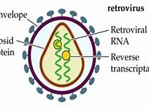

-
- PURE TEXT
  collapsed:: true
	- #+BEGIN_QUOTE
	  A patient in the United States with the disease leukemia has become the first woman to be cured of HIV, the virus that causes AIDS.
	  
	  
	  The patient received stem cells from a donor. Stem cells are special cells that can become any kind of cell in the body. The donor was naturally resistant to HIV, researchers told reporters Tuesday.
	  
	  The woman has been described as a 64-year-old woman of mixed race. Her case was presented at the Conference on Retroviruses and Opportunistic Infections in Denver, Colorado.
	  
	  It is the first case involving the use of blood from the umbilical cord. The umbilical cord connects a pregnant mother to her fetus. Use of umbilical blood is a somewhat new method. Doctors are considering making the treatment available to more people.
	  
	  The woman had been receiving the umbilical cord blood to treat her leukemia. Leukemia is a cancer that starts in blood-forming cells in bones. Since receiving the treatment, the woman has been in remission. She has been free of HIV for 14 months. She has not needed HIV treatments known as antiretroviral therapy.
	  
	  The two earlier cases in which patients were cured happened in males who had received adult stem cells. Adult stem cells are often used in bone marrow transplants.
	  
	  "This is now the third report of a cure in this setting, and the first in a woman living with HIV," said Sharon Lewin in a statement. She is soon to be the head of the International AIDS Society.
	  
	  The woman’s case is part of a larger study led by Dr. Yvonne Bryson of the University of California Los Angeles, and Dr. Deborah Persaud of Johns Hopkins University in Baltimore, Maryland. It is being financially supported by the U.S. government.
	  
	  The study aims to follow 25 people with HIV who receive a transplant with stem cells taken from umbilical cord blood for the treatment of cancer and other serious conditions.
	  
	  Patients in the study first receive treatment to destroy cancerous cells. Doctors then transplant stem cells from individuals with a genetic mutation which makes them resistant to HIV. Scientists believe the patients receiving the transplant will develop an immune system resistant to HIV.
	  
	  Lewin said bone marrow transplants do not cure most people living with HIV. But she said the report "confirms that a cure for HIV is possible and further strengthens using gene therapy” as an effective way to cure HIV.
	  
	  The study suggests that an important part of the treatment’s success was using HIV-resistant cells.
	  
	  "Taken together, these three cases of a cure post stem cell transplant all help” in discovering the parts of the transplant that were important to a cure, Lewin said.
	  
	  I’m Dan Novak.
	  
	  Dan Novak adapted this for VOA Learning English from reporting by Reuters.
	  
	  ---
	  Words in This Story
	  donor — n. a person who gives something (such as blood or a body organ) so that it can be given to someone who needs it
	  
	  umbilical cord — n. a long, narrow tube that connects an unborn baby to the placenta of its mother
	  
	  remission — n. a period of time during a serious illness when the patient's health improves
	  
	  transplant— v.(medical) to perform a medical operation in which an organ or other part that has been removed from the body of one person is put into the body of another person
	  
	  mutation –n. a change in the genes of a plant or animal that causes a different quality to be recognized
	  
	  immune system –n. the system that protects the body from disease and infections
	  #+END_QUOTE
- ---
- A patient in **the United States** with **the disease leukemia** /has become the first woman **to be cured(v.) of HIV**, the virus that causes AIDS.
	- def
		- > ▶ leukemia = leukaemia /luːˈkiːmiə/ n. [内科][肿瘤] 白血病 N-UNCOUNT Leukaemia is a disease of the blood in which the body produces too many white blood cells. 白血病
		  => 来自 leuk- + em- + -ia，词根 leuk- 表示“白(white)”，同根词light, leukocyte(白细胞、血白球)；词根 em- 表示“血(blood)”，其变体形式为 hem- / haem-，同根词anemia(贫血症)；后缀 -ia 表示疾病，如hemophilia（血友病）。
		- > ▶ cure (v.)~ sb (of sth) : to make a person or an animal healthy again after an illness 治愈，治好（病人或动物）
- The patient received **stem cells** from a donor. Stem cells are special cells that can become any kind of cell in the body. The donor **was naturally resistant(a.) to** HIV, researchers told reporters Tuesday.
	- def
		- > ▶ stem cell : a basic type of cell which can divide and develop into cells with particular functions. All the different kinds of cells in the human body develop from stem cells . 干细胞
		- id:: 621c4ec3-13bc-4edf-ad31-377d824ab076
		  > ▶ donor 捐赠者；捐赠机构
		  => 捐赠者；捐赠机构
- The woman has been described as a 64-year-old woman of **mixed race**. Her case was presented(v.) at the Conference on **Retroviruses** and **Opportunistic Infections** in Denver, Colorado.
	- def
		- > ▶ conference （通常持续几天的大型正式）会议，研讨会
		  => con-一起 + -fer-携带,拿取 + -ence名词词尾 → 把意见等拿到一起来 → 会议
		- > ▶ retrovirus /ˈretroʊ-vaɪrəs/ N any of several viruses whose genetic specification is encoded in RNA rather than DNA and that are able to reverse the normal flow of genetic information from DNA to RNA by transcribing RNA into DNA: many retroviruses are known to cause cancer in animals 逆转录酶病毒
		  => 改写自 retravirus,缩写自 reverse transcriptase virus.
		  逆转录病毒（Retrovirus），又称反转录病毒，属于RNA病毒中的一类，它们的遗传信息不是储存在脱氧核糖核酸（DNA），而是储存在核糖核酸（RNA）上。逆转录病毒基因组为二倍体，两条相同的单股正链RNA.
		  
		- > ▶ opportunistic  /ˌɑːpərtuːˈnɪstɪk/ ADJ If you describe someone's behaviour as opportunistic, you are critical of them because **they take advantage of situations in order to gain money or power, without thinking about whether their actions are right or wrong**. 机会主义的
		  -> Many of the party's members joined **only for opportunistic reasons**. 
		   这个政党的许多成员入党纯粹是出于投机。
		- > ▶ Opportunistic Infections 机会性感染, 伺机性感染
		  "机会性感染"是指一些致病力较弱的病原体，在人体免疫功能正常时不能致病，但当人体免疫功能降低时，它们乘虚而入，侵入人体内，导致各种疾病。 正常菌群在机体免疫功能低下，寄居部位改变, 或菌群失调等特定条件下, 引起的感染, 称为"机会性感染"。
		- > ▶ Denver 丹佛（地名，美国城市）
		  {:height 123, :width 148}
		- 这名女子被描述是为一名64岁的混血儿。她的病例, 是在科罗拉多州丹佛市 举行的"逆转录病毒和机会性感染"会议上提出的。
- **It is the first case** involving the use of blood from **the umbilical cord**. The umbilical cord ==connects== a pregnant mother ==to== her fetus. Use of **umbilical blood** /is a somewhat new method. Doctors are considering /making the treatment **available to** more people.
	- def
		- > ▶ umbilical /ʌmˈbɪlɪkl/ ADJ of, relating to, or resembling the umbilicus or the umbilical cord (似)脐带的
		- > ▶ cord (n.)[ UC ] strong thick string or thin rope; a piece of this （结实的）粗线，细绳；一根粗线（或细绳）
		  -> a piece/length of cord 一根╱一段粗线
		  ->  **umbilical cord** 脐带
		- > ▶ fetus = foetus /ˈfitəs/ 胎儿；胎
		- 这是首例使用脐带血的案例。
- The woman had been receiving **the umbilical cord blood** to treat her leukemia. Leukemia is a cancer /that starts in **blood-forming cells** in bones. Since receiving the treatment, the woman has been **in remission**. She has been **free(a.) of** HIV for 14 months. She has not needed **HIV treatments** known as **antiretroviral(a.) therapy**.
	- def
		- 白血病, 是一种始于骨骼中的造血细胞的癌症。
		- > ▶ remission (n.) a period during which a serious illness improves for a time and the patient seems to get better （重病的）缓解期，减轻期 /( formal ) an act of reducing or cancelling the amount of money that sb has to pay （应付费用的）减少，免除
		  -> The symptoms reappeared **after only a short remission**. 短暂的康复之后，症状再次出现。
		  -> New businesses may qualify for **tax remission**. 新的企业可以有资格享受税收减免。
		- id:: 621c54f2-542c-4aeb-8c82-d00a74a321e7
		  > ▶ **free (a.) ~ from/of sth** : not containing or affected by sth harmful or unpleasant 不含有害物的；不受…伤害（或影响等的）
		  -> **free from difficulty/doubt/fear** 没有困难；不怀疑╱害怕
		- > ▶ antiretroviral  /ˌæntiˌretroʊˈvaɪrəl/  adj. 抗逆转录病毒的
		- > ▶ therapy /ˈθerəpi/ [ UC ] the treatment of a physical problem or an illness 治疗；疗法
		  -> **alternative/complementary/natural therapies** (= treatments that do not use traditional drugs) 替代╱补充╱自然疗法
- The two earlier cases /in which patients were cured /happened in males who had received **adult stem cells**. Adult stem cells are often used **in bone marrow transplants**.
	- def
		- > ▶ marrow /ˈmæroʊ/ N-SING The marrow of something is the most important and basic part of it. 精华; 精髓; 核心
		  => 来自古英语mearg,来自Proto-Germanic*mazga,来自PIE*mozgo,骨髓。后引申词义精髓。西葫芦义词源不详。
		  -> **bone marrow** 骨髓
		  -> **spinal marrow** 脊髓, 骨髓
		- > ▶ **transplant (v.)~ sth (from sb/sth) (into sb/sth)** : to take an organ, skin, etc. from one person, animal, part of the body, etc. and put it into or onto another 移植（器官、皮肤等）
		  /**~ sb/sth (from...) (to...)** ( formal ) to move sb/sth to a different place or environment 使迁移；使移居
-
- "This is now **the third report of a cure** in this setting, and the first in a woman **living with HIV**," said **Sharon Lewin** in a statement. She is soon to be **the head** of **the International AIDS Society**.
	- > ▶ setting (n.)a set of surroundings; the place at which sth happens 环境；背景
	  -> **It was the perfect setting** for a wonderful Christmas. 环境气氛无可挑剔，正是一个美好的圣诞节所需要的。
	- > ▶ statement [ C ] ~ (on/about sth) a formal or official account of facts or opinions 声明；陈述；报告
- **The woman’s case** is part of **a larger study** led by Dr. Yvonne Bryson of **the University of California Los Angeles**, and Dr. Deborah Persaud of **Johns Hopkins University** in Baltimore, Maryland. **It is being financially supported by** the U.S. government.
	- 这名女性的病例, 是...领导的一项更大规模研究的一部分。它得到了美国政府的持续财政支持。
- The study aims(v.) to follow **25 people with HIV** /who receive **a transplant with stem cells** /taken from **umbilical cord blood** /for the treatment of **cancer** and **other serious conditions**.
	- id:: 621c59c0-b2b1-48d9-9ee3-2a4ba3041143
	  > ▶ condition [ C ] an illness or a medical problem that you have for a long time because it is not possible to cure it （因不可能治愈而长期患有的）疾病
	  -> **a medical condition** 疾病
	  -> He suffers from **a serious heart condition** . 他患有严重的心脏病。
	- 这项研究, 目的是跟踪25名艾滋病毒感染者，他们接受了从脐带血中提取的干细胞移植，以治疗癌症和其他严重疾病。
- Patients in the study `谓` first receive **treatment to destroy cancerous(a.) cells**. Doctors then **transplant(v.) stem cells** from individuals **with a genetic mutation** /which makes them **resistant(a.) to** HIV. Scientists believe `主` the patients receiving the transplant `谓` will develop **an immune system** resistant(a.) to HIV.
	- def
		- > ▶ cancerous  ADJ Cancerous cells or growths are cells or growths **that are the result of cancer**. 癌的
- Lewin said **bone marrow transplants** do not cure(v.) most people living with HIV. But she said `主` the report `谓` "confirms that **a cure for HIV is possible** /and further strengthens(v.) using **gene therapy**” as an effective way to cure HIV.
	- > ▶ confirm (v.)to state or show that sth is definitely true or correct, especially by providing evidence （尤指提供证据来）证实，证明，确认
	  -> Rumours of **job losses** were later confirmed. 裁员的传言后来得到了证实。
- The study suggests that /`主` **an important part** of **the treatment’s success** `系` was using **HIV-resistant cells**.
- "**Taken together**, `主` these **three cases of a cure** /`谓` post(v.) **stem cell transplant** all help” /in discovering **the parts of the transplant** that were important to a cure, Lewin said.
	- > ▶ Taken together 一并考虑合起来
	- > ▶ post (v.)发布，公布，宣布（尤指财经信息或警告） /[ VN ] [ often passive ] to put a notice, etc. in a public place so that people can see it 张贴；公布
	  -> The results will be posted on the Internet. 结果将在互联网上公布。
	- 综合起来看，这三个干细胞移植后治愈的案例, 都有助于发现对治愈至关重要的移植部位。
- I’m Dan Novak.
- Dan Novak ==adapted==(v.) this ==for== **VOA Learning English** from **reporting by Reuters**.
	- > ▶ **adapt (v.)~ sth (for sth)** to change sth in order to make it suitable for a new use or situation 使适应，使适合（新用途、新情况）
	  -> Most of these tools **have been specially adapted for use by disabled people.** 这些工具多数已经过特别改装，供残疾人使用。
	-
- ---
- ## Words in This Story
- donor — n. a person who gives something (such as blood or a body organ) so that it can be given to someone who needs it
- umbilical cord — n. a long, narrow tube that connects an unborn baby to the placenta of its mother
- remission — n. a period of time during a serious illness when the patient's health improves
- transplant— v.(medical) to perform a medical operation in which an organ or other part that has been removed from the body of one person is put into the body of another person
- mutation –n. a change in the genes of a plant or animal that causes a different quality to be recognized
- immune system –n. the system that protects the body from disease and infections
-