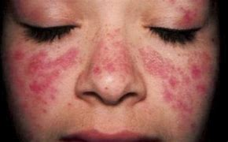
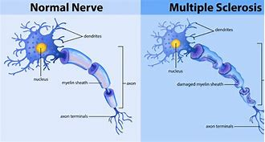

-
- PURE TEXT
  collapsed:: true
	- #+BEGIN_QUOTE
	  It has been more than one year since Rebekah Hogan got COVID-19. She still suffers from pain and tiredness. She struggles with thinking and remembering. Her condition makes her unable to do her nursing job or do normal household activities.
	  
	  
	  Hogan’s husband and three children also have signs of the condition. The family lives in Latham, New York.
	  
	  Her experience with COVID-19 has her questioning her worth as a wife and mother.
	  
	  “Is this permanent? Is this the new norm?” said the 41-year-old Hogan. “I want my life back.”
	  
	  There are estimates that more than one-third of people infected with COVID-19 will develop long-lasting problems. Scientists are trying to understand the cause of so-called “long COVID” and find treatments for it.
	  
	  It is too soon to know whether people infected with the fast-spreading Omicron variant will develop mysterious symptoms. Signs of long COVID usually appear weeks after first getting sick. But some experts think a wave of long COVID is likely. And they say doctors need to be prepared for it.
	  
	  The U.S. National Institutes of Health is carrying out research on the condition, with the help of the $1 billion it received from Congress. Medical centers for studying long COVID are appearing around the world. Such centers have connections with places like Stanford University in California and University College London.
	  
	  == Why does it happen?
	  
	  Scientists have different theories for why long COVID happens. Support is building around a few of the major theories.
	  
	  One theory is that a small amount of the virus stays in the body long past the illness. This causes inflammation that leads to long COVID.
	  
	  Another theory says that inactive viruses in the body are reactivated. A recent study that appeared in the publication Cell pointed to Epstein-Barr in the blood as one of four possible risk factors. Epstein-Barr is a virus that causes mononucleosis – a disease that makes people very tired and weak for a long time.
	  
	  The study’s findings must be confirmed by more research.
	  
	  A third theory is that autoimmune reactions develop after severe COVID-19. In a normal immune reaction, viral infections activate antibodies that fight virus proteins. But sometimes, antibodies mistakenly attack normal cells. This action is thought to play a part in autoimmune diseases such as lupus and multiple sclerosis.
	  
	  Another possibility is that very small blood clots in the blood play a part in long COVID. Many COVID-19 patients develop high levels of inflammatory molecules that can lead to abnormal clotting.
	  
	  In her laboratory at Stellenbosch University in South Africa, scientist Resia Pretorius has found small clots in blood samples from patients with COVID-19 and in those who later developed long COVID. She also found high levels of protein in blood plasma that prevented the normal breakdown of these clots.
	  
	  Pretorius believes that these clotting abnormalities continue in many patients after a coronavirus infection. She also believes they reduce oxygen going to cells and tissue throughout the body. This lack of oxygen can cause many of the symptoms linked to long COVID.
	  
	  == It can affect nearly anyone
	  
	  A full list of symptoms that make up long COVID does not exist. The most common ones are tiredness, problems with memory and thinking, loss of taste and smell. Also included are shortness of breath, sleep problems and mental health issues.
	  
	  Long COVID affects adults of all ages as well as children. Research shows it is more common among those who were hospitalized, but it also affects those who were not. It is more common among women.
	  
	  Jacki Graham’s experience with COVID-19 at the beginning of the pandemic was not bad enough to put her in the hospital. But months later, the 64-year-old experienced breathlessness and a racing heart. She could not taste or smell. Her blood pressure increased.
	  
	  In the fall of 2020, she started becoming so tired that her morning exercise would send her back to bed.
	  
	  “Six months ago, I would have told you COVID has ruined my life,” Graham said.
	  
	  Hogan, the New York nurse, also did not go to the hospital with COVID-19. But she has struggled since the infection.
	  
	  Hogan’s doctors think autoimmune problems and a pre-existing connective tissue disorder may have made her likely to develop the condition.
	  
	  == Possible answers
	  
	  There are no treatments approved for long COVID. Some patients, however, see improvements from painkillers, drugs used for other conditions, and physical therapy. But more help may come soon.
	  
	  Immunobiologist Akiko Iwasaki is studying the possibility that COVID-19 vaccination might reduce long COVID symptoms. Her team at Yale University in Connecticut is working with a patient group called Survivor Corps. Their research involves vaccinating unvaccinated long COVID patients as a possible treatment.
	  
	  Two recently released studies offer early evidence that being vaccinated before getting COVID-19 could help prevent long COVID, or at least reduce its severity. Both studies were done before the Omicron version of the new coronavirus appeared.
	  
	  I’m Ashley Thompson.
	  
	  And I'm Mario Ritter, Jr.
	  
	  The Associated Press reported this story. Ashley Thompson adapted it for VOA Learning English.
	  
	  We want to hear from you. Write to us in the Comments section, and visit our Facebook page.
	  
	  ____________________________________________________________________
	  
	  Words in This Story
	  symptoms –n. (pl.) changes in the body or mind that shows that a disease is present
	  
	  inflammation –n. a condition in which a part of your body becomes red, bigger than normal and painful
	  
	  risk factor –n. something that increases risk; a condition that makes it more likely that a person might get a disease
	  
	  autoimmune –adj. relating to antibodies or cells that attack molecules, cells or tissue that is healthy
	  
	  blood clot –n. a mass of dried blood that stops the flow of blood in the body and that can cause serious health problems
	  
	  plasma –n. the part of blood that is a clear fluid which holds red blood cells and other parts found in the blood
	  
	  immunobiologist –n. a biologist who studies how living things fight infection
	  #+END_QUOTE
- ---
- It has been more than one year since Rebekah Hogan got COVID-19. She still suffers from pain and tiredness. She struggles with thinking and remembering. Her condition makes her unable to do her **nursing job** or do normal **household activities**.
	- > ▶ tiredness n. 疲劳；疲倦
	- > ▶ household: all the people living together in a house 一家人；家庭；同住一所房子的人
- Hogan’s husband and three children also have **signs of the condition**. The family lives in Latham, New York.
	- ((621c59c0-b2b1-48d9-9ee3-2a4ba3041143))
- Her experience with COVID-19 `谓` has her questioning(v.) her worth as a wife and mother.
- “Is this permanent? **Is this the new norm**?” said the 41-year-old Hogan. “I want my life back.”
	- 她与COVID-19的经历让她质疑自己作为妻子和母亲的价值。
	- > ▶ norm (n.)( often **the norm** ) [ sing. ] a situation or a pattern of behaviour that is usual or expected 常态；正常行为
	  -> **a departure from the norm** 一反常态
- There are estimates that /more than one-third of people infected with COVID-19 /will develop long-lasting problems. Scientists are trying to understand the cause of so-called “long COVID” /and find treatments for it.
	- id:: 621c6c24-88c1-4f72-b750-4434d90e3f0a
	  > ▶ cause 原因；起因
- **It is too soon to know** whether people infected with the fast-spreading Omicron variant will develop mysterious symptoms. Signs of long COVID usually appear(v.) weeks after first getting sick. But some experts think a wave of long COVID is likely. And they say doctors need to be prepared for it.
	- ((621c2c52-6719-4f22-8c50-aec038a3a528))
- The U.S. National Institutes of Health **is carrying out research** on the condition, with the help of **the $1 billion** it received from Congress. Medical centers for studying long COVID are appearing around the world. Such centers **have connections with** places like **Stanford University in California** and **University College London**.
	- > **CARRY STH OUT** 履行；实施；执行；落实 /to do and complete a task 完成（任务）
	  -> to carry out a promise/a threat/a plan/an order 把承诺╱威胁╱计划╱命令付诸行动
	- > ▶ congress 代表大会 /国会，议会
	  =>  con-共同 + -gress-步,级 → 走到一起来
	- > ▶ university （综合性）大学；高等学府
	- > ▶ University College London 伦敦大学学院
	  伦敦大学学院始建于1826年2月11日，最初的名字是”伦敦大学“（London University）。鉴于当时英格兰仅有的两所大学——牛津大学和剑桥大学, 都是严格意义上的教会学校，伦敦大学学院立意成为带有宗教性质的大学之外的世俗选择。伦敦大学学院从一开始就是作为一所综合性大学来被创办和发展的，而不是单纯的学院或研究机构。
-
- ## Why does it happen?
- Scientists **have different theories for** why long COVID happens. Support **is building around** a few of the major theories.
- One theory is that /a small amount of the virus stays in the body /long past the illness. **This causes inflammation** that leads to long COVID.
	- > ▶ inflammation  [ UC ] a condition in which a part of the body becomes red, sore and swollen because of infection or injury 发炎；炎症
- Another theory says that /**inactive(a.) viruses** in the body are reactivated. `主` A recent study /that appeared in **the publication Cell** /`谓` **pointed to** Epstein-Barr in the blood **as** one of four possible **risk factors**. Epstein-Barr is a virus that causes mononucleosis – a disease that makes people very tired and weak for a long time.
	- > ▶ inactive (a.)not doing anything; not active 无行动的；不活动的；不活跃的 /not in use; not working 未使用的；不运转的
	  -> The volcano has been inactive(a.) for 50 years. 这座火山处于休眠状态50年了。
	- > ▶ reactivate (v.)[ VN ] to make sth start working or happening again after a period of time 使恢复活动；使重新出现
	- > ▶ the publication Cell 《细胞》(Cell)杂志
	- > ▶  Epstein-Barr : EB 病毒. 是疱疹病毒家族中八种已知的人类疱疹病毒之一，也是人类最常见的致病病毒之一。
	- > ▶ risk factor 危险因素,风险因素,影响因素
	- id:: 621c718b-f5ce-4658-8cdb-744b7edfa175
	  > ▶ mononucleosis  = glandular fever   /ˌmɑːnoʊˌnuːkliˈoʊsɪs/ N-UNCOUNT Mononucleosis is a disease which causes swollen glands, fever, and a sore throat. 单核细胞增多症; 腺热
	  => 来自mononuclear,单核细胞，-osis,疾病症状。
	  单核细胞增多症（Infectious mononucleosis）是由EBV病毒（一种接触传染性病毒，Epstein-Barr virus）所致的急性自限性传染病。
- The study’s findings(n.) must be confirmed by more research.
- A third theory is that /**autoimmune(a.) reactions** develop(v.) after severe COVID-19. In a normal **immune reaction**, **viral(a.) infections** activate(v.) antibodies that fight(v.) **virus proteins**. But sometimes, antibodies mistakenly attack(v.) normal cells. This action is thought **to play a part in** **autoimmune diseases** such as **lupus** and **multiple sclerosis**.
	- > ▶ autoimmune :  /ˌɔːtoʊɪˈmjuːn/  ADJ Autoimmune describes medical conditions in which normal cells are attacked by the body's immune system. 自体免疫的
	  -> ...**autoimmune diseases** such as **rheumatoid arthritis**. 
	   ...自体免疫疾病，如类风湿性关节炎。
	- > ▶ viral :  /ˈvaɪrəl/ ADJ A viral disease or infection is caused by a virus. 病毒性的
	- > ▶ lupus  /ˈluːpəs/  N any of various ulcerative skin diseases 狼疮
	  => 来自拉丁语lupus,狼，词源同wolf.因这种病的症状如同被狼咬过而得名。
	  红斑狼疮是一类慢性、反复发作的自身免疫性疾病的总称，常见于育龄期女性。红斑狼疮最具特征性的症状为面颊部出现蝶形红斑，而“狼疮”的名字正是因为过去人们认为该病的面部红斑表现，像是被狼咬伤所致。而除皮肤损害以外，红斑狼疮的病变还可累及多脏器和系统。
	  {:height 74, :width 114}
	- id:: 621c73e2-1f57-4d44-885d-42576ef47b22
	  > ▶ sclerosis  /skləˈroʊsɪs/ N-UNCOUNT Sclerosis is a medical condition in which a part inside your body becomes hard. 硬化症
	  => sclero-,硬的，-osis,表疾病症状。引申词义软组织硬化症
	- id:: 621c73f7-2139-440b-9afc-0c978926e96b
	  > ▶ multiple sclerosis /ˌmʌltɪpəl skləˈrəʊsɪs/      
	  N-UNCOUNT Multiple sclerosis is a serious disease of the nervous system, which gradually makes a person weaker, and sometimes affects their sight or speech. The abbreviation is also used. 多发性硬化症
	  多发性硬化症（英语：Multiple sclerosis，缩写：MS）**是一种脱髓鞘性神经病变，患者脑或脊髓中的神经细胞表面的绝缘物质（即髓鞘）受到破坏，神经系统的信号转导受损，导致一系列可能发生的症状，影响患者的活动、心智、甚至精神状态。** 这些症状可能包括复视、单侧视力受损、肌肉无力、感觉迟钝，或协调障碍。
	  多发性硬化症的病情多变，患者的症状可能反复发作，也可能持续加剧。在每次发作之间，症状有可能完全消失，但永久性的神经损伤仍然存在，这在病情严重的患者特别明显。
	  
	- 第三种理论是，在经历严重的COVID-19后, 会出现自身免疫反应。在正常的免疫反应中，病毒感染会激活对抗病毒蛋白的抗体。但有时，抗体会错误地攻击正常细胞。这种作用被认为是自身免疫性疾病的一部分，如红斑狼疮和多发性硬化症。
- Another possibility is that /very small **blood clots**(n.) in the blood **play(v.) a part in** long COVID. Many COVID-19 patients develop(v.) high levels of **inflammatory(a.) molecules** that can lead to abnormal clotting.
	- > ▶ clot  /klɑːt/ N-COUNT A clot is a sticky lump that forms when blood dries up or becomes thick. (血液的) 凝块 /(v.)(血液) 凝结成块
	  => 词源同clod,clump,cloud.指各种大块状的东西。
	- > ▶ molecule  /ˈmɑːlɪkjuːl/  ( chemistry 化 ) the smallest unit, consisting of a group of atoms, into which a substance can be divided without a change in its chemical nature 分子
	- > ▶ inflammatory  /ɪnˈflæmətɔːri/  (a.)( medical 医 ) causing or involving inflammation 发炎的；炎性的 /( disapproving ) intended to cause very strong feelings of anger 煽动性的；使人发怒的
	  -> inflammatory remarks 煽动的言语
	- 另一种可能性是，血液中非常小的血块, 在长时间的COVID中发挥了作用。许多COVID-19患者出现高水平的炎症分子，可导致异常凝血。
- In her laboratory at Stellenbosch University in South Africa, scientist Resia Pretorius has found **small clots** in **blood samples** from patients with COVID-19 /and in those who later developed long COVID. She also found **high levels of protein** in **blood plasma** that prevented the normal breakdown of these clots.
	- > ▶ plasma  /ˈplæzmə/ ( biology 生medical 医 ) the clear liquid part of blood, in which the blood cells, etc. float 血浆 
	  /( physics 物 ) a gas that contains approximately equal numbers of positive and negative electric charges and is present in the sun and most stars 等离子体；等离子气体
	  => 来自拉丁语plasma,塑造物，血浆，来自希腊语plasma,形成，塑造，来自plassein,形成，铺开，来自PIE*pele,展开，放平，词源同plan,plain.
	  {:height 101, :width 150}
	- > ▶ breakdown [ U ] ( technical 术语 ) the breaking of a substance into the parts of which it is made 分解
	  -> **the breakdown of proteins** in the digestive system 蛋白质在消化系统中的分解
	- 在...实验室里, 科学家... 在得过COVID-19的患者的血液样本中, 发现了小的血凝块. 在这些人中, 就会后来发展为长期covid患者. 她还发现, 这些血浆中的高水平蛋白质, 阻止了对这些小血块的正常分解。
- Pretorius believes that /these **clotting abnormalities**(n.) continue(v.) in many patients after a coronavirus infection. She also believes /they reduce(v.) oxygen going to **cells and tissue throughout the body**. This lack of oxygen /can cause many of the symptoms linked to long COVID.
	- > ▶ abnormality (n.)[ CU ] a feature or characteristic in a person's body or behaviour that is not usual and may be harmful, worrying or cause illness （身体、行为等）不正常，反常，变态，畸形
	  -> abnormalities of the heart 心脏异常
	  -> **congenital/foetal abnormality** 先天性╱胎儿畸形
	- > ▶ throughout : in or into every part of sth 各处；遍及 /自始至终；贯穿整个时期
	  -> They export their products to markets **throughout the world**. 他们把产品出口到世界各地的市场。
-
- ## It can affect nearly anyone
- `主` A full list of symptoms that **make up** long COVID `谓` does not exist. **The most common ones** are tiredness, problems with memory and thinking, loss of taste and smell. Also included are shortness of breath, sleep problems and mental health issues.
	- > ▶ make up : PHRASAL VERB The people or things that make up something are the members or parts that form that thing. 构成
	  -> Women officers make up 13 percent of the police force.  女警察构成警力的13%。
	- > ▶ common ADJ If something is common, it is found in large numbers or it happens often. 常见的 /ADJ If something is common to two or more people or groups, it is done, possessed, or used by them all. 共同的; 共有的; 共用的
	- 构成 long COVID 的完整症状列表, 并不存在。最常见的症状是: 疲劳、记忆和思考产生问题、味觉和嗅觉丧失。还包括呼吸短促、睡眠问题和心理健康问题。
- Long COVID affects(v.) adults of all ages **as well as** children. Research shows **it is more common among those** who were hospitalized(v.), but it also affects those who were not. **It is more common among women**.
	- > ▶ as well as 也；和…一样；不但…而且
	- > ▶ hospitalize [ VN ] [ usually passive ] to send sb to a hospital for treatment 送（某人）入院治疗
- `主` Jacki Graham’s **experience(v.) with COVID-19** at the beginning of the pandemic `系` was not bad enough to put her in the hospital. But months later, the 64-year-old **experienced(v.) breathlessness** and **a racing heart**. She could not taste or smell. Her **blood pressure** increased.
	- > ▶ experience (v.)to have a particular situation affect you or happen to you 经历；经受；遭受 /感受；体会；体验
	  -> **Everyone experiences these problems** at some time in their lives. 每个人在人生的某个阶段都会经历这些问题。
	- > ▶ breathlessness n. 呼吸急促，气喘吁吁
	- > ▶ racing  赛马, 速度比赛
	- ... 在新冠肺炎大流行之初的遭受, 还没有糟糕到让她住院。但几个月后，这位64岁的老人出现了呼吸急促和心跳加速的症状。
- **In the fall of 2020**, she started becoming **so** tired **that** her morning exercise would send her back to bed.
	- > ▶ fall 秋天
	- > ▶ morning exercise 晨练，早操；朝会
- “Six months ago, **I would have told you** COVID has ruined my life,” Graham said.
- Hogan, the New York nurse, also did not go to the hospital **with** 表原因 COVID-19. But she has struggled since the infection.
	- > ▶ with : because of; as a result of 因为；由于；作为…的结果
	  -> She blushed with embarrassment. 她难为情得脸红了。
- Hogan’s doctors think `主` **autoimmune problems** and a pre-existing **connective(a.) tissue** disorder `谓` may have made her likely to develop the condition.
	- > ▶ connective (a.)( medical 医 ) that connects things 连接的；联结的
	  -> **connective tissue** 结缔组织
	- 霍根的医生认为，自身免疫问题, 和早先就已经存在的结缔组织疾病, 可能是导致她患上这种疾病的原因。
-
- ## Possible answers
- There are no treatments **approved for** long COVID. Some patients, however, see improvements from painkillers, drugs used for other conditions, and **physical therapy**. But more help may come soon.
	- > ▶ approve (v.)to officially agree to a plan, request, etc. 批准，通过（计划、要求等） 
	  /[ V ] **~ (of sb/sth)** to think that sb/sth is good, acceptable or suitable 赞成；同意
	  -> Do you approve of my idea? 你同意我的想法吗？
	- > ▶ physio·ther·apy n.   /ˌfɪziəʊˈθerəpi/  
	  ( also informal physio ) ( both BrE ) ( US ˌphysical ˈtherapy ) [ U ] the treatment of disease, injury or weakness in the joints or muscles by exercises, massage and the use of light and heat 物理治疗法；理疗
	  {:height 68, :width 132}
	- 目前还没有针对COVID的治疗方法。然而，一些患者看到了一些疗法对 long COVID 症状的改善, 如:止痛药、本用于其他疾病的治疗药物, 物理治疗
	-
- Immunobiologist Akiko Iwasaki is studying the possibility that **COVID-19 vaccination** might reduce long COVID symptoms. `主` Her team at Yale University in Connecticut `谓` is working with a patient group called Survivor Corps. Their research involves **vaccinating**(v.) unvaccinated(a.) long COVID patients **as a possible treatment**.
	- > ▶ immunobiology n. [免疫] 免疫生物学
	- id:: 621c846b-641e-4c8a-a817-193464abf24a
	  > ▶ immunologist 免疫学家, 免疫科医生
	- > ▶ Connecticut   /kəˈnetɪkət/ n. 美国州名（位于美国东北部）
	- > ▶ survivor (n.)a person who continues to live, especially despite being nearly killed or experiencing great danger or difficulty 幸存者；生还者；挺过困难者
	- id:: 621c84f3-f354-45a6-a654-4c65dbc71e32
	  > ▶ **vaccinate (v.)[ VN ] ~ sb (against sth)** to give a person or an animal a vaccine , especially by injecting it, in order to protect them against a disease 给…接种疫苗
	- > ▶ unvaccinated  ADJ (of a person or animal) not having been inoculated with a vaccine (人、动物)未接种疫苗的
	-
	-
- Two recently released studies **offer(v.) early evidence that** `主` being vaccinated(v.) before getting COVID-19 `谓` could help prevent long COVID, or at least **reduce(v.) its severity**. Both studies were done before **the Omicron version of the new coronavirus** appeared.
	- > ▶ severity n. 严重，严重性
	- 最近发布的两项研究, 提供了早期证据，表明在感染COVID-19之前接种疫苗, 可能有助于预防长时间的COVID-19，或至少降低其严重程度。这两项研究都是在Omicron 版本的新型冠状病毒出现之前完成的。
	-
- I’m Ashley Thompson.
- And I'm Mario Ritter, Jr.
- **The Associated Press** reported(v.) this story. Ashley Thompson **adapted(v.) it for** VOA Learning English.
- We want to hear from you. Write to us in the Comments section, and visit our Facebook page.
- ____________________________________________________________________
- ## Words in This Story
  symptoms –n. (pl.) changes in the body or mind that shows that a disease is present
- inflammation –n. a condition in which a part of your body becomes red, bigger than normal and painful
- risk factor –n. something that increases risk; a condition that makes it more likely that a person might get a disease
- autoimmune –adj. relating to antibodies or cells that attack molecules, cells or tissue that is healthy
- blood clot –n. a mass of dried blood that stops the flow of blood in the body and that can cause serious health problems
- plasma –n. the part of blood that is a clear fluid which holds red blood cells and other parts found in the blood
- immunobiologist –n. a biologist who studies how living things fight infection
-