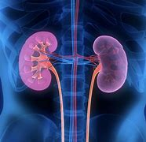

-
- PURE TEXT
  collapsed:: true
	- American doctors have released details about another operation involving the transplant of pig organs into humans.
	- A medical team from the University of Alabama at Birmingham said it had successfully transplanted pig kidneys into a brain-dead human. The operation took place last September, but was first reported January 20.
	- Similar operations have taken place in recent months.
	- In October, doctors at New York University temporarily attached a pig kidney to blood vessels outside the body of a brain-dead human. And earlier this month, doctors at University of Maryland School of Medicine in Baltimore transplanted a pig heart into a living human patient.
	- In all of the operations, doctors used organs from genetically modified pigs provided by Virginia-based medical company Revivicor.
	- The latest experiment in Alabama was performed on 57-year-old Jim Parsons, who was declared brain-dead after being injured in a motorcycle accident. His family donated his body to science.
	- For a little more than three days -- until the man’s body was removed from life support -- the two pig kidneys survived with no signs of immediate rejection, the medical team reported. The results were recently published in a study in the American Journal of Transplantation.
	- Dr. Jayme Locke of the University of Alabama at Birmingham led the new study. She told The Associated Press the experiment marks the beginning of a planned series of pig kidney transplants.
	- “The organ shortage is in fact an unmitigated crisis, and we’ve never had a real solution to it,” Locke said.
	- She added that an important finding of the latest operation helped answer a major question: Could the pig kidney blood vessels survive the force of human blood pressure? She said the operation proved that the answer was yes.
	- One kidney was damaged during removal from the pig and did not work effectively, the team reported. But the other quickly started producing urine as a kidney is supposed to.
	- Locke said no pig viruses were passed on to the human, and no pig cells were found in the man’s bloodstream. She added that the latest experiment showed that brain-dead bodies can serve as much-needed human models to test out possible new treatments.
	- In the donor pigs, scientists removed several genes linked to organ rejection. They also removed another gene in an effort to prevent too much growth of pig heart tissue.
	- Dr. Robert Montgomery has led similar experiments at New York University’s Langone Health in New York City. He told the AP that scientists still have a lot to learn about how long pig organs survive, and how best to genetically change them. “I think different organs will require different genetic modifications,” he said.
	- Organ donor organizations estimate there are about 110,000 Americans currently waiting for an organ transplant. And more than 6,000 patients die each year before getting an organ, reports organdonor.gov.
	- I’m Bryan Lynn.
	- The Associated Press reported this story. Bryan Lynn adapted the report for VOA Learning English.
	- _____________________________________________
	- Words in This Story
	  transplant – v. to perform a medical operation in which an organ or other part that has been removed from the body of one person is put into the body of another person
	- modify – v. to change something in order to improve it
	- unmitigated – adj. complete, often describing something bad or unsuccessful
	- urine – n. a yellowish liquid waste that is released from the body
- ---
- American doctors **have released details about** another operation /involving the transplant of pig organs into humans.
	- > ▶ operation :[ C ] ( also informal also BrE also op ) **~ (on sb) (for sth) |~ (to do sth)** the process of cutting open a part of a person's body in order to remove or repair a damaged part 手术 /（有组织的）活动，行动
	  -> Will I need to have an operation ? 我需要动手术吗？
	- > ▶ organ  （人体或动植物的）器官 /( especially humorous ) a penis 阴茎；阳物 /pipe organ 管风琴
	  /( formal ) an official organization that is part of a larger organization and has a special purpose （官方的）机构，机关
	  -> the organs of government 政府机关
- A medical team from the University of Alabama at Birmingham said /it had successfully transplanted pig kidneys into a brain-dead human. The operation took place last September, but was first reported January 20.
	- > ▶ kidney  /ˈkɪdni/  肾；肾脏
	  {:height 78, :width 141}
- Similar operations have taken place in recent months.
- In October, doctors at New York University temporarily ==attached== a pig kidney ==to== **blood vessels** outside the body of a brain-dead human. And earlier this month, doctors at University of Maryland School of Medicine in Baltimore /transplanted a pig heart into a living human patient.
	- > ▶ vessel ( technical 术语 ) ( old use ) a container used for holding liquids, such as a bowl, cup, etc. （盛液体的）容器，器皿 
	  /a tube that carries blood through the body of a person or an animal, or liquid through the parts of a plant （人或动物的）血管，脉管；（植物的）导管 
	  /( formal ) a large ship or boat 大船；轮船
	  {:height 68, :width 155}
	- > ▶ patient 接受治疗者，病人（尤指医院里的）
	- 将猪的肾脏, 暂时移植到脑死亡患者体外的血管上。
- In all of the operations, doctors used(v.) organs from **genetically modified pigs** /provided by Virginia-based medical company Revivicor.
	- > ▶ genetically adv. 基因地，遗传地
	- 在所有的手术中，医生使用的转基因猪的器官, 都是提供自弗吉尼亚州医疗公司Revivicor.
- The latest experiment in Alabama **was performed on** 57-year-old Jim Parsons, who was declared brain-dead /after being injured in a motorcycle accident. His family **donated** his body **to** science.
	- > ▶ experiment  实验；试验
	- > ▶ perform (v.)   to do sth, such as a piece of work, task or duty 做；履行；执行 = SYN **carry out**
	  -> **to perform an experiment**/a miracle/a ceremony 做实验；创奇迹；举行仪式
	- 被宣布脑死亡。
- For **a little more than** three days -- until the man’s body was removed from **life support** -- the two pig kidneys survived **with no signs of immediate rejection**, the medical team reported. The results were recently published in a study in **the American Journal of Transplantation**.
	- > ▶ a little more than 比......多一点
	  -> I just bought 13 gallons **for a little more than$ 55**. 我花了55美元多一点买了13加仑的汽油。
	- > ▶ life support  [ U ] the fact of sb being on a life-support machine （用机器设备）维持生命
	- ((621c2f25-e96e-41b5-ab0f-600aeb0cd3dd))
	- > ▶ rejection n. （对提议、建议或请求的）拒绝接受；（对求职者、求学等者的）拒绝；拒聘函，拒绝录取函；嫌弃，厌弃；（对移植器官的）排斥；被抛弃的东西
- `主` Dr. Jayme Locke of the University of Alabama at Birmingham `谓` led(v.) the new study. She told **The Associated Press** `主` the experiment `谓` marks(v.) the beginning of **a planned(a.) series of** pig kidney transplants.
	- > ▶ planned adj. 有计划的；根据计划的
- “The organ shortage `系` is in fact **an unmitigated(a.) crisis**, and **we’ve never had a real solution to it**,” Locke said.
	- > ▶ unmitigated  /ʌnˈmɪtɪɡeɪtɪd/ (a.)used to mean ‘complete’, usually when describing sth bad 完全的，十足的，彻底的（通常指坏事）SYN absolute
	  -> The evening **was an unmitigated disaster**. 这一晚完全是一场灾难。
	  => 来自拉丁语mitigare,成熟，变软，温顺，来自mitis,成熟的，柔软的，-ig,做，词源同agent.引申词义减轻，缓和。
	- 器官短缺实际上是一场不折不扣的危机，我们从来没有真正的解决办法。
- She added that /`主` an important finding of the latest operation `谓` helped answer a major question: /Could the pig kidney blood vessels /survive(v.) the force of human blood pressure? She said /`主` the operation `谓` proved that /the answer was yes.
	- 最新手术的一项重要发现, 帮助回答了一个重要问题:猪的肾血管, 能承受人类血压的压力吗?她说, 手术证明了答案是肯定的。
- One kidney was damaged /during removal from the pig /and did not work effectively, the team reported. But the other quickly started producing urine /as a kidney is supposed to.
	- > ▶ urine  /ˈjʊrɪn/ 尿；小便
	  => 来自 PIE*uers,下雨，流水，流乳，词源同 Uranus,udder.委婉语指小便，比较 whore.
	- > ▶ **BE SUPPOSED TO DO/BE STH** (1) to be expected or required to do/be sth according to a rule, a custom, an arrangement, etc. （按规定、习惯、安排等）应当，应，该，须
	  (2) to be generally believed or expected to be/do sth 一般认为；人们普遍觉得会
	  -> **You were supposed to be here** an hour ago! 你本该在一小时以前就到这儿！
	  -> I haven't seen it myself, but **it's supposed to be** a great movie. 这部电影我没看过，不过人们普遍认为很不错。
- Locke said /no pig viruses(n.) were **passed on to** the human, and no pig cells were found in the man’s bloodstream. She added that /the latest experiment showed that /brain-dead bodies **can serve as** much-needed human models /to test out possible new treatments.
	- > ▶ virus  /ˈvaɪrəs/  (n.)a living thing, too small to be seen without a microscope , that causes infectious disease in people, animals and plants 病毒；滤过性病毒
	  -> the flu virus 流感病毒
	  => 来自拉丁语 virus,毒液，毒汁，来自 PIE*weis,融化，流出，恶臭液体，词源同 weasel,bison. 该词最早用于病毒义来自 1728 年，用于指传染性病，天花，梅毒等。也用于指计算机病毒。
	- > ▶ **pass sth on (to sb)** : to give sth to sb else, especially after receiving it or using it yourself 转交；（用后）递给，传给
	  -> `主` Much of the discount `谓` is pocketed by retailers /instead of **being passed on to customers**. 折扣的大部分进了零售商的腰包，而顾客没有得到实惠。
	- > ▶ much-needed 很需要, 大量需要, 急需的
	- 猪的病毒没有传染给人类，这名男子的血液中, 也没有发现猪的细胞。她补充说，最新的实验表明，脑死亡的身体, 可以作为急需的人体模型, 来测试可能的新治疗方法。
- In the donor pigs, scientists removed several genes linked to **organ rejection**. They also removed another gene **in an effort to prevent** too much growth of pig **heart tissue**.
	- ((621c4ec3-13bc-4edf-ad31-377d824ab076))
	- 在捐献的猪身上，科学家们移除了几个与器官排斥有关的基因。他们还移除了另一种基因，以防止猪心脏组织过度生长。
- Dr. Robert Montgomery **has led similar experiments** at New York University’s Langone Health in New York City. He told the AP that /scientists **still have a lot to learn about** how long pig organs survive, and how best **to genetically change(v.) them**. “I think /different organs will require different genetic modifications,” he said.
	- 关于猪的器官能存活多久，以及如何最好地改变它们的基因，科学家们还有很多要了解的。我认为不同的器官, 需要不同的基因修饰.
- **Organ donor organizations** estimate(v.) /there are about 110,000 Americans 后定 currently **waiting for an organ transplant**. And more than 6,000 patients die(v.) each year /before getting an organ, reports organdonor.gov.
- I’m Bryan Lynn.
- **The Associated Press** reported(v.) this story. Bryan Lynn **adapted** the report **for** VOA Learning English.
- _____________________________________________
- Words in This Story
  transplant – v. to perform a medical operation in which an organ or other part that has been removed from the body of one person is put into the body of another person
- modify – v. to change something in order to improve it
- unmitigated – adj. complete, often describing something bad or unsuccessful
- urine – n. a yellowish liquid waste that is released from the body
- We want to hear from you. Write to us in the Comments section, and visit our Facebook page.