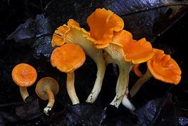
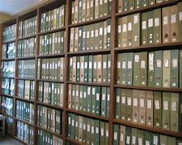
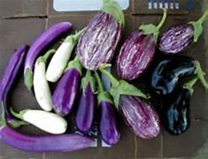
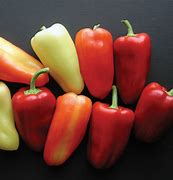
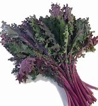
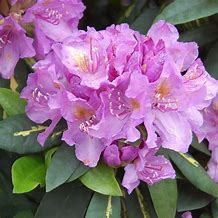
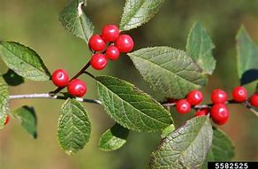
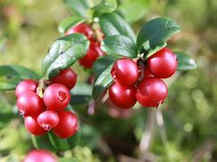

-
- pure text
  collapsed:: true
	- Gardening expert Lee Reich wrote about planting flowers, vegetables and more on his land for 30 years.
	  
	  In his final story, he wanted to leave his readers with some advice.
	  
	  Over the years, he wrote about tomatoes, how to cut flowers and the worries about household pets eating indoor plants.
	  
	  He said he was happy to write about working in the garden for gardeners of all levels.
	  
	  He decided to offer eight pieces of information to help people who grow plants at home, whether they do it on a large piece of land or just two or three containers inside.
	- ## Organic matter
	  
	  Reich said items that were once alive are good to mix into the soil you use to grow plants. This includes leftover foods, green clippings, and leaves that fall from trees. They help keep water in the soil and feed microorganisms that help plants.
	- ## Do not panic about pests
	  
	  Yes, Reich, said, some insects can hurt plants. But it is normal for insects and fungi and other organisms to hurt your garden. He said people who work with plants need to learn how to accept a little damage. When plants get hurt, he said, they come back in other ways, like growing stronger where they are not injured. He said it is a good idea to be thoughtful and find a natural way to fight insects before using a chemical treatment.
	- ## Trust nature
	  
	  Reich said “Mother Nature” has been helping the Earth develop food and plants for a long time. Gardeners, he said, should not be too worried about ground cover that grows naturally. Some people call these weeds.
	  
	  Reich also noted that it is important to think carefully about the soil you plant in. Do not put plants that are best in dry parts of the world where it is very wet. Do not put plants that do best in wet conditions where it is very dry.
	- ## Take photos and write notes
	  
	  Each year, he said, it is a good idea to take photos of your garden and write down what you planted, and when you did the work. That way, you can learn from what worked well and what did not. The next year, you can decide what to plant based on your past experience.
	  
	  Former U.S. President Thomas Jefferson once wrote: “Though an old man, I am a young gardener.” His archives show good notes about his gardens.
	- ## Do not think like everyone else
	  
	  Example 1: Some people think pulling weeds from the garden is not fun. But Reich says that is not the right way to think of the job. A good idea is to look at your garden and take the weeds out every three or four days. That way, the work never takes too long. When you change the way you think, he said, a job once seen as difficult can become enjoyable. One other warning? Do not turn over the soil too much. That work often turns over weed seeds that would not grow otherwise.
	  
	  Example 2: Reich said you should mix and match plants and flowers. There is no reason you cannot plant eggplant, peppers and other vegetables with your flowers. Those plants look nice and the flowers will bring helpful insects like bees to the garden.
	  
	  Example 3: You can plant fruit trees wherever you want. You do not need an orchard. Many fruit trees look nice by themselves along with producing food that tastes good.
	- ## Get help from trusted sources
	  
	  Reich wrote about plants for 30 years, but sometimes he has questions. In those cases, he searches on the internet, but he centers his searches on information from educational institutions and government agencies. Even if the sources are not right 100 percent of the time, most of the time they have good information. It is hard to see the difference, sometimes, between good information and bad when it comes from sources you do not know well.
	- ## Grow various plants, especially ones you can eat
	  
	  Sometimes bad weather can hurt plants. Other times, disease can hurt them. If you plant vegetables that are ready to eat at different times of the year, you can make sure that even if there is a problem in August or September, you picked something good to eat earlier in the year. In Reich’s experience, one year in the northeastern United States, a sickness late in the summer hurt many tomato plants. But that year, he already picked peppers, corn, kale and other vegetables.
	- ## Do not plant too much
	  
	  You may get advertisements. You may go past a plant store that looks good. Even warm weather early in the year might make you excited to start planting. But Reich says it is better to have a small garden than a large one. When he has friends come over, they admire all his fruits and vegetables. However, he warns, “don’t do this at home!”
	  
	  In the end, Reich said, he may not be writing as much. However, he will never stop working in his garden. He will plant some new items and remove old ones in the next year. For example, he wants to plant rhododendrons and winterberry. He will build another stone wall he can use to support lingonberry and dwarf sweet box. The work never ends.
	  
	  Even if he is not writing as often, Reich plans to keep writing on his own website – leereich.com. You can visit him there if you want to keep up with his work, and perhaps see photos of his new projects.
	  
	  He will be working hard, even on the cold days of winter.
	  
	  I’m Dan Friedell.
	  
	  ---
	  
	  Words in This Story
	  advice – n. an opinion or suggestion about what someone should do
	  
	  microorganism – n. an extremely small living thing that can only be seen with a microscope
	  
	  fungi – n. any one of a group of living things (such as molds, mushrooms, or yeasts) that often look like plants but have no flowers and that live on dead or decaying things; the plural of fungus
	  
	  archives – n. a place in which public records or historical materials (such as documents) are kept
	  
	  mix and match – v. to put different things (such as pieces of clothing) together in different ways
	  
	  weed – n. a plant that grows very quickly where it is not wanted and covers or kills more desirable plants
	  
	  orchard – n. a place where people grow fruit trees
	  
	  admire – v. to look at (something or someone) with enjoyment
-
- ---
-
- def text
	- **Gardening expert** Lee Reich `谓` wrote about **planting(v.) flowers, vegetables and more** on his land for 30 years.
	- In his final story, he wanted to leave his readers /with some advice.
		- 在他的最后一个故事中，他想给读者一些建议。
	- Over the years, he wrote about tomatoes, how to cut flowers /and the worries about **household pets** eating **indoor plants**.
	- He said /he was happy to write about working in the garden /for gardeners of all levels.
		- 他很高兴为各级园丁, 写关于在花园工作的文章。
	- He decided to offer **eight pieces of information** /to help people /who grow plants at home, ==whether== they do it **on a large piece of land** /==or== just two or three containers(n.) inside.
		- > ▶ container 容器 /集装箱；货柜
	-
	- ## Organic matter
	  
	  Reich said /`主` items that were once alive `系` are good to mix into the soil /you use to grow plants. This includes **leftover foods**, green clippings(n.), and leaves(n.) that fall from trees. They help keep water in the soil /and feed(v.) microorganisms that help plants.
		- > ▶ Organic matter [有化] 有机物；有机物质
		- > ▶ leftover  [ usually pl. ] food that has not been eaten at the end of a meal 吃剩的食物；残羹剩饭 /an object, a custom or a way of behaving that remains from an earlier time 遗留物；残存物；遗留下来的风俗习惯
		- > ▶ clipping [ usually pl. ] a piece cut off sth 剪下物
		  -> hedge/nail clippings 剪下的树篱╱指甲
		- > ▶ microorganism 微生物
		- 曾经活过的东西, 都可以很好地混合到你用来种植植物的土壤中。这包括吃剩的食物、绿色的剪枝, 和从树上掉下来的叶子。它们有助于保持土壤中的水分，并养育有助于植物生长的微生物。
	-
	- ## Do not panic about pests
	  
	  Yes, Reich, said, some insects can hurt plants. But **it is normal** for insects and fungi(n.) and other organisms /to hurt your garden. He said /people who work with plants /need to learn /how to accept a little damage. When plants get hurt, he said, they **come back** in other ways, like growing stronger /where they are not injured. He said /it is a good idea to be thoughtful /and find a natural way /to fight insects /before using a chemical treatment.
		- 不要害怕害虫
		- > ▶ fungi :  /ˈfʌndʒaɪ; ˈfʌŋɡaɪ; ˈfʌŋɡiː/   fungus 的复数形式. [ C ] any plant without leaves, flowers or green colouring, usually growing on other plants or on decaying matter. Mushrooms and mildew are both fungi . 真菌（如蘑菇和霉） /[ UC ] a covering of mould or a similar fungus , for example on a plant or wall 霉；霉菌
		  => 来自fungus, 真菌，蘑菇，词源同sponge.
		  {:height 127, :width 122}
		- > ▶ come back 回来；记起；恢复原状，重新流行
		- 是的，有些昆虫会伤害植物。但昆虫、真菌, 和其他生物体伤害你的花园, 是正常的。他说，与植物打交道的人, 需要学习如何接受一点损害。他说，当植物受到伤害时，它们会以其他方式恢复，比如在没有受伤的地方生长得更强。他说，在使用化学疗法之前，先思考一下，找到一种自然的方法来对付昆虫, 是一个好主意。
	-
	- ## Trust (v.)nature
	  
	  Reich said /“Mother Nature” has been helping the Earth /develop(v.) food and plants /for a long time. Gardeners, he said, should not be too worried about **ground cover** /that grows naturally. Some people call these weeds.
		- > ▶ **ground cover** [ U ] plants that cover the soil 地被植物
		- > ▶ weed [ C ] a wild plant growing where it is not wanted, especially among crops or garden plants 杂草，野草（尤指庄稼或花园中的）
		- Reich说，“大自然母亲”长期以来一直在帮助地球, 发展食物和植物。他说，园丁不应该太担心自然生长的地被植物。有些人把这些叫做杂草。
		-
	- Reich also noted that /it is important to think carefully about /the soil you plant in. Do not put plants that are best **in dry parts of the world** /where it is very wet. Do not put plants that do best **in wet conditions** /where it is very dry.
		- Reich还指出，仔细考虑你种植的土壤很重要。不要把只适合在干燥的地域生长的植物, 种在潮湿的地方. 也不要把只在潮湿条件下才生长得最好的植物, 种在非常干燥的地方。
	-
	- ## Take photos and write notes
	  
	  Each year, he said, it is a good idea /**to take photos of** your garden /and **write down** what you planted, and when you did the work. That way, you can learn from **what worked well** and **what did not**. The next year, you can decide what to plant /based on your past experience.
		- 每年给你的花园拍照，写下你种了什么，及是在什么时候种的，这是个好主意。这样，你就可以从中获得教训学习, 哪些方法是有效的，而哪些方法无效。第二年，你可以根据过去的经验, 来决定种植什么。
	- Former U.S. President Thomas Jefferson /once wrote: “Though an old man, I am a young gardener.” His archives(n.) show(v.) good notes about his gardens.
		- > ▶ archive ( also arch·ives [ pl. ] ) **a collection of historical documents or records** of a government, a family, a place or an organization; the place where these records are stored 档案；档案馆；档案室
		  {:height 70, :width 118}
		- 美国前总统托马斯·杰斐逊曾写道:“虽然我是个老人，但我是年轻的园丁。”他的档案显示了他对花园有良好的记录。
	-
	- ## Do not think like everyone else
	  
	  Example 1: Some people think /pulling weeds from the garden /is not fun. But Reich says /**that is not the right way** /to think of the job. A good idea is /to look at your garden /and take the weeds out /every three or four days. That way, **the work never takes too long**. When you change the way you think, he said, a job **once seen as difficult** /can become enjoyable. One other warning? Do not **turn over the soil** too much. `主` That work `谓` often **turns over** weed seeds /that would not grow otherwise.
		- ((621436bd-23a4-4855-9fce-82fcd87ec5af))
		- > ▶ turn over :VERB If you turn something over, or if it turns over, it is moved so that the top part is now facing downward.  翻转, 翻身 /仔细考虑
		- 另一个警告是, 不要太多次的翻土, 因为这会翻出杂草籽(导致它们生长), 而通常情况下,这些杂草籽不会去生长.
	- Example 2: Reich said /you should mix and match(v.) plants and flowers. **There is no reason you cannot** plant(v.) eggplant, peppers and other vegetables with your flowers. Those plants look nice /and the flowers **will bring** helpful insects like bees **to** the garden.
		- > ▶ match (v.)if two things match , or if one thing matches another, they have the same colour, pattern, or style and therefore look attractive together 般配；相配 
		  /**~ sb/sth (to/with sb/sth)** : to find sb/sth that goes together with or is connected with another person or thing 找相称（或相关）的人（或物）；配对
		  /[ VN ] to provide sth that is suitable for or enough for a particular situation 适应；满足
		  -> Investment in hospitals is needed now /**to match(v.) the future needs** of the country. 为了适应国家未来的需要，必须现在就投资医院建设。
		- > ▶ plant (v.)栽种；种植；播种
		- > ▶ eggplant  /ˈeɡplænt/ 茄子
		  => egg蛋 + plant植物
		  {:height 93, :width 141}
		- id:: 6221aa29-7d27-4260-8812-504811098236
		  > ▶ pepper ( BrE ) [C] [U] ( BrE NAmE also ˈsweet pepper ) ( NAmE also ˈbell pepper ) a hollow fruit, usually red, green or yellow, eaten as a vegetable either raw or cooked 甜椒；柿子椒；灯笼椒 /胡椒粉
		  {:height 66, :width 103}
	- Example 3: You can plant(v.) fruit trees /wherever you want. You do not need an orchard. Many fruit trees **look nice** by themselves /along with **producing food** that tastes good.
		- > ▶ orchard  /ˈɔːrtʃərd/ 果园
		  => 几百年前，这个词拼作ortgeard；ort来自拉丁词hortus，意思是“garden（花园）”；geard即“yard”，是古英语的写法；合起来则是“花园庭院”的意思。
		- > ▶ **along with sb/sth** : in addition to sb/sth; in the same way as sb/sth 除…以外（还）；与…同样地
		  -> She lost her job when the factory closed, **along with** hundreds of others. 工厂倒闭时，她和成百上千的其他人一样失去了工作。
	-
	- ## Get help from trusted sources
	  
	  Reich wrote about plants for 30 years, but sometimes he has questions. In those cases, he searches(v.) on the internet, but he ==centers==(v.) his searches ==on== information from **educational institutions** and **government agencies**. Even if the sources are not right **100 percent of the time**, most of the time /they have good information. **It is hard to see the difference**, sometimes, **between** good information and bad /when it comes from sources /you do not know well.
		-
		- 但他的搜索集中在教育机构和政府机构的信息。即使这些消息也不是百分之百的时间都正确，但大多数时候他们都有很好的信息。有时，当信息来自你不了解的来源时，很难看出好的信息和坏的信息之间的区别。
	- ## Grow various plants, especially ones you can eat
	  
	  Sometimes bad weather can hurt plants. Other times, disease can hurt them. If you plant vegetables /that are ready to eat /at different times of the year, you can make sure that /even if there is a problem in August or September, you picked something good to eat /earlier in the year. In Reich’s experience, one year in the northeastern United States, a sickness late in the summer /hurt many tomato plants. But that year, he already picked peppers, corn, kale and other vegetables.
		- > ▶ various (a.)  /ˈveriəs; ˈværiəs/  several different 各种不同的；各种各样的
		- > ▶ sickness (n.)[ U ] illness; bad health 疾病；不健康 /恶心；呕吐
		- ((6221aa29-7d27-4260-8812-504811098236))
		-
		- > ▶ kale   /keɪl/  ( NAmE also ˈcollard greens [ pl. ] ) a dark green vegetable like a cabbage 羽衣甘蓝 (是沙拉中必不可少的原料之一。)
		  {:height 109, :width 93}
		-
	-
	- ## Do not plant too much
	  
	  You may get advertisements. You may **go past** a plant store /that looks good. Even warm weather early in the year /might make you excited to start planting. But Reich says /it is better to have a small garden than a large one. When he has friends **come over**, they admire all his fruits and vegetables. However, he warns, “don’t do this at home!”
	- In the end, Reich said, he may not be writing as much. However, he will never stop working in his garden. He will plant(v.) some new items /and remove old ones /in the next year. For example, he wants to plant rhododendrons and winterberry. He will build another stone wall /he can use(v.) to support lingonberry and **dwarf sweet box**. The work never ends.
	- Even if he is not writing as often, Reich plans(v.) to keep writing /on his own website – leereich.com. You can visit him there /if you want to keep up with his work, and perhaps see photos of his new projects.
	- He will be working hard, even on the cold days of winter.
	- I’m Dan Friedell.
		- 你可能会经过一家看起来不错的植物商店。
		- > ▶ come over : PHRASAL VERB If someone comes over to your house or another place, they visit you there. 拜访
		- id:: 6226c14a-a7a7-40cf-a3b9-957afc1c4b7b
		  > ▶ rhododendron   /ˌroʊdəˈdendrən/  杜鹃花 (品种众多, 包括, 映山红 )
		  =>来自希腊语 rhododendron,玫瑰树，来自希腊语 rhodon,玫瑰，词源同 rose,dendron,树，词源 同 tree,dentrology.
		  {:height 105, :width 118}
		- > ▶ berry ( often in compounds 常构成复合词 ) a small fruit that grows on a bush. There are several types of berry , some of which can be eaten. 浆果；莓
		- > ▶ winterberry n. [林] 美洲冬青
		  {:height 90, :width 160}
		- 他将建造另一堵石墙，他可以用它来支撑越橘和矮子糖盒。
		- > ▶ lingonberry   /ˈlɪŋɡənˌberi/  n. 越橘（等于 cowberry）
		  {:height 113, :width 147}
		-
		-
	- ---
	- ## Words in This Story
	- advice – n. an opinion or suggestion about what someone should do
	- microorganism – n. an extremely small living thing that can only be seen with a microscope
	- fungi – n. any one of a group of living things (such as molds, mushrooms, or yeasts) that often look like plants but have no flowers and that live on dead or decaying things; the plural of fungus
	- archives – n. a place in which public records or historical materials (such as documents) are kept
	- mix and match – v. to put different things (such as pieces of clothing) together in different ways
	- weed – n. a plant that grows very quickly where it is not wanted and covers or kills more desirable plants
	- orchard – n. a place where people grow fruit trees
	- admire – v. to look at (something or someone) with enjoyment