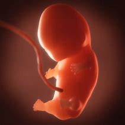
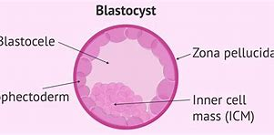
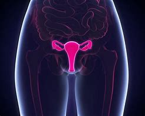

-
- pure text
  collapsed:: true
	- Scientists say that for the first time, they have developed early human-like embryo structures in a laboratory. The research could lead to new methods in reproductive technology. It is also likely to raise new ethical questions.
	- Researchers say the lab-created structures seemed to model blastocysts, which form during the early stages of human embryonic development. Two separate research groups say they used human cell material to successfully create the structures.
	- The results were recently described in two papers in the publication Nature. The teams noted that their work was carried out only for research purposes, not with the goal of reproducing human embryos.
	- The findings could help scientists gain a better understanding of early human development. The area of research has historically been very difficult to study. That is because few human embryos are available and such studies are subject to many ethical and legal restrictions, an article in Nature noted about the research.
	- Progress in the field of early human development could lead to improved infertility treatments and help prevent pregnancy loss and birth defects.
	- Jun Wu is a molecular biologist at Southwestern Medical Center at the University of Texas. He led one of the research teams. He told The Associated Press he thinks the results can support new research in the field without the need to experiment on human embryos.
	- Wu’s team used embryonic stem cells to produce the blastocyst-like structures. The second team used a “reprogramming” method to turn human skin cell tissue into stem cells for research.
	- Blastocysts form a few days after an egg has been fertilized, but before the cells attach to the uterus to become an embryo. Wu said the new models were similar to blastocysts about three to 10 days after fertilization.
	- Both groups said the lab-created structures were not the same as naturally formed embryos and it is unclear whether they could develop into actual embryos.
	- Scientists had already created similar structures of mouse cells in a lab, but this is the first time they were made from human cells. Researchers attempted to turn the lab-generated mouse cell structures into embryos, but they were not successful.
	- In the United States, federal funding is not available for research involving human embryos or blastocysts. Several states ban such research altogether.
	- Some scientists use blastocysts donated from fertility centers for research into the cause of infertility and diseases present from birth. The new work should permit them to expand such research.
	- The researchers noted that their creations were not meant to be used for human reproduction. “There is no implantation,” said Amander Clark, a stem cell biologist at the University of California, Los Angeles who took part in the experiments. “These structures are not transferred to a uterus or uterus-like structure,” she said. “There is no pregnancy.”
	- But one scientist not involved in the research said it could be difficult to see clear differences between blastocysts resulting from fertilization and the structures created in a lab. Shoukhrat Mitalipov, a human embryologist at Oregon Health and Science University, told the AP that both groups show “how closely they resemble real embryos.”
	- Mitalipov said, “If they are really as good as embryos, should they be treated as embryos? This brings new ethical issues.”
	- ---
	- Words in This Story
	- ethical – adj. relating to what is right or wrong
	- defect – n. a problem or fault that makes someone or something not perfect
	- implant – v. to place something into someone’s body in a medical operation
	- transfer – v. to move something from one place to another
	- resemble – v. to look like or be very similar to someone or something else
- ---
- def text
	- Scientists say that for the first time, they have developed **early human-like embryo structures** in a laboratory. The research could lead to new methods **in reproductive technology**. It is also likely **to raise new ethical(a.) questions**.
		- > ▶ embryo  /ˈembrioʊ/   (n.)a young animal or plant in the very early stages of development before birth, or before coming out of its egg or seed, especially a human egg in the first eight weeks after fertilization 胚；胚胎；（尤指受孕后八周内的）人类胚胎
		  => em-, 进入，使。- bryo, 膨胀，发芽，词源可能同breast, browse.
		  {:height 51, :width 94}
		- ((6219b283-49ca-4bb8-83f5-077ece5f64bb))
		- > ▶ ethical ˈeθɪkl/  (a.)connected with beliefs and principles about what is right and wrong （有关）道德的；伦理的
		- 他们首次在实验室中, 培育出了早期类人胚胎结构。
	- Researchers say **the lab-created structures** seemed to model(v.) blastocysts, which form(v.) /during **the early stages of** human embryonic(a.) development. Two separate research groups say /they used **human cell material** to successfully create the structures.
		- > ▶ model [ VN ] to create a copy of an activity, a situation, etc. so that you can study it before dealing with the real thing 将…做成模型；复制
		- id:: 622eea51-8058-4a39-a0fc-87254c90f353
		  > ▶ blastocyst /ˈblæstəˌsɪst; ˈblæstoʊˌsɪst/  N the blastula of mammals: a sphere of cells (trophoblast) enclosing an inner mass of cells and a fluid-filled cavity (blastocoel) 囊胚 (Also called blastosphere)
		  囊胚也称胚胞(blastula[1]）是动物受精卵卵裂的过程中, 所形成的球形幼胚。在囊胚中细胞单层排列在表面，而中央充满液体的腔称为囊胚腔。囊胚中所有细胞都没有开始分化，这个阶段之后胚胎开始出现分化。
		  
		- > ▶ embryonic  /ˌembriˈɑːnɪk/ (a.)( formal ) in an early stage of development 胚胎期的；萌芽期的；未成熟的 /embryonic
		- 实验室创造的结构, 似乎模仿了囊胚，囊胚形成于人类胚胎发育的早期阶段。两个独立的研究小组表示，他们使用人类细胞材料, 成功地创造了这种结构。
	- The results were recently described in two papers in the publication Nature. The teams noted that /their work **was carried out only for research purposes**, **not with the goal of** reproducing human embryos.
	- The findings could help scientists **gain(v.) a better understanding of** early human development. The area of research **has historically been very difficult to study**. That is because few **human embryos** are available /and such studies **are subject(a.) to** many ethical and legal restrictions, an article in Nature /noted about the research.
		- > ▶ **subject (a.)~ to sth** : likely to be affected by sth, especially sth bad 可能受…影响的；易遭受…的 /~ to sth/sb : under the authority of sth/sb 受…支配；服从于
		  -> Flights **are subject(a.) to delay** because of the fog. 由于有雾，航班可能延误
		  -> All nuclear installations **are subject(a.) to** international safeguards. 一切核设施均须执行国际防护措施。
		- 这些发现, 可以帮助科学家更好地了解早期人类的发展。这一研究领域, 历来都是很难研究的。《自然》杂志(Nature)上的一篇文章指出，这是因为人类胚胎很少，而且此类研究受到许多伦理和法律限制。
	- **Progress in the field of** early human development `谓` could lead to improved **infertility treatments** /and help prevent **pregnancy loss** and **birth defects**.
		- > ▶ infertility n. /ˌɪnfɜːrˈtɪləti/  不孕症；不肥沃，贫瘠
		- > ▶ pregnancy loss 妊娠丢失; 流产
		- 对"人类早期发育领域"的研究的进展, 可以改进对"不孕"的治疗，并有助于防止"流产"和"出生缺陷"。
	- Jun Wu is **a molecular biologist** at Southwestern **Medical Center** at the University of Texas. He led one of the research teams. He told The Associated Press /he thinks the results can support new research in the field /without the need to experiment(v.) on human embryos.
		- > ▶ experiment (n.)(v.)a scientific test that is done in order to study what happens and to gain new knowledge 实验；试验
	- Wu’s team used **embryonic stem cells** to produce **the blastocyst-like structures**. The second team used **a “reprogramming” method** to turn **human skin cell tissue** into **stem cells** for research.
		- 吴的研究小组, 使用胚胎干细胞来产生囊胚状结构。第二组使用了一种“重新编程”的方法，将人类皮肤细胞组织, 转化为用于研究的干细胞。
	- Blastocysts form(v.) a few days /after an egg has been fertilized, but before the cells **attach to** the uterus(n.) to become an embryo. Wu said the new models **were similar to** blastocysts  后定 about three to 10 days after fertilization.
		- > ▶ fertilize (v.)to put pollen into a plant so that a seed develops; to join sperm with an egg so that a baby or young animal develops 使受精；使受粉；使受胎；使受孕 /施肥于
		  -> a fertilized egg 受精卵
		- > ▶ uterus   /ˈjuːtərəs/  N-COUNT The uterus of a woman or female mammal is the part of her body where babies develop. 子宫
		  {:height 89, :width 97}
		- ((622eea51-8058-4a39-a0fc-87254c90f353))
		- > ▶ fertilization n. [农] 施肥；[胚] 受精；肥沃
		- 囊胚形, 成于卵子受精后的几天，但在细胞附着在子宫上成为胚胎之前。吴说，新的模型与受精后3到10天的囊胚相似。
	- Both groups said /the lab-created structures **were not the same as** naturally formed embryos /and **it is unclear** whether they could develop into actual embryos.
		- 实验室创造的结构, 与自然形成的胚胎不同，目前还不清楚它们是否能发展成真正的胚胎。
	- Scientists had already created similar structures of mouse cells in a lab, but this is the first time they were made from human cells. Researchers attempted **to turn** the lab-generated mouse cell structures **into** embryos, but they were not successful.
		- 科学家们已经在实验室中, 创造了类似的老鼠细胞结构，但这是第一次用人类细胞制造。研究人员试图将实验室生成的老鼠细胞结构转化为胚胎，但没有成功。
	- In the United States, federal funding **is not available for research** involving human embryos or blastocysts. Several states **ban(v.) such research altogether**.
		- 在美国，涉及人类胚胎或囊胚的研究, 得不到联邦资助。有几个州完全禁止这样的研究。
	- Some scientists **use** blastocysts donated from fertility centers **for research into** the cause of **infertility** and **diseases present from birth**. The new work should permit them to expand such research.
	- The researchers noted that /their creations **were not meant to** be used for human reproduction. “There is no implantation,” said Amander Clark, a **stem cell** biologist at the University of California, Los Angeles who **took part in** the experiments. “These structures **are not transferred to** a uterus or uterus-like structure,” she said. “There is no pregnancy.”
		- > ▶ implantation N the act of implanting or the state of being implanted 移植
		- > ▶ transfer (v.) [ VN V ] ~ (sth/sb) (from...) (to...) to move from one place to another; to move sth/sb from one place to another （使）转移，搬迁
	- But one scientist **not involved in** the research said /**it could be difficult to see clear differences between** blastocysts resulting from fertilization **and** the structures created in a lab. Shoukhrat Mitalipov, a human embryologist at Oregon Health and Science University, told the AP that /both groups show “**how closely they resemble(v.)** real embryos.”
		- > ▶ resemble (v.) 看起来像；显得像；像
		- 很难看出受精产生的囊胚, 与实验室创造的囊胚结构, 之间的明显区别。
	- Mitalipov said, “If they are really as good as embryos, should they be treated as embryos? This brings new ethical issues.”