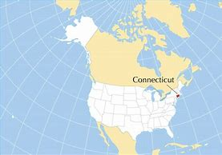
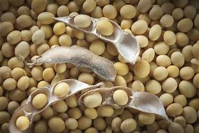
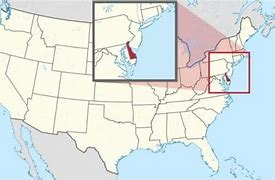

-
- pure text
  collapsed:: true
	- The world’s top insect experts say our planet’s important insect population is going through a “death by a thousand cuts.”
	- A new group of studies suggests Earth is losing around 1 to 2 percent of its insects each year. The losses are blamed on climate change, pollution, agriculture, land use changes and chemicals.
	- David Wagner of the University of Connecticut is the lead writer of the 12 studies, which recently appeared in Proceedings of the National Academies of Sciences. The research involved 56 scientists from around the world.
	- The problem, sometimes called the insect apocalypse, is a complex issue. Even scientists say they do not fully understand it. And the complexity of the issue makes it hard to get the public interested in possible solutions.
	- Wagner said scientists need to find out if the levels of insect loss are bigger in comparison to other species. “There is some reason to worry more,” he added, “because they [insects] are the target of attack” with insecticides, herbicides and light pollution.
	- Insecticides and herbicides are special kinds of chemicals that can kill insects or plants.
	- May Berenbaum of the University of Illinois helped lead the research. She compared the insect losses to climate change 30 years ago. She said back then, the methods used to measure the degree and rate of climate change effects were difficult.
	- Berenbaum says another issue is that many people simply hate insects. She added that this is true even though the small creatures do a lot of good. They pollinate the world’s foods, get rid of waste and play an important part in the food chain.
	- Insects are “the fabric by which Mother Nature and the tree of life are built,” Wagner said.
	- Fabric is a kind of woven or knitted material. The term can also mean the basic structure of something.
	- Wagner said two famous insects, honeybees and Monarch butterflies, are good examples of the current problems insects face. Honeybees have been disappearing because of disease, parasites, insecticides, herbicides and lack of food.
	- Drier weather in the U.S. West, driven by climate change, means less milkweed for butterflies to eat, Wagner said. And changes in American agriculture remove weeds and flowers they need for nectar.
	- “We’re creating a giant biological desert except for soybeans and corn in a giant area of the Midwest,” he said.
	- The recent scientific papers do not provide new data. They show a big but incomplete picture of a problem that is starting to get more attention. Scientists have identified 1 million insect species, while up to 4 million more are likely to be discovered, Berenbaum said.
	- Doug Tallamy of the University of Delaware was not part of the studies. But he said the research demonstrates how the world has “spent the last 30 years spending billions of dollars finding new ways to kill insects and mere pennies working to preserve them.”
	- Pennies are a small amount of money.
	- In an email to the Associated Press, Tallamy said the good news was that people themselves can do a lot to stop insect losses. “This is a global problem with a grassroots solution,” he wrote.
	- ---
	- Words in This Story
	  apocalypse – n. a great disaster : a sudden and very bad event that causes much fear, loss, or destruction
	- species – n. a group of animals or plants that are similar and can produce young animals or plants
	- pollinate – v. to give (a plant) pollen from another plant of the same kind so that seeds will be produced food
	- chain – n. a series of types of living things in which each one uses the next lower member of the series as a source of food — usually used with the
	- parasite – n. an animal or plant that lives in or on another animal or plant and gets food or protection from it
	- nectar – n. a sweet liquid produced by plants and used by bees in making honey
	- preserve – v. to keep (something) in its original state or in good condition
	- grassroots – n. the ordinary people in a society or organization : the people who do not have a lot of money and power
- ---
- def text
	- The world’s top **insect experts** say /our planet’s **important insect** population **is going through a “death by a thousand cuts.”**
		- > ▶ insect  昆虫
		- > ▶ death by a thousand cuts 死于千刀万剐
	- A new group of studies suggests /Earth is losing around 1 to 2 percent of its insects each year. The losses **are blamed on** climate change, pollution, agriculture, land use changes and chemicals.
	- David Wagner of the University of Connecticut is **the lead writer** of the 12 studies, which recently appeared in _Proceedings of the National Academies of Sciences_. The research involved 56 scientists from around the world.
		- > ▶ Connecticut  /kəˈnetɪkət/  美国州名
		  
		-
	- The problem, sometimes called **the insect apocalypse**, is a complex issue. Even scientists say /**they do not fully understand it**. And **the complexity of the issue** makes it hard to get the public **interested in** possible solutions.
		- > ▶ apocalypse  /əˈpɑːkəlɪps/  (n.)[ sing.U ] the destruction of the world 世界毁灭 / the Apocalypse [ sing. ]  （《圣经》所述的）末世
		  /a situation causing very serious damage and destruction 大动乱；大灾变
		  => 前缀apo-, 离开，非。-calypse, 隐藏，同词根kel，隐藏，见cell, hole. 宗教用语，指揭露，描述世界末日的景象。
		- 这个问题有时被称为“昆虫启示录”，是一个复杂的问题。就连科学家们也表示，他们并不完全了解这一现象。这个问题的复杂性, 使得公众很难对可能的解决方案感兴趣。
	- Wagner said /scientists need to find out /if the levels of insect loss `系` are bigger /**in comparison(n.) to** other species. “There is some reason to worry more,” he added, “because they [insects] are the target of attack” with insecticides(n.), herbicides(n.) and light pollution.
		- > ▶ comparison (n.)[ U ] **~ (with sb/sth)** the process of comparing two or more people or things 比较 
		  /**~ (of A and/to/with B)|~ (between A and B)** an occasion when two or more people or things are compared 对比；相比
		  => com-, 强调。-par, 对等，词源同pair, peer.
		  -> The education system **bears/stands no comparison with** that in many Eastern European countries (= it is not as good) . 这种教育制度比不上许多东欧国家的教育制度。
		- > ▶ insecticide (n.)a chemical used for killing insects 杀虫剂；杀虫药
		  => insect-,昆虫，-cid,杀，词源herbicide.
		- > ▶ herbicide  /ˈɜːrbɪsaɪdˌˈhɜːrbɪsaɪd/ [ CU ] a chemical that is poisonous to plants, used to kill plants that are growing where they are not wanted 除莠剂；除草剂
		  => herbi-,草，-cid,杀，词源同ecocide,homicide.
		-
	- Insecticides and herbicides /are special kinds of chemicals /that can kill insects or plants.
	- May Berenbaum of the University of Illinois /helped lead the research. She **compared** the insect losses **to** climate change 30 years ago. She said /**back then**, `主` the methods used to measure **the degree and rate of** climate change effects /`系` were difficult.
		- > ▶ back then 当时, 那时候
		- 当时，用来衡量气候变化影响的程度和速度的方法, 很困难。
	- Berenbaum says /another issue is that /many people **simply hate** insects. She added that /this is true /even though the small creatures **do a lot of good**. They pollinate(v.) the world’s foods, **get rid of** waste /and **play an important part in** the food chain.
		- > ▶ pollinate  /ˈpɑːləneɪt/  (v.)[ VN ] to put pollen into a flower or plant so that it produces seeds 授粉；传粉
		  => 来自pollen,花粉，-ate,使。
		- > ▶ **GET RID OF SB/STH** : to make yourself free of sb/sth that is annoying you or that you do not want; to throw sth away 摆脱；丢弃；扔掉
		  -> I can't get rid of this headache. 我这头疼老也不好。
		- 另一个问题是，许多人只是讨厌昆虫。她补充说，这是真的，即使小动物做了很多好事。它们为世界上的食物授粉，消除浪费，在食物链中扮演着重要的角色。
	- Insects are “the fabric /==by which== **Mother Nature** and **the tree of life** ==are built==,” Wagner said.
		- > ▶ fabric   织物；布料 /[ sing. ] **the ~ (of sth)** ( formal ) the basic structure of a society, an organization, etc. that enables it to function successfully （社会、机构等的）结构
		  /[ sing. ] the ~ (of sth) the basic structure of a building, such as the walls, floor and roof （建筑物的）结构（如墙、地面、屋顶）
		  -> a trend which threatens **the very fabric of society** 威胁社会基本结构的趋势
		- 昆虫是用于建造“大自然母亲, 和生命之树"的基础结构。
	- Fabric is a kind of **woven or knitted material.** The term can also mean /the basic structure of something.
		- > ▶ weave 
		  woven : past participle of **weave** : weave (v.)**~ A (from B) | ~ B (into A) |~ sth (together)** : to make cloth, a carpet, a basket , etc. by crossing threads or strips across, over and under each other by hand or on a machine called a loom （用手或机器）编，织
		  /**~ A (out of/from B) | ~ B (into A)** :to make sth by twisting flowers, pieces of wood, etc. together （用…）编成
		  -> She deftly **wove** the flowers **into** a garland. 她灵巧地把花编成了一个花环。
		  =>来自 PIE*webh,转，编织，词源同 web,weft.
		  
		- > ▶ knitted (a.)( also knit ) made by knitting wool or thread 编织的；针织的
		  {:height 69, :width 97}
	- Wagner said /two famous insects, honeybees and Monarch butterflies, are good examples of **the current problems insects face**. Honeybees have been disappearing /because of disease, parasites(n.), insecticides, herbicides and lack of food.
		- > ▶ honeybee : a bee that makes honey 蜜蜂
		- > ▶ monarch  /ˈmɑːnərk; ˈmɑːnɑːrk/  a person who rules a country, for example a king or a queen 君主；帝王
		  => mon-,单个的，-arch,统治，管理，词源同anarchy.即单人统治，引申词义君主，帝王。
		- > ▶ parasite : a small animal or plant that lives on or inside another animal or plant and gets its food from it 寄生生物；寄生虫；寄生植物
		  => 来自希腊语parasitos,坐在别人旁边吃饭的，吃剩饭的，来自para-,在旁，在周围，sitos,食物，词源同sitophobia.引申词义寄生虫。
	- `主` **Drier weather** in the U.S. West, **driven by** climate change, `谓` **means** less milkweed(n.) for butterflies to eat, Wagner said. And changes in American agriculture /remove weeds and flowers they need for nectar.
		- > ▶ milkweed : N any plant of the mostly North American genus Asclepias, having milky sap and pointed pods that split open to release tufted seeds: family Asclepiadaceae 乳草属植物 (Also called silkweed)
		  {:height 84, :width 98}
		- > ▶ nectar :/ˈnektər/   a sweet liquid that is produced by flowers and collected by bees for making honey 花蜜 /the thick juice of some fruits as a drink 果汁饮料
		  -> peach nectar 桃汁
		  => 在希腊神话中，众神饮用的琼浆玉液叫做nektar，由nek-（死亡）和-tar（战胜）组成，字面意思就是“战胜死亡”，据说神仙们饮用后可以永葆美貌并长生不老。
	- **“We’re creating** a giant biological desert /**except for** soybeans and corn /in a giant area of the Midwest,” he said.
		- > ▶ soybean  n. 大豆；黄豆
		  {:height 41, :width 157}
		- 我们正在中西部大片地区制造一个巨大的生物沙漠，只有大豆和玉米。
	- The recent scientific papers /do not provide new data. They show a big but incomplete picture of a problem /that is starting to get more attention. Scientists have identified 1 million **insect species**, while **up to** 4 million more `系` are likely to be discovered, Berenbaum said.
		- 它们展示了一个问题, 这个问题很大, 且所知不完整, 但已经开始获得人们越来越多的重视了.
	- Doug Tallamy of the University of Delaware /was not part of the studies. But he said /the research demonstrates /how the world has “spent the last 30 years /spending **billions of dollars** finding new ways to kill insects /and mere pennies working to preserve them.”
	- Pennies are a small amount of money.
		- > ▶ Delaware   /ˈdeləwer/ 美国州名
		  {:height 102, :width 200}
		- > ▶ demonstrate (v.)~ sth (to sb) : to show sth clearly by giving proof or evidence 证明；证实；论证；说明 /表达；表露；表现；显露
		- 这项研究表明，世界“在过去30年里, 花了数十亿美元来寻找杀死昆虫的新方法，而仅花了几分钱来保护它们。”
	- In an email to the Associated Press, Tallamy said /the good news was that /people themselves can do a lot /to stop insect losses. “This is **a global problem** with **a grassroots solution**,” he wrote.
		- > ▶ grassroots solution 根本解决办法
		-
-
-