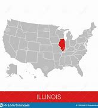

-
- pure
  collapsed:: true
	- American President Joe Biden again asked Congress to lift the United States debt limit after a meeting Wednesday with the nation’s business leaders.
	- The White House Council of Economic Advisors warned before the meeting that the United States government will default on its obligations if Congress does not raise the debt limit by October 18.
	- A default is a failure to meet the legal obligations of a loan.
	- The council said millions of Americans might not receive their payments from Social Security and government healthcare. A default could also affect national defense and pandemic services.
	- Since many countries depend on the U.S. monetary policy, it said a default “would likely cause credit markets worldwide to freeze up and stock markets to plunge. Employers around the world would likely have to begin laying off workers.”
	- What is the debt limit?
	- Like some of us, governments sometimes spend more money than they receive from taxes. So, they have to borrow money by issuing bonds, or debts, to be repaid later.
	- In the U.S., Congress has the power to set a debt limit. It is “the maximum amount of debt that the Department of the Treasury can issue to the public or to other federal agencies.”
	- Since 1960, Congress has changed the debt limit 78 times under both Republican and Democratic administrations to pay for government operations.
	- Raising the debt limit does not mean that Treasury has more money to spend. It only permits the U.S. government to “finance existing legal obligations.” When the limit is reached, the Treasury cannot issue more debt or borrow more money.
	- What is the current situation?
	- In August 2019, the U.S. Congress passed a budget deal, with support from both Republican and Democratic lawmakers, that raised spending and suspended the debt limit for two years.
	- Under the agreement, the money borrowed during the suspension of the debt limit will be added to the previous limit of $22 trillion. An additional $6.5 trillion had been borrowed since the 2019 tax cuts and pandemic spending, raising the nation’s debt limit to $28.5 trillion.
	- The Congressional Budget Office estimated that the federal government has a deficit of $2.7 trillion for the budget year ending in September 2021. The government also ran up deficits each year from 2016 to 2020.
	- Technically, the U.S. has already reached its debt limit at the end of July as agreed to in the 2019 budget deal. Once the debt limit is reached, the U.S. cannot borrow more money to pay its bills. But Treasury could and has used “extraordinary measures” like delaying some payments to employees’ retirement funds to avoid a default.
	- Unless Congress acts to raise the debt limit, the Bipartisan Policy Center projects that the U.S. will most likely reach the limit between October 15 and November 4. The center added that a default would likely raise borrowing costs as investors will demand a higher rate of return on U.S. debts. Even a short-term default, it said, could also threaten the country’s current economic recovery.
	- Why does the U.S. have a debt limit?
	- Before World War I, the U.S. Congress permitted borrowing only for special reasons, such as the building of the Panama Canal. In 1917, Congress passed a law that set a debt limit. It gave Treasury some flexibility in dealing with the national debt to pay for the war.
	- The U.S. is one of few countries around the world with a debt limit. Denmark is often noted as another developed country with a debt limit. But Denmark often sets its borrowing limit so high that a default is not really possible.
	- For many years in the U.S., raising the debt limit was not an issue. The Republican Party has since only supported increase while it has controlled the White House. It has argued against raising the limit under Democratic administrations.
	- Earlier this year, Democratic Congressman Bill Foster of Illinois introduced a bill to end the debt limit. The bill, however, is not guaranteed to pass with the currently divided legislature.
	- Late on Wednesday, Senate Republican leader Mitch McConnell told Democrats he would permit an emergency debt limit extension into December to avoid a default. If the offer is accepted, the U.S. will have to deal with the debt limit again by the end of the year.
- ---
- def
	- American President Joe Biden /again asked Congress /to lift the United States **debt limit** /after a meeting Wednesday /with the nation’s business leaders.
	- **The White House** Council of **Economic Advisors** /warned before the meeting that /the United States government /**will default(v.) on its obligations** /if Congress does not raise(v.) the debt limit /by October 18.
		- > ▶ default  (v.)(n.) **~ (on sth)** to fail to do sth that you legally have to do, especially by not paying a debt 违约；不履行义务（尤指不偿还债务）
		  => de-, 向下，强调。fault, 过错，欺骗。1858年用于商务术语，指欺骗，违约。1966年用于计算机名词，无可选项，默认选项。
		  -> **to default(v.) on a loan/debt** 拖欠借款╱债务
		  -> The company is **in default(n.) on the loan.** 这家公司拖欠借款。
		- > ▶ obligation (n.) the state of being forced to do sth because it is your duty, or because of a law, etc. 义务；职责；责任
		- 美国总统拜登, 星期三与美国商界领袖会晤后，再次要求国会提高美国的债务上限。
		  白宫经济顾问委员会, 在会议前警告说，如果国会在10月18日之前, 不提高债务上限，美国政府将拖欠债务。
	- A default is a failure /to meet the legal obligations of a loan.
		- > ▶ meet  [ VN ] to pay sth 支付；偿付
		  -> The cost will be met by the company. 费用将由公司支付。
	- The council said /millions of Americans /might not receive their payments from Social Security /and government healthcare. A default /could also affect(v.) **national defense** and **pandemic services**.
	- Since many countries **depend on** the U.S. **monetary(a.) policy**, it said /a default “would likely cause(v.) **credit markets** worldwide /to freeze up /and **stock markets** to plunge. Employers around the world /would likely have to begin **laying off** workers.”
		- > ▶ monetary (a.)[ only before noun ] connected with money, especially all the money in a country 货币的，钱的（尤指一国的金融）
		- > ▶ **lay off** PHRASAL VERB If workers are laid off, they are told by their employers to leave their job, usually because there is no more work for them to do. 解雇
		- 由于许多国家依赖于美国的货币政策，它说，违约"可能会导致全球信贷市场冻结, 和股市暴跌"。
	- ## What is the debt limit?
	- Like some of us, governments sometimes spend more money /than they receive from taxes. So, they have to borrow money /by issuing bonds, or debts, to be repaid(v.) later.
		- > ▶ bond [ C ] an agreement by a government or a company to pay you interest on the money you have lent; a document containing this agreement 债券；公债
		- > ▶ repay (v.)**~ sth (to sb) |~ (sb) (sth)** : to pay back the money that you have borrowed from sb 归还；偿还；清偿
		  -> **to repay a debt/loan/mortgage** 偿还债务╱贷款╱按揭贷款
		- 政府有时入不敷出。因此，他们必须通过发行债券或债务, 来借钱，之后才能偿还。
	- In the U.S., /Congress has the power /to set **a debt limit**. It is “**the maximum amount** of debt /that _the Department of the Treasury_ /can issue to the public /or to other federal agencies.”
		- 在美国，国会有权设定债务上限。这是“财政部可以向公众或其他联邦机构, 发行的最大债务金额。
	- Since 1960, Congress has changed **the debt limit** 78 times /under **both** Republican **and** Democratic administrations /to pay for government operations.
		- 自1960年以来，在共和党和民主党执政期间，国会已经78次改变债务上限，以支付政府运作的费用。
	- Raising(v.) the debt limit /does not mean that /Treasury has more money to spend. It only permits the U.S. government /to “finance(v.) existing legal obligations.” When the limit is reached, the Treasury cannot issue(v.) more debt /or borrow more money.
		- > ▶ finance (v.)[ VN ] to provide money for a project SYN fund 提供资金
		  -> The building project **will be financed(v.) by the government.** 这个建筑项目将由政府出资。
		- 提高债务上限, 并不意味着财政部有更多的钱可以花。它只是允许美国政府“为它现有的法律义务, 来提供资金支持”。当达到上限时，财政部就不能发行更多的债券, 或借入更多的钱。
	- ## What is the current situation?
	- In August 2019, the U.S. Congress /passed a budget deal, with support from both Republican and Democratic lawmakers, that raised(v.) spending /and suspended(v.) the debt limit /for two years.
		- 美国国会, 在共和党和民主党议员的支持下, 通过了一项预算协议，该协议提高了政府支出，并将债务上限的规定, 暂停行使两年。
	- Under the agreement, `主` the money /borrowed during the suspension of the debt limit /`谓` **will be added to** the previous limit of $22 trillion. An additional $6.5 trillion /had been borrowed /since the 2019 tax cuts /and pandemic spending, 结果状 **raising** the nation’s debt limit **to** $28.5 trillion.
		- 根据这项协议，暂停举债上限期间, 借入的资金, 将增加到此前22万亿美元的上限上。自2019年减税和对疫情的支出以来，又借入了6.5万亿美元，这将美国的债务上限提高到28.5万亿美元。
	- The Congressional Budget Office /estimated that /the federal government **has a deficit(n.) of** $2.7 trillion /**for the budget year** /ending in September 2021. The government also **ran up deficits** each year /from 2016 to 2020.
		- > ▶ deficit (n.)( economics 经 ) the amount /by which money spent or owed /is greater than money /earned in a particular period of time 赤字；逆差；亏损 /the amount by which sth, especially an amount of money, is too small or smaller than sth else 不足额；缺款额；缺少
		  -> **a budget/trade deficit** 预算赤字；贸易逆差
		  -> **There's a deficit of $3 million** in the total /needed to complete the project. 完成这项工程所需资金中有300万元的亏空。
		- > ▶ **run sth up** : (1) to allow a bill, debt, etc. to reach a large total 积欠（账款、债务等）；累积
		  SYN accumulate
		  -> How had he managed **to run up so many debts**? 他怎么欠了这么多债？
		- 国会预算办公室估计，在2021年9月结束的"预算年度"，联邦政府的赤字为2.7万亿美元。从2016年到2020年，政府的赤字每年都在增加。
	- Technically, the U.S. has already reached its debt limit /at the end of July /as agreed to /in the 2019 budget deal. Once the debt limit is reached, the U.S. cannot borrow more money /to pay its bills. But Treasury **could** and **has used** “extraordinary measures” /like delaying(v.) some payments to **employees’ retirement funds** /to avoid a default.
		- 从技术上讲，美国已经在7月底, 达到了2019年预算协议中同意的债务上限。一旦达到债务上限，美国就无法借到更多的钱来支付账单。但是财政部可以, 并且已经使用了“非常措施”，比如延迟支付雇员的退休基金, 以避免债务违约。
	- Unless Congress acts(v.) to raise the debt limit, the Bipartisan(a.) Policy Center /projects(v.) that /the U.S. will most likely reach the limit /**between** October 15 **and** November 4. The center added that /a default would likely raise borrowing costs /as investors will demand **a higher rate of return** on U.S. debts. Even a short-term default, it said, could also threaten the country’s current economic recovery.
		- > ▶ bipartisan (a.)involving two political parties 两党的；涉及两党的
		- > ▶ project (v.)[ usually passive ] to estimate what the size, cost or amount of sth will be in the future based on what is happening now 预测；预计；推想
		  -> The unemployment rate **has been projected to fall.** 据预测失业率将下降。
		- 除非国会采取行动, 提高债务上限，两党政策中心预计，美国很可能在10月15日至11月4日之间, 达到债务上限。该中心补充称，违约可能会提高借贷成本，因为投资者将要求更高的美国债务回报率。它说，即使是短期违约，也可能威胁到该国目前的经济复苏。
	- ## Why does the U.S. have a debt limit?
	- Before World War I, the U.S. Congress /permitted borrowing /only for special reasons, **such as** the building of the Panama Canal. In 1917, Congress passed a law /that set a debt limit. It gave Treasury some flexibility /**in dealing with** the national debt /to pay for the war.
		- > ▶ flexibility  n. 灵活性；弹性，柔性
	- The U.S. is one of few countries around the world /with a debt limit. Denmark is often noted as another developed country /with a debt limit. But Denmark often sets its borrowing limit **so** high /**that** a default is not really possible.
	- For many years in the U.S., /raising the debt limit /was not an issue. The Republican Party /has since only supported increase /while it has controlled the White House. It **has argued against** raising the limit /under Democratic administrations.
		- > ▶ argue (v.)~ (with sb) (about/over sth) to speak angrily to sb because you disagree with them 争论；争吵；争辩
		  **/~ (for/against sth) |~ (for/against doing sth)** to give reasons why you think that sth is right/wrong, true/not true, etc., especially to persuade people that you are right 论证；说理；争辩
		  -> They **argued for** the right to strike. 他们据理力争罢工权利。
		- 多年来，在美国，提高债务上限不是一个问题。从那以后，共和党只在控制白宫的情况下才支持增税。在民主党执政期间，它一直反对提高上限。
	- Earlier this year, Democratic Congressman _Bill Foster_ of Illinois /introduced a bill /to end the debt limit. The bill, however, **is not guaranteed to pass** /with the currently divided legislature.
		- > ▶ Congressman  （尤指美国众议院的）国会议员
		- > ▶ Illinois 美国州名
		  {:height 113, :width 106}
		- > ▶ guarantee (v.)to promise to do sth; to promise sth will happen 保证；担保；保障
		  ▶  **be guaranˈteed to do sth** : to be certain to have a particular result 肯定会；必定会
		- id:: 62316675-ac8a-486b-86cc-90e989eaab69
		  > ▶ legislature ( formal ) a group of people who have the power to make and change laws 立法机关
		- 提出了一项结束债务上限的议案。然而，该法案在目前处于分裂状态的立法机关, 无法保证一定会获得通过。
	- Late on Wednesday, **Senate Republican leader** Mitch McConnell /told Democrats /he would permit **an emergency debt limit extension** /into December /to avoid a default. If the offer is accepted, the U.S. will have to deal with the debt limit again /by the end of the year.
		- 他将允许将紧急债务上限延长至12月，以避免违约。
-