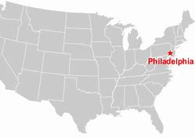
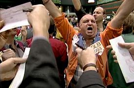

- pure
  collapsed:: true
	- The U.S. Congress passed the Voting Rights Act in 1965. Within months of its approval, the law permitted hundreds of thousands of African Americans to register to vote.
	- But as the law turns 56 this month, voting rights supporters say the legislation faces the most serious dangers yet to its existence.
	- One threat is a set of restrictive voting rules passed by Republican-controlled states across the nation. The other is a conservative-controlled Supreme Court which has steadily lessened the legal protections under the law.
	- State legislation to limit voting rights
	- The Brennan Center for Justice reported that nearly 400 bills described as election reform have been introduced in 49 states this year. Of these bills, 30 have been signed into law in 18 states.
	- The center said the laws will make it harder for Americans to vote. They include restrictions on mail voting and early voting. They also add stronger voter identification requirements and make it easier to remove certain voters.
	- Democrats called the new laws a form of voter suppression. In Texas, Democratic lawmakers even left the state to prevent the Republican majority from holding a vote.
	  U.S. President Joe Biden criticized the bills as an assault on hard-won voting rights. Speaking from Philadelphia in July, Biden said, "The 21st century Jim Crow assault is real.” The term was about the 19th- and 20th-century racial segregation laws. It is now used to describe voter suppression moves.
	- Republican officials behind the laws say they are meant to prevent fraud and bring back public confidence in elections. Georgia Governor Brian Kemp said of the state’s new election law, "Georgia will take another step toward ensuring our elections are secure, accessible and fair."
	- Rights to vote
	- The U.S. Constitution did not guarantee everyone the right to vote. Black men first gained the right to vote, after the Civil War, with the passage of the 15th Amendment in 1870. But some southern states still restricted the right to vote by requiring them to pay taxes or to pass a literacy test, setting off a long struggle for civil rights.
	- An important marker in the movement came on March 7, 1965. On that day, a group of 600 activists led by John Lewis marched from Selma, Alabama, to the state's capital, Montgomery, to register Black voters. They were violently attacked by police. Images of the incident known as "Bloody Sunday" were televised around the country. It caused a national outcry that brought support for voting rights legislation.
	- Lewis, who suffered a skull fracture in the march, went on to become a member of Congress. "It was worth the suffering of so many people. It was worthy of the blood that some of us gave," Lewis said in a 2015 interview with VOA.
	- On August 6, 1965, President Lyndon Johnson signed the Voting Rights Act into law. It outlawed the literacy tests that had made it almost impossible for many Blacks to register to vote. More importantly, it included two measures, known as Section 4 and Section 5, requiring states to get federal approval for any change in their voting laws and policies.
	- Marc Morial, a former mayor of New Orleans, now heads the National Urban League. He told VOA that the two sections “made democracy fair, level and evenhanded.”
	- Shelby County v. Holder
	- Both Congress and the U.S. Supreme Court supported the law throughout the 1970s and 1980s.
	- Then, in 2013, the Supreme Court weakened the law, voting 5-4 to cancel Section 4. The ruling effectively ended the requirement that states, mainly in the south, have to get federal approval for any change in their voting laws and policies.
	- In the 50 years since the Voting Rights Act's passage, Chief Justice John Roberts wrote that "things have changed dramatically" in the areas that are subject to the law, making the requirement unnecessary.
	- Within hours of the ruling, the state of Texas announced that it would immediately require a photo identification to vote. That state law had been blocked under the Voting Rights Act. Soon, other states did the same thing.
	- Earlier this year, the Supreme Court approved two Arizona voting rules that were not permitted under the act. The first rule throws out votes entered in the wrong polling area. The second makes it a crime for anyone other than family members or caregivers to collect a voter's ballot.
	  Democrats argued that both rules made voting more difficult for minority voters - in violation of Section 2. But the six conservative justices of the Supreme Court rejected the argument that the voting laws cause unnecessary problems for voters.
	- New voting rights laws
	- Viewing the Supreme Court as hostile to voting rights, Democrats have introduced two bills in Congress to protect the gains of the Voting Rights Act.
	- The John Lewis Voting Rights Advancement Act would once again require certain areas to get federal approval for changing their voting rules.
	- Another legislation, known as the For the People Act, would create automatic voter registration across the country, restore voting rights to criminals who have completed their sentences, and expand early and mail voting, among other measures.
	- Republican opposition makes it unlikely that the two proposals will pass this year.
- ---
- def
	- The U.S. Congress /passed **the Voting Rights Act** in 1965. Within months of its approval, the law permitted hundreds of thousands of African Americans /to register to vote.
	- But as the law turns 56 /this month, voting rights supporters say /the legislation faces the most serious dangers yet to its existence.
	- One threat is **a set of** restrictive voting rules /passed by Republican-controlled states across the nation. The other is a conservative-controlled **Supreme Court** /which has steadily lessened(v.) the legal protections /under the law.
		- id:: 62316f64-7feb-43b1-a425-ce70b0eba349
		  > ▶ conservative (a.)opposed to great or sudden social change; showing that you prefer traditional styles and values 保守的；守旧的
		  -> **the conservative views** of his parents 他父母的保守观念
		  + /(n.) ( usually Conservative ) (abbr. Con ) a member or supporter of the British Conservative Party （英国）保守党党员，保守党支持者
		- > ▶ lessen (v.)to become or make sth become smaller, weaker, less important, etc. （使）变小，变少，减弱，减轻
		- 一个威胁是, 共和党控制的州, 在全国范围内, 通过的一系列限制性投票规则。另一个威胁是由保守派控制的最高法院，该法院一直在不断削弱法律所赋予的法律保护。
	- ## State legislation to limit(v.) voting rights
	- The Brennan Center for Justice /reported that /`主` nearly 400 bills /described as election reform `谓` /have been introduced in 49 states this year. Of these bills, 30 have been **signed into law** /in 18 states.
		- > ▶ sign (v.)to write your name on a document, letter, etc. to show that you have written it, that you agree with what it says, or that it is genuine 签（名）；署（名）；签字；签署 /to arrange for sb, for example a sports player or musician, to sign a contract agreeing to work for your company; to sign a contract agreeing to work for a company 和…签约（或应聘）
	- The center said /the laws will make it harder /for Americans to vote. They include restrictions /on mail voting and early voting. They also add stronger **voter identification requirements** /and make it easier /to remove certain voters.
		- > ▶ identification (abbr. ID ) [ UC ] the process of showing, proving or recognizing who or what sb/sth is 鉴定；辨认 / the process of recognizing that sth exists, or is important 确认；确定
		  -> Each product has a number for easy identification. 每件产品都有号码以便于识别。
		- 它们还增加了更严格的选民身份要求，并使删除某些选民更容易。
	- Democrats called the new laws /宾补 a form of voter suppression. In Texas, Democratic lawmakers /even left the state /**to prevent** the Republican majority **from** holding a vote.
	- U.S. President Joe Biden /**criticized** the bills **as** an assault /on hard-won(a.) **voting rights**. Speaking from Philadelphia in July, Biden said, "The 21st century **Jim Crow assault** is real.” The term was about the 19th- and 20th-century **racial segregation** laws. It is now used /to describe **voter suppression** moves.
		- > ▶ suppression [ U ] the act of suppressing sth 镇压；压制；抑制
		- > ▶ assault (n.)[ UC ] **~ (on/upon sb)** the crime of attacking sb physically 侵犯他人身体（罪）；侵犯人身罪 /**~ (on/upon/against sb/sth)** ( by an army, etc. 军队等 ) the act of attacking a building, an area, etc. in order to take control of it 攻击；突击；袭击
		  => 前缀as-同ad-. -sault, 来自词根sal, 跳，见salmon,鲑鱼，跳鱼。-t, 构成反复格。
		  -> **sexual assaults** 性攻击（指强奸、猥亵）
		- > ▶  hard-won (a.)that you only get after fighting or working hard for it 经奋斗（或努力）得到的；来之不易的
		- > ▶ Philadelphia  /ˌfɪləˈdelfɪr/ 美国城市名
		  {:height 62, :width 130}
		- id:: 6231769b-8b88-44b3-98ad-208593d7eea8
		  > ▶ segregation :  the act or policy of separating people of different races, religions or sexes and treating them in a different way （对不同种族、宗教或性别的人所采取的）隔离并区别对待，隔离政策 / 隔离（或分离）措施
		  -> **racial/religious segregation** 种族╱宗教隔离
		- 美国总统拜登批评这些法案侵犯了来之不易的投票权。今年7月，拜登在费城表示，“21世纪的吉姆·克劳式攻击是真实的。”这个词是关于19世纪和20世纪的种族隔离法律的。现在它被用来描述选民压制行动。
	- Republican officials **behind the laws** say /they are meant to prevent fraud /and bring back public confidence in elections. Georgia Governor Brian Kemp said /of the state’s new election law, "Georgia will take another step toward /ensuring our elections are secure, accessible and fair."
		- > ▶ fraud 欺诈罪；欺骗罪 /骗子；行骗的人
		-
	- ## Rights to vote
	- The U.S. Constitution /did not guarantee everyone /the right to vote. Black men first gained the right to vote, after the Civil War, with **the passage** of the 15th Amendment in 1870. But some southern states /still restricted the right to vote /by requiring them to pay taxes /or to pass a literacy test, **setting off** a long struggle for civil rights.
		- > ▶ passage :  a short section from a book, piece of music, etc. 章节；段落；乐段 /a ~ (through sth) a way through sth 通路；通道
		  / the process of discussing a bill in a parliament so that it can become law 通过
		  -> The bill is now guaranteed **an easy passage** through the House of Representatives. 现在该法案保证能在众议院顺利通过。
		- > ▶ amendment (n.)[ CU ] ~ (to sth) a small change or improvement that is made to a law or a document; the process of changing a law or a document （法律、文件的）改动，修正案，修改，修订
		  /Amendment [ C ] a statement of a change to the Constitution of the US （美国宪法的）修正案
		  -> to introduce/propose/table an amendment (= to suggest it) 提出一项修正案
		- id:: 62317ba3-2bf8-48df-be50-5916a361a6da
		  > ▶ **set sth off** (3) to start a process or series of events 引发；激起 /(1) to make a bomb, etc. explode 使（炸弹等）爆炸
		  -> Panic on the stock market **set off a wave of selling**. 股市恐慌引发了一轮抛售潮。
		  ▶ **set ˈoff** : to begin a journey 出发；动身；启程
		- 美国宪法, 并没有保证每个人都有选举权。南北战争之后，黑人在1870年通过了第15条修正案，从而第一次获得了投票权。但一些南方州, 仍然通过要求他们纳税, 或通过识字测试, 来限制他们的投票权，这引发了一场旷日持久的民权斗争。
	- **An important marker** in the movement /came on March 7, 1965. On that day, `主` a group of 600 activists /led by John Lewis /`谓` marched from Selma, Alabama, to the state's capital, Montgomery, to register(v.) Black voters. They were violently attacked by police. `主` Images of the incident /known as "Bloody Sunday" /`谓` were televised(v.) around the country. It caused a national outcry(n.) /that brought support for **voting rights legislation**.
		- > ▶ marker : an object or a sign that shows the position of sth （表示方位的）标记，记号 / **a ~ (of/for sth)** a sign that sth exists or that shows what it is like 标志；标识；表示
		  -> Price is not always **an accurate marker** of quality. 价格并不总是质量的准确标志。
		- > ▶ Montgomery 属于姓氏, 地名
		- > ▶ register (v.)~ (at/for/with sth)~ sth (in sth)~ (sb) as sth to record your/sb's/sth's name on an official list 登记；注册
		  / ( formal ) to make your opinion known officially or publicly （正式地或公开地）发表意见，提出主张
		  -> China **has registered a protest** over foreign intervention. 中国对外国干涉正式提出了抗议。
		- id:: 62317d72-2241-4b78-9756-79da4d5ee746
		  > ▶ outcry (n.)**~ (at/over/against sth)** a reaction of anger or strong protest shown by people in public 呐喊；怒吼；强烈的抗议
		  -> **an outcry over the** proposed change 对拟议的改革所发出的强烈抗议
		  {:height 81, :width 111}
		- 1965年3月7日, 是这一运动的一个重要里程碑。在那一天，由约翰·刘易斯领导的600名活动人士, 从阿拉巴马州的塞尔玛, 游行到该州首府蒙哥马利，为黑人选民登记。他们遭到警察的猛烈袭击。这一被称为“血腥星期天”的事件的画面, 在全国各地播出。这引起了全国的强烈抗议，并为投票权立法带来了支持。
	- Lewis, who suffered **a skull fracture** /in the march, **went on** to become a member of Congress. "It was worth(a.) /the suffering of so many people. **It was worthy(a.) of** the blood /that some of us gave," Lewis said /in a 2015 interview with VOA.
		- > ▶ fracture [ C ] a break in a bone or other hard material （指状态）骨折，断裂，折断，破裂
		- > ▶ worthy (a.)~ (of sb/sth) ( formal ) having the qualities that deserve sb/sth 值得（或应得）…的
		  -> **to be worthy of attention** 值得注意
		- Lewis在游行中头骨骨折，后来成为国会议员。
	- On August 6, 1965, President Lyndon Johnson /**signed** the Voting Rights Act **into law**. It outlawed(v.) the literacy tests /that had made it almost impossible /for many Blacks to register(v.) to vote. More importantly, it included two measures, known as Section 4 and Section 5, requiring states to get federal approval /for any change /in their voting laws and policies.
		- > ▶ outlaw (v.)to make sth illegal 宣布…不合法；使…成为非法 /（旧时）剥夺（某人的）法律权益
		- 林登·约翰逊总统, 签署了《投票权法案》, 成为法律。它取缔了使许多黑人几乎不可能登记投票的识字测试。更重要的是，它包括了两项措施，即第4条和第5条，要求各州在修改其选举法和政策时, 必须得到联邦政府的批准。
	- Marc Morial, **a former mayor** of New Orleans, now heads the National Urban League. He told VOA that /the two sections “**made** democracy **fair(a.), level(a.) and evenhanded(a.)**.”
		- > ▶ urban (a.)connected with a town or city 城市的；都市的；城镇的
		- > ▶ level  (a.)~ (with sth) having the same height, position, value, etc. as sth 等高的；地位相同的；价值相等的
		  -> This latest rise is intended **to keep wages level(a.) with inflation**. 最近这次加薪目的是使工资与通货膨胀保持相同的水平。
		- > ▶ evenhanded ADJ If someone is evenhanded, they are completely fair, especially when they are judging other people or dealing with two groups of people. 公平无私的; 不偏不倚的
		  => even : smooth, level and flat 平滑的；平的；平坦的
		- 前市长..，现任全国城市联盟(National Urban League)主席。他对美国之音表示，这两个部分“使民主变得公平、公平和公正。”
	- ## Shelby County v. Holder
	- Both Congress and the U.S. Supreme Court /supported the law /throughout the 1970s and 1980s.
		- > ▶ throughout : during the whole period of time of sth 自始至终；贯穿整个时期
	- Then, in 2013, the Supreme Court /weakened the law, voting 5-4 to cancel Section 4. `主` The ruling `谓` effectively ended(v.) the requirement /that `主` states, mainly in the south, `谓` have to get federal approval /for any change in their voting laws and policies.
		- > ▶ ruling (n.)~ (on sth) an official decision made by sb in a position of authority, especially a judge 裁决；裁定；判决 / (a.)[ only before noun ] having control over a particular group, country, etc. 统治的；支配的；占统治地位的
		- 然后，在2013年，最高法院以5比4的投票结果, 削弱了该法律，取消了第4条。这一裁决有效地结束了各州(主要是南部各州)必须得到联邦政府批准, 才能修改投票法律和政策的要求。
	- In the 50 years /since **the Voting Rights Act's** passage, **Chief Justice** John Roberts /wrote that /"things have changed dramatically" in the areas /that are subject to the law, making the requirement unnecessary.
		- 《投票权法案》通过50年来，首席大法官John Roberts 写道，在受法律约束的领域，“情况发生了巨大变化”，这使得该法律要求, 没有必要再存在了。
	- Within hours of the ruling, the state of Texas /announced that /it would immediately require a photo identification to vote. That state law had been blocked /under **the Voting Rights Act**. Soon, other states /did the same thing.
		- 判决出台仅仅几个小时后，德克萨斯州就宣布, 将立即要求选民出示有照片的身份证件。而在之前的《投票权法案》中, 这条规定是被禁止的。很快，其他州也做了同样的事情。
	- Earlier this year, the Supreme Court /approved two Arizona voting rules /that were not permitted under the act. The first rule /**throws out** votes /entered in the wrong polling area. The second /makes it a crime /for anyone **other than** family members or caregivers /to collect a voter's ballot.
		- > ▶ **throw sb out (of...)**: to force sb to leave a place 撵走；轰走；逐出
		  ▶ **throw sth out** (2) to decide not to accept a proposal, an idea, etc. 拒不接受，否决（建议、想法等）
		- > ▶ OTHER THAN (1) except 除…以外
		  -> I don't know any French people **other than** you. 除了你，我不认识别的法国人。
		- > ▶ caregiver /ˈkerɡɪvər/  = carer : ( BrE ) ( NAmE care·giver ) a person who takes care of a sick or old person at home 照料家居老弱病患者的人；家庭护理员
		- > ▶ ballot  /ˈbælət/ [ UC ] the system of voting in writing and usually in secret; an occasion on which a vote is held （无记名）投票选举；投票表决 /选票
		  (v.)**~ sb (on sth)** to ask sb to vote in writing and secretly about sth 要求某人（对某事）无记名投票
		- 今年早些时候，最高法院批准了亚利桑那州的两项投票规则，而这在《投票权法案》中也是不允许的。第一条规则是: 在错误的投票区, 所投的选票, 将不被计算。第二项规定是，除了家庭成员或护理人员外，任何人收集选民选票都是犯罪行为。
	- Democrats argued that /`主` both rules `谓` **made voting /more difficult** for minority voters - **in violation of** Section 2. But `主` the six **conservative justices** /of the Supreme Court /`谓` rejected the argument /that the voting laws /cause(v.) unnecessary problems for voters.
		- > ▶ minority  (n.) 少数；少数派；少数人 /link 少数民族；少数群体
		- > ▶ violation  n. （对法律、协议、原则等的）违背，违反；侵权行为
		- ((62316f64-7feb-43b1-a425-ce70b0eba349))
		- 民主党人认为，这两项规定, 使少数族裔选民的投票更加困难，违反了《投票权法案》中的第二部分。但是，最高法院的6名保守派法官, 驳回了"投票法 会给选民造成不必要问题"的这种说法。
	- ## New voting rights laws
	- **Viewing** the Supreme Court **as** hostile(a.) to voting rights, Democrats **have introduced** two bills in Congress /to protect the gains of the Voting Rights Act.
		- > ▶ hostile  (a.)~ (to/towards sb/sth) very unfriendly or aggressive and ready to argue or fight 敌意的；敌对的 /~ (to sth) strongly rejecting sth 坚决否定；强烈反对
		  -> hostile to the idea of change 强烈反对变革
	- The John Lewis **Voting Rights Advancement Act** /would once again require(v.) certain areas /to get federal approval /for changing their voting rules.
	- Another legislation, known as **the For the People Act**, would create automatic **voter registration** /across the country, **restore** voting rights **to** criminals /who have completed their sentences, and expand(v.) **early and mail voting**, among other measures.
		- > ▶ advancement  [ UC ] the process of helping sth to make progress or succeed; the progress that is made 促进；推动；发展；前进
		- > ▶  voter registration 选民登记
		- > ▶ sentence :  the punishment given by a court 判决；宣判；判刑
		- 民主党认为最高法院敌视投票权，并向国会提交了两项法案，以保护《投票权法案》的成果。
		  《John Lewis  投票权促进法案》将再次要求某些地区, 若要修改投票规则, 必须得到联邦政府的批准。
		  另一项名为《为了人民法案》(For the People Act)的立法, 将在全国范围内建立自动选民登记制度，恢复服刑期满的罪犯的投票权，并扩展"提前投票, 和邮寄投票等措施"。
	- Republican opposition /makes it unlikely /that the two proposals will pass /this year.
		- > ▶ opposition  [ U ] **~ (to sb/sth)** the act of strongly disagreeing with sb/sth, especially with the aim of preventing sth from happening （强烈的）反对，反抗，对抗
		- 共和党的反对, 使得这两项提案, 今年不太可能获得通过。