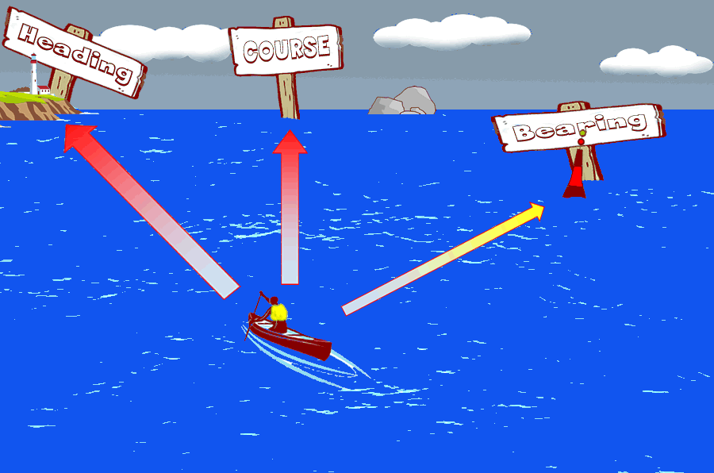

title:: 027 Discussing Moral Issues: Important Structures and Terms

- # 027 Discussing Moral Issues: Important Structures and Terms
- pure
  collapsed:: true
	- Imagine that you want to talk about moral issues – your opinion about what is correct behavior and what is incorrect behavior.
	- You might want to talk about your actions or the actions of another. What kinds of terms and structures should you use?
	- In today’s Everyday Grammar, we will explore a point of connection between grammar and moral issues. You will learn about adjectives, sentence patterns, and expressions of necessity.
	- Subject + BE + subject complement
	- Discussions about morality often involve adjectives such as “right” or “wrong.”
	- For example, an action is right or an action is wrong.
	- The central structure for these kinds of statements is this:
	- Subject + BE + subject complement.
	- The subject complement is often an adjective.
	- Common positive adjectives include right, correct, appropriate or justified.
	- Common negative adjectives include wrong, incorrect, terrible, or unjustified.
	- A person might say, “My decision was appropriate,” “their behavior was terrible,” “we were wrong,” and so on.
	- But there are many other ways a person can describe their opinion of an action.
	- Let’s listen to a few words from United States President Joe Biden’s recent State of the Union speech. In the speech, he makes clear that he believes the actions of Russia are incorrect.
	- Putin’s attack on Ukraine was premeditated and totally unprovoked.
	- “Putin’s attack on Ukraine” is the subject of the sentence. Was – the past tense of BE – is the main verb. “Premeditated” and “unprovoked” are terms that describe the attack.
	- “Premeditated” is an adjective that means done or made according to a plan. Legal cases often use this term. A person might be convicted of premeditated murder, for example.
	- “Unprovoked” means not caused by anything said or done. For example, a news story might describe an “unprovoked attack.” This means that one person or group was not doing or saying anything that would give reason for an attack.
	- Necessity
	- Another key area of grammar that connects with discussions about moral issues is the idea of necessity – an action must or must not be done. English speakers use several structures to express necessity, but some of the important ones are “need to...” and “have got to …” or “have got to do....”
	- For example, imagine you hear a story about a disagreement between two of your family members.
	- You might say, “You need to apologize to him,” or “he needs to apologize to you.”
	- In both examples, you are saying that the right action to take is for one person to apologize to the other.
	- You might also use “have got to...” to express a similar idea, as in “You have got to apologize to him.”
	- Let’s listen to UK Prime Ministry Boris Johnson use the structure “have got to do ...” to talk about what he believes is a correct course of action.
	- We’ve got to do everything we can to change the heavy odds that Ukraine faces.
	- You might use “have got to do ...” to describe any number of moral issues. Imagine you have a friend who needs your help. You believe it is right to help him or her. You could say, “I have got to do something to help my friend.”
	- Closing
	- This report explored a few ways that English speakers talk about moral issues. There are certainly many other ways – politicians, religious experts and normal people have debated moral questions for a long time.
	- This report ends with a kind of homework project. Choose some kind of a moral question that interests you. Then find examples – films, news broadcasts, podcasts, and so on – that explore that moral question. Pay careful attention to the terms and structures that the speakers use. Then try to use what you have learned to describe your own opinion on the issue.
- ---
- ## def
	- Imagine that /you want to talk about **moral issues** – your opinion/ about what is correct behavior /and what is incorrect behavior.
		- > ▶ moral (a.)(n.)morals [ pl. ] standards or principles of good behaviour, especially in matters of sexual relationships 品行，道德（尤指性关系方面）
	- You might want to talk about your actions /or the actions of another. What kinds of terms and structures /should you use?
		- > ▶ term 词语；术语；措辞
	- In today’s Everyday Grammar, we will explore a point of connection /between grammar and moral issues. You will learn about adjectives, **sentence patterns**, and expressions of necessity.
		- > ▶ sentence pattern 句型句式
	- ## Subject + BE + subject complement
	- Discussions about morality /often involve adjectives such as “right” or “wrong.”
		- > ▶ morality (n.) principles concerning right and wrong or good and bad behaviour 道德；道德准则；道义
	- For example, an action is right /or an action is wrong.
	- `主` The central structure /for these kinds of statements /`系` is this:
	- Subject + BE + subject complement.
		- > ▶ subject (n.)a thing or person that is being discussed, described or dealt with 主题；题目；话题；题材；问题 /主语
		- > ▶ complement (n.)~ (to sth) a thing that adds new qualities to sth in a way that improves it or makes it more attractive 补充物；补足物 /补足语；补语
	- The **subject complement** is often an adjective.
	- Common **positive(a.) adjectives** /include right, correct, appropriate or justified.
	- Common **negative(a.) adjectives** /include wrong, incorrect, terrible, or unjustified.
		- > ▶ positive  (a.)~ (about sth) thinking about what is good in a situation; feeling confident and sure that sth good will happen 积极乐观的；自信的 /directed at dealing with sth or producing a successful result 积极的；建设性的；朝着成功的
		  /(n.)a good or useful quality or aspect 优势；优点
		  -> **a positive attitude/outlook** 乐观的态度╱前景
		- > ▶ negative (a.)bad or harmful 坏的；有害的 /considering only the bad side of sth/sb; lacking enthusiasm or hope 消极的；负面的；缺乏热情的 /否定的
		  -> **His response was negative.** 他的回答是否定的。
		- > ▶ appropriate (a.)~ (for/to sth) suitable, acceptable or correct for the particular circumstances 合适的；恰当的
		  -> **an appropriate response/measure/method** 恰如其分的反应；恰当的措施╱方法
	- A person might say, “My decision was appropriate(a.),” “their behavior was terrible,” “we were wrong,” and so on.
	- But there are many other ways /a person can describe their opinion of an action.
	- Let’s listen to a few words /from United States President Joe Biden’s /recent State of the Union speech. In the speech, he makes clear that /he believes the actions of Russia are incorrect.
	- Putin’s attack on Ukraine /was premeditated(a.) /and totally unprovoked(a.).
		- > ▶ premeditated (a.)( of a crime or bad action 罪恶或恶行 ) planned in advance 预谋的；事先策划的
		  => pre-,在前，早于，预先，mediate,沉思，谋划。
		- > ▶ unprovoked (a.)( especially of an attack 尤指攻击 ) not caused by anything the person being attacked has said or done 未受挑衅的；无端的
		  -> an act of unprovoked aggression 无端的侵犯行为
		  => provoke (v.)V-T If **you provoke(v.) someone**, you deliberately annoy them and try to make them behave aggressively. 对…挑衅 /V-T If **something provokes a reaction**, it causes it. 引起
	- “Putin’s attack on Ukraine” is the subject of the sentence. Was – the past tense of BE – is the main verb. “Premeditated” and “unprovoked” are terms /that describe the attack.
	- “Premeditated” is an adjective /that means /done or made according to a plan. **Legal cases** often use this term. A person **might be convicted(v.) of** premeditated murder, for example.
		- id:: 62328e22-125c-44c5-8004-2116bfa1e5fa
		  > ▶ legal  ADJ Legal is used to describe things that relate to the law. 法律的 /ADV 在法律上
		- > ▶ convict (v.)**~ sb (of sth)** to decide and state officially in court that sb is guilty of a crime 定罪；宣判…有罪
		  -> He was convicted of fraud. 他被判犯有诈骗罪。
		- 法律案件中经常使用这个术语。例如，一个人可能会被判有预谋的谋杀。
	- “Unprovoked” means /not caused by anything said or done. For example, a news story might describe /an “unprovoked attack.” This means that /one person or group /was not doing or saying anything /that would give reason for an attack.
		- “Unprovoked 无缘无故”指的不是因为说了什么或做了什么而引起的。
	- ## Necessity
	- `主` Another **key area** of grammar /that connects with **discussions about moral issues** /`系` is **the idea of necessity** – an action /must or must not be done. English speakers use(v.) several structures /to express necessity, but some of the important ones /are “need to...” and “have got to …” or “have got to do....”
		- > ▶ idea : ~ (of sth) a picture or an impression in your mind of what sb/sth is like 印象；概念
		  -> **I had some idea of** what the job would be like. 我对于这份工作有了一些了解。
		- 另一个关键地方, 是"necessity(必要性)"的概念
	- For example, imagine(v.) /you hear a story about a disagreement /between two of your family members.
		- > ▶ disagreement (n.)**~ (about/on/over/as to sth) |~ (among...)|~ between A and B** : a situation where people have different opinions about sth and often argue 意见不一；分歧；争论
		  -> They have had several disagreements with their neighbours. 他们与邻居发生过好几次争吵。
	- You might say, “You need to apologize to him,” or “he needs to apologize to you.”
	- In both examples, you are saying that /the right action to take /is for one person to apologize to the other.
	- You might also use “have got to...” /to express a similar idea, as in “You have got to apologize to him.”
	- Let’s listen to UK **Prime Ministry** Boris Johnson /use the structure “have got to do ...” /to talk about /what he believes is **a correct course of action**.
		- > ▶ course (n.) a direction or route followed by a ship or an aircraft （船或飞机的）航向，航线 /[ Cusually sing. ] the general direction in which sb's ideas or actions are moving 方针；行动方向 
		  /( also ˌcourse of ˈaction ) [ C ] a way of acting in or dealing with a particular situation 行动方式；处理方法
		  => 来自词根cur, 跑，词源同car, current.
		  -> The plane **was on/off course** (= going/not going in the right direction) . 飞机航向正确╱偏离。
		  -> **There are various courses** open to us. 我们有多种处理方法可采取。
		  {:height 107, :width 143}
		- 让我们听一听英国首相鲍里斯·约翰逊, 使用“have got to do…” 来谈论他认为正确的行动方针。
	- **We’ve got to** do everything we can /to change **the heavy odds** /that Ukraine faces.
		- > ▶ odds  (n.)something that makes it seem impossible to do or achieve sth 不利条件；掣肘的事情；逆境 /( usually the odds ) the degree to which sth is likely to happen （事物发生的）可能性，概率，几率，机会
		  -> **Against all (the) odds** , he made a full recovery. 在凶多吉少的情形下，他终于完全康复了。
		- 我们必须尽一切努力, 来改变乌克兰所面临的严峻形势。
	- You might use “have got to do ...” to describe any number of moral issues. Imagine you have a friend /who needs your help. You believe /it is right to help him or her. You could say, “I have got to do something /to help my friend.”
	- ## Closing
	- This report /explored a few ways /that English speakers talk about moral issues. There are certainly many other ways – politicians, religious experts and normal people /have debated moral questions /for a long time.
		- ((62313b00-775d-416d-9414-a9d60cd66f76))
	- This report **ends with** a kind of homework project. Choose some kind of a moral question /that interests you. Then find examples – films, news broadcasts(n.), podcasts, and so on – that explore(v.) that moral question. **Pay careful attention to** the terms and structures /that the speakers use(v.). Then try to use what you have learned /to describe your own opinion /on the issue.
		- > ▶ broadcast (n.)(v.)to send out programmes on television or radio 播送（电视或无线电节目）；广播 /[ VN ] to tell a lot of people about sth 散布，传播（信息等）
		- > ▶ podcast 播客
		- 本报告, 会以家庭作业项目的形式结束。选择一个你感兴趣的道德问题。然后找一些例子——电影、新闻广播、播客等等——来探究这个道德问题。仔细注意说话者使用的术语和结构。然后试着用你所学到的措辞, 来描述你对这个问题的看法。
-