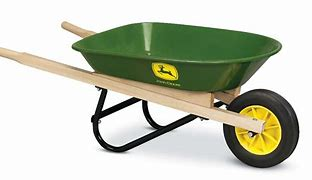

title:: 029 What Is the US Senate?

- pure
  collapsed:: true
	- The Senate is one of the two parts of the United States Congress, the legislature that makes the country’s laws.
	- The Congress has two parts because the men who wrote the U.S. Constitution could not agree on details of the new form of government.
	- Men from states with large populations thought they should be able to send more lawmakers to Congress. After all, their states had more people.
	- But men from states with smaller populations thought each state should have the same number of lawmakers. After all, people in small states did not want their voices to be lost.
	- So the Constitution-writers agreed that part of Congress should be based on states’ populations, and the other part of Congress should have equal representation.
	- The Senate is the part with equal representation. Each state has two senators, no matter how big or small its population.
	- Differences between the Senate and House
	- The Constitution-writers expected members of the Senate – called senators – to help set limits on the office of the president. They gave senators the power to decide whether to try and remove the president and other government officials accused of wrongdoing. Senators also approve or reject the president’s choices for top government positions, including Supreme Court justices. And senators have powers to approve treaties with other countries.
	- At the same time, the Constitution-writers wanted the Senate to limit what they feared would be the strong emotions of voters. James Madison called it a “fence” against the passion of the people.
	- George Washington reportedly said the Senate would “cool” laws proposed by House members, who were more closely connected with everyday Americans.
	- Because senators have so much responsibility, the Constitution-writers required them to be a little older than House members – at least 30 years old, compared to 25. And they decided that each senator would serve six years – compared to two for members of the House. A longer time in office would make the Senate stronger and reduce political pressures, they reasoned.
	- However, not all senators finish their terms at once. Every two years, one-third of senators must leave their office or seek re-election. The other two-thirds remain in place.
	- Finally, the Constitution-writers decided that state lawmakers would elect the state’s senators. This situation would permit states some additional power in the federal government. However, in 1913, the Constitution was changed to permit voters to elect senators directly.
	- The work of the Senate
	- The Senate does its lawmaking work through 16 regular committees. They study and make decisions on the federal budget, foreign relations, national laws and other issues.
	- Senators also gather together to talk – a lot – about why they plan to vote a certain way, and why other senators should support them. Unlike in the House of Representatives, the Senate permits senators to debate at length.
	- Because of all their talk, the Senate has been called the world’s “greatest deliberative body.”
	- But others have pointed out that the Senate is a group of very different, independent individuals. Getting a majority to agree can be extremely difficult. One former Senate leader said trying to get them to move together was like “herding cats.” Another described it as “loading frogs into a wheelbarrow.”
- ---
- def
	- The Senate is one of the two parts of the United States Congress, the legislature /that makes the country’s laws.
		- ((62316675-ac8a-486b-86cc-90e989eaab69))
	- The Congress has two parts /because the men /who wrote the U.S. Constitution /**could not agree on details of** the new form of government.
		- 国会分为两部分，因为撰写美国宪法的人, 无法就新政府形式的细节达成一致。
	- Men /from states with large populations/ thought(v.)  they should be able to **send** more lawmakers **to** Congress. After all, their states had more people.
	- But men /from states with smaller populations /thought(v.) each state should have the same number of lawmakers. After all, people in small states /did not want their voices to be lost.
	- So the Constitution-writers agreed that /part of Congress /should be based on states’ populations, and the other part of Congress /should have equal representation.
		- 因此，宪法制定者同意, 国会中(两院)的一部分应该以各州的人口为基础，而另一部分应该有平等的代表权。
	- The Senate is the part /with equal representation. Each state has two senators, **no matter** how big or small its population.
	- ## Differences between the Senate and House
	- The Constitution-writers expected /members of the Senate – called senators – to help **set(v.) limits on** the office of the president. They gave senators the power /to decide /whether to try and remove the president and other government officials /accused of wrongdoing. Senators **also approve or reject** the president’s choices /for top government positions, including **Supreme Court justices**. And senators have powers /to approve treaties with other countries.
		- > ▶ treaty  ˈtriːti/ (n.)a formal agreement between two or more countries （国家之间的）条约，协定
		- 参议员们还批准或否决总统对包括最高法院法官在内的政府高层职位的选择。参议员有权批准与其他国家签订的条约。
	- At the same time, the Constitution-writers /wanted the Senate to limit /what they feared would be the strong emotions of voters. James Madison called it /a “fence” against the passion of the people.
	- George Washington reportedly said /the Senate would “cool”(v.) laws /proposed by House members, who **were more closely connected with** everyday Americans.
		- 据报道，乔治·华盛顿(George Washington)曾表示，参议院要能“冷却”众议院议员提出的法律，这些众议员与普通美国人的联系更为密切。
	- Because senators have so much responsibility, the Constitution-writers /required them to be a little older than House members – at least 30 years old, compared to 25. And they decided that /each senator would serve six years – compared to two /for members of the House. A longer time in office /would make the Senate stronger /and reduce(v.) political pressures, they reasoned.
		- > ▶ reason (v.)to form a judgement about a situation by considering the facts and using your power to think in a logical way 推理；推论；推断
		  -> They couldn't fire him, **he reasoned**. 他分析他们不会解雇他。
	- However, not all senators /finish(v.) their terms at once. Every two years, one-third of senators /must leave their office /or seek re-election. The other two-thirds /remain in place.
	- Finally, the Constitution-writers decided that /state lawmakers /would elect the state’s senators. This situation would permit states /some additional power /in the federal government. However, in 1913, the Constitution was changed /to permit voters /to elect senators directly.
		- 宪法制定者决定, 从州议员中, 来选举出各州的参议员。这允许各州在联邦政府中拥有一些额外的权力。然而，在1913年，宪法被修改，允许选民直接选举参议员。
	- ## The work of the Senate
	- The Senate /does its lawmaking work /through 16 regular committees. They study /and make decisions /on the federal budget, foreign relations, national laws /and other issues.
		- > ▶ regular (a.)following a pattern, especially with the same time and space in between each thing and the next 规则的；有规律的；间隙均匀的；定时的
		  -> There is **a regular bus service** to the airport. 有班车定时发往机场。
		- 参议院通过16个定期委员会, 来进行立法工作。
	- Senators also **gather together** /**to talk – a lot – about** why they plan to vote a certain way, and why other senators /should support them. Unlike in the House of Representatives, the Senate permits(v.) senators /to debate **at length**.
		- > ▶ **AT ˈLENGTH | AT... LENGTH** : (1) for a long time and in detail 长时间；详尽地
		  -> We have already discussed this matter **at great length**. 我们已经十分详尽地讨论了这个问题
		- 与众议院不同，参议院允许参议员进行长时间的辩论。
	- Because of all their talk, the Senate has been called the world’s “greatest deliberative body.”
		- > ▶ deliberative  ADJ A deliberative institution or procedure has the power or the right to make important decisions. 审议的
	- But others have pointed out that /the Senate is a group of very different, independent individuals. Getting a majority to agree /can be extremely difficult. One former Senate leader said /trying to get them to move together /was like “herding(v.) cats.” Another described it as /“loading frogs into a wheelbarrow.”
		- > ▶ herd (v.)[ VN ] to make animals move together as a group 牧放（牲畜、兽群）/[ + adv./prep. ] to move or make sb/sth move in a particular direction （使）向…移动
		  -> We all herded(v.) on to the bus. 我们全都涌上了公共汽车。
		- > ▶ wheelbarrow ( bar·row ) a large open container with a wheel and two handles that you use outside to carry things 独轮车；手推车
		  {:height 72, :width 120}
		- 由于他们的谈话，参议院被称为世界上“最伟大的审议机构”。
		  但也有人指出，参议院是一群非常不同的、独立的个人。要得到多数人的同意, 是极其困难的。一位前参议院领袖表示，试图让他们走到一起, 就像“赶猫”。另一个人把它描述为“把青蛙装进手推车”。
-