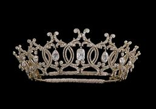
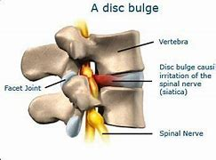
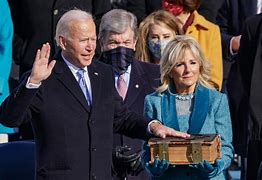
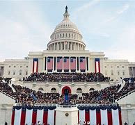

title:: 031 What Is the US Capitol Building?

- pure
  collapsed:: true
	- In 1863, the American poet Walt Whitman wrote approvingly about the United States Capitol building in Washington, DC.
	- Whitman described the building as calm and confident. And he said the Capitol’s dome made it easily recognized and seen throughout the Washington area.
	- Whitman called the dome “a vast eggshell, built of iron and glass.” He also likened it to a bubble, a tiara, and a “towering bulge of pure white.”
	- Today, the Capitol building is still a well-known symbol of the U.S. government. Although some people confuse it with the White House, where the president lives, it is the home of the U.S. Congress. In other words, the Capitol is the place where the country’s lawmakers meet to discuss, make and approve legislation. The House of Representatives meets in the building’s south wing. The Senate meets in its north wing.
	- The two large meeting rooms for lawmakers are called chambers. Usually House members and senators meet in their own chambers. But from time to time, they gather together in the House chamber, which is larger.
	- These gatherings are called joint sessions of Congress. They happen at least once a year when the president gives a speech that is called the State of the Union address. Sometimes joint sessions of Congress happen after an election or when a foreign leader speaks.
	- U.S. lawmakers also gather at the Capitol when a president is sworn-in. Years ago, those swearing-in ceremonies – called inaugurations – sometimes took place inside the building. But today they usually are held outside. Many people who have never visited Washington, DC may still recognize the Capitol building because they have seen pictures of it during a presidential inauguration.
	- And those who come to Washington can visit the Capitol building in person. The U.S. Capitol Visitors Center can hold up to 4,000 people at one time. Visitors can see the building up close, learn its history and even listen to lawmakers debate the issues of the day.
- ---
- def
	- In 1863, the American poet Walt Whitman /**wrote approvingly about** the United States Capitol building /in Washington, DC.
		- > ▶ Capitol : ( usually **the Capitol** ) [ sing. ] the building in Washington DC where the US Congress (= the national parliament) meets to work on new laws （美国）国会大厦
		  {:height 89, :width 146}
		- 以赞许的态度写了一篇关于...
		  id:: 6232bca9-1227-4882-9d08-8fee1659df2e
	- Whitman **described** the building **as** calm and confident. And he said /the Capitol’s dome /made it easily recognized /and seen throughout the Washington area.
		- 国会大厦的圆顶, 使它很容易被认出，并在华盛顿的任何地区, 都能看到它。
	- Whitman called the dome “a vast eggshell, **built of** iron and glass.” He also **likened** it **to** a bubble, a tiara(n.), and a “towering(a.) **bulge(n.) of** pure white.”
		- > ▶ **ˈLIKEN(v.) STH/SB TO STH/SB** : ( formal ) to compare one thing or person to another and say they are similar 把…比作…
		  -> Life **is often likened to** a journey. 人们常把人生比作旅程。
		- > ▶ tiara  /tiˈɑːrə/  a piece of jewellery like a small crown decorated with precious stones , worn by a woman, for example a princess, on formal occasions 冠状头饰（女子用，如公主在正式场合戴的镶有宝石的王冠式头饰）;三重冠
		  {:height 77, :width 133}
		- > ▶ towering (a.)extremely tall or high and therefore impressive 高大的；高耸的；屹立的 /( of emotions 情感 ) extremely strong 强烈的；激烈的
		  -> towering cliffs 高耸的悬崖
		- > ▶ bulge (n.)(v.)a lump that sticks out from sth in a round shape 鼓起；凸起/（身体的）肥胖部位 /a sudden temporary increase in the amount of sth 暂时的激增；暴涨
		  => bulge
		  -> the bulge of a gun in his pocket 他衣袋里鼓起一把枪的模样
		  {:height 104, :width 146}
		- 惠特曼称穹顶为“由铁和玻璃建造的巨大蛋壳”。他还把它比作泡沫、皇冠, 和“高耸的纯白凸起物”。
	- Today, the Capitol building /is still a well-known symbol of the U.S. government. Although some people **confuse** it **with** the White House, where the president lives, it is the home of the U.S. Congress. In other words, the Capitol is the place /where the country’s lawmakers meet(v.) /to discuss, make and approve legislation. The House of Representatives /meets(v.) in the building’s **south wing**. The Senate meets(v.) in its **north wing**.
		- > ▶ wing (n.)one of the parts of a large building /that sticks out from the main part 侧翼部分；侧厅；耳房；厢房
		  -> the new wing of the hospital 与医院一侧相连的新楼房
		  {:height 123, :width 320}
		- 国会大厦是国家立法者, 开会讨论、制定和批准立法的地方。众议院在大楼的南侧开会。参议院在其北翼开会。
	- The two large meeting rooms for lawmakers /are called chambers. Usually House members and senators /meet(v.) in their own chambers. But **from time to time**, they gather together /in the House chamber, which is larger.
		- > ▶  from time to time 不时,有时,时常,偶尔
		- 通常众议院成员和参议员在各自的议院开会。但有时，他们会聚集在众议院的大厅里，那里更大。
	- These gatherings /are called **joint sessions of Congress.** They happen /at least once a year /when the president gives a speech /that is called **the State of the Union address**. Sometimes **joint sessions of Congress** /happen after an election /or when a foreign leader speaks.
		- > ▶ gathering (n.)[ C ] a meeting of people for a particular purpose 聚集；聚会；集会
		- > ▶ joint session 上下两议院的联席会议, 联合会议
		- > ▶ the **State of the Union address** :  [ sing. ] (in the US) a speech about the achievements /and plans of the government /that the President gives to Congress /once a year 国情咨文（美国总统就政府业绩和规划在国会所作的年度讲话）
		  这里的state，指的是：状态、情况（注意不要理解为“国家”，或“陈述”）。而the Union，当U大写时，指的是：the United States（美国）。所以，State of the Union的字面意思是：美国国情.
		  除了**State of the Union**，国情咨文还有几个接近的说法，**State of the Union speech**，或 **state of the Union address**.
		  每年的SOTU大会，总有一名政府内阁成员是缺席的。原因是万一美国总统或其他继任者在做国情咨文报告时发生不测，这位缺席的成员可以继任总统，以确保美国政府的连续运作。在IT术语里，这类措施叫灾备（DR，Disaster Recovery）。
		- > ▶ address (n.)[ C ] a formal speech that is made in front of an audience 演说；演讲
		  -> tonight's televised(v.) **presidential address** 今晚总统的电视演讲
		- 这些集会被称为"国会联席会议"。每年总统至少会发表一次国情咨文演讲。有时，国会联席会议, 在选举后, 或外国领导人发表讲话时, 举行。
	- U.S. lawmakers /also gather at the Capitol /when a president is sworn-in. Years ago, `主` those swearing-in ceremonies – called inaugurations – `谓` sometimes took place inside the building. But today /they usually are held outside. Many people /who have never visited Washington, DC /may still recognize the Capitol building /because they have seen pictures of it /during a presidential inauguration.
		- > ▶ **sworn in** 宣誓就职, 使宣誓就职
		  ▶ sworn (a.) made after you have promised to tell the truth, especially in court （尤指在法庭上）宣过誓的，宣誓证明的
		  -> a sworn statement 宣誓证词
		  {:height 104, :width 119}
		- > ▶ inauguration 就职典礼
		  ▶  inaugurate (v.)~ sb (as sth) to introduce a new public official or leader at a special ceremony 为（某人）举行就职典礼 / to officially open a building or start an organization with a special ceremony 为…举行落成仪式（或创建仪式）
		  => in-,进入，使，augur,占卜，预示，预兆。来自古希腊罗马时期通过占卜来决定吉凶，以及是否从事政治，经济，军事活动，但该词用来指就职。
		  
	- And those /who come to Washington /can visit the Capitol building **in person**. The U.S. Capitol Visitors Center /can hold up to 4,000 people /at one time. Visitors can see the building **up close**, learn its history /and even listen to lawmakers debate(v.) the issues of the day.
		- > ▶ in person 亲自,本人
		- > ▶ up close 靠近地, 紧密贴近
		- 那些来到华盛顿的人, 可以亲自参观国会大厦。美国国会大厦游客中心, 一次可以容纳4000人。游客可以近距离观看这座建筑，了解它的历史，甚至还可以听到议员们就当天的议题进行辩论。
-