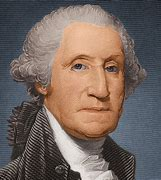
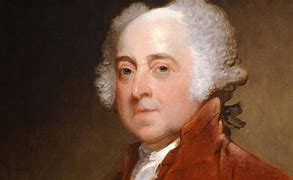
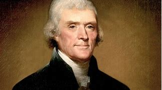
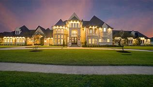

title:: 042 John Adams: Second

- # 042 John Adams Second
- pure
  collapsed:: true
	- VOA Learning English presents America's Presidents.
	- Today we are talking about John Adams. In 1796, he was elected as the country’s second president.
	- Being second can be difficult. And being the second president of a new country, following a popular first president such as George Washington, turned out to be extremely difficult.
	- For one thing, Adams did not always get along with other people. He was known to get angry easily, and often.
	- Adams also was leader of a divided administration. His own vice president often disagreed with him – passionately.
	- The situation was the result of a rule in the Constitution at the time. It said the person who received the majority of votes became president. The person with the second largest number of votes became vice president.
	- The rule worked fine for the first two elections. Washington had won the presidency, and Adams won the vice presidency. The two men belonged to the same political party and shared many points of view.
	- But in 1796, Adams’ opponent in the election, Thomas Jefferson, became the vice president. The two men were personal friends, but political enemies.
	- President Adams supported a strong federal government that protected the interests of business and the wealthy. Vice President Jefferson, on the other hand, wanted to limit the power of the federal government. As a result, Adams and Jefferson often clashed.
	- Adams also made what many historians consider a mistake in choosing his cabinet. Adams simply kept Washington’s official advisers, mostly to satisfy political opponents.
	- But later, Adams learned that many of his cabinet members opposed him, too.
	- Historian John Ferling says Adams was “in over his head, and started swimming upstream” almost from the start of his presidency.
	- ## Foreign policy crisis
	- On top of all that, Adams faced a foreign policy crisis. After the French Revolution, Great Britain allied with other European nations against France. They wanted to keep the unrest from spreading to their countries.
	- Adams worked hard to make sure the U.S. did not get pulled into a war between France and Great Britain. But France did not trust the U.S. It tried to interrupt trade by seizing U.S. ships.
	- Adams wanted to resolve the problem peacefully. He threatened military action, but he also sent diplomats to talk with French officials.
	- Adams aimed for “an honorable peace” with France. It took some time but he got it.
	- Historian John Ferling says although the crisis in Europe caused Adams “endless trouble,” he dealt with it well.
	- Many years later, Adams wrote that “the greatest jewel in his crown” was reaching peace with France.
	- ## The Adams family
	- Even if Adams struggled as president, he was successful in other parts of his life.
	- He grew up outside the city of Boston. His father was a farmer, as well as a church official and town leader. However, Adams chose to attend Harvard University and become a lawyer.
	- Adams was a very good lawyer. In fact, he was one of the busiest lawyers in Boston. His success enabled him to buy a big, two-story house that still stands in Quincy, Massachusetts.
	- Adams also had a happy marriage. The relationship between him and his wife, Abigail, is one of the best-known of that time. The two wrote many letters to each other during the years they were apart. More than 1,000 of their letters still survive today. John and Abigail Adams were both passionate patriots who supported the American Revolution.
	- They also agreed about the issue of slavery. Unlike many founding families of the U.S., the couple did not own slaves and spoke out against the system of people owning other people.
	- ## Election of 1800
	- In November of 1800, John and Abigail Adams moved to the Executive Mansion in Washington, D.C. Adams was the first president to live in what we now call the White House.
	- They would not stay long, however.
	- Adams was facing a difficult re-election campaign. His vice president, Thomas Jefferson, was running against him. His party was divided – many Federalists supported other candidates. And some voters did not like his decisions – including creating a permanent army, raising taxes, and limiting the rights of immigrants.
	- Those four laws – called the Alien and Sedition Acts – extended the time that immigrants had to wait before becoming U.S. citizens.
	- They permitted the government to detain citizens from enemy nations without reason during wartime.
	- The laws also permitted the president to expel foreign citizens he believed were dangerous.
	- And they made criticizing the president or Congress a crime.
	- Adams said the Acts aimed to control people in the U.S. who supported France. But many politicians at the time argued that the laws mostly affected people who supported the opposing political party.
	- Historian John Ferling says they were right. And, he says, Adams may have been using the Alien and Sedition Acts to protect his political career. But they ended up damaging his public image.
	- They also raised the question for the first time of whether states had the right to ignore a federal law if they disagreed with it.
	- ## Adams and Jefferson
	- Supporters of Vice President Thomas Jefferson used Adams’ approval of the Alien and Sedition Acts against him effectively. Jefferson’s campaign said Adams exercised so much power as president that he must want the U.S. to become a monarchy.
	- Adams’ campaign said Jefferson was a radical who would bring revolution to the country.
	- The U.S. had never experienced such an ugly election before. Some people wondered whether the country would be able to transfer power peacefully.
	- When Jefferson won, however, Adams did not resist. He retired to his farm in Massachusetts.
	- Adams spent most of his retirement writing. He even began exchanging long letters with his old friend – and old enemy – Thomas Jefferson.
	- They two men discussed their families, their thoughts on politics and religion, and their nation’s history. The letters were both personally and historically meaningful: Adams and Jefferson were the last living members of the original patriots who started a new country.
	- On July 4, 1826 – the nation’s 50th birthday – the two friends, patriots and former U.S. presidents died within hours of one another.
- ---
- ## def
	- VOA Learning English presents America's Presidents.
	- Today we are talking about John Adams. In 1796, he was elected as the country’s second president.
	- Being second /can be difficult. And being the second president of a new country, following a popular first president /such as George Washington, **turned out to be** extremely difficult.
	- For one thing, Adams did not always **get along with** other people. He was known /to get angry easily, and often.
		- > ▶ get along with  与……和睦相处；取得进展
	- Adams also was leader of **a divided administration**. His own vice president /often disagreed with him – passionately.
		- > ▶ passionate (a.) having or showing strong feelings of enthusiasm for sth or belief in sth 热诚的；狂热的 /**having or showing strong feelings** of sexual love or of anger, etc. 拥有（或表现出）强烈性爱的；情意绵绵的；怒不可遏的
	- The situation /was the result of a rule /in the Constitution /at the time. It said /the person who received the majority of votes /became president. The person /with the second largest number of votes /became vice president.
	- The rule worked fine /for the first two elections. Washington had won the presidency, and Adams won the vice presidency. The two men belonged to the same political party /and shared many points of view.
		- > ▶ George Washington
		  
	- But in 1796, Adams’ opponent(n.) in the election, Thomas Jefferson, became the vice president. The two men were personal friends, but political enemies.
		- > ▶ opponent  对手；竞争者 /~ (of sth) a person who is against sth and tries to change or stop it 反对者；阻止者
		- > ▶  John Adams
		  {:height 187, :width 293}
		- id:: 6242a607-de8c-435f-a915-d1bdbb466676
		  > ▶ Thomas Jefferson
		  
	- President Adams supported a strong federal government /that protected the interests of business and the wealthy. Vice President Jefferson, on the other hand, wanted to limit the power of the federal government. As a result, Adams and Jefferson often clashed.
	- Adams also made /what many historians consider a mistake /in choosing his cabinet. Adams simply kept Washington’s official advisers, mostly to satisfy political opponents.
	- But later, Adams learned that /many of his cabinet members /opposed him, too.
	- Historian John Ferling says /Adams was “**in over his head**, and started swimming upstream” /almost from the start of his presidency.
		- > ▶ **in over your ˈhead** :
		  involved in sth /that is too difficult for you to deal with 卷入棘手的事
		- 亚当斯几乎从担任总统之初就“卷入棘手的事，开始逆流而上”。
	- ## Foreign policy crisis
	- On top of all that, Adams faced a foreign policy crisis. After the French Revolution, Great Britain **allied with** other European nations /against France. They wanted to **keep** the unrest **from** spreading to their countries.
		- > ▶ unrest (n.)[ U ] a political situation in which people are angry and likely to protest or fight 动荡；动乱；骚动
		- > ▶ **keep sb from sth** :
		  to prevent sb from doing sth 阻止（或防止、阻碍）某人做某事
		   ▶ **keep sth from sth** :
		  to make sth stay out of sth 使置于某物之外；使与某物分开
		  -> She could not keep the dismay from her voice. 她无法使自己沉重的心情不流露在话音之中。
		- 法国大革命之后，英国和其他欧洲国家联合起来反对法国。他们想阻止革命动乱蔓延到他们的国家。
	- Adams worked hard /to make sure /the U.S. did not get pulled into a war /between France and Great Britain. But France did not trust the U.S. It tried to interrupt trade /by seizing U.S. ships.
		- 但是法国不信任美国，它试图通过扣押美国船只来中断贸易。
	- Adams wanted to resolve the problem peacefully. He threatened military action, but he also sent diplomats /to talk with French officials.
		- > ▶ diplomat (n.)( also old-fashioned also dip·lo·ma·tist ) a person whose job is to represent his or her country in a foreign country, for example, in an embassy 外交官 /a person who is skilled at dealing with other people 善于交际的人；通权达变的人；圆通的人；有手腕的人
		  => di-, 二。-pl, 折叠，词源fold. -oma, 名词后缀。即对折的官方文件，引申义文凭。
		  diplomat原指持有diploma的政府官员，以后特指“外交官”；diplomatic起初表示“有关公文的”，随后表示“外交（上）的”，最后又由此引申出“有外交手腕的"或“老练的”一义
	- Adams aimed for “an honorable peace” with France. It took some time /but he got it.
	- Historian John Ferling says /although the crisis in Europe /caused Adams “endless trouble,” he dealt with it well.
	- Many years later, Adams wrote that /“the greatest jewel in his crown” /was reaching peace with France.
		- > ▶ crown  王冠；皇冠；冕 /the crown [ sing. ] the position or power of a king or queen 王位；王权
		- “他王冠上最珍贵的宝石”是与法国达成和平。
	- ## The Adams family
	- Even if Adams struggled as president, he was successful /in other parts of his life.
	- He grew up /outside the city of Boston. His father was a farmer, as well as a church official and town leader. However, Adams chose to attend Harvard University /and become a lawyer.
		- > ▶ attend  [ VN ] to go regularly to a place 经常去，定期去（某处） /~ (to sb/sth) ( formal ) to pay attention to what sb is saying or to what you are doing 注意；专心
	- Adams was a very good lawyer. In fact, he was one of the busiest lawyers in Boston. His success /enabled him to buy a big, two-story house /that still stands in Quincy, Massachusetts.
	- Adams also had a happy marriage. The relationship /between him and his wife, Abigail, is one of the best-known of that time. The two /wrote many letters to each other /during the years they were apart. More than 1,000 of their letters /still survive today. John and Abigail Adams /were both passionate patriots /who supported the American Revolution.
		- > ▶ patriot : a person who loves their country and who is ready to defend it against an enemy 爱国者
	- They also agreed about /the issue of slavery. Unlike many founding families of the U.S., the couple /did not own slaves /and **spoke out against** the system /of people owning other people.
	- ## Election of 1800
	- In November of 1800, John and Abigail Adams /moved to _the Executive Mansion_ in Washington, D.C. Adams was the first president /to live in /what we now call the White House.
	- They would not stay long, however.
		- > ▶ mansion [ C ] a large impressive house 公馆；宅第 /[ C ] a large impressive house 公馆；宅第
		  
	- Adams was facing a difficult re-election campaign. His vice president, Thomas Jefferson, was running against him. His party was divided – many Federalists supported other candidates. And some voters /did not like his decisions – including creating a permanent army, raising taxes, and limiting the rights of immigrants.
		- > ▶ federalist : a supporter of a federal system of government 联邦主义者
	- Those four laws – called _the Alien and Sedition Acts_ – extended the time /that immigrants had to wait /before becoming U.S. citizens.
		- > ▶ alien  (a.) ~ (to sb/sth) strange and frightening; different from what you are used to 陌生的；不熟悉 /( often disapproving ) from another country or society; foreign 外国的；异域的 /外星的
		  /~ to sb/sth ( disapproving ) not usual or acceptable 不相容；相抵触；格格不入
		  -> an alien environment 陌生的环境
		  -> The idea is alien to our religion. 这种思想与我们的宗教不相容。
		- > ▶ sedition [ U ] ( formal ) the use of words or actions that are intended to encourage people to oppose a government 煽动叛乱的言论（或行动）SYN insurrection
		  => sed-,分开，来自 se-在元音前的异体形式，-it,走，词源同 exit,transit.比较前缀 re-在元音前的 异化形式 redolent,olfactory.字面意思即分开走，使分开，引申词义煽动叛乱。
	- They permitted the government /to detain citizens from enemy nations /without reason /during wartime.
		- 它们允许政府, 在战时毫无理由地扣押敌国公民。
	- The laws also permitted /the president to expel foreign citizens /he believed were dangerous.
	- And they made /criticizing the president or Congress 宾补 a crime.
		- 他们还把批评总统或国会, 定为犯罪。
	- Adams said /the Acts aimed to control people in the U.S. /who supported France. But many politicians at the time argued that /the laws mostly affected people /who supported the opposing political party.
	- Historian John Ferling says /they were right. And, he says, Adams may have been using the Alien and Sedition Acts /to protect his political career. But they **ended up** damaging his public image.
		- 但它们最终损害了他的公众形象。
	- They also raised the question for the first time of /whether states had the right /to ignore a federal law /if they disagreed with it.
		- 如果各州不同意联邦法律，它们是否有权无视该法律。
	- ## Adams and Jefferson
	- Supporters of Vice President Thomas Jefferson /used Adams’ approval(n.) of _the Alien and Sedition Acts_ /against him effectively. Jefferson’s campaign said /Adams exercised **so** much power as president /**that** he must want the U.S. /to become a monarchy.
		- > ▶ approval (n.)[ U ] the feeling that sb/sth is good or acceptable; a positive opinion of sb/sth 赞成；同意 /~ (for sth) (from sb) agreement to, or permission for sth, especially a plan or request 批准，通过，认可（计划、要求等）
		  -> parliamentary/congressional/government approval 议会的╱国会的╱政府的批准
		- 副总统托马斯·杰斐逊的支持者有效地利用亚当斯批准的《外国人和煽动叛乱法》来对付他。杰斐逊的竞选团队说，亚当斯作为总统行使的权力如此之大，他一定希望美国成为君主制国家。
	- Adams’ campaign said /Jefferson was a radical(n.) /who would bring revolution to the country.
		- > ▶ radical (n.)a person with radical opinions 激进分子 /( chemistry 化 ) a group of atoms that behave as a single unit in a number of compounds 游离基；自由基
		  /(a.) concerning the most basic and important parts of sth; thorough and complete 根本的；彻底的；完全的 /in favour of thorough and complete political or social change 激进的；极端的
		  -> demands for radical reform of the law 彻底改变法律的要求
	- The U.S. had never experienced such an ugly election before. Some people wondered /whether the country would be able to transfer power peacefully.
	- When Jefferson won, however, Adams did not resist. He retired to his farm in Massachusetts.
	- Adams spent most of his retirement writing. He even began **exchanging** long letters **with** his old friend – and old enemy – Thomas Jefferson.
	- They two men /discussed their families, their thoughts on politics and religion, and their nation’s history. The letters were both personally and historically meaningful: Adams and Jefferson /were the last living members /of the original patriots /who started a new country.
		- 这些信件既有个人意义，也有历史意义: 亚当斯和杰斐逊, 是建立新国家的爱国者中, 最后在世的成员。
	- On July 4, 1826 – the nation’s 50th birthday – the two friends, patriots and former U.S. presidents /died within hours of one another.
		- 这两位朋友、爱国者和前美国总统, 在数小时内相继去世。
			-