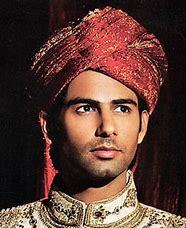
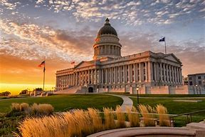
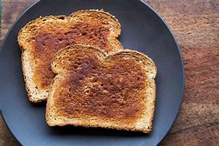
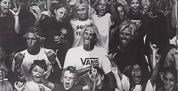
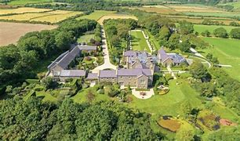

title:: 044 James Madison: Scholar

- # 044 James Madison: Scholar
- pure
  collapsed:: true
	- VOA Learning English presents America’s Presidents.
	- James Madison was elected in 1808. He was a capable president who served two terms. But most Americans do not remember Madison for his presidency. They remember him for work he did earlier.
	- After the Revolutionary War, in which the American colonists separated from Britain, Madison proposed that the new United States form a stronger national government.
	- Madison’s vision for a three-part government – with an executive, a legislature, and an independent Supreme Court – became the basis for the Constitution we still use today.
	- Madison went on to persuade voters to accept the proposed Constitution. He explained how a system of checks and balances would prevent any one part of government from becoming too powerful.
	- And, when voters demanded more protection for individual liberties, Madison wrote the amendments that became the Bill of Rights.
	- These actions earned Madison the name “Father of the Constitution.”
	- ## Opposites attract
	- Madison did not have the appearance of most politicians. He was a short man with a soft voice who had been sick often as a child.
	- He grew up in a wealthy family in Virginia. He liked to read books, and to study. He went to college at the school that later became Princeton University in New Jersey.
	- When the Revolutionary War started, Madison’s intelligence and knowledge – as well as family money – helped him participate in debates about independence.
	- Madison also held positions in the new American government he helped create, including as secretary of state under President Thomas Jefferson.
	- Madison did not have much of a personal life. Many people were surprised when he married a young widow named Dolley Payne Todd. She was 26; he was 43. The couple did not have children, but they raised Mrs. Madison’s surviving son together.
	- Stories suggest the two were very happy, although they had different personalities. Dolley Madison was energetic, warm, and social. She loved to throw parties – and her guests loved to attend them.
	- Historian Catherine Allgor notes Dolley Madison often dressed dramatically – including wearing turbans covered with peacock feathers. Her weekly gatherings at the president’s house were so crowded that they became known as “squeezes.”
	- As first lady, Dolley Madison did not follow her husband’s idea of a strict separation of powers. She invited officials from all parts of the government to her parties, as well as people from opposing political groups.
	  Allgor says Dolley Madison succeeded in making the president’s house a symbol of unity and glamor. She remains one of the best- known and most-loved first ladies in U.S. history.
	- But his wife’s popularity could not prevent Madison from facing a difficult presidency.
	- ## Conflict abroad and at home
	- During his first term, the U.S. faced increasingly tense relations with Britain. Madison accused the British of interfering with international trade and seizing American sailors.
	- At the same time, European-American settlers blamed the British for helping native tribes fight against them. But, the settlers had violated treaties between the U.S. government and the Native Americans. In 1811, native warriors attacked U.S. soldiers at the Battle of Tippecanoe in today’s state of Indiana. A U.S. general named William Henry Harrison led his troops to fight back. The result was not clear, but Harrison declared victory.
	- The following year, Madison proposed war against Britain. Congress approved. The War of 1812 began.
	- ## War of 1812
	- For most of the war, American forces failed.
	- But in 1813, they had two notable victories in Canada. They captured and burned the city of York, in Toronto.
	- And General Harrison had another major fight with native warriors at the Battle of the Thames. The Native Americans were defeated. The leader of the tribal alliance, Tecumseh, died from the wounds he received there.
	- That loss ended, for the most part, the efforts of eastern Native American tribes to push back white settlers.
	- In 1814, the war turned again. British soldiers took the U.S. capital of Washington, DC.
	- Madison had already left the president’s house to meet with generals in the field. Dolley Madison remained. But when she learned the British were approaching quickly, she acted. She famously ordered her servants, as well as a 15-year-old house slave named Paul Jennings, to take down a painting of George Washington. The servants, slaves, first lady, and painting all escaped to safety.
	- Commanders of the British force took a group of men to the Capitol building and set it on fire. Then, they went to the president’s house. They found the table set for dinner. The British commanders stopped to toast the president before they burned his home.
	- By the time Washington, D.C. burned, American and British officials were already in peace talks.
	- But in the U.S., one more major battle was being fought. A militia general named Andrew Jackson led a ragtag army against a British attack in New Orleans, Louisiana. The Americans’ rain of bullets and shells was so deadly that only one British soldier reached the top of the American defenses.
	- When the British finally withdrew, they left behind more than 2,000 dead and wounded. Five hundred other British soldiers had been captured.
	- Thirteen Americans were killed.
	- The Battle of New Orleans was considered a great victory for the U.S; however, it was not necessary. The war had ended, by treaty, two weeks earlier.
	- ## Legacy
	- The War of 1812 almost bankrupted the U.S. government and cost the lives of tens of thousands of soldiers. It was devastating for many Native Americans. It did provide a chance for several thousand slaves to escape to freedom by serving in the British military. But it did nothing to improve the lives of most of 1 million enslaved people in the U.S. at the time.
	- Despite all this, the war united most of the country.
	- Albert Gallatin, Madison's treasury secretary, said people felt "more American" after the war. They acted more like a nation, he said.
	- The song that would become the country’s national anthem, “The Star-Spangled Banner,” was written during the War of 1812.
	- Madison benefited from most people’s belief that the war was a success. The end of his second term began what historians call the “Era of Good Feelings.” Madison left the presidency more popular than when he had started it.
	- After he retired, Madison lived on his Virginia estate for nearly another 20 years. He died in his bed at age 85. A niece was in the room. She says that a strange look passed her uncle’s face. She asked him what was wrong.
	- Madison’s last words were: “Nothing more than a change of mind, my dear. I always talk better lying down.”
- ---
- ## def
	- VOA Learning English presents America’s Presidents.
	- James Madison was elected in 1808. He was a capable(a.) president /who served two terms. But most Americans /do not remember Madison /for his presidency. They remember him /for work he did earlier.
		- > ▶ James Madison
		  
		- > ▶ capable (a.)~ of sth/of doing sth having the ability or qualities necessary for doing sth 有能力；有才能 /能力强的；足以胜任的
		- 但大多数美国人并不因为麦迪逊担任总统而记得他。他们只记得他之前的工作。
	- After the Revolutionary War, in which /the American colonists /separated from Britain, Madison proposed that /the new United States form(v.) a stronger national government.
		- id:: 6242c135-fc95-4e26-a53f-e58b617588d2
		  > ▶ propose (v.) ( formal ) to suggest a plan, an idea, etc. for people to think about and decide on 提议；建议 /to intend to do sth 打算；希冀；计划 /~ (sth) (to sb) to ask sb to marry you 求婚
		  -> What do you propose to do now? 现在你打算做什么？
		  /**~ sth~ sb (for/as sth)** to suggest sth at a formal meeting and ask people to vote on it 提名；提出…供表决
		  -> I propose Tom Ellis for chairman. 我提名汤姆•埃利斯做主席。
		-
	- `主` Madison’s vision for a three-part government – with an executive, a legislature, and an independent Supreme Court – `谓` became the basis for the Constitution /we still use today.
	- Madison went on /to persuade(v.) voters /to accept the proposed Constitution. He explained /how a system of **checks and balances** /would **prevent** any one part of government **from** becoming too powerful.
		- > ▶  **checks and balances** (n.)influences in an organization or political system /which help to keep it fair /and stop a small group from keeping all the power 制约与平衡（为保持机构或政体内的公正并防止权力集中于小团体）
		  /(in the US) the principle of government /by which the President, Congress and the Supreme Court /each have some control /over the others 三权分立（美国政府中总统、国会以及最高法院之间相互制约的政体原则）
		- 麦迪逊继续说服选民接受提议的宪法。他解释了一个制衡体系, 是如何防止任何一个政府部门变得过于强大的。
	- And, when voters /**demanded** more protection **for** individual liberties, Madison wrote the amendments /that became **the Bill of Rights**.
		- 当选民要求对个人自由给予更多保护时，麦迪逊起草了后来成为《权利法案》(Bill of Rights)的修正案。
	- These actions /earned Madison the name “Father of the Constitution.”
	- ## Opposites attract
	- Madison did not have the appearance /of most politicians. He was a short man /with a soft voice /who had been sick often /as a child.
		- > ▶ opposite (n.)(a.)   a person or thing that is as different as possible from sb/sth else 对立的人（或物）；对立面；反面
		  -> Exactly the opposite is true. 事实恰恰相反。
		   ▶ **opposites atˈtract**
		  used to say that people who are very different are often attracted to each other 相反相成；相异相吸
		- 麦迪逊不具备大多数政治家的外表。他个子不高，声音柔和
	- He grew up /in a wealthy family in Virginia. He liked to read books, and to study. He **went to college** at the school /that later became Princeton University in New Jersey.
		- 他在后来成为新泽西普林斯顿大学的学校, 上大学。
	- When **the Revolutionary War** started, Madison’s intelligence and knowledge – as well as family money – helped him **participate(v.) in debates** about independence.
		- > ▶ participate [ V ] ~ (in sth) ( rather formal ) to take part in or become involved in an activity 参加；参与
		  ->  She didn't participate in the discussion. 她没有参加讨论。
		- 麦迪逊的智慧和知识——以及家庭的财富——帮助他参与进有关独立的辩论。
	- Madison also **held positions** /in the new American government /he helped create, including as **secretary of state** under President Thomas Jefferson.
		- 担任职务
	- Madison did not have much of a personal life. Many people were surprised /when he married a young widow /named Dolley Payne Todd. She was 26; he was 43. The couple did not have children, but they **raised** Mrs. Madison’s surviving son **together**.
		- > ▶ raise (v.)( especially NAmE ) to care for a child /or young animal /until it is able to take care of itself 抚养；养育；培养
		- 但他们一起抚养了麦迪逊夫人幸存的儿子。
	- Stories suggest /the two were very happy, although they had different personalities. Dolley Madison was energetic, warm, and social. She loved **to throw parties** – and her guests /loved to attend them.
		- id:: 6243ae51-d368-4ac2-ad36-7b345dacce8a
		  > ▶ suggest (v.)~ sth (to sb) to put an idea into sb's mind; to make sb think that sth is true 使想到；使认为；表明
		  -> The symptoms suggest a minor heart attack. 症状显示这是轻微心脏病发作。
		- > ▶ throw (v.) [ VN ] **~ a party** ( informal ) to give a party 举行聚会
		  /[ VN + adv./prep. ] [ usually passive ] to make sb/sth be in a particular state 使处于，使陷入（某种状态）
		  -> Hundreds were thrown out of work. 数以百计的人遭到解雇。
		  -> We were thrown into confusion by the news. 我们被那消息弄得惊慌失措。
		- id:: 6243aee7-55d4-46d8-ad80-d2cdb2c81c87
		  > ▶ attend (v.)to be present at an event 出席；参加 /to go regularly to a place 经常去，定期去（某处）
		  -> to attend a wedding/funeral 参加婚礼╱葬礼
		  /~ (to sb/sth) ( formal ) to pay attention to what sb is saying /or to what you are doing 注意；专心
		  -> She hadn't been attending /during the lesson. 上课时她一直不专心。
		- 之后发生的故事表明(事实证明)，尽管他们性格不同，但他们非常幸福。多利·麦迪逊精力充沛，待人热情，善于交际。她喜欢举办派对，她的客人也喜欢参加。
	- Historian Catherine Allgor /notes Dolley Madison often dressed dramatically – including wearing(v.) turbans /covered with peacock feathers. Her weekly gatherings(n.) at the president’s house /were **so** crowded /**that** they became known as “squeezes.”
		- > ▶ dramatically  明显地；戏剧性地，夸张地; 引人注目地
		- > ▶ turban : a woman's hat that looks like a turban （女用）头巾帽 /（穆斯林或锡克教男教徒等用的）包头巾
		  
		- > ▶ feather : one of the many soft light parts covering a bird's body 羽毛；翎毛
		  
		- > ▶ **know (v.)~ sb/sth as sth |~ sb/sth for sth**  :[ usually passive ] to think that sb/sth is a particular type of person or thing or has particular characteristics 把…看作是；认为…是
		  -> He's known to be an outstanding physicist. 他被公认为杰出的物理学家。
		- > ▶ squeeze : (n.)(v.) [ sing. ] a situation where it is almost impossible for a number of people or things to fit into a small or restricted space 挤；塞
		  -> Seven people in the car /was a bit of a squeeze. 那辆车坐了七个人是有点挤。
		- 历史学家...指出，Dolley Madison  经常穿着夸张的衣服，包括戴着用孔雀羽毛覆盖的头巾。她每周在总统家的聚会, 都非常拥挤，以至于被认为是“塞进去”的。
	- As first lady, Dolley Madison /did not follow her husband’s idea /of a strict separation of powers. She **invited** officials /from all parts of the government /**to** her parties, as well as people /from opposing political groups.
		- 作为第一夫人，多利·麦迪逊(Dolley Madison)没有遵循她丈夫的严格的权力分立理念。她邀请了政府各部门的官员参加她的政党，以及来自对立政治团体的人。
	- Allgor says /Dolley Madison succeeded(v.) in making the president’s house 宾补 a symbol of unity and glamor. She remains one of the best- known and most-loved first ladies /in U.S. history.
	- But his wife’s popularity /could not **prevent** Madison **from** facing a difficult presidency.
		- Dolley Madison成功地使总统的房子, 成为团结和魅力的象征。她仍然是美国历史上最著名、最受欢迎的第一夫人之一。
		  但他妻子的声望, 并不能阻止麦迪逊面对一个艰难的总统任期。
	- ## Conflict abroad and at home
	- During his first term, the U.S. faced **increasingly tense relations** with Britain. Madison **accused** the British **of** /**interfering with** international trade /and seizing American sailors.
		- > ▶ interfere: **INTERˈFERE WITH STH**
		  (1) to prevent sth from succeeding /or from being done or happening /as planned 妨碍；干扰
		   ▶ **INTERˈFERE WITH SB**
		  (1) to illegally try to influence sb who is going to give evidence in court, for example by threatening them or offering them money 干扰证人（企图威胁或贿赂等）
	- At the same time, European-American settlers /**blamed** the British **for** helping native tribes /fight against them. But, the settlers had violated treaties /between the U.S. government and the Native Americans. In 1811, native warriors attacked U.S. soldiers /at the Battle of Tippecanoe /in today’s state of Indiana. A U.S. general /named William Henry Harrison /led his troops to fight back. The result was not clear, but Harrison /declared victory.
		- > ▶ settler (n.)a person who goes to live in a new country or region 移民；殖民者
		- > ▶ tribe : ( sometimes offensive ) (in developing countries) a group of people of the same race, and with the same customs, language, religion, etc., living in a particular area and often led by a chief 部落 
		  /( usually disapproving ) a group or class of people, especially of one profession （尤指同一职业的）一伙（人），一帮（人），一类（人）
		  -> He had a sudden outburst /against **the whole tribe of actors**. 他突然对所有的演员非常反感。
		- 与此同时，欧洲裔美国定居者, 指责英国人帮助当地部落对抗他们。但是，这些定居者违反了美国政府和印第安人之间的条约。1811年，在今天的印第安纳州，当地的战士在Tippecanoe战役中袭击了美国士兵。一位名叫威廉·亨利·哈里森的美国将军, 率领他的军队进行了反击。战争结果不清楚，但哈里森宣布获胜。
	- The following year, Madison proposed war /against Britain. Congress approved. The War of 1812 began.
		- ((6242c135-fc95-4e26-a53f-e58b617588d2))
		- 第二年，麦迪逊提议对英国开战。国会批准。
	- ## War of 1812
	- For most of the war, American forces(n.) failed.
	- But in 1813, they had two notable victories in Canada. They captured and burned the city of York, in Toronto.
	- And General Harrison /had another major fight with native warriors /at the Battle of the Thames. The Native Americans were defeated. The leader of **the tribal alliance**, Tecumseh, died from the wounds /he received there.
		- > ▶ tribal (a.)[ usually before noun ] connected with a tribe or tribes 部落的；部族的
		- id:: 6243b455-1f53-4e4b-9329-5db966877912
		  > ▶ alliance (n.)~ (with sb/sth) |~ (between A and B) : **an agreement** between countries, political parties, etc. to work together in order to achieve sth that they all want （国家、政党等的）结盟，联盟，同盟 /**a group of people, political parties, etc.** who work together in order to achieve sth that they all want 结盟团体；联盟
		  -> The Social Democrats are now **in alliance with** the Greens. 社会民主党现在与绿党结成联盟。
		- 哈里森将军, 在泰晤士河战役中, 与当地的战士进行了另一场重要的战斗。印第安人被打败了。部落联盟的领袖，Tecumseh，死于那场战争中的伤口。
	- That loss `谓` **ended**(v.), for the most part, **the efforts** /of eastern Native American tribes /**to push back** white settlers.
		- 在很大程度上，这场失败, 结束了东部印第安部落, 驱逐白人定居者的努力。
	- In 1814, the war **turned again**. British soldiers /took the U.S. capital of Washington, DC.
		- 1814年，战争优势再次反转。英国士兵占领了美国首都华盛顿。
	- Madison had already left the president’s house /**to meet with** generals in the field. Dolley Madison remained. But when she learned /the British were approaching(v.) quickly, she acted. She famously ordered(v.) her servants, as well as a 15-year-old house slave /named Paul Jennings, to take down a painting of George Washington. The servants, slaves, first lady, and painting /all escaped to safety.
		- > ▶ **meet with sb** :
		  ( especially NAmE ) to meet sb, especially for discussions 和某人会晤（商讨问题等）
		- > ▶ approach (v.)**to come near to sb/sth** in distance or time （在距离或时间上）靠近，接近 /[ VN ] to come close to sth in amount, level or quality （在数额、水平或质量上）接近 / **to start dealing with a problem, task, etc.** in a particular way 着手处理；对付
		  -> profits approaching 30 million dollars 接近3 000万元的利润
		  -> What's the best way of **approaching this problem**? 什么是处理这个问题的最佳方式？
		  => 前缀ap-同ad-. 词根pro, 向前，同approximate, 大约。
		- > ▶ safety (n.)**a place** where you are safe 安全处所 /[ U ] **the state** of being safe and protected from danger or harm 安全；平安
		- 麦迪逊已经离开了总统官邸，去见战场上的将军们。多利·麦迪逊留在总统府中。但当她得知英国人迅速逼近时，她采取了行动。众所周知，她曾命令她的仆人，以及一个名叫保罗·詹宁斯(Paul Jennings)的15岁的家奴，取下乔治·华盛顿(George Washington)的一幅画。仆人、奴隶、第一夫人和油画都逃到了安全的地方。
	- Commanders of the British force /**took** a group of men /**to** the Capitol building /and set it on fire. Then, they went to the president’s house. They found the table **set for dinner**. The British commanders /stopped to toast(v.) the president /before they burned his home.
		- > ▶ Capitol : ( usually the Capitol ) [ sing. ] the building in Washington DC where the US Congress (= the national parliament) meets to work on new laws （美国）国会大厦 /（美国）州议会大厦
		  
		- > ▶ set (v.)[ VN + adv./prep. ] to put sth/sb in a particular place or position 放；置；使处于 /to cause sb/sth to be in a particular state; to start sth happening 使处于某种状况；使开始
		  -> She **set a tray** down on the table. 她把托盘放到桌上。
		  -> Her remarks **set me thinking**. 她的话引起了我的深思。
		- > ▶ toast (v.)[ VN ] to lift a glass of wine, etc. in the air /and drink it /at the same time as other people /in order to wish sb/sth success, happiness, etc. 为…举杯敬酒；为…干杯 
		  /to make sth, especially bread, turn brown /by heating it /in a toaster /or close to heat; to turn brown in this way 烤（尤指面包）；把…烤得焦黄 / (n.)烤面包片；吐司
		  -> We toasted the success of the new company. 我们为新公司的成功干杯。
		  
		- 英国军队的指挥官们, 带着一群人来到国会大厦，放火焚烧。然后，他们去了总统的家。他们发现桌子已摆好准备吃饭了。英军指挥官在烧毁他的房子前, 停下来为总统祝酒。
	- By the time Washington, D.C. burned, American and British officials /were already in peace talks.
	- But in the U.S., one more major battle /was being fought. A militia general /named Andrew Jackson /led **a ragtag(a.) army** /against a British attack in New Orleans, Louisiana. The Americans’ rain of bullets and shells /was **so** deadly **that** only one British soldier /reached the top of the American defenses.
		- > ▶ militia (n.) [ sing.+sing./pl.v. ] a group of people /who are not professional soldiers /but who have had military training /and can act as an army 民兵组织；国民卫队
		  =>  -milit-兵 + -ia名词词尾
		- id:: 6243b99b-de78-4ae4-a48c-19c51a984fad
		  > ▶ ragtag (a.)( informal ) ( of a group of people or an organization 一群人或某组织 ) not well organized; giving a bad impression 组织散漫的；杂乱的；给人印象差的
		  -> a ragtag band of rebels 一队叛乱的乌合之众
		  => rag,破布，tag,标签。比喻用法。
		  
		- 但在美国，另一场主要战役正在进行。一位名叫安德鲁·杰克逊(Andrew Jackson)的民兵将军, 率领一支乌合之众的军队，在路易斯安那州, 新奥尔良, 迎战英国的进攻。美国人的子弹和炮弹如雨点般倾泻而下，火力如此致命，以至于只有一名英国士兵到达了美国防御工事的顶上。
	- When the British finally withdrew, they left behind more than 2,000 /dead and wounded. Five hundred other British soldiers /had been captured.
	- Thirteen Americans were killed.
	- The Battle of New Orleans /was considered a great victory for the U.S; however, it was not necessary. The war had ended, by treaty, two weeks earlier.
		- 然而，这场战斗是没有必要发生的。因为根据条约，战争在两周前就已经结束了。
	- ## Legacy
	- The War of 1812 /almost bankrupted(v.) the U.S. government /and cost(v.) the lives of tens of thousands of soldiers. It was devastating(v.) for many Native Americans. It did provide a chance for several thousand slaves /to escape to freedom /by serving in the British military. But it did nothing /to improve the lives of most of 1 million enslaved people /in the U.S. /at the time.
		- > ▶ legacy : money or property /that is given to you by sb /when they die 遗产；遗赠财物 / a situation that exists now /because of events, actions, etc. /that took place in the past 遗留；遗产；后遗症
		- > ▶ cost (v.) to cause the loss of sth 使丧失；使损失 /需付费；价钱为
		  -> That one mistake **almost cost him his life**. 那一个差错几乎使他丧命。
		- > ▶ devastate (v.)to completely destroy a place or an area 彻底破坏；摧毁；毁灭 /[ often passive ] to make sb feel very shocked and sad 使震惊；使极为忧伤；使极为悲痛
		  -> The bomb /devastated much of the old part of the city. 这颗炸弹炸毁了旧城的一大片地方。
		  => de-, 强调，整个的。vast, 广阔的。即整个摧毁。
		- 1812年的战争, 几乎使美国政府破产，并使成千上万的士兵丧生。这对许多印第安人来说是毁灭性的。它确实为数千名奴隶提供了在英国军队服役, 以获得自由的机会。但它并没有改善当时美国100万奴隶中的大多数人的生活。
	- Despite all this, the war /united most of the country.
	- Albert Gallatin, Madison's **treasury secretary**, said /people felt "more American" /after the war. They acted more like a nation, he said.
		- 财政部长
	- The song /that would become the country’s national anthem, “The Star-Spangled Banner,” was written /during the War of 1812.
		- > ▶ anthem   /ˈænθəm/  国歌；（组织或群体的）社歌，团歌 /（宗教）赞美歌（常由管风琴伴奏）
		  => ant←希腊语anti（对）；hem←希腊语phona（歌唱） 实用知识：国歌就是national anthem 趣味记忆：anthem = 谐音“安颂”→安心的颂歌→宗教颂歌 同源词：antiphon（对唱的歌） 衍生词：anthemic（颂歌的、令人喜悦的）
	- Madison **benefited from** most people’s belief /that the war was a success. The end of his second term /began what historians call /the “Era of Good Feelings.” Madison left the presidency /**more popular than** when he had started it.
		- 大多数人都相信战争是成功的，麦迪逊从中受益。他的第二任期结束时，开启了历史学家所说的“美好感觉时代”。麦迪逊的人气, 在他卸任总统时, 比他刚上任时更受欢迎。
	- After he retired, Madison lived on his Virginia estate(n.) /for nearly another 20 years. He died in his bed at age 85. A niece was in the room. She says that /a strange look passed(v.) her uncle’s face. She asked him /what was wrong.
		- > ▶ estate : a large area of land, usually in the country, that is owned by one person or family （通常指农村的）大片私有土地，庄园 /( law 律 ) [ CU ] all the money and property that a person owns, especially everything that is left when they die 个人财产；（尤指）遗产
		  => e-, 缓音字母。-stat, 站立，词源同stand,instate.用来指庄园或房产。
		  
		- > ▶ niece (n.)**the daughter of your brother or sister**; the daughter of your husband's or wife's brother or sister 侄女；甥女
		  => 来自古法语niece,侄女，孙女，来自niepce,来自拉丁语neptia,孙女，-a,表阴性，词源同nephew.后仅用于指侄女，外甥女。
		- 退休后，麦迪逊又在他位于弗吉尼亚的庄园里, 住了将近20年。他在85岁时死于床上。有个侄女在房间里。她说, 她叔叔脸上掠过一种奇怪的表情。她问他出了什么事。
	- Madison’s last words were: “**Nothing more than** a change of mind, my dear. I always talk better /lying down.”
		- > ▶ Nothing more than 仅仅, 不过是
		  -> In most people's eyes /she was **nothing more than** a common criminal. 在多数人的眼里, 她只不过是个普通的罪犯。
		- 麦迪逊的遗言是:“亲爱的，我只是改变了主意。我总是躺着说话比较好。”
-