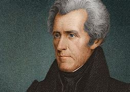
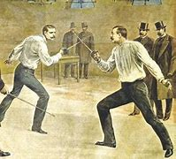
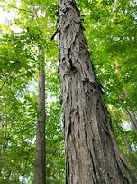
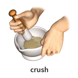

title:: 047 Andrew Jackson: Loved/Hated

- # 047 Andrew Jackson: Loved/Hated
- pure
  collapsed:: true
	- VOA Learning English presents America’s Presidents.
	- Andrew Jackson, the seventh president, was unlike the earlier U.S. presidents.
	- His family was poor, he had little education, and he lived on what was then the western part of the country.
	- Jackson became nationally known in the early 1800s – first as a fighter against Native American tribes, and then as a general in the War of 1812 against the British.
	- His image as a military hero and man of the people made him a popular choice for the presidency.
	- But critics said Jackson did not accept any limits on his power.
	- He is also remembered for supporting slavery, and for forcing Native Americans from their homes.
	- ## Wild child
	- Andrew Jackson’s parents were immigrants from Ireland. His father died in an accident before Andrew, the third and youngest son, was born.
	- When the American colonies entered a war of independence, Andrew and his two brothers fought against the British – although Andrew was too young to be a regular soldier.
	- Andrew’s oldest brother soon died.
	- Then Andrew and his other brother were both captured by British soldiers. One cut Andrew’s face, leaving a scar that remained his entire life.
	- But Andrew, unlike his brother, survived captivity.
	- A short time later, Andrew’s mother became sick and died.
	- By age 15, Andrew Jackson had no living immediate family.
	- He had already stopped attending school, but taught himself enough to become a lawyer. He moved to what became Nashville, Tennessee, where he developed a successful law career.
	- In time, he bought land and slaves.
	- Jackson was tall and thin, with red hair and bright blue eyes. Sometimes Jackson was playful. He loved to dance, hold parties, and play games where he could win money.
	- Sometimes he was violent. He was known for getting angry easily. Jackson fought duels with several men. In one, he killed a man who insulted his wife.
	- Yet many people liked Jackson’s passionate, action-first personality. By the time the United States entered the War of 1812, Jackson had been a congressman, senator, and judge.
	- ## Three nicknames
	- Jackson did not have any officially recognized military training. But during the War of 1812, he volunteered in the Tennessee militia and quickly took control of troops.
	- Many of his soldiers came to respect him. Jackson refused to give up, even when the government ordered the militia to disband. And, when some of the men wanted to leave, he threatened them with a gun.
	- Because he was uncompromising and strong as a tree, soldiers called Jackson “Old Hickory.”
	- A group of Creek Indians gave him another name. After he defeated them in battle, Jackson negotiated a treaty that punished both his Native American enemies and his Native American allies.
	- The treaty was more severe than the U.S. government had asked. In time, it forced the Creeks – as well as several other tribes – off their land.
	- The move was popular with many white settlers. It was less popular with the Creeks, who called Jackson “Sharp Knife.”
	- His best-known military operation was in New Orleans, Louisiana. A large, experienced army of British soldiers moved to attack. Jackson defended the city with a small group of untrained soldiers. His group included volunteers, free blacks, Creoles, Native Americans, and pirates.
	- Jackson’s ragtag troops not only defeated the British force, but suffered only a few losses.
	- Jackson didn't know that the battle came after the British and Americans had already agreed to end the war. But his victory there gave many Americans a feeling of pride.
	- It also made Jackson famous. He became known across the country as the “Hero of New Orleans.”
	- ## A man of the people
	- Voters across the country supported Jackson, too. He was especially well-liked in the South and West.
	- Many Americans saw him as a man of the people. They believed his success came from experience and hard work, not wealth and family connections.
	- In the presidential election of 1824, Jackson received more popular and electoral votes than any of the other candidates. But, because no candidate had a majority, lawmakers in the House of Representatives decided the election.
	- Those lawmakers chose John Quincy Adams, the son of former president John Adams. They were persuaded, in part, because a leader in Congress, named Henry Clay, said Jackson did not have the temperament to be president.
	- Immediately after Quincy Adams won, he appointed Clay secretary of state.
	- The appointment angered Jackson. He believed Adams and Clay had entered into a “corrupt bargain.”
	- In the next presidential election four years later, Jackson defeated Quincy Adams in a landslide.
	- And in the presidential election after that, he crushed Henry Clay.
	- ## A powerful president
	- Jackson wanted to be a powerful leader who controlled a limited federal government. But he wanted that government to have power over state governments.
	- For example, Jackson refused to let the state of South Carolina nullify, or ignore, a federal law that state officials opposed. Jackson said if they failed to obey the law, he would consider them traitors and send in troops.
	- In time, South Carolina and Congress were able to reach a compromise on the law.
	- Jackson also refused to extend the charter of the National Bank. He believed the bank helped industrialists and businesses more than farmers and settlers. His move was popular with many voters – especially farmers and settlers.
	- But Jackson’s opponents warned against the bank veto. They disagreed with his economic plan, and they objected to how he had operated outside of Congress. Senators censured Jackson for acting as if he did not have to follow the law.
	- Jackson’s supporters fought back. They removed the official criticism from the Senate records.
	- ## Indian Removal Act of 1830
	- Jackson vetoed more bills than the first six presidents combined. He actively worked for only one major law: the Indian Removal Act of 1830.
	- Jackson believed Native Americans occupied land that should belong to white settlers. He also thought Native Americans would be destroyed or lose their culture to white people anyway.
	- So he offered several tribes what appeared to be generous treaties to move onto land west of the Mississippi River.
	- But the treaties were often unfair or illegal. The tribes who accepted rarely received the benefits Jackson promised them. And some tribes, such as the Cherokees, simply refused to go.
	- Empowered by Jackson’s Indian Removal Act, U.S. government officials eventually forced 15,000 Cherokees off their land. They were made to march over 1,600 kilometers. About 4,000 died on the march. It is remembered as the “Trail of Tears.”
	- For white settlers, Jackson’s Indian removal policies resulted in over 100,000 square kilometers of new land to farm. Thousands of cotton planters moved west with their enslaved workers.
	- The Indian Removal Act served not only to aid an economic boom in cotton, but to spread slavery further in the United States. Jackson had no objections.
	- ## Final years
	- In 1837, Jackson officially moved out of the White House – but he did not really leave the presidency. He advised the presidents who followed him from his home in Tennessee.
	- Jackson had particular influence over two future leaders: Martin Van Buren, his former vice president; and James Polk, who shared Jackson’s beliefs so closely that he was called “Young Hickory.”
	- Jackson’s beloved wife, Rachel, had died before he took office. They did not have any children together, but they raised two boys: a Native American orphan who died as a teenager; and a nephew, whom they called Andrew Jackson, Jr.
	- The younger Andrew Jackson and his wife lived with the former president in his final years.
	- He died in his bed at 78 of old wounds and old age. But his legacy remains very much alive.
	- ## Legacy
	- Jackson changed the U.S. presidency. After him, presidential candidates had to show they could connect with voters, not just lawmakers.
	- He also increased the power of the chief executive. Jackson often questioned – or dismissed – the power of Congress, the Constitution, and the Supreme Court.
	- And, he began the custom of replacing experienced government officials with people whose main qualification was their loyalty to him.
	- Critics added to Jackson’s nicknames. They called him King Andrew, King Mob, or American Cesar. The opposition to Jackson led to a new political party called the Whigs.
	- Part of Jackson's legacy is the two major party system that exists in the U.S. today.
	- But those who loved Jackson really loved him. His humble beginnings, rise to power, and defense of the common man inspired them.
	- In the U.S., the name of Andrew Jackson is still often used as a positive symbol of American democracy.
- ---
- ## def
	- VOA Learning English presents America’s Presidents.
	- Andrew Jackson, the seventh president, was unlike the earlier U.S. presidents.
		- > Andrew Jackson
		  {:height 187, :width 254}
	- His family was poor, he had little education, and he lived on what was then the western part of the country.
	- Jackson became nationally known(a.) /in the early 1800s – first as a fighter /against Native American tribes, and then as a general /in the War of 1812 against the British.
	- His image(n.) as a military hero /and man of the people /made him a popular choice for the presidency.
		- > ▶ man of the people 平民出身的人，同人民打成一片的人; 人民之子
		- 他作为军事英雄和人民的形象使他成为总统的热门人选。
	-
	- But critics said /Jackson did not accept any limits on his power.
	- He is also remembered for supporting slavery, and for forcing Native Americans from their homes.
		- 他还因支持奴隶制, 和迫使印第安人离开家园, 而被记住。
	- ## Wild child
	- Andrew Jackson’s parents /were immigrants from Ireland. His father died in an accident /before Andrew, the third and youngest son, was born.
	- When the American colonies /entered a war of independence, Andrew and his two brothers fought against the British – although Andrew was too young to be **a regular soldier**.
		- > ▶  regular  [ only before noun ] belonging to or connected with the permanent armed forces or police force of a country 常备军的；正规军的
		  -> a regular army/soldier 正规军；正规军士兵
	- Andrew’s oldest brother soon died.
	- Then Andrew and his other brother /were both captured by British soldiers. One cut Andrew’s face, leaving a scar /that remained his entire life.
		- > ▶ remain (v.)to still be present after the other parts have been removed, used, etc.; to continue to exist 剩余；遗留；继续存在 /to continue to be sth; to be still in the same state or condition 仍然是；保持不变
		  -> to remain silent/standing/seated/motionless 依然沉默╱站着╱坐着╱一动不动
	- But Andrew, unlike his brother, survived captivity.
		- > ▶ captivity (n.) [ U ] the state of being kept as a prisoner or in a confined space 监禁；关押；困住
	- A short time later, Andrew’s mother became sick and died.
	- By age 15, Andrew Jackson had no living immediate family.
		- > ▶ immediate (a.)[ only before noun ] nearest in relationship or rank （关系或级别）最接近的，直系的，直接的 /[ only before noun ] having a direct effect （作用）直接的
		  -> The funeral was attended by her **immediate family** (= her parents, children, brothers and sisters) only. 只有她的直系亲属参加了葬礼。
		  -> He is my **immediate superior** (= the person directly above me) in the company. 他在公司里是我的顶头上司。
		  -> **The immediate cause of death** is unknown. 造成死亡的直接原因不明。
		- 15岁时，安德鲁·杰克逊已经没有活着的直系亲属了。
	- He had already stopped attending school, but taught himself enough to become a lawyer. He moved to what became Nashville, Tennessee, where he developed a successful law career.
		- > ▶ career (n.)the series of jobs that a person has in a particular area of work, usually involving more responsibility as time passes 生涯；职业
		  -> a career in politics 从政生涯
		- 他已经辍学了，但自学成才，成为了一名律师。他搬到了后来的田纳西州纳什维尔，在那里他发展出了一份成功的法律事业。
	- In time, he bought land and slaves.
		- ((62428f9a-16ab-42bc-9e3a-d801af076463))
	- Jackson was tall and thin, with red hair and bright blue eyes. Sometimes Jackson was playful. He loved to dance, hold parties, and play games where he could win money.
		- > ▶ playful : full of fun; wanting to play 有趣的；爱嬉戏的；爱玩的
		- 举办聚会，玩能赢钱的游戏。
	- Sometimes he was violent. He was known for getting angry easily. Jackson **fought duels** with several men. In one, he killed a man who insulted his wife.
		- > ▶ duel (n.)a formal fight with weapons between two people, used in the past to settle a disagreement, especially over a matter of honour 决斗
		  -> to fight/win a duel 进行╱赢得决斗
		  
		- id:: 62551a57-3d5c-44b9-b77b-5f12d26dfd6e
		  > ▶ insult (v.)/ɪnˈsʌlt/  [ VN ] to say or do sth that offends sb 辱骂；侮辱；冒犯
		  -> in-,进入，使，-sul,跳，词salient,salmon.即跳起来打，后用于指语言侮辱，侵犯，冒犯。
	- Yet many people liked Jackson’s passionate, action-first personality. By the time the United States entered the War of 1812, Jackson had been a congressman, senator, and judge.
		- 然而，许多人喜欢杰克逊热情、行动至上的性格。
	- ## Three nicknames
	- Jackson did not have any officially recognized military training. But during the War of 1812, he volunteered in the Tennessee militia /and quickly took control of troops.
		- > ▶ volunteer (v.)~ (sth) (for/as sth) : to offer to do sth without being forced to do it or without getting paid for it 自愿做；义务做；无偿做 /~ (for sth) to join the army, etc. without being forced to 自愿参军；当志愿兵
	- Many of his soldiers came to respect him. Jackson refused to give up, even when the government ordered the militia to disband. And, when some of the men wanted to leave, he threatened them with a gun.
		- > ▶ disband (v.)to stop sb/sth from operating as a group; to separate or no longer operate as a group 解散；解体；散伙
	- Because he was uncompromising and strong as a tree, soldiers called Jackson “Old Hickory.”
		- > ▶ uncompromising (a.) unwilling to change your opinions or behaviour 不让步的；不妥协的；强硬的
		- > ▶ hickory  /ˈhɪkəri/   (n.)[ U ] the hard wood of the N American hickory tree 山核桃木（产于北美）
		  => 来自北美印第安土著语。
		  
		- 因为他不妥协，像树一样强壮，士兵们称杰克逊为“老山胡桃”。
	- A group of Creek Indians /gave him another name. After he defeated them in battle, Jackson negotiated a treaty /that punished **both** his Native American enemies **and** his Native American allies.
		- > ▶ Creek : a member of a Native American people, many of whom now live in the US state of Oklahoma 克里克人（美洲土著，很多现居于美国俄克拉何马州）
		- ((6242bce2-c615-4ea1-93a7-2cec2117777b))
		- 在他打败印第安人之后，杰克逊与他们达成了一项条约，惩罚他的印第安敌人, 和他的印第安盟友。
		-
	- The treaty was **more** severe **than** the U.S. government had asked. In time, it forced the Creeks – as well as several other tribes – off their land.
	- The move was popular with many white settlers. It was less popular with the Creeks, who called Jackson “Sharp Knife.”
		- > ▶ sharp (a.)having a fine edge or point, especially of sth that can cut or make a hole in sth 锋利的；锐利的；尖的
	- His best-known military operation /was in New Orleans, Louisiana. A large, experienced(a.) army of British soldiers /moved to attack. Jackson defended the city /with a small group of untrained soldiers. His group included volunteers, free blacks, Creoles, Native Americans, and pirates.
		- > ▶ experienced  (a.)~ (in sth) : having knowledge or skill in a particular job or activity 有经验的；熟练的 /有阅历的；有见识的；老练的
		- > ▶ Creole [ C ] a person whose ancestors were among the first Europeans who settled in the West Indies or S America, or one of **the French or Spanish people** who settled in the southern states of the US 克里奥尔人（指首批定居在西印度群岛或南美的欧洲人的后裔，或定居在美国南部诸州的法国人和西班牙人的后裔）
		- 一支规模庞大、经验丰富的英国军队开始进攻。杰克逊率领一小群未经训练的士兵保卫这座城市。他的团体包括志愿者、自由黑人、克里奥耳人、印第安人和海盗。
	- Jackson’s ragtag troops /not only defeated the British force, but suffered only a few losses.
		- ((6243b99b-de78-4ae4-a48c-19c51a984fad))
	- Jackson didn't know that /the battle came /after the British and Americans had already agreed to end the war. But his victory there /gave many Americans a feeling of pride.
	- It also made Jackson famous. He became **known** across the country **as** the “Hero of New Orleans.”
	- ## A man of the people
	- Voters across the country supported Jackson, too. He was especially well-liked in the South and West.
		- > ▶ well-liked ADJ liked by many people; popular 受人喜爱的; 受欢迎的
	- Many Americans saw him as a man of the people. They believed his success came from experience and hard work, not wealth and family connections.
		- 许多美国人视他为人民的代表。他们认为他的成功来自经验和努力，而不是财富和家庭关系。
	- In **the presidential election** of 1824, Jackson received **more** popular and electoral votes **than** any of the other candidates. But, because no candidate had a majority, lawmakers in the House of Representatives /decided the election.
		- > ▶  electoral votes  选举人票, 选举团所投的票
	- Those lawmakers chose John Quincy Adams, the son of former president John Adams. They were persuaded, in part, because a leader in Congress, named Henry Clay, said Jackson did not have the temperament to be president.
		- > ▶ temperament (n.)[ CU ] a person's or an animal's nature as shown in the way they behave or react(v.) to situations or people （人或动物的）气质，性情，性格，禀性
		- 这些议员选择了约翰·昆西·亚当斯，前总统约翰·亚当斯的儿子。他们被说服的部分原因是，国会一位名叫亨利。克莱的领导人说，杰克逊没有当总统的气质。
	- Immediately after Quincy Adams won, he appointed Clay **secretary of state**.
	- The appointment angered(v.) Jackson. He believed Adams and Clay had entered into a “corrupt bargain.”
		- 这一任命激怒了杰克逊。他认为亚当斯和克莱达成了一项“腐败交易”。
	- In the next presidential election /four years later, Jackson defeated Quincy Adams in a landslide.
		- ((c5ea4b73-acac-4f76-950f-4ba35562aeec))
	- And in the presidential election after that, he crushed Henry Clay.
		- > ▶ crush (v.)to break sth into small pieces or into a powder by pressing hard 压碎；捣碎；碾成粉末 /to press or squeeze sth so hard that it is damaged or injured, or loses its shape 压坏；压伤；挤压变形 /镇压；（用暴力）制伏
		  
	- ## A powerful president
	- Jackson wanted to be a powerful leader /who controlled a limited federal government. But he wanted that government /to have power over state governments.
		- 但他希望政府拥有高于州政府的权力。
	- For example, Jackson refused to let _the state of South Carolina_ nullify(v.), or ignore(v.), a federal law /that state officials opposed(v.). Jackson said /if they failed to obey the law, he would consider them traitors(n.) and **send in** troops.
		- > ▶ nullify  /ˈnʌlɪfaɪ/  (v.) to make sth such as an agreement or order **lose(v.) its legal force** 使失去法律效力；废止 SYN invalidate  /to make sth lose its effect or power 使无效；抵消
		  -> An unhealthy diet will nullify the effects of training. 不健康的饮食会抵消锻炼的效果。
		  => 来自拉丁语nullus,无，没有，词源同no,-fy,使。引申词义使废除，使无效。
		- > ▶ traitor (n.)   /ˈtreɪtər/  ~ (to sb/sth) a person who gives away secrets about their friends, their country, etc. 背叛者；叛徒；卖国贼
		  => 前缀tra=trans，表“穿过，由此及彼”，如transport（运输）；-it-是词根dit的简化，表“给”，如editor（编辑），编辑就是将成稿对外呈现，向外给出的人；or名词后缀；所以它本义是“交付、给出（内部信息）的人”。可用同源词betray（背叛）助记。
		- > ▶ send in  : PHRASAL VERB When a government **sends in** troops or police officers, it orders them to deal with a crisis or problem somewhere. 派遣 (军队或警察)
		- 杰克逊拒绝让南卡罗来纳州废除或无视"该州官员反对的一项联邦法律"。
	- In time, South Carolina and Congress /were able to reach a compromise on the law.
	- Jackson also refused to extend the charter of the National Bank. He believed the bank helped industrialists and businesses more than farmers and settlers. His move was popular with many voters – especially farmers and settlers.
		- > ▶ charter (n.)[ C ] an official document stating that a ruler or government allows a new organization, town or university to be established and gives it particular rights （统治者或政府准许成立新的组织、城镇、大学等并授予某种权利的）特许状，许可证，凭照 /a written statement describing the rights that a particular group of people should have （说明某部分民众应有权利的）宪章
	- But Jackson’s opponents /warned against the bank veto. They disagreed with his economic plan, and they **objected(v.) to** how he had operated /outside of Congress. Senators **censured**(v.) Jackson **for** acting as if /he did not have to follow the law.
		- id:: 625521d9-7b9a-47f7-8627-a6b265a88a12
		  > ▶ veto (n.)(v.)[ CU ] **the right** to refuse to allow sth to be done, especially the right to stop a law from being passed or a decision from being taken 否决权
		- > ▶ censure (v.)(n.)[ VN ] ~ sb (for sth) ( formal ) to criticize sb severely, and often publicly, because of sth they have done （公开地）严厉斥责，谴责
		- 但是杰克逊的反对者警告称, 他们反对"对银行的否决"。他们不同意杰克逊的经济计划，也反对他在国会之外的行事方式。参议员们指责杰克逊表现得好像他不必遵守法律。
	- Jackson’s supporters fought(v.) back. They **removed** the official criticism **from** the Senate records.
		- 杰克逊的支持者进行了反击。他们从参议院记录中删除了官方的批评。
	- ## Indian Removal Act of 1830
	- Jackson vetoed more bills than the first six presidents combined. He actively worked for only one major law: the Indian Removal Act of 1830.
		- > ▶ actively adv. 积极地；活跃地，有活力地
		- 杰克逊否决的法案比前六位总统否决的法案加起来还要多。他只积极为一项主要法律工作:1830年的《印第安人迁移法案》。
	- Jackson believed /Native Americans occupied land /that should belong to white settlers. He also thought /Native Americans would be destroyed or **lose** their culture **to** white people anyway.
		- 杰克逊认为，印第安人占领了本该属于白人定居者的土地。他还认为，无论如何，美国原住民都会被摧毁，或者失去他们的文化。
	- So he offered several tribes /what **appeared to be** generous treaties /to move onto land /west of the Mississippi River.
		- 因此，他向几个部落提供了看似慷慨的协议，让他们搬到密西西比河以西的土地上。
	- But the treaties were often unfair or illegal. The tribes /who accepted /rarely received the benefits /Jackson promised them. And some tribes, such as the Cherokees, simply refused to go.
		- 但这些条约往往是不公平或非法的。那些接受的部落, 很少得到杰克逊许诺给他们的好处。
	- Empowered(v.) by Jackson’s Indian Removal Act, U.S. government officials eventually forced(v.) 15,000 Cherokees off their land. They were made /to march(v.) over 1,600 kilometers. About 4,000 died on the march. It is remembered as the “Trail of Tears.”
		- > ▶ empower (v.)( formal ) to give sb the power or authority to do sth 授权；给（某人）…的权力 /to give sb more control over their own life or the situation they are in 增加（某人的）自主权；使控制局势
		- > ▶ trail  :a long line or series of marks that is left by sb/sth （长串的）痕迹，踪迹，足迹 /a route that is followed for a particular purpose （特定）路线，路径
		  => 来自古法语 trailler,拖，拉，跟踪，来自通俗拉丁语 tragulare,拉，来自拉丁语 trahere,拖，拉， 使移动，词源同 drag,tract.拼写比较 rule,regulate.引申诸相关词义。
		  
		- 在杰克逊的印第安人迁移法案的授权下，美国政府官员最终迫使15000名切诺基人离开他们的土地。他们被迫行进了1600多公里。大约有4000人在过程中丧生。它被称为“泪水之路”。(在“血泪之路”期间，约16,000名切罗基族人被迫离开他们的土地，迁移到密西西比河以西。大约四分之一的人死在了途中。)
	- For white settlers, Jackson’s _Indian removal policies_ **resulted in** over 100,000 square kilometers of new land /to farm(v.). Thousands of cotton planters /moved(v.) west /with their enslaved workers.
		- 对于白人定居者来说，杰克逊的印第安人迁移政策, 导致了超过10万平方公里的新土地可以耕种。成千上万的棉花种植者, 带着他们的奴隶工人, 向西部迁移。
	- The Indian Removal Act served(v.) not only to aid an economic boom in cotton, but to spread slavery further in the United States. Jackson had no objections.
		- > ▶ slavery  (n.)the practice of having slaves 奴隶制；蓄奴 /the state of being a slave 奴隶身份
		  -> to be sold into slavery 被卖为奴
		- > ▶ objection (n.)~ (to sth/to doing sth)~ (that...) a reason why you do not like or are opposed to sth; a statement about this 反对的理由；反对；异议
	- ## Final years
	- In 1837, Jackson officially moved out of the White House – but he did not really leave the presidency. He advised the presidents /who followed him /from his home in Tennessee.
		- 1837年，杰克逊正式搬离白宫，但他并没有真正离开总统职位。他从田纳西的家中为追随他的总统们出谋献策。
	- Jackson had particular influence over two future leaders: Martin Van Buren, his former vice president; and James Polk, who shared Jackson’s beliefs **so** closely **that** he was called “Young Hickory.”
		- 杰克逊对两名未来的领导人有着特殊的影响.
	- Jackson’s beloved wife, Rachel, had died before he took office. They did not have any children together, but they raised two boys: a Native American orphan /who died as a teenager; and a nephew, whom they called Andrew Jackson, Jr.
	- The younger Andrew Jackson and his wife /lived with the former president /in his final years.
		- 小安德鲁·杰克逊和他的妻子, 在杰克逊生命的最后几年, 与这位前总统生活在一起。
	- He **died** in his bed at 78 **of** old wounds and old age. But his legacy remains(v.) very much alive.
		- 78岁时，他因老伤老病死在床上。但他的遗产仍然活跃在后世。
	- ## Legacy
	- Jackson changed the U.S. presidency. After him, presidential candidates had to show they could connect with voters, not just lawmakers.
		- 在他之后，总统候选人必须表明他们能够与选民建立联系，而不仅仅是议员。
	- He also increased the power of **the chief executive**. Jackson often questioned(v.) – or dismissed(v.) – the power of Congress, the Constitution, and the Supreme Court.
		- > ▶ dismiss (v.)~ sb/sth (as sth) : to decide that sb/sth is not important and not worth thinking or talking about 不予考虑；摒弃；对…不屑一提
		  -> He **dismissed** the opinion polls **as** worthless. 他认为民意测验毫无用处而不予考虑。
		- 他还增加了行政长官的权力。杰克逊经常质疑或驳回国会、宪法和最高法院的权力。
	- And, he began the custom of **replacing** experienced government officials **with** people /whose main qualification was their loyalty to him.
		- > ▶ qualification :  information that you add to a statement to limit the effect that it has or the way it is applied 限定条件 /a skill or type of experience that you need for a particular job or activity （通过经验或具备技能而取得的）资格；资历
		  -> The plan was approved **without qualification**. 这项计划获得无条件批准。
		  -> Previous teaching experience is **a necessary qualification** for this job. 教学经验是担任这项工作的必备条件。
		- 此外，他还开始了"用忠于他的人取代有经验的政府官员"的习俗。
	- Critics added to Jackson’s nicknames. They called him King Andrew, King Mob, or American Cesar. The opposition to Jackson /led to a new political party called the Whigs.
		- > ▶ mob (n.)[ Csing.+sing./pl.v. ] a large crowd of people, especially one that may become violent or cause trouble 人群；（尤指）暴民 /(v.)if a crowd of birds or animals mob another bird or animal, they gather round it and attack it （鸟群或兽群）围攻，聚众袭击
		- > ▶ Whig : in Britain in the past, a member of a party that supported progress and reform and that later became the Liberal Party 辉格党党员（属于英国旧时的激进党派，自由党的前身）
		  辉格党（Whig Party）为美国在杰克森式民主（Jacksonian democracy）时代的一个政党，前身是国家共和党。具体的说，辉格党拥护国会立法权高于总统内阁的执行权，赞同现代化与经济发展纲领。该党自选“辉格”为名，附和反对英国王室君主专权的英国辉格党，反对总统专断。
		- 批评者们给杰克逊增添了很多绰号。他们称他为安德鲁王，暴民王，或美国凯撒。对杰克逊的反对, 导致了一个新政党的出现，叫做辉格党。
	- Part of Jackson's legacy /is the two major party system /that exists in the U.S. today.
		- 杰克逊留下的遗产之一, 就是今天美国存在的两大政党制度。
	- But those who loved Jackson /really loved him. His humble beginnings, rise to power, and defense of the common man /inspired(v.) them.
		- inspire (v.)~ sb (to sth) : to give sb the desire, confidence or enthusiasm to do sth well 激励；鼓舞 / ~ sb (with sth)~ sth (in sb) : to make sb have a particular feeling or emotion 使产生（感觉或情感） /赋予灵感；引起联想；启发思考
	- In the U.S., the name of Andrew Jackson /is still often used as a positive symbol of American democracy.
-