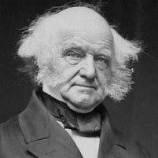

title:: 048 Martin Van Buren: OK

-
- ## 048 Martin Van Buren: OK
- ## pure
  collapsed:: true
	- VOA Learning English presents America’s Presidents.
	- Today we are talking about Martin Van Buren. He was sworn in as the eighth president of the United States in 1837.
	- Van Buren had already been working for the White House for several years. He had been the secretary of state for President Andrew Jackson, and later his vice president.
	- Jackson asked his party, the Democrats, to nominate Van Buren as their presidential candidate in the 1836 election.
	- They agreed, and Van Buren won that election easily. But he did not win the next election. Or the next. Or the next.
	- ## Presidency
	- In his inaugural speech in 1837, Van Buren noted that he was the first U.S. president to be born after the American Revolution.
	- He was also the first president who was not from a British family. His ancestors were Dutch.
	- He remains the only president – so far – who did not speak English as his first language.
	- In his inaugural speech, Van Buren predicted better times for Americans.
	- But several days later, an economic crisis struck. The situation put the country in a depression that lasted for the rest of Van Buren’s term. It was one reason the president’s opponents called him “Martin Van Ruin.”
	- The depression was not Van Buren’s only problem. He also faced a dispute with Britain related to the border between the U.S. and Canada. The conflict nearly turned into war.
	- Historian Joel Silbey says most experts do not think Van Buren was a strong president.
	- However, Silbey notes, Van Buren left an important legacy that still operates today: He created the modern U.S. political system.
	- ## Early life
	- Van Buren’s political education began early.
	- His father was a farmer and operated a hotel at a small town in New York State. Lawmakers sometimes visited the hotel. By listening to them, the future president learned about politics.
	- Eventually, Van Buren studied in a law office and became a lawyer. In the first years of his career, he defended farmers who were fighting large plantation owners for their land. As a result, he developed a reputation for helping the common man.
	- Van Buren became a local official, and then a senator and governor of New York.
	- When he was 24, he married a young woman he had grown up with. But she died of tuberculosis after 12 years, leaving him with four sons.
	- Historian Joel Silbey says although Van Buren did not remarry, “he was known as quite charming among the ladies.”
	- ## Political animal
	- Van Buren had a gift for politics – that is, developing relationships and forming alliances.
	- Historian Joel Silbey says most people who knew Van Buren liked him. He seemed warm and friendly. He tried to keep his work-related life and social activities separate. It was not unusual to see him exchange handshakes, smiles and jokes with men who were his political enemies.
	- His ability to make friends became a powerful tool. Before Van Buren, even lawmakers from the same political party operated independently. They had their own beliefs, their own supporters, and their own allies. Van Buren brought them together.
	- First he identified people who followed the ideas of Thomas Jefferson: support for independent farmers and states’ rights. The group had become known as the Democratic Party (although it was in many ways different from the Democratic Party of today).
	- Van Buren organized meetings for Democrats to talk about their political beliefs. He persuaded them to support the same policies – at that time, the policies of Andrew Jackson.
	- Sometimes, Van Buren helped people who supported Jackson’s policies. He gave them government jobs.
	- Van Buren also used a series of meetings to choose one presidential candidate for the party. If this process seems clear-cut, it was not at the time. During the election of 1824, for example, a single party had four separate candidates for president, one for each part of the country.
	- Van Buren’s system eventually gave rise to the national conventions that major U.S. parties use today to nominate their candidates.
	- ## Model campaigner
	- Van Buren also helped create the modern political campaign. In the 1820s, he saw that many state constitutions were lifting some of their voting restrictions. As a result, states were giving more white males the right to vote. (Women and most African-American men were still largely prohibited from voting.)
	- Historian Joel Silbey says Van Buren wanted to bring these new voters into the Democratic Party. He decided to improve on the methods that other, smaller groups had used: campaign events, speeches, and organized efforts to bring people to vote on Election Day.
	- Silbey explains that these efforts to persuade and energize voters were new to national politics. Now they are some of the major features of political campaigns.
	- ## Live by the sword, die by the sword
	- In the election of 1840, Van Buren sought a second term as president. This time his opponents used Van Buren’s political techniques against him.
	- Silbey says the new opposition party, called the Whigs, used popular speeches and events to portray Van Buren as a failed president.
	- Crowds shouted, “Mattie Van is a used-up man!” In other words, he no longer had any power or effect in government.
	- Critics also made fun of Van Buren’s fine-looking, even fussy clothes. They portrayed him as a rich, elite candidate. They compared him unfavorably to their candidate, a military hero named William Henry Harrison.
	- Yet it was Van Buren who had come from a poor family, and Harrison from a wealthy one.
	- Even so, Van Buren lost the election of 1840.
	- Four years later, Van Buren again sought the presidency. This time, even Andrew Jackson did not support him. Instead, Jackson backed a man who supported the seizure of Texas and expanding slavery: James Polk.
	- But Van Buren did not permit those defeats to stop his political career. He ran again in the presidential election of 1848.
	- This time, Van Buren withdrew from the Democratic Party he had helped build. He ran instead as the candidate of a new, anti-slavery party, called the Free Soilers.
	- But even Van Buren’s political skills could not persuade voters. He did not win a single state.
	- ​After losing this final presidential election, Van Buren finally retired. He spent time with his children and grandchildren, traveled, and wrote about his life.
	- At 79 he died of heart failure.
- ---
- ## def
	- VOA Learning English presents America’s Presidents.
	- Today we are talking about Martin Van Buren. He was **sworn(v.) in as** the eighth president of the United States in 1837.
		- > ▶ Martin Van Buren
		  {:height 208, :width 201}
		- > ▶ swear (v.)[ no passive ] to make a serious promise to do sth 郑重承诺；发誓要；表示决心要 /~ (at sb/sth) to use rude or offensive language, usually because you are angry 咒骂；诅咒；说脏话
		  ▶  **SWEAR SB←→ˈINˌSWEAR SB ˈINTO STH**
		  [ often passive ] to make sb promise to do a job correctly, to be loyal to an organization, a country, etc. 使某人宣誓就职；使某人宣誓忠于某组织（或国家等）
		  -> He was sworn in as president. 他宣誓就任总统。
	- Van Buren had already been working for the White House /for several years. He had been **the secretary of state** for President Andrew Jackson, and later his vice president.
	- Jackson asked his party, the Democrats, **to nominate** Van Buren **as** their presidential candidate in the 1836 election.
	- They agreed, and Van Buren won that election easily. But he did not win the next election. Or the next. Or the next.
	- ## Presidency
	- In his **inaugural speech** in 1837, Van Buren noted that /he was the first U.S. president to be born /after the American Revolution.
		- ((ac1ba830-4dcf-4812-abd0-461ee5bee81c))
	- He was also the first president /who was not from a British family. His ancestors were Dutch.
	- He remains the only president – so far – who did not speak English as his first language.
	- In his inaugural speech, Van Buren predicted better times for Americans.
		- > ▶ predict (v.)to say that sth will happen in the future 预言；预告；预报
		- 范布伦预言美国人会过得更好
	- But several days later, an economic crisis struck. The situation put the country in a depression /that lasted for the rest of Van Buren’s term. It was one reason /the president’s opponents called him “Martin Van Ruin.”
	- The depression was not Van Buren’s only problem. He also faced a dispute with Britain /related to the border between the U.S. and Canada. The conflict nearly turned into war.
	- Historian Joel Silbey says /most experts do not think Van Buren was a strong president.
		- ((62429c7e-eb1e-419a-9ffc-b99d6b7b98e4))
	- However, Silbey notes, Van Buren left an important legacy /that still operates today: He created the modern U.S. political system.
	- ## Early life
	- Van Buren’s political education began early.
	- His father was a farmer /and operated a hotel /at a small town /in New York State. Lawmakers sometimes visited the hotel. By listening to them, the future president learned about politics.
	- Eventually, Van Buren studied /in a law office /and became a lawyer. In the first years of his career, he defended farmers /who were **fighting** large plantation owners **for** their land. As a result, he developed a reputation /for helping the common man.
		- > ▶ defend (v.)**~ (sb/yourself/sth) (from/against sb/sth)** to protect sb/sth from attack 防御；保护；保卫 /**~ sb/yourself/sth (from/against sb/sth)** : to say or write sth in support of sb/sth that has been criticized 辩解；辩白
		  -> Politicians are skilled at **defending themselves against** their critics. 从政者都善于为自己辩解，反驳别人的批评。
		- ((62429aca-e61a-4d1e-9349-ab2e5814dd2d))
		- 在他职业生涯的最初几年里，他为那些与大种植园主争夺土地的农民, 做辩护。
	- Van Buren became a local official, and then a senator and governor of New York.
		- > ▶ governor : ( also Governor ) a person who is the official head of a country or region that is governed by another country 统治者；管辖者；总督 /( also Governor ) a person who is chosen to be in charge of the government of a state in the US （美国的）州长
	- When he was 24, he married a young woman /he had grown up with. But she died of tuberculosis after 12 years, leaving him with four sons.
		- > ▶ tuberculosis :  /tuːˌbɜːrkjəˈloʊsɪs/  ( abbr. TB ) a serious infectious disease in which swellings appear on the lungs and other parts of the body 结核病
		  => tubercle,肺结核结节，-osis,表疾病。引申词义结核病。tuber,块茎，-cle,小词后缀。引申诸相关词义。
		  结核病, 是由"结核杆菌"感染引起的**慢性传染病**。结核菌可能侵入人体全身各种器官，但主要侵犯肺脏，称为肺结核病。结核病，又叫“痨病”.
		  **联合用药可防止耐药性产生. 联合用药还可针对各种代谢状态细菌及细胞内外菌选药，已达到强化药效的目的.**
		  **用药不能随意间断，间歇疗法在剂量及间隔上, 有特定要求.**
		  **化疗要坚持全程，目的在于消灭持存菌，防止复发，全程不一定是长程。**
		-
	- Historian Joel Silbey says /although Van Buren did not remarry, “he was known as quite charming /among the ladies.”
		- 他在女士们中被认为很有魅力。
	- ## Political animal
	- Van Buren had a gift for politics – that is, developing relationships and forming alliances.
		- Van Buren 在政治上很有天赋——也就是说，他能发展关系，结成联盟。
	- Historian Joel Silbey says /most people /who knew Van Buren /liked him. He seemed warm and friendly. He tried to **keep** his work-related life and social activities **separate**. It was not unusual /to see him **exchange** handshakes, smiles and jokes **with** men /who were his political enemies.
		- > ▶ work-related 工作相关, 与工作有关的
		- > ▶ exchange (v.)~ sth (with sb) to give sth to sb and at the same time receive the same type of thing from them 交换；交流；掉换
		  -> I shook hands /and **exchanged a few words with** the manager. 我与经理握手，相互交谈了几句。
		- 他试图把工作生活和社交活动分开。看到他和政敌握手、微笑、说笑话，是很平常的事。
	- His ability to make friends /became a powerful tool. Before Van Buren, even lawmakers from the same political party /operated independently. They had their own beliefs, their own supporters, and their own allies. Van Buren brought them together.
		- > ▶ independently adv. 独立地；自立地
		- 在范布伦之前，甚至连来自同一政党的议员, 都是独立行事的。他们有自己的信仰，自己的支持者，自己的盟友。范布伦让他们走到了一起。
	- First he identified people /who followed the ideas of Thomas Jefferson: support for independent farmers and states’ rights. The group had become known as the Democratic Party (although it **was** in many ways **different from** the Democratic Party of today).
		- > ▶ identify [ VN ] ( also informal also ID ) ~ sb/sth (as sb/sth) : to recognize sb/sth and be able to say who or what they are 确认；认出；鉴定 /to find or discover sb/sth 找到；发现
		  -> She was able to identify her attacker. 她认出了袭击她的人。
		- 首先，他找出了那些能追随托马斯·杰斐逊思想的人: 他们支持独立的农民, 和州的权利。这个团体后来被称为民主党(尽管它与今天的民主党, 在许多方面都不同)。
	- Van Buren organized meetings for Democrats /to talk about their political beliefs. He persuaded them to support the same policies – at that time, the policies of Andrew Jackson.
		- 范布伦为民主党人组织会议，讨论他们的政治信仰。他说服他们支持同样的政策——在当时，也就是安德鲁·杰克逊的政策。
	- Sometimes, Van Buren helped people /who supported Jackson’s policies. He gave them government jobs.
	- Van Buren also used a series of meetings /to choose one presidential candidate /for the party. If this process seems clear-cut(a.), it was not /at the time. During the election of 1824, for example, a single party had four separate candidates for president, one for **each part** of the country.
		- > ▶ clear-cut (a.)definite and easy to see or identify 明确的；明显的；易辨认的
		  -> **There is no clear-cut answer to this question.** 这个问题没有确切的答案。
		- 范布伦还通过一系列会议, 为该党挑选了一位总统候选人。如果这个过程看起来好像是很明确的话，这在当时却并不是这样。例如，在1824年的选举中，一个政党有四个独立的总统候选人，每个地区有一个候选人。
	- Van Buren’s system /eventually **gave rise to** the national conventions /that major(v.) U.S. parties /use(v.) today /to nominate their candidates.
		- > ▶ **give ˈrise to sth** : ( formal ) to cause sth to happen or exist 使发生（或存在）
		  -> The novel's success **gave rise to** a number of sequels. 这部小说的成功带来了一系列的续篇。
		- 范布伦的体系, 最终催生了今天美国主要政党用来提名候选人的全国代表大会制度。
	- ## Model campaigner
	- Van Buren also helped create **the modern political campaign**. In the 1820s, he saw that /many state constitutions(n.) were lifting some of their voting restrictions. As a result, states were giving more white males /the right to vote. (Women and most African-American men /were still largely prohibited from voting.)
		- > ▶ campaigner :  a person /who leads or takes part in a campaign, especially one /for political or social change （尤指政治或社会变革的）运动领导者，运动参加者
		- > ▶ constitution : the system of laws and basic principles that a state, a country or an organization is governed by 宪法；章程 /身体素质；体质；体格 
		  / ( formal ) the way sth is formed or organized SYN structure 构成；构造
		  -> the genetic constitution of cells 细胞的基因构造
		- 范布伦还帮助创建了现代政治竞选。在19世纪20年代，他看到许多州的宪法都取消了一些投票限制。因此，各州给予更多的白人男性选举权。(女性和大多数非裔美国人仍然在很大程度上被禁止投票。)
	- Historian Joel Silbey says /Van Buren wanted to **bring** these new voters **into** the Democratic Party. He decided **to improve on** the methods /that other, smaller groups had used: campaign events, speeches, and organized efforts /to bring people to vote on Election Day.
		- > ▶ improve (v.)to become better than before; to make sth/sb better than before 改进；改善
		  ▶ **IMˈPROVE ON/UPON STH** :
		  to achieve or produce sth that is of a better quality than sth else 改进；做出比…更好的成绩
		  -> We've certainly **improved on** last year's figures. 我们的业绩的确超过了去年的数字。
		- 范布伦想把这些新选民, 拉进民主党。他决定改进其他较小的团体使用的方法:竞选活动、演讲和组织活动，来让人们在选举日投票。
	- Silbey explains that /`主` these efforts to persuade(v.) and energize(v.) voters /`系` were new to national politics. Now they are some of **the major features** of political campaigns.
		- 这些说服和激励选民的努力行为, 对国家政治来说是全新的操作。如今, 它们已经成为政治竞选的一些主要特征了。
	- ## Live by the sword, die by the sword
	- In the election of 1840, Van Buren sought a second term as president. This time his opponents used Van Buren’s **political techniques** against him.
		- 这一次，他的对手利用范布伦的政治技巧, 来对付他。
	- Silbey says /the new opposition party, called the Whigs, used popular speeches and events /**to portray** Van Buren **as** a failed president.
		- > ▶ portray (v.)描绘；描画；描写 / **~ sb/sth (as sb/sth)** to describe or show sb/sth in a particular way, especially when this does not give a complete or accurate impression of what they are like 将…描写成；给人以某种印象；表现
	- Crowds shouted, “Mattie Van is a used-up man!” In other words, he no longer had any **power or effect** in government.
		- > ▶ used-up adj. 疲惫不堪的，精疲力竭的
			- 他在政府中不再有任何权力或影响。
	- Critics also **made fun of** Van Buren’s fine-looking, even fussy clothes. They **portrayed** him **as** a rich, elite candidate. They **compared** him unfavorably **to** their candidate, a military hero named William Henry Harrison.
		- > ▶ fine-looking 美貌的, 容貌和姿态美好的
		- 批评者还嘲笑范布伦的漂亮外表，甚至过分讲究的服装。他们把他描绘成是一个富有的精英候选人。他们把他与他们的候选人，一位名叫威廉·亨利·哈里森的军事英雄进行了不利的比较。
	- Yet it was Van Buren /who had come from a poor family, and Harrison from a wealthy one.
	- Even so, Van Buren lost the election of 1840.
	- Four years later, Van Buren again sought(v.) the presidency. This time, even Andrew Jackson did not support him. Instead, Jackson backed a man /who supported the seizure of Texas /and expanding slavery: James Polk.
	  id:: c596262b-f02b-411b-9262-25425714b3f3
		- > ▶ seizure (n.)~ (of sth) the act of using force to take control of a country, town, etc. 夺取；占领；控制 /~ (of sth) the use of legal authority to take sth from sb; an amount of sth that is taken in this way 起获；没收；充公；起获的赃物；没收的财产
		  -> the army's seizure of power 军队对政权的夺取
		- 他支持占领德克萨斯, 并扩大奴隶制。
	- But Van Buren did not **permit** those defeats **to stop** his political career. He ran again /in the presidential election of 1848.
	- This time, Van Buren **withdrew from** the Democratic Party /he had helped build. He ran instead as the candidate of a new, anti-slavery party, called the Free Soilers.
		- > ▶ soil  土壤 /国土；领土；土地
		- 这一次，范布伦退出了他帮助建立的民主党。相反，他以反奴隶制新政党“自由土壤党”(Free Soilers)的候选人身份参选。
	- But even Van Buren’s political skills /could not persuade voters. He did not win a single state.
	- ​After losing(v.) this final presidential election, Van Buren finally retired. He spent time with his children and grandchildren, traveled, and wrote about his life.
	- At 79 he died of **heart failure**.
		- > ▶ failure (n.)[ UC ] the state of not working correctly or as expected; an occasion when this happens 故障；失灵
		  -> patients suffering from **heart/kidney, etc. failure** 心脏、肾等衰竭的病人
		-