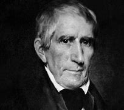
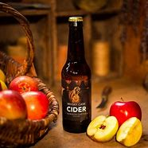
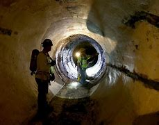

title:: 049 William Henry Harrison: Short-Lived

- ## 049 William Henry Harrison: Short-Lived
- ## pure
  collapsed:: true
	- VOA Learning English presents America's Presidents.
	- Today we are talking about William Henry Harrison. Although he was elected in 1840, many Americans still remember his catchy campaign slogan: "Tippecanoe and Tyler, too."
	- "Tyler" referred to John Tyler, Harrison's partner on the ticket. In other words, Harrison was the candidate for president, and Tyler was the candidate for vice president.
	- That seems straightforward enough. But "Tippecanoe"? That was Harrison's nickname. It came from a battle he had fought nearly 30 years before the presidential campaign.
	- At that time, Harrison led troops against an alliance of Native American tribes. The alliance was fighting white American settlers who were taking native people's territory.
	- Harrison and his men wanted to prevent the alliance from getting the supplies and warriors it needed to fight a long war. They planned to attack an important Native American base in what is today the state of Indiana.
	- But Native American warriors attacked first. They struck at dawn, when Harrison's men were still sleeping in a camp near the River Tippecanoe.
	- The battle was confused and bloody. Many fighters on both sides died. After several hours, Harrison's troops pushed the Native American fighters away from the camp.
	- It was not really clear who won, but Harrison declared victory.
	- His presidential campaign reminded voters about the battle. The nickname "Tippecanoe" suggested Harrison was a simple yet tough westerner who would fight for white Americans.
	- But that image of Harrison was not entirely true.
	- ## Early life
	- Harrison did not come from a simple, western family.
	- Instead, he was the youngest child of a wealthy family from the southern state of Virginia. The Harrisons were active in the politics of the young nation. His father signed the Declaration of Independence and became the governor of Virginia.
	- Young William Harrison received a good education. But he did not want to become a doctor or lawyer. He joined the military instead.
	- Harrison succeeded quickly as an Army officer. He earned a reputation as an able leader in fights against Native Americans.
	- Harrison became the governor of what was known as Indiana Territory.
	- In that job, he persuaded Native Americans to enter into treaties that sold their land to the U.S. government – often for very little money.
	- Harrison's insistence on securing land for white settlers was one reason Native American tribes formed an alliance against the United States. A member of the Shawnee tribe, Tecumseh, was one of their most prominent leaders.
	- It was Tecumseh's men who fought against Harrison in the Battle of Tippecanoe.
	- Tecumseh's men clashed again with Harrison during the War of 1812 at a battle in Ontario, Canada near the River Thames.
	- In that battle, both the British and Native Americans were clearly defeated. Tecumseh was killed.
	- After that, the Native American alliance fell apart. And Harrison became famous again.
	- ## Political career
	- Although Harrison was a well-known fighter against Native Americans, he could not find lasting success as a politician.
	- He served briefly in both the House of Representatives and the Senate, but he did not stay in those positions long.
	- He struggled with debt. His home in Indiana was very expensive.
	- He also had to provide for his ten children.
	- The emotional cost of his family was also high: only four of his children lived past the age of 40.
	- In 1836, Harrison's fortunes seemed to change. A new party, called the Whigs, looked to him as a presidential candidate.
	- The Whigs strongly opposed President Andrew Jackson and his policies. They did not want Jackson's vice president and right-hand man, Martin Van Buren, to become president. But they understood that Jackson was very popular with everyday Americans.
	- So the Whigs thought that Harrison – a military hero from the west, just as Jackson was – would appeal to voters. (At the time, voting was limited mostly to white men.)
	- The Whigs nominated Harrison as one of their candidates.
	- Harrison did well – but not well enough. Van Buren won the 1836 election.
	- But the next election belonged to Harrison.
	- His campaign developed that memorable song about "Tippecanoe and Tyler, too."
	- Supporters also turned an insult against Harrison into an advantage.
	- Harrison's opposition said he would be happy to spend the rest of his life just sitting in a log cabin and drinking hard cider – an alcoholic drink made from apples.
	- The opposition wanted to suggest that Harrison was not really interested in becoming president and working hard for the American people.
	- But Harrison's supporters used the images of a log cabin and hard cider to portray Harrison as a humble man who could relate to common Americans.
	- In 1842, the plan was a success: Harrison won the election.
	- ## A surprising turn of events
	- At 68, Harrison was the oldest person yet to take office.
	- On his Inauguration Day, he reportedly wanted to show that he was strong enough to serve as president by delivering a very long speech without wearing a coat or hat.
	- Several weeks later, Harrison became sick. He complained of many problems: anxiety, fatigue, and pain in his stomach.
	- His health grew worse and worse.
	- One month after he was sworn-in, Harrison died. It was the first time in the country's history that a president had died in office.
	- The event raised many questions about who would become president. That question is answered in the next episode of this series.
	- For future generations, it also raised a question about what Harrison died of. The traditional story is that his long inaugural speech led to a fatal pneumonia.
	- But researchers in 2014 proposed a different reason.
	- Jane McHugh and Philip Mackowiak wrote in the New York Times that, while Harrison was in office, Washington, DC did not have a good sewer system. Human waste "simply flowed onto public grounds a short distance from the White House."
	- The researchers conclude that Harrison probably died from problems related to drinking dirty water in the president's house.
	- So, for Harrison, winning the White House may not have been good fortune at all.
- ---
- ## def
	- VOA Learning English presents America's Presidents.
	- Today we are talking about William Henry Harrison. Although he was elected in 1840, many Americans still remember his catchy(a.) campaign slogan: "Tippecanoe and Tyler, too."
		- > ▶ William Henry Harrison
		  
		- > ▶ catchy (a.)( informal ) ( of music or the words of an advertisement 音乐或广告词 ) pleasing and easily remembered 悦耳易记的
		  -> a catchy tune/slogan 容易上口的乐曲╱口号
		- > ▶ Tippecanoe 美国一河流名
	- "Tyler" referred to John Tyler, Harrison's partner on the ticket. In other words, Harrison was the candidate for president, and Tyler was the candidate for vice president.
		- id:: 62566033-a86a-4549-b075-10c4e122a8a2
		  > ▶ ticket : [ usually sing. ] ( especially NAmE ) a list of candidates that are supported by a particular political party in an election （政党在选举中所支持的）候选人名单
		  -> She ran for office /on the Democratic ticket. 她作为民主党的候选人, 参加竞选。
		- “泰勒”指的是哈里森的搭档约翰·泰勒。换句话说，哈里森是总统候选人，泰勒是副总统候选人。
	- That seems straightforward enough. But "Tippecanoe"? That was Harrison's nickname. It came from a battle /he had fought nearly 30 years /before the presidential campaign.
		- > ▶ straightforward  (a.)easy to do or to understand; not complicated 简单的；易懂的；不复杂的 /( of a person or their behaviour 人或行为 ) honest and open; not trying to trick sb or hide sth 坦诚的；坦率的；率直的
	- At that time, Harrison led troops against an alliance of Native American tribes. The alliance was fighting white American settlers /who were taking native people's territory.
		- ((6243b455-1f53-4e4b-9329-5db966877912))
	- Harrison and his men /wanted to **prevent** the alliance **from** getting the supplies and warriors /it needed to fight(v.) a long war. They planned to attack an important Native American base /in what is today the state of Indiana.
		- 哈里森和他的手下, 想要阻止土著联盟获得长期战争所需的补给和战士。他们计划袭击今天印第安纳州的一个重要的土著基地。
	- But Native American warriors /attacked first. They struck at dawn, when Harrison's men were still sleeping in a camp /near the River Tippecanoe.
	- The battle was confused and bloody. Many fighters **on both sides** died. After several hours, Harrison's troops /**pushed** the Native American fighters **away from** the camp.
	- It was not really clear /who won, but Harrison declared victory.
	- His presidential campaign /reminded voters about the battle. The nickname "Tippecanoe" /suggested Harrison was a simple yet tough westerner /who would fight for white Americans.
	- But that image of Harrison /was not entirely true.
		- 但哈里森的形象并不完全正确。
	- ## Early life
	- Harrison did not come from a simple, western family.
	- Instead, he was the youngest child of a wealthy family /from the southern state of Virginia. The Harrisons were active /in the politics of the young nation. His father signed **the Declaration of Independence** /and became the governor of Virginia.
		- 哈里森一家, 积极参与这个年轻国家的政治活动。他的父亲签署了《独立宣言》，并成为弗吉尼亚州的州长。
	- Young William Harrison received a good education. But he did not want to become a doctor or lawyer. He joined the military instead.
	- Harrison **succeeded** quickly **as** an Army officer. He earned a reputation /as an able leader /in fights against Native Americans.
	- Harrison became the governor of /what was known as Indiana Territory.
	- In that job, he persuaded Native Americans /to enter into treaties /that sold their land to the U.S. government – often for very little money.
		- > ▶ enter (v.)**~ sth (in/into/on sth)** to put names, numbers, details, etc. in a list, book or computer 登记，登录，输入（姓名、号码、细节等）
		  > ▶ **ENTER INTO STH** ( formal )
		  (1) to begin to discuss or deal with sth 开始讨论；着手处理
		  -> Let's not enter into details at this stage. 咱们现阶段不要讨论细节问题。
		  (2) to take an active part in sth 积极参加；投入
		- 他说服印第安人签订条约，把他们的土地卖给美国政府——通常只花很少的钱。
	- Harrison's insistence(n.) on securing land /for white settlers /was one reason /Native American tribes formed an alliance /against the United States. A member of the Shawnee tribe, Tecumseh, was one of their most prominent leaders.
		- > ▶ insistence (n.)**~ (on sth/on doing sth) |~ (that...)** :  an act of demanding or saying sth firmly and refusing to accept any opposition or excuses 坚决要求；坚持；固执
		- 哈里森坚持为白人定居者确保土地，这是美国原住民部落结成联盟对抗美国的原因之一。
		- > ▶ Shawnee  : a member of a Native American people, many of whom now live in the US state of Oklahoma 肖尼人（美洲土著，很多现居于美国俄克拉何马州）
		- > ▶ Tecumseh : 1768-1813 Shawnee Indian chief
	- It was Tecumseh's men /who fought against Harrison /in the Battle of Tippecanoe.
	- Tecumseh's men **clashed(v.) again with** Harrison /during the War of 1812 /at a battle in Ontario, Canada /near the River Thames.
		- 1812年战争期间，特库姆塞的士兵, 在加拿大安大略省泰晤士河附近的一场战役中, 再次与哈里森发生冲突。
	- In that battle, both the British and Native Americans /were clearly defeated. Tecumseh was killed.
		- 英国人和美洲原住民, 都明显被打败了。
	- After that, the Native American alliance /fell apart. And Harrison became famous again.
	- ## Political career
	- Although Harrison was a well-known fighter /against Native Americans, he could not find lasting success as a politician.
	- He **served** briefly **in** both the House of Representatives and the Senate, but he did not stay in those positions long.
	- He struggled with debt. His home in Indiana /was very expensive.
	- He also had to **provide for** his ten children.
		- > ▶ provide (v.)[ VN ] ~ sb (with sth)~ sth (for sb) to give sth to sb or make it available for them to use 提供；供应；给予
		  ▶ **PROˈVIDE FOR SB** :
		  to give sb the things that they need to live, such as food, money and clothing 提供生活所需
	- The **emotional cost** of his family /was also high: only four of his children /lived past the age of 40.
	- In 1836, Harrison's fortunes /seemed to change. A new party, called the Whigs, **looked to** him **as** a presidential candidate.
		- 哈里森的命运似乎发生了改变。一个名为辉格党(Whigs)的新政党, 将他视为总统候选人。
	- The Whigs strongly opposed President Andrew Jackson /and his policies. They did not want Jackson's vice president /and right-hand man, Martin Van Buren, /to become president. But they understood that /Jackson was very popular with everyday Americans.
		- > ▶  right-hand adj. 得力的；右手的，用右手的
		- 他们不希望杰克逊的副总统和得力助手马丁·范布伦, 成为总统。
	- So the Whigs thought that /Harrison – a military hero from the west, just as Jackson was – would appeal to voters. (At the time, voting was limited mostly to white men.)
		- id:: 62566540-f391-4275-8b9d-3d5fef2212c5
		  > ▶ appeal  (v.)~ (to sb) to attract or interest sb 有吸引力；有感染力；引起兴趣
		  -> The prospect of a long wait in the rain /did not appeal. 想到要在雨中久等使人扫兴。
		  /~ (to sth) to try to persuade sb to do sth by suggesting that it is a fair, reasonable, or honest thing to do 启发；劝说；打动
		  -> They needed to appeal to his sense of justice. 他们需要激发他的正义感。
		  => 前缀ap-同ad-. 词根pul, 击，打，见pulse. 原指推进，推动，后词义发生了变化。
	- The Whigs **nominated** Harrison **as** one of their candidates.
	- Harrison did well – but not well enough. Van Buren won the 1836 election.
	- But the next election belonged to Harrison.
	- His campaign developed **that memorable song** about "Tippecanoe and Tyler, too."
		- > ▶ memorable (a.)~ (for sth) : special, good or unusual and therefore worth remembering or easy to remember 值得纪念的；难忘的
	- Supporters also **turned** an insult against Harrison **into** an advantage.
		- ((62551a57-3d5c-44b9-b77b-5f12d26dfd6e))
		- 支持者们也把对哈里森的侮辱, 转变成了一种优势。
	- Harrison's opposition said /he would be happy to spend the rest of his life /just sitting in a log cabin /and drinking hard cider – an alcoholic drink /made from apples.
		- > ▶ cabin  : a small house or shelter, usually made of wood （通常为木制的）小屋，小棚屋 /（轮船上工作或生活的）隔间
		- > ▶ cider  /ˈsaɪdər/  ( NAmE ) [ UC ] a drink made from the juice of apples that does not contain alcohol 苹果汁 /苹果酒
		  => 来自阿拉伯语。
		  
		- 而哈里森的反对者则表示，他愿意坐在小木屋里喝烈性苹果酒(一种用苹果制成的酒精饮料)度过余生。
	- The opposition wanted to suggest that /Harrison was not really interested in becoming president /and working hard for the American people.
		- > ▶ suggest (v.)~ sth (to sb) to put an idea into sb's mind; to make sb think that sth is true 使想到；使认为；表明 /to state sth indirectly 暗示；言下之意是说
		  -> The symptoms suggest a minor heart attack. 症状显示这是轻微心脏病发作。
	- But Harrison's supporters /used the images of a log cabin and hard cider /**to portray** Harrison **as** a humble /man who could relate to common Americans.
	- In 1842, the plan was a success: Harrison won the election.
	- ## A surprising turn of events
	- At 68, Harrison was the oldest person yet /to take office.
		- 一个令人惊讶的转折
		- 68岁的哈里森, 是迄今为止最年长的美国总统。
	- On his Inauguration Day, he reportedly wanted to show that /he was strong enough /to serve as president /by delivering a very long speech /without wearing a coat or hat.
		- ((6242b845-29cc-40d1-8b40-779afb310c34))
		- > ▶ reportedly : (ad.)according to what some people say 据说；据报道；据传闻
		- > ▶ deliver (v.)[ VN ] to give a speech, talk, etc. or other official statement 发表；宣布；发布 /~ (sth) (to sb/sth) to take goods, letters, etc. to the person or people they have been sent to; to take sb somewhere 递送；传送；交付；运载
		- 据说，在就任当天，他没有穿外套，也没有戴帽子，而是发表了一篇很长的演讲，想表现出自己有能力担任总统。
	- Several weeks later, Harrison became sick. He **complained of** many problems: anxiety, fatigue, and pain in his stomach.
	- His health grew worse and worse.
	- One month after he was sworn-in, Harrison died. It was the first time in the country's history /that a president had died in office.
	- The event raised many questions about /who would become president. That question is answered /in the next episode of this series.
		- > ▶ episode (n.)an event, a situation, or a period of time in sb's life, a novel, etc. that is important or interesting in some way （人生的）一段经历；（小说的）片段，插曲 /an event, a situation, or a period of time in sb's life, a novel, etc. that is important or interesting in some way （人生的）一段经历；（小说的）片段，插曲
	- For future generations, it also raised a question about /what Harrison died of. The traditional story is that /his long inaugural speech /led to a fatal pneumonia.
		- > ▶ fatal (a.)causing or ending in death 致命的 /causing or ending in death 致命的
		- > ▶ pneumonia  /nuːˈmoʊniə/ [ U ] a serious illness affecting one or both lungs that makes breathing difficult 肺炎
	- But researchers in 2014 /proposed a different reason.
		- > ▶ propose  (v.)[ VN ] ( formal ) to suggest an explanation of sth for people to consider 提供（解释） /( formal ) to suggest a plan, an idea, etc. for people to think about and decide on 提议；建议
		  -> What would you propose? 你想提什么建议？
	- Jane McHugh and Philip Mackowiak /wrote in the New York Times that, while Harrison was in office, Washington, DC did not have a good sewer system. Human waste "simply flowed onto public grounds a short distance from the White House."
		- > ▶ sewer /ˈsuːər/  (n.)an underground pipe that is used to carry sewage away from houses, factories, etc. 污水管；下水道；阴沟
		  
	- The researchers conclude that /Harrison probably died from problems /related to drinking dirty water in the president's house.
	- So, for Harrison, winning the White House /may not have been good fortune at all.