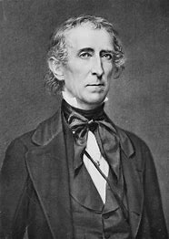
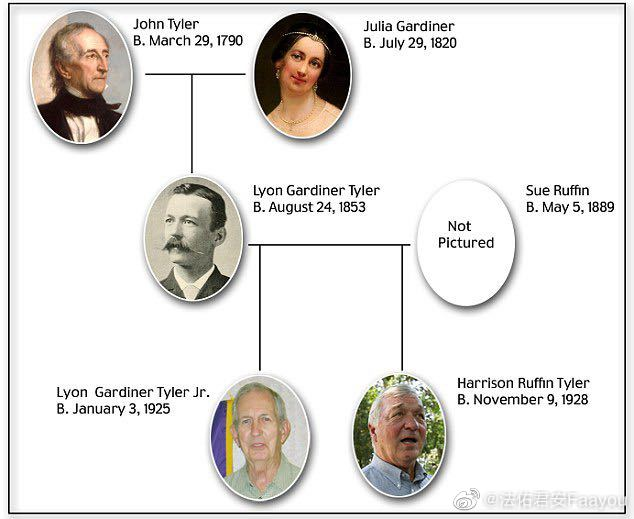

title:: 050 John Tyler: Unexpected

- ## 050 John Tyler: Unexpected
- ## pure
  collapsed:: true
	- VOA Learning English presents America's Presidents.
	- Today we are talking about a vice president. John Tyler was William Henry Harrison's partner on the ticket in the 1840 election; he was the "Tyler" of the campaign slogan "Tippecanoe and Tyler, too."
	- But only one month into his term as president, Harrison unexpectedly died. He was the first U.S. president to die in office. Today, Americans accept that when that happens, the vice president becomes the president. But in 1841, no one really knew what to do.
	- So people turned to the Constitution.
	- It said if the president is removed from office, or if he dies, resigns, or is not able to perform his duties, his power and responsibility is given to the vice president.
	- But the meaning of those words was unclear. Did the vice president really become the president, or did the vice president just act like the president?
	- The Constitution may not have been clear, but John Tyler was. He claimed that, after Harrison's death, he really was the president.
	- Tyler made sure he was quickly sworn-in. He answered only to the title "president." He even refused to open letters that were sent to "Acting President Tyler."
	- Eventually, Americans accepted John Tyler was the nation's 10th president.
	- But some Americans were not happy about that fact. During his presidency, all but one of Tyler's cabinet advisors resigned, and members of his own party tried to impeach him.
	- ## Early life
	- Tyler was from the southern state of Virginia, home to five earlier U.S. presidents. Like many of the leaders before him, he was a lawyer from an upper class family who owned slaves. He strongly supported the power of the states against the federal government, expansion of slavery, and rule by a small, elite group.
	- But the United States was starting to change. For example, President John Quincy Adams had proposed creating a national system of roads. The Missouri Compromise of 1820 limited slavery in new states in the northwest. And in the 1830s, many white men who did not own property earned the right to vote.
	- In other words, the U.S. was becoming more national, abolitionist, and equal.
	- Tyler resisted these changes. He fought against them as a member of the U.S. House of Representatives, a governor of Virginia, and a senator.
	- His fight reached a crisis during the presidency of Andrew Jackson. The two men belonged to the same party, the Democratic Party. However, Tyler hated Jackson's populist policies and use of presidential powers against the states.
	- In the middle of the 1830s, Tyler joined with several other political leaders to create a new, anti-Jackson party. They were called the Whigs.
	- ## Presidency
	- The new Whig party badly wanted to win the 1840 presidential election against Jackson's right hand man, Martin Van Buren. They proposed John Tyler as the party's vice presidential candidate because they hoped he would appeal to southern voters.
	- The Whigs succeeded. Tyler and Harrison won the election. The new party expected that they would be able to achieve many of their policy goals.
	- But then Harrison died, and Tyler unexpectedly became president. Tyler kept Harrison's cabinet of top advisers. But he did not accept their advice.
	- Whig lawmakers presented bill after bill to Tyler, but he failed to support the measures. He believed they gave too much power to the federal government over the states.
	- In anger, all but one of Tyler's cabinet members resigned.
	- Then Whig leaders officially declared that Tyler was no longer part of their group. The following year they even moved to impeach him.
	- He became known as a president without a party.
	- Tyler was able to achieve one major political act, however. Three days before he left office, he signed the law that made Texas a state.
	- Perhaps wisely, Tyler withdrew from the next presidential election.
	- He eventually withdrew even his support for the federal government. He became a leader in the movement for Southern secession.
	- In other words, he believed the Southern states had the right to separate from the North and leave the Union. In time, the separation between the South and North would lead to the Civil War.
	- ## Family
	- Tyler was an unusual president. He took office in an unusual way, and he took the unusual step of vetoing legislative action proposed by his own party.
	- His family life has other unusual details. Tyler was the first president to get married while in office. He was the president with the most children. And two of his grandchildren remained alive until well into the 21st century.
	- In 1844, Tyler married Julia Gardiner. She was his second wife. His first wife, Letitia, had died two years earlier.
	- John and Letitia Tyler had eight children together. Since Julia Gardiner Tyler was 24 years old -- 30 years younger than her new husband -- the two had plenty of time to have another seven children.
	- And, because one of their sons had children in the 1920s, two of Tyler's grandchildren are still alive as of early 2017.
	- ## Legacy
	- Tyler is not remembered as a good president. But he is remembered for establishing a precedent – a way of doing something that other people have followed.
	- The Tyler precedent permitted the peaceful of transfer of power from president to vice president in 1841. And it eased the transition after other presidents have died since then.
	- In 1967, the Constitution was even changed to clarify what Tyler had claimed all along: when the president dies, the vice president becomes the new chief executive.
- ---
- ## def
	- VOA Learning English presents America's Presidents.
	- Today we are talking about a vice president. John Tyler was William Henry Harrison's partner /on the ticket in the 1840 election; he was the "Tyler" of the campaign slogan "Tippecanoe and Tyler, too."
		- > ▶ John Tyler
		  
		- ((62566033-a86a-4549-b075-10c4e122a8a2))
	- But only one month into his term as president, Harrison unexpectedly died. He was the first U.S. president /to die in office. Today, Americans accept that /when that happens, the vice president becomes the president. But in 1841, no one really knew what to do.
		- > ▶ 但在1841年，没人知道该怎么做。
	- So people turned to the Constitution.
		- > ▶ **turn to sb/sth** : to go to sb/sth for help, advice, etc. 向…求助（或寻求指教等）
		- 所以人们求助于宪法.
	- It said /if the president is removed from office, or if he dies, resigns, or is not able to perform his duties, his power and responsibility /is given to the vice president.
	- But the meaning of those words /was unclear. Did the vice president really become the president, or did the vice president /just act like the president?
		- 但这句话的清晰含义并不清楚。是副总统真的转为总统职位，还是副总统只是表现得像总统?
	- The Constitution may not have been clear, but John Tyler was. He claimed that, after Harrison's death, he really was the president.
	- Tyler made sure /he was quickly sworn-in. He **answered** only **to** the title "president." He even refused to open letters /that were sent to "Acting President Tyler."
		- 泰勒确保自己迅速宣誓就职。他也只对“总统”这个头衔做出回复。他甚至拒绝打开抬头写着 寄给“代理总统泰勒” 的信件。
	- Eventually, Americans accepted /John Tyler was the nation's 10th president.
	- But some Americans were not happy about that fact. During his presidency, **all but one** of Tyler's cabinet advisors resigned, and members of his own party /tried to impeach him.
		- > ▶ all but one 除了一个以外的所有的……
		- 在他的总统任期内，泰勒的内阁顾问除一人外全部辞职，他自己的政党成员试图弹劾他。
	- ## Early life
	- Tyler was from the southern state of Virginia, home to five earlier U.S. presidents. Like many of the leaders before him, he was a lawyer /from an upper class family /who owned slaves. He strongly supported the power of the states /against the federal government, expansion of slavery, and rule by a small, elite group.
		- 那里曾有5位美国前总统。
	- But the United States was starting to change. For example, President John Quincy Adams /had proposed creating(v.) a national system of roads. The Missouri Compromise(n.) of 1820 /limited slavery in new states in the northwest. And in the 1830s, many white men /who did not own property /earned the right to vote.
		- 约翰·昆西·亚当斯总统曾提议, 建立一个全国性的道路系统。1820年的密苏里妥协案, 限制了西北部新州的奴隶制。
	- In other words, the U.S. was becoming more national, abolitionist, and equal.
		- > ▶ abolitionist (n.)a person who is in favour of the abolition of sth 主张废除…的人; 废奴主义者
	- Tyler resisted these changes. He fought against them /as a member of **the U.S. House of Representative**s, a governor of Virginia, and a senator.
	- His fight reached a crisis during the presidency of Andrew Jackson. The two men belonged to the same party, the Democratic Party. However, Tyler hated Jackson's populist policies and use of presidential powers against the states.
	- In the middle of the 1830s, Tyler joined with several other political leaders /to create a new, anti-Jackson party. They were called the Whigs.
	- ## Presidency
	- The new Whig party /badly wanted to win the 1840 presidential election /against Jackson's **right hand** man, Martin Van Buren. They **proposed** John Tyler **as** the party's vice presidential candidate /because they hoped /he would appeal to southern voters.
		- > ▶ badly  : used to emphasize how much you want, need, etc. sb/sth 很；非常
		  -> They wanted to win so badly. 他们求胜心切。
		  -> I miss her badly. 我十分想念她。
		- ((6242c135-fc95-4e26-a53f-e58b617588d2))
	- The Whigs succeeded. Tyler and Harrison /won the election. The new party expected that /they would be able to achieve many of their policy goals.
	- But then Harrison died, and Tyler unexpectedly became president. Tyler kept Harrison's cabinet of top advisers. But he did not accept their advice.
		- 泰勒保留了哈里森内阁里的高级顾问人员。
	- Whig lawmakers/ **presented** bill after bill **to** Tyler, but he failed to support the measures. He believed /they gave too much power to the federal government over the states.
		- > ▶ bill (n.)a written suggestion for a new law that is presented to a country's parliament so that its members can discuss it （提交议会讨论的）议案，法案
		- > ▶ fail (v.)to not do sth 未做；未履行（某事）
		  -> He failed to keep the appointment. 他未履约。
		- 辉格党议员向泰勒, 提出了一个又一个法案，但他没有支持这些措施。他认为这些法案赋予联邦政府过多的权力。
	- In anger, **all but one** of Tyler's cabinet members /resigned.
	- Then Whig leaders officially declared that /Tyler was no longer part of their group. The following year /they even moved to impeach him.
	- He became known as a president without a party.
	- Tyler was able to achieve one major political act, however. Three days before he left office, he signed the law /that made Texas a state.
	- Perhaps wisely, Tyler withdrew from the next presidential election.
		- > ▶ wisely adv. 明智地；聪明地；精明地
	- He eventually withdrew even his support for the federal government. He became a leader /in the movement for Southern secession.
		- > ▶ secession (n.)~ (from sth) the fact of an area or group becoming independent from the country or larger group that it belongs to （地区或集团从所属的国家或上级集团的）退出，脱离
		- 他最终甚至放弃了对联邦政府的支持。他成为南方独立运动的领袖。(看来要美国南北内战了)
	- In other words, he believed /the Southern states had the right /to separate from the North /and leave the Union. In time, the separation between the South and North /would lead to the Civil War.
	- ## Family
	- Tyler was an unusual president. He took office in an unusual way, and he took the unusual step /of vetoing(v.) legislative action /proposed by his own party.
		- ((625521d9-7b9a-47f7-8627-a6b265a88a12))
		- 他也采取了不同寻常的措施，否决了自己政党提出的立法行动。
	- His family life /has other unusual details. Tyler was the first president /to get married /while in office. He was the president /with the most children. And two of his grandchildren /remained alive /until well into the 21st century.
	- In 1844, Tyler married Julia Gardiner. She was his second wife. His first wife, Letitia, had died two years earlier.
	- John and Letitia Tyler /had eight children together. Since Julia Gardiner Tyler was 24 years old -- 30 years younger **than** her new husband -- the two had plenty of time /to have another seven children.
	- And, because one of their sons /had children in the 1920s, two of Tyler's grandchildren are still alive /**as of** early 2017.
		- ((623035c8-91f8-45ef-8325-d7eb72870445))
		- 
		- 泰勒总统出生于1790年. 54岁时娶了第二任妻子(24岁)，比他小30岁.
		-
	- ## Legacy
	- Tyler is not remembered as a good president. But he is remembered /for establishing a precedent – a way of doing something /that other people have followed.
	- The Tyler precedent /permitted **the peaceful** of **transfer of power** /from president to vice president /in 1841. And it **eased(v.) the transition** /after other presidents have died /since then.
		- > ▶ precedent  : [ CU ] a similar action or event that happened earlier 先前出现的事例；前例；先例 /[ CU ] an official action or decision that has happened in the past and that is seen as an example or a rule to be followed in a similar situation later 可援用参考的具体例子；实例；范例
		- > ▶ transition (n.)~ (from sth) (to sth)~ (between A and B) the process or a period of changing from one state or condition to another 过渡；转变；变革；变迁
		  -> We need **to ensure a smooth transition** /between the old system and the new one. 我们得确保新旧制度间的平稳过渡。
		- 泰勒的先例, 允许了在1841年的总统向副总统和平移交权力。在其他总统相继去世后，过渡工作也得到了缓解。
	- In 1967, the Constitution was even changed /to clarify what Tyler had claimed all along: when the president dies, the vice president /becomes the new chief executive.
		- 1967年，宪法甚至被修改，以澄清泰勒一直以来的主张:当总统去世时，副总统成为新的首席执行官。