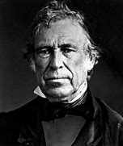
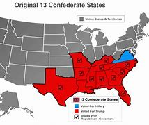

title:: 052 Zachary Taylor: Brief

- ## 052 Zachary Taylor: Brief
- ## pure
  collapsed:: true
	- VOA Learning English presents America's Presidents.
	- Today we are talking about Zachary Taylor, the 12th president. He took office in 1849.
	- Taylor had some things in common with earlier presidents.
	- Like six others before him, he was born in Virginia.
	- Like George Washington and Andrew Jackson, Taylor was a war hero.
	- And, like William Henry Harrison, he died in office.
	- But Taylor brought at least one special trait to the presidency. Although he was officially elected as a member of the Whig party, Taylor considered himself an independent.
	- ## Early life
	- When Zachary Taylor was a baby, his family left Virginia. They moved west, to a tobacco plantation in Kentucky.
	- There, the Taylors were financially successful. By the time Zachary was a young man, his family owned a number of enslaved people and over 4,000 hectares of land.
	- Taylor took possession of some of his family's land. He also had cotton plantations in the southern states of Mississippi and Louisiana. He, too, depended on enslaved people to do most of the work.
	- But Taylor was unlike many wealthy farmers in the South. He had always wanted to be a soldier. When Taylor was 24 years old, he became an officer in the U.S. Army.
	- Shortly after, he married Margaret Smith. In time, they had five daughters and one son. But Taylor directed most of his attention to his military career.
	- For about 20 years, he tried to keep peace between Native American tribes and white Americans. Sometimes the job meant leading attacks against Native Americans. At times, it meant defending their lands from white settlers.
	- In either case, his public standing as a good soldier grew. His troops called him "Old Rough and Ready" because he was willing to fight – and suffer – alongside them.
	- Then, in the Mexican-American War of the 1840s, Taylor became really famous. He led U.S. troops to victory in several major battles, including ones at Monterrey and Buena Vista.
	- In a well-known story, the powerful Mexican general Santa Anna surrounded Taylor and his small number of troops. Santa Anna sent a message demanding that they surrender. Taylor reportedly said: "Tell him to go to hell."
	- The two sides clashed the next morning. Santa Anna had about three times the men that Taylor had. Yet, by late that day, Taylor's soldiers had defeated Santa Anna's.
	- Taylor's success as a general helped the United States win the war against Mexico. In the Treaty of Guadalupe Hidalgo, Mexico agreed to give up claims to or sell to the U.S. more than 1.3 million kilometers of its lands, including what are now the states of Texas and California.
	- But the new lands almost immediately caused problems.
	- ## Campaign of 1848
	- At the time of the next U.S. presidential election, public opinion in the country was severely divided. The issue was whether to permit slavery in the new lands won at the end of the war with Mexico.
	- In general, Northerners opposed expanding slavery.
	- In general, Southerners supported it.
	- To appeal to both these groups, the major parties at the time looked to Taylor to be their candidate for president.
	- The Democrats and the Whigs reasoned that Taylor was already well-known and well-liked. Historian Michael Holt said in 1848, Taylor was "the most popular man in America."
	- But Taylor was not really political. He called himself an independent. He shared some beliefs with both major parties at the time. But mostly he wanted to keep the nation together.
	- In the end, he agreed to be the candidate of the Whig Party. During the campaign, he did not take a stand on any of the major issues. His fame as a military general carried him into the White House.
	- ## Presidency
	- The truth was that Taylor did have an opinion on slavery: He did not want to expand it, especially in areas that did not support cotton or sugar farms.
	- So, once in office, he proposed a change to the rules about how new territories would become states. The change would let white, American, male settlers in California and New Mexico decide whether they wanted slavery. Then, those areas could enter the Union immediately as states.
	- Taylor aimed to quiet the debate about slavery. But his idea angered almost everybody.
	- Some U.S. lawmakers believed the president had cut them out of the decision.
	- Northerners said Taylor's proposal did not go far enough: It did not solve some of the other issues related to slavery.
	- And Southerners realized that settlers in California and New Mexico would almost surely reject slavery, and give free states a majority in Congress.
	- In one dramatic incident, some South Carolina officials called a meeting to discuss withdrawing from the Union. In answer, Taylor threatened to hang them.
	- But before Taylor or his idea could get too far, the president became sick.
	- The story is that he attended outdoor celebrations to mark the nation's birthday, July 4. Then he went for a walk. The weather was very hot. To cool off, Taylor ate uncooked fruit and drank iced milk.
	- That night he told others about pain in his stomach. Five days later, he was dead.
	  His doctor wrote that Taylor died of cholera morbus -- a general term for severe digestive problems.
	- A few people thought he might have been poisoned. The suspicion remained until 1991, when medical officials examined Taylor's remains. They confirmed that he died of natural causes.
	- A more recent study offers more details. Jane McHugh and Philip A. Mackowiak say that Taylor was a victim of the same problem that killed presidents William Henry Harrison and James Polk: dirty water in the White House.
	- ## Legacy
	- Taylor's death, while unfortunate, did not cause a political crisis. John Tyler had already established the rule that, if a president dies in office, the vice president becomes president.
	- But Taylor's death did likely change the direction of history. His replacement, Millard Fillmore, did not try to hold the Union together by force. Instead, he joined with politicians who wanted to compromise on the issue.
	- The compromise legislation delayed but did not really settle the debate. In time, the division between North and South led to the American Civil War.
	- And members of Taylor's own family became linked to the states that withdrew from the Union.
	- One of his daughters had married Jefferson Davis, who became the president of the Confederacy.
- ---
- ## def
	- VOA Learning English presents America's Presidents.
	- Today we are talking about Zachary Taylor, the 12th president. He took office in 1849.
		- > ▶ Zachary Taylor
		  
	- Taylor **had some things /in common with** earlier presidents.
		- > ▶ **have sth in common (with sb)**
		  ( of people 人 ) to have the same interests, ideas, etc. as sb else （想法、兴趣等方面）相同
		  -> Tim and I **have nothing in common**./I **have nothing in common with** Tim. 我和蒂姆毫无共同之处。
		  2. **have sth in common (with sth)**
		  ( of things, places, etc. 东西、地方等 ) to have the same features, characteristics, etc. 有相同的特征（或特点等）
	- Like six others before him, he was born in Virginia.
	- Like George Washington and Andrew Jackson, Taylor was a war hero.
	- And, like William Henry Harrison, he died in office.
	- But Taylor **brought** at least one special trait **to** the presidency. Although he was officially elected as a member of the Whig party, Taylor considered himself /an independent.
		- > ▶ trait (n.) a particular quality in your personality （人的个性的）特征，特性，特点
		  -> personality traits 个性特点
		- > ▶ independent (a.) (n.)(abbr. Ind. ) a member of parliament, candidate, etc. who does not belong to a particular political party 无党派议员（或候选人等）
		- 但泰勒至少给这届总统带来了一个特别的特质。
	- ## Early life
	- When Zachary Taylor was a baby, his family left Virginia. They moved west, to a tobacco plantation in Kentucky.
	- There, the Taylors were financially successful. By the time Zachary was a young man, his family owned a number of enslaved people /and over 4,000 hectares of land.
		- ((62429239-b6f3-43b8-8e86-53782de77411))
	- Taylor **took possession of** some of his family's land. He also had cotton plantations /in the southern states of Mississippi and Louisiana. He, too, **depended on** enslaved people /to do most of the work.
		- ((6256765d-ffc8-43c4-803e-0f484d686687))
	- But Taylor was unlike many wealthy farmers in the South. He had always wanted to be a soldier. When Taylor was 24 years old, he became an officer /in the U.S. Army.
	- Shortly after, he married Margaret Smith. In time, they had five daughters and one son. But Taylor **directed** most of his attention **to** his military career.
		- ((624289a1-e0f4-4724-9d2a-6f4a425db6e2))
		- 但是泰勒把他的大部分注意力, 放在了他的军事生涯上。
	- For about 20 years, he tried to **keep peace /between** Native American tribes /**and** white Americans. Sometimes /the job meant /leading attacks(n.) against Native Americans. At times, it meant /**defending**(v.) their lands **from** white settlers.
		- 20年来，他一直努力维持美国原住民部落, 和美国白人之间的和平。有时, 这项工作意味着领导对印第安人的攻击。有时，这意味着保护他们的土地不受白人定居者的侵害。
	- In either case, his public standing as a good soldier grew. His troops called him "Old Rough and Ready" because he was willing to fight – and suffer – alongside them.
	- Then, in the Mexican-American War /of the 1840s, Taylor became really famous. He led U.S. troops /to victory /in several major battles, including ones at Monterrey and Buena Vista.
	- In a well-known story, the powerful Mexican general Santa Anna /surrounded Taylor and his small number of troops. Santa Anna sent a message /demanding that /they surrender. Taylor reportedly said: "Tell him to go to hell."
		- > ▶ surrender (v.)~ (yourself) (to sb) to admit that you have been defeated and want to stop fighting; to allow yourself to be caught, taken prisoner, etc. 投降
		- 据报道
	- The two sides clashed /the next morning. Santa Anna had about three times /the men that Taylor had. Yet, by late that day, Taylor's soldiers had defeated Santa Anna's.
	- Taylor's success as a general /helped the United States /win the war against Mexico. In the Treaty of Guadalupe Hidalgo, Mexico agreed to give up claims to /or sell to the U.S. more than 1.3 million kilometers of its lands, including what are now /the states of Texas and California.
		- 在《 Guadalupe Hidalgo条约》(Treaty of Guadalupe Hidalgo)中，墨西哥同意放弃或将其130多万公里的土地卖给美国
	- But the new lands /almost immediately caused problems.
	- ## Campaign of 1848
	- At the time of the next U.S. presidential election, public opinion in the country /was severely divided. The issue was /whether to permit slavery /in the new lands /won at the end of the war with Mexico.
	- In general, Northerners opposed(v.) expanding slavery.
	- In general, Southerners supported it.
	- **To appeal to** both these groups, the major parties /at the time /looked to Taylor /to be their candidate for president.
		- ((62566540-f391-4275-8b9d-3d5fef2212c5))
		- 为了吸引这两个群体，当时的主要政党, 都把泰勒作为他们的总统候选人。
	- The Democrats and the Whigs /reasoned that /Taylor was already well-known and well-liked. Historian Michael Holt said in 1848, Taylor was "the most popular man in America."
		- > ▶ reason : (v.)to form a judgement about a situation by considering the facts and using your power to think in a logical way 推理；推论；推断 /to use your power to think and understand 思考；理解
		- > ▶ well-liked ADJ liked by many people; popular 受人喜爱的; 受欢迎的
	- But Taylor was not really political. He called himself an independent. He shared some beliefs with both major parties at the time. But mostly /he wanted to keep the nation together.
		- > ▶ political (a.)connected with the different groups working in politics, especially their policies and the competition between them 政党的；党派的 
		  /( of people 人 ) interested in or active in politics 关心政治的；政治上活跃的 
		  /concerned with power, status, etc. within an organization, rather than with matters of principle 争权夺利的；人事纠纷的
		  -> I suspect that he was dismissed for political reasons. 我怀疑他被解职是人事上的原因。
	- In the end, he agreed /to be the candidate of the Whig Party. During the campaign, he did not **take a stand on** any of the major issues. His fame as a military general /**carried** him **into** the White House.
		- > ▶ stand (n.)[ usually sing. ] ~ (on sth) an attitude towards sth or an opinion that you make clear to people 态度；立场；观点
		  -> **to take a firm stand /on sth** 在某事上采取坚定的立场
		  /[ usually sing. ] a strong effort to defend yourself or your opinion about sth 保卫；捍卫；维护；抵抗
		  -> We must **make a stand /against** further job losses. 我们必须采取措施，防止进一步裁员。
		- 在竞选期间，他没有在任何重大问题上表明立场。他作为一名将军的名声使他进入了白宫。
	- ## Presidency
	- The truth was that /Taylor did have an opinion on slavery: He did not want to expand it, especially in areas /that did not support cotton or sugar farms.
	- So, once in office, he proposed a change to the rules /about how new territories would become states. The change would let white, American, male settlers in California and New Mexico /decide whether they wanted slavery. Then, those areas could enter the Union immediately /as states.
		- 所以，一旦上任，他就提议修改关于新领土如何成为州的规则。这项改革, 将让居住在加州和新墨西哥州的白人、美国男性定居者, 自己决定他们是否想要奴隶制。然后，这些地区可以立即以州的身份加入联邦。
	- Taylor aimed to quiet(v.) the debate about slavery. But his idea /angered almost everybody.
	- Some U.S. lawmakers believed /the president **had cut them out of the decision**.
		- > ▶ **cut sb out (of sth)** :
		  to not allow sb to be involved in sth 不让某人参与；把某人排除在…之外
	- Northerners said /Taylor's proposal /did not go far enough: It did not solve some of the other issues /related to slavery.
	- And Southerners realized that /settlers in California and New Mexico /would almost surely reject slavery, and give free states /a majority in Congress.
		- > ▶ reject : (v.)to refuse to accept or consider sth 拒绝接受；不予考虑
		- 南方人意识到，加利福尼亚和新墨西哥的定居者, 几乎肯定会反对奴隶制，并让自由州在国会获得多数席位。
	- In one dramatic incident, some South Carolina officials /called a meeting /to discuss withdrawing from the Union. In answer, Taylor threatened to hang them.
		- hang (v.)（被）绞死，施以绞刑
	- But before Taylor or his idea /could get too far, the president became sick.
	- The story is that /he attended outdoor celebrations /to mark the nation's birthday, July 4. Then he **went for a walk**. The weather was very hot. To cool off, Taylor ate uncooked fruit /and drank iced milk.
		- 然后他去散步了。
	- That night /he told others about pain in his stomach. Five days later, he was dead.
	  His doctor wrote that /Taylor died of **cholera morbus** -- a general term /for severe digestive problems.
		- > ▶ cholera   /ˈkɑːlərə/ (n.) [ U ] a disease /caught from infected water /that causes severe diarrhoea and vomiting /and often causes death 霍乱
		  霍乱, 是因摄入的食物或水, 受到霍乱弧菌污染, 而引起的一种急性腹泻性传染病。病发高峰期在夏季，能在数小时内造成腹泻脱水, 甚至死亡。
		  霍乱弧菌存在于水中，最常见的感染原因, 是食用被患者粪便污染过的水。霍乱弧菌能产生霍乱毒素，造成分泌性腹泻，即使不再进食也会不断腹泻. 洗米水状的粪便是霍乱的特征。
		- > ▶ morbus  (n.)〈拉〉(疾)病
		- > ▶ digestive (a.)[ only before noun ] connected with the digestion of food 消化的；和消化有关的
	- A few people thought /he might have been poisoned. The suspicion remained until 1991, when medical officials examined Taylor's remains(n.). They confirmed that /he died of natural causes.
		- > ▶ remains (n.) ( formal ) the body of a dead person or animal 遗体；遗骸 /~ (of sth) the parts of sth that are left after the other parts have been used, eaten, removed, etc. 剩余物；残留物；剩饭菜
	- A more recent study /offers more details. Jane McHugh and Philip A. Mackowiak say that /Taylor was a victim of the same problem /that killed presidents William Henry Harrison and James Polk: dirty water in the White House.
	- ## Legacy
	- Taylor's death, while unfortunate, did not cause a political crisis. John Tyler had already established the rule /that, if a president dies in office, the vice president becomes president.
	- But Taylor's death /did likely change the direction of history. His replacement, Millard Fillmore, did not try to hold the Union together by force. Instead, he joined with politicians /who wanted to compromise on the issue.
		- > ▶ likely : as ˌlikely as ˈnot | most/very ˈlikely
		  very probably 很可能
		- > ▶ compromise (v.)[ V ] ~ (with sb) (on sth) : to give up some of your demands after a disagreement with sb, in order to reach an agreement （为达成协议而）妥协，折中，让步
		- 但泰勒的死确实可能改变了历史的方向... 他与希望在这个问题上妥协的政客们站在了一起。
	- The compromise legislation /delayed but did not really settle the debate. In time, the division between North and South /led to the American Civil War.
		- ((6231393a-ac8f-4b0c-ba6e-4b86733ddea1))
	- And members of Taylor's own family /became **linked to** the states /that withdrew from the Union.
		- 泰勒自己的家庭成员, 与退出联邦的州建立了联系。
	- One of his daughters /had married Jefferson Davis, who became the president of the Confederacy.
		- > ▶ confederacy : [ C ] a union of states, groups of people or political parties with the same aim 联盟；同盟；联邦
		  => con-, 强调。-fed, 相信，信任，词源同faith, confide.
		  > ▶ **Conˌfederate ˈStates** : n.    
		  ( also **the Confederacy** [ sing. ] ) the eleven southern states of the US /which left the United States in 1860-1, starting the American Civil War （美国）南部邦联（1860 –1861年脱离联邦从而引发南北战争的美国南部11州）
		  
		- 后来成了南部联盟的总督。
-