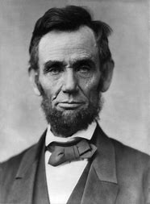

title:: 056 Abraham Lincoln: Martyr

- ## 056 Abraham Lincoln: Martyr
- ## pure
  collapsed:: true
	- VOA Learning English presents America's Presidents.
	- Today we are talking about Abraham Lincoln.
	- He was the 16th president of the United States. Many Americans consider him one of country's greatest leaders.
	- Yet people alive when Lincoln was elected in 1860 would probably be surprised by modern-day opinions about him. He had little formal education or government experience.
	- During the presidential campaign, critics made fun of his appearance and his simple way of talking. They warned that he was not very intelligent and would harm the nation's image.
	- Some of his opponents – especially in Southern states – had even bigger concerns. They were afraid Lincoln would use the power of the federal government to end slavery in their states.
	- They were right.
	- ## Early life
	- Abraham Lincoln was born in the frontier state of Kentucky. His family was very poor and had a simple home: a log cabin.
	- Lincoln had to support his parents and his sister by working, so he rarely went to school. Instead, he taught himself by reading books.
	- Eventually, he became a lawyer in the state of Illinois.
	- As a young man, Lincoln was known for several qualities. He was tall and thin. He was very strong – his neighbors remembered him cutting down trees. And he was honest. The people he defended in court called him "Honest Abe."
	- In time, Lincoln was elected to the Illinois General Assembly, the state's legislature. He also served one term as a congressman in the U.S. House of Representatives.
	- But he was not popular there. Voters did not like his opposition to the country's war with Mexico.
	- So Lincoln withdrew from politics and turned his attention to his family. He had married a Southern belle named Mary Todd in 1842. They had four sons. But two died when they were very young.
	- Lincoln also developed his legal career representing railroad companies. Some people thought he might become the best railroad lawyer in the country. But that is not what happened.
	- ## Election of 1860
	- In the 1850s, Lincoln returned to national politics. The division over the issue of slavery was deepening. Lincoln was not an anti-slavery activist, an abolitionist. But he did not support the country's policies on slavery.
	- Lincoln believed slavery violated the American Declaration of Independence, which said all men had the right to life, liberty and the pursuit of happiness.
	- To be clear, Lincoln did not believe that black people should have the same rights as white U.S. citizens. But he did not agree that one person should own other people, or profit from their work while they earned nothing and were held captive.
	- Lincoln decided to compete in elections for a seat in the U.S. Senate. He was chosen as the candidate of a new, anti-slavery party. Members called themselves Republicans.
	- During the election campaign, Lincoln famously discussed the issue of slavery in a series of debates with Stephen Douglas, the Democratic Party's candidate.
	- Lincoln's words moved some voters. But they did not earn him enough votes to get elected.
	- So, while Douglas took the seat in the Senate, Lincoln prepared to run for president. Lincoln said that, if he were elected, he would not expand slavery to new territories in the country's west. But he promised not to interfere with slavery in the Southern states, where it already existed.
	- Voters in Southern, slave-holding states did not trust Lincoln. Not a single Southern state supported him in the election of 1860.
	- But he won anyway. The support of anti-slavery Northerners gave him the presidency.
	- In answer, seven Southern states withdrew from the Union. Four more later joined them. These states formed a new government, called the Confederate States of America – or, the Confederacy.
	- Confederate officials chose their own president and wrote their own constitution, which permitted each state control over its own laws – especially laws that protected slavery. Confederate officials said they no longer recognized the power of the U.S. federal government, or its chief executive.
	- As that chief executive, Lincoln would have to decide what to do.
	- ## Civil War
	- President Lincoln's first test came a little more than a month after he was sworn-in.
	- The event involved Fort Sumter, a federal military base on an island off the coast of South Carolina. Soldiers on the base needed food. Lincoln said he would send some by ship.
	- But Confederate officials considered the fort part of South Carolina, which belonged to the Confederacy. They demanded that the Union soldiers leave the fort.
	- But Union forces and the U.S. president ignored the Confederates' demands.
	- As promised, Lincoln sent the supply ships. As expected, Confederate soldiers attacked. A day and a half later, the fort's Union soldiers surrendered.
	- The clash did not last long, and no one was killed in the fighting. But the battle at Fort Sumter marked the official beginning of hostilities between the Union and the Confederacy.
	- Lincoln immediately took action to answer the loss of Fort Sumter. He called on state militias for troops and asked for a special meeting of Congress.
	- The president was careful not to ask Congress to make an official declaration of war, in part because he did not want to recognize the Confederacy as a separate nation. Instead, he called the Southern states' opposition a rebellion.
	- However, the conflict between the Southern Confederacy and the Northern Union was a civil war.
	- Neither side expected the fighting to last very long – a few weeks or maybe months. Instead, the Civil War lasted four and a half years.
	- Most of the major battles took place near Washington, DC, in the states of Maryland, Virginia and Pennsylvania. Soldiers and civilians also clashed in the west, in Tennessee, as well as in the southern states of Mississippi, South Carolina, and Georgia.
	- But the war involved the entire country. At least 4 million men fought in it. Among the soldiers were African-American and Native-American men.
	- The conflict divided families. Brothers, fathers and sons fought against each other.
	- Women in both the North and South also supported the war effort. They cooked meals, made and repaired clothing for the troops, served as nurses and cared for the soldiers. Both white and African-American women also took over the work of men who had left to fight.
	- And more than 620,000 men died -- recent scholarship says as many as 750,000. The Civil War remains the bloodiest war in American history.
	- And it changed the country. The war radically affected American politics, economics, and society.
	- Abraham Lincoln was the U.S. president through all of it.
	- Next week's article will discuss Lincoln's presidency and legacy.
- ---
- ## def
	- VOA Learning English presents America's Presidents.
	- Today we are talking about Abraham Lincoln.
		- > ▶ Martyr :   /ˈmɑːrtər/  a person who suffers very much or is killed because of their religious or political beliefs 殉道者；烈士 /~ to sth ( informal ) a person who suffers very much because of an illness, problem or situation （因疾病或困难局面）长期受苦者，长期受折磨者
		  => 来自拉丁语martyr,来自希腊语martys,见证者，-r,所有格后缀，来自PIE*smer,mer,记住，记忆，词源同memory,remember.后引申词义殉道的人，为教而牺牲的人。
		- > ▶  Abraham Lincoln
		  
	- He was the 16th president of the United States. Many Americans consider him one of country's greatest leaders.
	- Yet /people alive /when Lincoln was elected in 1860 /would probably be surprised by modern-day opinions about him. He had little formal education /or government experience.
	- During the presidential campaign, critics **made fun of** his appearance /and his simple way of talking. They warned that /he was not very intelligent /and would harm the nation's image.
	- Some of his opponents – especially in Southern states – had even bigger concerns. They were afraid Lincoln would use the power of the federal government /to end slavery in their states.
	- They were right.
	- ## Early life
	- Abraham Lincoln was born /in the frontier state of Kentucky. His family was very poor /and had a simple home: a log cabin.
		- > ▶ **frontier (n.)[ C ] ~ (between A and B) |~ (with sth)** : ( BrE ) a line that separates two countries, etc.; the land near this line 国界；边界；边境
		  /[ Cusually pl. ] ~ (of sth) the limit of sth, especially the limit of what is known about a particular subject or activity （学科或活动的）尖端，边缘
	- Lincoln had to support his parents and his sister /by working, so he rarely went to school. Instead, he taught himself /by reading books.
	- Eventually, he became a lawyer /in the state of Illinois.
	- As a young man, Lincoln was known for several qualities. He was tall and thin. He was very strong – his neighbors remembered him cutting down trees. And he was honest. The people /he defended in court /called him "Honest Abe."
		- 他在法庭上辩护的人, 称他为“诚实的亚伯”。
	- In time, Lincoln was elected to the Illinois General Assembly, the state's legislature. He also served one term /as a congressman /in the U.S. House of Representatives.
	- But he was not popular there. Voters did not like his opposition to the country's war with Mexico.
		- 选民们不喜欢他对美墨战争的反对。
	- So Lincoln withdrew from politics /and **turned his attention to** his family. He had married a Southern belle /named Mary Todd /in 1842. They had four sons. But two died /when they were very young.
		- > ▶ belle  /bel/   (n.)( old-fashioned ) a beautiful woman; the most beautiful woman in a particular place 美女；（某地）最美的女人
		  => 来自词根bel, 好的，美丽的，词源同beauty.
	- Lincoln also developed his legal career /representing railroad companies. Some people thought /he might become the best railroad lawyer in the country. But that is not what happened.
	- ## Election of 1860
	- In the 1850s, Lincoln returned to national politics. The division /over the issue of slavery /was deepening. Lincoln was not an anti-slavery activist, an abolitionist. But he did not support the country's policies on slavery.
	- Lincoln believed /slavery violated the American **Declaration of Independence**, which said /all men had the right to life, liberty(n.) and the pursuit of happiness.
		- > ▶ liberty (n.) [ U ] freedom to live as you choose without too many restrictions from government or authority 自由（自己选择生活方式而不受政府及权威限制）
	- To be clear, Lincoln did not believe that /black people should have the same rights as white U.S. citizens. But he did not agree that /one person should own(v.) other people, or **profit(v.) from** their work /while they earned nothing /and were held captive(a.).
		- > ▶ **profit (v.) ~ (by/from sth)** ( formal ) to get sth useful from a situation; to be useful to sb or give them an advantage 获益；得到好处；对…有用（或有益）
		  -> We tried to profit by our mistakes (= learn from them) . 我们努力从错误中吸取教训。
		  /(n.) [ CU ] **~ on sth |~ from sth** : the money that you make in business or by selling things, especially after paying the costs involved 利润；收益；赢利
		  => pro-,向前，-fit,做，词源同benefit,effect.字母c脱落。即做事的收益，引申词义利润，报酬。
		- 明确地说，林肯不认为黑人应该享有与美国白人公民相同的权利。但他不同意一个人应该拥有其他人，或从他们的工作中获利，而后者什么也没赚到，并被囚禁。
	- Lincoln decided **to compete**(v.) in elections /**for** a seat in the U.S. Senate. He was chosen /as the candidate of a new, anti-slavery party. Members called themselves Republicans.
		- > ▶ **compete (v.)~ (with/against sb) (for sth)**  : to try to be more successful or better than sb else who is trying to do the same as you 竞争；对抗
		- 林肯决定参加美国参议院的竞选。他被选为一个新成立的反奴隶制政党的候选人。他们自称为共和党人。
	- During the election campaign, Lincoln famously discussed the issue of slavery /in a series of debates with Stephen Douglas, the Democratic Party's candidate.
	- Lincoln's words /moved some voters. But they did not earn him enough votes /to get elected.
	- So, while Douglas **took the seat** in the Senate, Lincoln prepared to run for president. Lincoln said that, if he were elected, he would not **expand** slavery **to** new territories in the country's west. But he promised /not to interfere with slavery in the Southern states, where it already existed.
		- ((6243b236-13ae-418b-9bb8-3a964ff1aa96))
		- 林肯说，如果他当选，他不会把奴隶制扩大到美国西部的新地区。但是他承诺不会干涉南方各州的奴隶制，因为南方各州已经存在奴隶制。
	- Voters in Southern, slave-holding states /did not trust Lincoln. Not a single Southern state supported him /in the election of 1860.
	- But he won anyway. The support of anti-slavery Northerners /gave him the presidency.
		- > ▶ anyway : despite sth; even so 尽管；即使这样 /（转换话题、结束谈话或回到原话题时说）无论如何，反正
		  -> The water was cold /but I took a shower anyway. 水很冷，不过我还是冲了个淋浴。
	- In answer, seven Southern states /withdrew from the Union. Four more /later joined them. These states /formed a new government, called the Confederate States of America – or, the Confederacy.
		- > ▶ confederate (n.) a person who helps sb, especially to do sth illegal or secret 同谋；同伙；从犯；共犯 / (a.) belonging to a confederacy 联盟的；同盟的；联邦的
		  => con-, 强调。-fed, 相信，信任，词源同faith, confide.
		- ((6257cdcb-fb0b-4472-8949-cf8aa36b57cd))
		- 后来又有四州, 加入了他们。
	- Confederate officials /chose their own president /and wrote their own constitution, which permitted each state /control over its own laws – especially laws /that protected slavery. Confederate officials said /they no longer recognized the power of the U.S. federal government, or its chief executive.
	- As that chief executive, Lincoln would have to decide what to do.
		- 作为首席执行官，林肯必须决定做什么。
	- ## Civil War
	- President Lincoln's **first test** came(v.) /a little more than a month /after he was sworn-in.
		- 林肯总统的第一次考验, 是在他宣誓就职一个多月后。
	- The event involved Fort Sumter, a federal military base /on an island /off the coast of South Carolina. Soldiers on the base /needed food. Lincoln said /he would send some by ship.
		- > ▶ fort (n.)a building or buildings built in order to defend an area against attack 要塞；堡垒；城堡 /a building or buildings built in order to defend an area against attack 要塞；堡垒；城堡
		- 该事件涉及萨姆特堡，一个位于南卡罗来纳海岸外岛屿上的 联邦军事基地。
	- But Confederate officials considered /the fort /宾补 part of South Carolina, which belonged to the Confederacy. They demanded that /the Union soldiers leave the fort.
		- 但是南部邦联官员认为, 这个要塞是南卡罗来纳的一部分
	- But Union forces and the U.S. president /ignored the Confederates' demands.
	- As promised, Lincoln sent the supply ships. As expected, Confederate soldiers attacked. A day and a half later, the fort's Union soldiers surrendered.
		- 正如承诺的那样，林肯派出了补给船。果然，邦联士兵发起了进攻。一天半后，这个要塞的联邦士兵投降了。
	- The clash did not last long, and no one was killed in the fighting. But the battle at Fort Sumter /marked **the official beginning**(n.) of hostilities /between the Union and the Confederacy.
	- Lincoln immediately took action /to answer the loss of Fort Sumter. He **called on** state militias for troops /and asked for a special meeting of Congress.
		- > ▶ troop (a.)troop movements (= of soldiers) 部队的调动 
		  /(n.) troops [ pl. ] soldiers, especially in large groups 军队；部队；士兵
		- 他呼吁国家民兵组织派兵，并要求国会召开特别会议。
	- The president was careful /not to ask Congress /to make an official declaration of war, in part because /he did not want to **recognize** the Confederacy **as** a separate nation. Instead, he called the Southern states' opposition /a rebellion.
		- 总统小心翼翼地不要求国会正式宣战，部分原因是他不想承认南部邦联是一个独立的国家。相反，他称南方各州的反对是一场叛乱。
	- However, the conflict **between** the Southern Confederacy **and** the Northern Union /was a civil war.
	- Neither side /expected the fighting to last very long – a few weeks or maybe months. Instead, the Civil War lasted four and a half years.
		- 双方都不认为战斗会持续很长时间——或许只有几周或几个月。
	- Most of the major battles /took place near Washington, DC, in the states of Maryland, Virginia and Pennsylvania. Soldiers and civilians /also clashed in the west, in Tennessee, as well as in the southern states of Mississippi, South Carolina, and Georgia.
	- But the war /involved the entire country. At least 4 million men fought in it. Among the soldiers were African-American and Native-American men.
	- The conflict divided families. Brothers, fathers and sons /fought against each other.
		- 冲突使家庭分裂。兄弟、父亲和儿子互相争斗。
	- Women in both the North and South /also supported the war effort. They cooked meals, made and repaired clothing /for the troops, served as nurses /and cared for the soldiers. Both white and African-American women /also **took over** the work of men /who had left to fight.
		- > ▶ **take over (from sb) | take sth over (from sb)** :
		  (1) to begin to have control of or responsibility for sth, especially in place of sb else 接替；接任；接管；接手
		  (2) to gain control of a political party, a country, etc. 控制，接管（政党、国家等）
		  ▶  **take over (from sth)** :
		  to become bigger or more important than sth else; to replace sth 占上风；取而代之
		  -> It has been suggested that /mammals **took over /from dinosaurs** /65 million years ago. 有人提出哺乳动物是在6 500万年前取代恐龙的。
	- And more than 620,000 men died -- recent scholarship says /as many as 750,000. The Civil War remains **the bloodiest war** /in American history.
		- 最近的研究显示, 死亡人数多达75万。
	- And it changed the country. The war radically affected American politics, economics, and society.
	- Abraham Lincoln was the U.S. president /through all of it.
		- > ▶ radically  adv. 根本上，彻底地
		- 亚伯拉罕·林肯是 经历贯穿这一切的美国总统。
	- Next week's article /will discuss Lincoln's presidency and legacy.