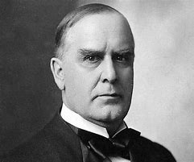

title:: 066 William McKinley: Imperial

- ## 066 William McKinley: Imperial
- ## pure
  collapsed:: true
	- VOA Learning English presents America's Presidents.
	- Today we are talking about William McKinley. He took office in 1897 and was re-elected in 1900. He led the United States into the 20th century.
	- One way to think of McKinley is as a transition president. In the 1800s, lawmakers were mostly concerned with how the country was growing in North America.
	- But during McKinley's government, the U.S. looked beyond its borders. Congress declared war on Spain, the first time the U.S. had fought a European power since the War of 1812 against Britain.
	- The U.S. also took control of overseas territories, annexed Hawaii, and tried to regulate the world's trade with China.
	- Some historians say President McKinley himself wanted the U.S. to increase its international influence. Others argue that he was just answering the country's mood at the time.
	- Either way, his presidency is often defined by the country's rise as an imperial power.
	- ## Early life
	- McKinley was the sixth president to come from the state of Ohio. He was the seventh of eight children. Historians describe his childhood as loving and fun.
	- His father owned a small iron factory. His mother raised her children to be honest and polite.
	- McKinley was a hard-working student. He briefly attended Allegheny College in Pennsylvania, but he did not have the money to finish his education there.
	- A few years after leaving that school, he volunteered for the Army on the side of the Union in the Civil War. He served under a man who would later become president himself, Rutherford B. Hayes. The two stayed close throughout their lives.
	- After the war ended, McKinley studied law, became involved in Republican Party politics, married, and had two daughters.
	- His wife, Ida, was an energetic, well-educated young woman from a wealthy family. For a while, she had worked in her father's bank.
	- But Ida McKinley's health began to suffer. She was struck by seizures. Then her mother died. A few months later, her younger daughter died while still an infant. Ida McKinley clung to her older daughter, but the little girl soon developed a fever disease, and she died, too.
	- William and Ida McKinley were never the same. Ida McKinley remained sick her entire life. She spent most of her hours in a small rocking chair sewing.
	- William McKinley paid great attention to her. He organized his schedule to spend time near her, even as his political success grew.
	- In time, McKinley served in Congress and as the governor of Ohio. He was known as a likable person and a skilled politician.
	- His Republican Party nominated him on the first ballot at their convention. A few months later, voters elected McKinley into office in a landslide. He became the country's 25th president.
	- ## Presidency
	- When McKinley took office, the U.S. was just coming out of a severe economic depression.
	- His government quickly approved a high protective tariff to help struggling workers. In general, his administration also permitted the growth of big business.
	- But most of McKinley's attention as president was devoted to foreign policy. The main issue was Cuba.
	- At that time, Spain controlled the island. Cubans revolted, and Spanish forces used violence and detainments to crush the rebellion.
	- In the U.S., many Americans denounced the events in Cuba. They wanted McKinley and his government to intervene.
	- At first, President McKinley was unwilling. He tried to use diplomacy. He even ordered a U.S. ship into Spanish waters near Havana to show his continued support of Spain.
	- But the ship, called the Maine, exploded. Americans believed the Spanish were responsible. Relations between the two countries worsened fast. Spain declared war. The U.S. Congress answered in kind.
	- For 100 days, U.S. and Spanish forces fought in Cuba and other areas under Spanish control.
	- The war quickly turned in the Americans' favor. When the Spanish-American War ended with the Treaty of Paris in 1898, the U.S. took control of Puerto Rico, Guam, and the Philippines from Spain. Cuba was made independent; however, the U.S. continued to occupy the island for several more years.
	- Not everyone approved of the actions of McKinley's government. Even some members of Congress warned against the U.S. becoming an imperial power.
	- But a majority of voters approved of McKinley as a victorious commander-in-chief. They also noted that the U.S. economy was getting stronger. In 1900, McKinley won re-election.
	- ## Assassination
	- As it turned out, McKinley's second term in office was short.
	- In September, only six months after his swearing-in, the president was receiving visitors at a fair in the city of Buffalo, New York.
	- One of the visitors in line was a 28-year-old man named Leon Czolgosz. His family was from Poland, but he lived in the city of Detroit, Michigan. He had worked in a factory, but at the time was unemployed. He supported the idea of anarchy – no government at all.
	- When McKinley reached to shake the young man's hand, Czolgosz shot the president twice in the stomach.
	- Although injured, McKinley spoke to his guards. He told them not to hurt the shooter. And, he expressed concern about how his wife would feel when she learned he had been shot.
	- Quickly, McKinley was taken to a hospital. Doctors predicted that he would survive. And, for a few days, McKinley seemed to improve.
	- But the wound became infected, and eight days after the attack McKinley died.
	- The president's murderer did not say he was sorry for his act. He defended it, saying McKinley was an enemy of working people.
	- Within a few weeks of the shooting, Czolgosz was tried, found guilty, and executed.
	- ## Legacy
	- Both the nation and the world mourned when McKinley died. He had been one of the country's most popular presidents in many years.
	- He left behind the beginning of what some called an American empire. He also marked a change in the U.S. presidency.
	- When he first took office in the 19th century, most presidents acted primarily as administrators.
	- But President McKinley began to act in ways that are more like a modern president. He prepared remarks to give to the media. He traveled across the country speaking to voters. He used the power of his office to direct the armed forces.
	- McKinley laid the groundwork, but he did not completely change the presidency. He left that to the even more famous man who followed him into the White House.
	- After McKinley's death, his vice president, Theodore Roosevelt, took office and truly brought the country into modern times.
- ---
- ## def
	- VOA Learning English presents America's Presidents.
		- > ▶ Imperial (a.) connected with an empire 帝国的；皇帝的 /（度量衡）英制的
	- Today we are talking about William McKinley. He took office in 1897 /and was re-elected in 1900. He led the United States into the 20th century.
		- > ▶ William McKinley
		  
	- One way to think of McKinley /is as a transition president. In the 1800s, lawmakers were mostly concerned with /how the country was growing in North America.
		- > ▶ transition  (n.) ~ (from sth) (to sth) |~ (between A and B) : the process or a period /of changing from one state or condition /to another 过渡；转变；变革；变迁
		  -> a transitional government 过渡政府
	- But during McKinley's government, the U.S. looked beyond its borders. Congress **declared war** on Spain, the first time /the U.S. had fought a European power /since the War of 1812 against Britain.
	- The U.S. also **took control of** overseas territories, annexed(v.) Hawaii, and tried to regulate the world's trade with China.
		- > ▶ annex [ VN ] to take control of a country, region, etc., especially by force 强占，并吞（国家、地区等）
		  => 前缀an-同ad-, 去，往，在n开头词根前同化为an-. -nex, 同词根nect, 联结，见connect.
		- 美国还控制了海外领土，吞并了夏威夷，并试图规范世界与中国的贸易。
	- Some historians say /President McKinley himself wanted the U.S. /to increase its international influence. Others argue that /he was just answering the country's mood /at the time.
	- Either way, his presidency is often defined /by the country's rise /as an imperial power.
		- 不管怎样，他的总统任期, 通常被定义为"美国国家崛起为帝国主义力量"。
	- ## Early life
	- McKinley was the sixth president /to come from the state of Ohio. He was the seventh of eight children. Historians **describe** his childhood **as** loving and fun.
	- His father /owned a small iron factory. His mother raised her children /to be honest and polite.
		- > ▶ raise (v.)( especially NAmE ) to care for a child or young animal /until it is able to take care of itself 抚养；养育；培养
	- McKinley was a hard-working student. He briefly attended Allegheny College /in Pennsylvania, but he did not have the money /to finish his education there.
	- A few years /after leaving that school, he **volunteered for** the Army /on the side of the Union /in the Civil War. He served /under a man /who would later become president himself, Rutherford B. Hayes. The two stayed close /throughout their lives.
		- ((62551ab1-ce4d-4373-8144-14bed0e58957))
	- After the war ended, McKinley studied law, became **involved in** Republican Party politics, married, and had two daughters.
	- His wife, Ida, was an energetic, well-educated young woman /from a wealthy family. For a while, she had worked /in her father's bank.
	- But Ida McKinley's health /began to suffer. She was struck by seizures. Then her mother died. A few months later, her younger daughter died /while still an infant. Ida McKinley clung to her older daughter, but the little girl /soon developed a fever disease, and she died, too.
		- > ▶ seizure  /ˈsiːʒər/ ( old-fashioned ) [ C ] a sudden attack of an illness, especially one that affects the brain （疾病，尤指脑病的）侵袭，发作 /惊厥, 癫痫, 发作
		  /( old-fashioned ) [ C ] a sudden attack of an illness, especially one that affects the brain （疾病，尤指脑病的）侵袭，发作
		- > ▶ cling (v.) ~ (on) to sb/sth |~ on/together : to hold on tightly to sb/sth 抓紧；紧握；紧抱 /~ (to sth) to stick to sth 粘住；附着
		  /~ (to sb) ( usually disapproving ) to stay close to sb, especially because you need them emotionally （尤指情感上）依恋，依附
		  => 来自PIE*glei,黏，粘，词源同clay,glue.
		-
	- William and Ida McKinley /were never the same. Ida McKinley remained sick /her entire life. She spent most of her hours /in a small rocking chair /sewing.
		- > ▶ rocking  adj. 摇摆的，摇动的
		- 艾达·麦金利一生都在生病。她大部分时间都坐在一把小摇椅上做针线活。
	- William McKinley paid great attention to her. He organized his schedule /to spend time near her, even as his political success grew.
	- In time, McKinley served in Congress /and as the governor of Ohio. He was known as /a likable person /and a skilled politician.
	- His Republican Party /nominated him /on the first ballot /at their convention. A few months later, voters elected McKinley into office /in a landslide. He became the country's 25th president.
		- > ▶ ballot (n.)(v.)[ UC ] **the system** of voting /in writing and usually in secret; an occasion on which a vote is held （无记名）投票选举；投票表决
		- ((c5ea4b73-acac-4f76-950f-4ba35562aeec))
		- 他所在的共和党, 在大会的第一轮投票中, 就提名了他。几个月后，麦金利以压倒性优势, 当选总统。
	- ## Presidency
	- When McKinley took office, the U.S. was just coming out of a severe economic depression.
	- His government /quickly approved a high protective tariff /to help struggling workers. In general, his administration also permitted the growth of big business.
	- But most of McKinley's attention as president /was devoted to foreign policy. The main issue /was Cuba.
		- 但麦金利作为总统的大部分注意力, 都集中在外交政策上。
	- At that time, Spain controlled the island. Cubans revolted(v.) , and Spanish forces /used violence and detainments /to crush the rebellion.
		- > ▶ revolt (v.)[ V ] ~ (against sb/sth) to take violent action against the people in power 反抗，反叛（当权者）
		  /[ V ] ~ (against sth) to behave /in a way /that is the opposite of what sb expects of you, especially in protest 叛逆；违抗
		- 当时，西班牙控制着该岛。古巴人起义，西班牙军队使用暴力和拘留, 来镇压叛乱。
	- In the U.S., many Americans denounced the events in Cuba. They wanted McKinley and his government /to intervene.
		- > ▶ denounce (v.) ~ sb/sth (as sth) to strongly criticize sb/sth that you think is wrong, illegal, etc. 谴责；指责；斥责
		  => de-, 向下，强调。-nounce, 通知，呼喊，词源同announce, pronounce. 即向下喊，引申词义谴责。
	- At first, President McKinley was unwilling. He tried to use diplomacy. He even ordered a U.S. ship /into Spanish waters near Havana /to show his continued support of Spain.
		- > ▶ unwilling (a.)~ (to do sth) not wanting to do sth and refusing to do it 不情愿；不愿意 
		  /[ only before noun ] not wanting to do or be sth, but forced to by other people 勉强的；无奈的；迫不得已的
	- But the ship, called the Maine, exploded. Americans believed /the Spanish were responsible. Relations between the two countries /worsened fast. Spain declared war. The U.S. Congress /answered **in kind**.
		- > ▶  in kind:
		  (1) ( of a payment 支付 ) consisting of goods or services, not money 以实物支付；以货代款；以服务偿付
		  (2) ( formal ) with the same thing 以同样的方法（或手段）
		  -> She insulted him /and he responded **in kind**. 她侮辱了他，他也以其人之道还治其人之身。
		- 西班牙宣战。美国国会也做出了同样的回应。
	- For 100 days, U.S. and Spanish forces /fought in Cuba /and other areas under Spanish control.
	- The war quickly turned /in the Americans' favor. When the Spanish-American War ended /with the Treaty of Paris in 1898, the U.S. **took control of** Puerto Rico, Guam, and the Philippines from Spain. Cuba was made independent; however, the U.S. continued to occupy the island /for several more years.
		- > ▶  in sb's favour :
		  (1) if sth is in sb's favour , it gives them an advantage or helps them 有利于某人；有助于某人
		  -> The exchange rate /is in our favour /at the moment. 目前汇率对我们有利。
	- Not everyone **approved of** the actions of McKinley's government. Even some members of Congress /**warned against** the U.S. becoming an imperial power.
	- But a majority of voters /**approved of** McKinley as a victorious(a.) commander-in-chief. They also noted that /the U.S. economy was getting stronger. In 1900, McKinley won re-election.
		- > ▶ victorious  (a.) ~ (in sth) having won a victory; that ends in victory 胜利的；获胜的；战胜的
	- ## Assassination
	- **As it turned out**, McKinley's second term in office /was short.
		- > ▶ As it turned out 事实证明, 结果证明
	- In September, only six months /after his swearing-in, the president was receiving visitors at a fair(n.) /in the city of Buffalo, New York.
		- > ▶ fair  ( NAmE ) a type of entertainment in a field or park at which farm animals and products are shown and take part in competitions （评比农畜产品的）集市 
		  /an event at which people, businesses, etc. show and sell their goods 商品交易会；展销会
		  -> a craft/a book/an antique fair 工艺品展销会；书市；古玩交易会
		- 总统在纽约布法罗市的一个集市上接待游客。
	- One of the visitors in line /was a 28-year-old man /named Leon Czolgosz. His family was from Poland, but he lived in the city of Detroit, Michigan. He had worked in a factory, but at the time /was unemployed. He supported the idea of anarchy(n.) – no government at all.
		- > ▶ anarchy  /ˈænərki/  (n.) [ U ] a situation in a country, an organization, etc. in which there is no government, order or control 无政府状态；混乱；无法无天
		  =>  an-无,不 + -arch-统治 + -y名词词尾
	- When McKinley reached /to shake the young man's hand, Czolgosz shot the president twice /in the stomach.
	- Although injured, McKinley spoke to his guards. He told them not to hurt the shooter. And, he expressed concern about /how his wife would feel /when she learned he had been shot.
	- Quickly, McKinley was taken to a hospital. Doctors predicted that /he would survive. And, for a few days, McKinley seemed to improve.
	- But the wound became infected, and eight days after the attack /McKinley died.
	- The president's murderer did not say /he was sorry for his act. He defended it, saying /McKinley was an enemy of working people.
	- Within a few weeks of the shooting, Czolgosz was tried, found guilty, and executed.
		- > ▶ try (v.) [ VN ] ~ sb (for sth) |~ sth : to examine evidence in court and decide whether sb is innocent or guilty 审理；审讯；审判
		  -> He was tried for murder. 他因谋杀罪而受审。
		- > ▶ execute (v.) [ usually passive ] ~ sb (for sth) : to kill sb, especially as a legal punishment （尤指依法）处决，处死
		  /( formal ) to do a piece of work, perform a duty, put a plan into action, etc. 实行；执行；实施
		  -> The crime was very cleverly executed. 这一犯罪活动实施得非常巧妙。
		  /( formal ) to successfully perform a skilful action or movement 成功地完成（技巧或动作）
	- ## Legacy
	- Both the nation and the world /mourned /when McKinley died. He had been one of the country's most popular presidents in many years.
	- He left behind /the beginning of what some called an American empire. He also marked a change /in the U.S. presidency.
		- 他也标志着美国总统在"行为处事"上的改变
	- When he first took office /in the 19th century, most presidents /acted primarily as administrators.
	- But President McKinley /began to act /in ways /that are more like a modern president. He prepared remarks /to give to the media. He traveled across the country /speaking to voters. He used the power of his office /to direct the armed forces.
		- > ▶ remark [ C ] something that you say or write which expresses an opinion, a thought, etc. about sb/sth 谈论；言论；评述
		  -> to make a remark 发表评论
	- McKinley **laid the groundwork**, but he did not completely change the presidency. He **left** that /**to** the even more famous man /who followed him into the White House.
		- > ▶ groundwork (n.)~ (for sth) : work /that is done as preparation for other work /that will be done later 基础工作；准备工作
		  -> Officials are **laying the groundwork /for** a summit conference of world leaders. 官员们, 正在为世界首脑峰会, 做准备工作。
		- 麦金利奠定了基础，但他没有完全改变总统的给人的新印象。他把这个工作留给了跟随他进入白宫的其他更著名的人。
	- After McKinley's death, his vice president, Theodore Roosevelt, took office /and truly brought the country into modern times.