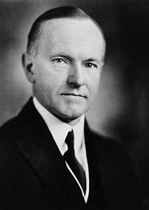
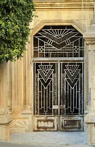

title:: 071 Calvin Coolidge: Silent

- ## 071 Calvin Coolidge: Silent
- ## pure
  collapsed:: true
	- VOA Learning English presents America's Presidents.
	- Today we are talking about Calvin Coolidge. He was the vice president under Warren Harding. When Harding died suddenly a little more than two years into his term, Coolidge became president.
	- Coolidge is linked to two opposing ideas. The first idea is quiet restraint.
	- The president's nickname was "Silent Cal." He rarely took part in casual conversation. And as a leader, he often thought the best action was not to take any action.
	- Many voters liked his "cool" style. Coolidge quickly earned a public image as a serious man who did not spend money or words easily.
	- But Coolidge is also linked to a period in U.S. history known as the Roaring Twenties.
	- In those years, the 1920s, the American economy was generally good. Many people spent money on exciting things – such as the still-new automobile – and on entertainment, including alcoholic drinks, cigarettes, and dancing. Creative expression such as jazz and Art Deco architecture became popular.
	- Calvin Coolidge is often given credit for helping fuel the Roaring Twenties with his pro-business economic policies.
	- But some historians caution against remembering Coolidge's business freedom policies too fondly. They say he helped create the conditions for the severe economic depression that followed his presidency.
	- ## Early life
	- Calvin Coolidge and his sister were born and raised on a farm in the northeast state of Vermont.
	- Coolidge spoke highly of both his parents.
	- His father owned a store, and also held local political offices. He had a public image for honesty, public service, and thrift.
	- Young Calvin Coolidge helped his father in the store, and hoped to be just like him.
	- Coolidge also admired his mother's strong character. He was 12 years old when she died, and he wrote that losing her was "the greatest grief that can come to a boy."
	- Six years later, his sister also died.
	- Their deaths made young Calvin Coolidge even more serious than he already was.
	- But Coolidge was also known for his wit – a kind of humor that often depends on word play or intelligence. As a student at Amherst College in Massachusetts, Coolidge became known as an able and funny public speaker.
	- That skill helped him rise in politics. He began with lower-level offices in Massachusetts, and later served as that state's governor.
	- Along the way, he married Grace Anna Goodhue, a teacher for the deaf. She was known to be warm and social, and the couple were reported to have a loving marriage. They went on to have two sons.
	- In 1920, the Republican Party nominated Coolidge to be its vice presidential candidate. In general, voters liked the Republican ticket. They were ready for a change after the reform policies and international engagement of Democrat Woodrow Wilson.
	- Sure enough, the Republicans won the election in a landslide.
	- But Coolidge did not enjoy the office of vice president very much. He had little power in the government. During meetings, he often remained silent.
	- One summer night he and his wife were on vacation in Vermont. His father, Colonel Coolidge, woke them up in the middle of the night with some dramatic news: President Harding had died.
	- Reporters quickly gathered at the small farmhouse. Colonel Coolidge had not put electricity in the house. So everyone watched by the light of an oil lamp.
	- Colonel Coolidge was a public official. He used the family Bible and a copy of the Constitution to swear in his son as the 30th U.S. president.
	- Then the country's new leader did a very sensible thing: he went back to bed.
	- ## Presidency
	- President Coolidge believed in limited government, especially limited federal government. He permitted state and Cabinet officials to decide as many issues as they could.
	- Coolidge used his authority to focus mostly on the country's economy.
	- At the time he took office, the U.S. was at the start of an economic boom. Coolidge tried to maintain that prosperity. He did not regulate businesses too much, and he sharply reduced taxes, especially on the wealthy.
	- By nearly every measure, the economy grew.
	- But the policies also widened the divide between rich and poor Americans, and put the country's economy in a risky situation.
	- More and more people began to invest their money in the stock market. Some put their dollars in dangerous investments.
	- And business owners produced more goods than most members of the public could really afford. Increasingly, people borrowed money on credit to pay for luxury goods.
	- At the same time, the economic situation of many American farmers was getting worse. The weather had been unusually dry in some places. And the price of food was falling.
	- Farmers asked the federal government for assistance. But Coolidge rejected several bills that might have helped them. The bills had other problems, Coolidge reasoned, and he did not think that the federal government should intervene in the situation.
	- So the farmers continued to suffer.
	- But most voters remained supportive of Coolidge. Even though the president was considered a quiet person, he spoke often on the radio, appeared in a talking film, met with reporters regularly, and posed in funny costumes for photographers.
	- He easily won elected in 1924. Historians believe he could have won another term, too, in 1928. But Coolidge chose not to seek office.
	- Some believed he was too saddened by the death of his teenaged son. Shortly after Coolidge became president, the boy had been playing tennis and slightly wounded his toe. The wound became infected. The infection spread to the boy's blood. A few days later, he died.
	- Although Coolidge continued his presidency, he later said the joy had gone from the job.
	- But when he decided not to seek re-election, he did not talk about his feelings. Instead, he simply wrote a note to reporters saying: "I do not choose to run for President in 1928."
	- His secretary of commerce, Herbert Hoover, was elected instead. Coolidge retired to his home in Massachusetts and led a quiet private life.
	- ## Legacy
	- President Coolidge was well-liked by most Americans. Later presidents – including Ronald Reagan – sought to follow some of his economic policies.
	- But many historians have questioned those policies. They say that Coolidge did not pay enough attention to the situation of farmers. And they say the stock market was rising too fast.
	- Seven months after Coolidge left office, the U.S. economy collapsed.
	- The country was still deep in the Great Depression when Coolidge passed away. He died – quietly, of course – during an afternoon nap at the age of 60.
	- His will was but a single sentence.
- ---
- ## def
	- VOA Learning English presents America's Presidents.
	- Today we are talking about Calvin Coolidge. He was the vice president under Warren Harding. When Harding died suddenly /a little more than two years into his term, Coolidge became president.
		- > ▶  Calvin Coolidge
		  
	- Coolidge is linked to two opposing ideas. The first idea is quiet restraint.
		- 柯立芝与两个对立的观点有关。第一个想法是安静的克制。
	- The president's nickname was "Silent Cal." He rarely **took part in** casual conversation. And as a leader, he often thought /the best action was not to take any action.
		- 这位总统的绰号是“沉默的Cal”。他很少参加闲谈。
	- Many voters liked his "cool" style. Coolidge quickly earned a public image /as a serious man /who did not spend money /or words(v.) easily.
		- > ▶ word [ VN ] [ often passive ] to write or say sth using particular words 措辞；用词
		- 柯立芝很快就赢得了一个严肃、不轻易花钱和说话的公众形象。
	- But Coolidge is also linked to a period /in U.S. history /known as the Roaring Twenties.
		- 咆哮的二十年代
	- In those years, the 1920s, the American economy was generally good. Many people spent money on exciting things – such as the still-new automobile – and on entertainment, including alcoholic drinks, cigarettes, and dancing. Creative expression such as jazz and Art Deco architecture /became popular.
		- > ▶ automobile  ( NAmE ) a car 汽车
		- > ▶ Art Deco : ( Art Deco ) [ U ] a popular style of decorative art /in the 1920s and 1930s /that has geometric shapes with clear outlines and bright strong colours 装饰派艺术（流行于20世纪20至30年代，呈几何图形，线条清晰，色彩鲜明）
		   
	- Calvin Coolidge is often given credit /for **helping** fuel the Roaring Twenties /**with** his pro-business economic policies.
		- > ▶ credit ~ (for sth) : praise or approval /because you are responsible for sth good that has happened 赞扬；称赞；认可
		  -> We did all the work /and she gets all the credit! 工作都是我们干的，而功劳却都归了她！
		- 卡尔文·柯立芝经常因其亲商的经济政策, 推动了繁荣的20年代 , 而受到赞扬。
	- But some historians **caution(v.) against** /**remembering**(v.) Coolidge's business freedom policies **too fondly**. They say /he helped create the conditions /for the severe economic depression /that followed his presidency.
		- > ▶ caution  (v.) ~ (sb) against sth |~ sb about sth  : to warn sb about the possible dangers or problems of sth 警告；告诫；提醒
		- 但一些历史学家警告说，不要过分怀念柯立芝的商业自由政策。
	- ## Early life
	- Calvin Coolidge and his sister /were born and raised on a farm /in the northeast state of Vermont.
	- Coolidge **spoke highly of** both his parents.
		- 柯立芝高度评价了他的父母。
	- His father owned a store, and also held local political offices. He had a public image for honesty, public service, and thrift.
		- > ▶ thrift (n.) ( approving ) the habit of saving money and spending it carefully so that none is wasted 节约；节俭
		- 他的父亲拥有一家商店，也在当地担任政治职务。他的公众形象是诚实、公共服务和节俭。
	- Young Calvin Coolidge helped his father in the store, and hoped to be just like him.
	- Coolidge also admired his mother's strong character. He was 12 years old /when she died, and he wrote that /losing her was "the greatest grief /that can come to a boy."
		- > ▶ grief (n.)[ UC ] ~ (over/at sth) a feeling of great sadness, especially when sb dies （尤指因某人去世引起的）悲伤，悲痛，伤心
	- Six years later, his sister also died.
	- Their deaths made young Calvin Coolidge even more serious /than he already was.
	- But Coolidge was also known for his wit – a kind of humor /that often depends on **word play** or intelligence. As a student at Amherst College in Massachusetts, Coolidge became known as an able and funny public speaker.
		- > ▶ word play : N-UNCOUNT Wordplay involves making jokes by using the meanings of words in an amusing or clever way. 文字游戏
		- 但柯立芝也因他的机智而闻名，这是一种经常依赖文字游戏或智力的幽默。
	- That skill /helped him rise in politics. He **began with** lower-level offices in Massachusetts, and later /served as that state's governor.
	- Along the way, he married Grace Anna Goodhue, a teacher for the deaf. She was known to be warm and social, and the couple /were reported to have a loving marriage. They went on /to have two sons.
		- > ▶ deaf (a.) unable to hear anything or unable to hear very well 聋的
		  + /~ to sth not willing to listen or pay attention to sth 不愿听；不去注意
		  + /the deaf [ pl. ] people who cannot hear 耳聋的人；聋子
		  => 来自PIE*dheubh, 混乱，模糊，词源同dumb, dull.引申义聋的。
	- In 1920, the Republican Party /nominated Coolidge to be its vice presidential candidate. In general, voters liked the Republican ticket. They were ready for a change /after the reform policies /and **international engagement** of Democrat Woodrow Wilson.
		- ((62566033-a86a-4549-b075-10c4e122a8a2))
		- 总的来说，选民们喜欢共和党候选人。在民主党人伍德罗·威尔逊(Woodrow Wilson)的改革政策, 和国际接触之后，他们已经准备好迎接变化。
	- Sure enough, the Republicans won the election /in a landslide.
	- But Coolidge did not enjoy the office of vice president very much. He had little power in the government. During meetings, he often remained silent.
	- One summer night /he and his wife were on vacation in Vermont. His father, Colonel Coolidge, woke them up /in the middle of the night /with some dramatic news: President Harding had died.
	- Reporters quickly gathered /at the small farmhouse. Colonel Coolidge had not put electricity in the house. So everyone watched /by the light of an oil lamp.
	- Colonel Coolidge was a public official. He used the family Bible /and a copy of the Constitution /t**o swear in** his son **as** the 30th U.S. president.
		- 他使用家庭圣经和宪法副本，让他的儿子宣誓就任美国第30任总统。
	- Then /the country's new leader /did a very sensible thing: he went back to bed.
		- ((625f8da9-4ac8-4a57-973b-abb60da35213))
	- ## Presidency
	- President Coolidge **believed in** limited government, especially limited federal government. He permitted state and Cabinet officials /to decide **as many issues as** they could.
	- Coolidge used his authority /**to focus** mostly **on** the country's economy.
	- At the time he took office, the U.S. was at the start of an economic boom. Coolidge tried to maintain that prosperity. He did not regulate(v.)  businesses too much, and he sharply reduced taxes, especially on the wealthy.
	- By nearly every measure, the economy grew.
	- But the policies also widened(v.) the divide /between rich and poor Americans, and put the country's economy in a risky situation.
		- > ▶ risky (a.) involving the possibility of sth bad happening 有危险（或风险）的
	- More and more people /began to **invest** their money **in** the stock market. Some **put** their dollars **in** dangerous investments.
	- And business owners /produced more goods than most members of the public could really afford. Increasingly, people borrowed money **on credit** /to pay for luxury goods.
		- > ▶ credit [ U ] an arrangement that you make, with a shop/store for example, to pay later for sth you buy 赊购；赊欠
		  -> to get/refuse credit 允许╱拒绝赊购
		  -> to offer interest-free credit (= allow sb to pay later, without any extra charge) 提供免息赊购
		  -> credit facilities/terms 信贷业务；赊欠期
		  -> Your credit limit is now ￡2 000. 你的信用额度现在为2 000英镑。
		  -> He's a bad **credit risk** (= he is unlikely to pay the money later) . 他有欠账不还的危险。
	- At the same time, the economic situation of many American farmers /was getting worse. The weather had been unusually dry /in some places. And the price of food was falling.
	- Farmers asked the federal government for assistance. But Coolidge rejected several bills /that might have helped them. The bills had other problems, Coolidge reasoned, and he did not think that /the federal government should intervene in the situation.
		- ((6230164d-c724-44bd-bb13-1aa531300c9d))
	- So the farmers continued to suffer.
	- But most voters remained supportive(a.) of Coolidge. Even though the president was considered a quiet person, he spoke /often on the radio, appeared /in a talking film, met with reporters regularly, and posed /in funny costumes /for photographers.
		- > ▶ supportive (a.)giving help, encouragement or sympathy to sb 给予帮助的；支持的；鼓励的；同情的
		- > ▶ talking film 有声电影
		- > ▶ costume [ CU ] the clothes worn by people from a particular place or during a particular historical period （某地或某历史时期的）服装，装束 /（戏剧或电影的）戏装，服装
		  => 来自拉丁词consuetudinem, 习惯，习俗，词源同custom. 来自con-, 强调 , -suet, 自己的，词源同self. 即自身的习惯，后指历史时期的穿着服装，古装。
		- 尽管总统被认为是一个安静的人，但他经常在电台讲话，出现在有声电影中，定期会见记者，穿着滑稽的服装, 摆姿势让摄影师拍照。
	- He easily won elected in 1924. Historians believe /he could have won another term, too, in 1928. But Coolidge /chose not to seek office.
	- Some believed /he was too saddened by the death of his teenaged son. Shortly after Coolidge became president, the boy had been playing tennis /and slightly wounded his toe. The wound became infected. The infection spread to the boy's blood. A few days later, he died.
		- > ▶ sadden (v.) [ often passive ] ( formal ) to make sb sad 使悲伤；使伤心；使难过
		- > ▶ teenaged (a.) between 13 and 19 years old 十几岁的（指13至19岁的）；青少年的
	- Although Coolidge continued his presidency, he later said /the joy had gone from the job.
	- But when he decided not to seek re-election, he did not talk about his feelings. Instead, he simply wrote a note to reporters /saying: "I do not choose to run for President in 1928."
	- His **secretary of commerce**, Herbert Hoover, was elected instead. Coolidge retired to his home in Massachusetts /and led a quiet private life.
		- > ▶ secretary : a person who works in an office, working for another person, dealing with letters and telephone calls, typing, keeping records, arranging meetings with people, etc. 秘书
		  + /( US ) the head of a government department, chosen by the President 部长；大臣
		  -> Secretary of the Treasury 财政部长
		- > ▶ commerce (n.) [ U ] trade, especially between countries; the buying and selling of goods and services （尤指国际间的）贸易；商业；商务
	- ## Legacy
	- President Coolidge was well-liked by most Americans. Later presidents – including Ronald Reagan – sought to follow some of his economic policies.
	- But many historians have questioned(v.) those policies. They say that /Coolidge did not pay enough attention to the situation of farmers. And they say /the stock market was rising too fast.
	- Seven months after Coolidge left office, the U.S. economy collapsed.
	- The country was still deep in the Great Depression /when Coolidge **passed away**. He died – quietly, of course – during an afternoon nap /at the age of 60.
		- > ▶ **pass away**
		  (1) ( also ˌpass ˈon ) to die. People say 'pass away' to avoid saying 'die' . （婉辞，指去世）亡故
		  -> His mother passed away last year. 他母亲去年去世了。
		  (2) to stop existing 消失；消逝
		  -> civilizations that have passed away 不复存在的文明
		- 柯立芝去世时，美国仍深陷大萧条。
	- His will /was but a single sentence.
		- 他的遗嘱只有一句话。
- ---
- Calvin Coolidge
	- 佛蒙特州律师出身，在马萨诸塞州政界奋斗多年后成为州长。1920年大选时, 作为沃伦·加梅利尔·哈定的竞选伙伴, 成功当选第29任副总统。1923年，哈定在任内病逝，柯立芝随即递补为总统。1924年大选连任成功。
	- 他在政治上主张小政府，并以古典自由派保守主义而闻名。柯立芝在任内一扫哈定时期政治丑闻的阴霾，并成功地恢复了公众对白宫的信任，故离任时威望极高.
	- 许多后来针对柯立芝的批评, 实际上是针对奉行自由放任经济政策的政府，而不是反对他本人.