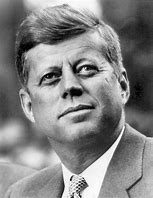
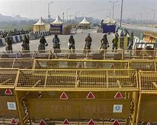
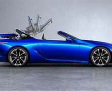
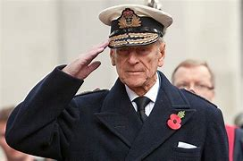
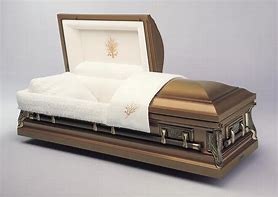
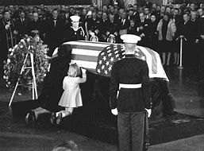
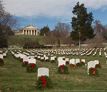
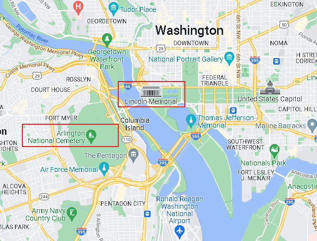

title:: 076 John Kennedy: Young

- ## 076 John Kennedy: Young
- ## pure
  collapsed:: true
	- VOA Learning English presents America's Presidents.
	- Today we are talking about John Fitzgerald Kennedy. He was also known as Jack Kennedy, or by the letters JFK.
	- When he took office in 1961, Kennedy was 43 years old. He was the youngest elected president in United States' history.
	- Kennedy was also the first Catholic to be elected U.S. president.
	- Kennedy's youth and religion raised questions in the minds of some Americans that Kennedy could lead the country. They wondered if he would always follow the policies of the Roman Catholic Church.
	- But Kennedy became well-known as a statesman, and popular with people around the world. He was intelligent, funny and good-looking. For many, Kennedy was a sign of new energy and hope.
	- The public was shocked, then, when the president's term was violently cut short.
	- ## Early life
	- John F. Kennedy was born in 1917 near Boston, Massachusetts. He was the second of nine children.
	- Both his parents were Catholic, with ancestors from Ireland. Many years ago, Irish Catholics often faced discrimination in the United States. But the Kennedy family was also politically powerful and wealthy.
	- As a result, young Jack Kennedy grew up in big, beautiful houses and received a top quality education. His family did not suffer during the Great Depression, as many Americans had. Instead, the Kennedy children swam, sailed boats and played sports.
	- Jack also enjoyed reading books and following the news. His older brother Joe wanted to enter politics, but Jack said he might become a teacher or writer. When he was a college student at Harvard, Jack wrote a long paper about Britain in the years leading up to World War II. A version of it was published in 1940 as a book.
	- The war changed Jack's thinking about his future plans. During World War II, both Jack and his older brother joined the U.S. Navy. In the Pacific, Jack became a hero. He won medals for leading some of his troops to safety after a Japanese warship struck a boat they were on.
	- But Joe was killed. In 1944, his airplane exploded over Europe.
	- When the war ended, Jack's father urged him to follow his brother's dream of succeeding in politics. Jack agreed, and he set his sights on becoming the country's first Catholic president.
	- ## Presidency
	- Kennedy was nominated as the Democratic Party's candidate, and he was elected in 1960.
	- He easily defeated Vice President Richard Nixon, the Republican candidate, in the Electoral College. But Kennedy won only narrowly in the popular vote.
	- Though he was young, Kennedy brought experience to the job. In addition to being a naval officer, Kennedy had been a member of the U.S. House of Representatives as well as a senator from Massachusetts.
	- He also published a Pulitzer Prize-winning book called "Profiles in Courage."
	- And he had become a husband and father. He married a wealthy, well-educated woman who had been working as a newspaper photographer. Her name was Jacqueline Bouvier, but she was sometimes called Jackie.
	- She became pregnant five times, but only two of her children would survive: a daughter named Caroline, and a son, John F. Kennedy, Junior.
	- The family of four moved into the White House in January 1961. On the day he was sworn-in, Kennedy gave a speech that many people still remember today. It celebrated the "new generation of Americans," and promised to "pay any price" for liberty.
	- Supporters of the new president loved his energy and sense of hope. In his most famous line, Kennedy said, "Ask not what your country can do for you – ask what you can do for your country."
	- Many young people remembered that line when they volunteered for a program Kennedy created in 1961: the Peace Corps.
	- Other Americans remembered the line when they watched two Apollo 11 astronauts walk on the moon in 1969. Kennedy strongly supported the country's space program. He promised that Americans would land on the moon by the end of the 1960s, and they did.
	- Kennedy also supported efforts to improve civil rights across the U.S., although his administration moved slowly. Calls to end legalized racism were growing stronger during Kennedy's time in office, particularly because of the leadership of Martin Luther King, Junior.
	- In June of 1963, King spoke to hundreds of thousands of people at a civil rights protest called the March on Washington. He told the crowd that he dreamed "my four little children will one day live in a nation where they will not be judged by the color of their skin, but by the content of their character."
	- The March on Washington, among other events, showed the power of the civil rights movement. In late 1963, President Kennedy sent a civil rights bill to Congress and spoke to Americans about the injustice that remained in the country.
	- The Peace Corps, the Space Race, and civil rights are all part of Kennedy's legacy.
	- Kennedy is also remembered for several troubling international events. In one, known as the Bay of Pigs, Americans supported Cuban refugees in an effort to oust the government of Fidel Castro. Not only did the refugees fail, but Kennedy's government was found to be lying about their support of the effort.
	- And Kennedy faced off with the leader of the Soviet Union, Nikita Khrushchev. In 1962, American leaders learned that the Soviets had hidden nuclear weapons in Cuba. The missiles would be able to reach the U.S. mainland easily.
	- Kennedy ordered a blockade of Cuba. People around the world held their breath as they waited to see if the U.S. and the Soviet Union would launch a nuclear war. They did not. After several very tense weeks, Kennedy and Khrushchev reached an agreement that ended the crisis.
	- Kennedy went on to reach an agreement with the Soviet Union and Britain to limit nuclear weapons testing. He said the agreement was one of the presidential acts of which he was most satisfied.
	- Historians still debate Kennedy's actions, and what else might have happened during his presidency. They wonder especially what he would have done about the increasing conflict in Vietnam.
	- But Kennedy did not live to finish his first term.
	- ## Death
	- By November 22, 1963, Kennedy had been president for just under three years. The next election was still a year away, but it was time to start campaigning again.
	- So the president and his wife went to Dallas, Texas to connect with voters. They were riding in a car with other official vehicles that drove slowly through the center of the city. Jack, Jackie, and the Texas governor and his wife sat in a convertible – an automobile without protection over the seats.
	- The president was waving at the crowd. Suddenly, several gunshots were fired. The president was struck twice.
	- The governor was also hit and injured.
	- Kennedy was hurried to a hospital, but doctors were unable to help him. News reporters announced his death to a stunned public.
	- Hours later, Jackie Kennedy appeared next to the former vice president – now president – Lyndon Johnson. She still wore the clothes with her husband's blood on them.
	- The events remain intense in the minds of many Americans who were alive at the time. The images remain easily recognizable parts of American history. The pictures of Kennedy's family at his funeral are especially memorable. In one, three-year-old John holds up his arm and salutes his father's casket.
	- Attention quickly turned to the gunman. It was reportedly a 24-year-old man named Lee Harvey Oswald. Shortly after the president and the governor were shot, Oswald shot a policeman who questioned him.
	- Oswald was eventually detained. Officials planned to bring him to court for the death of the president and the policeman. But on the way from the police station to the jail, a local night-club owner shot and killed Oswald.
	- As a result, the case never came to trial. Many Americans believe the reason for the attack has yet to be clarified.
	- ## Legacy
	- Historians have a mixed reaction to Kennedy's years as a president, although their opinions are generally positive.
	- His image with the public suffered some years after his death because of reports that he had romantic relationships with women other than Jackie throughout his marriage.
	- In time, the public also learned about Kennedy's health problems. He suffered from severe back pain and Addison's disease. He often used strong medicine to help control the conditions. The health problems are at odds with Kennedy's image of health and love of sports.
	- Yet even with these new details, Kennedy is still one of the country's best-remembered leaders. He was a charismatic man whose career influenced many other Americans to enter public service.
	- Americans also remember his stylish, cultured wife. Jackie Kennedy compared the Kennedy years at the White House to Camelot, the legendary court of King Arthur.
	- Their remains, along with those of two of their children, are buried at Arlington National Cemetery, across the Potomac River from Washington. They are honored there with an eternal flame – one designed so the fire will never go out.
- ---
- ## def
	- VOA Learning English presents America's Presidents.
	- Today we are talking about John Fitzgerald Kennedy. He was also known as Jack Kennedy, or by the letters JFK.
		- > ▶ John Fitzgerald Kennedy
		  
	- When he took office in 1961, Kennedy was 43 years old. He was the youngest elected president in United States' history.
	- Kennedy was also the first Catholic to be elected U.S. president.
	- Kennedy's youth and religion /raised questions in the minds of some Americans /that Kennedy could lead the country. They wondered /if he would always follow the policies of the Roman Catholic Church.
		- 肯尼迪的年轻和宗教信仰让一些美国人怀疑他能否领导这个国家。他们想知道他是否会一直遵循罗马天主教会的政策。
	- But Kennedy became well-known as a statesman, and popular with people around the world. He was intelligent, funny and good-looking. For many, Kennedy was a sign of new energy and hope.
		- > ▶ statesman : a wise, experienced and respected political leader 政治家
		- 对许多人来说，肯尼迪象征着新的活力和希望。
	- The public was shocked, then, when the president's term was violently cut short.
		- > ▶ cut short 中断, 突然停止, 打断, 缩短
	- ## Early life
	- John F. Kennedy was born in 1917 near Boston, Massachusetts. He was the second of nine children.
	- Both his parents were Catholic, with ancestors from Ireland. Many years ago, Irish Catholics often faced discrimination in the United States. But the Kennedy family was also politically powerful and wealthy.
		- > ▶ discrimination (n.) [ U ] ~ (against sb)~ (in favour of sb) :the practice of treating sb or a particular group in society less fairly than others 区别对待；歧视；偏袒
	- As a result, young Jack Kennedy grew up in big, beautiful houses /and received a top quality education. His family did not suffer /during the Great Depression, as many Americans had. Instead, the Kennedy children swam, sailed boats and played sports.
	- Jack also enjoyed reading books /and following the news. His older brother Joe wanted to enter politics, but Jack said /he might become a teacher or writer. When he was a college student at Harvard, Jack wrote a long paper about Britain /in the years leading up to World War II. A version of it /was published in 1940 as a book.
		- > ▶ follow [ VN ] to watch or listen to sb/sth very carefully 密切注视；倾听
		  -> The children were following every word of the story intently. 孩子们一字不漏地专心听故事。
		  + /to take an active interest in sth /and be aware of what is happening 对…产生浓厚兴趣而关注
		  -> Millions of people followed the trial on TV. 几百万人饶有兴趣地收看了电视转播的审判。
	- The war changed Jack's thinking about his future plans. During World War II, both Jack and his older brother /joined the U.S. Navy. In the Pacific, Jack became a hero. He won medals /for leading some of his troops to safety /after a Japanese warship struck a boat they were on.
		- 他带领他的一些部队转移到安全的地方
	- But Joe was killed. In 1944, his airplane exploded over Europe.
	- When the war ended, Jack's father /urged him to follow his brother's dream of succeeding in politics. Jack agreed, and he **set his sights /on** becoming the country's first Catholic president.
		- > ▶ **set your sights on sth/on doing sth** :
		  to decide that you want sth and to try very hard to get it 以…为奋斗目标；决心做到
		  -> She's **set her sights /on** getting into Harvard. 她决心要上哈佛大学。
		- 他的目标是成为这个国家的第一位天主教总统。
	- ## Presidency
	- Kennedy was nominated as the Democratic Party's candidate, and he was elected in 1960.
	- He easily defeated Vice President Richard Nixon, the Republican candidate, in **the Electoral College**. But Kennedy won only narrowly /in **the popular vote**.
		- ((6260af7c-cb61-4a69-8778-b87a59fbc12f))
	- Though he was young, Kennedy **brought** experience **to** the job. **In addition to** being a naval officer, Kennedy had been a member of the U.S. **House of Representatives** /**as well as** a senator from Massachusetts.
		- 肯尼迪除了是一名海军军官外，还曾是美国众议院议员和马萨诸塞州参议员。
	- He also published a Pulitzer Prize-winning book /called "Profiles in Courage."
		- > ▶ profile (n.) the outline of a person's face when you look from the side, not the front 面部的侧影；侧面轮廓  / 外形；轮廓
		  + /a description of sb/sth that gives useful information 概述；简介；传略
		- > ▶ courage : the ability to do sth dangerous, or to face pain or opposition, without showing fear 勇气；勇敢；无畏；胆量
		- >  Profiles in Courage 勇气之形;  勇敢者传略
		- 他还出版了一本获得普利策奖的书
	- And he had become a husband and father. He married a wealthy, well-educated woman /who had been working as a newspaper photographer. Her name was Jacqueline Bouvier, but she was sometimes called Jackie.
	- She became pregnant five times, but only two of her children /would survive: a daughter named Caroline, and a son, John F. Kennedy, Junior.
	- The family of four /moved into the White House in January 1961. On the day he was sworn-in, Kennedy gave a speech /that many people still remember today. It celebrated the "new generation of Americans," and promised **to "pay any price" for** liberty.
		- > ▶ pay any price 付出任何代价
		- 在演讲中, 庆祝“新一代美国人”，并承诺为自由“不惜一切代价”。
	- Supporters of the new president /loved his energy and sense of hope. In his most famous line, Kennedy said, "Ask not what your country can do for you – ask what you can do for your country."
		- > ▶ line [ C ] ( informal ) a remark, especially when sb says it to achieve a particular purpose （尤指为达到某种目的说的）话，言语
		  + /（戏剧或电影的）台词，对白
	- Many young people remembered that line /when they volunteered for a program /Kennedy created in 1961: the Peace Corps.
	  > ▶ the Peace Corps : 和平队，和平工作团 （美国机构，送美国青年去其他国家义务工作以建立国际友谊）a US organization /that sends young Americans to work in other countries without pay /in order to create international friendship
		- 许多年轻人在参加肯尼迪1961年创立的和平队(Peace Corps)项目时, 还记得这句话。
	- Other Americans remembered the line /when they watched two Apollo 11 astronauts walk on the moon in 1969. Kennedy strongly supported the country's space program. He promised that /Americans would land on the moon /by the end of the 1960s, and they did.
	- Kennedy also supported efforts /to improve civil rights across the U.S., although his administration moved slowly. Calls to end legalized racism /were growing stronger during Kennedy's time in office, particularly because of the leadership of Martin Luther King, Junior.
		- > ▶ legalized 合法的, 合法化的
		- > ▶ racism (n.) the unfair treatment of people who belong to a different race; violent behaviour towards them 种族歧视；种族迫害 
		  + /the belief that some races of people are better than others 种族主义；种族偏见
	- In June of 1963, King spoke to hundreds of thousands of people /at a civil rights protest /called the March on Washington. He told the crowd that /he dreamed "my four little children will one day live in a nation /where they will not be judged by the color of their skin, but by the content of their character."
		- 马丁·路德·金, 在名为“华盛顿大游行”(March on Washington)的民权抗议活动中, 向数十万人发表讲话。他对人群说，他梦想“有一天，我的四个孩子将生活在一个不是以他们的肤色，而是以他们的品格优劣来评价他们的国家。”
	- The March on Washington, among other events, showed the power of the civil rights movement. In late 1963, President Kennedy **sent** a civil rights bill **to** Congress /and spoke to Americans about the injustice /that remained in the country.
		- > ▶ injustice  [ UC ] the fact of a situation being unfair and of people not being treated equally; an unfair act or an example of unfair treatment 不公正，不公平（的对待或行为）
	- The Peace Corps, the Space Race, and civil rights /are all part of Kennedy's legacy.
	- Kennedy is also remembered for several troubling international events. In one, known as the Bay of Pigs, Americans supported Cuban refugees(n.) /in an effort to oust(v.) the government of Fidel Castro. **Not only** did the refugees fail, **but** Kennedy's government was found to be lying about their support of the effort.
		- > ▶ refugee  : N-COUNT Refugees are people /who have been forced to leave their homes or their country, either because there is a war there, because of their political or religious beliefs, or because of natural disaster. 难民
		  => re-,向后，往回，-fug,逃避，逃跑，词源同 fugitive,centrifuge.
		- > ▶ oust (v.)[ VN ] ~ sb (from sth/as sth) : to force sb out of a job or position of power, especially in order to take their place 剥夺；罢免；革职
		  -> He was ousted as chairman. 他的主席职务被革除了。
		  -> The rebels finally managed to oust(v.) the government from power. 反叛者最后总算推翻了政府。
		  => 来自古法语oster,驱逐，赶走，来自拉丁语obstare,站在对面，阻止，阻碍，来自ob-,相对，对着的，-st,站，站立，词源同stand.引申词义剥夺，罢免。词义演变比较obviate.
	- And Kennedy **faced off** with the leader of the Soviet Union, Nikita Khrushchev. In 1962, American leaders learned that /the Soviets had hidden nuclear weapons in Cuba. The missiles would be able to reach the U.S. mainland easily.
		- > ▶ face off : to get ready to argue, fight or compete with sb 准备好辩论（或战斗、比赛）
		  -> The candidates are preparing **to face off** on TV tonight. 今夜候选人准备在电视上进行辩论。
	- Kennedy ordered a blockade(n.) of Cuba. People around the world /held their breath /as they waited to see if the U.S. and the Soviet Union would launch a nuclear war. They did not. After several very tense weeks, Kennedy and Khrushchev reached an agreement /that ended the crisis.
		- > ▶ blockade   /blɑːˈkeɪd/  (n.)(v.) the action of surrounding or closing a place, especially a port, in order to stop people or goods from coming in or out （尤指对港口的）包围，封锁
		  -> to impose/lift a blockade 实行╱解除封锁
		  + /(n.)a barrier that stops people or vehicles from entering or leaving a place 障碍物；屏障
		  
	- Kennedy went on /to reach an agreement with the Soviet Union and Britain /to limit nuclear weapons testing. He said /the agreement was one of the presidential acts /of which he was most satisfied.
		- > ▶ act (n.)  [ C ] a law that has been passed by a parliament （议会通过的）法案，法令
	- Historians still debate Kennedy's actions, and what else might have happened /during his presidency. They wonder especially /what he would have done /about the increasing conflict in Vietnam.
		- 历史学家仍在争论肯尼迪的行为，以及在他担任总统期间还可能发生什么。他们尤其想知道他会对越南日益加剧的冲突做些什么。
	- But Kennedy did not live /to finish his first term.
	- ## Death
	- By November 22, 1963, Kennedy had been president /for just under three years. The next election was still a year away, but it was time /to start campaigning again.
	- So the president and his wife /went to Dallas, Texas /to connect with voters. They were riding in a car /with other official vehicles(n.) /that drove slowly through the center of the city. Jack, Jackie, and the Texas governor and his wife /sat in a convertible(n.) – an automobile without protection over the seats.
		- > ▶ vehicle (n.) ( rather formal ) a thing that is used for transporting people or goods from one place to another, such as a car or lorry/truck 交通工具；车辆 
		  + /~ (for sth) something that can be used to express your ideas or feelings or as a way of achieving sth （赖以表达思想、感情或达到目的的）手段，工具
		  -> Art may be used as a vehicle for propaganda. 艺术可以用作宣传的工具。
		  => veh(way)路 + -icle名词词尾,工具 同源词：way
		- > ▶ convertible (n.) a car /with a roof that can be folded down or taken off 活动顶篷式汽车
		  + /(a.) ~ (into/to sth) that can be changed to a different form or use 可改变的；可转换的；可兑换的
		  -> The bonds are convertible(a.) into ordinary shares. 债券可兑换为普通股。
		  
	- The president was waving at the crowd. Suddenly, several gunshots were fired. The president was struck twice.
	- The governor was also hit and injured.
	- Kennedy was hurried to a hospital, but doctors were unable to help him. News reporters **announced** his death **to** a stunned public.
		- > ▶ stunned (a.)惊呆的
		  + /(v.)V-T If you are stunned by something, you are extremely shocked or surprised by it and are therefore unable to speak or do anything. 使震惊
		  + /V-T If something such as a blow on the head stuns(v.) you, it makes you unconscious or confused and unsteady. 把…打昏
		- 新闻记者向震惊的公众宣布了他的死讯。
	- Hours later, Jackie Kennedy appeared **next to** the former vice president – now president – Lyndon Johnson. She still wore(v.) the clothes /with her husband's blood on them.
		- 几个小时后，杰奎琳·肯尼迪出现在前副总统、现任总统林登·约翰逊身边。她仍然穿着有她丈夫血迹的衣服。
	- The events remain intense /in the minds of many Americans /who were alive at the time. The images remain easily recognizable(a.) parts of American history. The pictures of Kennedy's family at his funeral /are especially memorable. In one, three-year-old John /holds up his arm /and salutes(v.) his father's casket.
		- > ▶ recognizable (a.) ~ (as sth/sb) easy to know or identify 容易认出的；易于识别的
		  -> The building was easily recognizable as a prison. 很容易看出这座建筑是所监狱。
		- > ▶ salute  /səˈluːt/ to touch the side of your head with the fingers of your right hand /to show respect, especially in the armed forces （尤指军队中）敬礼
		  + / ( formal ) to express respect and admiration for sb/sth 致敬；表示敬意
		  => 萨卢斯（Salus）是罗马神话中的健康女神，掌管健康、幸福和兴盛。对应于希腊神话中的许癸厄亚（Hygieia）。在古罗马因其司属而得到古罗马人广泛崇拜与供奉，并以每年八月五日进行相关活动。
		   英语单词salute就来自萨卢斯的名字Salus，本意是“wish health to”（祝健康）。
		  于此同源的单词还有salutary（有益的）、salutation（致敬）。 salute： [sə'l(j)uːt] v.n.行礼，致敬，欢迎 salutation：[,sæljʊ'teɪʃ(ə)n] n.称呼，致敬，问候，招呼 salutary：['sæljʊt(ə)rɪ] adj.有益的，有用的，有益健康的
		  
		- > ▶ casket :  /ˈkæskɪt/ a small decorated box /for holding jewellery or other valuable things, especially in the past （装珠宝等贵重物品的）精致小盒，装饰精美的小箱 /棺材；骨灰盒；小箱
		  => 可能来自case, 箱子。
		  
		- 在许多当时还活着的美国人的脑海中，这些事件仍然是强烈的。这些照片仍然是美国历史上容易辨认的一部分。肯尼迪家人在他葬礼上的照片尤其令人难忘。在其中一张照片中，三岁的约翰举起手臂向父亲的棺材敬礼。
		  
	- Attention quickly turned to the gunman. It was reportedly a 24-year-old man /named Lee Harvey Oswald. Shortly after the president and the governor were shot, Oswald shot a policeman who questioned him.
	- Oswald was eventually detained. Officials planned to bring him to court /for the death of the president and the policeman. But on the way **from** the police station **to** the jail, a local night-club owner /shot and killed Oswald.
	- As a result, the case never came to trial. Many Americans believe /the reason for the attack /has yet to be clarified.
		- > ▶ clarify (v.) ( formal ) to make sth clearer or easier to understand 使更清晰易懂；阐明；澄清
		  ▶ clari·fi·ca·tion [ UC ] /ˌklærəfɪˈkeɪʃn/    /ˌklærəfɪˈkeɪʃn/   n
		  -> I am seeking clarification of the regulations. 我正在努力弄清楚这些规则。
		- 结果，这个案子没有进行审判。许多美国人认为袭击的原因还有待查清楚。
	- ## Legacy
	- Historians have a mixed reaction to Kennedy's years /as a president, although their opinions are generally positive.
	- `主` His image with the public /`谓` suffered /some years after his death /because of reports /that he had romantic relationships with women /**other than** Jackie /throughout his marriage.
		- > ▶ **OTHER THAN**
		  ( usually used in negative sentences 通常用于否定句 )
		  (1) except 除…以外
		  -> I don't know any French people **other than you**. 除了你，我不认识别的法国人。
		  (2) ( formal ) different or in a different way from; not 不同；不同于；不
		  -> I have never known him to behave **other than selfishly**. 我从没见过他不自私。
		- 他的公众形象在他死后的几年里受到了影响，因为有报道称, 他在婚姻中与杰奎琳以外的女人有过浪漫关系。
	- In time, the public also learned about Kennedy's health problems. He suffered from severe back pain /and Addison's disease. He often used strong medicine /to help control the conditions. The health problems are **at odds with** Kennedy's image of health and love of sports.
		- > ▶  Addison's disease : N a disease characterized by deep bronzing of the skin, anaemia, and extreme weakness, caused by underactivity of the adrenal glands 艾迪生氏病 (Also called adrenal insufficiency)
		  因人体肾上腺无法制造足够的类固醇激素, 而致病。
		- > ▶ **BE AT ODDS (WITH STH)** :
		  to be different from sth, when the two things should be the same （与…）有差异，相矛盾 SYN conflict
		  -> These findings are **at odds with** what is going on in the rest of the country. 这些研究结果与国内其他地区的实际情况并不相符。
		   ▶ **BE AT ODDS (WITH SB) (OVER/ON STH)**
		  to disagree with sb about sth （就某事）（与某人）有分歧
	- Yet even with these new details, Kennedy is still one of the country's best-remembered leaders. He was a charismatic man /whose career influenced many other Americans to enter public service.
		- > ▶ charismatic (a.) /ˌkærɪzˈmætɪk/ having charisma 有超凡魅力的；有号召力（或感召力）的
	- Americans also remember his stylish, cultured wife. Jackie Kennedy **compared**(v.) the Kennedy years at the White House **to** Camelot, the legendary court of King Arthur.
		- > ▶ Camelot /ˈkæməˌlɑːt/  N (in Arthurian legend) the English town /where King Arthur's palace and court were situated (在《亚瑟王传》中)卡米洛特; 亚瑟王的宫殿和圆桌会议所在之地
		- > ▶ court : [ CU ] the place where legal trials take place and where crimes, etc. are judged 法院；法庭；审判庭
		  + /[ CU ] the official place where kings and queens live 王宫；宫殿；宫廷
		- 美国人还记得他时髦、有教养的妻子。杰奎琳·肯尼迪将肯尼迪在白宫的岁月, 比作亚瑟王的传奇宫廷卡梅洛特。
	- Their remains(n.), **along with** those of two of their children, are buried at **Arlington National Cemetery**, across **the Potomac River** from Washington. They are honored there /with an eternal(a.) flame – one designed so the fire will never go out.
		- > ▶ remains 遗体，遗骸. /古代遗物；古迹；遗迹；遗址 /剩余物；残留物；剩饭菜
		- > ▶ eternal (a.) without an end; existing or continuing forever 不朽的；永久的；永恒的
		  -> the promise of eternal life in heaven 在天国永生的许诺
		  + /[ only before noun ] ( disapproving ) happening often and seeming never to stop 无休止的；永不停止的；没完没了的
		  => 来自aevum("age").
		- > ▶ Arlington National Cemetery
		  在美国有100多个国家公墓，首都华盛顿波托马克河边的"阿灵顿国家公墓"是最著名的。它与"林肯纪念堂"隔河相望。
		  1864年6月15日开始作为军人公墓使用。其中安葬了美国国家战争中牺牲的美国军人，包括南北战争、朝鲜战争、越南战争, 以至于最近的伊拉克战争与阿富汗战争。
		  **它是美国陆军部直接管辖的两座国家级公墓之一。**两名美国总统威廉·霍华德·塔虎脱, 与约翰·肯尼迪, 安葬于此。
		  长眠在这里，首先是战争中阵亡的士兵，政治家在工作岗位上殉职的国家工作人员、对国家有杰出贡献者。
		  
		  
		- 他们的遗体，以及他们的两个孩子的遗体，被埋葬在阿灵顿国家公墓，与华盛顿隔着波托马克河。在那里，人们用永恒的火焰来纪念他们——这火焰被设计成永不熄灭。
- ---
- John Fitzgerald Kennedy
	- 是美国颇具影响力的肯尼迪家族成员，被视为美国自由主义的代表，他是美国历史上至今第四位遇刺身亡的美国总统。
	- 在第二次世界大战期间，他担任美军军官，曾在南太平洋英勇救助了落水美国海军船员，因而获颁紫心勋章，而后从政.
	- 在美国总统历史排名中，通常仅被史家列在排名中上的位置，但他在大众文化中的地位却更高，一直被大多数美国人视为历史上最伟大的总统之一，这和他在冷战期间太空计划的关键地位极有关连。
	-