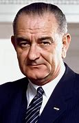

title:: 077 Lyndon Johnson: Complicated

- ## 077 Lyndon Johnson: Complicated
- ## pure
  collapsed:: true
	- VOA Learning English presents America's Presidents.
	- Today we are talking about Lyndon Johnson. He was the vice president under John F. Kennedy.
	- Many Americans recognize Johnson from a photograph of his swearing-in on November 22, 1963.
	- Kennedy had just been shot during a visit to Dallas, Texas. Johnson and his wife also were visiting the city.
	- After doctors announced that Kennedy had died, the Johnsons were taken to the presidential airplane. There, Johnson took the oath of office as president.
	- Men wearing suits look on, while three women stand around him. His wife, Lady Bird Johnson, is at one side. Former first lady Jackie Kennedy is at the other. She is still wearing clothing covered with her husband's blood. The judge who is administering the oath, Sarah Hughes, stands in front of Lyndon Johnson. She holds a prayer book on which Johnson places one hand and swears to follow the Constitution.
	- The photograph showed the American people that the federal government could and would continue in an orderly way.
	- But Johnson's position was difficult. Many people were shocked and in mourning for the assassinated president.
	- But as the conflict in Vietnam increased, and some Americans rejected Johnson's reforms, he found his position difficult again.In the next election, Johnson was elected president in his own right.
	- ## Early life
	- Lyndon Baines Johnson was born in Texas, where his family had lived for generations. A town called Johnson was even named after his relatives.
	- Lyndon was the oldest of five children. His mother was a teacher and writer, and his father was a farmer and political leader.
	- In time, the Johnson family experienced financial difficulties. They had little money to give their children much of an education, but Lyndon was able to attend a teaching college.
	- Johnson excelled as a teacher. He also learned from his students. Many were even poorer than he was. They also faced discrimination because they came from Mexican families. Johnson promised to help them.
	- But he found he could do more to improve people's lives as a politician than as a teacher.
	- He volunteered for some political campaigns, became an aide to a member of the United States Congress, and in time became a member of Congress himself.
	- Along the way, he married a woman named Claudia Taylor. But everyone called her Lady Bird. They went on to have two daughters.
	- Johnson served for 12 years in the U.S. House of Representatives. In 1948, he was narrowly elected to the Senate, becoming one of the two senators from the state of Texas.
	- From there, Johnson rose quickly. He took on increasingly important jobs in the Senate. By 1954, he was the Senate majority leader – the Democratic Party's top spokesman in the Senate.
	- The Senate website notes that the person with that job needs to be able to work well with others, especially members of other parties.
	- Historians also note that Johnson worked very hard, and was always prepared.
	- A well-known biography of Johnson is called "Master of the Senate." The book describes Johnson as extremely ambitious, sometimes cruel, and often willing to praise others to get what he wanted. At the same time, he could be very concerned about other people's well-being.
	- In other words, the picture of Johnson is a complicated one.
	- In 1960, he competed against John F. Kennedy for the Democratic presidential nomination. Johnson lost that race – but the party asked him to be their vice presidential candidate instead.
	- Johnson agreed, not knowing that in a little more than three years, he would enter the White House as president.
	- ## Presidency
	- After being sworn-in, Johnson used his political experience in the Senate to pass a number of reforms. They were aimed at carrying on, in his words, a "War on Poverty."
	- The new laws created healthcare and education programs. They also used federal money to make food less costly for some people, and to train workers for jobs.
	- Johnson also continued the work Kennedy began by signing the Civil Rights Act of 1964. The act made segregation because of race, religion, or national origin illegal.
	- The Civil Rights Act also made it illegal for employers to discriminate against someone because of race, religion, national origin, or gender.
	- The reforms had their critics, then and today. But in the presidential election of 1964, Johnson won "by the widest margin of popular votes in American history." Historian Kent Germany says that vote gave the Democrats a rare opening "to pass a comprehensive liberal program."
	- R
	- ## Presidency after 1964
	- Johnson had a name for such a program. He called it the "Great Society." He said the United States should aim not only to be a rich and powerful society, but also to "end poverty and racial injustice."
	- Johnson followed his earlier reforms with others. They sought to prevent crime, reduce pollution, support the arts, make roads safer, and protect American consumers against bad products. His administration also created an immigration policy that valued family members, skilled workers, and refugees.
	- Johnson also signed the Voting Rights Act of 1965. It sought to lift the barriers that had long prevented African-American men and women from exercising their right to vote.
	- Later, Johnson removed legal discrimination in the process of buying and renting homes.
	- Together, these actions have linked Johnson to the civil rights movement in the minds of many Americans. Yet Johnson is also strongly linked to another part of U.S. history, often known simply as "Vietnam."
	- Earlier presidents had ordered U.S. military action in the conflict between North and South Vietnam. Since 1950, Presidents Truman, Eisenhower, and Kennedy had slowly increased the American intervention. Their goal was to prevent the spread of communism in Southeast Asia.
	- President Johnson continued Kennedy's policies. He also received the support of Congress to do whatever was necessary to protect U.S. forces and "prevent further aggression" by North Vietnam's communist government.
	- Yet, when he was a presidential candidate in 1964, Johnson promised not to increase U.S. involvement and send young Americans to fight in Vietnam.
	- The opposite happened.
	- Over the next four years, Johnson called on hundreds of thousands of additional U.S. troops to fight on the ground and in the air. The North Vietnamese fought back, both on the battle field and politically.
	- In time, the American public withdrew their support of the struggle and their support for the president.
	- By early 1968, Johnson had become deeply unpopular with voters. His party lost seats in Congress, and Johnson lost his ability to persuade lawmakers to support the measures he proposed.
	- In addition, the U.S. economy was showing signs of weakness, partly because of the costs of the conflict in Vietnam and government spending at home.
	- As the presidential nominating process began in early 1968, Johnson was permitted to seek another four-year term. But he announced that he would not seek or accept his party's nomination.
	- Shortly after, civil rights leader Martin Luther King, Jr. was shot and killed. Angered by his murder, people in more than 100 cities rioted.
	- Then, in June, John Kennedy's brother, Robert Kennedy, was also assassinated. Kennedy had been competing for the Democrats' nomination for president.
	- His death, and Johnson's withdrawal, added to the divisions in the Democratic Party. Several groups gathered to protest at the party's nominating convention in Chicago. The meeting ended in violent clashes between protesters and police.
	- By the time Johnson left office in January 1969, his party had lost control of the White House, and many Americans believed the country was in disarray.
	- ## Legacy
	- After he left the presidency, Johnson returned to his home in Texas. He wrote his memories about his White House years, and made preparations for his presidential library.
	- But he did not live much longer. He died in 1973, hours before the U.S. involvement in Vietnam officially came to a close.
	- Johnson was a complex person, and his image in the mind of many Americans is just as complicated. His policies opened new paths for many people, but also led to years of death and destruction in Vietnam.
	- As a president, he acted powerfully and often independently, and succeeded in passing an unusually large number of reforms. But he also failed to persuade many Americans to accept some of those measures.
	- Supporters of the free market especially strongly rejected the government controls Johnson enacted.
	- Even some in his Democratic Party, which Johnson had controlled for years, lost faith in him. In 1964, anti-war activists changed his campaign slogan, "All the way with LBJ." Instead, they said, "Part of the way with LBJ."
	- And by 1968, they were saying, "Hey, Hey, LBJ. How many kids did you kill today?"
- ---
- ## def
	- VOA Learning English presents America's Presidents.
	- Today we are talking about Lyndon Johnson. He was the vice president under John F. Kennedy.
		- > ▶  Lyndon Johnson
		  
	- Many Americans recognize Johnson from a photograph of his swearing-in on November 22, 1963.
	- Kennedy had just been shot /during a visit to Dallas, Texas. Johnson and his wife also were visiting the city.
	- After doctors announced that /Kennedy had died, the Johnsons were taken to the presidential airplane. There, Johnson **took the oath** of office as president.
		- > ▶ oath   /oʊθ/ (n.) a formal promise to do sth /or a formal statement that sth is true 宣誓；誓言
		  -> to take/swear an oath of allegiance 宣誓效忠
		  + **ON/UNDER OATH**
		  ( law 律 ) having made a formal promise to tell the truth in court （在法庭上）宣誓说实话，经宣誓
		  -> Is she prepared to give evidence on oath? 她愿意宣誓据实作证吗？
	- Men /wearing suits /look on, while three women stand around him. His wife, Lady Bird Johnson, is at one side. Former **first lady** Jackie Kennedy /is at the other. She is still wearing clothing /covered with her husband's blood. The judge /who is administering the oath, Sarah Hughes, stands in front of Lyndon Johnson. She holds a prayer book /on which Johnson places(v.) one hand /and swears to follow the Constitution.
		- > ▶ prayer (n.) ~ (for sb/sth) : words which you say to God giving thanks or asking for help 祷告，祈祷（的内容） /祷告，祈祷（的行为）
		- 穿西装的男人在一旁看着，而三个女人站在他周围。他的妻子伯德·约翰逊夫人在一旁。前第一夫人杰奎琳·肯尼迪在另一边。她仍然穿着沾满丈夫血迹的衣服。主持宣誓仪式的法官莎拉·休斯, 站在林登·约翰逊面前。她拿着一本祈祷书，约翰逊将一只手放在上面，发誓要遵守宪法。
	- The photograph **showed** the American people **that** /`主` the federal government `谓` could and would continue in an orderly way.
		- 这张照片向美国人民展示了, 联邦政府能够并将继续以有序的方式运作。
	- But Johnson's position was difficult. Many people were shocked /and in mourning for the assassinated president.
	- But as the conflict in Vietnam increased, and some Americans rejected Johnson's reforms, he found his position difficult again. In the next election, Johnson was elected president /in his own right.
		- 在下次选举中，约翰逊凭借自己的能力当选为总统。
	- ## Early life
	- Lyndon Baines Johnson was born in Texas, where his family had lived for generations. A town called Johnson /was even named after his relatives.
		- > ▶ generation [ C+sing./pl.v. ] all the people who were born at about the same time （统称）一代人，同代人，同辈人
		- 他的家族几代人都住在那里。一个叫约翰逊的小镇, 甚至以他的亲戚命名。
	- Lyndon was the oldest of five children. His mother was a teacher and writer, and his father was a farmer and political leader.
	- In time, the Johnson family experienced financial difficulties. They had little money **to give** their children **much of** an education, but Lyndon was able to attend a teaching college.
		- > ▶ teaching college 教学型学院, 师范大学
	- Johnson excelled as a teacher. He also learned from his students. Many were even poorer than he was. They also faced discrimination /because they came from Mexican families. Johnson promised to help them.
		- 约翰逊是一名优秀的教师。他也向他的学生学习。许多人甚至比他还穷。他们还因为来自墨西哥家庭而受到歧视。约翰逊答应帮助他们。
	- But he found /he could do more /to improve people's lives /as a politician **than** as a teacher.
	- He **volunteered for** some political campaigns, became an aide(n.) to a member of the United States Congress, and in time became a member of Congress himself.
		- > ▶ aide (n.)  a person who helps another person, especially a politician, in their job （尤指从政者的）助手
		- 他自愿参加一些政治活动，成为一名美国国会议员的助手，并最终成为一名国会议员。
	- Along the way, he married a woman /named Claudia Taylor. But everyone called her Lady Bird. They went on /to have two daughters.
	- Johnson served for 12 years in the U.S. House of Representatives. In 1948, he was narrowly elected to the Senate, becoming one of the two senators from the state of Texas.
	- From there, Johnson rose quickly. He **took on** increasingly important jobs in the Senate. By 1954, he was the Senate majority leader – the Democratic Party's top spokesman in the Senate.
		- > ▶ take sth/sb on :
		  (1) to decide to do sth; to agree to be responsible for sth/sb 决定做；同意负责；承担（责任）
		  -> I can't take on any extra work. 我不能承担任何额外工作。
		- 从那时起，约翰逊迅速崛起。他在参议院担任了越来越重要的职务。1954年，他成为参议院多数党领袖，民主党在参议院的最高发言人。
	- The Senate website notes that /the person with that job /needs to be able to work well with others, especially members of other parties.
	- Historians also note that /Johnson worked very hard, and was always prepared.
		- 约翰逊工作非常努力，总是准备充分。
	- A well-known biography of Johnson /is called "Master of the Senate." The book describes Johnson as extremely ambitious, sometimes cruel, and often willing to praise others /to get what he wanted. At the same time, he could be very concerned about other people's well-being.
		- 有一本关于约翰逊的著名传记, 书名叫做“参议院大师”。该书称Johnson 为雄心勃勃，有时很残忍，经常为了得到自己想要的东西而愿意赞扬别人。与此同时，他可能非常关心别人的幸福。
	- In other words, the picture of Johnson /is a complicated one.
	- In 1960, he competed against John F. Kennedy /for the Democratic presidential nomination. Johnson lost that race – but the party asked him to be their vice presidential candidate instead.
	- Johnson agreed, not knowing that /in a little more than three years, he would enter the White House as president.
		- 他不知道再过三年多一点，他就会入主白宫，成为总统。
	- ## Presidency
	- After being sworn-in, Johnson used his political experience in the Senate /to pass a number of reforms. They were aimed at **carrying on**, in his words, a "War on Poverty."
		- > ▶ **CARRY ON (WITH STH) |CARRY STH ON** : to continue doing sth 继续做；坚持干
		  -> Carry on with your work /while I'm away. 我不在时你要接着干。
		- 用他的话来说，他们的目标是继续一场“向贫困宣战”。
	- The new laws /created healthcare and education programs. They also used federal money /to make food less costly for some people, and to train workers for jobs.
	- Johnson also continued the work /Kennedy began by signing the Civil Rights Act of 1964. The act **made segregation** /because of race, religion, or national origin /**illegal**.
		- ((6231769b-8b88-44b3-98ad-208593d7eea8))
		- > ▶ national origin 出身国
		- 约翰逊还继续了肯尼迪在1964年签署民权法案后开始的工作。该法案规定，因种族、宗教或国籍而实行的种族隔离, 是非法的。
	- The Civil Rights Act /also made it illegal for employers to discriminate against someone /because of race, religion, national origin, or gender.
		- 《民权法案》还规定，雇主因种族、宗教、国籍或性别歧视他人, 是非法的。
	- The reforms had their critics, then and today. But in the presidential election of 1964, Johnson won "by **the widest margin** of popular votes /in American history." Historian Kent Germany says that /vote gave the Democrats a rare opening "to pass a comprehensive liberal program."
		- > ▶ rare (a.) ~ (for sb/sth to do sth) |~ (to do sth) : not done, seen, happening, etc. very often 稀少的；稀罕的 /稀罕的；珍贵的
		- ((6258f7b2-2eb8-4edd-ba7a-520ee1be46f7))
		- 这个改革在当时和现在, 都有批评者。但在1964年的总统选举中，约翰逊以“美国历史上最广泛的选票优势”获胜。历史学家肯特·德曼说，这次投票给了民主党难得的机会“通过一项全面的自由计划”。
	- ## Presidency after 1964
	- Johnson had a name for such a program. He called it the "Great Society." He said /the United States should aim **not only** to be a rich and powerful society, **but also** to "end poverty and racial injustice."
	- Johnson followed his earlier reforms with others. They sought to prevent crime, reduce pollution, support the arts, make roads safer, and **protect** American consumers **against** bad products. His administration also created an immigration policy /that valued family members, skilled workers, and refugees.
		- 约翰逊在他早期的改革之后，又进行了其他改革。... 他的政府还制定了一项重视家庭成员、技术工人和难民的移民政策。
	- Johnson also signed **the Voting Rights Act** of 1965. It sought to lift the barriers /that had long **prevented** African-American men and women **from** exercising their right to vote.
	- Later, Johnson removed legal discrimination /in the process of buying and renting homes.
	- Together, these actions have linked Johnson to the civil rights movement /in the minds of many Americans. Yet Johnson is also strongly linked to another part of U.S. history, often known simply as "Vietnam."
	- Earlier presidents had ordered U.S. military action /in the conflict between North and South Vietnam. Since 1950, Presidents Truman, Eisenhower, and Kennedy /had slowly increased the American intervention. Their goal was to prevent the spread of communism in Southeast Asia.
		- 早些时候，美国总统曾下令美国在越南南北冲突中, 采取军事行动。自1950年以来，杜鲁门、艾森豪威尔和肯尼迪总统, 逐渐增加了美国的干预。他们的目标是防止共产主义在东南亚蔓延。
	- President Johnson continued Kennedy's policies. He also received the support of Congress /to do whatever was necessary /to protect U.S. forces /and "prevent further aggression" by North Vietnam's communist government.
		- 他还得到了国会的支持，采取一切必要措施保护美国军队，防止北越共产主义政府“进一步侵略”。
	- Yet, when he was a presidential candidate in 1964, Johnson promised not to increase U.S. involvement /and **send** young Americans **to fight** in Vietnam.
		- 然而
	- The opposite happened.
		- > ▶ opposite (n.) a person or thing /that is **as different as possible** from sb/sth else 对立的人（或物）；对立面；反面
	- Over the next four years, Johnson **called on** hundreds of thousands of additional U.S. troops /to fight /on the ground and in the air. The North Vietnamese fought back, **both** on the battle field **and** politically.
		- > ▶ additional (a.) more than was first mentioned or is usual 附加的；额外的；外加的
	- In time, the American public /withdrew their support of the struggle /and their support for the president.
		- > ▶ **struggle (n.) ~ (with sb) (for/against sth) |~ (with sb) (to do sth) |~ (between A and B)** : a hard fight in which people try to obtain or achieve sth, especially sth that sb else does not want them to have 斗争；奋斗；努力
		  + /搏斗；扭打；（尤指）抢夺，挣扎脱身
		  + /[ sing. ] ~ (to do sth) : something that is difficult for you to do or achieve 难事
		  SYN effort
		  -> It was a real struggle /to be ready on time. 要按时做好准备, 确非易事。
	- By early 1968, Johnson had become deeply unpopular with voters. His party lost seats in Congress, and Johnson lost his ability /to persuade lawmakers /to support the measures he proposed.
	- In addition, the U.S. economy was showing signs(n.) of weakness, partly because of the costs of the conflict in Vietnam /and government spending at home.
	- As the presidential nominating process /began in early 1968, Johnson was permitted /to seek another four-year term. But he announced that /he would not seek or accept his party's nomination.
		- 约翰逊获准寻求下一个四年任期。但他宣布不会寻求或接受本党提名。
	- Shortly after, civil rights leader Martin Luther King, Jr. was shot and killed. Angered by his murder, people in more than 100 cities /rioted.
	- Then, in June, John Kennedy's brother, Robert Kennedy, was also assassinated. Kennedy had been **competing for** the Democrats' nomination for president.
		- 肯尼迪一直在争取民主党总统候选人的提名。
	- His death, and Johnson's withdrawal, added to the divisions in the Democratic Party. Several groups gathered to protest /at the party's nominating convention in Chicago. The meeting ended /in violent clashes between protesters and police.
		- 几个团体聚集在芝加哥的共和党提名大会上, 抗议。
	- By the time /Johnson left office in January 1969, his party had lost control of the White House, and many Americans believed /the country was in disarray(n.).
		- > ▶ disarray (n.) [ U ] a state of confusion and lack of organization in a situation or a place 混乱；紊乱
		  -> Our plans **were thrown into disarray** by her arrival. 我们的计划因她的到来而陷入一片混乱。
		  => dis-, 不，非，使相反。array, 安排，布置。引申义使紊乱。
	- ## Legacy
	- After he left the presidency, Johnson returned to his home in Texas. He wrote his memories /about his White House years, and made preparations for his presidential library.
		- 并为自己的总统图书馆做准备。
	- But he did not live much longer. He died in 1973, hours /before the U.S. involvement in Vietnam /officially came to a close.
		- 在美国正式结束越南战争的几个小时前，他去世了。
	- Johnson was a complex person, and his image in the mind of many Americans /is just as complicated. His policies opened new paths for many people, but also led to years of death and destruction in Vietnam.
	- As a president, he acted powerfully /and often independently, and succeeded in passing an unusually large number of reforms. But he also failed /to persuade many Americans to accept some of those measures.
		- 并成功地通过了大量不同寻常的改革措施。但他也没能说服很多美国人接受其中的一些措施。
	- Supporters of the free market /especially strongly rejected the government controls /Johnson enacted.
	- Even `主` some(n.) in his Democratic Party, which Johnson had controlled for years, `谓` lost faith in him. In 1964, anti-war activists /changed his campaign slogan, "All the way with LBJ." Instead, they said, "Part of the way with LBJ."
		- 甚至约翰逊控制了多年的民主党中的一些人, 也对他失去了信心。... 与约翰逊一路同行
	- And by 1968, they were saying, "Hey, Hey, LBJ. How many kids did you kill today?"
- ---
- Lyndon Johnson
	- Lyndon Baines Johnson，时常缩写称LBJ. 1937年至1949年任众议员，1949年至1961年任**参议员**。在参议院中他六年任**多数党领袖**，两年任**少数党领袖**，两年任多数党**党鞭**。
	- Whip 党鞭 , 其职责是在立法机关中维护本党党纪。党鞭也被视为党的“强制执行者”。他们会试图确保本党议员, 参与议会议事, 并按本党意志投票. 而那些投票反对本党政纲的议员，党鞭会给予相应党纪惩处。最严重的结果, 可能会导致该议员失去本党支持，从而使其可能在下届议会选举中失去议席。党鞭这个术语可能源自狩猎活动中的“猎犬管理者（Whipper-in）”，他是狩猎团队中规范猎犬纪律的助手。
	- 约翰逊于1960年参加美国总统选举，未获成功，但此后民主党候选人兼马萨诸塞州联邦**参议员**约翰·肯尼迪选定其为竞选伙伴。两人在大选中险胜共和党候选人理查德·尼克松，约翰逊亦于1961年1月20日就职为美国**副总统**。1963年11月22日，肯尼迪遇刺身亡，约翰逊接任美国**总统**一职.
	- 在约翰逊任内，美国在越南战争中的参与程度, 逐渐升级。约翰逊上任初期广受民众欢迎，但越南战争及国内社会不稳定, 导致其支持率逐渐下跌。1968年, 约翰逊在新罕布什尔州民主党总统初选中惨败，由此亦宣布放弃竞选连任。共和党候选人理查德·尼克松, 在大选中胜出.
	- 史学家称, 新政时期后的美国现代自由主义, 在约翰逊任内达到了顶峰。由于其在国内政绩优异，推动立法对民权、枪支管制、原野保护, 及社会保险等有重大影响，尽管他对外在越战上受挫，**许多史学家对其评价仍旧颇为积极，在美国总统排名中依旧较为靠前。**
	-