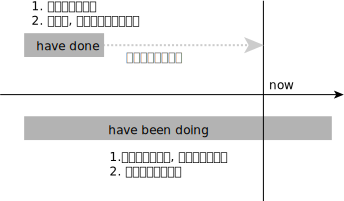
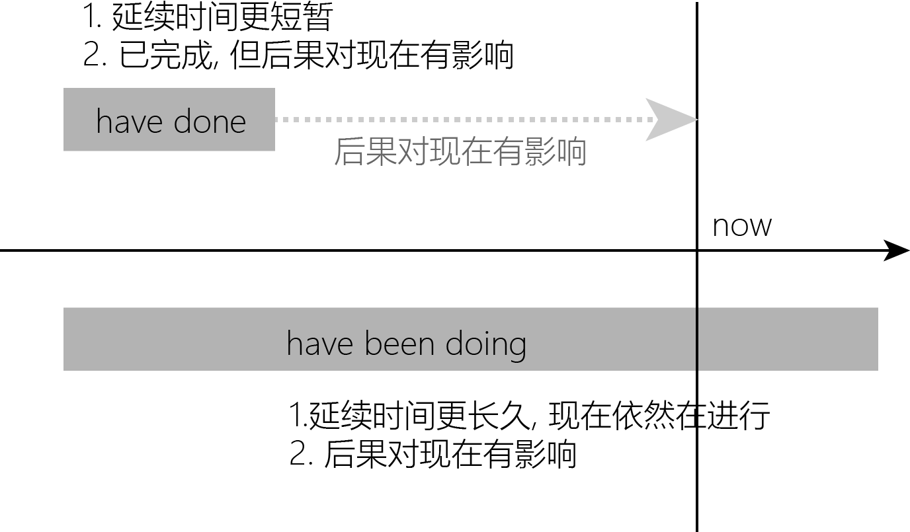

title:: ①have done 强调"动作的完成, 及其产生的后果影响", ②have been doing 强调"动作仍在进行中,延续至今"

- **have been doing 和 have done 一样, 表示“一定时间以来一直在进行的动作”。**两者的侧重区别是:
- 谈及更为“固定不变”的情况时, 用 have done.  谈及更为“暂时性行为和情况”时, 用 have been doing
  background-color:: #264c9b
	- I **haven't been working very well recently**.  <-暂时性的. 近来我一直工作得不太好。
	- He **hasn’t worked for years**. <- 更长久的. 他已多年未工作了。
	-
- have done 强调"动作的完成, 及其产生的后果影响", have been doing 强调"动作仍在进行中,延续至今".
  background-color:: #264c9b
	- **I 've painted two rooms** since lunch time. <- 表示之前延续的动作, 已经完成.  午饭后我已油漆了两个房间。
	- Sorry about the mess— **I've been painting the house**.  <- ing进行时表示“动作仍在延续进行” . 对不起，太乱了——我一直在油漆房子。
	- 'I'm trying to repair the bell,' answered Bill. '**I've been coming up here night after night for weeks now**.
	-
- 
- {:height 288, :width 481}
-
-