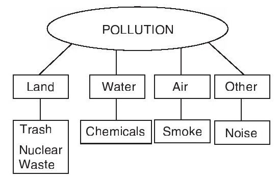
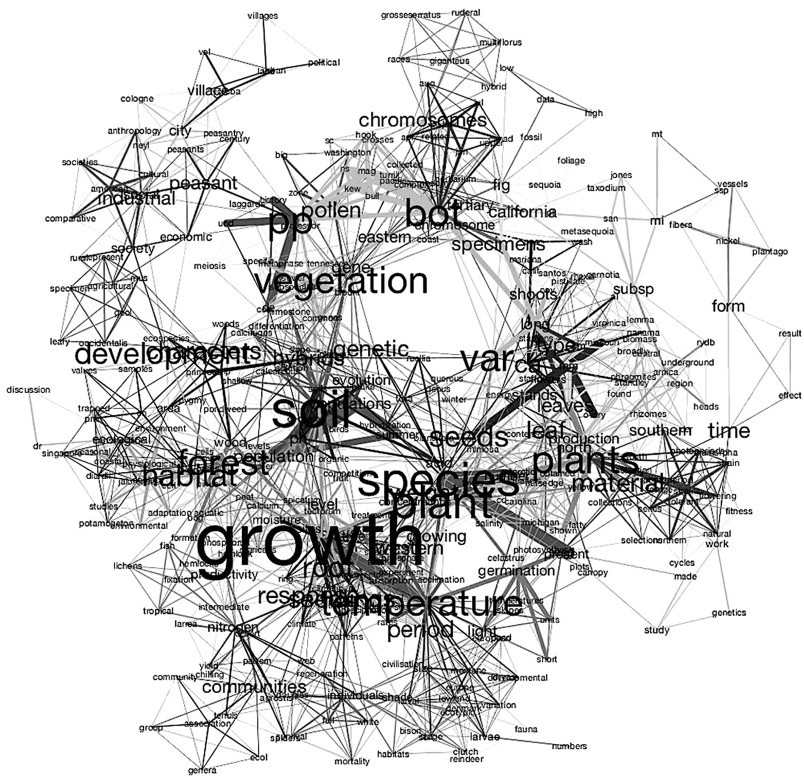
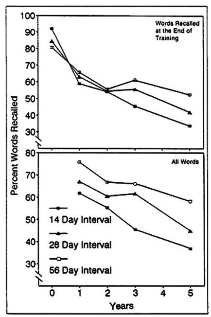
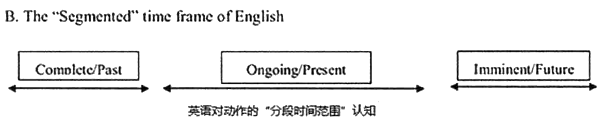
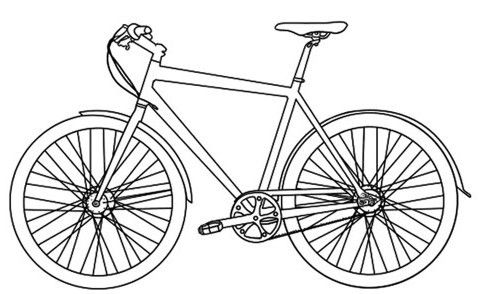

-
- ## 词汇
	- 根据省力原则，英语单词的使用频率越高，单词的含义越丰富，一词多义的现象越严重。
	- 记单词的方式: 最好的信息取出方式，决定于这些信息最初是被如何存入的。
	  background-color:: #264c9b
		- ==**你对记忆的单词能否有效地使用，决定于你最初是用什么方式把这些单词记住的。**== #important
			- 优秀的记忆，依赖于我们初次接触它时的 兴趣和注意力的强度。
		- Michael Lewis在《实用语言教学技巧》一书中，把外语词汇教学的八种最常用技巧这样按顺序列了出来：
		  collapsed:: true
			- -> 使用图片Use pictures
			  -> 使用实物Use real objects
			  -> 示范Demonstrate
			  -> 表演Mime
			  -> 定义Define
			  -> 举例Exemplify
			  -> 使用同义词Use synonyms
			  -> 翻译Translate
			-
		- 错误的记错单词方式: 用稀奇古怪的"联想记忆法"(比如谐音), 其缺点非常明显:
		  collapsed:: true
			- **引入了一大堆作为联想的"中介", 会干扰你对英语词汇的快速直接理解. 事实上, 要养成英语思维, 就是要避免依赖外语和母语之间的翻译, 及"中介"的存在!**
			- 联想记忆也很难处理大量单词, 超过上百个后, 就很难操作了. (这也是"记忆宫殿"记忆方法的局限性)
			- 可以说, 市面上出现的所有的单词联想方式, 都是早已被研究过的，各种方式的利弊也早已被做过大量的实验和研究。
			  因此从20世纪70年代开始，大家研究的热情逐渐降低，这种单词记忆方法, 就不再被广泛地建议使用了.
			-
		-
	- 下面的这些, 不要放在一起学!
	  background-color:: #264c9b
		- **对于有"多重含义"的单词的学习方式 -> 单词在哪个背景下, 就学它在该背景下的唯一那个意思.**
		  collapsed:: true
			- 很多英语单词的含义很多,  其含义, 主要由与其搭配的其他词汇和语境来决定. 这个特点, 就令脱离背景的“背单词” , 成为错误的方式.
			- ==一次只根据该单词出现时的文字背景，学习这个单词在当前使用条件下的这一个含义，而不去同时关注它的其他含义和其他解释.== #important
			- **要通过句子, 来理解单词在此语境中的特定含义, 而不是相反过来学. 单词不应该孤立地学习，要放在它出现的文字背景中去学习掌握.**
			  collapsed:: true
				- > matter这个词有几十种含义，很难同时记住如此多的含义. 但如果是通过真实的词汇组合"It doesn't matter." "What is the matter?" "in a matter of minutes" "organic matter in water" "no matter what you do..."等来学习，这些含义不但容易记忆，且对含义的理解也会非常准确到位。
			- 英语中的介词, 往往不能与汉语直接对应，或很难直接翻译. 所以介词不能简单理解其含义，而应主要靠与其搭配的单词组合, 来学习.
		- **要把动词不规则变化的每种变化形式, 都当作"独立的一个单词"来对待**，而不要反过来 -- 学了主词形式，然后推导其变化形式。
		- **长相比较接近的新单词们，不要混在一起学!**
		  collapsed:: true
			- > 比如, Germany 和 German 两个单词长得又很像，非常容易产生混淆。**解决的办法是, 两个词不在同一时间学习。**
			  最好是先学Germany“德国”，并且了解这个词的不同组合 : made in Germany, go to Germany, study in Germany等等。
			  在间隔比较长的时间之后，再引入German这个词以及它的关联用法，如 German beer, German car,  He speaks German (他会说德语), Her husband is German (她老公是德国人).
			  此时Germany这个词早已十分熟悉，混淆的可能性自然大幅度降低。
			- > **对一些含义容易混淆的词汇，单独去记忆各自的词组, 也会非常有效.** 如 pull the plug“拔（电源）插头”，pull the trigger“扣（枪的）扳机”，pull yourself together“控制你自己的情绪”，pull over“路边停车”；push the car“推车”，push the button“按电钮”，don't push your luck“见好就收（不要推运气）”，push-up“ 俯卧撑（推-起）”。
		- 新的同类词, 不要放在一起学!
		  collapsed:: true
			- 有关“星期”和“月份”的单词，应该拆开来学.
			- 推荐的方式: 将不同的星期词, 结合在它们固定使用的一些句子中，记忆效果也明显会好些。如先记英语俗语：Easy like Sunday morning. 或者顺口溜：Thank God it's Friday.（TGIF）
			- 研究发现, 只有表示"数字"的单词是例外的：one, two, three, four, five, …… 应该放在一起学习。
		- 对"同音词"和"多音词" -> 也是一次只掌握当下这一个发音的一个词.
		  collapsed:: true
			- 不要把多个同音词放在一起, 来一边比较一边来学习。反而会造成混淆.
			-
		-
	- 对于词频在5000以上的词汇, 可以先当作知识来对待(即采取"背单词"的手段), 之后再在各种文章中, 来熟悉它们.
	  background-color:: #264c9b
		- 语义联络图: 就是发现某段文字中关键单词, 与其他单词之间的有机联系. 整段文字的主题单词, 一般是被安排在示意图的最核心，然后通过箭头, 指向从核心词汇发出的分支概念词汇。
		  collapsed:: true
			- 比如, 从核心词happiness出发，分支可以是vacation, parties, friends, family等，进一步还连接到skiing, thanksgiving dinner。
			- 比如, 某段对旅客到机场乘机的流程说明文章中的关联词汇，可以通过语义联络这样连接：
				- 
				- 比如baggage和luggage两个单词, 近义, 放在一起学容易混淆。**但它们在上面的文字背景中是被事件的流程、动作或逻辑关系串联起来的，这样做, 两者之间的学习和记忆不但不互相干扰，反而相互支持**，跟把同类单词并列在一起学习或记忆的情况完全不同。
			- 很多研究认为，在所有不单纯依靠文字解释的单词教学手段中，语义联络可以算最有用的一种了（Hague,1987）。
			- 语义联络只是学习的辅助工具。当熟悉了这种形式以后，听或读外语的时候就不需要每次都认真地把词义关系图画出来了，而是在读和听的过程中，自然就会注意到词义之间的有机联系，会对有关联的词汇加以注意和回顾。**久而久之，在大脑中逐渐形成了一系列相关词汇概念的有机连接，跟语义联络非常类似。**比如pollution一词的词义连接单词局部网络如下图：
				- {:height 184, :width 295}
			- 以植物的生长概念为核心的词汇含义, 关联搭配立体网络:
				- {:height 349, :width 299}
				-
		- 所以, 单词学习是个全面的立体的"多军种协同战役"，而不是一个单词一个单词逐一攻破的游击战。
		- **抽象词汇一般需要借助其他具象词汇的解释**，但困难在于, 汉语语言中, 很难准确表达很多英语的抽象词汇.
		-
	- 被研究证实的, 好的记忆方式
	  background-color:: #264c9b
		- "单词卡片"（flash card）的学习效果，往往比"单词表"的学习效果好。
		- 实验中, 三种对记忆有支持作用的环节, 分别是：
		  collapsed:: true
		  background-color:: #787f97
			- 1.**突出。在介绍新词和新物品时，预先告诉小朋友们，下一个玩具很特殊。**（"The next toy is special."）
			- 2.重复。在引入新词的过程中，**分别用多种不同的形式，自然地令生词出现在描述中。**比如：“咱们来量一下这个koba的长度。” “Koba多长呀？”（"Let's measure this koba.How long is koba"）
			- 3.复述。**让小朋友们复述生词。**“你会说koba吗？”（"Can you say koba"）
			-
		- 记忆的时间间隔 -- "等间距时间"学习最好
		  background-color:: #793e3e
		  collapsed:: true
			- 即 : 用所谓的艾宾浩斯曲线的"前密后疏"的学习节奏，不如"等距间隔"学习效果好。
			- 等间距学习，每次的学习间隔, 是多少为好?
				- 研究发现，学习间隔长短的选择，取决于该记忆内容在学习停止多长时间后, 需要使用。这个学习停止后的记忆保持时间长短, 叫作“记忆保持期”（retention interval），简称R.I。
				- -> ==**如果R.I短，比如一天以内和小时级范围内，那么最佳学习间隔是：学习间隔≈R.I×1.0。**==
				  collapsed:: true
					- > 比如学习停止后1小时后就需要考试，那么学习间隔，就选为1个小时；
					  如果是学习停止一天以后需要考试，那用每天复习一次的节奏(Cepeda,2009）
				- -> ==**如果R.I长，比如在学习完成后, 几天以上这个时间范围, 需要使用记忆内容，那最佳间隔是：学习间隔≈R.I×0.1。**==
				  collapsed:: true
					- > 比如在最后一次学习完成30天后, 需要使用记忆内容，那间隔为每3天一复习为好（Cepeda,2009）。
					-
					-
				- 如果明天就要考试用上了，今天才开始临时抱佛脚，该怎么办？
				  collapsed:: true
					- 先用阅读和诵读等被动方式, 输入学习内容20分钟，
					  然后停止学习, 立即去进行“手眼协调”的文体活动，比如投篮、手工、画画、弹琴等10分钟，总之不能与学习相关。
					  活动完之后，立即再次投入学习，这次是用总结和背诵等主动输出的方法, 学习20分钟. 
					  然后再次停止学习, 去做文体活动10分钟，回来后再次重复前两步. 
					  如此反复进行（Paul Kelley,2005）。
				- ==**如果希望记忆保持得长久，分散学习的“间隔时间”越长越好。** -- 间隔56天==
				  collapsed:: true
					- {:height 439, :width 275}
				- ==**要重复学多少次呢? -- 至少7次**==
				  collapsed:: true
					- 这跟学习材料的难度有很大的关系。
					- 对外语单词这种难度内容的记忆，各项研究显示，**如果需要达到长期效果，那么包括首次学习在内的6次重复学习是最低限度**（Crothers and Suppes,1967），以**7次为比较理想**（Kachroo,1962）。
					- 即: 在对生词的初次学习后，以56天一个周期为间隔进行复习，共进行7次复习。
					- 但, 56天时间太长不易控制，把"学习间隔"缩短, 控制在一天以上、几天或一两周内, 这种尺度都是比较理想的。
	-
	-
	- 介词 -> 表达“方位, 空间位置关系”含义
	  background-color:: #787f97
		- 具体使用哪个介词，取决于所表达的前景F, 与背景G之间的关系。
		  collapsed:: true
			- ||F和G的空间关系|即F对应的G是|
			  |--|--|--|
			  |at|零维|一个点|
			  |on|一维|一条线|
			  |on|二维|一个平面|
			  |in|三维|一个三维容器|
		- 如, at(一个点), on(在二维的一个面上), in(在三维里面)
		  collapsed:: true
			- > 把人当作F(前景),人所处的环境当作G(背景), 则:
			  + I am **at** school.我在上学。（零维，学校表示一个概念）
			  + I am **at** the school.我在学校。（零维，学校表示位置，是一个点）
			  + I am **on** the school playground.我在学校操场上。（二维，操场是个平面）
			  + I am **in** the classroom.我在教室里。（三维，教室是个三维的容器）
			- > I am **at** the hotel.（零维，宾馆是个点，表示位置，用at）<- at是表示零维的相对空间关系，只要是想表达在宾馆这个概念而不是想具体说明在宾馆里的某个特定位置，把宾馆看作一个抽象的点。
			  I am **on** the second floor of the hotel.（二维，二楼是个平面，我在平面上，用on）
			  I am **in** the hotel.（三维，宾馆是个三维容器，我在容器里面，用in）
			- > He is **at** the hospital. <- at是表述他现在的位置在医院
			  He is **in** the hospital. <- 英语中, in the hospital 往往表示 "生病入院". 所以为了表示你只是在医院里面, 就要改用  I am **inside** the hospital.
			- Your wife is **on the line**.你老婆在线上（来电话找你）。<- 把人作为F,表示“人”在一维G"线"line上.
			- He lives **on the border of** two cities.他住在两个城市的交界处。
			- His life is **on the line**. My job is **on the line**. 说生命或工作“悬于一线”，自然是“很危险”的意思。<- 人站在线上，显然站不稳.
		- -> **G的活动性越强，以及对F的控制程度越高，越倾向于成为三维容器，用in。**
		  collapsed:: true
		  -> **F的活动性越强，受到G的控制度越低，越倾向于处在二维平面上，用on。**
			- One bird **in the hand** is worth two birds **in the bush.** 一鸟在手, 胜过二鸟在林
			- > He keeps a gun **at hand**. <- 枪在一个固定点（零维），手要用枪时必须去它所在的固定地点去拿
			  He has a lot of guns **on hand**. <- 手头
			  He has a gun **in his hand**. <- 手对枪的控制度最高，手成了三维容器，用in。手中
			- > What is **on your mind**? <- 比较倾向于头脑中刚冒出来的念头，是念头F的主动性高，头脑G的控制度低。你在想啥呢？
			  What is **in your mind**? <- 倾向于经过时间思考后的想法，是头脑G的控制力高。 你是咋想的呢？
			- > He is **on the market**. <- “他”F对“市场”G的控制度高，受到“市场”的制约少，自己主动去找且自信找到工作的机会很高。
			  He is **in the market**. <- “他”对“市场”的控制度较低，“市场”中的竞争因素等对此人制约比较大。一般来说他已经找了一段工作还没找到，或现在虽然有工作却不如意，一直在寻找更好的工作。
			- He **put** his house **on the market** last year, now the house has been **in the market** for a while.
		-
- ---
- ## 时态
	- **说话中的时态错误, 主要原因是: 说英语时, 没有养成"英语的思考方式"习惯，而是使用了"汉语的思考方式"。**
	  collapsed:: true
		- 人在说话的时候，不同的语言, 会导致人对现实世界有不同的概念化认知方式(Pinker ， 1989) .
		- **说外语, 你不是在简单地学一种新的说话形式， 而是不可避免地在使用一种新的思考方式。** #important
		- 说话时, 整个词句编码过程的自动化程度很高，并不需要思考语法结构。
		- 说不同语言的人, 在思考方式上的差异，主要体现在①对事物的概念化方式, 和②信息归类方式上。
		- 比如, 说英语的人在对动作和事件的思考中，需要对时间信息进行归类;而大部分亚洲的语言思考中, 动作并不带有时间概念信息.
		-
		- 是什么决定了在句子选择动词时, 用过去时bought ，而不是用原形buy 呢? ^^**对句中动词使用什么"时态"的决定, 是在第一步的"概念形成"中, 即在"想说什么"的阶段, 就已经明确了, 而不是等到第二步的"词句编码模块"中才去考虑的.**^^ #important
		- **也就是说，选择词汇之前，"买"的动作"发生于过去"的概念，已经被思考过并包含在"语前信息"中了。这样随后第二个模块的"语句构成器", 才会"知道"要从头脑词库中选用bought 这个单词形式. 而不是先选择单词buy ，然后再根据语法规则进行时态变位。这是个关键点.**  而这也正是中国学生常犯的错误 -- 他们在学说英语的第一个步骤"形成概念"时，使用的是汉语的思考方式， 即动作的思考中不带时间性。 #important
		-
		- **说英语的人，在概念中就已经把"过去","现在"和"将来" ，使用"间隔分段" (segmented) 的方式进行概念化思考，每个动作的发生, 都要归类于某个具体时间分段中.** 每个时间分段的跨度较小，动词发生具体时间概念较精细.
			- 
		- 研究发现，英语水平高的中国同学，在对动作时间的思考方式上发生了变化，甚至在理解汉语的时候，也出现了关注"动作发生具体时间"的思考习惯.
		- > 对比研究发现，说英语的人头脑中 is kicking 所指代的这个动作的持续, 比说汉语的人头脑中" 正在踢"所指代的时间跨度要长。英语中is kicking 是描述了"整个持续一段时间的动作过程"，而汉语的" 正在踢"，在时间概念上, 则是一个动作的"快照"，并不表达"运动的过程"。汉语中的"正在"，强调的是"当下发生"，并不具有英语"进行态"的"动作延续, 和事件发展变化过程"的概念。
		-
	- 所谓时态，是由"时" ( tense) 和"态" (aspect)两个概念组成的.
	  background-color:: #264c9b
		- 动词的"时"，描述的是动作在时间轴上发生的具体位置( Iocation) 。
		  background-color:: #787f97
		  collapsed:: true
			- 严格说, 英语只有两个"时"，即"过去时"和"非过去时".
		- 动词的"态"，是动作发生和发展的"当前装状" (shape) . "态"跟动作发生的具体时间并没有直接关系。
		  background-color:: #787f97
		  collapsed:: true
			- 英语的"态"主要有三个: "一般态"(simple) , "进行态" (progressive) 和"完成态" (perfect) 。
			  但在同一个动作中，"完成"和"进行"两个态可以同时具备，所以又分离出了一个独立的"完成进行态" (perfect progressive) ，变成了四个常用的态。
		- "4态"组合"3时"后, 就有12种时态
		  background-color:: #787f97
		  collapsed:: true
			- 
			- ||核心含义|
			  |--|--|
			  |现在时(present tense)|当前/近期的真实性 (immediate factuality) |
			  |过去时(past tense) |是行动"遥远感" (sense of remoteness) 的概念|
			  |表将来 (future tense)|对行动的"预言" (prediction) |
			  |***|***|
			  |一般态(simple aspect) |动作已经是处于"不允许继续发展的完整体"状态了(complete whole, not allowing for further development. )|
			  |进行态(progressive aspect)|行动还处于"未完成的、临时的和继续的" (incomplete, temporary and ongoing) 的状态|
			  |完成态(perfect aspect) |表明行动"是在过去发生的, 但其影响持续到此刻"，即"回顾此刻之前" (retrospectively referring to a time prior to now) 的含义|
	-
	- 对事件进行报道或描述，到底选用哪种时态，没有严格规定，完全只取决于作者的选择 --  选用不同的时态, 会给读者产生不同的阅读感受。
	  background-color:: #793e3e
	-
	- 一般态
	  background-color:: #264c9b
		- 一般态 + 现在时 (=一般现在时) : 含义为"当前/近期真实性+不允许发展变化的完整体"。即"不变的近期事实"。
		  background-color:: #497d46
			- 例
				- >  + He **works in the library**.  <- 时态含义反映出，他的这份工作是个稳定的长期取位，即"不变化的事实"。
				  + He **lives in New York**.  <- 目前的不变事实，表明他的长期固定住址, 是纽约，尽管此时此刻他本人不一定在纽约。
				  + He **speaks English**. 他会说英语。/他平时说英语。<- 不变的当前/近期事实，表示说英语是他的能力或习惯，但他此刻并不一定正在说英语。
			-
			- 用这种时态来描绘一系列动作，会给人带来很强的" 当前" 和"真实" 的感受。
			  background-color:: #793e3e
			  collapsed:: true
				- 所以, 在**体育解说**中，就使用"一般现在时"。
				  collapsed:: true
					- > 如"David **gets** the rebound, **passes** the ball **to** Johnny. Johnny **shoots** - and **misses** again . The team **is losing** momentum. "
					  -> 严格地讲，David 抢到篮板球, 并把球传给Johnny ，已经是发生过的事情了，按理是可以使用"过去时"的: David **got** the rebound and /then **passed** the ball **to** Johnny . **但如果使用"过去时"，则会让听众感觉是很久以前发生的事情， 一下子就失去了"现场"效果。**
					  -> **如果都换成"现在进行时"** David **is passing** the ball **to** Johnny ... **听众的观察点则被安置到了动作过程中，会感觉这个球还没传到队友手中。**
					  所以, 除非是**某个动作或状态, 能够持续比较长的时间，在动作"持续性"和"未完成性"的含义概念带动下，才应该使用"一般进行时态"。**
				- "现在时"带有现场感，所以在**讲笑话和写剧本**时，也会用"do /does"时态，以给人带来生动的体验感。
				- 在**学术论文**中, 为了强调这些研究所得到的"规律发现", 对当下也是成立的.  所以都会使用 "do /does"时态.
				  collapsed:: true
					- > The largest study to date, ... **finds that** those who regularly **drink coffee** -- either decaf or regular -- **have a lower risk of** overall death than nondrinkers.
					  -> 作者描述的调查研究, 显然发生在过去. 但他为了凸显这个所发现的规律, 对现在依然有效, 就使用了"现在时". 以凸显"在当前也具有真实性"意味.
				- "事件新闻报道"中, 如果描述的是过去的事, 就要用"过去时". 读者也自然会把这个事情, 当作"发生于过去的事件"来对待。然而近年来, 在小说中使用"现在时", 却多起来了. 目的依然是:
				  collapsed:: true
					- > He **opens the door** and **stands back** to let me in. **I gaze at him** once more...  
					  目的是 : 用"现在时"来描写女主角走进男主角卧室的过程，具有"身临其境感"和期待感。
					- > Now's my chance to finish him off. I **stop** midway up the horn
					  and **load** another arrow, but just as **I'm about to** let it fly, I **hear** Peeta cry out...
					  用"现在时", 来让读者感觉事情正在发生，结局还无法预知。
					-
			-
			- ==使用时态时, **最关键的要点在于 --  只要符合"现在时"时态的语意，它就能够被用于描绘其他时间状态的行动，而并不一定局限于表达"现在"发生的事情。**== 比如, 可用于表述"将来"的情况. #important
			  background-color:: #793e3e
				- 未来的行动, 如果是客观的、"既定的"行程、"固定不变的"计划，就符合了"不变的当前/近期事实"的含义，就要使用 do/does。
				  background-color:: #787f97
				  collapsed:: true
					- > + The English class **starts at 9 am tomorrow.** (课表**已经定了，不能变**)
					  + The train **leaves at 8 pm tonight**. (火车时刻表**已经定了**)
					  + **When do we** board the train? (**已经安排好了**行程)
					  + The new  movie **releases Friday** . (电影上映时间**早就计划好了**)
				- 在条件从句中(如 when, after, before, as soon as, until , if), 表达未来的行动，通常要用 do/does。
				  background-color:: #787f97
				  collapsed:: true
					- **不难发现，尽管是描述尚未发生的将来的事情，但在从句中这个的"前提条件"(计划好的), 是符合了"不变的当前/近期事实"的含义，所以要用"一般现在时"。** 而主句表达的是"愿望"，自然要用将来时. ( "一般现在"的将来，当然是"一般将来"啦)。
					- 换言之:  条件为真, 即符合"一般现在时"含义, 就可以用 do/does.
					- > I will go home /**when** the class **ends**. <- 主句 I will go home 是一般将来时，表示为愿望而不是事实。**从句 when the class ends 是一般现在时，表式"以不变的事实"作为条件.**
					- > + You will feel better **after you drink some water**.
					  + I will start c∞king **as soon as I get home.**
					  + He will finish the report **before he leaves.**
					  + The car will stop **when there is a red light.**
					  + The plane will not take off **unless** the pilot **gets a permission** from the control tower.
					  + She won't get her drivers' license **until she passes the driving test**.
					  + I will go **if you go, too.**
					  + I will **if I can**.
				- 对"决定了"且"进入准备实施状态"的未来行动，可以用 be doing.
				  background-color:: #787f97
					- > + **I'm meeting Jim** at the airport. <- 我俩已经说好了这个安排, 不见不散。
	-
	-
	- 进行态 doing
	  background-color:: #264c9b
		- 有些动作, 是瞬间完成的(如 flash , flick , clap, click), 它们的进行态, 表达的是什么意思? -- 表示"重复进行了多次", 相当于"不停地", "连续地".
		-
		- 进行态 + 现在 = 现在进行时 : 含义为"当前真实性+不完整的、允许有限发展变化的状态"。即"发展变化中的当前/近期事实"。
		  background-color:: #497d46
		  collapsed:: true
			- 例
				- He **is working** in the library. <- 时态含义反映出，他在图书馆工作的性质是发展可变的，可能是个临时工作。
				- The earth **is moving around the sun** (now) 地球正在围绕太阳转。<- 从时态含义的角度来说，这个句子不是在描述真理和自然现象，而是在讲述当前的一个正在发展过程中的行动。
				- He **is living in New York** (now). <- 是会变化的目前事实。虽然他此时住在纽约，但可能是短期行为。
				- He **is speaking English** . 他此，刻正在讲英语。<- 一个发展变化的行动。说英语是个短期行为，可能不久就会转成说其他的语言。
	-
	- 完成态 done
	  background-color:: #264c9b
		- 完成态 + 现在 = 现在完成时 : 虽然名字中带有"现在"，然而行动的时间概念, 却是发生于"过去".
		  background-color:: #497d46
		  collapsed:: true
			- He **works in the library**.  <- 时态含义反映出，他的这份工作是个稳定的长期取位，即"不变化的事实"。
			- He lives in New York.  <- 目前的不变事实，表明他的长期固定住址, 是纽约，尽管此时此刻他本人不一定在纽约。
			- He speaks English. 他会说英语。/他平时说英语。<- 不变的当前/近期事实，表示说英语是他的能力或习惯，但他此刻并不一定正在说英语。
	-
	- 过去时 done
	  background-color:: #264c9b
		- > 一次儿童绑架案, 母亲说: My children **wanted** me, they **needed** me. 使用的是动词的一般过去时needed ， wanted。而根据常理, 被绑架的孩子们应该是"现在"最需要他们的母亲。但这位母亲却使用了过去时 needed 和 wanted，其时态含义表示"孩子们现在已经无法需要她了"，暗示出她知道他们已经死了。 
		  而孩子父亲说的是"They are OK. 使用的是"一般现在时"，表现出对事件的时间思考完全不同。
	-
- ---
- ## 学英语的第一件事 -- 听力先行
	- 音标: 推荐 Adrian Underhill 设计的音标表.
	- 听单词上
	  background-color:: #264c9b
		- 研究发现, "边听边看", 比"只看不听", 要有效的多. 同时提供声音与图像, 记忆会更牢
		  background-color:: #793e3e
			- 就是在给出一个外语单词发音的同时，让学生看到这个声音所指代的物品的图像。
			- ^^**学名词(n.) -> 看清图片1秒后, 再播放声音朗读. **^^ 注意图片上不要写上单词拼写本身 #important
			- ^^**学动词(v.) -> 先播放声音朗读, 在头脑中短期声音记忆尚未消失之前, 即在1-2秒后, 再显示图片**^^. 图片上不要写上单词拼写本身. #important
			  collapsed:: true
				- 不管是成人还是儿童，**先听到某个动词(v.)，然后分析和观察当时的场景，从紧接着发生的事件中, 去猜测说话人的意图**，要比先发生这个事件, 然后再给出表示这个动作的词汇的学习效果要好得多（Baldwin,1991）。
				- 原因是: 动词需要明白动作指代概念的"时间延续性", 和概念中对象之间的"因果关系"。所以对动词的学习来说, 用视频的方式, 及真人做动作示范,  比静态的图片更有效.
				- ^^**网上的英语视频，有很多都对学习动词(v.)非常适合. 比如, 教如何做某个东西的视频: 如何做某道菜，如何修车，如何化妆等等. 里面能学会一大堆新词。视频里介绍完工具之后，就开始介绍安装程序，即一系列的动作描述。我们只需关心每句话中的核心动词, 及共同使用到的相关介词即可。**^^
					- > 如: "To begin,**apply** some plumber's putty **into** the grooves on the plate. Then **aline** the plate **over** the sink holes..." 
					  首先，在盘子的凹槽上, 涂上一些水管工用的油灰。然后把盘子对准水槽孔…
				- 解说视频一般都是先解说后做动作。哈，这又是刚好符合了我们对语言中动词学习的要求。
			- 但图片必须符合以下要求:
				- 1.指代必须明确, 不意思模棱两可
				  collapsed:: true
					- 
					- 左边的第一个图像显然指代模糊。到底是想表达骑自行车的人，
					  自行车运动，还是自行车？还是野外活动？第三张照片的指代相对来说最清楚.
					- 所以图片一定要去掉不必要的“背景”和“干扰信息”。
				- collapsed:: true
				  2. 物体本身的复杂程度, 细节不能太复杂
					- 过于精细复杂的图像, 会降低人的辨识速度、信息确认能力, 以及对图像的记忆牢固度。
					- {:height 143, :width 183}
					- 这个自行车已经简化得比较到位了。但如果再继续简化，过于抽象，反而会增加辨别的难度.
					- 简化的图片, 也不能带有其他干扰性的信息. 
					  比如，如果想表示“碗”这个单词，那么碗中的食物和勺子, 就是不应出现的东西。
					- **照片相对于白描图来说，优点是画面生动鲜明，缺点是图像的信息量过多，分散了注意力，所以还要进行一些处理, 去掉或模糊掉照片上的不必要细节，以降低眼睛接受的信息量。**
				-
		- ==**"抄写"和"一边听一边写"的记忆效果，不如"只去听"的效果好。**==
		  collapsed:: true
			- 有些同学喜欢听写外语，尽管这种做法是可以的，但一定要清楚: 这个过程中"写"的目的，只是为了通过与原文核对, 来检查自己听得是否正确，而不是通过"听写"这种操作方式来学习或增强记忆。
		-
	- 听句子上
	  background-color:: #264c9b
		- ==**英语的能力最核心体现就是“听”，“听力不好”就可以认为是英语整体不好，而并非只是一项缺陷。**== #important
		- 推荐的听力材料:
			- 美国之音
			  background-color:: #787f97
			  collapsed:: true
				- 比较理想的一个材料，是《美国之音》英语学习节目（learningenglish.voanews.com）中的特殊英语（special English），或称慢速英语。 https://learningenglish.voanews.com/
				- 《美国之音》英语学习节目, 主题涉及面之广泛，材料之丰富，质量之好，水平之高，是绝大部分商业外语教学机构都无法相比的。
				- **学单词，就是要对同一个主题反复啰嗦效果才好。最理想的学习状态，是使用多个具有同样主题内容的材料，让同样的词汇和词汇搭配以稍微不同的形式再次出现，这样会令印象更加深刻。**-- 《美国之音》英语教学中包括了科技、时事、教育、社会、人文和经济等非常丰富的各种主题版块.
			- 技能教学视频
			  background-color:: #787f97
			  collapsed:: true
				- 很多教学视频, 带有同步滚动的原文字幕. 使用中, 比较正确的做法是分三步：
				- 第一步: 先不看字幕听一遍。
				- 第二步: 边听边看字幕进行确认，找出听错或没听懂的词汇来学习。
				- 第三步: ==**不看字幕再听，能做到完全听懂后, 就可以往下进行了。<- 达到"完全听懂"的目的, 是为了以后不要常常回头来补漏洞. 所以要一次性过关, 把基础一步步打踏实, 再往前走. 步步为营.**== #important
				-
		- 通过慢速英语, 只有对句子中单词的正确读音, 非常熟悉后，并且对这些单词经常搭配使用的词汇, 也熟悉后, 才能顺利听懂正常语速, 及快速英语中的 连读和吞音.
			- 连读现象:
			  collapsed:: true
				- 任何语言 在实际说的时候，大部分的词汇都是连成一片的，中间并不带有空隙。其实on our website, o nower webs ite和onourwebsite, 听起来都是完全一样的。那我们是如何听出来, 说的是on our website这几个单词的呢？原因在于:
				- 1.我们对on, our和website这几个单词的独立发音非常熟悉
				- 2.nower和ite这两个不是有意义的单词发音, 或可能是非常罕见的单词, 出现的概率极低
				- 3.on our website这几个单词经常高频一起出现，我们很熟悉。
				- 因此在我们听起来，就感觉好像这几个单词之间有明显的边界似的，但这其实只是一种“幻觉”（illusion）。
				- 我们听到语句中的一串声音后，因为跟我们头脑中的某些声音印象相符，于是我们就在头脑中幻想出单词之间的空隙。而当你听一个完全不懂的外语时，你根本无法分辨出单词之间的空隙.
				- **所以, 熟悉独立单词的读音, 和逐步提高综合能力的最佳途径之一，就是听清晰、慢速的英语。要把每一个词汇和搭配组合, 常用句式, 听得滚瓜烂熟, 词汇句式边界记得非常清楚.**
			-
- ---
- ## 说 -- 在初期和中期阶段,  "说英语"的能力不需要去培养 -- 以免出现你一直在重复错误的英语说法, 量变成质变, 导致石化现象。
	- 在外语学习的早期不应该强调"说外语"的能力，因为"听"的能力, 会逐渐转化为"说"的能力（Bradlowet al.，1997;Rvachew,1994）。
	  background-color:: #264c9b
	  collapsed:: true
		- **要让声音在脑中反复回荡, 增强对整段声音的感觉能力与记忆力. 即, 最关键的是通过听力在头脑中留下大量声音印象.** #important
		- 大家在听到一个外语单词的声音后，不要马上出声模仿，而**要用“默想”的方式，让这个声音在“耳中”多次回响。**这种做法不但有助于培养外语内语能力，而且**能锻炼我们对外语声音的短期记忆力，**使我们能即时记忆相对较长的一串外语声音，同时能使其在大脑的声音回路（phonological loop）中保留更长的时间。语言学家早就发现，**在短期记忆的声音回路中能够保持外语声音的能力的强弱，跟最终的外语能力高低非常相关。**
		- 比如, 你以前听到过“请恕我直言”这个说法"with all due respect..."，此时想表达这个概念，就有可能**会想起这个短语的英语声音，甚至是最初听到说这句话的人的声音和语调**，内语的声音自然就能引导你说出这个句子了.
		- **母语是英语的人来说，听到两个词中的第一个词，头脑中经常就会自然冒出第二个词，或者是很快就反应出第二个词。**外语水平越高的人，对这种联系的反应速度越快，联系出来的搭配词汇数量越多。所以这种能力直接体现出一个学生外语内语能力的高低。
		-
		- 背课文, 是个非常有效的学习方式，但是否是个好的学习方式，就因人而异了。因为背诵每篇课文都会耗费很多时间，而要背很多篇才会起作用. 建议大家尽量去背诵当代名人的演讲、现代的著名短文, 或自己教材中的课文，而不要去背诵历史年代比较久远的文章。
		-
	- 错误可能被固化的现象:
	  background-color:: #264c9b
	  collapsed:: true
		- 如果作为被动知识在头脑中停留的时间不够，学生在没有真正明白这些词汇的时候, 就去使用它们, 东拼西凑地使用非常不适当的词汇来尝试表达, 做的越多, 便越会在头脑中形成错误的词汇网络. 最终量变成质变, 很容易就提前出现"石化（fossilization）现象". (就如同错误的自己瞎练羽毛球, 错误动作被固话后, 就很难纠正过来).
		- 石化现象一旦出现，语言中存在的各种错误和坏习惯，是今后任何教学和更正手段都无法纠正的（Pinker,1994）。
		-
	- 套正确句式
	  background-color:: #264c9b
	  collapsed:: true
		- 当达到了2000单词量时，==**尽量使用自己熟悉的句子形式(即牛童所说的"句式套子")、有把握的词汇和词汇组合，千万不要随意进行造句或词汇堆砌。**== #important
		- 这能避免: 1. 虽然语法正确, 但词汇用错, 句意荒谬. 2. 意思虽然老外能理解, 但不符合正宗英语的说法习惯, 听起来特别扭. 3. 歧义句.
		- **讲母语的人在说话的时候，并不是在使用语法进行开放式地重新组织词汇成为新句子，而更多的是在调用语言中, 针对某种场景的习惯表达方式, 和词汇的组合搭配。这也正是为什么讲母语的人, 说话听起来很“地道”的主要原因。反之，如果使用正确的语法规则去组合词汇，造出的句子, 几乎都是“不地道”的表述。** #important
		- **所以,是人们从日常话语中, 提炼出大致存在的规律, 是“举三百返一”. 即从大量真实输入中发现少量的可以称之为"规律"的东西. 而绝不是倒过来.  绝不能举一反三。(学语言是归纳推理，而不是演绎推理)**
		- 所以, **外语学习完全需要大量的听说、阅读和写作实践. 教师在课堂教学上只是一个向导和顾问，大量的工夫应该花在课堂之外。**
		-
		- 对一些自己在英语交流中最可能会用到的固定表达方式，以及中国同学最容易出错的地方，则更加需要提前做好准备。
		  如: **问"一个单词如何拼写?"时, 地道的句子套子是: How do you spell...**
	- 词汇块(词组, 句式)
	  background-color:: #264c9b
	  collapsed:: true
		- 头脑中数量众多的词汇块(词组, 句式)，主要是通过对交流语言, 和整段文字的大量接触, 自然获得的，并非主要来源于把这些词汇组合单独拿出来进行分析总结或背诵。
		- 对英语中词汇的“预估”和“猜测”能力差，也是造成语言理解速度慢的主要原因。
		-
	- ---
	-
	-
-
- 37
-
-