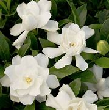
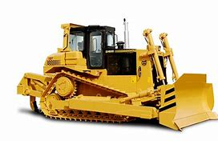
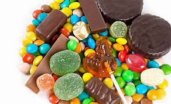
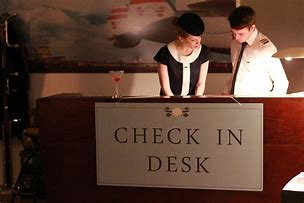
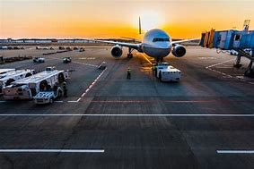
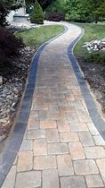
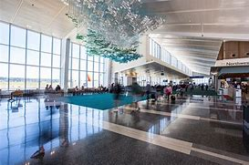
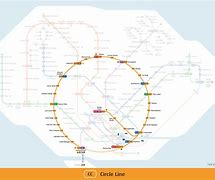

title:: LTT 01_33

- Section 1
	- News Item 1:
	  background-color:: #264c9b
		- Actress Virginia Darlington, who plays Judy in the TV ==soap opera== Texas, got married yesterday surrounded by armed bodyguards(n.) at the most luxurious hotel in Texas, the Mansion.
		- The 39-year-old star ==exchanged(v.)  vows with== plastic surgeon Henry Jones under a bough of ivy and gardenias, wearing a wedding-dress designed by Britain’s Saunders. Because this is the second time she has married a flautist(n.) marked the celebrations by playing 'Love is Wonderful ==the Second Time Around==.'
		-
		- def
		  collapsed:: true
			- ▶ soap opera :
			  id:: 62008ea2-9988-48dc-b5d2-11d0719012ae
			  ( soap ) [ CU ] a story about the lives and problems of a group of people which is broadcast every day or several times a week on television or radio 肥皂剧
			- ▶ bodyguard (受雇的)保镖，警卫（队）
			- ▶ mansion : a large impressive house 公馆；宅第
			- ▶ exchange : 
			  (v.) **~ sth (with sb)** : to give sth to sb and at the same time receive the same type of thing from them 交换；交流；掉换
			  -> to exchange ideas/news/information 交流思想；互通消息；交流信息
			- ▶ vow : (n.) （尤指宗教的）誓，誓言，誓约
			  -> to make/take a vow 立╱发誓
			- ▶ plastic surgeon  整形外科医生
			- ▶ bough /baʊ/  (n.)( formal ) ( literary ) a large branch of a tree 大树枝
			- ▶ ivy   /ˈaɪvi/ 常春藤
			  =>词源不详。可能来自PIE*wei,编织，缠绕，词源同vine,wind,weave.引申词义藤蔓，藤蔓植物。
			- ▶ gardenia  /ɡɑːrˈdiːniə/  栀子
			  collapsed:: true
				- 
				-
			- ▶  wedding-dress 婚纱
			- ▶ flautist  /ˈflɔːtɪstˌˈflaʊtɪst/ ( BrE ) ( NAmE flut·ist ) a person who plays the flute 长笛手
			  => 词源不确定。可能为拟声词或来自辅音丛bl, fl, 吹，鼓起，词源同blow, flatulent. 用来指一种木管乐器。
			- ▶ mark (v.)纪念；庆贺
			  id:: 6200992a-376f-4f7a-808d-8cc80ebcdbfb
			  -> a ceremony to mark(v.) the 50th anniversary of the end of the war 纪念战争结束50周年的庆典
			- ▶ celebration  庆典；庆祝活动
			  -> birthday/wedding celebrations 生日庆祝；结婚庆典
			-
			- 因为这是她第二次嫁给长笛演奏家，为了庆祝这场庆典，她演奏了“第二次爱是美妙的”。
			-
		-
	- News Item 2:
	  background-color:: #264c9b
	  collapsed:: true
		- The Football Association Secretary(n.) Mr. John Gamer says he’s delighted with the decision to lift(v.) the worldwide ban on English soccer clubs. As a result of serious incidents of hooliganism in European and international matches, football’s international ruling body FIFA decided(v.) last June that English teams should not be allowed to play outside Britain.
		- FIFA announced its new decision to lift the worldwide ban this morning, but the ban on European matches still stands. Now, the Football Association Secretary says it’s ==up to== the English fans to improve themselves /and if they do behave /the ban could be lifted in ==as short a time as== twelve months.
		-
		- def
			- ▶ secretary   /ˈsekrəteri/ 秘书 /部长；大臣
			  -> Secretary of the Treasury 财政部长
			- ▶ lift 
			  (v.)to remove or end restrictions 解除，撤销，停止（限制）/**~ sb/sth (up)** : to raise sb/sth or be raised to a higher position or level （被）提起，举起，抬高，吊起
			  -> to lift a ban/curfew/blockade 解除禁令╱宵禁╱封锁
			- ▶ hooliganism 
			  /ˈhuːlɪɡənɪzəm/ N-UNCOUNT Hooliganism is the behaviour and actions of hooligans. 流氓行为
			- ▶ hooligan 
			  (n.)/ˈhuːlɪɡən/ a young person who behaves in an extremely noisy and violent way in public, usually in a group （通常结伙的）阿飞，小流氓
			- ▶ match  比赛；竞赛
			- ▶ ruling (n.)~ (on sth)  裁决；裁定；判决
			- ▶ stand (v.)处于（某种状态或情形）
			  -> You never know **where you stand with her**—one minute she's friendly, the next she'll hardly speak to you. 你从来拿不准你和她的关系如何—她一会儿跟你亲热，一会儿连话也不大跟你说。
			- ▶ up to 由……决定的, 取决于
			- ▶ behave (v.)~ (yourself) 表现得体；有礼貌
			  -> Will you kids just behave! 孩子们，规矩点！
			-
			- 现在，英足总秘书表示，这取决于英国球迷如何提高自己，如果他们真的表现良好，禁令将在12个月内解除。
			-
			-
		-
	- News Item 3:
	  background-color:: #264c9b
	  collapsed:: true
		- A group of twelve women are working hard to become the first all-female crew to sail(v.) around the world. At the moment the crew are busy trying ==to raise(v.)== the three hundred and fifty thousand ==pounds== needed to buy and equip(v.) a sixty-two foot yacht to make the record attempt.
		- As part of their fund-raising /the crew have been repainting the famous boat Gipsy Moth 4, on show at Greenwich, which has raised one thousand two hundred and fifty pounds from the British Yachting Association.
		- The crew are also busy training /to get ship-shape(a.) /for their round-the-world(a.) sailing race /which starts(v.) in September. The crew skipper(n.) says /she doesn’t think ==the fact== the crew are all women ==will lessen(v.) their chances== of winning.
		-
		- def
			- ▶ crew 
			  id:: 6200a064-7fa3-4b2a-ae23-f53142b71ae9
			   /kruː/ (n.) 技术人员团队；专业团队 /（轮船、飞机等上面的）全体工作人员 /（赛船的）划船队员，划船队
			  -> an ambulance crew 救护车急救组
			- ▶ moth   蛾；飞蛾
			- ▶ shipshape
			  ADJ If something is shipshape(a.), it looks neat and in good condition. 整齐而状况良好的
			- ▶ round-the-world  adj. 环球的；环游世界的
			- ▶ skipper （运动队的）队长 /（小船或渔船的）船长
			  => 该词由skip（跳）与名词后缀-er复合难度不大，所以有“跳跃者”之义。可还有一个“船长”呢。表“船长”时，skip其实是单词ship（船）发生==h、k辅音音变==的结果，为什么它俩能音变，可以体会它们发音的相似性。heart（心）和cord（词根：心）同理。
			- ▶ lessen (v.)（使）变小，变少，减弱，减轻
			  -> to lessen the risk/impact/effect of sth 减少某事物的风险╱影响╱效果
			  => less,较小，-en,使。引申词义减轻。
			-
			- 作为筹集资金的一部分，船员们重新油漆了在格林威治展出的著名游艇吉普赛4号，这艘游艇已经从英国游艇协会筹集了1250英镑。
		-
		-
- ---
- Section 2
	- A. Eskimos.
	  background-color:: #264c9b
	  collapsed:: true
		- —Well, it’s got two big wheels ==one behind the other==, and there’s a kind of metal frame between the wheels that holds them together. And there’s a little seat above the back wheel /that you can sit on, and above the front wheel /there’s a sort of metal bar that sticks out on both sides. And you sit on the seat you see, and you put your hands on this metal bar thing —and the whole thing moves forwards —it’s amazing.
		  —What makes it move forward, then?
		  —Ah well, in the middle you see, between the two wheels, there are these other bits of metal /and you can put your feet on these /and turn them round /and that makes the wheels go round.
		  —Hang on—if it’s only got two wheels why doesn’t the whole thing ==fall over==?
		  —Well, you see, um, well I’m not sure actually …​
		-
		- def
			- ▶ Eskimo   /ˈeskɪmoʊ/ 爱斯基摩人（有些人喜欢“因纽特人”（Inuit）这个名称）
			- ▶  one behind the other 一个接一个
			- ▶ metal frame 金属框架, 金属结构
			- ▶ fall over 跌倒，摔倒；绊了一跤
			-
	- B. Shoplifting.
	  background-color:: #264c9b
	  collapsed:: true
		- Speaker A: Well, to be honest, I’m not sure what I would have done. I mean, it would have ==depended on== various things.
		- Interviewer: On what, for instance?
		- Speaker A: Well, on …​ hmm …​ ==on== how valuable /the things the boys stole were. The text doesn’t …​ it doesn’t say whether they had just stolen a tin of peas or something like that. So, I can’t really say …​ except well, …​ I think I would have told the shopkeeper if they had stolen something really valuable. Otherwise, I suppose I would have just …​ I don’t know …​minded my own business, I suppose.
		- Speaker B: Well, I think it’s quite clear what I should have done. The boys had broken the law. You can’t allow that sort of thing to go on, can you? After all, it affects all of us. If you let boys or anybody else get away with theft(n.), they’ll just go on stealing! So, I think the woman should have told—what’s his name? —the shopkeeper.
		- Interviewer: Mr. Patel.
		- Speaker B: Patel. She should have told him and if necessary she should have held the boys while he got the police, or she should have gone for the police herself.
		- Interviewer: So you’re saying that that’s what you would have done?
		- Speaker B: Exactly. If I had been in that situation, that’s exactly what I would have done.
		  At least …​ at least, that’s what I ought to have done. That’s what I hope I would have done.
		-
		- def
			- ▶ Shoplifting 入店行窃, 冒充顾客在商店行窃（罪）
			- ▶ suppose (v.)（根据所知）认为，推断，料想
			  -> Prices will go up, I suppose . 我觉得物价将会上涨。
			- ▶ theft (n.) ~ (of sth)  偷；偷窃；盗窃罪
			- ▶ hold (v.)to keep sb and not allow them to leave 监禁；拘留
			  -> Police are holding two men ==in connection with== last Thursday's bank raid. 警方拘留了两名与上星期四的银行抢劫案有关的男子。
			-
			-
	- C. Frogs.
	  background-color:: #264c9b
	  collapsed:: true
		- Fred: A funny thing happened to me the other night.
		  Man: Oh, yes? What happened, Fred?
		- Fred: Well, you know I usually go out for a walk every night just after dark. Well, I was out the other night taking my usual walk /and I heard a funny noise coming out of the ==building site== down the road, you know, the one where they dug a big hole lately. ==Going to== make it into an underground garage, I believe.
		  Man: Yes, I know it, go on.
		- Fred: Well, as I said, I heard(v.) this funny noise /and I thought perhaps there was a kid down there, you know how kids go playing on building sites. But as I got nearer /I could tell it wasn’t a kid, it sounded more like an animal. I thought it must be some dog or cat that had got itself trapped or something.
		  Man: So, what did you do?
		- Fred: Well, I went down there to investigate. I climbed down, ruined(v.) my trousers because of all the mud. You see it had been raining heavily for three or four days.
		  Man: Yeah.
		- Fred: Well, when I got down there /I found the hole was full of water and the water was full of frogs.
		  Man: Frogs?
		- Fred: Yes. You know, those green things that jump up and down /and go croak croak. So I thought 'What are they going to do when the bulldozers(n.) come to work tomorrow?' So I climbed back out, went home and got some plastic bags, big ones, like you use for the rubbish.
		  Man: What for?
		- Fred: I’ll tell you. I went back and started collecting the frogs and putting them into the plastic bags. I thought I’d take them to the pond in the park. They’d be happy there.
		  Man: I suppose they would.
		- Fred: Next thing I know there are sirens(n.) screaming /and bright lights everywhere.
		  Man: What was going on then?
		- Fred: It was the police. Two cars full of police with flashlights(n.) and dogs. Somebody had reported seeing me going into the building site /and thought I was a burglar.
		  Man: Well, what happened?
		- Fred: They put me in one of the cars and took me down to the Station.
		  Man: Why didn’t you tell them what you were doing?
		- Fred: I tried to in the car, but they just told me I would have to talk to the inspector on duty. Luckily I still had one of the bags on me full of frogs. A couple of them got out /while the inspector was questioning me /and you can imagine what it was like /trying to catch them.
		  Man: So what happened in the end?
		- Fred: Oh, the inspector ==turned out to be== a bit of an animal lover himself /and he sent the two cars back to the building site /and told his men to help me collect all the frogs. We did that /and then they drove(v.) me home /and I invited them all in for a cup of tea /and we all had a good laugh.
		  Man: Well, I never. If you wrote that in a book /they’d say you ==made it up==.
		-
		- def
			- ▶ after dark adv. 天黑后；黄昏以后
			- ▶ building site
			  ( especially BrE ) ( NAmE usually ==conˈstruction site== ) an area of land where sth is being built 建筑工地
			- ▶ lately (ad.) recently; in the recent past 最近；新近；近来；不久前
			  -> Have you seen her lately? 你最近见过她吗？
			- ▶ be going to do：打算做某事
			- ▶ ruin (v.)毁坏；破坏；糟蹋
			- ▶ croak (v.)发出（像青蛙的）低沉沙哑声；呱呱地叫
			- ▶ bulldozer 推土机
			  collapsed:: true
			  => bulldoze原本指的是足以放到一头公牛（bull）的剂量（doze），比喻采用鞭打、枪杀等野蛮手段来阻止黑人参加选举的行为. 推土机出现后，人们用bulldozer一词来称呼它，因为推土机威力巨大，可以野蛮地推倒一切障碍，特别适合暴力拆迁等场合。
				- 
			- ▶ What for 为了什么, 为何目的
			- ▶ siren (n.)汽笛；警报器 /塞壬（古希腊神话中半人半鸟或半人半鱼的女海妖，以美妙歌声诱使航海者驶向礁石或进入危险水域）
			- ▶ flashlight 手电筒
			- ▶ burglar 破门盗贼；入室窃贼
			- ▶ inspector :
			  (abbr. Insp ) an officer of middle rank in the police force （警察）巡官 /a person whose job is to visit schools, factories, etc. ==to check that rules are being obeyed== and that standards are acceptable 检查员；视察员；巡视员
			- ▶ make sth up 编造（故事、谎言等） /拼装；组成 / to form sth 形成；构成
			  id:: 6200bc07-08e0-4d75-aec8-9312ce773f67
			  -> Women make up 56% of the student numbers. 女生占学生人数的56%。
			-
	- D. Newspaper Editors.
	  background-color:: #264c9b
	  collapsed:: true
		- A newspaper has a complex hierarchy(n.). The easiest way to show this is in the form of a chart.
		- At the top of the chart there are four major positions.
			- 1. These are ==the Executive Editor==, who talks to the unions /and deals with legal and financial questions.
			- 2. 3. Then there is ==the actual Editor== of the paper /and his deputy.
				- The Editor makes decisions about what goes into the paper.
				- The deputy has close contact with ==the House of Commons== and the political content.
			- 4. Finally there is ==the Managing Editor==, who sees that everything runs smoothly.
		- Below this there are three ==Assistant Editors== and the heads of the five departments.
			- 1. Each of the three Assistant Editors has a different responsibility. For example, one is responsible for design.
			- 2.The five departments are ==City News==, which deals with financial matters, then the Home(a.), Foreign, Sports and Features(n.).
				- Features are the special sections including films, books and the Woman’s page.
			- So ==on the second level== there are three ==Assistant Editors== and the five ==Department Heads==.
			- Also on this level is ==the Night Editor==. He looks after the paper, especially the front page, in the afternoon and evening, preparing material(n.) for publication the next morning.
		- Below the second level /there are the reporters and specialists(n.), who write the reports and articles, and the sub-editors, who check and prepare(v.) the copy for the printer. There is also full ==secretarial back-up==.
		-
		- def
			- ▶ hierarchy  /ˈhaɪərɑːrki/ 等级制度（尤指社会或组织）/层次体系
			- ▶ position 处境；地位；状况
			- ▶ executive 
			  (n.)[ C ] a person ==who has an important job as a manager== of a company or an organization （公司或机构的）经理，主管领导，管理人员
			- ▶ union 工会
			- ▶ deputy 副手；副职；代理
			- ▶ ==contact (n.)(v.) ~ (with sb) |~ (between A and B)== :  the act of communicating with sb, especially regularly （尤指经常的）联系，联络
			  id:: 6200cb7e-28da-468b-a474-956f22cafdfd
			- ▶ House of Commons （英国）下议院；（加拿大）众议院
			- ▶ common /ˈkɑːmən/ 常见的；通常的；普遍的 /普通的；平常的；寻常的；平凡的
			  -> Breast cancer is ==the most common(a.) form of cancer== among women in this country. 乳腺癌是这个国家妇女中最常见的一种癌症。
			- ▶ City News 社会新闻, 都市报
			- ▶ home 本国的；国内的
			- ▶ feature 
			  (n.) ==~ (on sb/sth)==(in newspapers, on television, etc.) a special article or programme about sb/sth （报章、电视等的）特写，专题节目
			- ▶ Night Editor 夜班编辑
			- ▶ material 
			  (n.)a substance that things can be made from 材料；原料 /素材；用以创作的材料（或构想）
			- ▶ specialist 专家 /专科医生
			- ▶ sub-editor 
			  N-COUNT A sub-editor is a person ==whose job it is to check and correct articles== in newspapers or magazines before they are printed. 助理编辑
			- ▶ copy （书、报纸等的）一本，一册，一份
			  -> a copy of ‘The Times’ 一份《泰晤士报》
			- ▶ secretarial adj. 秘书的，有关秘书工作的
			- ▶ back-up n. 援助，帮助；后备人员
			-
			-
			-
			-
			-
			-
			-
			-
			-
			-
			-
			-
			-
			-
			-
			-
- ---
- Section 3
	- A. A Tour of the Airport.
	  background-color:: #264c9b
		- This lift(n.) is taking us to departures on the first floor.
		- We are now in departures. ==Arrivals and departures== are carefully separated, as you have seen. Just to the left here we find a 24-hour banking service, and one of three skyshops on this floor—there are two in the ==departure lounge==. And here, as you can see, you can buy newspapers, magazines, confectionery(n.), souvenirs(n.) and books. If you will turn around now and look in front of you, you can see the seventy-two ==check-in desks==, sixty-four of which are for ==British Airways==. The airline desks, for enquiries(n.), are next to the entrances on the far left and far right, and straight ahead is the entrance to ==the departure lounge== and ==passport control==. Shall we go airside?
		-
		- def
		  collapsed:: true
			- ▶ tour : 
			  (n.)  ==~ (of/round/around sth)== a journey made for pleasure during which several different towns, countries, etc. are visited 旅行；旅游
			- ▶ lift 电梯；升降机
			- ▶ departure 
			  (n.)a plane, train, etc. leaving a place at a particular time （在特定时间）离开的飞机（或火车等）
			  -> the departure lounge/time/gate 候机（或车）室；离站时间；登机（或上车）口
				- ▶ lounge :  /laʊndʒ/  a room for waiting in at an airport, etc. （机场等的）等候室
				  => 可能来自法语allonger,逗留，停留，来自al-,向，long,长的，长时间的。引申词义停留，逗留，休息。用于指休息厅，候机厅，酒吧等。
			- ▶ departure lounge 候机室, 候机厅, 候机楼
			- ▶ confectionery  /kənˈfekʃəneri/ [ U ] sweets/candy, chocolate, etc. 甜食（糖果、巧克力等）
			  collapsed:: true
				- 
			- ▶ souvenir  
			  /ˌsuːvəˈnɪr; ˈsuːvənɪr/ a thing that you buy and/or keep to remind yourself of a place, an occasion or a holiday/vacation; something that you bring back for other people when you have been on holiday/vacation 纪念物；纪念品；（度假时买回来送人的）礼物
			  => 来自 sub-,向上，venire,来到，词源同 advent,venue.后动词作名词使用，引申词义纪念物，纪 念品。
			- ▶  check-in (n.)（机场的）登机手续办理处
			  collapsed:: true
			  -> the check-in desk 办理登机手续的服务台
				- 
				-
			- ▶ Airway  （飞机的）固定航线 /( medical 医 ) the passage from the nose and throat to the lungs, through which you breathe 气道
			- ▶ inquiry  (n.)询问；打听 / (官方的) 调查 
			   inquire (v.) ~ (about sb/sth)
			- ▶  passport control 护照检查处；入境检验；验护照
			- ▶ airside  :
			  collapsed:: true
			  N the part of an airport nearest the aircraft, the boundary of which is the security check, customs, passport control, etc 机场周边活动区 /n. 机场空侧（专供机场和航空公司工作人员通行）；登机区（通过安全检查、护照检验等后进入的机场）；机场周边活动区
				- 
				-
			-
			- 我们现在就在飞机起飞处。正如你所看到的，到达和离开是被仔细分开的。就在左手边，我们会发现这里有24小时无休的银行服务，这一层有三家skyshop店中一家. 另两家在离境休息处。在这里，如你所见，你可以买到报纸、杂志、糖果、纪念品和书籍。如果你现在转过身来看看前面，会看到72个登机柜台，其中64个是英国航空公司的。航空公司的服务台, 就在最左边和最右边的入口旁边，直走就是离境休息室和护照检查处的入口。我们去登机场好吗？
		-
		- We have now cleared(v.) passport control and security, and you can see that security is very tight indeed. You are about to enter a ==departure lounge== which is a quarter of a mile in length. But don’t worry. There are ==moving walkways== the length of the building, so you don’t have to put on your hiking boots.
		-
		- def
		  collapsed:: true
			- ▶ clear 
			  (v.)to give official permission for a person, a ship, a plane or goods to leave or enter a place 批准（人、船只、飞机、货物等）离境（或入境）；使通过（海关）
			  -> The plane ==had been cleared for take-off==. 飞机已得到起飞许可。
			- ▶ security 保护措施；安全工作
			- ▶ tight (a.)very strict and firm 严密的；严格的；严厉的
			- ▶ walkway （常为户外高出地面的）人行通道，走道
			  collapsed:: true
				- 
			- ▶ moving walkway  电动步道;自动扶梯及活动走道
			- ▶ hiking (n.)[ U ] the activity of going for long walks in the country for pleasure 远足；徒步旅行
		-
		- ==Straight ahead of you== is a painting by Brendan Neiland. As you can see it is a painting of Terminal(n.) 4 and it measures twenty feet by eight feet. On the other side of it are the airline information desks. Let’s walk around to those. Now, if you face the windows you can see the duty-free shops. There is one on your left and one on your right. They have been decorated to a very high standard, to make you feel like you are shopping in London’s most exclusive shops. The duty-free shops sell the usual things but they also have outlets for fine wines and quality cigars.
		-
		- def
		  collapsed:: true
			- ▶ painting 绘画；油画
			- ▶ terminal :
			  (n.)a building or set of buildings at an airport ==where air passengers arrive and leave== 航空站；航空终点站 /(a.)(疾病)晚期的；不治的；致命的
			- ▶ outlet :
			  (n.)( business 商 ) a shop/store or an organization that sells goods ==made by a particular company or of a particular type== 专营店；经销店 /出口；排放管
			-
			- ▶ 正对着你的是...
		-
		- If we turn to the right /and ==walk along== in front of the duty-free shops, we will come to a buffet(n.) and bar opposite. You see, this one is called the Fourth Man Inn—all the bars, restaurants and cafeterias have names including the number four and many of them have jokey(a.) signboards like this one, to ==brighten(v.) up== a traveller’s day.
		-
		- def
		  collapsed:: true
			- ▶ walk along 向前走；沿着……走
			- ▶ buffet :
			  id:: 6201c1ce-34c1-4d27-9919-fa65cc1489c7
			  /bəˈfeɪ/ 自助餐 /a place, for example in a train or bus station, where you can buy food and drinks to eat or drink there, or to take away （火车）饮食柜台；（车站）快餐部
			  => 来自法语bufet, 桌子，橱柜。后指餐厅自助餐。
			- ▶ opposite (a.)对面的；另一边的
			- ▶ Inn : 
			  （通常指乡村的，常可夜宿的）小酒店 /（通常指乡村的）小旅馆，客栈 /（用于客栈、旅馆和饭店的名称中）
			  => 来自in,里面，入内。引申词义小酒店，客栈。
			  -> Holiday Inn 假日饭店
			- ▶ cafeteria : /ˌkæfəˈtɪriə/ 自助餐厅；自助食堂
			  => 词源同coffee. -teria, 地名后缀。原指兼卖咖啡的小餐馆。
			- ▶ jokey (a.)( joky ) ( informal ) amusing; making people laugh 逗乐的；可笑的；滑稽的
			  id:: 6201c289-b765-427e-9e39-1e83abd085d3
			- ▶ signboard :
			  a piece of wood that has some information on it, such as a name, and is displayed outside a shop/store, hotel, etc. （商店、旅馆等的）招牌，告示牌，广告牌
			- ▶ ==brighten (v.)~ (sth) (up)== : to become or make sth become more pleasant or enjoyable; to bring hope （使）增添乐趣，有希望 /（使）更明亮，色彩鲜艳 /(天气)放晴
			-
		-
		- If we turn left out of here /and go back along the concourse, we come to the ==plan-ahead insurance== desk, on the far side of the first duty-free shop, with public telephones alongside. Notice that here we can see what is ==going on== outside, through the windows. Opposite the insurance desk, next to the other duty-free shop, is the international telephone bureau. Let’s just go across there. ==Across from== this duty-free shop is an area just like the one we have just seen, with a buffet, bar and skyshops, and now let’s go along the ==moving walkway== to the gates, shall we?
		-
		- def
		  collapsed:: true
			- ▶ If we turn left out of here 如果我们左转离开这里
			  collapsed:: true
				- 
			- ▶ concourse :  /ˈkɑːnkɔːrs/  a large, open part of a public building, especially an airport or a train station （尤指机场或火车站的）大厅，广场
			  => con-, 强调。-course, 跑，跑道。即跑到一起，聚集到一起的地方。
			- ▶ plan-ahead 事先计划和准备; 事先筹备
			- ▶ insurance  保险
			- ▶ we can see what is ==going on== outside, through the windows. 在这里，我们可以通过窗户, 看到外面正在发生的事情。
			- ▶ bureau :
			  ˈbjʊroʊ/ （提供某方面信息的）办事处，办公室，机构 /（美国政府部门）局，处，科 /附抽屉及活动写字台的）书桌
			  -> an employment bureau 职业介绍所
			- ▶ across : from one side to the other side 从一边到另一边；横过；宽
			- ▶ ==across from== : opposite 在对面；在对过
			  -> There's a school just ==across from== our house. 有一所学校就在我们房子对面。
			- ((6201c1ce-34c1-4d27-9919-fa65cc1489c7))
			-
		-
	- B. Lost Handbag.
	  background-color:: #264c9b
		- Mary Jones: Excuse me. Excuse me.
		  Man: Yes, madam?
		- Mary Jones: Can you help me. Please, look, I’m desperate(a.). Are you responsible for lost property?
		  Man: Yes, I am.
		- Mary Jones: Well, I’ve got something to report.
		  Man: What is it you’ve lost?
		- Mary Jones: I’ve lost my handbag.
		  Man: Your handbag?
		- Mary Jones: Well, it’s terrible. I don’t know what to do.
		  Man: Where did you lose your handbag, madam?
		- Mary Jones: On the train, on the train. Look, we’ve got to stop the train.
		  Man: Which train?
		- Mary Jones: I’ve just ==come off== the tube, this last train, in from Paddington.
		  Man: Yes, the last train tonight. There isn’t another one.
		- Mary Jones: On the ==circle line==, on the circle line.
		  Man: Yes, yes.
		- Mary Jones: Oh, it’s terrible. We haven’t got much time, I mean I have got so many valuable things in that bag.
		  Man: Will you …​ will you please explain …​
		- Mary Jones: I was asleep on the train. I must have ==dropped off==. I woke up, almost missed my station, so I rushed off the train and then I realized my handbag was still on it.
		  Man: Yes?
		- Mary Jones: By that time the doors were shut and it was too late.
		  Man: So your handbag is still on the train. Mary Jones; It’s on the train travelling …​
		  Man: Yes. All right. All right, ==just a moment==. Now, can I have your name and address?
		- Mary Jones: Well, look /the thing I’ve got to tell you is that there’s money in that handbag.
		  Man: Yes, we realize this, madam. We need your name and address first.
		- Mary Jones: OK. My name’s Mary Jones.
		  Man: Mary Jones. Address?
		- Mary Jones: 16 …​
		  Man: 16 …​
		- Mary Jones: Craven Road.
		  Man: Craven Road. That’s C-R-A-V-E-N?
		- Mary Jones: Yes.
		  Man: Now, can you tell me exactly what was in the handbag?
		- Mary Jones: Well, there was money …​
		  Man: How much?
		- Mary Jones: Nearly thirty pounds. I had my ==driving licence== …​
		  Man: So, thirty pounds, driving licence, yes …​
		- Mary Jones: I had my keys, and I had the office keys, they’ll kill me when I go to work tomorrow, and I’d just been to the ==travel agent==, I had my ticket to Athens …​
		  Man: Just …​ ==just one moment==. House and office keys, ticket to Athens.
		- Mary Jones: Yes, hurry please. You’ve got to phone(v.) the next station…​
		  Man: Yes, all right, just a moment. Anything else?
		- Mary Jones: I had my ==season ticket==.
		  Man: Your season ticket for travelling on the tube.
		- Mary Jones: And a very expensive ==bottle of perfume==, and …​ and …​ and I had a …​
		  Man: Yes, well, I’ll get the guard to look in …​ the train …​
		-
		- def
		  collapsed:: true
			- ▶ desperate /ˈdespərət/  (a.)（因绝望而）不惜冒险的，不顾一切的，拼命的
			- ▶ come ˈoff (sth):
			  to fall from sth 从…掉下（或落下） /to become separated from sth 与…分离（或分开）
			  -> to come off your bicycle/horse 从自行车╱马上跌下
			  -> A button had ==come off== my coat. 我的外套掉了一颗纽扣。
			- ▶ the tube : [ sing. ] ( BrE )  伦敦地下铁道
			- ▶ Yes, the last train tonight. There isn’t another one. 是的，今晚的最后一班火车。没有其他的了。
			- ▶  circle line 环线, 地铁环线
			  collapsed:: true
				- 
			- ▶ ==drop ˈoff== : 打盹儿；小睡
			- ▶ travelling : (a.) going from place to place 旅行的；巡回的；流动的
			  -> ==travelling people== (= people who have no fixed home, especially those living in a community that moves from place to place, also known as ‘travellers’) 不断迁移的人
			- ▶ moment 片刻；瞬间
			  -> ==just a moment== 等一会儿，稍等一下
			- ▶ look  （常为不悦时唤起他人注意）喂，听我说
			  -> Look, that's not fair. 注意，那样不公平。
			- ▶ craven  /ˈkreɪvn/ ( formal disapproving ) lacking courage 胆小的；胆怯的；怯懦的
			  => 词源不详。可能来自词根crep, 破碎，劈里叭啦，词源同decrepit, discrepancy. 原指被打败的，后指被打怕的，因而胆小的。
			- ▶ travel agent : 
			  a person or business whose job is to make arrangements for people wanting to travel, for example buying tickets or arranging hotel rooms 旅行代办人；旅行代理商
			- ▶ Athens  /ˈæθənz/ 雅典（希腊首都）
			- ▶ ==Wait Just One Moment Please== 请等一会儿
			- ▶ Yes, hurry please. You’ve got to phone(v.) the next station… 是的，请快点。你得给下一站打个电话…。
			- ▶ season ticket :
			  a ticket that you can use many times within a particular period, for example on a regular train or bus journey, or for a series of games, and that costs less than paying separately each time 长期票（如火车通勤票、汽车月票、体育比赛套票等）
			  -> an annual/a monthly/a weekly ==season ticket== 年票；月票；周票
			- ▶ perfume 香水
			-
-
-