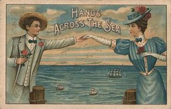

- 学习方法: 这里的笔记, 不是用来给你只看这个的, 不然又变成错误的像学数理化一样的方法了. 英语是用来日常实践的, 必须多听多看原版的东西. 而不是拿本笔记枯燥的记. 这里的笔记只是用来给你像字典一样查的. 所以不要本末倒置.
  background-color:: #533e7d
-
- 说明, 阐释
  background-color:: #793e3e
	- (what) X is all about : 关于X是...一回事
	- **表示"几乎和...一样", “实际上等于” -> 用 as good as.** 注意: 这里的good 不是"好"的意思, 而是"等同于"的意思.
	  collapsed:: true
		- We are **as good as ruined**. 我们差不多完蛋了。
		- This old bike is **as good as useless**. 这辆旧自行车实际就等于废物一件。
-
- 意愿
  background-color:: #793e3e
	- 表示“习惯于”, 用: **==get== used to(prep.) + n., get accustomed to <- get强调==渐近的"动态过程"==**
	  collapsed:: true
	  **==be== used to, be accustomed to <- be强调习惯了的"==状态=="**
		- **We'll get used to(prep.) that**, Bill. 大家慢慢就习惯了，比尔
		-
	- 表示“不屑做某事”, 用 above + -ing
	  collapsed:: true
		- **He is not above** invent**ing** relatives.  他甚至会捏造出一些假亲戚来。
-
- 行为, 行动
  background-color:: #793e3e
	- 表达"使某事物完成"的意思 -> 用 have sth. done 使役式
	  collapsed:: true
		- I'**ve** just **had my car repaired**. 我的汽车刚修好。
		- he has never managed to get enough money **to have the church clock repaired**.
	- 表示”让某人做某事”或”使某人处于某种境地” -> 用 have sb. doing/done
	  collapsed:: true
		- **He had me utterly confused**. 他把我全搞糊涂了。
		- **John had me looking for that book** all day. 约翰让我找那本书找了一整天。
		-
	- 某人对... 作了一次又一次的原因探寻 -> ... bring **one inquiry after another** into ... (把一个有一个的疑问探寻, 带入...领域中)
	  collapsed:: true
		- The mid-1980s **brought one inquiry 询问;查询 after another** into the causes of America’s industrial decline. 80年代中期，人们对美国工业衰退的成因，作了一次又一次的探寻。
		-
	- 充满了对...的警告 -> ... is filled with warnings about...
	  collapsed:: true
		- Their sometimes sensational轰动性的，引起哗然的 findings **were filled with warnings about** the growing competition from overseas. 在美国人那些有时耸人听闻的发现中，充满着对其他国家日益增长的经济竞争的警告之词。
		-
		-
		-
	-
-
- 趋势, 命运, 结果, 后果
  background-color:: #793e3e
	- ... 是不可避免的 -> It is inevitable that ...
	  collapsed:: true
		- > ▶  inevitable : cannot avoid or prevent
		- **It was inevitable that** this primacy should have narrowed /as other countries grew richer. 随着其他国家日益强盛，美国的这一优势地位逐渐下降, 是不可避免的。
			- > ▶ primacy : (n.) the fact of **being the most important person or thing** 首要；至高无上
			  → a belief in **the primacy of the family** 家庭至上论
		-
	- ... 处境艰难 -> ... is on the ropes.
	  collapsed:: true
		- > ▶ on the ropes : ( informal ) very close to being defeated 濒于失败；即将失败 (rope:拳击或摔跤场四周的围绳，圈绳)
		  **on the rope** 和 **on the ropes**，这两个短语表示的意思全然不同。
		  → on the rope 指登山运动员或爬山者，用一条绳索把几个人互相连在一起;
		  → on the ropes 在美国俚语里的引申含义为:无计可施、毫无办法、处于困境、四面楚歌、快要垮台、就要完蛋等。上述含义均源自 拳击比赛,即拳击擂台四面用绳围起,弱者常常被对手打得摇摇晃晃,靠在围绳上无力还击,节节败退。 这种被动挨打的局面在英语里就叫作 on the ropes。
		- Foreign-made 外国制造的 cars and textiles 纺织品，纺织业 were sweeping 横扫；拂去;掸去 into the domestic(=inside a particular country) market 国内市场. America’s machine-tool 机床 industry was on the ropes 拳击台上；处境艰难;即将放弃.
		-
	- 看起来 xxx 似乎是下一个受害者 ->  it looked as though /sb. is going to be the next casualty.
	  collapsed:: true
		- > ▶ casualty  /ˈkæʒuəlti/  =a person who is killed or injured in war or in an accident 受害者
		- For a while /**it looked as though** the making of semiconductors 半导体, which America had invented /and which sat at the heart of the new computer age, **was going to be the next casualty**.
		-
	- 所有这一切导致了... All of this caused(v.)...
	  collapsed:: true
		- > ▶ cause (v.) to make sth happen 引起；导致
		- **All of this caused** a crisis of confidence. 所有这一切导致了信任危机。
		-
		-
	- 把... 视为理所当然 -> take something for granted
	  collapsed:: true
		- > (1)PHRASE If you **take something for granted**, you believe that it is true or accept it as normal without thinking about it. 视某事为理所当然
		  (2) PHRASE If you **take it for granted** that something is the case, you believe that it is true or you accept it as normal without thinking about it. 理所当然地认为
		- Americans stopped **taking prosperity for granted**. 美国不再视繁荣的保持 为理所当然之事。
		-
		-
	- ... 已经被...  所取代 -> ... has yielded to ...
	  collapsed:: true
		- Self-doubt **has yielded 屈从;让步；为…所取代 to** blind pride. 对自身的怀疑已被盲目乐观所取代
		-
-
- 逻辑, 因果
  background-color:: #793e3e
	- 把... 仅仅归因于... ->  ... attribute(v.) ... solely(ad.) to ...
	  collapsed:: true
		- Few Americans **attribute this solely只;仅仅;完全 to** /**such** obvious causes (常指坏事的)原因，诱因 **as**  a devalued 贬值 dollar /or the turning of the business cycle 商业周期.
		  没几个美国人将这一巨变，单纯归因于诸如美元贬值，或商业周期循环这些显而易见的原因。
		-
-
- 情感, 情绪, 感受
  background-color:: #793e3e
	- ... 证明是痛苦的 ->  sth proved painful.
	  collapsed:: true
		- Just as inevitably, the retreat from predominance **proved(v.) painful**.
	- 情况的变化真快！ -> How things have changed !
	-
-
- 比较
  background-color:: #793e3e
	- a 比 b 更繁荣兴旺 -> sth is prosperous  beyond ...
	  collapsed:: true
		- America and Americans **were prosperous beyond** the dreams of the Europeans and Asians /whose economies the war had destroyed. 美国的成功, 比欧亚所梦想的更成功, 后者的经济已遭到战争破坏.
		-
		-
-
- 利害关系
  background-color:: #793e3e
	- ... 可能成为一种不利因素 ->  sth can be a dreadful handicap
	  collapsed:: true
		- > ▶ dreadful : (a.) very bad or unpleasant
		  → **It’s dreadful** the way they treat their staff. 他们对待雇员的方式糟糕透了
		- id:: 621865f7-3627-4f43-8571-b0ee28e5bcb0
		  > ▶ handicap : (n.) ( becoming old-fashionedsometimes offensive ) a permanent physical or mental condition that makes it difficult or impossible to use a particular part of your body or mind 生理缺陷；弱智；残疾
		  (n.) something that makes it difficult for sb to do sth 障碍；阻碍
		  = handicap 来自hand in cap，指的是赌博或比赛时, 为了实现公平性而进行的各种调整和设置。除了设置赔率外，最常用的方式是给优势方设置障碍或不利条件，如在赛马比赛中，给优势赛马增加负重。因此，handicap还可以表示“障碍、不利条件”。
		- A history of long and effortless  success **can be a dreadful handicap**. 一段轻松而又长期保持的成功, 这段历史, 可能会成为一种可怕的不利因素.
		-
-
-
-
- 位置, 方位
  background-color:: #793e3e
	- 想表达"位于某物的另一边" , 用 across
	  collapsed:: true
		- They live **just across the road**. 他们就住在马路对面。
		- the doors **across the street** 在马路对面
		-
	- 如果主语是两件事物，说它们across第三物，意思就是两物中间隔着第三物而互相对着。 
	  collapsed:: true
		- Their rooms **are across the hall**. 他们两人的房间中间, 隔着大厅。
		- 
	- 在X的对面 -> across(ad.) from X  或 opposite X
	  collapsed:: true
		- Peter and Anne **sat across from us**.  坐在我们对面。
		- The supermarket **is just across from the theater**. 超市就在剧院对面。
		- She was sitting **opposite him**.
		-
		-
-
-