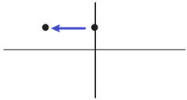

-
- **完成时态的本质意义 : 就是用来表“回顾"（retrospect）, 从后一个时间点, "回顾"前一个时间点. 因此, 完成时态必定涉及前后两个时间。**
-
- 现在 (回顾->) 过去 :  用 have done
  background-color:: #264c9b
- 
	- In all the work **I have done as president**, every decision I have made, every executive action I have taken, … ← 克林顿用" have done "来"回顾"他作为总统的经历. 注意: 此时他还没下台. 所以他的"总统"身份是贯穿到现在时间点的.
	  **如果克林顿现在(已下台)再说这番话, 就要用“ did ”了**:
	  -> In all the work **I did as president**, every decision I made, every executive action I took,…​
-