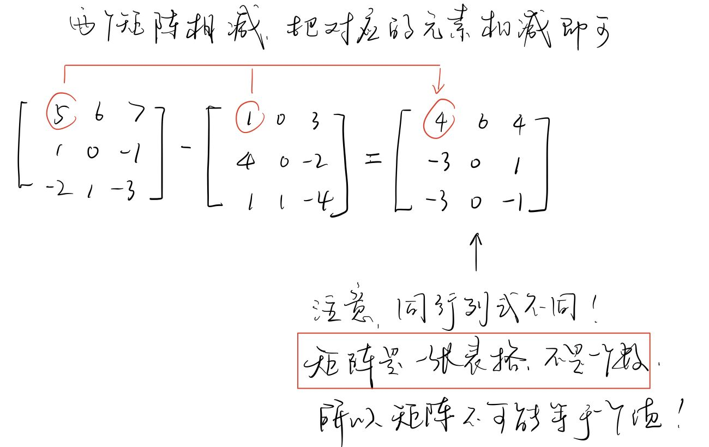

-
- 行列式 determinant
	- [[dir_余子式 minor]]
	- [[dir_代数余子式, 用A表示 ( Algebraic cofactor)]]
		- [[dir_行列式中的任一元素的 "代数余子式"的正负号的规律]]
	- [[dir_行列式 的值]]
	- [[dir_行列式的性质]]
		- [[dir_行列式的性质 : 行,列交换, 其值不变]]
		- [[dir_行列式的性质: 两行交换,其值变号]]
		- [[dir_行列式的性质: 若某一行中有"公因子", 可以提取出来]]
		- [[dir_行列式的性质: 对行的"倍加运算", 其值不变]]
		- [[dir_性质: 三角行列式的值 = 其对角线上元素的乘积]]
		- [[dir_性质: 两行成比例, 则行列式的值=0]]
	- ---
	- 矩阵 Matrix
		- [[dir_矩阵Matrix的概念]]
		- [[dir_矩阵的运算]]
			- [[dir_矩阵的加法]]
			- 矩阵减法的性质
			  collapsed:: true
				- 
			- [[dir_矩阵的乘法]]
			- [[dir_单位阵 identity matrix]]
			- [[dir_矩阵的转置 transpose]]
			- [[dir_对称阵 symmetric matrices]]
		- [[dir_逆矩阵 inverse matrix]]
		- [[dir_对角阵 diagonal matrix]]
		-
		-
		-
- 3集 13.30
-