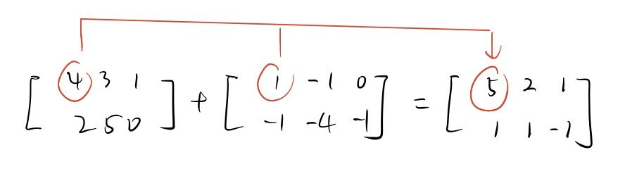
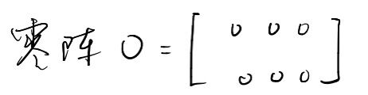
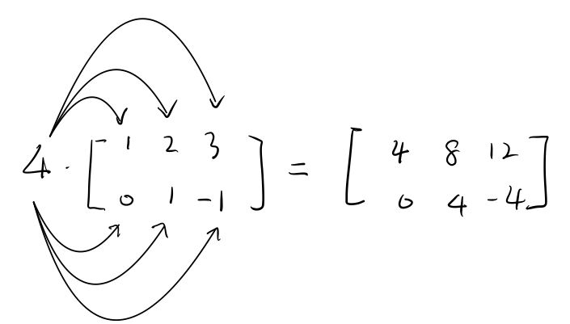
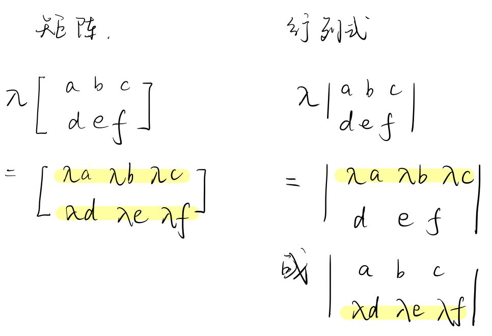

-
- 矩阵的加法:
  background-color:: #264c9b
  collapsed:: true
	- 可以做加法的前提条件是: 有两个矩阵: $A=[a_{ij}]_{m*n},  B=[b_{ij}]_{m_1*n_1}, 当m=m_1, n=n_1 时$, ==即两张表的行和列数都相同时, A,B才能相加.==
	- #+BEGIN_EXPORT latex
	  \boxed{
	  A+B=[a_{ij} + b_{ij}]_{m*n}
	  }
	  #+END_EXPORT
	- 即, 两个矩阵相加, 结果依然是一个矩阵, 它的规模(行数和列数) 和原来的两个矩阵的完全一致.
	  新矩阵中的元素值, 就是原来两个矩阵 相同位置处的元素值的"和". 即 = $a_{ij} + b_{ij}$
	-
	- 例如:
		- {:height 142, :width 498}
- ---
- 矩阵加法的性质
  background-color:: #264c9b
	- 矩阵加法的性质 : 交换律:
	  background-color:: #264c9b
	  collapsed:: true
		- 显然, 两个矩阵的加法, 就具有"==交换律=="的性质了:
		- #+BEGIN_EXPORT latex
		  \boxed{
		  A+B=B+A
		  }
		  #+END_EXPORT
	- ---
	- 矩阵加法的性质 : 零阵:
	  background-color:: #264c9b
	  collapsed:: true
		- 零阵(即里面"所有元素都是 0"的矩阵), 记为英文大写字母的O.  即:
			- {:height 66, :width 247}
			- 显然, 在可相加的前提下, ==一个矩阵+零阵, 就等于该矩阵本身==. 即:
				- #+BEGIN_EXPORT latex
				  \boxed{
				  A+零阵O=A
				  }
				  #+END_EXPORT
	- ---
	- 矩阵加法的性质 : 分配律:
	  background-color:: #264c9b
	  collapsed:: true
		- ==一个数x, 乘以一个矩阵, 就是把矩阵中的每一个元素, 都乘上这个数x. (类似于乘法分配律)==
			- 有矩阵 $A=[a_{ij}]_{m*n}$,  还有一个数 λ, 则:
			- #+BEGIN_EXPORT latex
			  \boxed{
			  \lambda * A = A* \lambda = [\lambda * a_{ij}]_{m*n}
			  }
			  #+END_EXPORT
		- 例如
			- {:height 176, :width 314}
		- ==注意区别==:
			- |数*矩阵 -> |是把这个数和矩阵中的"每一个元素"都相乘|
			  |数* 行列式 -> | 是把这个数, 和行列式中的"某一行", 相乘|
			- {:height 305, :width 436}
	-
-