= 经济学模型, 系统动力学
:toc: left
:toclevels: 3
:sectnums:
:stylesheet: myAdocCss.css

'''

游戏中, 可以简单的计算以下经济变量

== 人均收入 (income per capita)
latexmath:[ = 人均gdp × 某个比例(比如40\%)]

== 人均可支配收入 (disposable income)
latexmath:[  = 人均收入 × (1- 税率tax\ rate)]

即扣税后, 剩下的收入, 就是可支配收入

== 影响"实际失业率"的因素包括

==== 失业率, 会向"长期自然失业率"回归.

\begin{align*}
\boxed{
失业率变化\ =\left( \underset{5\%}{\underbrace{自然失业率}}-当前失业率 \right) \ ×\ \underset{0.2}{\underbrace{调节系数}}
}
\end{align*}

- 0.05​​：自然失业率（NAIRU），即经济长期均衡时的失业率
- (0.05 - self.unemployment)​​："当前失业率"与"自然失业率"的差距 +
-> *#当失业率 > 自然失业率(=5%) → 则括号内的结果, 为负值. 再乘以外面的系数0.2后, 依然是负值. → 它会推动失业率向"自然失业率5%"回落#.* +
-> *当失业率 < 5% → 正值 → 推动失业率向"自然失业率5%"回升.*
- * 0.2​​：调节系数，表示每月向"自然失业率"回归20%的差距

为什么这样?
因为"均值回归特性", 经济系统会自动纠正偏离"自然失业率"的状态： +
高失业率 → 企业因劳动力过剩停止裁员 → 开始雇佣 → 失业率↓ +
低失业率 → 劳动力短缺 → 企业竞争推高工资 → 成本上升 → 裁员 → 失业率↑

任何偏离"自然失业率"的状态, 都会通过市场机制, 自动调整 （非利普斯曲线在长期是垂直的）.

*负值/正值, 是​"变化量​​(Δ)"的方向, 不是失业率本身的高低.* 所以更准确的说法应该是： "失业率>5%时，计算产生​​负的变化量​​，使失业率数值减小（向5%回落）"

image:/img/0002.png[,%]

image:/img/0003.png[,%]

为什么这样建模？​​ +
模拟市场调节​​: 反映现实中工资弹性、企业招聘行为等自动调节机制 +
避免极端状态​: 防止游戏中出现失控的超高/超低失业率 +
游戏平衡性​​: 给玩家一个"经济会自动恢复"的缓冲期，但恢复速度较慢（0.2系数） +

==== DP增长, 对失业率的影响

Okun's Law 奥肯定律，指的是实际"经济增长率"与"失业率"变动之间的"反向相关关系"，即经济增长率越高，失业率就越低。

​奥肯定律公式​​：
latexmath:[ \boxed{Δ失业率 = -k × (实际GDP增长率 - 潜在GDP增长率)}]

其中k是经验系数（此处为0.02）

\begin{align*}
\boxed{
gdp增长,对失业率的影响= \\
\left( 实际gdp增长率-\underset{3\%}{\underbrace{潜在gdp增长率}} \right) ×\underset{奥肯系数}{\underbrace{\left( -0.02 \right) }}
}
\end{align*}

- 0.03​​：潜在GDP增长率（基准值）
- (gdp_growth - 0.03)​​："实际增长率"与"潜在增长率"的差距 +
-> 实际增长 > 潜在值3% → 正值 → 降低失业率 +
-> 实际增长 < 潜在值3% → 负值 → 提高失业率 +
- *#-0.02​​：奥肯系数，表示"GDP增长率"每超过"潜在增长率"1%，则失业率下降0.02%#*（约合现实中的0.3-0.5%比例缩放）

奥肯定律(Okun’s Law)，描述了"失业率变动"与"经济增长"的稳定关系. +
奥肯（1962）指出，**对于美国经济，失业率每上升1%，GDP将下降约3%。**这种稳定的关系已经被很多研究证实，如Freeman（2001）*对十个工业国家的面板数据的研究显示，奥肯定律在这些国家都成立，只是奥肯系数由原来的3%，下降为2%。*

但奥肯定律在中国似乎遇到了麻烦，大量的经验研究表明, **奥肯定律在中国似乎失灵了。**如，姜魏和刘石成（2005）的研究表明，**我国的城镇登记失业率, 与经济增长之间, 不存在典型的奥肯定律关系，**但**他们的研究, 只是将"城镇登记失业率的变动""与GDP增长率"之间进行了简单的回归，并没有对奥肯定律的模型形式, 进行进一步的讨论。**

蔡昉（2007）在其研究中指出：“奥肯定律的存在需要严格的条件，即完善的市场环境和市场机制”. 而奥肯定律表明的关系是"失业率"偏离"自然失业率"的情况，即周期性失业对经济增长的影响.

Berger（2008）在其对欧洲的自然率（潜在GDP增长率，自然失业率，核心通货膨胀率）的估计中, 使用了非观测成分法，将GDP增长率等, 拆分为长期部分, 和周期部分，然后**通过简单奥肯定律, 和菲利普斯曲线, 进行估计。**上述研究的前提是"简单奥肯定律"在该地区是成立的， Berger（2008）使用的欧洲数据表明, *在欧洲存在显著的"奥肯定律".*

但在中国，由于"简单奥肯定律"不成立，所以基于简单奥肯定律的潜在GDP增长率和自然失业率的估计, 是行不通的。

中国社会科学院经济研究所（2005）, 则采用"向量自回归", 和"卡尔曼滤波", 对中国的潜在GDP增长率进行了测算，其结果大致为8%，而社科院（2006）采用"HP滤波"得到的潜在GDP增长率估计, 为9%左右。杨旭等（2007）则使用"生产函数法"测算了中国的潜在GDP增长率，其结果为10.54%至11.56%。

基于"道格拉斯生产函数"的潜在GDP增长率... (所以**要建模经济学模型, 还是需要将经济学中的公式都运用上去才行. 不是只简单的几个经济变量间的互动就足够的.并且还要有概率和统计学知识的运用.**)

==== 整体作用

\begin{align*}
\boxed{
实际失业率 = 失业率向自然失业率回归的影响 + gdp增长对失业率的影响}
\end{align*}

双重影响叠加​​： +
unemployment_change：自然回归力 +
gdp_impact：经济增长的拉动/拖累

再来给个浮动:
\begin{align*}
\boxed{
self.unemployment失业率 = max(0.02, min(0.15, 实际失业率)) }
\end{align*} # 保持在2%-15%之间.

- min() 方法返回给定参数中的最小值，参数可以为序列。 min(0.15, 实际失业率), 就是去里面的最小值, 如果实际失业率超过15%了, 就封顶它为15%. 换言之, 失业率上限我们定为15%（经济危机水平）

- max(0.02, ...) 意思就是如果实际失业率超过2%, 就用超过的数值. 如果低于2%, 那我们就取2%. 换言之, 我们规定了失业率的下限为2%（接近充分就业）

为什么需要边界限制？​​ +
技术性失业​​：不可能完全消除失业（下限2%） +
社会稳定性​​：超过15%的失业可能引发革命（游戏性考虑） +

历史参照​​： +
美国大萧条时期失业率≈25%. *1929-1933年间的失业率高居25%，即使是罗斯福新政时期也从未低于15%。* +
现代正常范围通常2%-10% +

符合历史数据范围（现代国家失业率通常2%-15%）

image:/img/0004.png[,]

== 就业率 (employment rate)
latexmath:[= 1 - 失业率 unemployment ]

== 贸易(顺)差额 (trade balance)
latexmath:[= 出口额 exports - 进口额 imports]

== 贸易顺差率 (trade surplus ratio)
latexmath:[ = \dfrac{出口 - 进口}{进出口总额\ total\ trade}]

== 贸易逆差率 (trade_deficit_ratio)
latexmath:[ = \dfrac{进口 - 出口}{进出口总额}]

== "出口增长率"计算​

\begin{align*}
\boxed{
出口增长率 = gdp增长率 * 1.1 + random.uniform(-0.02, 0.02)
}
\end{align*}

- gdp_growth * 1.1​​ +
*出口增长与GDP增长正相关，且##弹性系数为1.1 , 表示GDP每增长1%，出口增长1.1%##（​​出口比GDP更敏感​​）*

- random.uniform(-0.02, 0.02)​​  +
添加±2%的随机波动，模拟外部不可预测因素
（例如：国际市场需求变化、海运成本波动等） +

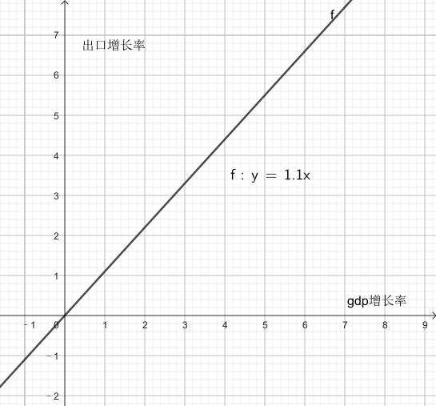

经济学逻辑​​：
经济增长 → 生产能力提升 → 出口商品供应增加 +
但实际出口, 还受国际环境等外生变量影响

== "进口增长率"计算​

\begin{align*}
\boxed{
进口增长率 = gdp增长率 * 0.9 + random.uniform(-0.02, 0.02)
}
\end{align*}

- gdp_growth * 0.9​​ +
进口增长与GDP增长, 正相关，*弹性系数0.9,
表示GDP每增长1%，进口增长0.9%（​​进口比GDP更不敏感​​）*
- 同样的±2%随机波动​

经济学逻辑​​：
经济增长 → 国民收入增加 → 进口需求上升 +
但进口, 依赖国内消费习惯和替代品 availability

image:/img/svg 0002.svg[,50%]

image:/img/0005.png[,%]

符合现实规律​​: +
发展中国家GDP增长, 通常伴随更快的出口增长（系数1.1 > 1） +
进口增长, 相对平缓（系数0.9 < 1）

潜在问题与改进​​:

1.缺失价格因素​​ +
可加入汇率和通胀影响： +

[source, python]
....
export_growth *= (1 - 0.3*self.inflation)  # 通胀削弱出口竞争力
....

作用机制​​：

- self.inflation​​：本国通胀率（例如0.05表示5%通胀）
- #*0.3​​：弹性系数，表示通胀每上升1%，"出口增长率"下降0.3%*#
- 乘法效应​​：直接调整原始出口增长率

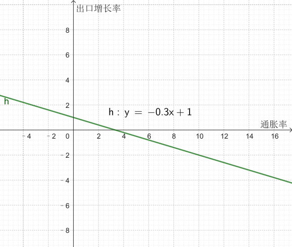

经济学原理​​：

- 成本推动效应​​ +
通胀 → 国内生产成本上升 → 出口商品价格提高 → 国际竞争力下降
- 实际汇率影响​​ +
通胀高于贸易伙伴 → 实际汇率升值 → 出口变贵

image:/img/0006.png[,%]

2.缺乏贸易伙伴依赖​​
更复杂模型可引入： +

[source, python]
....

export_growth *= partner_gdp_growth * 0.5  # 贸易伙伴经济增长影响
....

- partner_gdp_growth​​：主要贸易伙伴的GDP增长率（如0.04表示4%增长）
- #*0.5​​：拉动系数，表示伙伴经济增长1%，本国出口增长额外增加0.5%*#
- 乘法效应​​：放大原始出口增长率

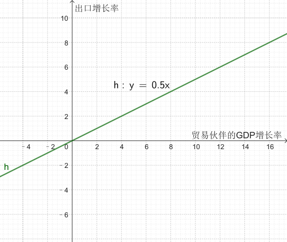

经济学原理​​：

- 需求拉动效应​​:
贸易伙伴经济繁荣 → 进口需求增加 → 拉动本国出口
- 供应链联动​​:
区域经济一体化中，伙伴国增长会通过产业链传导

image:/img/0007.png[,%]

这段代码通过简洁的线性关系+随机扰动，实现了贸易与宏观经济的动态联动，是开放经济体模拟的核心组件之一。

== 军队占总人口比例

\begin{align*}
\boxed{
军队占总人口比例 \\
=\ \frac{军费开支占GDP的比例}{合理的"军费占gdp比例"的基准值应该是\ 5\%}\ × 养军队人数的花费在里面占比的部分算做​​\ 1\%
}
\end{align*}

- 5%	:​​"军费占gdp比例"的基准比例​​：视为"正常"军费占gdp比例的水平, 应该是5%才是合适的. 过高过过低, 都不太合适.
- 1%	:​​基准比例​​：当军费开支为GDP的5%时，其中用来养军队的比例, 又占比1%. 那么意思就是其他4%就是花在武器装备,后勤等等上了.

举例:

- 如果"当前军费占gdp的比例", 正好等于 = "合适的军费占gdp比例基准(即5%)"时, 则:​ +
\begin{align*}
&军队占总人口比例 \\
&= \ \frac{当前实际军费开支占GDP的比例\ 5\%}{合适的军费占gdp比例基准​​\ 5\%}\ ×基准比例​​\ 1\%\ \\
&= 1\%（即1\%人口从军）
\end{align*}

- 军费开支翻倍(占gdp 的 10%)时​
\begin{align*}
&军队占总人口比例 \\
&= \ \frac{当前实际军费开支占GDP的比例\ 10\%}{合适的军费占gdp比例基准​​\ 5\%}\ ×基准比例​​\ 1\%\ \\
&= 2\%（即2\%人口从军）
\end{align*}

- 军费减半(占gdp 的 2.5%)时​
\begin{align*}
&军队占总人口比例 \\
&= \ \frac{当前实际军费开支占GDP的比例\ 2.5\%}{合适的军费占gdp比例基准​​\ 5\%}\ ×基准比例​​\ 1\%\ \\
&= 0.5\%（即 0.5\%人口从军）
\end{align*}

其核心逻辑是将"军费开支"与"军队规模"联系起来。

设计意图​​

- 线性比例关系​ +​
将军费开支的变化​​线性映射​​到军队规模，例如： +
军费增加100% → 军队人数增加100% +
军费减少50% → 军队人数减少50%

- 基准值校准​​ +
当军费占GDP的5%时，1%人口服役符合现代国家常规水平 +
（例如：美国2023年军费占比3.5%，现役军人约0.4%人口）

经济学原理​​

- 机会成本​​：军费增加 → 更多劳动力投入军事 → 民用产业劳动力减少
- 费效比​​：军费开支与军队规模呈正比，但边际效用可能递减（未在本代码体现）
- 历史参照​​： +
二战时期, 美国军费达GDP的40%，约8%人口服役. (二战时期，1944财年美国联邦政府支出, 等于当年美国GDP的40.7%，军费开支占到了其中的近8成。) +
朝鲜战争时期, 中国军费约10%GDP，军队占比约2%.

== GDP增长率的影响因素包括

==== 老龄化因素, 对gdp增长率的影响
\begin{align*}
\boxed{
= 老龄化率 × (-0.01)
}
\end{align*}

该公式表示: 老龄化比率每增加1%，GDP增长就减少0.01%.

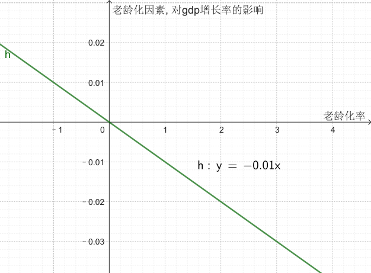

'''

==== 利率因素, 对gdp增长率的影响 = (当前利率 - 基准利率) * (-0.005) +
该公式表示:

\begin{align*}
\boxed{
利率因素带来的影响 \\
=\underset{\begin{matrix}
	如果\ 当前利率>基准利率,\ 则该差\ 为正数.\\
	如果\ 当前利率<基准利率,\ 则改差\ 为负数\\
\end{matrix}}{\underbrace{\ \left( 当前利率-\underset{可设为5\%}{\underbrace{基准利率}} \right) }}×\underset{\begin{matrix}
	如果前面为正数,\ 乘以这里的负数,\\\
	就得到负数,\ 即会对gdp产生负影响\\
\end{matrix}}{\underbrace{\left( -0.005 \right) }}
}
\end{align*}

*#如果前面括号中的差, 为"正数", 表示当前利率高. 再乘以后面的负数(-0.005), 结果就会得到一个"负数". 意思就是: 如果当前利率高, 则就会对gdp产生"负影响".# +
反之,如果前面括号中的差, 为"负数", 表示当前利率低. 再乘以后面的负数(-0.005), 结果就会得到一个"正数". 意思就是: 如果当前利率低, 则就会对gdp产生"正影响".*

换言之, #*可以视为: 利率每偏离"基准利率"1%，GDP增长就变化0.005%.*#

#*"基准数值"这个点, 其实就是"盈亏转折点"*#.

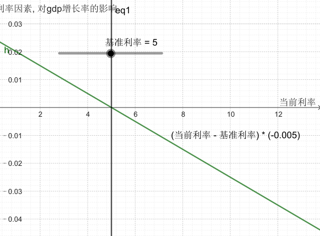

'''

==== 军费因素
\begin{align*}
\boxed{
军费因素带来的影响 \\
=\underset{\begin{matrix}
	如果\ 当前军费占比>基准军费占比,\ 则该差\ 为正数.\ 表示军费太高\\
	如果\ 当前军费占比<基准军费占比,\ 则改差\ 为负数,\ 表示军费低\\
\end{matrix}}{\underbrace{\ \left( 当前军费占gdp的比率-\underset{可设为3\%}{\underbrace{基准军费占gdp的比率}} \right) }}×\underset{\begin{matrix}
	如果前面为正数,\ 乘以这里的负数,\\\
	就得到负数,\ 即会对gdp产生负影响\\
\end{matrix}}{\underbrace{\left( -0.003 \right) }}
}
\end{align*}

换言之, #*前面的括号, 表示"实际军费占比"偏离"基准"的程度. 每偏离基准水平1%，GDP增长就变化0.003%.*#

#前面括号中, 如果当前军费率>基准军费率, 它们的差就是正数, 再乘以后面的负数 (-0.003), 就会得到一个负数. 意思就是: 当军费高时, 会对gdp产生负影响.#

'''

==== 科技投入的高低, 对gdp的影响
\begin{align*}
\boxed{
科技投入对gdp的影响 \\
=\ \dfrac{当前的科技投入,占gdp的比率}{基准的科技投入,占gdp的比率\left( 可设为3\% \right)}\ ×0.002
}
\end{align*}

#*这里, 实际科技投入, 和基准科技投入, 为什么两者间用了"比值"(即除法), 而没用两者的差(即减法)? 因为科技投入, 对gdp一定是正影响的, 而不存在负影响.*#  *如果存在负影响, 才要用"减法"(减法的结果, 才有正数或负数的概念). 如果只存在正影响(只有正数), 就用"比值"就行了.*

公式中的 0.002, 表示"科技投入带来的GDP增长系数".

==== 整体作用
把上面这四种"影响因子"的正负作用加总, 就能得到对"GDP增长率"的最终影响效果.

\begin{align*}
\boxed{
实际gdp增长率  \\
= gdp基础增长率 \\
+ 老龄化对"gdp增长率"的影响 \\
+ 利率对"gdp增长率"的影响 \\
+ 军费投入对"gdp增长率"的影响 \\
+ 科技研发投入对"gdp增长率"的影响 \\
+ 随机波动 (可用 random.uniform(-0.01, 0.01)) 来得到. )
}
\end{align*}

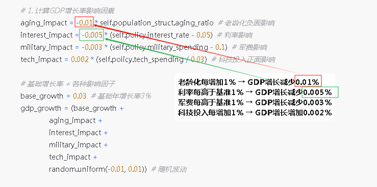

== 通胀率的影响因素包括

==== 基础通胀率 inflation_base
基础通胀率, 是一个经济体的长期平均通胀率（央行通胀目标）. 它将作为通胀率的基准值. 可以设为 0.02 (即2%).

==== 失业率, 会影响通胀. (菲利普斯曲线)
"菲利普斯曲线"说的是: *在经济复苏的时候，企业要招更多的人，就要提高工资水平以和其他企业竞争，表现为名义工资上升(通胀率上升)、失业率下降的负相关性。#即, 通胀率和失业率, 成反比关系.#* 这个意思是什么呢? *这就意味着: 要想通胀率下降, 就要付出失业率上升的代价. 反之依然.*  两者不能两全. *低失业率和低通胀, 不可能同时实现, 鱼和熊掌不可兼得.* 反之, 高失业率和高通胀, 也不太可能一起出现.

经济学解释​​（菲利普斯曲线）： +
失业率↓ → 劳动力市场紧张 → 工资上涨 → 生产成本↑ → 物价↑​​ +
失业率↑ → 劳动力过剩 → 工资增长停滞 → 物价压力↓​

image:/img/菲利普斯曲线.jpg[,]

\begin{align*}
\boxed{
失业率对通胀率的影响\ =\left( \underset{5\%}{\underbrace{自然失业率}}-当前失业率 \right) \ ×\ \underset{0.005}{\underbrace{调节系数}}
}
\end{align*}

- 自然失业率​​（Non-Accelerating Inflation Rate of Unemployment, NAIRU）, 可设为 0.05 (即 5%).
- 括号中的两个数的差, 表示 当前失业率(unemployment)与自然失业率(5%)之间的差额.  +
-> *#如果 "当前失业率 > 自然失业率", 表示失业率高. 则该差的结果, 就是负数.  再乘以调节系数(0.005 是个正数), 最终结果就是个负数. 表示高失业率, 对通胀率, 有抑制作用.#* +
-> *如果 "当前失业率 < 自然失业率," 表示失业率低. 则该差的结果, 就是正数.  再乘以调节系数(0.005 是个正数), 最终结果就是个正数. 表示低失业率, 对通胀率, 有促进作用.* +

当失业率 < 自然失业率的5%时 → unemployment_impact的值为正 → 推高通胀 +
当失业率 > 自然失业率的5%时 → unemployment_impact的值为负 → 抑制通胀

- #*0.005：调节系数，表示"当前失业率"每偏离"自然失业率"1%，通胀率就变化 0.005 (即0.5%).*#

==== 实际的通胀率, 受到上面所有因素的叠加影响
\begin{align*}
\boxed{
实际通胀率 \\
= 基础通胀率 \\
+ 失业率对通胀率的影响 \\
+ 随机波动的影响 (可用 random.uniform(-0.005, 0.005) 来得到)
}
\end{align*}

即: 实际通胀 = 目标通胀 + 经济周期影响(失业率会起伏) + 随机冲击 +
inflation_base：长期基础通胀 +
unemployment_impact：失业率带来的周期性波动 +
random.uniform(-0.005, 0.005)：随机扰动（模拟外部冲击）

代码对应的经济学逻辑​​

[.small]
[options="autowidth" cols="1a,1a,1a,1a"]
|===
|基础通胀率| +失业率的通胀的影响 | +随机波动对通胀的影响|=实际通胀

|2%（基础值）
|当失业率 =5% 时,  +
unemployment_impact = 0
|
|通胀率 = 2%（基础值）± 随机波动

|
|当失业率 = 3%时​​（低于自然率）,  +
unemployment_impact = 0.005*(0.05-0.03) = 0.0001
|
|通胀率 ≈ 2.01% + 随机波动 +
经济过热导致轻微通胀压力

|
|当失业率 = 7%时​​（高于自然率） +
unemployment_impact = 0.005*(0.05-0.07) = -0.0001
|
|通胀率 ≈ 1.99% + 随机波动 +
经济衰退带来通缩压力
|===

== CPI

\begin{align*}
\boxed{
CPI = 1 + 通胀率
}
\end{align*}

== PPI

\begin{align*}
\boxed{
PPI = 1 + (通胀率 × 0.8)
}
\end{align*}

PPI通常波动小于CPI

'''

== 人口结构缓慢变化

[source, python]
....
年人占总人口比例 += 0.002
# 老龄化每年增加0.2%. 老年人口比例每年固定增加0.2%（如从15%→15.2%）. ​
# 现实对应​​：中国2022年老龄化率年增约0.3%（数据来源：国家统计局）

儿童占总人口比例 = max(0.15, 儿童占总人口比例 - 0.001)
# 反映生育率下降趋势. 儿童比例每年减少0.1%，但最低不低于15%
# max(0.15)防止人口崩溃（如韩国2023年儿童占比12.7%的警戒值）
....

'''

== 人口总量增长

[source, python]
....
人口增长率  = 基础增长率 + (实际GDP增长 - 潜在GDP增长) * 敏感系数
           = 0.01       + (gdp_growth - 0.03)       * 0.2

pop_growth = 0.01 + (gdp_growth - 0.03) * 0.2  # 基础1%，随经济增长变化
....

- 基础增长率1%​​ +
反映自然生育率和死亡率平衡 +
接近当前世界平均人口增长率（1.1%）

- 经济挂钩机制​​ +
GDP增长超过3%时，人口增长加速（经济改善→生育意愿↑/移民流入） +
GDP增长低于3%时，人口增长减速（经济恶化→生育推迟/移民流出）

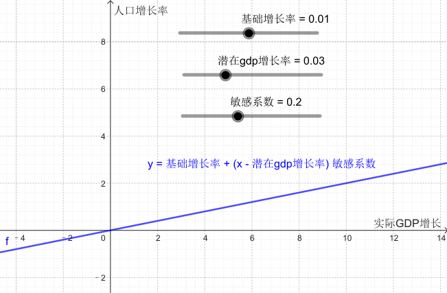

现实案例​​： +
德国：GDP增长与移民政策联动，2015-2018年因经济向好, 人口年增1.2% +
日本：经济停滞, 导致2022年人口减少0.5%

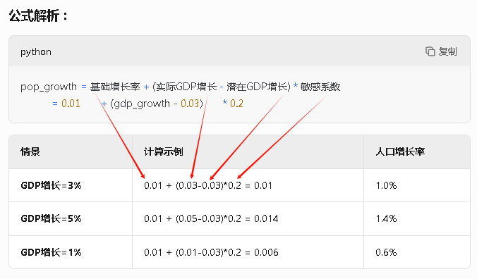

'''

== GDP

GDP增长模型​​： +
GDP_growth = α*(科技投入) + β*(教育投入) - γ*(老龄化率) - δ*(税率) - ε*(军费比) + ζ*(基础设施) + η*(贸易平衡) +
系数α-η代表各因素对GDP增长的弹性

GDP_growth = 基准 + 科技效应 + 教育效应 + 基础设施效应 - 老龄化拖累 - 税负拖累 - 军费拖累 + 贸易效应 + 民主红利 + 随机冲击 +
各系数基于经济学实证研究设定

下面这段代码是一个​​国家GDP增长率的计算模型​​，它通过量化多个经济因素对经济增长的影响，最终综合计算出GDP的年增长率。

[source, python]
....
# 1. 计算GDP增长率影响因素
aging_impact = -0.01 * self.population_struct.aging_ratio  # 老龄化负面影响
'''
含义​​：老龄化比率每增加1%，GDP增长下降0.01%
​​示例​​：
老龄化率=20% → 影响= -0.01 * 20 = -0.2%
老龄化率=25% → 影响= -0.01 * 25 = -0.25%（比前者多拖累0.05%）
​​经济学原理​​：老龄化导致劳动力减少、养老负担加重，抑制经济增长
'''

interest_impact = -0.005 * (self.policy.interest_rate - 0.05)  # 利率影响
'''
含义​​：利率每偏离"5%的基准利率"1%，GDP增长就会变化0.005%
​​方向性​​：
当前实际利率> 基准利率的5% → 对gdp增长率有负影响（高利率, 抑制投资）
当前实际利率< 基准利率的5% → 对gdp增长率有正影响（低利率, 刺激经济）
​​示例​​：
利率=7% → 影响= -0.005*(7-5) = -0.01%
利率=3% → 影响= -0.005*(3-5) = +0.01%
'''

military_impact = -0.003 * (self.policy.military_spending - 0.1)  # 军费影响
'''
含义​​：军费开支每偏离GDP的"10%的军费占gdp比率基准"1%，GDP增长,就会变化0.003%.  超过基准点(盈亏点)就有负影响, 那么前面的系数就用负数!
​​经济学逻辑​​：
军费过高挤占民生支出 → 抑制增长
军费过低威胁国家安全 → 也非最优
'''

tech_impact = 0.002 * (self.policy.tech_spending / 0.03)  # 科技投入正面影响
'''
含义​​：科技投入每达到GDP的"科技应该占gdp3%的合理基准"，就会贡献0.002% gdp增长
​​正向效应​​：科技投入提升全要素生产率
​​示例​​：
科技投入=3% → 影响= +0.002%
科技投入=6% → 影响= +0.004%（翻倍投入，双倍收益）
'''

# 基础增长率 + 各种影响因子
base_growth = 0.03  # 基础年增长率3%
gdp_growth = (base_growth +
			  aging_impact +
			  interest_impact +
			  military_impact +
			  tech_impact +
			  random.uniform(-0.01, 0.01))  # 随机波动

'''
引入±1%的随机扰动
模拟场景​​：
自然灾害
国际油价突变
突发政治事件
'''

....

gdp_growth = 基础增长率 + 老龄化影响 + 利率影响 + 军费影响 + 科技影响 + 随机波动

- ​基础增长率​​：3%（假设的理想稳态增长）
- ​各影响因素​​：通过加减法叠加不同经济政策的效应
- ​随机波动​​：模拟现实中不可预测的冲击

老龄化每增加1% → GDP增长减少0.01% +
利率每高于基准1% → GDP增长减少0.005% +
军费每高于基准1% → GDP增长减少0.003% +
科技投入每增加1% → GDP增长增加0.002% +

举例: +

假设某国： +
老龄化率=18% +
利率=6% +
军费=8% +
科技投入=4% +
随机波动=+0.005% +

计算过程： +

[source, python]
....
aging_impact = -0.01 * 18 = -0.18%
interest_impact = -0.005 * (6-5) = -0.005%
military_impact = -0.003 * (8-10) = +0.006%
tech_impact = 0.002 * (4/3) ≈ +0.00267%

gdp_growth = 3.0% (基础)
		   - 0.18%
		   - 0.005%
		   + 0.006%
		   + 0.00267%
		   + 0.005%
		   = 2.82867% ≈ 2.83%
....

模型特点总结​​ +
特性	说明 +

- ​​多因素驱动​​:	同时考虑人口、政策、科技等维度 +
- ​​*边际效应​​:	#各因素影响呈"线性关系"（可扩展为"非线性"）#* +
- ​​基准值设计​​:	5%利率、10%军费、3%科技投入作为政策锚点 +
- ​​可控随机性​​:	既避免完全确定性，又防止过度波动 +

潜在改进方向​​

- 非线性响应​​：
[source, python]
....
tech_impact = 0.001 * (tech_spending/0.03)​**​1.5  # 边际效益递减
....

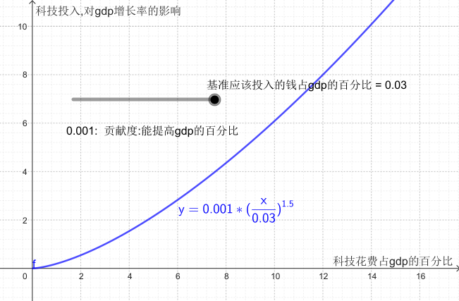

- ​​交互效应​​：
[source, python]
....
aging_tech_impact = -0.005 * aging_ratio * (1 - tech_spending/0.05)  # 科技可缓解老龄化

'''
核心逻辑​​：
​​科技投入可以部分抵消老龄化的负面影响​​
​​公式分解​​：
aging_ratio：老龄化比率（如20%表示为0.2）
tech_spending/0.05："科技投入占GDP比例"与"基准值5%"的比值
(1 - tech_spending/0.05)：科技缓解系数（科技投入越多，老龄化负面影响越小）
'''
....

- ​​时滞效应​​：
[source, python]
....
interest_impact = -0.004 * (last_year_interest_rate - 0.05)  # 利率影响延迟1年
....

'''

== 调整经济政策模型

这段代码是一个​​经济政策调整函数​​，用于模拟政府通过调整利率、税率和军费开支来干预经济运行的过程。

[source, python]
....
def adjust_policy(self, interest_change=0, tax_change=0, military_change=0):
	"""
	调整经济政策
	参数为变化量，如+0.01表示增加1个百分点

作用​​：允许调整三类政策工具
interest_change：利率变化（如+0.01表示加息1个百分点）
tax_change：税率变化
military_change：军费占比变化
​​默认值0​​：不调整时保持原政策
	"""
	self.ins_policy经济政策设置类实例.interest_rate = max(0, min(0.2, self.ins_policy经济政策设置类实例.interest_rate + interest_change))

'''
​​逻辑​​：
新利率 = 当前利率 ± 调整量
max(0, ...)：利率下限0%（避免负利率）
min(0.2, ...)：利率上限20%（防止恶性加息）

​​示例​​：
当前利率5% → 执行adjust_policy(interest_change=0.03) → 新利率8%
当前利率18% → 执行adjust_policy(interest_change=0.05) → 被限制到20%
'''

	self.ins_policy经济政策设置类实例.tax_rate = max(0.1, min(0.5, self.ins_policy经济政策设置类实例.tax_rate + tax_change))

'''
逻辑​​：
新税率 = 当前税率 ± 调整量
税率范围限制在10%~50%之间

​​经济学意义​​：
税率<10%可能导致政府收入不足. max(0.1, x) 就表示: 所以如果实际税率低于10%, 就取10%, 即最低税率不允许低于10%
税率>50%可能引发严重经济衰退（拉弗曲线效应）. min(0.5, x) 表示如果税率超过了0.5(即50%), 就只取50%. 即封顶只取50%的税率.
'''

	self.ins_policy经济政策设置类实例.military_spending = max(0.01, min(0.3, self.ins_policy经济政策设置类实例.military_spending + military_change))

'''
逻辑​​：
军费占比范围限制在1%~30%.  max(0.01, x) 规定了下限是取1%. min(0.3,x) 规定了上限是取30%

​​设计考量​​：
最低1%保障国防安全
超过30%可能挤占民生支出（如苏联后期军费占比达35%）
'''

	# 政策调整会影响市场信心
	if interest_change < 0 or tax_change < 0:
		self.gdp *= 1.005  # 利率变化小于0, 税率变化小于0, 即利率和税率都是下降的, 则说明你在修生养民. 宽松政策会短期刺激经济, 短期刺激经济, gdp就+0.5%
	elif interest_change > 0 or tax_change > 0:
		self.gdp *= 0.995  # 如果"利率变化"和"税率变化"都大于0, 说明你加息了, 加税了. 是在抑制经济. 紧缩政策短期抑制经济, 短期抑制经济, gdp就-0.5%

'''
​​宽松政策场景​​（降息/减税）：
企业融资成本↓ → 投资↑
居民可支配收入↑ → 消费↑
​​示例​​：2020年全球央行降息应对疫情
​​紧缩政策场景​​（加息/增税）：

抑制过热经济
​​示例​​：美联储2022年加息对抗通胀

​​系数设计​​：
0.5%是短期冲击值，长期影响通过"系统动力学模型"体现
军费调整不影响短期GDP（军事凯恩斯主义需更长时间生效）
'''
....

与后续模型的联动​​ +
此函数产生的变化, 会通过以下方式, 影响其他模块：

- ​利率变化​​ → 影响下一年度的interest_impact计算
- ​税率变化​​ → 改变居民disposable_income（可支配收入）
- ​军费变化​​ → 触发邻国的WarSimulator反应机制

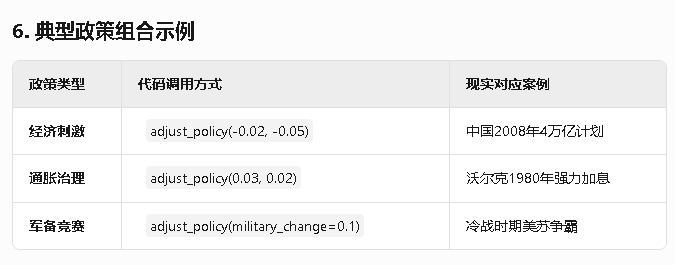

若需更精细的政策模拟，可添加：
[source, python]
....
# 考虑政策时滞（如减税6个月后才生效）
self.policy_queue.append((policy_type, change, delay_months))

# 添加政策信誉度影响（如频繁变动降低政策效果）
self.policy_credibility *= 0.9  # 降为原来的90%
....

这段代码通过简洁的参数化设计，实现了​​政策调整→短期冲击→长期传导​​的完整链条，是经济模拟器中政府干预模块的核心组件。

'''

== 各国间的货币, "汇率兑换表"系统, 放在一个 dict中来表示

[source, python]
....
def __init__(self, list_countries国家经济参数实例: List[ClsCountryEconomy国家经济参数系统类]):
	# countries - 国家经济对象列表（如[魏国, 蜀国, 吴国]）

	self.dict_countries各国名字与其经济参数实例的键值对 = {c.name国家名字: c for c in list_countries国家经济参数实例} # 这里创建了一个dict字典, key就是特定国家的名字, value就是该国的"经济参数实例"
	'''
	数据结构​​：将国家列表转为{国家名: 国家对象}的字典
	（例如 {"魏": wei_obj, "蜀": shu_obj}）
	​​目的​​：快速通过国家名访问经济数据
	'''

	self.dict_exchange_rates各国间汇率系统字典 = {}  # 空字典. 汇率矩阵.  格式: {(国家A,国家B): 汇率} <- dict的 key,可以是一个元组类型

	'''
	汇率定义​​：
	1单位A货币 = X单位B货币
	例如 ("魏","蜀")=1.5,  表示: 1魏币=1.5蜀币

	该"dict_exchange_rates各国间汇率系统字典", 最终会是比如:
	{
	 ("魏","魏"): 1.0,
	 ("魏","蜀"): 1.6,  ("蜀","魏"): 0.625,  # 1/1.6
	 ("魏","吴"): 0.8,  ("吴","魏"): 1.25,   # 1/0.8
	 ("蜀","吴"): 1.2,  ("吴","蜀"): 0.833   # 1/1.2
	}
	'''

	# 初始化随机汇率
	list_names各国名字 = [c.name国家名字 for c in list_countries国家经济参数实例]
	for i, c1 in enumerate(list_names各国名字):
		for j, c2 in enumerate(list_names各国名字):
			if i == j: # 相同国家
				self.dict_exchange_rates各国间汇率系统字典[(c1, c2)] = 1.0  # 自兑换汇率为1, 即本"国的货币"兑换"本国的货币", 那汇率肯定是1:1了
			elif i < j:  # 避免重复计算
				rate随机汇率 = random.uniform(0.5, 2.0) # 随机初始汇率. uniform() 方法将随机生成下一个实数，它在 [x, y] 范围内。如, uniform(5, 10) 的随机数为 :  6.98774810047.
				# 随机设定在0.5~2.0之间，模拟现实中的汇率差异. （例如：1魏币=0.8吴币，1魏币=1.8蜀币）
				self.dict_exchange_rates各国间汇率系统字典[(c1, c2)] = rate随机汇率 # 将随机汇率, 赋值给c1,c2这两个国家货币的 汇率交换值.
				self.dict_exchange_rates各国间汇率系统字典[(c2, c1)] = 1 / rate随机汇率 # 反向汇率. 反向汇率通过倒数自动计算 （若 魏/蜀=1.5 → 则 蜀/魏=1/1.5≈0.67）

	'''
	关键设计​​：
	-​​对角线元素(i=j)​​
	任何国家与自身的汇率, 都是1:1
	（如 ("魏","魏")=1.0）

	-​​"非对称"汇率关系​​
	只计算i<j的组合（避免重复生成"魏-蜀"和"蜀-魏"）
	反向汇率, 通过"倒数"自动计算
	（若 魏/蜀=1.5 → 则 蜀/魏=1/1.5≈0.67）

	​-​"初始汇率"范围​​
	随机设定在0.5~2.0之间，模拟现实中的汇率差异
	（例如：1魏币=0.8吴币，1魏币=1.8蜀币）
	'''

....

== gdp增长, 对汇率的影响

[source, python]
....
def update_trade(self):
	"""
	更新国际贸易关系
	包括汇率变化和贸易量调整

	这段代码是​​"国际贸易系统"的动态更新方法​​，实现了两个核心经济机制：​"​汇率浮动机制"​​和​​"贸易量自适应调整"​​。
	"""
	# 1. 更新汇率 (基于相对经济表现)
	list_names各国名字 = list(self.dict_countries各国名字与其经济参数实例的键值对.keys()) # 将dict中的key, 即各国名字, 放在一个list中.

	for i, c1 in enumerate(list_names各国名字):
		for j, c2 in enumerate(list_names各国名字):
			if i < j:
				#  计算两国GDP增长率差异, 经济表现好的国家货币升值.
				growth_diff两国GDP增长率差异 = (self.dict_countries各国名字与其经济参数实例的键值对[c1].fn_get_gdp_growth_rate计算gdp增长率() -
							   self.dict_countries各国名字与其经济参数实例的键值对[c2].fn_get_gdp_growth_rate计算gdp增长率()) / 100
				'''
				growth_diff = (c1最新GDP/c1上期GDP - c2最新GDP/c2上期GDP)
				'''

				change对汇率的影响度 = growth_diff两国GDP增长率差异 * 0.1  # gdp增长率差异中的10%, 会影响汇率
				# 若c1比c2经济增长快1%，则c1货币升值0.1%（系数0.1控制敏感度）. 例如：魏国GDP增长5%，蜀国增长3% → 魏币对蜀币升值0.2%

				# 更新汇率
				self.dict_exchange_rates各国间汇率系统字典[(c1, c2)] *= (1 + change对汇率的影响度)
				self.dict_exchange_rates各国间汇率系统字典[(c2, c1)] = 1 / self.dict_exchange_rates各国间汇率系统字典[(c1, c2)] # 保持A→B和B→A汇率的数学倒数关系

				'''
				关键逻辑：
				-​​相对增长决定汇率​​
				若c1比c2经济增长快1%，则c1货币升值0.1%（系数0.1控制敏感度）
				例如：魏国GDP增长5%，蜀国增长3% → 魏币对蜀币升值0.2%

				-​​双向汇率同步更新​​
				保持A→B和B→A汇率的数学倒数关系

				-​​经济学原理​​
				模仿现实中的"经济增长→资本流入→货币升值"机制
				类似人民币升值与中国经济高速增长的关系

				'''

	# 2. 贸易量自动调整 (基于相对价格和汇率)
	for country in self.dict_countries各国名字与其经济参数实例的键值对.values():
		# 出口公式. 出口竞争力受汇率和PPI影响
		export_factor = (1 / self.dict_exchange_rates各国间汇率系统字典[(country.name国家名字, "魏")]) * (100 / country.ppi)  #  export_factor = (1/该国对魏汇率) * (100/该国PPI)
		country.exports出口额 *= (0.9 + 0.2 * export_factor)

		# 进口公式. 进口需求受收入和汇率影响
		import_factor = country.disposable_income * self.dict_exchange_rates各国间汇率系统字典[(country.name国家名字, "魏")] # import_factor = 该国人均可支配收入 * 该国对魏汇率
		country.imports进口额 *= (0.95 + 0.1 * import_factor)

....

出口公式:
\begin{align*}
 export_factor = \frac{1}{该国对魏汇率} × \frac{100}{该国PPI}
\end{align*}

进口公式:
\begin{align*}
 import_factor = 该国人均可支配收入 * 该国对魏汇率
\end{align*}

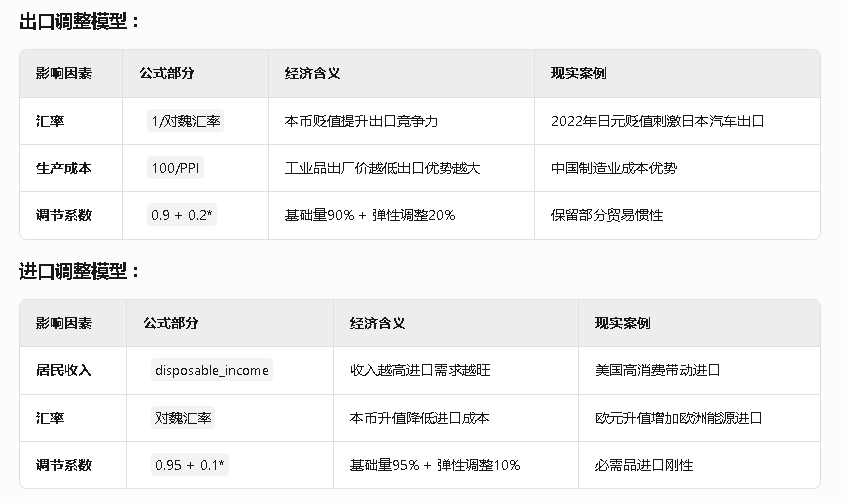

系统动力学示例 +
​​场景模拟​​： +
魏国GDP增长加速 → 魏币升值 → 蜀国对魏汇率从1.6→1.55 +
→ 蜀国export_factor提高(1/1.55≈0.645 > 1/1.6≈0.625) +
→ 蜀国出口增长约0.4% +
→ 同时蜀国从魏国进口成本降低 +

反馈循环​​： +
A[魏国增长更快] --> B[魏币升值] +
B --> C[蜀国出口竞争力↑] +
B --> D[蜀国进口成本↓] +
C --> E[蜀国贸易顺差↑] +
D --> F[蜀国通胀压力↓] +

设计特点

- 基准货币锚定​​
以"魏"为计价基准（类似美元在国际贸易中的地位）

- 非对称调节​​
出口对汇率更敏感（系数0.2 > 进口系数0.1）
反映发展中国家"出口驱动"特征

- PPI联动​​
生产者价格指数影响出口，体现成本竞争力

- 收入效应​​
人均可支配收入驱动进口，符合凯恩斯消费理论

潜在改进方向

1.​加入贸易伙伴权重
[source, python]
....
# 根据地理距离调整影响系数
distance_factor = 1/(1 + distance_matrix[c1][c2])
....

功能：
​​计算两国贸易的"距离衰减效应"​​ +
其中distance_matrix是预先定义的二维字典，存储国家间的地理距离（单位：千公里）

image:/img/0011.png[,%]

2.​考虑关税传导
[source, python]
....
effective_import_rate = exchange_rate * (1 + tariff_rate)
....

参数说明： +
tariff_rate：目标国设置的进口关税（如0.15表示15%关税） +
exchange_rate：原始汇率（如1魏币=1.5蜀币） +

计算示例： +
蜀国对魏国征收20%关税： +
1.5 * (1+0.2) = 1.8 +
→ 实际进口成本变为1魏币=1.8蜀币 +

经济影响： +
​​价格传导​​：关税增加会提高进口商品最终售价 +

python +
import_price = foreign_price * effective_import_rate +
​​贸易抑制​​：高关税降低进口量（需配合需求弹性使用） +

现实案例： +
2018年美国对中国加征25%关税，导致中国商品在美售价上涨约15% +

3.​​引入大宗商品价格
[source, python]
....
if country.is_resource_exporter:
    export_factor *= commodity_price_index
....

这段代码通过将宏观经济指标与微观贸易决策相连接，构建了一个符合经济学原理的动态国际贸易模拟系统。

