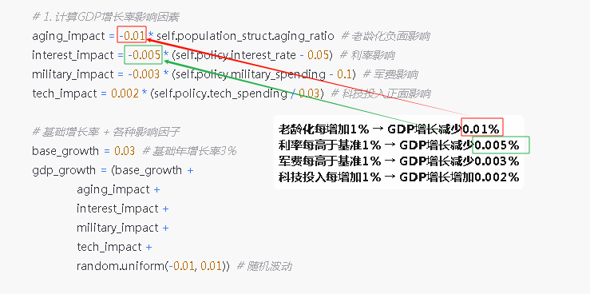

= 经济学模型, 系统动力学
:toc: left
:toclevels: 3
:sectnums:
:stylesheet: myAdocCss.css

'''

游戏中, 可以简单的计算以下经济变量

== 人均收入 (income per capita)
latexmath:[ = 人均gdp × 某个比例(比如40\%)]

== 人均可支配收入 (disposable income)
latexmath:[  = 人均收入 × (1- 税率tax\ rate)]

即扣税后, 剩下的收入, 就是可支配收入

== 影响"实际失业率"的因素包括

==== 失业率, 会向"长期自然失业率"回归.

\begin{align*}
\boxed{
失业率变化\ =\left( \underset{5\%}{\underbrace{自然失业率}}-当前失业率 \right) \ ×\ \underset{0.2}{\underbrace{调节系数}}
}
\end{align*}

- 0.05​​：自然失业率（NAIRU），即经济长期均衡时的失业率
- (0.05 - self.unemployment)​​："当前失业率"与"自然失业率"的差距 +
-> *#当失业率 > 自然失业率(=5%) → 则括号内的结果, 为负值. 再乘以外面的系数0.2后, 依然是负值. → 它会推动失业率向"自然失业率5%"回落#.* +
-> *当失业率 < 5% → 正值 → 推动失业率向"自然失业率5%"回升.*
- * 0.2​​：调节系数，表示每月向"自然失业率"回归20%的差距

为什么这样?
因为"均值回归特性", 经济系统会自动纠正偏离"自然失业率"的状态： +
高失业率 → 企业因劳动力过剩停止裁员 → 开始雇佣 → 失业率↓ +
低失业率 → 劳动力短缺 → 企业竞争推高工资 → 成本上升 → 裁员 → 失业率↑

任何偏离"自然失业率"的状态, 都会通过市场机制, 自动调整 （非利普斯曲线在长期是垂直的）.

*负值/正值, 是​"变化量​​(Δ)"的方向, 不是失业率本身的高低.* 所以更准确的说法应该是： "失业率>5%时，计算产生​​负的变化量​​，使失业率数值减小（向5%回落）"

image:/img/0002.png[,%]

image:/img/0003.png[,%]

为什么这样建模？​​ +
模拟市场调节​​: 反映现实中工资弹性、企业招聘行为等自动调节机制 +
避免极端状态​: 防止游戏中出现失控的超高/超低失业率 +
游戏平衡性​​: 给玩家一个"经济会自动恢复"的缓冲期，但恢复速度较慢（0.2系数） +

==== DP增长, 对失业率的影响

Okun's Law 奥肯定律，指的是实际"经济增长率"与"失业率"变动之间的"反向相关关系"，即经济增长率越高，失业率就越低。

​奥肯定律公式​​：
latexmath:[ \boxed{Δ失业率 = -k × (实际GDP增长率 - 潜在GDP增长率)}]

其中k是经验系数（此处为0.02）

\begin{align*}
\boxed{
gdp增长,对失业率的影响= \\
\left( 实际gdp增长率-\underset{3\%}{\underbrace{潜在gdp增长率}} \right) ×\underset{奥肯系数}{\underbrace{\left( -0.02 \right) }}
}
\end{align*}

- 0.03​​：潜在GDP增长率（基准值）
- (gdp_growth - 0.03)​​："实际增长率"与"潜在增长率"的差距 +
-> 实际增长 > 潜在值3% → 正值 → 降低失业率 +
-> 实际增长 < 潜在值3% → 负值 → 提高失业率 +
- *#-0.02​​：奥肯系数，表示"GDP增长率"每超过"潜在增长率"1%，则失业率下降0.02%#*（约合现实中的0.3-0.5%比例缩放）

奥肯定律(Okun’s Law)，描述了"失业率变动"与"经济增长"的稳定关系. +
奥肯（1962）指出，**对于美国经济，失业率每上升1%，GDP将下降约3%。**这种稳定的关系已经被很多研究证实，如Freeman（2001）*对十个工业国家的面板数据的研究显示，奥肯定律在这些国家都成立，只是奥肯系数由原来的3%，下降为2%。*

但奥肯定律在中国似乎遇到了麻烦，大量的经验研究表明, **奥肯定律在中国似乎失灵了。**如，姜魏和刘石成（2005）的研究表明，**我国的城镇登记失业率, 与经济增长之间, 不存在典型的奥肯定律关系，**但**他们的研究, 只是将"城镇登记失业率的变动""与GDP增长率"之间进行了简单的回归，并没有对奥肯定律的模型形式, 进行进一步的讨论。**

蔡昉（2007）在其研究中指出：“奥肯定律的存在需要严格的条件，即完善的市场环境和市场机制”. 而奥肯定律表明的关系是"失业率"偏离"自然失业率"的情况，即周期性失业对经济增长的影响.

Berger（2008）在其对欧洲的自然率（潜在GDP增长率，自然失业率，核心通货膨胀率）的估计中, 使用了非观测成分法，将GDP增长率等, 拆分为长期部分, 和周期部分，然后**通过简单奥肯定律, 和菲利普斯曲线, 进行估计。**上述研究的前提是"简单奥肯定律"在该地区是成立的， Berger（2008）使用的欧洲数据表明, *在欧洲存在显著的"奥肯定律".*

但在中国，由于"简单奥肯定律"不成立，所以基于简单奥肯定律的潜在GDP增长率和自然失业率的估计, 是行不通的。

中国社会科学院经济研究所（2005）, 则采用"向量自回归", 和"卡尔曼滤波", 对中国的潜在GDP增长率进行了测算，其结果大致为8%，而社科院（2006）采用"HP滤波"得到的潜在GDP增长率估计, 为9%左右。杨旭等（2007）则使用"生产函数法"测算了中国的潜在GDP增长率，其结果为10.54%至11.56%。

基于"道格拉斯生产函数"的潜在GDP增长率... (所以**要建模经济学模型, 还是需要将经济学中的公式都运用上去才行. 不是只简单的几个经济变量间的互动就足够的.并且还要有概率和统计学知识的运用.**)

==== 整体作用

\begin{align*}
\boxed{
实际失业率 = 失业率向自然失业率回归的影响 + gdp增长对失业率的影响}
\end{align*}

双重影响叠加​​： +
unemployment_change：自然回归力 +
gdp_impact：经济增长的拉动/拖累

再来给个浮动:
\begin{align*}
\boxed{
self.unemployment失业率 = max(0.02, min(0.15, 实际失业率)) }
\end{align*} # 保持在2%-15%之间.

- min() 方法返回给定参数中的最小值，参数可以为序列。 min(0.15, 实际失业率), 就是去里面的最小值, 如果实际失业率超过15%了, 就封顶它为15%. 换言之, 失业率上限我们定为15%（经济危机水平）

- max(0.02, ...) 意思就是如果实际失业率超过2%, 就用超过的数值. 如果低于2%, 那我们就取2%. 换言之, 我们规定了失业率的下限为2%（接近充分就业）

为什么需要边界限制？​​ +
技术性失业​​：不可能完全消除失业（下限2%） +
社会稳定性​​：超过15%的失业可能引发革命（游戏性考虑） +

历史参照​​： +
美国大萧条时期失业率≈25%. *1929-1933年间的失业率高居25%，即使是罗斯福新政时期也从未低于15%。* +
现代正常范围通常2%-10% +

符合历史数据范围（现代国家失业率通常2%-15%）

image:/img/0004.png[,]

== 就业率 (employment rate)
latexmath:[= 1 - 失业率 unemployment ]

== 贸易(顺)差额 (trade balance)
latexmath:[= 出口额 exports - 进口额 imports]

== 贸易顺差率 (trade surplus ratio)
latexmath:[ = \dfrac{出口 - 进口}{进出口总额\ total\ trade}]

== 贸易逆差率 (trade_deficit_ratio)
latexmath:[ = \dfrac{进口 - 出口}{进出口总额}]

== "出口增长率"计算​

\begin{align*}
\boxed{
出口增长率 = gdp增长率 * 1.1 + random.uniform(-0.02, 0.02)
}
\end{align*}

- gdp_growth * 1.1​​ +
*出口增长与GDP增长正相关，且##弹性系数为1.1 , 表示GDP每增长1%，出口增长1.1%##（​​出口比GDP更敏感​​）*

- random.uniform(-0.02, 0.02)​​  +
添加±2%的随机波动，模拟外部不可预测因素
（例如：国际市场需求变化、海运成本波动等） +

经济学逻辑​​：
经济增长 → 生产能力提升 → 出口商品供应增加 +
但实际出口, 还受国际环境等外生变量影响

== "进口增长率"计算​

\begin{align*}
\boxed{
进口增长率 = gdp增长率 * 0.9 + random.uniform(-0.02, 0.02)
}
\end{align*}

- gdp_growth * 0.9​​ +
进口增长与GDP增长, 正相关，*弹性系数0.9,
表示GDP每增长1%，进口增长0.9%（​​进口比GDP更不敏感​​）*
- 同样的±2%随机波动​

经济学逻辑​​：
经济增长 → 国民收入增加 → 进口需求上升 +
但进口, 依赖国内消费习惯和替代品 availability

image:/img/0005.png[,%]

符合现实规律​​: +
发展中国家GDP增长, 通常伴随更快的出口增长（系数1.1 > 1） +
进口增长, 相对平缓（系数0.9 < 1）

潜在问题与改进​​:

1.缺失价格因素​​ +
可加入汇率和通胀影响： +

[source, python]
....
export_growth *= (1 - 0.3*self.inflation)  # 通胀削弱出口竞争力
....

作用机制​​：

- self.inflation​​：本国通胀率（例如0.05表示5%通胀）
- #*0.3​​：弹性系数，表示通胀每上升1%，"出口增长率"下降0.3%*#
- 乘法效应​​：直接调整原始出口增长率

经济学原理​​：

- 成本推动效应​​ +
通胀 → 国内生产成本上升 → 出口商品价格提高 → 国际竞争力下降
- 实际汇率影响​​ +
通胀高于贸易伙伴 → 实际汇率升值 → 出口变贵

image:/img/0006.png[,%]

2.缺乏贸易伙伴依赖​​
更复杂模型可引入： +

[source, python]
....

export_growth *= partner_gdp_growth * 0.5  # 贸易伙伴经济增长影响
....

- partner_gdp_growth​​：主要贸易伙伴的GDP增长率（如0.04表示4%增长）
- #*0.5​​：拉动系数，表示伙伴经济增长1%，本国出口增长额外增加0.5%*#
- 乘法效应​​：放大原始出口增长率

经济学原理​​：

- 需求拉动效应​​:
贸易伙伴经济繁荣 → 进口需求增加 → 拉动本国出口
- 供应链联动​​:
区域经济一体化中，伙伴国增长会通过产业链传导

image:/img/0007.png[,%]

这段代码通过简洁的线性关系+随机扰动，实现了贸易与宏观经济的动态联动，是开放经济体模拟的核心组件之一。

== 军队占总人口比例

其核心逻辑是将"军费开支"与"军队规模"联系起来。

== GDP增长率的影响因素包括

==== 老龄化因素, 对gdp增长率的影响
\begin{align*}
\boxed{
= 老龄化率 × (-0.01)
}
\end{align*}

该公式表示: 老龄化比率每增加1%，GDP增长就减少0.01%.

'''

==== 利率因素, 对gdp增长率的影响 = (当前利率 - 基准利率) * (-0.005) +
该公式表示:

\begin{align*}
\boxed{
利率因素带来的影响 \\
=\underset{\begin{matrix}
	如果\ 当前利率>基准利率,\ 则该差\ 为正数.\\
	如果\ 当前利率<基准利率,\ 则改差\ 为负数\\
\end{matrix}}{\underbrace{\ \left( 当前利率-\underset{可设为5\%}{\underbrace{基准利率}} \right) }}×\underset{\begin{matrix}
	如果前面为正数,\ 乘以这里的负数,\\\
	就得到负数,\ 即会对gdp产生负影响\\
\end{matrix}}{\underbrace{\left( -0.005 \right) }}
}
\end{align*}

*#如果前面括号中的差, 为"正数", 表示当前利率高. 再乘以后面的负数(-0.005), 结果就会得到一个"负数". 意思就是: 如果当前利率高, 则就会对gdp产生"负影响".# +
反之,如果前面括号中的差, 为"负数", 表示当前利率低. 再乘以后面的负数(-0.005), 结果就会得到一个"正数". 意思就是: 如果当前利率低, 则就会对gdp产生"正影响".*

换言之, #*可以视为: 利率每偏离"基准利率"1%，GDP增长就变化0.005%.*#

#*"基准数值"这个点, 其实就是"盈亏转折点"*#.

'''

==== 军费因素
\begin{align*}
\boxed{
军费因素带来的影响 \\
=\underset{\begin{matrix}
	如果\ 当前军费占比>基准军费占比,\ 则该差\ 为正数.\ 表示军费太高\\
	如果\ 当前军费占比<基准军费占比,\ 则改差\ 为负数,\ 表示军费低\\
\end{matrix}}{\underbrace{\ \left( 当前军费占gdp的比率-\underset{可设为3\%}{\underbrace{基准军费占gdp的比率}} \right) }}×\underset{\begin{matrix}
	如果前面为正数,\ 乘以这里的负数,\\\
	就得到负数,\ 即会对gdp产生负影响\\
\end{matrix}}{\underbrace{\left( -0.003 \right) }}
}
\end{align*}

换言之, #*前面的括号, 表示"实际军费占比"偏离"基准"的程度. 每偏离基准水平1%，GDP增长就变化0.003%.*#

#前面括号中, 如果当前军费率>基准军费率, 它们的差就是正数, 再乘以后面的负数 (-0.003), 就会得到一个负数. 意思就是: 当军费高时, 会对gdp产生负影响.#

'''

==== 科技投入的高低, 对gdp的影响
\begin{align*}
\boxed{
科技投入对gdp的影响 \\
=\ \dfrac{当前的科技投入,占gdp的比率}{基准的科技投入,占gdp的比率\left( 可设为3\% \right)}\ ×0.002
}
\end{align*}

#*这里, 实际科技投入, 和基准科技投入, 为什么两者间用了"比值"(即除法), 而没用两者的差(即减法)? 因为科技投入, 对gdp一定是正影响的, 而不存在负影响.*#  *如果存在负影响, 才要用"减法"(减法的结果, 才有正数或负数的概念). 如果只存在正影响(只有正数), 就用"比值"就行了.*

公式中的 0.002, 表示"科技投入带来的GDP增长系数".

==== 整体作用
把上面这四种"影响因子"的正负作用加总, 就能得到对"GDP增长率"的最终影响效果.

\begin{align*}
\boxed{
实际gdp增长率  \\
= gdp基础增长率 \\
+ 老龄化对"gdp增长率"的影响 \\
+ 利率对"gdp增长率"的影响 \\
+ 军费投入对"gdp增长率"的影响 \\
+ 科技研发投入对"gdp增长率"的影响 \\
+ 随机波动 (可用 random.uniform(-0.01, 0.01)) 来得到. )
}
\end{align*}

== 通胀率的影响因素包括

==== 基础通胀率 inflation_base
基础通胀率, 是一个经济体的长期平均通胀率（央行通胀目标）. 它将作为通胀率的基准值. 可以设为 0.02 (即2%).

==== 失业率, 会影响通胀. (菲利普斯曲线)
"菲利普斯曲线"说的是: *在经济复苏的时候，企业要招更多的人，就要提高工资水平以和其他企业竞争，表现为名义工资上升(通胀率上升)、失业率下降的负相关性。#即, 通胀率和失业率, 成反比关系.#* 这个意思是什么呢? *这就意味着: 要想通胀率下降, 就要付出失业率上升的代价. 反之依然.*  两者不能两全. *低失业率和低通胀, 不可能同时实现, 鱼和熊掌不可兼得.* 反之, 高失业率和高通胀, 也不太可能一起出现.

经济学解释​​（菲利普斯曲线）： +
失业率↓ → 劳动力市场紧张 → 工资上涨 → 生产成本↑ → 物价↑​​ +
失业率↑ → 劳动力过剩 → 工资增长停滞 → 物价压力↓​

image:/img/菲利普斯曲线.jpg[,]

\begin{align*}
\boxed{
失业率对通胀率的影响\ =\left( \underset{5\%}{\underbrace{自然失业率}}-当前失业率 \right) \ ×\ \underset{0.005}{\underbrace{调节系数}}
}
\end{align*}

- 自然失业率​​（Non-Accelerating Inflation Rate of Unemployment, NAIRU）, 可设为 0.05 (即 5%).
- 括号中的两个数的差, 表示 当前失业率(unemployment)与自然失业率(5%)之间的差额.  +
-> *#如果 "当前失业率 > 自然失业率", 表示失业率高. 则该差的结果, 就是负数.  再乘以调节系数(0.005 是个正数), 最终结果就是个负数. 表示高失业率, 对通胀率, 有抑制作用.#* +
-> *如果 "当前失业率 < 自然失业率," 表示失业率低. 则该差的结果, 就是正数.  再乘以调节系数(0.005 是个正数), 最终结果就是个正数. 表示低失业率, 对通胀率, 有促进作用.* +

当失业率 < 自然失业率的5%时 → unemployment_impact的值为正 → 推高通胀 +
当失业率 > 自然失业率的5%时 → unemployment_impact的值为负 → 抑制通胀

- #*0.005：调节系数，表示"当前失业率"每偏离"自然失业率"1%，通胀率就变化 0.005 (即0.5%).*#

==== 实际的通胀率, 受到上面所有因素的叠加影响
\begin{align*}
\boxed{
实际通胀率 \\
= 基础通胀率 \\
+ 失业率对通胀率的影响 \\
+ 随机波动的影响 (可用 random.uniform(-0.005, 0.005) 来得到)
}
\end{align*}

即: 实际通胀 = 目标通胀 + 经济周期影响(失业率会起伏) + 随机冲击 +
inflation_base：长期基础通胀 +
unemployment_impact：失业率带来的周期性波动 +
random.uniform(-0.005, 0.005)：随机扰动（模拟外部冲击）

代码对应的经济学逻辑​​

[.small]
[options="autowidth" cols="1a,1a,1a,1a"]
|===
|基础通胀率| +失业率的通胀的影响 | +随机波动对通胀的影响|=实际通胀

|2%（基础值）
|当失业率 =5% 时,  +
unemployment_impact = 0
|
|通胀率 = 2%（基础值）± 随机波动

|
|当失业率 = 3%时​​（低于自然率）,  +
unemployment_impact = 0.005*(0.05-0.03) = 0.0001
|
|通胀率 ≈ 2.01% + 随机波动 +
经济过热导致轻微通胀压力

|
|当失业率 = 7%时​​（高于自然率） +
unemployment_impact = 0.005*(0.05-0.07) = -0.0001
|
|通胀率 ≈ 1.99% + 随机波动 +
经济衰退带来通缩压力
|===

== CPI

\begin{align*}
\boxed{
CPI = 1 + 通胀率
}
\end{align*}

== PPI

\begin{align*}
\boxed{
PPI = 1 + (通胀率 × 0.8)
}
\end{align*}

PPI通常波动小于CPI

