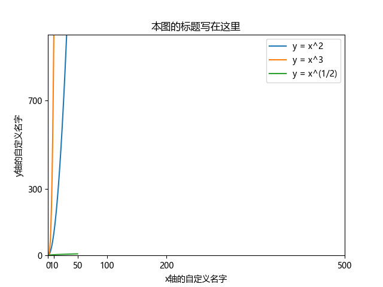
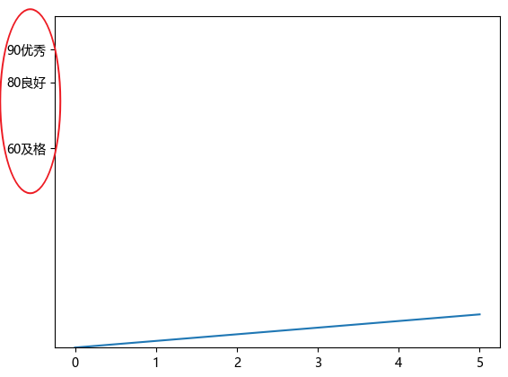
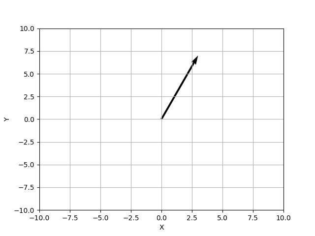
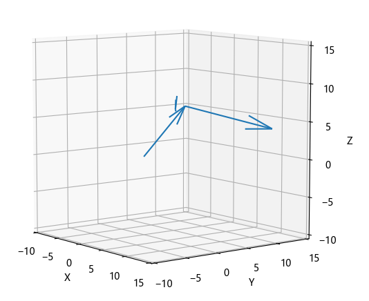

title:: main_Matplotlib

-
- 第一个例子
  collapsed:: true
	- ```python
	  import matplotlib
	  matplotlib.rc("font", family='Microsoft YaHei') # 注意, 要想在画图中成功显示中文, 必须加上这句代码
	  
	  import numpy as np
	  from matplotlib import pyplot as plt
	  import math
	  
	  plt.xlabel("x轴的自定义名字")
	  plt.ylabel("y轴的自定义名字")
	  
	  plt.xlim(0,500) # 指定x轴的显示范围为[0,500]
	  plt.ylim(0,1000) # 指定y轴的显示范围为[0,1000]
	  
	  plt.xticks([0,10,50,100,200,500]) #自定义x轴刻度
	  plt.yticks([0,300,700]) #自定义y轴刻度
	  
	  plt.tick_params(labelsize = 10) #设置刻度字号
	  
	  plt.title('本图的标题写在这里') #写上图题
	  
	  x = np.arange(-50,51) # type: ndarray
	  print(x)
	  y = x ** 2 # 平方. 即, 我们设定了一个 "x平方 = y" 的曲线
	  
	  # 下面同时在一张图中画3条曲线
	  plt.plot(x,y) # 用 plot() 进行画图. x为x轴数据, y为y轴数据
	  plt.plot(x, x ** 3)
	  plt.plot(x, x ** (1/2))
	  
	  plt.legend(['y = x^2','y = x^3','y = x^(1/2)']) #打出图例
	  
	  plt.show() # 显示所画的图
	  ```
	- 
	-
- 线条的样式自定义
	- 线条显示为虚线 -> plot(x, y, '虚线类型指定')
	  collapsed:: true
		- 线条显示为虚线, 第三个参数就用 '--'
		- 线条显示为点号虚线, 第三个参数就用 '.'
		- ```python
		  import matimport matplotlib
		  matplotlib.rc("font", family='Microsoft YaHei') # 注意, 要想在画图中成功显示中文, 必须加上这句代码
		  import numpy as np
		  from matplotlib import pyplot as plt
		  
		  # 下面, 来画一条直线, 它通过(0,0) 和 (5,10) 两点.
		  # 即, 把下面看做一个矩阵, 竖着看, 每列中存放的就是一个点的坐标
		    x = np.array([0,5])
		    y = np.array([0,10])
		    plt.plot(x,y) # 第一个参数指定你要由x轴来显示的值, 第二个参数指定你要由y轴来显示的值
		    plt.plot(x+3,y-4,'--') #  用 '‐'虚线表示
		  # 再画一条线
		    x3 = np.arange(10)
		    plt.plot(x3,x3 ** 2,'.') #  用 '.' 点号虚线表示
		    
		    plt.show() # 显示所画的图
		  ```
			- 
	- 给线条指定颜色 -> plot(x, y, '线条颜色')
	  collapsed:: true
		- ```python
		  import matplotlib
		  matplotlib.rc("font", family='Microsoft YaHei') # 注意, 要想在画图中成功显示中文, 必须加上这句代码
		  import numpy as np
		  from matplotlib import pyplot as plt
		  
		  # 下面, 来画一条直线, 它通过(0,0) 和 (5,10) 两点.
		  # 即, 把下面看做一个矩阵, 竖着看, 每列中存放的就是一个点的坐标
		  x = np.array([0,5])
		  y = np.array([0,10])
		  
		  plt.plot(x,y,'r') # 指定线条的颜色为红色 red
		  plt.plot(x+3,y-4,'g--') # 指定线条的颜色, 可以写在第三个参数中. 如, 指定绿色就是 green 的首字母 g. 并且还让这条线显示为虚线'--' , 即把两个样式写在一起了.
		  
		  plt.show()
		  ```
		- 
	- 线条的宽度设定 -> plot(x, y, linewidth=线条宽度值)
	  collapsed:: true
		- ```python
		  plt.plot(x, y, color="red", linewidth=2.0, linestyle='--')  # 指定线条的颜色, 和宽度, 样式
		  ```
- 坐标轴自定义
	- 坐标轴上的数值说明 自定义 -> plt.yticks([list_数值],[list_各数值对应的说明])
	  background-color:: #264c9b
	  collapsed:: true
		- ```python
		  import matplotlib
		  
		  matplotlib.rc("font", family='Microsoft YaHei')  # 注意, 要想在画图中成功显示中文, 必须加上这句代码
		  import numpy as np
		  from matplotlib import pyplot as plt
		  
		  plt.ylim((0,100)) # 设定y轴的数值范围
		  plt.yticks([60,80,90],['60及格','80良好','90优秀']) # 自定义y轴上数值的说明
		  
		  # 下面, 来画一条直线, 它通过(0,0) 和 (5,10) 两点.
		  # 即, 把下面看做一个矩阵, 竖着看, 每列中存放的就是一个点的坐标
		  x = np.array([0, 5])
		  y = np.array([0, 10])
		  
		  plt.plot(x, y)
		  plt.show()
		  ```
		- 
	- 创建四象限的笛卡尔坐标系
	  background-color:: #793e3e
	  collapsed:: true
		- 原始的画布上, 上下左右四根边框线, 叫做 spines(脊柱)
		- ```python
		  import matplotlib
		  
		  matplotlib.rc("font", family='Microsoft YaHei')  # 注意, 要想在画图中成功显示中文, 必须加上这句代码
		  import numpy as np
		  from matplotlib import pyplot as plt
		  
		  plt.xlim(-100, 100) # 指定x轴上数值的显示范围
		  plt.ylim(-100, 100)
		  
		  # 获取当前的"轴对象" Get Current Axes (gca), 下面对轴的所有自定义修改, 都是对 gca对象的修改.
		  ax = plt.gca()
		  print(ax)  # AxesSubplot(0.125,0.11;0.775x0.77)
		  
		  #原图有上下左右四个边线, 为了转成四象限图, 我们只要保留两个边线就行了, 让left边线变成y轴, 让bottom边线变成x轴. 然后隐藏掉另两根边线 right 和 top.
		  ax.spines["right"].set_color('none')
		  ax.spines["top"].set_color('none')
		  
		  
		  # 下面, 先设定四象限坐标的新原点, 在x和y轴上数值上的哪一边
		  x_origin = -50  # 将新原点的x坐标, 定位在原x轴的 -50数值处.
		  y_origin = 30  # 将新原点的y坐标, 定位在原x轴的 30数值处.
		  #
		  ax.spines["left"].set_position(('data', x_origin))  # 原left边线, 现在就变成y轴, 把它竖立在x轴的-50数值处. 第一个参数'data'表示按数值挪动.
		  ax.spines["bottom"].set_position(('data', y_origin))  # 原bottom边线, 现在就变成x轴, 把它竖立在y轴的30数值处.
		  
		  
		  plt.xlabel('x轴的名字', loc='right') # loc参数, 用来指定坐标轴说明文字的摆放位置
		  plt.ylabel('y轴的名字', loc='top')
		  
		  plt.show()
		  ```
		- 
- 做箭头注释
  background-color:: #793e3e
  collapsed:: true
	- 原始的混写代码 (还没有打包成函数, 单独写在另一个模块文件中):
	  collapsed:: true
		- ```python
		  import my_module  # 导入你自己编辑的模块, 里面有你写的函数
		  
		  import numpy as np
		  from matplotlib import pyplot as plt
		  
		  my_module.fn_图画显示令支持中文()
		  my_module.fn_设定坐标轴数值范围(-2, 20, -2, 2)
		  my_module.fn_改成四象限坐标系()
		  
		  # 本例, 我们先构造一条sin曲线
		  x = np.arange(0, 101)
		  y = np.sin(x)
		  
		  # 在sin曲线上, 标出一个点来
		  point1_x = 7
		  point1_y = np.sin(point1_x)
		  plt.scatter(point1_x, point1_y, s=100, c='r')  # 画出这个点. plt.scatter()函数用于生成一个scatter散点图。
		  # 其中, s参数, 指定点的显示大小 size, 默认20.
		  # c参数, 表示点的色彩 color, 默认为蓝色’b’.
		  
		  # 下面来画从上面这个点, 到x轴的垂直虚线. 用 plt.plot()函数来画, 它可以绘制点和线.
		  plt.plot([point1_x, point1_x], [point1_y, 0], 'k--')
		  plt.annotate(text=r'本点的x坐标轴:{}, 本点的y坐标轴:{}'.format(point1_x, point1_y), xy=(point1_x, point1_y), color='red',
		               arrowprops=dict(arrowstyle='->', edgecolor='blue', connectionstyle='arc3, rad=.2'), xytext=(-0.5, 1.5),
		               bbox=dict(facecolor='white', edgecolor='green'))
		  '''
		  plt.annotate()函数,用来标注文字. 其参数有:
		  text参数: 为你做的注释的文本内容
		  color参数: 指定你的注释文字, 用哪种颜色.
		  xy参数 : 指定你要为哪个位置上的元素(比如哪个特殊的数据点), 进行注释. 其实此处, xy参数只要指出这个元素的坐标点即可.
		  xytext参数 :  用来指定你做的"注释文本"的坐标点, 即摆放的坐标位置在何处. 注意, 你要输入的是偏移值. 即相对于"xy参数中坐标"的偏移值.
		  
		  arrowprops参数: 是箭头参数,参数类型为字典dict.  其参数有:
		  --> facecolor：箭头颜色. 注意, 如果箭头太细的话, "箭头颜色"会被下面的"箭头边框线的颜色"所压制.
		  --> edgecolor：(简写ec)箭头的边框线条颜色, 默认为黑色.
		  --> connectionstyle: 用来指定箭头线的弧度
		  
		  bbox参数: 给标题增加外框. 其中的参数有: 
		  -->  facecolor：(简写fc)背景颜色, 默认为蓝色.
		  --> edgecolor：(简写ec)边框线条颜色, 默认为黑色.
		  '''
		  
		  plt.plot(x, y)
		  plt.show()
		  ```
	- 把注释代码打包成函数的写法:
	- 首先, 把"注释"函数, 写在另一个你自定义的模块文件中. 模块文件名为 : my_module.py
	  collapsed:: true
		- ```python
		  def fn_做标注(目标元素的x坐标, 目标元素的y坐标,注释文本的颜色='black',注释文本的坐标值偏移量x =0,注释文本的坐标值偏移量y=0 , 箭头线的边框颜色='black', 注释的边框内部填色 ='white', 注释的边框线颜色='black'):
		      plt.plot([目标元素的x坐标, 目标元素的x坐标], [目标元素的y坐标, 0], 'k--')
		      plt.annotate(text=r'本点的x坐标轴:{}, 本点的y坐标轴:{}'.format(目标元素的x坐标, 目标元素的y坐标), xy=(目标元素的x坐标, 目标元素的y坐标), color=注释文本的颜色,
		                   arrowprops=dict(arrowstyle='->', edgecolor=箭头线的边框颜色, connectionstyle='arc3, rad=.2'), xytext=(注释文本的坐标值偏移量x, 注释文本的坐标值偏移量y),
		                   bbox=dict(facecolor=注释的边框内部填色, edgecolor=注释的边框线颜色))
		  '''
		  plt.annotate()函数,用来标注文字. 其参数有:
		  text参数: 为你做的注释的文本内容
		  color参数: 指定你的注释文字, 用哪种颜色.
		  xy参数 : 指定你要为哪个位置上的元素(比如哪个特殊的数据点), 进行注释. 其实此处, xy参数只要指出这个元素的坐标点即可.
		  xytext参数 :  用来指定你做的"注释文本"的坐标点, 即摆放的坐标位置在何处. 注意, 你要输入的是偏移值. 即相对于"xy参数中坐标"的偏移值.
		  
		  arrowprops参数: 是箭头参数,参数类型为字典dict.  其参数有:
		  --> facecolor：箭头颜色. 注意, 如果箭头太细的话, "箭头颜色"会被下面的"箭头边框线的颜色"所压制.
		  --> edgecolor：(简写ec)箭头的边框线条颜色, 默认为黑色.
		  --> connectionstyle: 用来指定箭头线的弧度
		  
		  bbox参数: 给标题增加外框. 其中的参数有: 
		  -->  facecolor：(简写fc)背景颜色, 默认为蓝色.
		  --> edgecolor：(简写ec)边框线条颜色, 默认为黑色.
		  '''
		  
		  ```
	- 然后, 在你的当前py文件中, 来导入这个模块 (里面存放的都是你自定义的函数)
	  collapsed:: true
		- ```python
		  import my_module  # 导入你自己编辑的模块, 里面有你写的函数
		  
		  import numpy as np
		  from matplotlib import pyplot as plt
		  
		  my_module.fn_图画显示令支持中文()
		  my_module.fn_设定坐标轴数值范围(-2, 20, -2, 2)
		  my_module.fn_改成四象限坐标系()
		  
		  # 本例, 我们先构造一条sin曲线
		  x = np.arange(0, 101)
		  y = np.sin(x)
		  
		  # 在sin曲线上, 标出一个点来
		  point1_x = 7
		  point1_y = np.sin(point1_x)
		  plt.scatter(point1_x, point1_y, s=100, c='r')  # 画出这个点. plt.scatter()函数用于生成一个scatter散点图。
		  # 其中, s参数, 指定点的显示大小 size, 默认20.
		  # c参数, 表示点的色彩 color, 默认为蓝色’b’.
		  
		  # 下面来画从上面这个点, 到x轴的垂直虚线.
		  my_module.fn_做标注(point1_x,point1_y,注释文本的坐标值偏移量x=1,注释文本的坐标值偏移量y=1.5)
		  
		  plt.plot(x, y)
		  plt.show()
		  ```
		- 
- 同时画多张图 -> plt.figure()
  collapsed:: true
	- 使用一次plt.figure() 代码, 就表示画一张图. 要同时画多张图,  就在每张图前使用一次 plt.figure() 代码.
	- ```python
	  import matplotlib
	  matplotlib.rc("font", family='Microsoft YaHei') # 注意, 要想在画图中成功显示中文, 必须加上这句代码
	  import numpy as np
	  from matplotlib import pyplot as plt
	  
	  # 下面, 来画一条直线, 它通过(0,0) 和 (5,10) 两点.
	  # 即, 把下面看做一个矩阵, 竖着看, 每列中存放的就是一个点的坐标
	  x = np.array([0,5])
	  y = np.array([0,10])
	  
	  # 画第一张图
	  plt.figure()
	  plt.plot(x,y,'r') # 指定线条的颜色为红色 red
	  
	  # 画第二张图
	  plt.figure()
	  plt.plot(x+3,y-4,'g--') # 指定线条的颜色, 可以写在第三个参数中. 如, 指定绿色就是 green 的首字母 g. 并且还让这条线显示为虚线'--' , 即把两个样式写在一起了.
	  
	  plt.show()
	  ```
- 向量箭头的画法
  background-color:: #264c9b
	- 二维平面的向量 -> 只画一个向量 -> ax.quiver(起点的x坐标,起点的y坐标, 终点的x坐标, 终点的y坐标)
	  collapsed:: true
		- ```python
		  import numpy as np
		  import matplotlib.pyplot as plt
		  
		  ax = plt.axes()
		  
		  # 只画一个向量的话, 只用前4个参数来定位, 前两个参数是向量箭头"出发点"的坐标, 后两个参数是"箭头终点"的坐标
		  # angle='xy',scale_units='xy',scale=1,这三个参数, 保证了箭头尺寸与图中坐标相匹配。
		  ax.quiver(0,0,3,7,angles='xy', scale_units='xy', scale=1)
		  
		  ax.grid()
		  
		  ax.set_xlabel('X')
		  ax.set_ylabel('Y')
		  ax.set_xlim(-10, 10)
		  ax.set_ylim(-10, 10)
		  
		  plt.show()
		  ```
		- 
		-
	- 二维平面的向量 -> 一次性同时画多个向量 -> ax.quiver()
	  collapsed:: true
		- 一次性画多个向量, 就要用列表传参, 来表示这n个向量的坐标值了.
		- quiver([X, Y], U, V, [C], **kw)
		  X, Y define **the arrow locations**, U, V define **the arrow directions**, and C optionally sets the color.
		- 我们来同时画三个向量, 坐标分别是:
		  -> 向量1:  起点坐标0,0 -> 终点坐标 5,3
		  -> 向量2:  起点坐标5,3 -> 终点坐标 7,9
		  -> 向量3:  起点坐标2,4 -> 终点坐标 -2,6
		- 那么对于quiver(), 我们要传4个参数进去, 都是list:
		  -> 第1个list中存放着: 三个向量的**起点**的x坐标值, 即 [0,5,2]
		  -> 第2个list中存放着: 三个向量的起点的y坐标值, 即 [0,3,4]
		- -> 第3个list中存放着: 三个向量的**终点**的x坐标值, 即 [5,7,-2]
		  -> 第4个list中存放着: 三个向量的终点的y坐标值, 即 [3,9,6]
		- ```python
		  import numpy as np
		  import matplotlib.pyplot as plt
		  
		  ax = plt.axes()
		  
		  # 一次性同时画多个向量的话, 要用列表来表示
		  ax.quiver([0,5,2],[0,3,4],[5,7,-2],[3,9,6],angles='xy', scale_units='xy', scale=1)
		  
		  ax.grid()
		  
		  ax.set_xlabel('X')
		  ax.set_ylabel('Y')
		  ax.set_xlim(-10, 15)
		  ax.set_ylim(-10, 15)
		  
		  plt.show()
		  ```
		- 
		-
	- 三维空间中的向量
	  collapsed:: true
		- 我们来同时画三个向量, 坐标分别是:
		  -> 向量1:  起点坐标0,0,0 -> 终点坐标 5,3,7
		  -> 向量2:  起点坐标5,3,7 -> 终点坐标 7,9,-3
		  -> 向量3:  起点坐标2,4,8 -> 终点坐标 -8,6,-3
		- 那么对于quiver(), 我们要传6个参数进去, 都是list:
		  -> 第1个list中存放着: 三个向量的**起点**的x坐标值, 即 [0,5,2]
		  -> 第2个list中存放着: 三个向量的起点的y坐标值, 即 [0,3,4]
		  -> 第3个list中存放着: 三个向量的起点的z坐标值, 即 [0,7,8]
		- -> 第4个list中存放着: 三个向量的**终点**的x坐标值, 即 [5,7,-8]
		  -> 第5个list中存放着: 三个向量的终点的y坐标值, 即 [3,9,6]
		  -> 第6个list中存放着: 三个向量的终点的z坐标值, 即 [7,-3,-3]
		- ```python
		  import my_module  # 导入你自己编辑的模块, 里面有你写的函数
		  
		  import numpy as np
		  from matplotlib import pyplot as plt
		  from mpl_toolkits.mplot3d.axes3d import Axes3D # 要画3d图, 先导入此模块
		  
		  
		  my_module.fn_图画显示令支持中文()
		  # my_module.fn_设定坐标轴数值范围(-2, 20, -2, 2)
		  # my_module.fn_改成四象限坐标系()
		  
		  fig = plt.figure() # 创建一个绘图对象,即构建一个画布, 赋值给 fig变量
		  ax = Axes3D(fig) # 将画布变为3维的
		  
		  plt.gca().set_box_aspect((1, 1, 1)) # 设置x,y,z轴等比例显示
		  
		  ax.quiver([0,5,2],[0,3,4],[0,7,8],[5,7,-8],[3,9,6],[7,-3,-3])
		  
		  ax.set_xlabel('X')
		  ax.set_ylabel('Y')
		  ax.set_zlabel('Z')
		  
		  # 设置轴范围的时候用set_xlim3d，而非set_xlim。
		  ax.set_xlim3d(-10, 15)
		  ax.set_ylim3d(-10, 15)
		  ax.set_zlim3d(-10, 15)
		  
		  ax.grid()
		  # plt.plot(x, y)
		  plt.show()
		  ```
		- 
-