-
- 安装 latex
	- 官网 https://www.tug.org/texlive/
	- 下载流程
	  collapsed:: true
		- 教程 https://zhuanlan.zhihu.com/p/56982388
		- 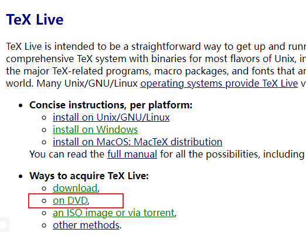
		- 
		- 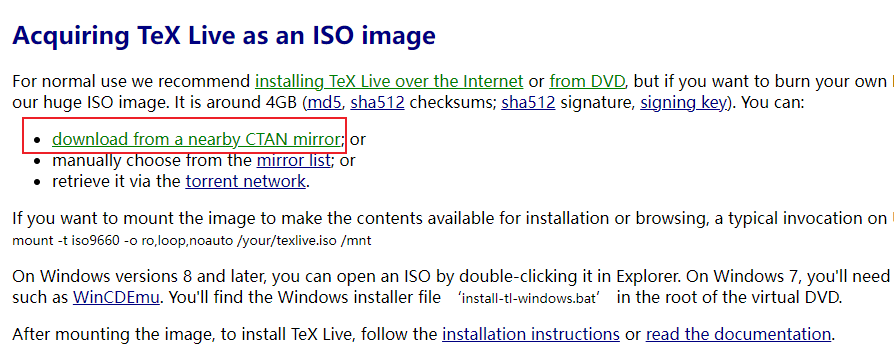
		- 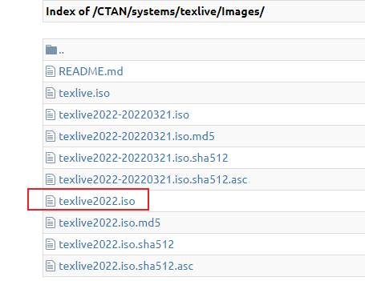
		-
	- 安装:
	  collapsed:: true
		- 将下载的iso文件, 解压
		- 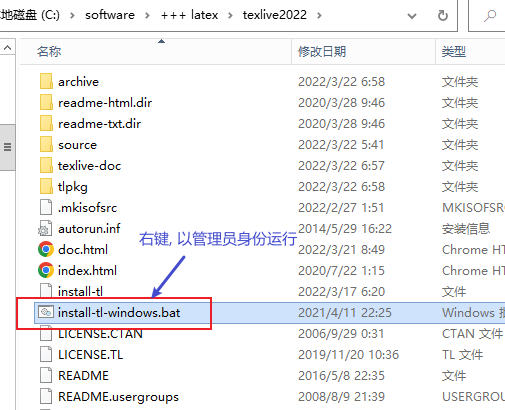
		- 安装路径, 一定要是英文的. 安装需要半小时
		-
		-
		-
	- 初次使用
	  collapsed:: true
		- 开始菜单, 打开这个程序
		- 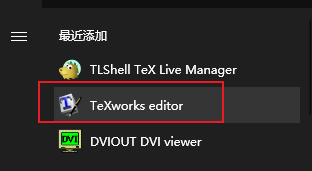
		- 选择 XeLaTex,  它对中文支持更好
		- 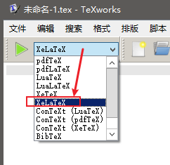
		- 然后拷贝如如下代码
		- ```
		  
		  \documentclass[UTF8]{ctexart}
		  
		  \begin{document}
		  
		  \section{中文} 中文论文排版测试。
		  
		  \end{document}
		  ```
		- 保存后, 按绿色按钮预览
		- 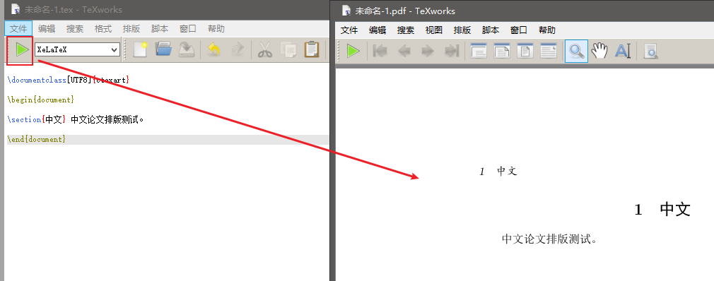
- ---
- TeXstudio软件设置
	- 界面转中文语言
	  collapsed:: true
		- 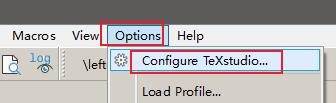
		- 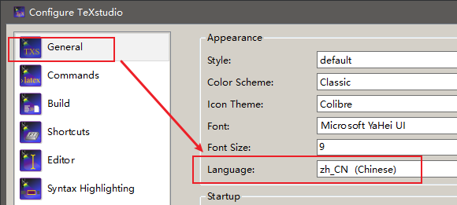
		-
	- 配置各种latex编译器
	  collapsed:: true
		- 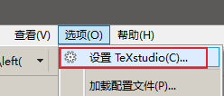
		- 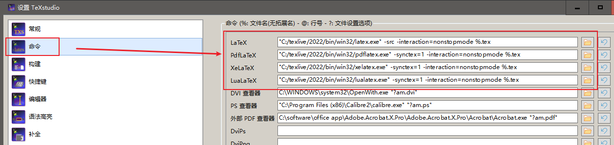
	- 显示行号
	  collapsed:: true
		- 在选项（O）-> 设置TeXstudio(C) 里面
		- 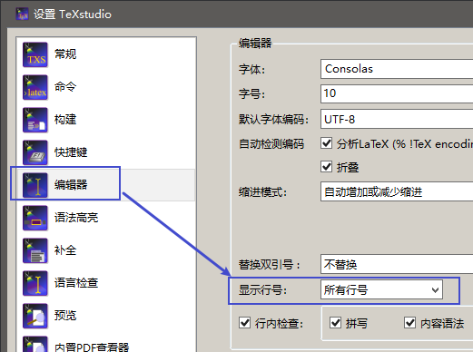
		- 现在, 每行代码前就有行号了
		- 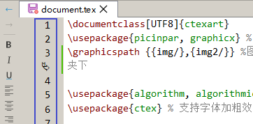
		-
	- 初次代码测试
	  background-color:: red
	  collapsed:: true
		- ```
		  \documentclass[UTF8]{ctexart}
		  
		  \usepackage{picinpar, graphicx} % 导入这个库后,就能支持插入表格
		  \graphicspath {{img/},{img2/}} %图片目录在当前目录的 img 和 img2文件夹下
		  
		  \usepackage{algorithm, algorithmic,amsmath, amssymb,bm} % 支持数学公式输入
		  \usepackage{ctex} % 支持字体加粗效果, 代码为 \textbf{加粗}
		  
		  \usepackage{multicol} %用于实现在同一页中实现不同的分栏
		  \usepackage{wrapfig} %用于实现图文混排
		  %\setlength{\parindent}{0pt} % 放在段首，之后的所有段落都将取消首行缩进
		  
		  \title{你的标题写在这里}
		  \author{作者名字}
		  \date{\today}
		  
		  \begin{document}
		  	\maketitle  %这行代码, 让你前面的 title, author, date生效
		  	\newpage  %分页
		  	
		  	\section{大标题} %大标题
		  	中文论文排版测试。
		  	\subsection {第二级标题} %会形如: 1.1,  2.1,   3.1 
		  	\subsubsection {第三级标题} %会形如 1.1.1,   2.1.1
		  	
		  	%插入表格
		  	\begin{table}[!t]
		  		\renewcommand{\arraystretch}{1.3}
		  		\caption{An Example of a Table}
		  		\label{table_example}
		  		\centering
		  		\begin{tabular}{|c||c|}
		  			\hline
		  			One & Two\\
		  			\hline
		  			Three & Four\\
		  			\hline
		  		\end{tabular}
		  	\end{table}
		  
		  
		  %插入图片. 图片目录一定要和.tex文件在同一目录下.
		  % 另外注意: [!t]、[width=2.5in] 这个是不能缺的
		  \begin{figure}[!t]
		  	\centering
		  	\includegraphics[width=2.5in]{img/j1.jpg}L
		  	\caption{Simulation results for the network.}
		  	\label{fig_sim}
		  \end{figure}
		  
		  
		  %插入latex公式
		  \begin{equation}
		  	\frac{2} {4}
		  	\int_a^b f(x) dx
		  \end{equation}
		  
		  	\begin{align}
		  		& 3\sqrt{x} - 2 \sqrt[3]{x} +4 \\
		  		& = 3x^{1/2} - 2 x^{1/3} +4 \\
		  		& when \ \mbox{当} x → ∞时, (3x^{1/2} - 2 x^{1/3} +4 ) ~ 3x^{1/2} \\
		  		& \text{显示中文}
		  	\end{align}
		  
		  \end{document}
		  ```
	- ### ★自定义代码片段
	  background-color:: red
	  collapsed:: true
		- 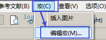
		- 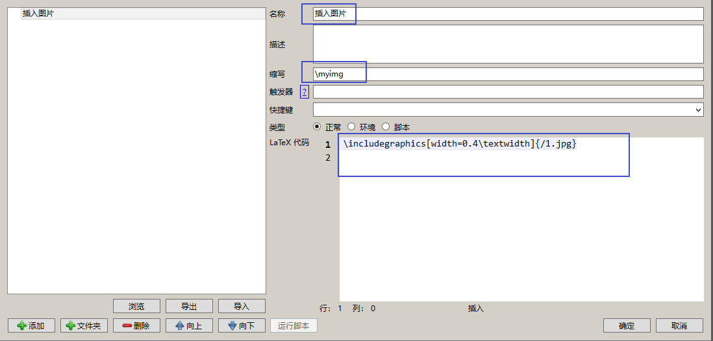
		- 然后, 你就可以输入 `\你自定义的缩写` 来输入该代码片段了
	- ### 自定义快捷键
	  background-color:: red
	  collapsed:: true
		- 将 ctrl+u, 作为给选中的文本添加"下划线"的快捷键. 注意, 使用时, 要先按 ctrl+m后, 再接着按 ctrl+u 才能生效
			- 在宏里面编辑脚本
			- ```
			  %SCRIPT
			  txt = cursor.selectedText()
			  editor.write("\\underline{"+txt+"}")
			  cursor.clearSelection()
			  ```
		- 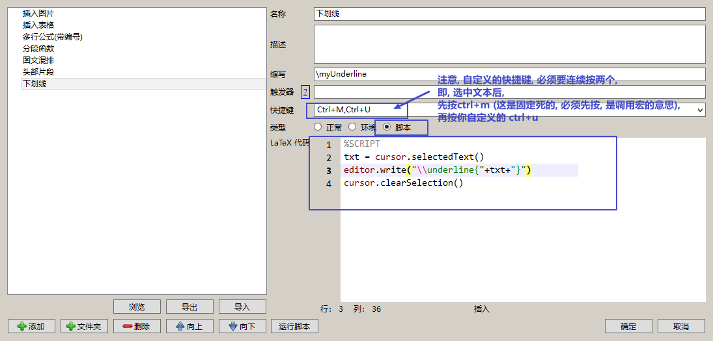
	-
	-
	-
	- 注释掉某行   按 ctrl+t (temp)
	- 删除整行  按 ctrl+k
	- 删除本行光标后的内容 Alt+K
	- 选中单词 Ctrl+D
	- 选中整行 (以回车键为分界)  Ctrl+L
	  background-color:: red
	-
	- 编译 F5
	- 生成 PDF: F6
	-
	- 插入行内公式：ctrl+shift+M （math的意思）
	  collapsed:: true
		- 
		- 注意, 这个快捷键, 和搜狗输入法有冲突, 必须在搜狗中关闭快捷键
		- 
	- ★ tex文本与pdf文本相互定位：ctrl+鼠标点击，或者F7(显示鼠标位置的pdf文本）
	  background-color:: red
	-
	-
-
- ---
- latex 语法
	- 支持数学公式
	  collapsed:: true
		- ```
		  要想使用\begin{align} 来输入数学公式的话，
		  需要在 \begin{document} 之前插入\usepackage{amsmath}
		  ```
	- ★ 在数学公式中, 支持中文字体
	  background-color:: red
	  collapsed:: true
		- 将中文, 输在 \mbox{ } 或 \text{} 里面.
	- 字体加粗  `\textbf{...}`
	  background-color:: red
	  collapsed:: true
		- 要引入这个包, 才能使用字体加粗效果
		- ```
		  \usepackage{ctex} % 支持字体加粗效果, 代码为 \textbf{加粗}
		  ```
		- 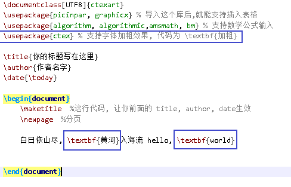
	- 下划线 `\underline{...}`
	  background-color:: red
	-
	- ### 数学公式
		- 行内公式 , 有三种写法:
		  collapsed:: true
			- ```
			  	行内公式的写法
			  	
			  	方法1:	
			  	% 行内公式, 写在两个$中
			  	$ \int_a^b f(x) dx$  
			  	
			  	方法2:
			  	% 也可以写在两个 \(  \) 中
			  	\( \frac{a} {b} \)
			  	
			  	方法3:
			  	% 写在 math 环境中
			  	\begin{math}
			  		\int_a^b f(x) dx
			  	\end{math}
			  ```
			- 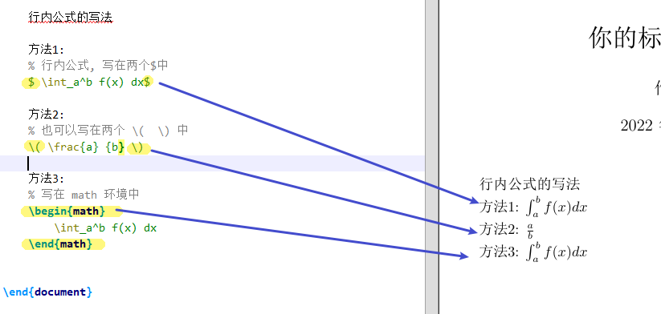
		- 行间公式, 有三种写法
		  collapsed:: true
			- ```
			  	行内公式的写法
			  	
			  	方法1:	
			  	% 行内公式, 写在两个$$  $$中
			  	$$ \int_a^b f(x) dx $$
			  	
			  	方法2:
			  	% 也可以写在两个 \[  \] 中
			  	\[ \frac{a} {b} \]
			  	
			  	方法3:
			  	% 写在 displaymath 环境中
			  	\begin{displaymath}
			  		\int_a^b f(x) dx
			  	\end{displaymath}
			  ```
			- 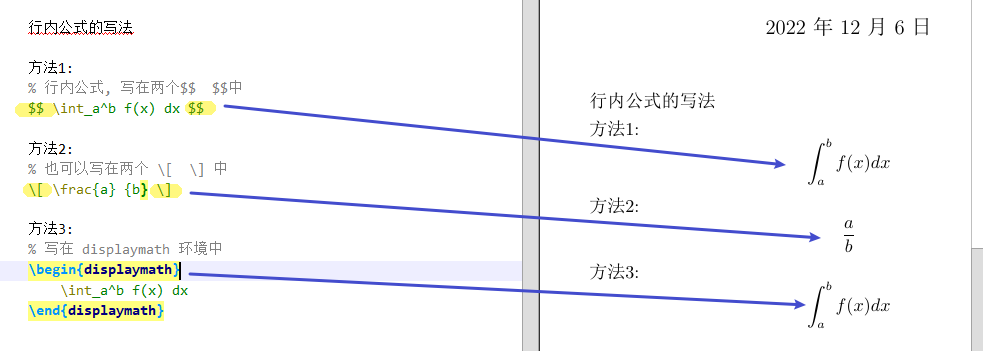
		- 在数学模式中, 使用中文:  `\text()`
		  collapsed:: true
			- 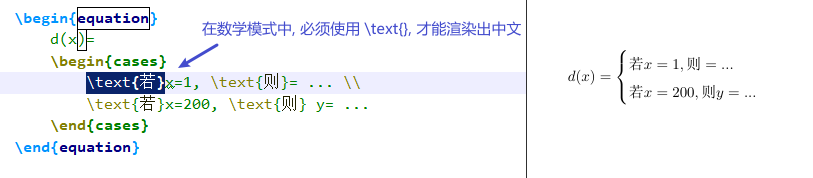
		-
		- 让数学公式, 带编号
		  background-color:: red
		  collapsed:: true
			- 单独成行的行间公式在LaTeX里由equation环境包裹。更多情况的是，我们需要罗列一系列公式，并令其按照等号对齐。目前最常用的是align环境，它将公式用 & 分隔为两部分并对齐。
			- 与equation环境相似的，可以用equation*环境生成不带编号的行间公式。与之相似的还有最常用的无编号行间公式环境 `\[...\]`，以及现在基本被淘汰的 `$$...$$` 环境。当然，还有完全等价的displaymath环境。
			- ```
			  	如果想让公式有编号, 就写在 equation 环境中
			  
			  	\begin{equation}
			  		\int_a^b f(x) dx \\  %注意: 在equation环境中,这样直接换行, 是无效的
			  		a^2 + b^2 = c^2
			  	\end{equation}
			  
			  
			  	\begin{equation}
			  		\begin{aligned}  % 在equation环境中, 必须再内部嵌套使用 aligned环境, 才能支持换行
			  			\int_a^b f(x) dx \\ 
			  			a^2 + b^2 = c^2				
			  		\end{aligned}	
			  \end{equation}
			  ```
			- 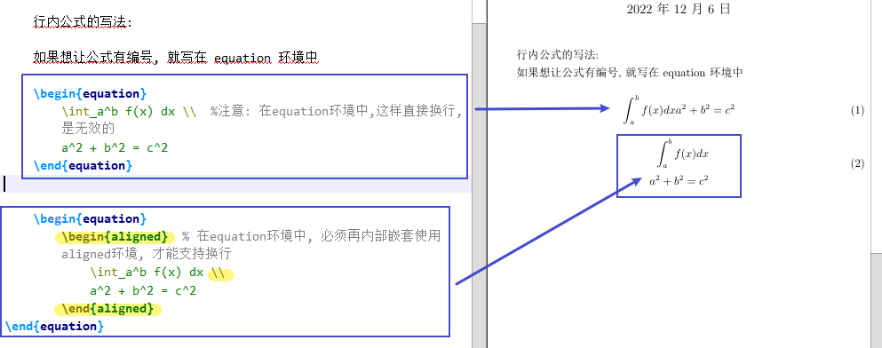{:height 217, :width 529}
		- 让数学公式, 无编号
		  collapsed:: true
			- ```
			  	如果不想让"行间公式"有编号, 就写在 equation* 环境中
			  
			  	\begin{equation*}
			  		\int_a^b f(x) dx \\  %注意: 在equation环境中,这样直接换行, 是无效的
			  		a^2 + b^2 = c^2
			  	\end{equation*}
			  
			  
			  	\begin{equation*}
			  		\begin{aligned}  % 在equation环境中, 必须再内部嵌套使用 aligned环境, 才能支持换行
			  			\int_a^b f(x) dx \\ 
			  			a^2 + b^2 = c^2				
			  		\end{aligned}	
			  	\end{equation*}
			  ```
			  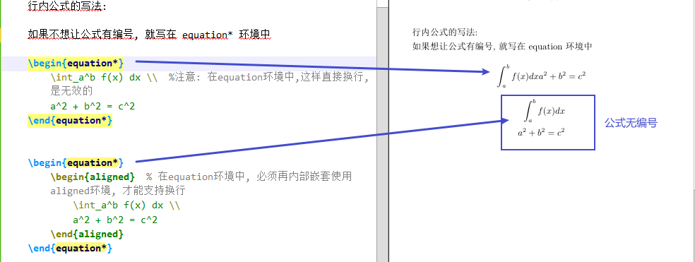
		- 数学公式中, 不能有空行, 否则报错
		  background-color:: green
		  collapsed:: true
			- 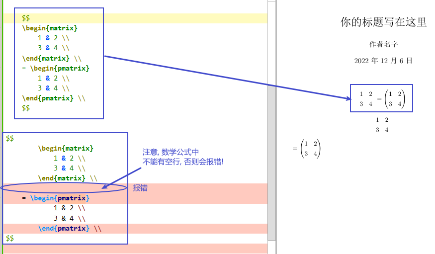
		- 多行公式 gather环境
		  background-color:: red
		  collapsed:: true
			- ```
			  	\begin{gather}  % gather环境能支持换行, 与每行编号
			  		a +b \\
			  		c-d   % 注意, 这最后一行后, 就不需要再加换行符\\了, 否则会多出一行隐藏的空行, 虽然它不会显示出来, 但会有编号. 结果这里就会变成 3个编号.
			  	\end{gather}
			  	
			  	
			  	\begin{gather*}  % gather*环境能支持换行, 但不编号
			  		a +b \\
			  		c-d 		
			  	\end{gather*}
			  
			  
			  	\begin{gather}  % gather环境中, 能用 \notag 来阻止编号
			  		a +b  \notag \\
			  		c-d 		
			  	\end{gather}
			  ```
			- 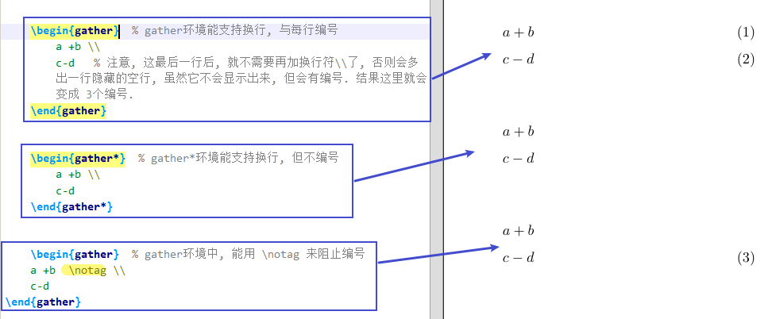
		- 多行公式  align环境
		  background-color:: red
		  collapsed:: true
			- ```
			  	\begin{align}  % align环境, 能支持换行, 与每行编号
			  		& a +b \\
			  		& c-d+e   % 注意, 这最后一行后, 就不需要再加换行符\\了, 否则会多出一行隐藏的空行, 虽然它不会显示出来, 但会有编号. 结果这里就会变成 3个编号.
			  	\end{align}
			  
			  	
			  	\begin{align*}  % align*环境, 能支持换行, 但不编号
			  		a +b &= 123 \\
			  		c-d +e &= 456789		
			  	\end{align*}
			  ```
			- 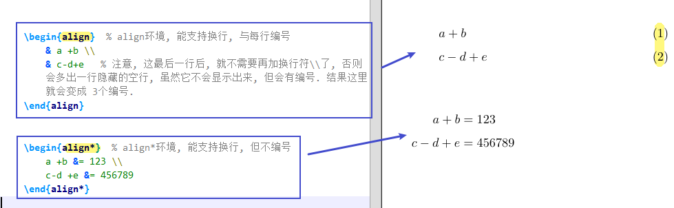
		- gather 和 align 环境的区别
		  collapsed:: true
			- 公式对齐用到的两个环境：align（对齐）和gather（居中）。
			  align环境主要是进行分隔符（&）指定的公式某个位置对齐，gather则是公式居中（没有分隔符），两者皆有自动的公式编号功能，另外还有少些用到的对齐环境aligned（对齐不编号）。我们利用这些环境来进行对多行公式进行编号。
			- gather和align是单独使用的，每行公式都有一个编号，某一行不添加编号，则在该行公式末加一句 `\notag`。align 和gather 有对应的不带编号的版本align* 和gather*
			  gathered和aligned是在 equation 环境中用的，是把几行公式组合为一个整体编号。
			- 参考《The LaTeX Mathematics Companion》的 2.11 一节。
			  或者《Ishort》4.4节。
		- 将多行公式, 只做一个编号 :  在equation环境中, 用 split环境
		  background-color:: red
		  collapsed:: true
			- ```
			  	\begin{equation}
			  		\begin{split}
			  			ab + bc\\
			  			&= cd  + xy \\
			  			&= ef
			  		\end{split}
			  	\end{equation}
			  ```
			- 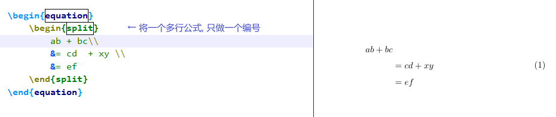
		-
		- 分段函数, 有大括号的: 在equation环境中, 用 cases环境
		  background-color:: red
		  collapsed:: true
			- ```
			  	\begin{equation}
			  		d(x)=
			  		\begin{cases}
			  			\text{若}x=1, \text{则}= ... \\
			  			\text{若}x=200, \text{则} y= ... 
			  		\end{cases}
			  	\end{equation}
			  ```
			- 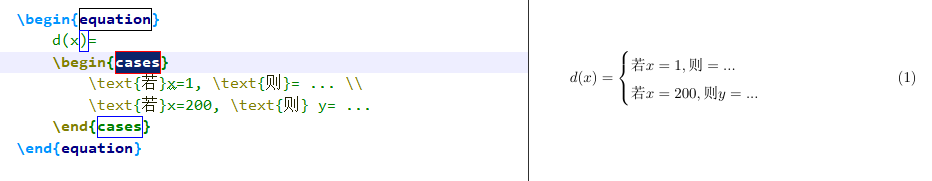
		-
		- 矩阵的写法
		  collapsed:: true
			- ```
			  	\[
			  	\begin{aligned}
			  			\begin{matrix}
			  				1 & 2 \\
			  				3 & 4 \\
			  			\end{matrix} \\
			  		\\
			  			\begin{pmatrix}  % 小括号
			  				1 & 2 \\
			  				3 & 4 \\
			  			\end{pmatrix} \\
			  		\\
			  			\begin{bmatrix}   % 中括号
			  			1 & 2 \\
			  			3 & 4 \\
			  		\end{bmatrix} \\
			  		\\ 
			  			\begin{Bmatrix}   % 大括号
			  			1 & 2 \\
			  			3 & 4 \\
			  		\end{Bmatrix} \\
			  		\\
			  		\begin{vmatrix}   % 单竖线
			  			1 & 2 \\
			  			3 & 4 \\
			  		\end{vmatrix} \\
			  		\\
			  		\begin{Vmatrix}   % 双竖线
			  			1 & 2 \\
			  			3 & 4 \\
			  		\end{Vmatrix} \\
			  	\end{aligned}
			  	\]
			  ```
			- 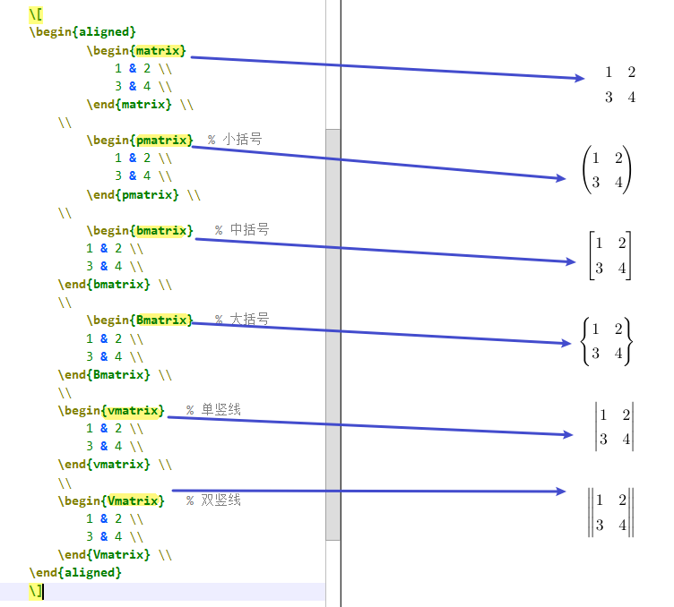
		-
		-
	-
	- ### 图像
		- 插入图像  `\includegraphics[width=2.5cm]{j1.jpg}`
		  background-color:: red
		  collapsed:: true
			- ```
			  \graphicspath {{img/},{img2/}} %图片目录在当前目录的 img 和 img2文件夹下
			  ---
			  \includegraphics[scale=0.3]{j1.jpg} % 插入图片. 这张图是在 img目录下的. 因为上面已经声明了图片目录的路径, 所以这里就不需要引用图片路径了, 可以直接引用图片名字.
			  \includegraphics[width=3cm]{j3.jpg} % 插入图片. 这张图是在 img2 目录下的
			  
			  %也可以使用绝对路径
			  \includegraphics[width=0.4\textwidth]{D:/Users/czm/Desktop/神经网络论文/1.jpg}    % 注意要使用/
			  
			  ```
			- 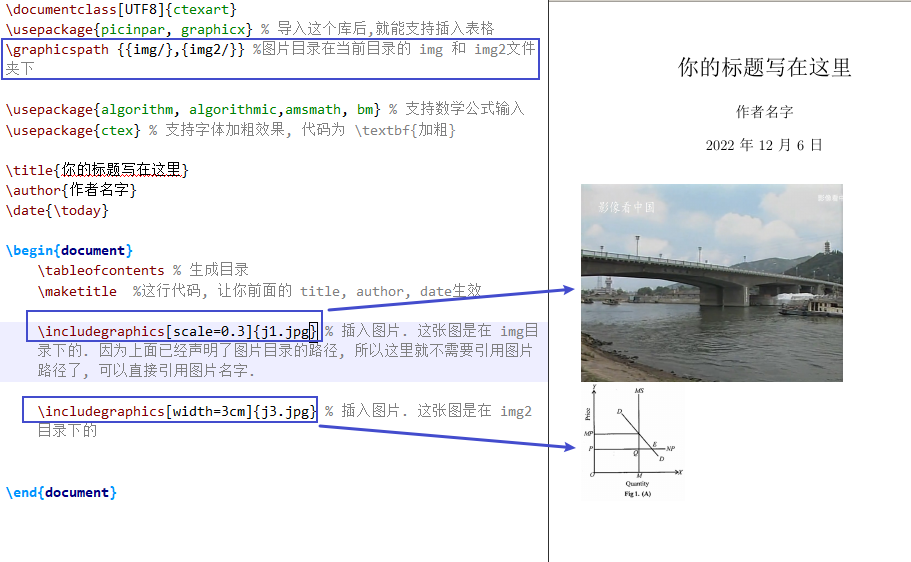
			-
		- 设置图片缩放宽度
		  collapsed:: true
			- ```
			  \includegraphics[width=0.5\linewidth ]{j1.jpg} % width=0.5\linewidth 表示将图像等比例缩小至页面整行文本宽度的0.5倍。
			  ```
			- 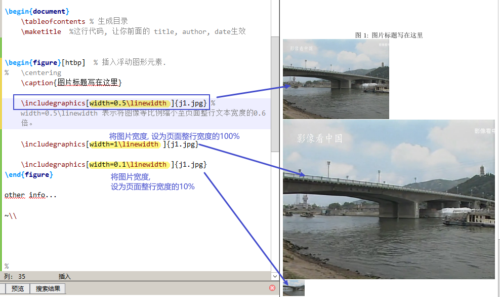
		- `\begin{figure}`
		  collapsed:: true
			- ```
			  \begin{figure}[htbp]  % 插入浮动图形元素. 默认位置会放在页面底部
			  	\centering % 注意, 这个代码顺序不能颠倒, 必须写在图片引用语句的前面, 才能让本figure浮动元素, 居中显示.
			  	\caption{图片标题写在这里}
			  	\includegraphics[width=2.5cm]{j1.jpg}
			  \end{figure}
			  
			  other info...
			  
			  ~\\  % 空行
			  
			  \begin{figure}[htbp] 
			  	\includegraphics[width=2.5cm]{j1.jpg}
			  	\caption{图片标题写在这里}
			  	\centering  % 如果你这条语句写在图片引用后面, 是不会生效的. 图片不会居中
			  \end{figure}
			  ```
			- 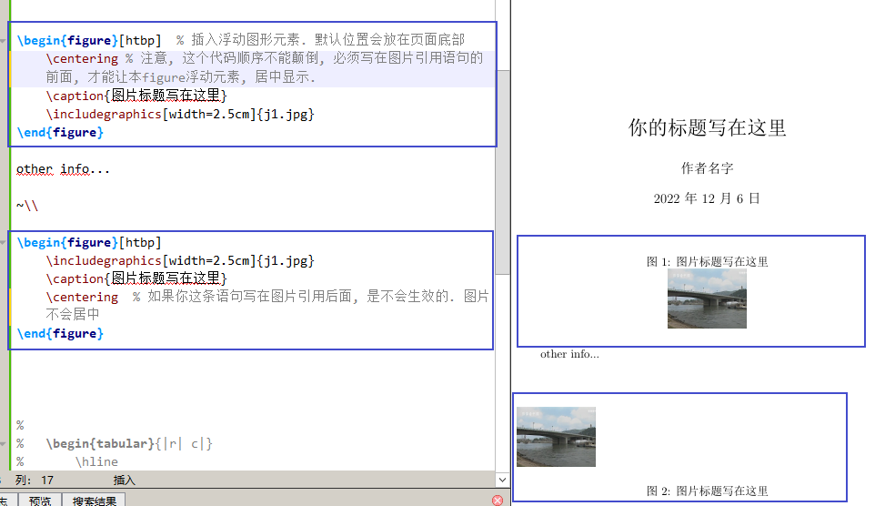
			- ```
			  \begin{figure}[~]是图片环境，常用选择项[htbp]是浮动格式：
			  
			  [h] ~ here，当前位置。将图形放置在正文文本中给出该图形环境的地方。如果本页所剩页面不够，这一参数将不起作用。
			  [t] ~ top，顶部。将图形放置在页面的顶部。
			  [b] ~ bottom，底部。将图形放置在页面的底部。
			  [p] ~ page of its own，浮动页。将图形放置在一个允许有浮动对象的页面上。
			  
			  一般使用[htb]这样的组合，只用[h]是没有用的。这样组合的意思就是LaTex会尽量满足排在前面的浮动格式，就是h-t-b这个顺序，让排版的效果尽量好。
			  
			  [!h]只是试图放在当前位置。如果页面剩下的部分放不下，还是会跑到下一页的。一般而言，用[!h]选项通常会出现不能正确放置的问题，所以常用[ht]、[htbp]等。
			  这里加感叹号的意思是 忽略 “美学” 标准。
			  ```
		-
	-
	- ### 表格
		- 插入表格
		  collapsed:: true
			- ```
			  	\begin{tabular}{l c c r}  % 表格中的列, 用{l c c r}来表示, 其中l(left)表示该列左对齐, c(center)代表该列中对齐, r(right)代表该列右对齐
			  		name & age & sex &  info \\
			  		zrx & 18 &  male &  sth.. \\
			  		wyy & 2000 & femal & sthing... \\
			  	\end{tabular}
			  
			  ~\\ % 加空行
			  
			  	\begin{tabular}{r| c| c |l}
			  		name & age & sex &  info \\
			  		zhouZhiRuo & 18 &  male &  sth.. \\
			  		wangYuYuan & 2000 & femal & sthing... \\
			  	\end{tabular}	
			  
			  ~\\
			  
			  	\begin{tabular}{r| c| c |l}
			  		\hline  % 表格中的横线
			  		name 	& age & sex &  info \\
			  		\hline
			  		zhouZhiRuo & 18 &  male &  sth.. \\
			  		\hline
			  		wangYuYuan & 2000 & femal & sthing... \\
			  		\hline
			  	\end{tabular}
			  ```
			- 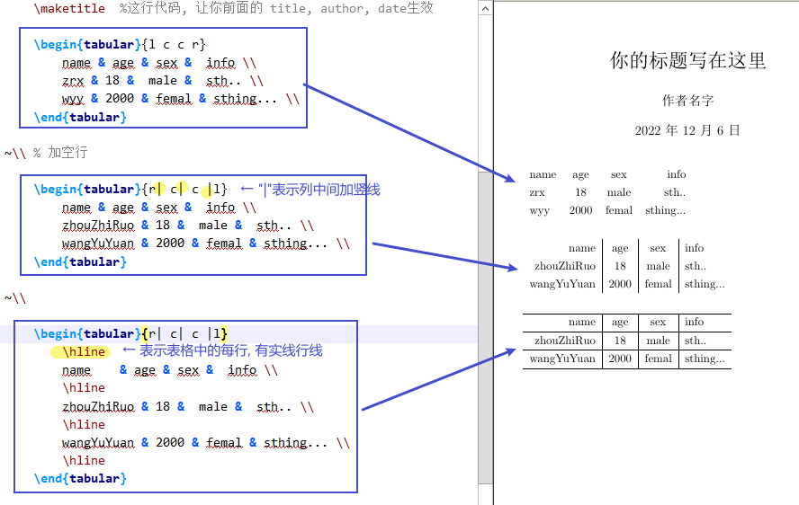
		- Table和Tabular的区别
		  collapsed:: true
			- 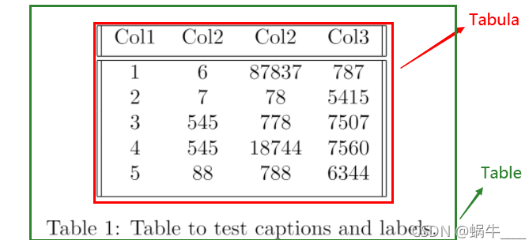
			- 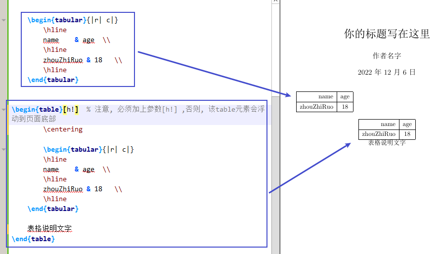
			- `\begin{table}[h!]` 中的`[h!]`是表格的参数，用来调整表格位置，具体有参数有
			  | 参数 | 位置 | 官方解释 |
			  | ---- | ---- | ---- |
			  | h | 以浮动的方式放置在当前位置，大概实在原文本出现的位置，但不完全是 | Place the float here, i.e., approximately at the same point it occurs in the source text (however, not exactly at the spot) |
			  | t | 放置在页面顶部 | Position at the top of the page. |
			  | b | 放置在页面底部 | Position at the bottom of the page. |
			  | p | 只为浮动设置一个特殊页面 | Put on a special page for floats only. |
			  | ! | 覆盖LaTex用于确认“良好”浮动的内部参数 | Override internal parameters LaTeX uses for determining “good” float positions. |
			  | H | 将浮动精确的放置在Latex代码中的位置，需要导入float包，与`h!`等价 | Places the float at precisely the location in the LATEX code. Requires the float package. This is somewhat equivalent to h! |
		-
	-
	- ---
	- ### 分栏
		- ★ 图文混排 wrapfigure环境
		  background-color:: red
		  collapsed:: true
			- ```
			  \usepackage{wrapfig} %用于实现图文混排
			  
			  -----------
			  
			  \begin{wrapfigure}[5]{r}[0em]{0.2\textwidth} % 靠文字内容的左侧
			  	\includegraphics[width=0.2\textwidth]{j1.jpg}	
			  \end{wrapfigure}
			  
			  111... 111... 111... 111... 111... 111... 111... 111... 111... 111... 111... 111... 111... 111... 111... 111... 111... 111... 111... 111... 111... 111... 111... 111... 111... 111... 111... 111... 111... 111... 111... 111... 111... 111... 111... 111... 111... 111... 111... 111... 111... 111... 111... 111... 111... 111... 111... 111... 111... 111... 111... 111... 111... 111... 111... 111... 111... 111... 111... 111... 111... 111... 111... 111... 111... 111... 111... 111... 111... 111... 111... 111... 111... 111... 111... 111... 111... 111... 111... 111... 111... 
			  ```
			- 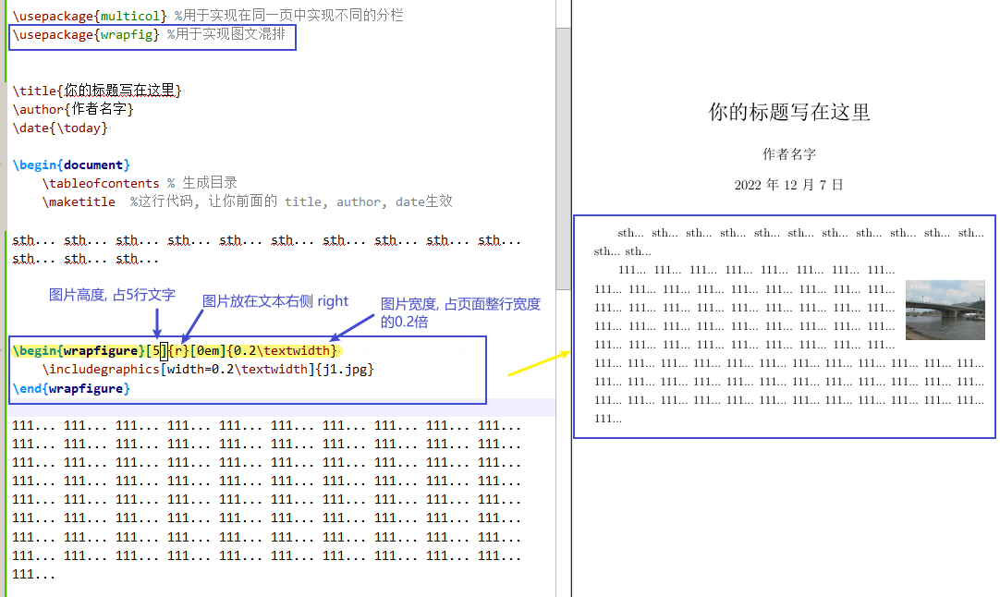
			- 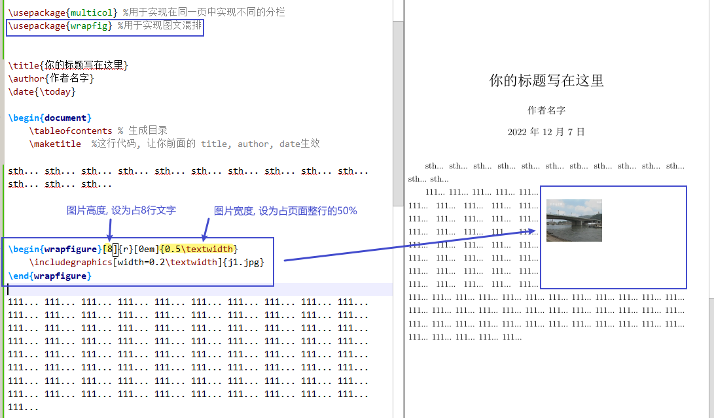
			- `\begin{wrapfigure}[行数]{位置}[超出长度]{宽度}<图形>\end{wrapfigure}`
			- 这其中的5个参数, 分别是:
				- 1.注意，行数两边是方括号，不是花括号！是指图形高度所占的文本行的数目，如果不给出此选项， wrapfig 会自动计算。
				- 2.位置
				  是指图形相对于文本的位置，须给定下面四项的一个。
				  r,R 表示图形位于文本的左边。
				  l,L 表示图形位于文本的右边。
				  i,R 表示图形位于页面靠里的一边（用在双面格式里）。
				  o,O 表示图形位于页面靠外的一边。
				- 3.超出长度
				  是指图形超出文本边界的长度，缺省为 0pt。
				- 4.宽度
				  指图形的宽度。 wrapfig 会自动计算 图形的高度。不过，我们也可设定图形的高度，具体可见 wrapfig.sty 内 的说明。
			- 注意事项
			  collapsed:: true
				- 在 wrapfigure 后必须紧接着输入段落文字，否则会出错。
				- 不能在任何列表环境中使用 wrapfigure，也不能在 列表环境前后使用，除非两者之间有一空行或分段指令 \par。
				- 如果将 wrapfigure 放在 \parbox 或小页环境 等分组中，文本折行必须在这些分组前结束。
				- 在双栏页版式中不能使用 wrapfigure。
				- 如果在 wrapfigure 中使用 figure 等 浮动对象，它的编号有可能不正确。
				- 如果在 wrapfigure 中使用 table 等浮动对象， 它上下方的横线可能被忽略，必须自己再加入。
				- 在折行的文本中， \linewidth 并没有改变。
			-
			-
			-
			-
		- 局部左右分栏(但无法控制哪个内容只在左栏, 哪个只在右栏)
		  collapsed:: true
			- ```
			  \usepackage{multicol} %用于实现在同一页中实现不同的分栏
			  ---
			  \begin{document}
			  
			      \columnseprule=1pt         % 实现插入分隔线, 就是分栏中, 中间的竖线
			  
			      \begin{multicols}{2}       % 分两栏 若花括号中为3则是分三列
			      你的内容写在这里... 会分成两栏显示
			      \end{multicols}
			  
			  \end{document}
			  ```
			- 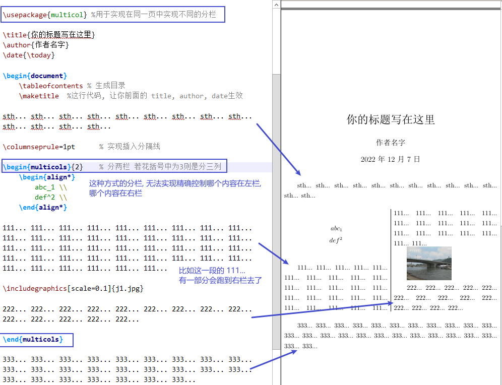
	-
	- ---
	- 生成toc目录
	  collapsed:: true
		- ```
		  \tableofcontents % 生成目录  ←该语句写在 \begin{document} 里面
		  ```
		- 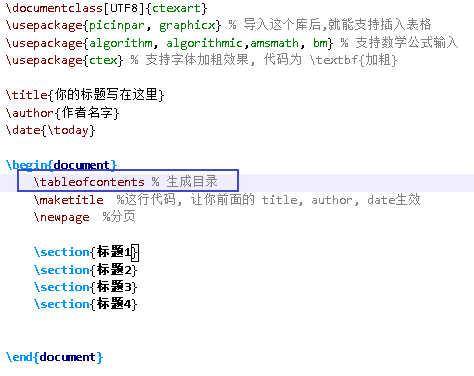
		-
	- 分页
		- ```
		  \newpage  %分页
		  ```
	- 取消段首缩进 (全局生效)
	  background-color:: red
	  collapsed:: true
		- ```
		  \setlength{\parindent}{0pt} % 放在段首，之后的所有段落都将取消首行缩进
		  ```
		- 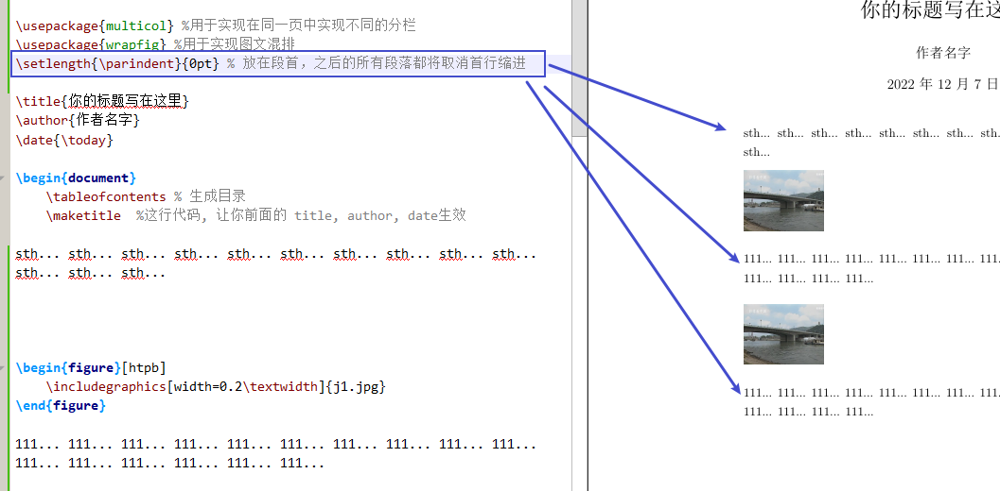
	- 取消段首缩进 (指定某行生效)
	  collapsed:: true
		- ```
		  \noindent %只取消该段的首行缩进
		  ```
		- 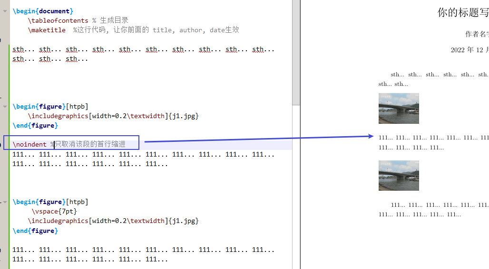
	- 加空行 :
	  background-color:: red
	  collapsed:: true
		- ```
		  ~\\       % 加空行
		  ```
	-
	- 单引号和双引号
	  collapsed:: true
		- ```
		  	'hel'lo -- "你好" \\  % 单引号和双引号, 不能这样写
		  	`hel'lo -- ``你好"  % 因为latex中, 左引号要用`, 右引号才是'
		  ```
		- 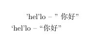
	- 连字符, 有三种写法
	  collapsed:: true
		- ```
		  	abc - def \\
		  	abc -- def \\
		  	abc --- def   % 这种效果最好
		  ```
		- 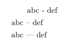
		-
	-
	-
-
-
-